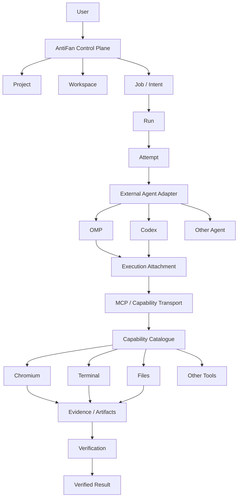
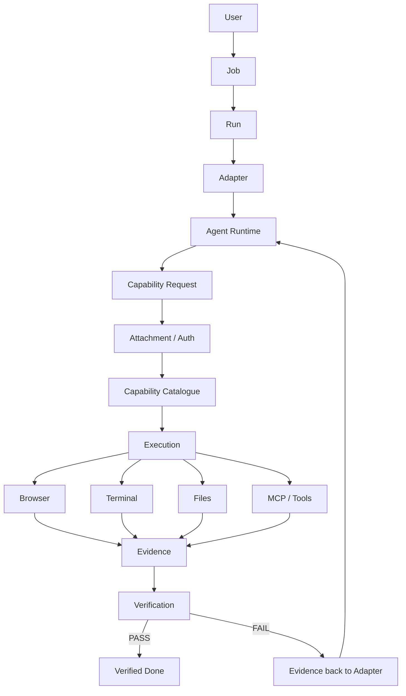

# AntiFan — Final Repo Analysis (main @ 5842b58)

> Phân tích lại theo **repo mới nhất**, lấy `main` tại commit `5842b58` ngày 26/08/2026 làm mốc. Trọng tâm: Control Plane, Agent Adapter boundary, MCP/Capability security, Run/Attempt, Chromium, Evidence/Verification và Recovery.

---

# Executive Summary

## Định nghĩa đúng về AntiFan

> **AntiFan là một Control Plane quản lý execution và công việc; Agent Runtime chỉ là thành phần được cắm vào qua Adapter.**

AntiFan không nên trở thành:

- Agent Runtime
- Reasoning engine
- Prompt framework
- Model router
- Agent swarm engine
- Một browser automation product độc lập

Agent Runtime chịu trách nhiệm:

- Reasoning
- Planning nội bộ
- Model-specific behavior
- Context management nội bộ
- Sub-agent nếu runtime hỗ trợ

AntiFan chịu trách nhiệm:

- Project / Workspace scope
- Job / Run / Attempt lifecycle
- Adapter execution boundary
- Capability access
- Policy / authorization
- Human input
- Browser target authority
- Events / Receipts / Artifacts
- Evidence
- Verification
- Recovery

---

# 1. Kiến trúc hiện tại



Đây là kiến trúc phù hợp với vision đã chốt:

> **AntiFan quản lý execution; Agent là implementation có thể thay thế.**

---

# 2. Điều đã thay đổi rất mạnh trong bản mới

Chuỗi commit gần nhất không chỉ thêm UI/browser feature.

Đợt hardening mới đã làm rõ boundary:

```text
External CLI
    ↓
Attachment
    ↓
Authenticated MCP
    ↓
Capability Transport
    ↓
Capability Catalogue
    ↓
Scoped Execution
```

Đây là một bước tiến kiến trúc rất lớn.

Commit `5bb1168` bổ sung một kế hoạch harden external CLI execution và MCP attachment enforcement với mục tiêu rõ ràng: Agent Runtime bên ngoài vẫn là replaceable execution backend/adapter, còn AntiFan giữ authority.

---

# 3. Attachment Registry — một trong những điểm mạnh nhất hiện tại

Agent process không thể tự khai báo:

```text
runId
aattemptId
tabId
workspace
```

rồi AntiFan tin.

AntiFan cấp một attachment với execution identity và các ràng buộc như:

```text
Run
Attempt
Project
Workspace
Backend
Process
Browser Target
Browser Epoch
Document Generation
Expiry
Revocation
```

Request phải vượt qua các kiểm tra tương ứng trước khi trở thành authenticated context.

Điều này biến attachment thành:

> **Execution identity**, không chỉ là auth token.

### Đánh giá: 9.5/10

---

# 4. Capability Catalogue đang là trái tim của Control Plane

`CapabilityCatalogue` hiện chịu trách nhiệm cho:

- Capability registration
- Visibility
- Risk
- Runtime lifecycle
- Runtime lease
- Project binding
- Workspace binding
- Policy / grant
- Browser target validation
- Dispatch

Mô hình:

```text
Agent
 ↓
Capability Request
 ↓
Authentication
 ↓
Scope Validation
 ↓
Policy
 ↓
Capability Dispatch
 ↓
Result
```

Đây là boundary cần giữ nguyên và tiếp tục đầu tư.

### Khuyến nghị

Không tạo thêm đường Browser/Terminal/MCP bypass ngoài Capability Gateway.

---

# 5. MCP hiện đã fail-closed

MCP không còn nên có kiểu:

```text
MCP request
 ↓
active tab fallback
 ↓
direct browser call
```

Mô hình mới là:

```text
MCP request
 ↓
Attachment Claims
 ↓
Attachment Validation
 ↓
Authenticated Context
 ↓
Capability Transport
 ↓
Capability Catalogue
```

Thiếu attachment, transport hoặc lineage phù hợp → fail closed.

Đây là architecture đúng với Control Plane.

---

# 6. Scope authority hiện đã rất rõ

AntiFan không để Agent tự quyết định:

> “Tôi đang làm trên project X.”

AntiFan xác định:

```text
Project
Workspace
Run
Attempt
Backend
BrowserTarget
```

rồi Capability layer kiểm tra tất cả trước khi dispatch.

Đây chính là đặc điểm của một Control Plane thật sự.

---

# 7. OMP hiện đã đúng vai trò hơn trước

OMP không nên được xem là “Agent của AntiFan”.

Mô hình nên hiểu là:

```text
AntiFan
  ↓
OMP Adapter
  ↓
OMP Runtime
```

OMP có thể thay đổi hoặc biến mất mà Control Plane vẫn giữ nguyên execution model.

Đây cũng là lý do Adapter boundary cần tiếp tục được chuẩn hóa.

---

# 8. Adapter abstraction — đã có nền, nhưng nên unify

`ExecutionBackend` đã là một abstraction tốt cho external execution:

```text
startRun()
cancel()
resume?()
```

Đã có backend implementation như Codex.

OMP hiện chủ yếu đi qua external MCP adapter script.

### Khuyến nghị

Dần dần unify thành một conceptual contract:

```text
AgentAdapter
├── OMP
├── Codex
├── Claude
└── Future Agent
```

AntiFan chỉ cần hiểu:

```text
Start
Send task/context
Receive progress
Receive request
Receive completion
Receive failure
Cancel
```

Không cần hiểu reasoning loop của Agent.

### Đánh giá: 9/10

---

# 9. Bridge — định nghĩa chính xác sau repo mới

Không nên nói đơn giản:

> “Bridge đã bỏ hoàn toàn.”

Mô tả chính xác hơn:

### Đã bỏ khỏi execution path chính

Đường Antigravity command client cũ đã bị xóa khỏi source.

### Vẫn tồn tại Bridge Server

Bridge Server vẫn còn như một compatibility/remote surface riêng và đang được harden.

Vì vậy:

> **Antigravity command injection path đã được loại bỏ khỏi execution architecture chính; Bridge Server còn lại là một surface riêng, không phải core Agent execution path.**

---

# 10. Security đã lên level rất cao

Đợt hardening mới xử lý nhiều lớp:

- Approved executable path
- Không dùng executable lookup tùy ý
- Không dùng shell tùy ý
- Canonical workspace path
- Path traversal prevention
- Symlink/junction/reparse escape prevention
- Attachment expiry
- Attachment revocation
- Process binding
- Host epoch
- Browser target binding
- Document generation
- Invocation replay protection
- Fail-closed MCP
- Renderer IPC trust boundary
- Bridge HTTP auth boundary

Đây là một trong những phần mạnh nhất của AntiFan hiện tại.

---

# 11. Browser Target đã trở thành execution identity

Browser target hiện chứa các khái niệm như:

```text
Project
Workspace
Runtime
Tab
Browser Epoch
Document Generation
URL
```

Điều này rất quan trọng.

Agent có thể có reference tới DOM của document cũ:

```text
Document A
 ↓
Agent reads element @e1
 ↓
Browser navigates
 ↓
Document B
```

Document generation giúp AntiFan biết reference cũ không còn hợp lệ.

Đây là một abstraction rất đúng cho browser Control Plane.

---

# 12. Split Desktop/Mobile hiện đã là logical multi-target browser

AntiFan hiện có:

```text
Logical Tab
├── Desktop Target
└── Mobile Target
```

kèm:

- Focus pane
- Synchronized navigation
- Paired reload
- Target routing
- Document generation synchronization
- Device frames/presets

Đây không còn chỉ là UI preview.

Nó là một phần của Browser Target model.

---

# 13. Chromium capabilities hiện có

Browser capability layer đã khá đầy đủ cho automation.

## Navigation

```text
browser.navigate
browser.reload
```

## Tabs

```text
browser.list-tabs
browser.open-tab
browser.close-tab
browser.switch-tab
```

## Observation

```text
browser.dom
browser.screenshot
browser.agent-snapshot
browser.diagnostics
```

## Interaction

```text
agent-move
agent-click
agent-type
agent-scroll
agent-hover
agent-highlight
agent-clear
agent-trajectory
keyboard-press
```

## Viewport

```text
set-viewport
set-device-preset
list-device-presets
set-zoom
```

## Responsive

```text
responsive-check
```

## Evaluation

```text
browser.eval
```

`eval` cũng đã có risk classification riêng.

### Kết luận

**Chromium automation hiện đã mạnh. Không nên tiếp tục đổ quá nhiều effort vào việc thêm thao tác click/type nhỏ lẻ.**

---

# 14. Chromium còn thiếu gì?

Điểm thiếu không phải automation.

Điểm thiếu là:

> **Browser Observability + Evidence + Verification**

---

# 15. Ưu tiên Browser #1 — Event Timeline

AntiFan đã có:

```text
Action
Screenshot
DOM
Console
Network failure
Artifact
Event
```

Nhưng nên ghép thành:

```text
Browser Session
 ↓
Event Timeline
```

Ví dụ:

```text
10:31:02  navigate /products/123
10:31:04  DOM ready
10:31:05  click Add to Cart
10:31:06  POST /cart → 200
10:31:07  console error
10:31:08  screenshot
10:31:10  verification failed
```

Mỗi event nên liên kết:

```text
runId
attemptId
tabId
paneId
timestamp
event type
artifact/evidence
```

### Tại sao?

Khi Job fail, AntiFan có thể trả lời:

> Nó fail ở đâu, sau hành động nào, browser đang ở trạng thái nào và evidence là gì?

### Ưu tiên: 10/10

---

# 16. Ưu tiên Browser #2 — Browser State Snapshot

Một primitive rất đáng làm:

```text
BrowserStateSnapshot
├── BrowserTarget
├── URL
├── title
├── browserEpoch
├── documentGeneration
├── viewport
├── semantic snapshot
├── diagnostics
└── screenshot
```

Đây là nền tốt cho:

- Debug
- Replay
- Evidence
- Handoff
- Visual verification

### Ưu tiên: 10/10

---

# 17. Ưu tiên Browser #3 — Debug Bundle

Thay vì Agent phải gọi nhiều capability nhỏ:

```text
DOM
+
Screenshot
+
Console
+
Network
+
Viewport
```

nên có một capability cấp cao:

```text
browser.debug_bundle
```

Ví dụ:

```text
Debug Bundle
├── URL
├── Title
├── Viewport
├── Semantic Snapshot
├── DOM Summary
├── Screenshot
├── Console Errors
├── Network Failures
└── Responsive State
```

Bundle có thể:

- Attach vào Run
- Trở thành Evidence
- Gửi cho Agent
- Đưa cho Human review

### Ưu tiên: 10/10

---

# 18. Ưu tiên Browser #4 — Network Inspector + Assertions

Hiện tại AntiFan đã có network failure diagnostics.

Nhưng chưa phải full network inspector.

Nên bổ sung:

```text
browser.network.inspect
browser.network.assert
```

Inspection:

```text
URL
Method
Status
Duration
Resource Type
Headers
Size
Timing
```

Assertion:

```text
POST /cart
status = 200
response contains line_items
```

Đặc biệt phù hợp với e-commerce.

### Ưu tiên: 9.5/10

---

# 19. Ưu tiên Browser #5 — Console Assertions

AntiFan đã capture console.

Bước tiếp theo:

```text
browser.console.assert
```

Ví dụ:

```text
Fail if:
- uncaught exception
- page error
- console.error
```

Kết quả:

```text
Uncaught exception: 0
Console errors: 0
Warnings: 3

PASS
```

Đây là bước biến diagnostics thành Verification.

### Ưu tiên: 9/10

---

# 20. Ưu tiên Browser #6 — Visual Diff

AntiFan đã có:

```text
Screenshot
Desktop/Mobile
Responsive
Artifact
```

Còn thiếu:

```text
Before
 ↓
After
 ↓
Diff
```

Ví dụ:

```text
Desktop
Similarity: 99.1%

Mobile
Similarity: 91.4%

Changed:
- Header height
- Product card spacing
- CTA position
```

Đặc biệt có giá trị cho theme/UI/web.

### Ưu tiên: 10/10

---

# 21. Ưu tiên Browser #7 — Performance

Nên có:

```text
browser.performance_check
```

Ví dụ:

```text
LCP: 2.1s
CLS: 0.03
INP: 170ms
Long Tasks: 1
JS payload: 812 KB
Image payload: 1.7 MB
```

Job có thể có acceptance criteria:

```text
LCP < 2.5s
CLS < 0.1
```

### Ưu tiên: 9/10

---

# 22. Ưu tiên Browser #8 — Accessibility

Nên có:

```text
browser.accessibility_check
```

Kiểm tra:

- Missing labels
- Heading hierarchy
- Contrast
- ARIA issues
- Keyboard accessibility

### Ưu tiên: 8.5/10

---

# 23. Human Takeover

Browser nên có ownership state:

```text
Agent owns Target
        ↓
Human takeover
        ↓
Human owns Target
        ↓
Return to Agent
```

Use case:

- Login
- 2FA
- CAPTCHA
- OAuth
- Payment confirmation
- Admin approval

Đây nên là Control Plane state, không chỉ là UI action.

### Ưu tiên: 9/10

---

# 24. Workflow Engine hiện tại

Không cần đóng băng Workflow Engine.

Workflow hiện tại đã làm đúng nhiều thứ:

- Validate schema
- Validate target
- Dispatch Capability
- Retry
- Timeout
- Abort
- Collect artifacts
- Final workflow result

Đúng abstraction là:

```text
Workflow = how to execute
Verification = whether the outcome is acceptable
```

Đừng để:

```text
workflow passed
```

đồng nghĩa với:

```text
Job verified
```

---

# 25. Run / Attempt hiện đã mạnh

`RunRecord` và `ExecutionAttempt` hiện đã có lineage:

```text
Run
├── project
├── workspace
├── backend
└── state

Attempt
├── run
├── project
├── workspace
├── backend
├── session
├── prompt digest
└── execution metadata
```

Đây là nền tốt.

---

# 26. Nhưng Job vẫn nên trở thành object riêng

Hiện Run/Attempt đã rất rõ, nhưng Job chưa phải first-class object hoàn chỉnh.

Nên thêm một lớp mỏng:

```text
Job
├── intent
├── project
├── workspace
├── status
├── activeRun
└── runs[]
```

Mục tiêu không phải xây subsystem khổng lồ.

Mục tiêu là giúp:

```text
Retry
Resume
Handoff
History
```

trở thành thao tác trên **công việc**, không phải process.

---

# 27. Evidence / Receipt / Verification phải tách ba khái niệm

## Receipt

> Agent/Adapter đã thực hiện hoặc báo cáo execution gì?

## Evidence

> AntiFan đã quan sát/thu thập được gì?

## Verification

> AntiFan kết luận gì từ evidence?

Ví dụ:

```text
Receipt
→ OMP says: "clicked Add to Cart"

Evidence
→ browser saw POST /cart 200
→ screenshot shows cart count = 1

Verification
→ PASS
```

Đây là một architecture rất mạnh.

---

# 28. EventStore nên trở thành nguồn của Execution Timeline

EventStore hiện đã có:

- JSONL persistence
- sequence
- project/workspace lineage
- replay
- corrupt-tail recovery
- checkpoint

Không nên dùng nó chỉ để log.

Nên dùng nó để dựng:

```text
Run Timeline
```

Ví dụ:

```text
adapter.start
capability.call
browser.navigate
browser.screenshot
capability.result
evidence.created
verification.failed
run.completed
```

Timeline gần như sẽ xuất hiện tự nhiên từ event architecture hiện tại.

---

# 29. Recovery — design rất đúng, cần xác minh E2E

Nguyên tắc:

```text
restart
 ↓
hydrate Run/Attempt
 ↓
invalidate old attachments
 ↓
probe owned process/target khi safe
 ↓
completed / failed / interrupted / unknown
```

Và đặc biệt:

> **Không tự retry một mutation khi state là unknown.**

Đây là nguyên tắc rất đúng.

Phần này nên được test end-to-end mạnh hơn, nhất là:

- Electron restart
- Process còn sống
- Browser target còn sống
- Attachment cũ
- Unknown mutation
- MCP reconnect

---

# 30. Root Bootstrap

`src/main/index.ts` hiện là composition root khá lớn:

```text
Electron bootstrap
Browser
Control Plane
Capability wiring
Bridge
MCP
Profile
Cookie
Workspace
```

Chưa phải vấn đề cấp bách, nhưng về sau nên tách:

```text
AppBootstrap
ControlPlaneBootstrap
BrowserBootstrap
TransportBootstrap
RecoveryBootstrap
```

Đây là cleanup về khả năng bảo trì, không phải P0.

---

# 31. Testing

Điểm rất tốt của repo mới là test đang tập trung vào invariant khó:

- Capability Catalogue
- Run lifecycle
- Attachment
- MCP authentication
- Project/workspace ownership
- OMP MCP adapter
- Split review
- Native tab lifecycle
- Shortcut invariants

Đặc biệt các test kiểu:

> authentication fail → host-side spy không được gọi

là loại test rất đúng với một Control Plane.

---

# 32. Đánh giá hiện tại

| Tầng | Đánh giá |
|---|---:|
| Control Plane boundary | 9.5/10 |
| Run / Attempt lifecycle | 9/10 |
| External Agent boundary | 9/10 |
| MCP Security | 9.5/10 |
| Capability model | 9.5/10 |
| Workspace isolation | 9/10 |
| Browser Target model | 9.5/10 |
| Split Desktop/Mobile | 9/10 |
| Browser automation | 9/10 |
| Evidence foundation | 8/10 |
| Verification | 7/10 |
| Recovery | 7.5/10 |
| Adapter abstraction | 8/10 |
| Workflow | 8.5/10 |
| Observability | 7.5/10 |
| Architecture clarity | 8.5/10 |

---

# 33. Roadmap đề xuất

## P0 — Control Plane Core

### Đã tiến rất xa

- Run
- Attempt
- Attachment
- MCP authentication
- Capability enforcement
- Workspace containment
- Browser target authority
- Replay protection
- Process binding
- Security boundary

Không cần tiếp tục mở rộng security architecture một cách lớn nếu chưa có threat mới.

## P1 — Execution Closure

1. **Job layer mỏng**
2. **Evidence model hoàn chỉnh**
3. **Verification API**
4. **Browser Timeline**
5. **Browser State Snapshot**
6. **Debug Bundle**
7. **Recovery E2E**

## P2 — Browser Quality

- Full Network inspection/assertion
- Visual diff
- Performance
- Accessibility
- Human takeover

## P3 — Scale

- Adapter standardization
- Adapter handoff
- Remote execution
- Mobile control
- GitHub / issue integrations
- Multi-agent orchestration

---

# 34. Những thứ không nên làm lúc này

Không ưu tiên:

- Agent swarm
- Model router
- Agent reasoning loop riêng
- Prompt framework
- Worktree-first architecture
- Browser video recording
- Thêm nhiều browser action nhỏ
- Agent animation expansion
- BrowserTools bypass Capability Gateway

Các capability mới phải tiếp tục đi qua:

```text
Authentication
 ↓
Policy
 ↓
Scope
 ↓
Capability
 ↓
Execution
 ↓
Evidence
 ↓
Verification
```

---

# 35. Vision cuối cùng



---

# 36. Kết luận chiến lược

Sau khi đọc lại `main` mới nhất, tôi không nghĩ AntiFan cần đổi vision.

Ngược lại, bản mới **xác nhận vision Control Plane + Adapter là đúng**.

AntiFan hiện đã mạnh ở:

> **Authority**

- ai được làm gì
- trên project nào
- workspace nào
- run nào
- browser target nào
- process nào

Phần đang thiếu tương đối là:

> **Truth**

- Agent thực sự làm gì?
- Browser thực sự quan sát được gì?
- Evidence nào chứng minh điều đó?
- Khi nào có thể nói “đã hoàn thành”?

Vì vậy bước tiếp theo quan trọng nhất không phải:

> “Thêm Agent.”

Cũng không phải:

> “Thêm Browser action.”

Mà là:

```text
AUTHORITY
   ↓
EXECUTION
   ↓
OBSERVATION
   ↓
EVIDENCE
   ↓
VERIFICATION
   ↓
VERIFIED RESULT
```

## Một câu định nghĩa AntiFan sau bản repo mới

> **AntiFan là Control Plane nắm authority trên execution, còn Agent Runtime chỉ thực hiện công việc thông qua Adapter; AntiFan quan sát execution, thu thập Evidence và quyết định kết quả đã Verified hay chưa.**

Đây là hướng phù hợp nhất với source hiện tại và có khả năng mở rộng tốt nhất.
