# AntiFan — Báo cáo phân tích các điểm cải thiện đáng giá nhất

**Phiên bản phân tích:** nhánh `main`, trạng thái repo quan sát ngày 25/08/2026  
**Phạm vi:** tập trung vào source code và kiến trúc hiện tại; không dùng README làm cơ sở chính để kết luận kiến trúc.  
**Mục tiêu:** tìm các cải thiện có tỷ lệ **Impact / Effort** cao nhất, tránh biến AntiFan thành một sản phẩm quá rộng trước khi phần lõi trở nên thật sự mạnh.

---

# Executive Summary

AntiFan hiện đã vượt qua giai đoạn “Electron browser có thêm terminal”. Cấu trúc source cho thấy hệ thống đang có các subsystem riêng cho:

- Agent
- Browser
- Chat
- Control Plane
- MCP
- Project / Workspace
- Run
- Session
- Security
- Tools / Capabilities
- Workflow
- QA

Đây là một nền tảng tốt để AntiFan trở thành **local AI workbench / agent harness**. Điểm mạnh nhất hiện tại không phải từng tính năng riêng lẻ mà là hướng kiến trúc đang hội tụ vào một lớp điều phối chung: **Control Plane + Capability Layer + Run/Session lifecycle**.

Tuy nhiên, rủi ro lớn nhất cũng xuất hiện từ chính sự phát triển này: AntiFan đang có rất nhiều subsystem trước khi “contract trung tâm” giữa Agent → Intent → Run → Capability → Verification được chuẩn hóa hoàn toàn.

## Kết luận ưu tiên

Nếu chỉ chọn **5 việc đáng làm nhất tiếp theo**, tôi ưu tiên:

1. **Chuẩn hóa Agent Task Contract và Run Lifecycle**
2. **Biến Capability Catalogue thành API duy nhất cho mọi action**
3. **Xây Verification / Evidence Loop first-class**
4. **Làm Agent Adapter Layer để hỗ trợ nhiều CLI mà không khóa kiến trúc**
5. **Tạo một Execution Timeline / Debugger cho toàn bộ agent run**

Đây là các cải thiện có thể nâng AntiFan từ “nhiều feature tốt” thành “một harness có hệ điều hành rõ ràng”.

---

# 1. Bức tranh kiến trúc hiện tại

Có thể mô hình hóa AntiFan hiện tại như sau:

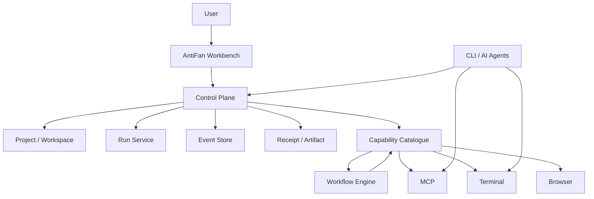

Kiến trúc này có tiềm năng tốt vì nó đang phân biệt tương đối rõ:

- **Surface**: UI, browser, terminal
- **Execution**: run, workflow, agent
- **Capabilities**: các hành động hệ thống có thể thực thi
- **State / Evidence**: events, receipts, artifacts
- **Scope**: project, workspace, session

Điểm cần làm tiếp theo không phải thêm thêm một surface mới. AntiFan nên đầu tư vào **hợp nhất execution semantics** giữa các surface hiện có.

---

# 2. Ưu tiên #1 — Chuẩn hóa “Task → Run → Result” thành hợp đồng trung tâm

## Hiện trạng

AntiFan đã có Run, Session, Event Store, Receipt Store, Workflow và Agent subsystem. Đây là các mảnh rất tốt, nhưng giá trị tối đa chỉ xuất hiện khi mọi execution đều đi qua cùng một lifecycle.

Hiện tại có nguy cơ các đường thực thi khác nhau phát triển riêng:

```text
User → Terminal → CLI agent → kết quả

User → Workflow → Capability → kết quả

User → MCP → Browser → kết quả
```

Nếu mỗi đường có cách biểu diễn trạng thái khác nhau, sau này sẽ rất khó:

- quan sát
- retry
- resume
- audit
- debug
- orchestration giữa nhiều agent

## Đề xuất

Định nghĩa một contract cấp lõi:

```ts
TaskIntent
  ↓
ExecutionPlan
  ↓
Run
  ↓
RunStep[]
  ↓
CapabilityCall[]
  ↓
Evidence / Artifact
  ↓
Verification
  ↓
FinalResult
```

Ví dụ:

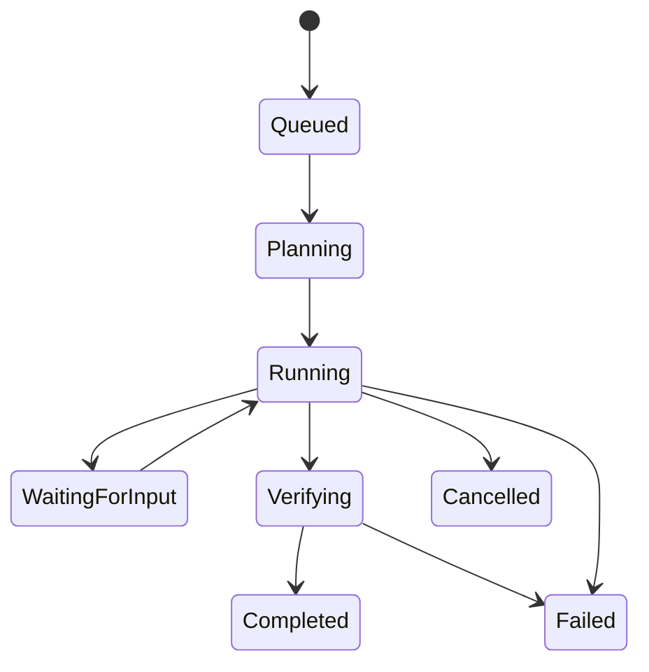

## Vì sao đây là ưu tiên số 1?

Vì sau này dù bạn thay:

- OMP
- Codex CLI
- Claude Code
- DeepSeek
- agent nội bộ

thì **Run Contract vẫn không thay đổi**.

AntiFan sẽ sở hữu execution model thay vì phụ thuộc vào model/agent nào.

### Impact: 10/10  
### Effort: 7/10  
### ROI: Rất cao

---

# 3. Ưu tiên #2 — Capability Catalogue phải trở thành “Single Execution API”

## Vấn đề cần tránh

Nếu một agent có thể gọi trực tiếp:

- browser manager
- terminal manager
- filesystem
- Electron APIs
- workflow internals

thì capability abstraction sẽ bị bypass.

Điều đó làm:

- permission khó kiểm soát
- audit không đầy đủ
- retry khó chuẩn hóa
- workflow không thể tái sử dụng action của agent
- plugin khó phát triển

## Kiến trúc nên hướng tới

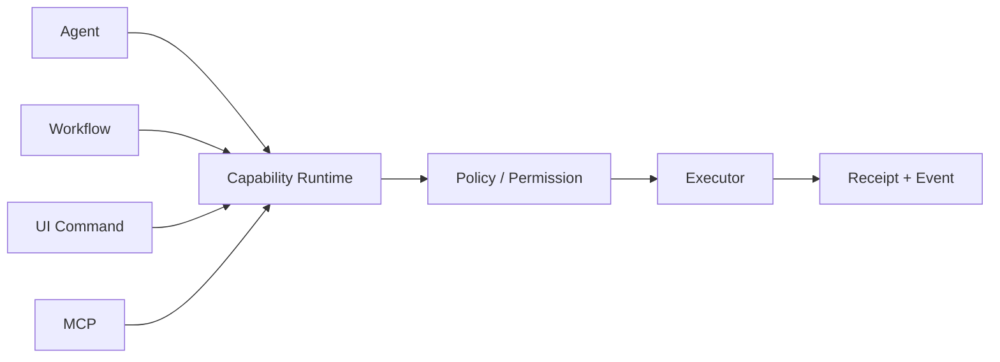

Tất cả action quan trọng nên có cùng cấu trúc:

```ts
interface CapabilityCall {
  capability: string;
  input: unknown;
  target?: ExecutionTarget;
  projectId?: string;
  workspaceId?: string;
  runId?: string;
  idempotencyKey?: string;
}
```

Kết quả:

```ts
interface CapabilityResult {
  status: "success" | "failed" | "cancelled";
  output?: unknown;
  artifacts?: ArtifactRef[];
  receiptId: string;
}
```

## Giá trị lớn nhất

Sau này bạn có thể làm:

> “Replay chính xác những gì agent đã làm.”

Hoặc:

> “Agent A lên plan, Agent B execute, Agent C verify.”

Tất cả dùng chung capability contract.

### Impact: 10/10  
### Effort: 8/10  
### ROI: Rất cao

---

# 4. Ưu tiên #3 — Verification / Evidence Loop

Đây theo tôi là **feature có thể tạo khác biệt thực tế lớn nhất cho workflow của bạn**.

Bạn đang dùng AntiFan để làm những việc liên quan:

- browser
- UI
- theme
- web development
- responsive review
- DOM inspection

Các agent coding thường mạnh ở “thay đổi code” nhưng yếu ở “chứng minh rằng thay đổi đó đúng”.

## AntiFan có lợi thế sẵn có

AntiFan đã có:

- Chromium thật
- DOM inspection
- Screenshot
- Desktop/Mobile split review
- Terminal
- Artifacts
- Workflow

Nên AntiFan có thể đóng vòng:

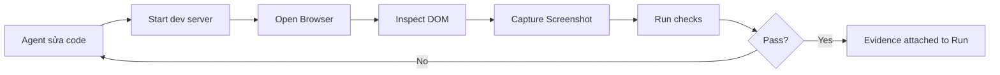

## Đề xuất

Tạo `VerificationPolicy` cho mỗi loại task:

### UI task

- page load thành công
- console không có lỗi nghiêm trọng
- target selector tồn tại
- screenshot evidence
- desktop/mobile verification

### Code task

- typecheck
- test
- build
- targeted runtime check

### Browser task

- navigation committed
- expected DOM state
- screenshot
- optional network check

## Tại sao quan trọng?

Nó biến AntiFan từ:

> “Agent có tool để làm”

thành:

> “Agent phải tạo evidence rằng nó đã làm đúng.”

Đây là điểm rất hợp với một AI harness.

### Impact: 10/10  
### Effort: 6/10  
### ROI: Cực cao

---

# 5. Ưu tiên #4 — Agent Adapter Layer

Hiện tại AntiFan có thể làm việc với các CLI agent khác nhau. Nhưng đừng để từng agent trở thành một integration đặc biệt.

## Kiến trúc đề xuất

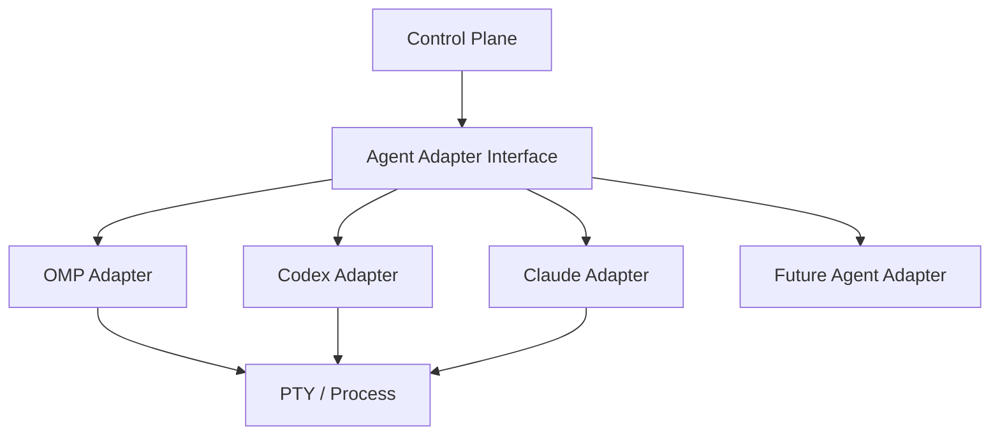

Một interface tối thiểu:

```ts
interface AgentAdapter {
  id: string;

  start(request: AgentStartRequest): Promise<AgentRun>;
  sendInput(runId: string, input: AgentInput): Promise<void>;
  interrupt(runId: string): Promise<void>;
  getStatus(runId: string): Promise<AgentStatus>;
}
```

## Điều quan trọng

Không nên cố ép mọi agent phải có cùng feature.

Nên dùng capability discovery:

```text
OMP:
  supportsSteering = true
  supportsStructuredEvents = false

Codex:
  supportsPlan = true
  supportsReview = true

Claude:
  supportsSubagents = true
```

Control Plane chọn workflow dựa trên capability của agent.

### Impact: 9/10  
### Effort: 6/10  
### ROI: Rất cao

---

# 6. Ưu tiên #5 — Execution Timeline / Agent Debugger

Hiện tại hệ thống có Event Store và Receipt Store. Đây là cơ hội lớn.

Tôi nghĩ AntiFan nên có một UI dạng:

```text
RUN #481  ───────────────────────────────────
10:02:11  Intent created
10:02:13  OMP started
10:02:20  Agent inspected project
10:02:42  Terminal command executed
10:02:58  Browser navigated
10:03:04  DOM inspected
10:03:09  Screenshot captured
10:03:14  Verification failed
10:03:20  Agent corrected code
10:03:39  Verification passed
10:03:40  Run completed
```

Mỗi event có thể expand để xem:

- input
- output
- target
- artifact
- error
- receipt

## Đây là “debugger cho agent”

Khi agent làm sai, thay vì hỏi:

> “Sao nó lại làm vậy?”

Bạn có thể nhìn:

```text
Intent → Decision → Tool call → Observation → Next decision
```

Điều này cực kỳ có giá trị khi AntiFan ngày càng autonomous.

### Impact: 9/10  
### Effort: 5/10  
### ROI: Rất cao

---

# 7. Ưu tiên #6 — Context phải trở thành một subsystem rõ ràng

Đây là điểm tôi thấy chưa nên để agent tự giải quyết hoàn toàn.

Hiện nay context có thể đến từ:

- terminal session
- project
- workspace
- annotation
- artifact
- browser state
- chat
- run history

Nếu cứ gửi tất cả vào agent, context sẽ:

- phình to
- duplicate
- mâu thuẫn
- tốn token
- làm agent mất focus

## Đề xuất: Context Pack

Trước khi gọi agent, Control Plane tạo:

```text
Context Pack
├── Task intent
├── Project summary
├── Relevant files
├── Relevant browser state
├── Selected artifacts
├── Current run state
└── Constraints
```

Agent không cần biết tất cả state nội bộ AntiFan.

Nó nhận đúng “working set” cho task.

### Impact: 9/10  
### Effort: 7/10  
### ROI: Cao

---

# 8. Ưu tiên #7 — Durable Long-Running Runs

Khi dùng CLI agent, task có thể chạy:

- 30 phút
- vài giờ
- qua nhiều bước
- cần user approval

Nếu AntiFan bị restart hoặc Electron crash, run không nên biến mất.

## Nên có

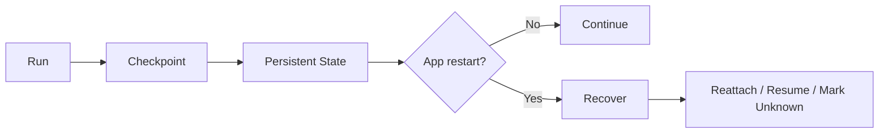

Không phải mọi process đều resume được, nhưng trạng thái cần phân biệt:

- process còn sống và có thể reattach
- process chết
- state không xác định
- cần user quyết định

Đây là phần giúp AntiFan “đủ tin cậy để giao việc dài”.

### Impact: 8/10  
### Effort: 8/10  
### ROI: Cao, nhưng làm sau Run Contract

---

# 9. Ưu tiên #8 — Project Intelligence, nhưng đừng vội dùng LLM everywhere

AntiFan của bạn làm việc theo project/workspace. Đây là lợi thế.

Tôi đề xuất xây một `Project Snapshot` có cấu trúc:

```text
.antifan/
├── project.json
├── architecture.md
├── conventions.md
├── commands.json
└── context/
    ├── recent-summary.md
    └── known-issues.json
```

Agent khi vào project có thể biết:

- tech stack
- package manager
- test command
- build command
- architecture summary
- coding conventions
- important files

## Nhưng không cần vector database ngay

Giai đoạn đầu:

1. deterministic discovery
2. generated project summary
3. explicit artifacts
4. selective file context

là đủ.

Chỉ thêm retrieval phức tạp khi thật sự cần.

### Impact: 8/10  
### Effort: 5/10  
### ROI: Rất tốt

---

# 10. Ưu tiên #9 — Policy & Approval Layer

AntiFan hiện có browser, terminal, workflow và agent. Khi agent ngày càng autonomous, một số action cần phân cấp:

```text
Tier 0 — Safe
  read files
  inspect DOM

Tier 1 — Reversible
  edit workspace
  navigate browser

Tier 2 — Significant
  git commit
  delete files

Tier 3 — External
  publish
  deploy
  send data outside machine
```

Capability call có thể yêu cầu:

```ts
approval: "never" | "ask" | "always"
```

Điểm này không cần UI quá phức tạp. Một approval gate tốt sẽ giúp bạn tin tưởng agent hơn.

### Impact: 7/10  
### Effort: 5/10  
### ROI: Cao khi bắt đầu autonomous

---

# 11. Ưu tiên #10 — Plugin System phải bám vào Capability, không phải UI

Repo đã có `packages/plugin-sdk` và plugin riêng. Đây là hướng tốt, nhưng cần tránh plugin can thiệp tùy tiện vào Electron internals.

Plugin lý tưởng nên có:

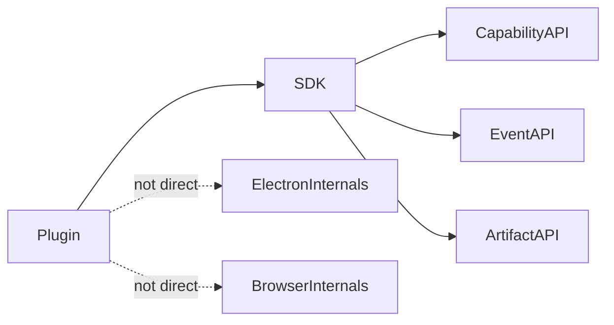

Plugin nên:

- đăng ký capability
- subscribe event
- tạo artifact
- đóng góp workflow step
- thêm UI extension theo contract

Điều này giúp AntiFan mở rộng mà core không thành “plugin spaghetti”.

### Impact: 7/10  
### Effort: 7/10  
### ROI: Trung bình hiện tại, cao về dài hạn

---

# 12. Browser Split Review nên đi xa hơn “2 màn hình”

Split desktop/mobile hiện rất hợp với workflow theme/web.

Bước tiếp theo tôi không khuyên thêm ngay 5–10 device presets.

Thứ đáng làm hơn:

## Review Session

```text
Review Session
├── Desktop target
├── Mobile target
├── synchronized route
├── captured screenshots
├── annotations
├── detected differences
└── final verdict
```

Tức là Split Review trở thành **artifact của một verification run**, không chỉ là UI layout.

Sau này agent có thể nhận:

> “Verify trang này trên Desktop + Mobile và trả evidence.”

### Impact: 8/10  
### Effort: 5/10  
### ROI: Rất cao cho use case của AntiFan

---

# 13. Test Strategy cần theo invariant thay vì chỉ feature

Với AntiFan, nhiều bug nguy hiểm là bug lifecycle.

Ví dụ:

- split navigation loop
- tab đóng nhưng listener còn tồn tại
- target cũ vẫn được agent dùng
- receipt không thuộc đúng workspace
- artifact bị ghi nhầm project
- retry thực thi duplicate action

Nên có test theo invariant:

```text
Invariant:
Một logical navigation chỉ tạo tối đa một mirror navigation.

Invariant:
Capability execution luôn có project/workspace scope hợp lệ.

Invariant:
Không receipt nào thuộc hai run.

Invariant:
Cancelled run không thể tiếp tục gọi capability.
```

Đây là kiểu test rất đáng đầu tư cho Control Plane.

### Impact: 9/10  
### Effort: 6/10  
### ROI: Rất cao

---

# Những thứ tôi KHÔNG khuyên ưu tiên ngay

## 1. Multi-agent swarm

Chưa cần.

Trước khi nhiều agent làm việc song song, một agent cần:

- run lifecycle tốt
- evidence tốt
- context tốt
- capability boundary tốt

Một agent đáng tin thường giá trị hơn 5 agent không quan sát được.

## 2. Vector database / RAG lớn

Chưa thấy cần.

Project context có thể giải quyết bằng deterministic discovery + summaries trước.

## 3. Thêm thêm AI chat UI

AntiFan đã có đủ surface. Giá trị tiếp theo nằm ở orchestration.

## 4. Tự viết model router quá sớm

Ban đầu nên để routing theo:

- task type
- agent capabilities
- cost preference
- verification requirement

Đừng biến routing thành một “AI quyết định AI” quá sớm.

## 5. Quá nhiều plugin

Plugin SDK nên được ổn định contract trước.

---

# Roadmap đề xuất

## Phase 1 — Harden the Core

**Mục tiêu:** một execution model thống nhất.

- [ ] Chuẩn hóa Task / Run / Step lifecycle
- [ ] Capability API thống nhất
- [ ] Idempotency + cancellation semantics
- [ ] Event + Receipt correlation
- [ ] Invariant tests

**Kết quả:** AntiFan biết chính xác một task đang ở đâu và đã làm gì.

---

## Phase 2 — Close the Loop

**Mục tiêu:** agent không chỉ làm, mà còn chứng minh.

- [ ] Verification policies
- [ ] Browser evidence
- [ ] Screenshot artifacts
- [ ] Terminal/build evidence
- [ ] Review sessions
- [ ] Final verification verdict

**Kết quả:** AntiFan có feedback loop thực sự.

---

## Phase 3 — Agent Interoperability

**Mục tiêu:** thay agent không đổi kiến trúc.

- [ ] Agent Adapter contract
- [ ] Capability discovery
- [ ] Normalized status/events
- [ ] OMP adapter
- [ ] Các adapter khác khi thật sự cần

**Kết quả:** AntiFan sở hữu orchestration, không phụ thuộc một agent.

---

## Phase 4 — Observability & Recovery

**Mục tiêu:** có thể tin cậy task dài.

- [ ] Run timeline
- [ ] Tool/capability receipts
- [ ] Crash recovery states
- [ ] Resume / reattach
- [ ] Replay diagnostics

---

## Phase 5 — Extensibility

- [ ] Stable Plugin SDK
- [ ] Capability extensions
- [ ] Workflow extensions
- [ ] Event subscriptions
- [ ] Project intelligence extensions

---

# Thứ tự đầu tư tôi khuyến nghị

| Rank | Hạng mục | Impact | Effort | Khuyến nghị |
|---|---|---:|---:|---|
| 1 | Unified Run Lifecycle | 10 | 7 | Làm ngay |
| 2 | Unified Capability API | 10 | 8 | Làm song song với #1 |
| 3 | Verification / Evidence Loop | 10 | 6 | Làm ngay sau core |
| 4 | Execution Timeline | 9 | 5 | ROI rất cao |
| 5 | Agent Adapter Layer | 9 | 6 | Làm khi bắt đầu đa agent |
| 6 | Invariant Testing | 9 | 6 | Làm xuyên suốt |
| 7 | Context Pack | 9 | 7 | Sau khi lifecycle ổn định |
| 8 | Durable Recovery | 8 | 8 | Sau core |
| 9 | Project Intelligence | 8 | 5 | ROI tốt |
| 10 | Policy / Approval | 7 | 5 | Khi autonomy tăng |
| 11 | Plugin Hardening | 7 | 7 | Chưa cần ưu tiên |

---

# Đề xuất kiến trúc đích

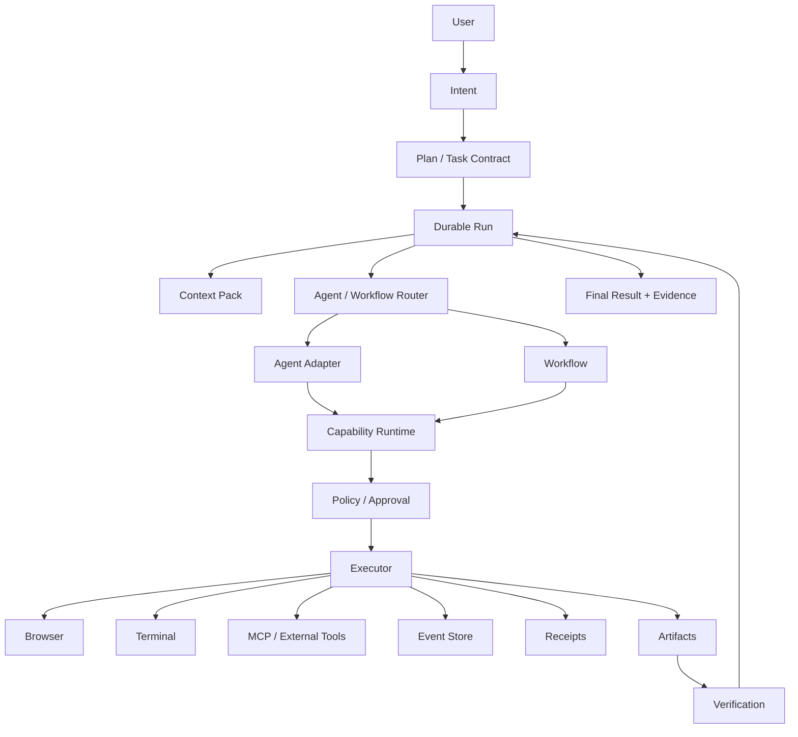

---

# Kết luận cuối cùng

AntiFan hiện có một điều rất đáng giá: **nó đã sở hữu nhiều primitive mà một AI harness nghiêm túc cần**.

- Browser thật
- Terminal thật
- MCP
- Project / Workspace scope
- Workflow
- Event / Receipt
- Artifact
- Capability abstraction
- Split responsive review
- Plugin foundation

Vì vậy, chiến lược tốt nhất không phải tiếp tục thêm “feature”.

Chiến lược tốt nhất là:

> **Biến các primitive hiện có thành một execution system thống nhất, observable, verifiable và agent-agnostic.**

Nếu làm tốt 5 ưu tiên đầu tiên, AntiFan sẽ khác biệt ở chỗ:

> Agent có thể thay đổi, model có thể thay đổi, tool có thể thay đổi — nhưng AntiFan vẫn là nơi định nghĩa task, scope, execution, evidence và lifecycle.

Đó mới là phần “moat” đáng đầu tư nhất cho AntiFan.

---

# 14. Đối chiếu Onorca.dev — Những gì AntiFan nên học

Onorca nên được xem như benchmark về **agent-first UX, orchestration và workflow ergonomics**, không phải danh sách feature cần sao chép.

## 14.1 Worktree-first Agent Isolation — P0

Mỗi agent task nên có execution/workspace/worktree riêng:

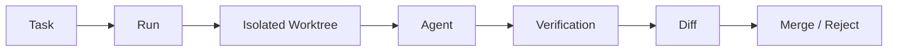

Worktree nên trở thành primitive của Run: `projectId`, `workspaceId`, `worktreeId`, `agentId`, `verification`, `artifacts`.

**Impact: 10/10 — Effort: 7/10**

## 14.2 Agent Dashboard — P0/P1

Với Run + Event Store + Session hiện có, AntiFan có thể dựng dashboard theo trạng thái:

```text
Needs You
Working
Waiting
Verifying
Blocked
Done
Failed
```

Đây phải là **operational dashboard của Run**, không chỉ là danh sách chat.

**Impact: 9/10 — Effort: 4/10**

## 14.3 Agent Status là first-class state

Không nên chỉ biết PTY/process đang `running`. Nên chuẩn hóa các trạng thái `starting`, `working`, `waiting`, `needs_input`, `blocked`, `verifying`, `completed`, `failed`, `hibernated`.

Đây là nền cho dashboard, orchestration, notification, handoff và recovery.

**Impact: 9/10 — Effort: 5/10**

---

# 15. Orchestration nhiều Agent — học ý tưởng, không copy cơ chế

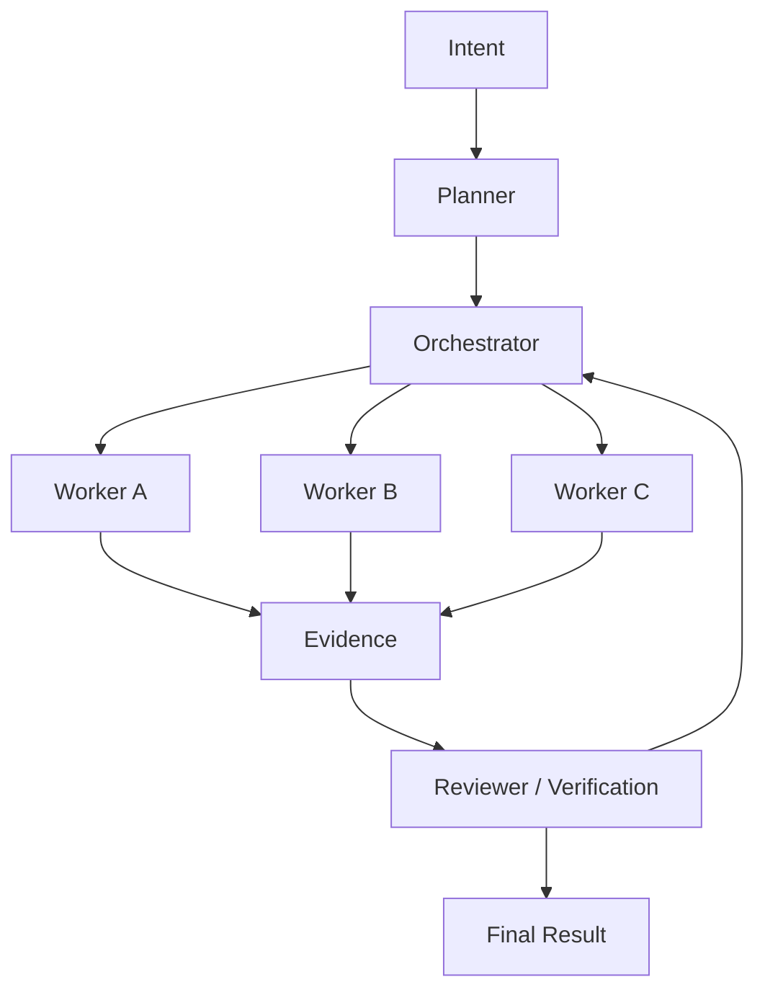

Mọi worker vẫn phải là `Agent Run + Workspace + Worktree + Capability scope + Evidence + Verification`. Không nên tạo một swarm layer nằm ngoài execution model.

**Impact: 9/10 — Effort: 8/10**

# 16. Session Handoff / AI Vault

Session nên chứa:

```text
Session
├── Intent
├── Run history
├── Agent
├── Worktree
├── Events
├── Receipts
├── Artifacts
├── Verification
└── Handoff Summary
```

Các thao tác đáng có: `Continue Run`, `Retry Run`, `Hand Off to Agent`, `Clone Run`, `Open Worktree`, `Inspect Evidence`.

**Impact: 8/10 — Effort: 5/10**

# 17. Task → Worktree → Run → PR

Nên có `TaskSource` cho Manual, GitHub Issue, GitHub PR, Linear và các integration tương lai.

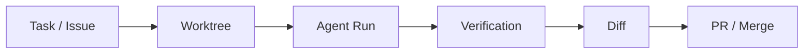

**Impact: 8/10 — Effort: 7/10**

# 18. Inline Diff Review / Annotation

Review comment nên gắn trực tiếp với execution context:

```text
ReviewComment
├── runId
├── worktreeId
├── file
├── line
├── message
└── status
```

Feedback trở thành `ReviewTask` của cùng Run hoặc child Run.

**Impact: 8/10 — Effort: 5/10**

# 19. Workspace Layout Presets

Split Browser mở ra một hướng tốt hơn: layout theo loại task.

```text
UI Review
├── Agent
├── Terminal
├── Desktop Browser
├── Mobile Browser
└── Diff

Backend
├── Agent
├── Terminal
├── Logs
└── Tests
```

**Impact: 8/10 — Effort: 5/10**

# 20. Remote Execution Target

Nên chừa abstraction:

```ts
type ExecutionTarget =
  | { type: "local" }
  | { type: "ssh"; hostId: string }
  | { type: "container"; id: string }
  | { type: "vm"; id: string };
```

Triển khai remote có thể để P2 nhưng abstraction nên xuất hiện sớm trong design.

**Impact hiện tại: 6/10 — Giá trị dài hạn: 10/10**

# 21. Mobile Companion — chỉ nên làm Control Console

Không cần copy nguyên IDE lên mobile. Chỉ cần remote run dashboard với Working, Needs You, Verification Failed, Approve, Stop và Resume.

**Impact: 6/10 — Effort: 7/10**

# 22. Usage / Account Management

Khi hỗ trợ nhiều CLI agent, usage/account có thể thành capability để router biết provider/account nào đang rate-limited hoặc còn quota. Đây là P2.

**Impact: 6/10 — Effort: 6/10**

# 23. Unified Search / Command Surface

Một search spine nên tìm được Files, Runs, Agents, Worktrees, Tasks, Artifacts, Events, Browser Tabs và Commands.

**Impact: 7/10 — Effort: 4/10**

# 24. AntiFan không nên copy Onorca theo feature count

Onorca đang tối ưu cho: `One place to manage many agents.`

AntiFan nên tối ưu cho: `One execution/control plane for any agent, tool and surface.`

Không nên ưu tiên sớm hàng chục agent integrations, mobile IDE đầy đủ, emulator support, nhiều Git providers hay quá nhiều native integrations. Nên học **object model**, không sao chép feature list.

# 25. Roadmap AntiFan sau khi đối chiếu Onorca

## P0 — Harden the Execution Core

```text
1. Unified Run Lifecycle
2. Unified Capability Runtime
3. Worktree Isolation
4. Agent Status Model
5. Verification / Evidence Loop
6. Invariant Tests
7. Execution Timeline
```

## P1 — Turn AntiFan into an Agent Operating Environment

```text
8. Agent Dashboard
9. Orchestration
10. Session Handoff
11. Diff Review / Annotation
12. Task → Worktree → Run → PR
13. Workspace Layout Presets
14. Context Packs
```

## P2 — Scale Beyond One Machine

```text
15. Remote Execution
16. Mobile Control Console
17. Usage / Account Management
18. GitHub / Linear integrations
19. Plugin ecosystem hardening
```

# 26. Bảng ưu tiên cuối cùng

| Rank | Hạng mục | Impact | Effort | Priority |
|---|---|---:|---:|---|
| 1 | Unified Run Lifecycle | 10 | 7 | P0 |
| 2 | Unified Capability Runtime | 10 | 8 | P0 |
| 3 | Worktree Isolation | 10 | 7 | P0 |
| 4 | Verification / Evidence Loop | 10 | 6 | P0 |
| 5 | Agent Status Model | 9 | 5 | P0 |
| 6 | Execution Timeline | 9 | 5 | P0 |
| 7 | Invariant Testing | 9 | 6 | P0 |
| 8 | Agent Dashboard | 9 | 4 | P1 |
| 9 | Agent Adapter Layer | 9 | 6 | P1 |
| 10 | Orchestration | 9 | 8 | P1 |
| 11 | Session Handoff | 8 | 5 | P1 |
| 12 | Diff Annotation | 8 | 5 | P1 |
| 13 | Task → Worktree → PR | 8 | 7 | P1 |
| 14 | Workspace Layout Presets | 8 | 5 | P1 |
| 15 | Context Pack | 9 | 7 | P1 |
| 16 | Durable Recovery | 8 | 8 | P1 |
| 17 | Project Intelligence | 8 | 5 | P1 |
| 18 | Remote Execution | 6 | 8 | P2 |
| 19 | Mobile Control | 6 | 7 | P2 |
| 20 | Usage / Account Manager | 6 | 6 | P2 |
| 21 | Plugin Ecosystem | 7 | 7 | P2 |

# 27. Strategic Direction

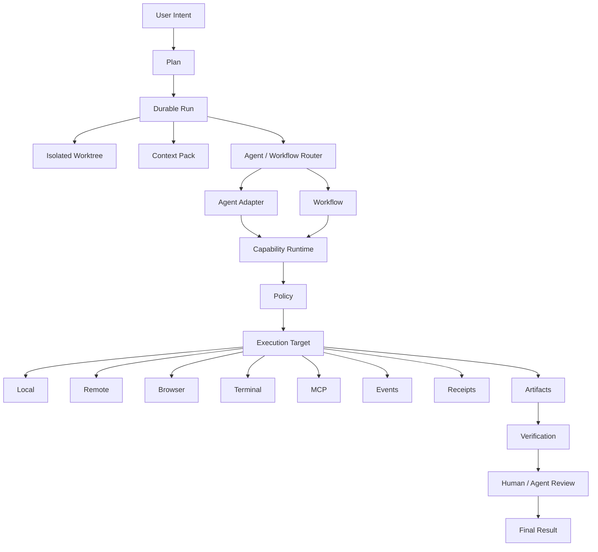

**Strategic takeaway:** Onorca cho thấy agent-first IDE có thể được làm rất tốt ở tầng UX. AntiFan nên tập trung thắng ở tầng execution architecture.

Nếu AntiFan đạt được **Run + Worktree + Agent + Capability + Evidence + Verification + Handoff** thành một object model thống nhất, thì việc thêm OMP, Codex, Claude, DeepSeek hay agent mới sau này sẽ trở thành adapter problem thay vì architectural rewrite.

---

# Sources / Benchmark Note

Phần Onorca trong báo cáo này được dùng như benchmark kiến trúc và UX, không phải yêu cầu AntiFan phải sao chép feature. Các nhận định về Onorca dựa trên website/docs/changelog công khai tại thời điểm phân tích.

---

# Final Direction Addendum — Control Plane + Adapter + Chromium

## Core architecture

AntiFan should remain a **Control Plane**, not an Agent Runtime.

```text
User
 ↓
Job
 ↓
Run / Attempt
 ↓
Adapter
 ├── OMP
 ├── Codex
 ├── Claude
 └── Future Agent
 ↓
AntiFan Capability Gateway
 ↓
Browser / Terminal / Files / MCP
 ↓
Evidence
 ↓
Verification
 ↓
Verified Done
```

The key rule is:

> **AntiFan manages execution; Agents are replaceable runtimes connected through adapters.**

## Highest-priority Control Plane improvements

### 1. Job Model — 10/10

Separate the user-level work from individual executions:

```text
JOB
 ↓
RUN
 ↓
ATTEMPT
 ↓
ADAPTER
```

A Job such as “verify the mobile product page” can have multiple runs and even switch from OMP to Codex without losing its identity or history.

### 2. Adapter Contract — 10/10

Standardize only the boundary AntiFan needs:

```text
start
send task/context
receive progress
receive request
receive completion/failure
cancel
```

Do not move model reasoning, prompt strategy or agent-internal context into AntiFan.

Study ACP closely before inventing a larger custom protocol.

### 3. Capability Gateway — 10/10

Agents should request capabilities rather than directly owning Browser/Terminal/Tools.

```text
Agent
 ↓
Capability request
 ↓
AntiFan policy + scope + validation
 ↓
Execution
 ↓
Result / Evidence
```

Capability discovery should let an Adapter know what AntiFan currently permits.

### 4. Evidence + Verification — 10/10

An Agent may report “done”, but AntiFan should decide whether the result is verified.

```text
Agent work
 ↓
Evidence
 ↓
Verification
 ├── fail → return evidence to Agent
 └── pass → Verified Done
```

### 5. Human Input / Approval — 9.5/10

Support `input required` / takeover / approval as first-class Control Plane states.

Examples:

```text
Delete 23 files
[Allow once] [Allow for this Job] [Deny]
```

or:

```text
Website requires login
[Take Control]
```

### 6. Resume Job — 9/10

Users should resume a **Job**, not need to understand internal sessions/processes.

---

# Chromium audit

AntiFan already has a strong Browser primitive layer. The main gap is **not more automation actions**. It is turning existing browser data into a coherent **Browser Observability + Evidence + Verification** system.

## Already present in the current repository

- Screenshot + Artifact integration
- DOM inspection/evidence
- Semantic/ARIA-style Agent Snapshot
- Desktop/Mobile split review
- Synchronized navigation
- Browser Target / pane routing
- Responsive checks
- Console diagnostics
- Network failure diagnostics
- Agent cursor/highlight/ripple/trajectory feedback
- Persistent profile/cookie-related infrastructure

Therefore, do not rebuild these capabilities.

---

# Chromium priorities

## 1. Browser Event Timeline / Replay — 10/10

AntiFan has the pieces but needs one coherent browser timeline:

```text
10:31:02 navigate /products/123
10:31:04 DOM ready
10:31:05 click Add to Cart
10:31:06 POST /cart → 200
10:31:07 console error
10:31:08 screenshot
10:31:10 verification failed
```

Every browser event should correlate with:

```text
runId
attemptId
tabId
paneId
timestamp
event type
artifact/evidence
```

This makes failures explainable and replayable.

## 2. Debug Bundle — 10/10

Expose one high-level capability such as:

```text
browser.debug_bundle
```

Bundle:

```text
URL
Title
Viewport
Semantic Snapshot
DOM Summary
Screenshot
Console Errors
Network Failures
Responsive State
```

The result becomes one Evidence Bundle attached to the Run.

## 3. Visual Diff / Regression — 10/10

AntiFan already has screenshots, Desktop/Mobile and artifacts. Add:

```text
Before
 ↓
After
 ↓
Visual Diff
```

For example:

```text
Desktop: 99.1% similar
Mobile: 91.4% similar
Changed: header height, product spacing, CTA position
```

This is especially valuable for theme/UI work.

## 4. Network Inspector + Assertions — 9.5/10

Current network diagnostics are mainly failure-oriented. Evolve toward:

```text
browser.network.inspect
browser.network.assert
```

Inspect:

```text
URL
Method
Status
Duration
Resource type
Headers
Size
Timing
```

Assert things such as:

```text
POST /cart
status = 200
response contains line_items
```

## 5. Console Assertions — 9/10

Current console diagnostics should become verification rules:

```text
browser.console.assert
```

Example:

```text
Uncaught exceptions: 0
console.error: 0
warnings: 3
Result: PASS
```

## 6. Human Takeover — 9/10

Formalize browser ownership:

```text
Agent owns target
 ↓
Human takeover
 ↓
Human owns target
 ↓
Return to Agent
```

Useful for login, 2FA, CAPTCHA, OAuth and confirmation steps.

## 7. Performance Verification — 9/10

Expose metrics such as:

```text
LCP
CLS
INP
Long tasks
JS payload
Image payload
```

Allow Job-level assertions like:

```text
LCP < 2.5s
CLS < 0.1
```

## 8. Accessibility Verification — 8.5/10

Expose checks for:

- missing labels
- heading hierarchy
- contrast
- ARIA issues
- keyboard accessibility

---

# Chromium design rule

Do not create a second Browser Tool system. New browser capabilities should follow the existing pattern:

```text
Browser Action / Observation
 ↓
BrowserControlPort
 ↓
Capability Catalogue
 ↓
Policy / Scope / BrowserTarget
 ↓
Execution
 ↓
Artifact / Evidence
 ↓
Verification
```

Browser should become a **Capability Provider + Evidence Source**, not a separate application inside AntiFan.

---

# Primitive vs Verification

## Browser primitives

```text
Navigate
Click
Fill
Scroll
Screenshot
DOM
```

These let the Agent perform work.

## Browser verification

```text
Network passed?
Console clean?
Visual regression passed?
Performance acceptable?
Accessibility passed?
```

These let the Control Plane decide whether the work is actually complete.

> **The strategic move is from Browser Automation to Browser Evidence & Verification.**

---

# Final roadmap

## P0 — Control Plane Foundation

1. Job Model
2. Run / Attempt lifecycle
3. Adapter Contract
4. Capability Gateway
5. Input Required / Approval
6. Evidence Model
7. Verification Loop

## P1 — Chromium Observability

8. Browser Event Timeline
9. Debug Bundle
10. Evidence linkage across Browser / Run / Attempt
11. Network Inspector
12. Console Assertions

## P2 — Browser Verification

13. Visual Diff / Regression
14. Network Assertions
15. Page Health Check
16. Performance Check
17. Accessibility Check

## P3 — Durable Collaboration

18. Resume Job
19. Human Takeover
20. Browser Ownership State
21. Adapter Handoff

## P4 — Scale

22. Remote Execution Target
23. Workspace / Worktree isolation
24. GitHub / Issue / PR integrations
25. Multi-Agent Orchestration

---

# Final priority ranking

| Rank | Area | Impact |
|---:|---|---:|
| 1 | Job Model | 10/10 |
| 2 | Adapter Contract | 10/10 |
| 3 | Capability Gateway | 10/10 |
| 4 | Evidence + Verification | 10/10 |
| 5 | Browser Event Timeline | 10/10 |
| 6 | Browser Debug Bundle | 10/10 |
| 7 | Visual Diff | 10/10 |
| 8 | Input Required / Approval | 9.5/10 |
| 9 | Network Inspector + Assertions | 9.5/10 |
| 10 | Resume Job | 9/10 |
| 11 | Human Takeover | 9/10 |
| 12 | Performance / Console Verification | 9/10 |
| 13 | Accessibility | 8.5/10 |
| 14 | Adapter Handoff | 8.5/10 |
| 15 | Workspace / Worktree Isolation | 8/10 |
| 16 | Remote Execution | 7/10 |
| 17 | Multi-Agent Orchestration | 7/10 |

---

# What AntiFan should not become

AntiFan should not become:

- an Agent Runtime
- a reasoning engine
- a prompt framework
- a model router
- a feature-heavy IDE clone
- a standalone Browser automation product
- a giant workflow engine

Do not prioritize early:

- multi-agent swarm
- video replay
- many additional browser actions
- more agent animation
- BrowserTools that bypass the Capability Gateway

---

# Final vision

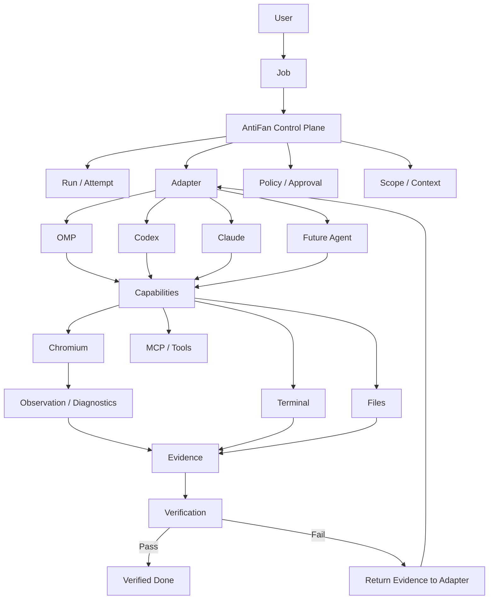

## Final strategic statement

> **AntiFan is a Control Plane independent of Agent Runtime, strong enough to manage, observe and prove the quality of execution.**

The core loop is:

```text
JOB
→ RUN
→ ADAPTER
→ EXECUTION
→ CAPABILITY
→ EVIDENCE
→ VERIFICATION
→ VERIFIED DONE
```

And Chromium's role is:

> **Chromium is not merely where an Agent clicks. It is a source of observation, evidence and verification that lets AntiFan decide whether a Job is genuinely complete.**
