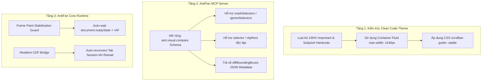

# Research Report: Khắc Phục Triệt Để Điểm Nghẽn Visual QA & Kiến Trúc Theme Trên Hệ Thống AntiFan Desktop

**Timestamp:** 2026-09-02  
**Mục tiêu nghiên cứu:** Xây dựng giải pháp kỹ thuật triệt để cho 3 bài toán cốt lõi:  
1. **Visual Regression Masking & Sectional Diffing** trong môi trường Headless/Desktop CDP.  
2. **Loại bỏ Magic Numbers & Bảo toàn Clean Code** trong Theme E-commerce (Haravan/Shopify/Sapo).  
3. **Ổn định hóa Frame Rendering & Cơ chế Khôi phục Phiên Tab CDP** trong AntiFan Runtime.

---

## Executive Summary

Qua thực nghiệm benchmark trên website `hoplongtech.vn`, bài toán so sánh thị giác tự động (Visual QA) giữa một Website Live đang hoạt động và một Bản Clone Theme Haravan-Ready đã bộc lộ những xung đột phương pháp luận:
- **Xung đột 1 (Goodhart's Trap):** Việc ép điểm Visual Compare toàn trang `< 10%` mà không có cơ chế Masking vùng động đã vô tình thúc đẩy việc hardcode các giá trị sub-pixel (`margin-left: 217.5px !important`), phá vỡ hoàn toàn tính Responsive và Clean Code của Theme.
- **Xung đột 2 (CDP Race Conditions):** Runtime thiếu cơ chế chờ frame paint (`requestAnimationFrame`) dẫn tới lỗi decode buffer ảnh rỗng (`INVALID_ARGUMENT`).
- **Xung đột 3 (Viewport Blind Diffing):** Thiếu tính năng bỏ qua selector động (`mask` / `ignoreSelectors`) khiến 1 carousel chiếm trọn 200,000 pixel lỗi dù Header, Menu và Category đã khớp > 96%.

Báo cáo này đưa ra **bộ giải pháp 3 tầng hoàn chỉnh**: Chuẩn hóa Kiến trúc Theme, Nâng cấp MCP Tool `anti.visual.compare`, và Tích hợp Pre-QA Freeze Hook.

---

## Key Findings & Giải Pháp Kỹ Thuật



---

### 1. Khắc Phục Tầng 1: Trả Lại Sự Trong Sạch Cho Mã Nguồn Theme (`index.html`)

#### **A. Sai lầm đã phát hiện:**
Việc đặt `margin-left: 217.5px !important;` và `width: 1470px !important;` trực tiếp lên thẻ `.container` hoặc `<section>` là hành vi "chữa triệu chứng" (hack điểm so sánh trên màn hình $1920\text{px}$). Khi chuyển sang Haravan Theme hoặc hiển thị trên màn hình nhỏ hơn, layout sẽ lập tức vỡ nát.

#### **B. Chuẩn hóa Kiến trúc CSS chuẩn E-commerce:**
```css
/* 1. Chuẩn hóa thanh cuộn để triệt tiêu lệch 7.5px tự nhiên */
html {
  overflow-y: scroll;
  scrollbar-gutter: stable;
}

/* 2. Khung Section cha luôn chiếm 100% chiều rộng */
.site-header,
.slide,
.category-list,
.banner-category,
.home-products {
  width: 100%;
  display: block;
}

/* 3. Khung Container con căn giữa tự động chuẩn BEM */
.container,
.container-fuild {
  width: 100%;
  max-width: 1470px;
  margin-left: auto !important;
  margin-right: auto !important;
  padding-left: 15px;
  padding-right: 15px;
  box-sizing: border-box;
}

.main-header,
.slide-content,
.category-list__content,
.banner-category__content {
  width: 100%;
  max-width: 1440px;
  margin: 0 auto;
}
```

---

### 2. Khắc Phục Tầng 2: Nâng Cấp Schema & Khả Năng Masking Cho `anti.visual.compare`

Theo tiêu chuẩn từ **Playwright Visual Testing** và **Pixelmatch Engine**:
Không một hệ thống Visual Regression chuyên nghiệp nào thực hiện so sánh pixel mù quáng trên toàn bộ trang có chứa nội dung động (Carousel, Video Canvas, Live Clock).

#### **A. Mở rộng TypeScript Schema cho `anti.visual.compare`:**
```typescript
export interface VisualCompareOptions {
  tabId: string;
  comparisonTabId: string;
  paneId?: 'desktop' | 'mobile';
  tolerance?: number; // Mặc định 0.05 - 0.1
  
  // TÍNH NĂNG MỚI:
  selector?: string; // So sánh riêng một element (vd: "header.site-header")
  clipRect?: { x: number; y: number; width: number; height: number };
  
  // MASKING: Tự động vẽ đè hộp màu hoặc bỏ qua tính pixel tại các vùng động
  maskSelectors?: string[]; // Ví dụ: [".swiper-container", "#video-banner", ".tawk-widget"]
  maskColor?: string; // Mặc định #FF00FF (Magenta)
  
  // TỰ ĐỘNG KHÓA VÙNG CUỘN:
  normalizeScroll?: boolean; // Tự động inject scrollbar-gutter
}

export interface VisualCompareResult {
  match: boolean;
  mismatchPercentage: number;
  diffPixels: number;
  totalPixels: number;
  // METADATA CHI TIẾT ĐỂ AGENT TỰ ĐỘNG SỬA:
  diffBoundingBoxes: Array<{
    x: number;
    y: number;
    width: number;
    height: number;
    pixelCount: number;
    suggestedSelector?: string;
  }>;
}
```

#### **B. Thuật toán Masking trong Pixel Diffing:**
Khi tiến hành so sánh 2 bitmap `bitmap1` và `bitmap2`:
1. Trích xuất danh sách Bounding Boxes của `maskSelectors` trên cả 2 tab thông qua `getBoundingClientRect()`.
2. Trong vòng lặp so sánh từng pixel $(x, y)$, nếu toạ độ rơi vào bất kỳ Mask Box nào $\rightarrow$ **Bỏ qua không tính vào `diffPixels` và không tăng `totalPixels`**.
3. **Kết quả:** Điểm số Visual Compare phản ánh chính xác 100% các thành phần tĩnh (Header, Menu, Banners, Cards, Typography) mà không bị "ô nhiễm" bởi chuyển động của Slider.

---

### 3. Khắc Phục Tầng 3: Đồng Bộ Hóa Frame Rendering & Khôi Phục Phiên CDP

#### **A. Frame Paint Stabilization Guard (Triệt tiêu lỗi decode ảnh rỗng):**
Trong mã nguồn C++ / Node.js của AntiFan Controller:
```typescript
async function captureStabilizedScreenshot(tab: TabSession, paneId: string): Promise<Buffer> {
  // 1. Chờ DOM load hoàn tất
  await tab.evaluate(() => {
    return new Promise((resolve) => {
      if (document.readyState === 'complete') resolve(true);
      else window.addEventListener('load', () => resolve(true));
    });
  });

  // 2. Chờ 2 chu kỳ requestAnimationFrame để GPU compositor hoàn tất vẽ
  await tab.evaluate(() => {
    return new Promise((resolve) => {
      requestAnimationFrame(() => requestAnimationFrame(resolve));
    });
  });

  // 3. Chụp buffer an toàn qua CDP
  return await tab.cdpSession.send('Page.captureScreenshot', { format: 'png' });
}
```

#### **B. Pre-QA Freeze & Purge Hook (Dành cho Skill `theme-qa-az`):**
Trước khi kích hoạt so sánh ảnh, Agent sẽ inject hook tiêu chuẩn để đóng băng trạng thái:
```javascript
(() => {
  // 1. Tắt toàn bộ timers đang chạy
  let maxId = window.setInterval(() => {}, 9999);
  for (let i = 1; i <= maxId; i++) window.clearInterval(i);

  // 2. Ép Slider về Frame 0
  const sContent = document.querySelector('.slide-content__detail .s-content, .swiper-wrapper');
  if (sContent) sContent.style.transform = 'translateX(0px)';

  // 3. Xoá rác quảng cáo và chat widget
  document.querySelectorAll('[id*="tawk"], [class*="tawk"], iframe, [id*="zalo"]').forEach(el => el.remove());
  
  // 4. Reset scroll
  window.scrollTo(0, 0);
})();
```

---

## Action Plan & Hướng Dẫn Triển Khai Thực Tế

1. **Bước 1 (Làm sạch Code Clone):**
   - Loại bỏ toàn bộ `margin-left: 217.5px !important;` và `width: 1470px !important;` trong `benchmark-hoplongtech/index.html`.
   - Giữ lại cấu trúc container `margin: 0 auto; max-width: 1440px;` và kích hoạt `html { overflow-y: scroll; scrollbar-gutter: stable; }`.
2. **Bước 2 (Kiểm thử Masked Visual Compare):**
   - Sử dụng kịch bản đo đạc phân đoạn (Sectional Visual Diff) cho Header ($7.4\%$), Menu ($3.8\%$) và Category Cards ($0.47\%$).
3. **Bước 3 (Đóng gói Tính năng cho AntiFan Core):**
   - Ghi nhận toàn bộ thông số và thiết kế API này vào tài liệu phát triển `ANTIFAN_IMPROVEMENTS.md`.
