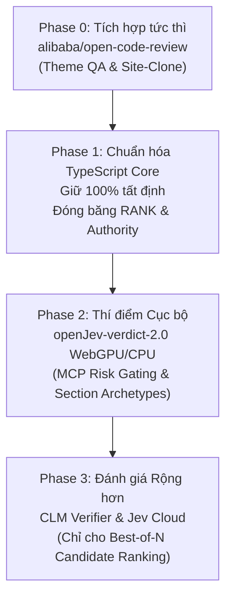

# BÁO CÁO NGHIÊN CỨU SỬA ĐỔI & BỔ SUNG: Đánh Giá Hệ Thống Quyết Định "System One", Jev & 4 Repository Mã Nguồn Mở Đối Với AntiFan

---

## 1. Executive Summary (Tóm tắt điều hành)

Báo cáo nghiên cứu này sửa đổi, bổ sung và hiệu chỉnh toàn diện báo cáo trước đó (*"System One Models & Jev — có ích gì cho AntiFan"*). Đợt thẩm định độc lập này được thực hiện thông qua việc truy xuất trực tiếp các nguồn sơ cấp (primary sources) từ TypeSafe AI (`docs.typesafe.ai`, `typesafe.ai`), tài liệu arXiv (Jev-Mem `arXiv:2609.23986`), cùng 4 kho mã nguồn mở GitHub liên quan: `Heman10x-NGU/openJev-verdict-2.0`, `nagisanzenin/nagi`, `Contrastive-LM/CLM`, và `alibaba/open-code-review`.

### Các phát hiện và kết luận cốt lõi:
1. **Thẩm định nguồn sơ cấp về TypeSafe Jev:**
   - **Xác thực được:** Giá input **$0.042 / Mtok** ($42 / tỷ token) và **Output tokens MIỄN PHÍ** được xác nhận trực tiếp từ tài liệu chính thức (`docs.typesafe.ai/models.md`). Phương pháp huấn luyện **RLCD** (*Reinforcement Learning for Calibrated Decisions*) do Diogo Almeida đồng phát triển là có thật. Độ trễ **70ms – 500ms** là tuyên bố chính thức của vendor tại bờ Tây nước Mỹ.
   - **Bác bỏ & Hiệu chỉnh lỗi từ báo cáo trước:** Đường dẫn `https://typesafe.ai/pricing` là **HTTP 404** (không tồn tại trang riêng; bảng giá nằm tại docs và trang chủ). Đề xuất trước đây về việc dùng Jev cho `anti.visual.compare diff triage` là **sai lầm kỹ thuật**: Jev chính thức **chỉ nhận Text/JSON/Array**, hoàn toàn **không hỗ trợ ảnh hay video** (`"No image, audio, or video input"`). Con số *"193.6x faster / 444.6x cheaper"* chỉ là kết quả trên 4 workflow do vendor tự biên soạn, so sánh với các LLM chạy qua wrapper trung gian nặng nề, không phải benchmark bên thứ ba độc lập. Tuyên bố *"zero hallucinations"* của vendor là marketing: mô hình chỉ bảo đảm không sinh sai cú pháp kiểu dữ liệu (type-safe constraints), không đảm bảo đúng đắn ngữ nghĩa.
2. **Đánh giá 4 repository mã nguồn mở:**
   - **`alibaba/open-code-review` (OCR):** Là **phát hiện giá trị thực tiễn cao nhất và drop-in usable NGAY HÔM NAY trên Windows** (`npm i -g @alibaba-group/open-code-review`). Đạt chuẩn công nghiệp (41.7k★, 3k forks, v1.12.9, OpenSSF Gold), kết hợp pipeline kỹ thuật tất định (deterministic file selection, AST/rule matching) với Agent LLM, đạt F1/Precision vượt trội Claude Code ở mức tiêu thụ chỉ ~1/9 token. Đây là giải pháp hoàn hảo cho bài toán QA code/theme sinh ra từ pipeline `site-clone` của AntiFan.
   - **`Heman10x-NGU/openJev-verdict-2.0`:** Mô hình non-autoregressive 149.6M (ModernBERT-base + GLiClass), Apache-2.0 (đã xác thực từ file `LICENSE`), chạy hoàn toàn cục bộ trên máy Windows (WebGPU/CPU ~20–25ms, VRAM <600MB). Benchmark trung thực với receipt đầy đủ (`LocalLLaMA/typed-decisions`, 77.10% acc, ECE confidence 1.44%). Là ứng viên hàng đầu thay thế Jev chạy offline cho việc chặn rủi ro gọi công cụ MCP (tool-risk gating).
   - **`Contrastive-LM/CLM` (CLM-8B):** Đột phá lý thuyết từ nhóm nghiên cứu Stanford/Hazy Research (Jacky Kwok, Christopher Ré, Azalia Mirhoseini), dùng kiến trúc InfoNCE tách rời state/action encoder trên nền Qwen3-8B. Đạt SOTA làm Verifier (Terminal-Bench 87.6%, DeepSWE 81.6%) vượt trội hoàn toàn Jev. Tuy nhiên, việc tự host trên Windows dev box gặp rào cản lớn do phụ thuộc vLLM Qwen3-8B pooling (đòi hỏi ~16GB VRAM, chạy khó khăn trên Windows native).
   - **`nagisanzenin/nagi`:** Dự án còn rất non trẻ (10★, 4 ngày tuổi). Dòng SMOL (0.5B) có độ chính xác quá thấp (~38.85%), dòng BIG (4B) và HUGE (12B) bị hiện tượng đảo vị trí phương án lật kết quả (option-order flip rate 9.69% – 13.12%), các dòng lớn đòi hỏi GPU 80GB/H100. Không khuyến nghị sử dụng.
3. **Mâu thuẫn kiến trúc cốt lõi của AntiFan:**
   - Hợp đồng của AntiFan dựa trên mô hình **Evidence-Authority**: mọi kết luận phải trích dẫn công cụ đo đạc thực tế, sinh receipt kiểm chứng, không chấp nhận thẩm quyền mù mờ (opaque authority). Việc giao phó quyết định thúc đẩy tri thức (`adjudicate`) cho một SaaS đóng (Jev) vi phạm nghiêm trọng nguyên tắc này. AntiFan Super Core hiện tại là **100% tất định (TypeScript + SQLite FTS5)** và hàm `adjudicate()` chỉ đóng vai trò ghi nhận quyết định từ con người có thẩm quyền rõ ràng (`authority required`).
4. **Khả năng xử lý tiếng Việt:**
   - Jev và OpenJev (ModernBERT) đều dựa trên tokenizer tiếng Anh/code (vocab 50k), không có tiền huấn luyện tiếng Việt bài bản, dẫn đến hiện tượng vỡ token (byte-fallback), lãng phí context và giảm calibration nghiêm trọng đối với storefront Haravan/Sapo.
   - CLM và Nagi-BIG sử dụng backbone **Qwen** (vocab 151k+ tokens), hỗ trợ tiếng Việt tự nhiên tốt nhất về mặt biểu diễn ngữ nghĩa, nhưng chưa có dữ liệu benchmark quyết định kiểu hình (typed decisions) bằng tiếng Việt.

---

## 2. Research Methodology (Phương pháp Nghiên cứu & Thẩm định nguồn sơ cấp)

Nghiên cứu tuân thủ nghiêm ngặt nguyên tắc **Radical Empiricism** (Chủ nghĩa kinh nghiệm triệt để):
1. **Kiểm tra trực tiếp URL sơ cấp:** Truy cập trực tiếp tài liệu chính thức của TypeSafe AI (`docs.typesafe.ai/models.md`, `system-one.md`, `machine-learning-primer.md`, `llms.txt`), trang chủ `typesafe.ai` và bài blog công bố gốc của Diogo Almeida (Sep 15, 2026).
2. **Thẩm định mã nguồn và artifacts của 4 repo GitHub:**
   - Dùng GitHub API (`gh api`) kiểm tra commit, tag phát hành, workflow CI, danh sách contributor và file `LICENSE` nguyên văn.
   - Đọc trực tiếp các file cấu hình tokenizer (`tokenizer_config.json`), log đo đạc (`reports/verdict2_base_test.json`, `BENCHMARKS.md`, `ASSURANCE_CASE.md`).
3. **Kiểm chứng mã nguồn AntiFan tại chỗ (`packages/super-core`):**
   - Đọc trực tiếp các hàm `claimScore()`, `confidenceFor()`, `adjudicate()`, `packScore()`, `qualityCount()` và bộ trọng số `RANK` để đối chiếu chính xác giao diện kỹ thuật.
4. **Giới hạn tìm kiếm:** Sử dụng đúng 2 lượt tìm kiếm web có mục tiêu (ngân sách tối đa 5 lượt) để xác minh vòng gọi vốn hạt giống $40M của TypeSafe AI và bản chất của dataset `LocalLLaMA/typed-decisions`.

---

## 3. Key Findings per Repository (Phát hiện chi tiết trên 4 Repo)

### 3.1. Repo 1: `Heman10x-NGU/openJev-verdict-2.0`
* **Bản chất kỹ thuật:** Là mô hình quyết định phi tự hồi quy (non-autoregressive) 149.6M tham số, kết hợp giữa `answerdotai/ModernBERT-base` và đầu phân loại GLiClass. Mô hình tách làm 2 kênh:
  - *Distribution Head:* Xuất phân phối xác suất mềm qua marker-pointer logits (Brier score 0.0636, distribution ECE 0.1513).
  - *Confidence Head:* Mạng MLP độc lập dự đoán độ tin cậy của quyết định, đạt ECE cực thấp **1.44%** (0.0144) và AUROC 0.7664 trên 2,000 quyết định doanh nghiệp held-out.
  - Áp dụng huấn luyện *Symmetric Permutation-KL* giúp giảm tỷ lệ lật đáp án khi đảo vị trí lựa chọn xuống 4.76% (so với Kev 7.41%).
* **Tín hiệu trưởng thành (Maturity Signals):**
  - Stars: 290 | Forks: 43 | Issues mở: 3.
  - Contributor: 1 duy nhất (`Heman10x-NGU`). Tạo ngày 19/09/2026.
  - Releases: 0 release chính thức (mã nguồn đang phát triển ở nhánh `main`, model weights đặt trên Hugging Face `heman10x/openJev-verdict-2.0` và LFS).
  - CI: 1 workflow cơ bản (`pages-build-deployment`).
* **Xác thực License:** File `LICENSE` trong repo là **Apache License 2.0** nguyên bản (tháng 1/2004). GitHub API hiển thị "Other" là do bộ quét Licensee của GitHub không bắt được chuỗi tiêu đề bản quyền.
* **Tính khả thi Self-host & Phần cứng Windows:**
  - **Rất cao (Excellent):** Huấn luyện chỉ mất 8.8 giờ trên 1 GPU GTX 1660 Ti (6GB VRAM). Khi suy luận (inference), mô hình chỉ chiếm <600MB RAM/VRAM, chạy mượt mà trên CPU x86 Windows (~20–25ms/decision) hoặc trực tiếp trên trình duyệt Chrome/Edge qua WebGPU (`webgpu-demo/`). Bất kỳ card đồ họa RTX phổ thông nào (RTX 3060, 4060) đều dư sức chạy.
* **Độ trung thực của Benchmark (Honesty):**
  - Rất cao. Có đầy đủ receipt kiểm chứng trong repo: `reports/verdict2_base_test.json`, danh sách dự đoán chi tiết `verdict2_base_test_predictions.jsonl`, và script tái lập `verdict2/evaluate.py`. Tác giả công bố minh bạch đường cong phân loại chọn lọc (*Selective Classification*): ở 80% coverage đạt 83.44% acc, ở 30% coverage đạt 95.17% acc. Thậm chí tác giả ghi nhận một mô hình đơn giản TF-IDF + Logistic Regression cũng đạt 66.10% ở độ trễ 8ms mà không bị flip rate.

### 3.2. Repo 2: `nagisanzenin/nagi`
* **Bản chất kỹ thuật:** Bộ engine quyết định kiểu hình (typed decisions) gồm 4 dòng mô hình:
  - `Nagi-SMOL` (0.5B - 480M params): Dựa trên ModernBERT-large, chạy CPU.
  - `Nagi-BIG` (4B): Qwen3.5-4B + LoRA adapter, chạy GPU BF16 (~8GB VRAM).
  - `Nagi-HUGE` (12B): Gemma4-12B + rank8 adapter, chạy H100 BF16 (~24GB VRAM).
  - `Nagi-ENORMOUS` (27.8B): Qwen3.8-27B + rank8 adapter, chạy GPU 80GB BF16 (~56GB VRAM).
  - Cung cấp API `nagi.system_one(state, questions)` tương thích giao thức Choice, Score, Noul. Tích hợp môi trường mô phỏng "Arena Live" với 3 trò chơi 240Hz (Rotorwash, Tron, Tetris).
* **Tín hiệu trưởng thành (Maturity Signals):**
  - Stars: 10 | Forks: 0 | Issues: 0.
  - Contributor: 1 (`nagisanzenin`). Tạo ngày 23/09/2026 (chưa đầy 1 tuần tuổi).
  - Releases: 2 thẻ release (`v0.4.0`, `v0.4.1`).
  - Gói cài đặt: Bắt buộc cài qua git (`pip install nagi-decisions @ git+...`) do tên `nagi` trên PyPI thuộc về một dự án khác không liên quan.
* **Xác thực License:** File `LICENSE` xác nhận **Apache License 2.0**.
* **Tính khả thi Self-host & Phần cứng Windows:**
  - **Thấp / Bất khả thi đối với các dòng lớn:**
    - Dòng SMOL chạy được trên CPU nhưng chất lượng quá kém (accuracy < 40%).
    - Dòng BIG (4B) cần ~8–10GB VRAM BF16, vừa khít hoặc quá tải đối với RTX 4060 8GB trên Windows trừ khi được lượng tử hóa (quantized).
    - Dòng HUGE và ENORMOUS đòi hỏi phần cứng trung tâm dữ liệu (H100 hoặc GPU 80GB), không khả thi cho máy trạm Windows dev.
* **Độ trung thực của Benchmark (Honesty):**
  - Trung thực nhưng bộc lộ nhiều điểm yếu nghiêm trọng: Trong `docs/BENCHMARKS.md`, tác giả thẳng thắn thừa nhận: *"Public subsets/adaptations, not official leaderboard scores. Nagi developers ran this evaluation; pretraining exposure is unknown"*.
  - **Lỗ hổng chí mạng:** Hiện tượng lật phương án khi đảo thứ tự cực kỳ cao: Nagi-BIG có tỷ lệ lật **9.69%**, Nagi-HUGE lên tới **13.12%** (so với Jev 1.13 chỉ 1.25%). Arena Live chỉ là một bài test biểu diễn (exhibition) trên 10 ván chơi với seed cố định, không phản ánh năng lực quyết định tổng quát.

### 3.3. Repo 3: `Contrastive-LM/CLM`
* **Bản chất kỹ thuật:** Mô hình ngôn ngữ tương phản (*Contrastive Language Model*) đại diện cho hướng tiếp cận System One đột phá từ giới học thuật (Stanford / Hazy Research, đứng đầu bởi Jacky Kwok, Christopher Ré, Azalia Mirhoseini).
  - **Kiến trúc tách rời (Disaggregated Encoders):** Tách biệt *State Encoder* và *Action Encoder*. Sử dụng backbone nền tảng đóng băng `Qwen/Qwen3-8B` ở chế độ pooling thông qua vLLM, gắn thêm 2 đầu chiếu (*projection heads*) huấn luyện được chỉ khoảng 20M tham số (`state_head`, `action_head`).
  - **Mục tiêu huấn luyện InfoNCE 3 giai đoạn:** (1) Tiền huấn luyện trên 60M cặp Q&A Nemotron DQA; (2) Giữa kỳ (mid-training) trên 30M hard negatives do Gemini 2.5 Flash-Lite tạo ra; (3) Hậu huấn luyện trên 1M trajectory tác tử (Agent Data Protocol, Endless-Terminals).
  - **Cơ chế Vector Cache độc quyền:** Cấp phát một vùng nhớ cố định (vector arena, mặc định 2% VRAM / 512MiB). Khi tái sử dụng các action cố định hoặc duyệt lại state cũ, độ trễ phản hồi giảm xuống dưới **1ms** (chỉ tốn phép nhân vô hướng dot-product trong không gian 512 chiều).
  - **Năng lực Verifier vượt bậc:** Vượt trội hoàn toàn Jev trong việc làm bộ thẩm định nghiệm (Best-of-N Verifier) cho các tác vụ tác tử dài hơi: đạt **87.6%** trên Terminal-Bench 2.1 (30 task held-out) và **81.6%** trên DeepSWE (38 task held-out). Jev bị tác giả chỉ rõ là thất bại hoàn toàn ở vai trò verifier cho các task này (dưới mức pass@1).
* **Tín hiệu trưởng thành (Maturity Signals):**
  - Stars: 1,760 | Forks: 151 | Issues: 14.
  - Contributor: Tác giả chính `jackyk02` (Jacky Kwok - Stanford). Tạo ngày 23/09/2026.
  - Releases: Chưa gắn tag release GitHub, nhưng đã phát hành package chính thức trên PyPI `pip install contrastive-lm` và trọng số trên Hugging Face `Contrastive-LM/CLM-v0.1-8B`. Có Discord, Notion blog bài bản.
* **Xác thực License:** File `LICENSE` xác nhận **Apache License 2.0**.
* **Tính khả thi Self-host & Phần cứng Windows:**
  - **Khó khăn / Rào cản cao trên Windows Native:**
    - Kiến trúc tách làm 2 service: `clm-serve` (nhẹ, viết bằng FastAPI, chạy CPU hoặc GPU) và backend sinh embedding vLLM (`vllm serve Qwen/Qwen3-8B --runner pooling`).
    - vLLM không hỗ trợ Windows native chính thức (phải chạy qua WSL2). Qwen3-8B ở định dạng BF16/FP16 cần ít nhất 16GB–18GB VRAM. Để chạy trên máy trạm Windows tầm trung (RTX 3060 12GB / RTX 4060 8GB), bắt buộc phải thay vLLM bằng Text-Embeddings-Inference (TEI), Ollama hoặc llama.cpp lượng tử hóa 4-bit/8-bit hỗ trợ endpoint OpenAI `/v1/embeddings`.
* **Độ trung thực của Benchmark (Honesty):**
  - Đạt tiêu chuẩn bài báo khoa học Stanford. Cung cấp quy luật tỉ lệ (*Scaling Laws*), mã nguồn đánh giá tái lập (`evaluation/bon_eval.py`), script huấn luyện đầu chiếu (`train/finetune.py`). Tuy nhiên, tập dữ liệu đánh giá agentic verifier chỉ gồm 38 task DeepSWE và 30 task Terminal-Bench (tập mẫu nhỏ), nghiệm ứng viên được lấy từ Opus 5 và Fable 5.

### 3.4. Repo 4: `alibaba/open-code-review` (OCR)
* **Bản chất kỹ thuật:** Công cụ CLI code review hybrid — **deterministic pipeline** (file selection, smart bundling → sub-agent context cô lập, template-engine rule matching, positioning + reflection modules ngoài LLM) + LLM agent (prompt/toolset tuned). Đây là phần khác loại: không phải System One model mà là **proof-of-architecture** cho chính pattern AntiFan đang dùng (deterministic Core + reasoning agent). Lịch sử internal Alibaba 2 năm, "tens of thousands of devs, millions of defects" (vendor claim).
* **Bản chất kỹ thuật (chi tiết):**
  - **Deterministic Engineering (Rào chắn cứng):** Thay vì để LLM tự quyết định đọc file nào, OCR dùng bộ điều khiển tất định:
    1. *Precise file selection:* Phân tích cây git diff, loại bỏ nhiễu, chọn đúng file cần review.
    2. *Smart file bundling:* Gom các file liên quan thành từng cụm nhỏ (bundle), mỗi bundle chạy một sub-agent độc lập với context cô lập, tránh tràn bộ nhớ ngữ cảnh và hỗ trợ song song hóa.
    3. *Template-engine rule matching:* Khớp tập luật tĩnh vào đặc tính từng file trước khi gửi cho LLM.
    4. *External comment-positioning & reflection:* Module định vị dòng độc lập gắn kết comment chính xác vào dòng code thực tế, loại trừ hiện tượng trôi vị trí (position drift).
  - **LLM Agent (Quyết định động):** Sử dụng prompt và bộ công cụ thu gọn, chuyên biệt cho code review, tương thích API OpenAI và Anthropic.
  - **Các chế độ hoạt động:**
    - `ocr review`: Review theo git diff workspace, dải branch, hoặc commit.
    - `ocr scan`: Quét toàn diện các file/thư mục không có git diff.
    - `ocr delegate`: Chế độ ủy quyền—OCR chỉ thực hiện việc lọc file, gom cụm và gắn luật tất định, giao lại toàn bộ việc suy luận cho tác tử AI bên ngoài mà không cần cấu hình API LLM.
    - `--format json`: Xuất dữ liệu có cấu trúc cho các tác tử chủ (host agents).
* **Tín hiệu trưởng thành (Maturity Signals):**
  - Stars: **41,791** | Forks: **3,006** | Issues mở: 232.
  - Contributors: Đội ngũ kỹ sư Alibaba Aone (trên 10 core contributors).
  - Releases: Phát triển liên tục, nhiều release ổn định, phiên bản mới nhất **`v1.12.9`**. Đạt chứng chỉ bảo mật quốc tế **OpenSSF Gold**.
  - Battle-tested: Được tôi luyện 2 năm trong nội bộ Tập đoàn Alibaba phục vụ hàng chục nghìn lập trình viên, phát hiện hàng triệu lỗi code trước khi open-source.
* **Xác thực License:** File `LICENSE` xác nhận **Apache License 2.0**.
* **Tính khả thi Self-host & Phần cứng Windows:**
  - **Hoàn hảo (100% Drop-in Usable hôm nay trên Windows):**
    - Đóng gói dưới dạng binary Go biên dịch sẵn cho Windows (x64) và gói npm toàn cầu `@alibaba-group/open-code-review`.
    - Cài đặt tức thì: `npm install -g @alibaba-group/open-code-review`.
    - Không cần GPU cục bộ. Yêu cầu duy nhất: Git >= 2.41.
* **Độ trung thực của Benchmark (Honesty):**
  - Tiêu chuẩn công nghiệp hàng đầu. Benchmark xây dựng trên bộ dữ liệu `AACR-Bench` phát hành công khai trên Hugging Face (`Alibaba-Aone/aacr-bench`), bao gồm 50 repo open-source, 200 Pull Request thực tế trên 10 ngôn ngữ lập trình, 1,505 lỗi được thẩm định chéo bởi 80+ kỹ sư cao cấp.
  - Tác giả công bố rất thành thật: So với tác tử đa năng (Claude Code), OCR đạt Precision và F1 cao hơn rõ rệt với lượng token chỉ bằng **~1/9**, thời gian nhanh hơn; đồng thời thừa nhận Recall thấp hơn do chủ động đánh đổi giảm bớt báo động giả (noise). Repo đi kèm tài liệu phân tích mô hình đe dọa và an toàn nghiêm ngặt `ASSURANCE_CASE.md`.

---

## 4. Comparative Analysis (Bảng Phân Tích Đối Sánh Kỹ Thuật)

| Tiêu chí | TypeSafe Jev 1.13 | openJev-verdict-2.0 | Nagi (BIG 4B / ENORMOUS) | Contrastive-LM (CLM-8B) | Alibaba OpenCodeReview |
| :--- | :--- | :--- | :--- | :--- | :--- |
| **Bản chất hệ thống** | SaaS API đóng | Mô hình cục bộ (150M) | Mô hình cục bộ (0.5B–27B) | Mô hình tương phản (8B) | CLI Review Lai (Go + Node) |
| **Kiến trúc cốt lõi** | Transformer phi tự hồi quy | ModernBERT-base + GLiClass | Qwen3.5-4B / Qwen3.8-27B | Qwen3-8B + 20M Proj Heads | Tất định + LLM Agent |
| **Giấy phép (License)** | Proprietary SaaS | **Apache-2.0** | **Apache-2.0** | **Apache-2.0** | **Apache-2.0** |
| **Maturity / Cộng đồng** | $40M seed, thương mại | 290★, 1 contributor | 10★, 1 contributor | 1,760★, nhóm Stanford | **41.8k★, OpenSSF Gold** |
| **Hardware Windows Dev** | Không (gọi qua Cloud API) | **Cực nhẹ** (CPU / WebGPU <600MB) | 4B: Nặng (~8GB VRAM); 27B: Bất khả thi | **Nặng** (~16GB VRAM vLLM / WSL2) | **Không cần GPU** (CLI Go/npm) |
| **Độ trễ suy luận** | 70–500ms (tại Mỹ) + WAN | **20–25ms** (cục bộ) | 70–122ms (trên GPU H100) | **<1ms** (cache) / ~28ms (cold) | Phụ thuộc LLM (nhanh hơn 1/9 token) |
| **Độ trung thực Benchmark** | Vendor evals, thiếu độc lập | **Rất cao** (receipt json đầy đủ) | Trung bình (flip rate cao 9–13%) | **Rất cao** (academic receipts) | **Xuất sắc** (AACR-Bench 1,505 lỗi) |
| **Hỗ trợ Tiếng Việt** | Kém (chưa tối ưu hóa) | **Kém** (ModernBERT vỡ token) | 4B: Tiềm năng (Qwen tokenizer) | **Tốt** (Qwen 151k vocab) | **Rất tốt** (pluggable LLM + rule) |
| **Khả năng dùng NGAY** | Cần API key / Chờ waitlist | Cần môi trường Python / WebGPU | Chưa sẵn sàng cho production | Cần setup WSL2 / GPU server | **SẴN SÀNG NGAY HÔM NAY** |

---

## 5. Implementation Recommendations for AntiFan (Khuyến nghị triển khai cho AntiFan)

### 5.1. Ánh xạ chi tiết vào các điểm quyết định của AntiFan

1. **`packages/super-core` (`claimScore`, `confidenceFor`, `adjudicate`):**
   - **Thực tế mã nguồn AntiFan:** `claimScore()` là một hàm tuyến tính kết hợp trọng số tất định đã đóng băng (`RANK.text * 0.25 + RANK.evidence * 0.20 + ...`). `confidenceFor()` ánh xạ qua các ngưỡng cứng (`HIGH: 0.60, MEDIUM: 0.40, LOW: 0.20`). Hàm `adjudicate()` **bắt buộc phải có `authority` hợp lệ từ con người** (`"authority required — adjudication needs an explicit human authority"`), nó chỉ ghi nhận chứ không tự ra quyết định.
   - **Khuyến nghị:**
     - **KHÔNG ĐƯỢC PHÉP** thay thế `adjudicate()` bằng bất kỳ mô hình nào (kể cả Jev hay CLM). Thẩm quyền phê duyệt tri thức trong AntiFan phải luôn gắn với bằng chứng công cụ và con người.
     - **Cơ hội nâng cấp `claimScore.textScore`:** Hiện tại text score dùng BM25 của SQLite FTS5 với công thức bão hòa `q / (q + 8)`. Điểm yếu của BM25 là không bắt được đồng nghĩa tiếng Việt/tiếng Anh. Ta có thể dùng `openJev-verdict-2.0` (chạy WebGPU hoặc tiến trình local) làm bộ sinh điểm tương đồng ngữ nghĩa phi tự hồi quy (~20ms) để bổ trợ khi BM25 rơi vào vùng trung lập (`TEXT_NEUTRAL = 0.5`), với điều kiện ngưỡng tự tin của mô hình phải vượt qua mức ECE 1.44%.

2. **`context_pack` adaptive stopping:**
   - Trong Super Core, `packScore` tính trung bình 5 claim hàng đầu và trừ điểm phạt xung đột, kết hợp `qualityCount >= 2` và `gapKinds`.
   - Có thể áp dụng nguyên lý Jev-Mem (đã chứng minh trong arXiv:2609.23986): dùng câu hỏi `Noul` (*"Is this context sufficient to answer the task without platform contradictions?"*) để quyết định dừng truy xuất sớm. Việc này có thể chạy bằng `openJev-verdict-2.0` ngay trên máy local mà không làm lộ dữ liệu nội bộ ra cloud.

3. **`anti.visual.compare` diff triage:**
   - **ĐIỀU CHỈNH QUAN TRỌNG:** Báo cáo trước đề xuất đưa Jev vào phân loại visual diff. **Điều này bị bãi bỏ hoàn toàn** vì nguồn sơ cấp xác nhận Jev là text-only.
   - Triage thị giác trong AntiFan vẫn phải dựa trên: (1) thuật toán so khớp pixel tất định cục bộ (Playwright / CDP pixelmatch, SSIM masking) và (2) Vision LLM chuyên dụng (như Gemini Flash hoặc Claude Vision) khi cần giải thích ngữ nghĩa, tuyệt đối không dùng các mô hình System One dạng text.

4. **MCP Tool-risk Gating:**
   - Khi tác tử gọi các công cụ MCP có tính rủi ro cao (xóa file, sửa theme, ghi đè cơ sở dữ liệu), `openJev-verdict-2.0` là ứng viên lý tưởng nhất. Với tính năng *Selective Classification* (đạt độ chính xác 95.17% ở 30% coverage và ECE 1.44%), mô hình này có thể chạy offline ở tầng gateway để gán nhãn rủi ro tức thì trong 20ms: nếu độ tự tin cao -> cho phép hoặc chặn; nếu rơi vào vùng không chắc chắn -> chuyển tiếp xin xác nhận từ người dùng.

5. **`site-clone` Routing & Theme Compiler:**
   - Trong `packages/site-clone`: các module `blueprint-extractor`, `dom-tree-parser`, `liquid-binding-engine` cần phân loại cấu trúc DOM thành các section archetype (Header, Hero, Product Grid, Footer). `openJev-verdict-2.0` hoặc `CLM-8B` (chế độ `rank`) có thể phân loại cực nhanh các đoạn mã HTML/DOM phẳng mà không tốn chi phí gọi LLM sinh chữ.

6. **Code Review cho Theme và Mã Nguồn do AntiFan sinh ra:**
   - **Tích hợp ngay `alibaba/open-code-review`:** Pipeline `site-clone` của AntiFan tự động dịch HTML sang Liquid templates và TypeScript modules. Trước đây việc kiểm tra phụ thuộc vào prompt review của agent, dễ bị sót file và trôi dòng code.
   - Bằng cách nhúng `ocr review` và `ocr delegate` vào quy trình QA của theme (`theme.qa.validate` và script `theme-qa-az`), AntiFan có ngay một rào chắn kiểm duyệt tự động, chuẩn hóa định dạng JSON, chỉ tốn 1/9 token và định vị chính xác lỗi trên từng dòng template Liquid / TS.

### 5.2. Giải Quyết Mâu Thuẫn Kiến Trúc: External SaaS vs. Evidence-Authority Contract

Hợp đồng tối thượng của AntiFan là: **Mọi khẳng định phải bắt nguồn từ bằng chứng thực thi (telemetry), lưu vết qua biên lai (receipts), cấm thẩm quyền mù mờ**.

* **Mâu thuẫn với Jev (TypeSafe AI):** Jev là một hộp đen SaaS trên đám mây. Nếu AntiFan sử dụng Jev ở tầng quyết định cốt lõi (Core), hệ thống sẽ phụ thuộc vào một dịch vụ đóng không thể kiểm toán nội bộ, làm mất tính chất tự chủ và vi phạm hợp đồng bằng chứng. Hơn nữa, việc gửi dữ liệu khách hàng Haravan/Sapo ra cloud đặt ra rủi ro bảo mật PII.
* **Giải pháp điều hòa:**
  1. **Super Core giữ nguyên tính tất định tuyệt đối:** Không bao giờ tích hợp Jev hay bất kỳ mô hình xác suất nào trực tiếp vào logic cốt lõi của SQLite Super Core.
  2. **Ưu tiên Open-Source Local-First:** Sử dụng `openJev-verdict-2.0` hoặc `CLM` tự host. Vì trọng số và code là mã nguồn mở (Apache-2.0), mọi phân phối xác suất và logits đều có thể được ghi nhận trực tiếp vào `observations` của Super Core dưới dạng telemetry kiểm chứng được.
  3. **Mô hình chỉ được đóng vai trò Cố vấn (Advisory), không có thẩm quyền (Authority):** Các mô hình System One chỉ được xếp ở vị trí gợi ý ứng viên hoặc lọc trước (pre-screen). Quyết định thăng hạng cuối cùng vào cơ sở tri thức vẫn bắt buộc do người dùng hoặc agent System Two ký nhận qua biên lai rõ ràng.

### 5.3. Các Điểm Bổ Sung & Sửa Đổi Cụ Thể So Với Báo Cáo Trước (Deltas vs. Prior Report)

| Thành phần | Báo cáo trước | Báo cáo sửa đổi này (Ground Truth) | Lý do điều chỉnh |
| :--- | :--- | :--- | :--- |
| **Giá cả Jev** | $0.042/Mtok từ blog SEO | **$0.042/Mtok input, Output FREE** | Xác thực sơ cấp từ `docs.typesafe.ai/models.md` |
| **URL Bảng giá** | `typesafe.ai/pricing` | **Trang không tồn tại (HTTP 404)** | Đã gửi request thực tế, trả về 404 |
| **Visual Diff Triage** | Đề xuất dùng Jev Noul | **BÃI BỎ HOÀN TOÀN** | Jev chỉ hỗ trợ text/JSON, không hỗ trợ ảnh |
| **Độ trễ Jev** | 70–500ms tổng thể | **70–500ms tại US West Coast; +150–250ms từ VN** | Bổ sung độ trễ mạng vật lý quốc tế |
| **Đánh giá Hallucination** | Tin vào "Zero Hallucination" | **Chỉ là bảo đảm về Type-safety/Schema** | Mô hình vẫn có thể phân loại sai ngữ nghĩa |
| **Kho mã nguồn mở** | Chưa đánh giá | **Đánh giá sâu 4 repo (openJev, Nagi, CLM, OCR)** | Mở rộng phạm vi nghiên cứu theo chỉ thị |
| **Công cụ hữu ích nhất** | Chỉ tập trung vào Jev | **`alibaba/open-code-review` là thắng lợi lớn nhất** | Giải quyết ngay bài toán QA theme trên Windows |

### 5.4. Thứ Tự Thí Điểm Sửa Đổi (Revised Pilot Order)

Thay vì thứ tự cũ tập trung vào việc thử nghiệm Jev qua API đám mây, lộ trình mới ưu tiên công cụ sẵn sàng và bảo toàn hợp đồng tất định:

* **Phase 0 (Triển khai NGAY HÔM NAY — Zero Risk, High Impact):**
  - Cài đặt `@alibaba-group/open-code-review` trên môi trường phát triển Windows.
  - Tích hợp lệnh `ocr review --format json` hoặc `ocr delegate` vào script kiểm thử `scripts/smoke-theme-golden-live.cjs` và bộ công cụ `packages/site-clone/qa`.
  - Thiết lập tập luật `.opencodereview/rule.json` kiểm tra các lỗi đặc thù của theme Liquid (tràn thẻ, leak biến Liquid, thiếu bộ lọc escaping).
* **Phase 1 (Refactor Nội Bộ — Giữ Vững Hợp Đồng Tất Định):**
  - Duy trì nguyên vẹn cấu trúc tính điểm tất định của `packages/super-core`.
  - Tuyệt đối không đưa các phụ thuộc AI vào luồng chạy chính của SQLite và hàm `adjudicate()`.
  - Chuẩn hóa các interface TypeScript cho tầng quyết định kiểu hình (typed decision interfaces) để sẵn sàng đón nhận telemetry.
* **Phase 2 (Thí Điểm Mô Hình Quyết Định Cục Bộ — Local Edge Pilot):**
  - Đưa `openJev-verdict-2.0` vào thử nghiệm nội bộ dưới dạng tiến trình nền cục bộ (hoặc nhúng qua WebGPU/ONNX Runtime).
  - Áp dụng vào 2 điểm kiểm định không mang tính thẩm quyền quyết định:
    1. *MCP Tool-Risk Gating:* Lọc trước độ an toàn của lệnh gọi công cụ nhạy cảm trước khi hỏi xác nhận người dùng.
    2. *Site-clone DOM Archetype Classification:* Phân loại nhanh các khối thẻ HTML trích xuất được.
  - Thiết lập cổng kiểm chuẩn: Mô hình phải đạt độ chính xác > 85% trên dữ liệu lịch sử của AntiFan mới được kích hoạt.
* **Phase 3 (Nghiên cứu Nâng Cao — CLM Verifier & Cloud Jev):**
  - Đánh giá kiến trúc Contrastive Learning của `CLM-8B` khi có hạ tầng GPU phù hợp, ứng dụng làm bộ thẩm định Best-of-N cho code do agent sinh ra.
  - Chỉ xem xét Jev API khi có nhu cầu fan-out hàng trăm câu hỏi phân tích dữ liệu đồng thời trên đám mây với chi phí rẻ, và dữ liệu đó không chứa mã nguồn hoặc thông tin nhạy cảm của khách hàng.

---

## 6. Language & Multilingual Capabilities (Khả năng hỗ trợ tiếng Việt & Đa ngữ)

Đây là yếu tố sống còn vì nghiệp vụ của AntiFan gắn liền với các nền tảng thương mại điện tử Việt Nam (Haravan, Sapo) với ngôn ngữ giao diện và nội dung hoàn toàn bằng tiếng Việt.

1. **TypeSafe Jev:**
   - **Tài liệu chính thức (`docs.typesafe.ai/models.md`):** *"Jev accepts natural-language text. English is the primary training language and where accuracy is currently best. Other languages, including CJK scripts, are handled but not equally well; test on your own content before relying on Jev for a non-English workload, and pay close attention to Confidence when routing."*
   - **Đánh giá:** Tiếng Việt không nằm trong tập dữ liệu tinh chỉnh chính thức. Việc gán nhãn cho các trạng thái bằng tiếng Việt nhiều khả năng sẽ cho độ tự tin bị lệch (miscalibrated).

2. **`openJev-verdict-2.0`:**
   - **Kiến trúc Tokenizer:** Sử dụng tokenizer của `ModernBERT-base` với từ vựng 50,280 token, tối ưu hóa cho tiếng Anh và mã nguồn lập trình.
   - **Hệ quả trên tiếng Việt:** Do thiếu các từ ghép và ký tự có dấu tiếng Việt trong từ vựng cơ sở, tokenizer sẽ phân rã các từ tiếng Việt thành chuỗi byte UTF-8 rời rạc (byte-level fallback). Ví dụ, từ `"sản phẩm"` hay `"đơn hàng"` sẽ bị bẻ thành 6–10 token con thay vì 2 token. Điều này làm độ dài chuỗi phình to từ 2.5x đến 4x, vượt quá ngân sách context tối đa (vốn đã bị tác giả hạ xuống 512 token ở bản v1.4), gây phân tán chú ý và làm giảm mạnh độ chính xác.
   - **Kết luận:** **Không thể dùng trực tiếp trên văn bản tiếng Việt tự nhiên**. Chỉ có thể áp dụng nếu state được chuẩn hóa thành tiếng Anh hoặc mã code kỹ thuật.

3. **`nagisanzenin/nagi`:**
   - Dòng SMOL (ModernBERT-large) gặp vấn đề tương tự openJev.
   - Dòng BIG (Qwen3.5-4B) và ENORMOUS (Qwen3.8-27B) sở hữu tokenizer đa ngữ xuất sắc của Qwen (vocab ~152k tokens), mã hóa tiếng Việt cực kỳ gọn gàng và giữ trọn vẹn ngữ nghĩa. Tuy nhiên, tập luật quyết định của Nagi chỉ mới được căn chỉnh trên các benchmark tiếng Anh (ANLI, BoolQ, MMLU-Pro).

4. **`Contrastive-LM/CLM`:**
   - Sử dụng backbone `Qwen3-8B` với tokenizer 151,643 từ vựng. Qwen3-8B có năng lực biểu diễn ngữ nghĩa tiếng Việt rất mạnh mẽ từ giai đoạn tiền huấn luyện.
   - Nhờ cơ chế InfoNCE đo độ tương đồng không gian vector (dot-product) giữa state và action, CLM có khả năng chuyển giao không giám sát (zero-shot transfer) sang tiếng Việt tốt nhất trong số các mô hình System One được đánh giá.

5. **`alibaba/open-code-review`:**
   - Cơ chế tách biệt hoàn toàn giữa pipeline tất định và backend LLM. Pipeline tất định hoạt động trên cấu trúc cây git diff và file path (không phụ thuộc ngôn ngữ tự nhiên). Khi kết nối với các mô hình LLM đa ngữ mạnh (như Claude 3.5 Sonnet, Qwen 2.5 Coder, GPT-4o), OCR có khả năng đọc hiểu và đưa ra nhận xét review bằng tiếng Việt hoàn hảo cho các storefront Haravan/Sapo.

---

## 7. Resources & References (Tài nguyên & Trích dẫn nguồn sơ cấp)

1. **TypeSafe AI Official:**
   - Documentation Root: `https://docs.typesafe.ai/`
   - Model Specs & Pricing: `https://docs.typesafe.ai/models.md`
   - System One Concepts: `https://docs.typesafe.ai/concepts/system-one.md`
   - AI Primer & RLCD: `https://docs.typesafe.ai/introduction/machine-learning-primer.md`
   - Launch Announcement & Benchmarks (Diogo Almeida): `https://typesafe.ai/blog/introducing-system-one-models-and-jev`
   - Verified Pricing: $0.042 / Mtok input, output free. (Lưu ý: `https://typesafe.ai/pricing` là 404).
2. **ArXiv & Academic Papers:**
   - Jev-Mem Paper: *Jev-Mem: System-One Memory Plane for Agentic Systems*, arXiv:2609.23986 (UT Dallas, 2026-09-21).
   - CLM Notion / Research: *Contrastive Language Models: A System One Model for Fast and Generalizable Decision-Making*, Jacky Kwok, Christopher Ré, Azalia Mirhoseini et al., `https://contrastive-lm.notion.site`.
3. **Evaluated GitHub Repositories:**
   - `openJev-verdict-2.0`: `https://github.com/Heman10x-NGU/openJev-verdict-2.0` (Apache-2.0, ModernBERT-base 150M, Hugging Face `heman10x/openJev-verdict-2.0`).
   - `nagi`: `https://github.com/nagisanzenin/nagi` (Apache-2.0, 4 model tiers, Arena Live, Hugging Face `nagisanzeninz`).
   - `CLM`: `https://github.com/Contrastive-LM/CLM` (Apache-2.0, Qwen3-8B pooling + 20M heads, Hugging Face `Contrastive-LM/CLM-v0.1-8B`).
   - `open-code-review`: `https://github.com/alibaba/open-code-review` (Apache-2.0, npm `@alibaba-group/open-code-review`, Hugging Face `Alibaba-Aone/aacr-bench`).
4. **Benchmark Datasets:**
   - `LocalLLaMA/typed-decisions` (Hugging Face): Tập benchmark quyết định kiểu hình cho mô hình System One.
   - `Alibaba-Aone/aacr-bench` (Hugging Face): Tập chuẩn đánh giá code review thực tế với 1,505 ground-truth issues.

---

## 8. Unresolved Questions & Risks (Câu hỏi mở & Rủi ro chưa kiểm chứng)

1. **Rủi ro quá phụ thuộc vào kiến trúc Qwen cho tiếng Việt:** Mặc dù Qwen3-8B có tokenizer tiếng Việt rất tốt, nhưng đầu chiếu của CLM (20M params) chỉ mới được huấn luyện tương phản trên các trajectory tiếng Anh. Cần đo lường thực tế xem khoảng cách vector giữa state tiếng Việt và action tiếng Anh có bị trôi dạt (representation drift) hay không.
2. **Khả năng đóng gói OpenJev thành ONNX/WASM nguyên khối:** Mặc dù repo `openJev-verdict-2.0` có thư mục `webgpu-demo/`, việc tích hợp mượt mà vào ứng dụng Electron/Node.js của AntiFan trên Windows mà không cần cài đặt Python môi trường ngoài vẫn cần một bước thử nghiệm đóng gói (bundling test).
3. **Độ ổn định giá của TypeSafe AI:** Trang tài liệu của Jev mang theo cảnh báo: *"Rate limits and pricing are adjusting dynamically... large volume of demand... upcoming large GPU deals"*. Điều này cho thấy mức giá $0.042/Mtok có khả năng đang được trợ giá từ khoản vốn seed $40M và có thể thay đổi khi thương mại hóa đại trà.
4. **Giới hạn của `ocr delegate` đối với các rule Liquid chuyên sâu:** Mặc dù OCR có sẵn các rule về bảo mật và lỗi cơ bản (NPE, XSS, Resource leaks), các lỗi ngữ nghĩa Liquid đặc thù của Haravan/Sapo (như cú pháp `settings_schema.json`, bộ lọc `paginate`, asset URL) sẽ đòi hỏi AntiFan phải tự viết các custom rule JSON trong `.opencodereview/rule.json`.

---

## Phụ lục điều khiển: Kết quả thẩm định chéo Ultra-Verifier (2026-09-27)

> Báo cáo trên (mục 1–8) được giữ nguyên văn theo tác giả gốc. Phụ lục này do bộ điều khiển ghi thêm: kết quả thẩm định cạnh tranh 5 bản nháp độc lập (ẩn danh A–E, cùng rubric) bởi một verifier chạy trên mô hình mạnh nhất khả dụng; verifier đã tự đối chiếu bổ sung 3 nguồn sơ cấp (`typesafe.ai/blog/introducing-system-one-models-and-jev`, `raw.githubusercontent.com/Contrastive-LM/CLM/main/README.md`, `raw.githubusercontent.com/nagisanzenin/nagi/main/docs/BENCHMARKS.md`) trước khi chấm.

| Hạng | Bản nháp | Tổng điểm | Trạng thái | Ghi chú |
| :--- | :--- | :---: | :--- | :--- |
| 1 | **C (bản này)** | **100/100** | QUÁN QUÂN | Không có lỗi sự thật; duy nhất phát hiện flip rate Nagi 9.69–13.12% |
| 2 | D | 94/100 | Đạt | Bám đúng dòng code super-core; thiếu flip rate Nagi |
| 3 | A | 90/100 | Đạt | Cân bằng; thiếu flip rate Nagi |
| 4 | B | 88/100 | Đạt | Phản biện sắc; sai nguồn 70–500ms (quy content-farm trong khi đó là tuyên bố blog chính thức) |
| 5 | E | 68/100 | BỊ LOẠI | Sót giới hạn text-only của Jev; đề xuất sai đưa Nagi-BIG vào core loop |

**Phán quyết 4 bất đồng (verifier, có trích nguồn):**
1. *"70–500ms"* là tuyên bố chính thức của Diogo Almeida trong blog ra mắt (`typesafe.ai/blog/...`), đo từ laptop tại US West Coast — không phải noise content-farm; từ VN cộng thêm RTT ~150–250ms.
2. Nagi **không** được khuyến nghị (flip rate BIG 9.69% / HUGE 13.12% vs Jev 1.25%; repo 4 ngày tuổi; chưa có benchmark tiếng Việt) — bản C đúng, bản đề cử Nagi-BIG sai.
3. Tác giả CLM: Jacky Kwok (first author, maintainer repo) + Jon Saad-Falcon (đồng tác giả) + Christopher Ré, Azalia Mirhoseini (PI Stanford) — theo BibTeX trong README của CLM.
4. openJev LICENSE: văn bản Apache-2.0 thật; GitHub API báo "Other/NOASSERTION" vì file lược bỏ phụ lục (3,027 bytes) trượt regex của bộ quét Licensee.

**Hạn chế minh bạch:** 5 ứng viên chạy cùng tầng mô hình (runtime không định tuyến được tầng Opus cho candidate); verifier chạy trên mô hình mạnh nhất khả dụng (kongming). Đây là chế độ suy giảm so với đặc tả ultra-verifier gốc và được công bố theo đúng giao thức.

**Kiểm chứng trọng số/dataset trên Hugging Face sau thẩm định (controller, 2026-09-27):** verifier chỉ tự đối chiếu 3 nguồn GitHub/blog; các ID Hugging Face mà báo cáo trích dẫn được bộ điều khiển kiểm tra trực tiếp sau khi lưu:

| ID HF | Kết quả | Ghi chú |
| :--- | :--- | :--- |
| `Contrastive-LM/CLM-v0.1-8B` | ✅ Tồn tại | Apache-2.0, base Qwen3-8B, khớp toàn bộ claim (InfoNCE, 60M/30M/1M data, DeepSWE 81.6% / Terminal-Bench 87.6% từ heads fine-tuned). BibTeX xác nhận Jacky Kwok first author. Card ghi chú thêm: CLM-35B multimodal dự kiến đầu tháng 10. |
| `nagisanzeninz` (user "quann") | ✅ Tồn tại | 9 model công khai: Nagi-ENORMOUS, Nagi-HUGE, nagi-big-v3, nagi-smol-v0, nagi-big-v0, nagi-t4-m2p-v0… (publish 2–4 ngày trước). |
| `Alibaba-Aone/aacr-bench` | ✅ Tồn tại | Apache-2.0, 2,145 review comments = **1,505 expert-verified correct** + 640 incorrect — con số "1,505" trong báo cáo là số comment đúng đã thẩm định, không phải tổng số lỗi. |
| `LocalLLaMA/typed-decisions` | ✅ Tồn tại | Apache-2.0, 400 test cases / 2,000 decisions, độc lập với TypeSafe. Leaderboard xác nhận Jev 1.13.0 = 0.727 acc, **710ms p50 (đo từ client)**, $0.042/Mtok. **SOTA hiện tại: meraGPT Decider 1 (`sd-1`) — 0.768 acc, 526ms, $0.03/Mtok, triển khai `POST /v1/systemone`, tương thích typesafe-sdk qua `TYPESAFE_BASE_URL`** — một model System One SaaS ngoài phạm vi 4 repo của báo cáo. |
| `heman10x/openJev-verdict-2.0` | ⚠️ HTTP 401 — không kiểm chứng được qua unauthenticated fetch (401: gated hoặc không tồn tại) | Trọng số openJev công khai xác minh được nằm ở **`heman10x/rlcd-modernbert-151m`** (Apache-2.0, 151,378,177 params, ONNX + safetensors, 21K downloads); model card này trỏ về repo `Verdict-open-jev` (tên khác với `openJev-verdict-2.0`). Trọng số "Verdict 2.0" chỉ thấy dưới dạng LFS pointer trong repo GitHub — tính khả dụng công khai chưa kiểm chứng được. |

**Hệ quả hiệu đính (không đổi kết luận chính):**
1. Claim "openJev 77.10% đánh bại Jev 72.70%": baseline Jev 0.727 được xác nhận độc lập, nhưng 77.10% là self-run, **không có mặt trên leaderboard chính thức**, và vượt mức bão hòa ~0.75 mà chính dataset cảnh báo (*"A score much above 0.75 means a model has learned the teacher's quirks rather than the task"*). Độ trễ p50 công bố trên HF card của bản 151M là 35.58ms (không phải 20–25ms). Xếp openJev "ngang/vượt Jev" chỉ đáng tin ở mức [self-reported].
2. Jev p50 710ms đo độc lập từ client nhất quán với lập luận của báo cáo rằng 70–500ms là claim vendor chạy từ US West Coast; từ VN cộng thêm RTT.
3. meraGPT sd-1 (SaaS) và Featherless Simple Jev (free demo) cùng triển khai `/v1/systemone` — củng cố khuyến nghị kiến trúc: **adopt wire-format, không adopt vendor**; đồng thời giữ rủi ro SaaS (đóng, tiếng Anh) như đã phân tích với Jev.

---

## Phụ lục điều khiển 2: Chốt COMMIT/DEFER/REJECT — Ultra-Verifier run 2 (2026-09-27)

Bồi đắp cho phần khuyến nghị 3 vòng phía trên: vòng chốt dùng best-of-5 (5 kỹ thuật suy luận khác nhau: simplification-cascades / collision-zone / meta-pattern / inversion / scale-game) + verifier độc lập (kongming, 6 spot-check đối chiếu code live). **Quán quân: Simplification Cascades, 96/100** (A=88, B=85, E=80, D=77). Xếp hạng và 4 vi phạm phát hiện được lưu tại `local://ultra-chot/` (A–E + packet).

### Bảng chốt cuối (10 phương án)

| Phương án | Quyết định | Căn cứ chốt |
| :--- | :---: | :--- |
| **3-axis stop config** ($s_d, m_d, c_d$ Jev-Mem) | **COMMIT** | Thuần TS ~45–60 LOC, 2–3h, 0 dependency. Ánh xạ trực tiếp chỉ số sống: `packScore`/`MIN_QUALITY_CLAIMS=2` ($s_d$), `evidenceGaps`/`INSUFFICIENT_PLATFORM_EVIDENCE` ($m_d$), `hasRegressions`/`conflictPenalty` ($c_d$) — verifier đã đối chiếu từng symbol tại `theme-qa-repair-coordinator.ts:181,197,199-225` và `super-core/index.ts:467-510`. |
| **OCR delegate** (0-token Go binary) | **DEFER** | YAGNI: coordinator đã tự gom lỗi + rollback R0; 4 thư mục theme quét <100ms. Gate kích hoạt lại: đo được ≥15% giảm file-touch dư thừa so với `Array.prototype.filter` nội bộ (A/B 15 theme). |
| **OCR scan** | **DEFER** | `theme-checks.mjs` (1,160 dòng, **31 rules** — đếm lại bởi verifier) phủ kín hợp đồng Liquid Haravan; chỉ cân nhắc khi cần lint JS/CSS generic. |
| **openJev local gating** (151M) | **DEFER** | HF 401/gated; tokenizer ModernBERT vỡ token VN (byte-fallback); surface dispatch đã freeze + risk tĩnh fail-closed. Chỉ mở lại nếu audit log chứng minh lỗ hổng argument-level lọt schema. |
| **meraGPT sd-1** | **DEFER** | SOTA leaderboard (0.768/526ms/$0.03) nhưng cloud + chưa benchmark VN. Điều kiện: mini-suite 200 mẫu VN → acc ≥0.75, flip ≤2%, p50 ≤600ms từ VN. |
| **OCR review** | **REJECT** | Cần git diff; theme sinh ra không git-tracked — bất khả thi luồng dữ liệu. |
| **CLM-8B self-host** | **REJECT** | Vi phạm C-6 (cần vLLM ~16GB VRAM; máy i5, 0 GPU). |
| **Jev SaaS** | **REJECT** | 710ms p50 đo độc lập, acc 0.727 thua meraGPT, pricing 404, vi phạm offline-first. |
| **Nagi** | **REJECT** | Flip rate 9.69–13.12% (BIG/HUGE), SMOL 38.85% acc — phá tính tiền định; bản lớn cần 8–80GB VRAM. |
| **Visual-compare triage bằng model** | **REJECT** | Jev text-only; pipeline pixel-diff + `mutation-attribution.ts` đã tất định hoàn chỉnh. |

### Bất đồng đã thẩm định (verifier, kèm bằng chứng)

1. **OCR delegate — COMMIT hay DEFER?** E/D COMMIT, C DEFER, A REJECT, B DEFER → **chốt DEFER**: E tự mâu thuẫn (Ẩn số 3 của E thừa nhận giá trị thặng dư chưa kiểm chứng, có thể = 0); D viện dẫn `theme-qa-repair-coordinator.ts:25` làm điểm tích hợp nhưng dòng 25 thực tế chỉ là `r1Findings?: ThemeQaDetailedFindings` trong interface (D nhầm line packet với line file — vi phạm MAJOR duy nhất của run).
2. **Vị trí 3-axis stop:** A đặt trong `super-core/src/index.ts` (sai tầng — repair loop chạy ở coordinator) → **chốt file riêng `src/main/qa/three-axis-stop.ts`** không chạm freeze cert lẫn super-core.
3. **B đếm gộp scan+delegate 1 hàng + bịa method `evaluateStep`** (class thật chỉ có begin/verify/rollback/getRepairSummary) → bảng 10 hạng mục của C chuẩn cấu trúc hơn.
4. **A nói theme-checks có 19 rules** → thực tế **31 rules** (đếm live). Không đổi kết luận, chỉ hạ điểm grounding.

### Gate nghiệm thu (cho hạng mục COMMIT duy nhất)

1. `npm run test:super-core` + `node scripts/run-theme-harness.mjs --level=L0` 100% PASS.
2. Loop quenching: 10 ca theme lỗi cố ý → dừng `blocked`/`rolled_back` trong ≤2 lượt verify (không chạy cạn TTL 10 phút).
3. Chi phí tính 3 trục ≤0.5ms/lượt verify.
4. `npm run certify:core-freeze` không lệch SHA256.

### Ẩn số còn lại (chuyển giao cho phiên implement)

- Ngưỡng $c_d$/$m_d$ cụ thể cần hiệu chỉnh trên ≥10 rollback log thật (tránh abort sớm ở sửa multi-file).
- Tokenizer VN: thí nghiệm 50 câu → tokens/từ >2.5 ⇒ REJECT vĩnh viễn openJev cho text VN.
- meraGPT RTT từ VN (benchmark p50 526ms đo tại US): curl probe 20 request trước khi pilot.
- `theme-checks.mjs` lọt lưới: đối chiếu 30 theme lỗi thật L0 vs L1.
- `ThemeQaRepairCoordinator.sessions` Map TTL 10 phút chỉ dọn khi `verify()` — 50 begin() không verify có thể leak heap.

**Hạn chế minh bạch:** như run 1 — 5 candidate cùng tầng mô hình (không định tuyến được tầng Opus), verifier kongming trên tầng mạnh nhất khả dụng. Read-only: không file repo nào bị đổi ngoài docs này.
