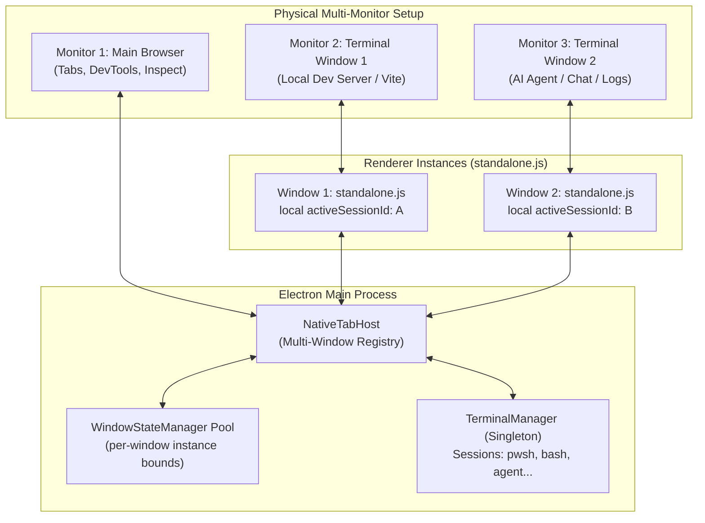

# Implementation Plan - Multi-Terminal Windows (Multi-Monitor Workspace)

## Overview
Enable AntiFan Browser Desktop to support multiple concurrent, floating Terminal/Studio windows (e.g. 1 Main Browser Window + 2 floating Terminal Windows on external monitors). Each floating terminal window maintains window-scoped active/split session selection, sender-aware PTY resize handling without cross-window thrashing, persistent window coordinates per window instance, and clean lifecycle management.

## Brainstorm Contract
- **Outcome**: Users can open and arrange 2+ independent terminal windows across multiple physical monitors. Each window can display, switch, and interact with its own active PTY session without forced mirroring or resize conflicts.
- **Constraints**:
  - Backward compatibility: single popout window and re-dock to main browser sidebar must continue to work seamlessly.
  - Electron 33 context isolation with `standalone-preload.js`.
  - Avoid global active session coupling in renderer: `standalone.js` must maintain its local active session and only resize PTYs when focused or explicitly displaying that session.
  - Window state persistence must cleanly manage multiple window instances without rigid hardcoded files or collisions.
- **Non-goals**:
  - Dragging terminal tabs physically between separate OS windows via native drag-and-drop.
  - Modifying web browsing tabs or webview architecture.
- **Acceptance Criteria**:
  1. Opening a new terminal window creates a distinct `BrowserWindow` instance with unique `windowId`.
  2. Window 1 and Window 2 can simultaneously display different PTY sessions; switching sessions in Window 1 does not force Window 2 to switch.
  3. PTY keystrokes and outputs route correctly between sessions and their respective rendering windows.
  4. Resizing Window 1 only issues `resizeTo` for the session(s) active in Window 1, preventing layout thrashing.
  5. Multi-monitor position coordinates for each terminal window instance are persisted and restored correctly.
  6. Closing or re-docking one window handles its lifecycle cleanly without destroying sessions unexpectedly or affecting other open windows.
  7. Full typecheck and test suite pass with 0 regressions.

## Architecture

## Phases
- [Phase 1: Main Process Window Registry](./phase-01-main-process-window-registry.md)
- [Phase 2: Window-Scoped Session & IPC Architecture](./phase-02-window-scoped-session-ipc.md)
- [Phase 3: Renderer Multi-Window UI](./phase-03-renderer-multi-window-ui.md)
- [Phase 4: Verification & Test Suite](./phase-04-verification-and-tests.md)
