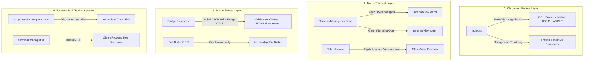

# Plan: Electron AntiFan CPU & Memory Overload Deep Performance Optimization

## Executive Summary
Resolves the severe system resource exhaustion where AntiFan Desktop consumed **76.3% CPU, 4.45 GB RAM, and accumulated 78 child processes**.
Through rigorous telemetry analysis and KongMing adversarial review, this plan addresses the 4 compounding root causes:
1. GPU process spinlock (130% CPU) caused by forced `ignore-gpu-blocklist` and `CanvasOopRasterization` on Intel UHD 630 Graphics.
2. Hidden persistent WebContentsViews (`sidebarView`, `terminalView`) actively rendering and processing xterm IPC when collapsed/closed.
3. Monolithic 4.5 MB+ uncompressed JSON serialization of terminal buffers across WebSocket bridge broadcasts causing V8 Event-Loop freezes.
4. Process tree isolation gaps where disconnected external agent MCP servers (`@playwright/mcp`, `antifan-omp-mcp`, `node_repl`) remain orphaned in the background.

## Architecture Flow

## Phase Breakdown

| Phase | Title | Target Files | Key Impact |
|---|---|---|---|
| **Phase 01** | Chromium GPU & Throttling Tuning | `src/main/index.ts`, `src/main/security/security-policy.ts` | Eliminates 130% GPU CPU spinlock on Intel UHD graphics. |
| **Phase 02** | View Lifecycle & Lazy Terminal IPC | `src/main/browser/native-tab-host.ts`, `src/renderer/standalone.js` | Stops invisible xterm layout/repaint calculations; implements Atomic Hydration State Machine with live PTY queue. |
| **Phase 03** | Buffer Paging & WebSocket Optimization | `src/main/bridge/bridge-server.ts`, `src/main/browser/terminal-manager.ts` | Enforces global 40KB JSON-bounded wire budget across all base and split panes, guaranteeing <100KB handshake JSON and zero V8 GC stalls. |
 | **Phase 04** | Process Tree Reaper & MCP Lifecycle | `scripts/antifan-omp-mcp.cjs`, `src/main/browser/terminal-manager.ts` | Prevents orphan `@playwright/mcp` and subagent process accumulation. |
 | **Phase 05** | Validation & Benchmarking | `test/`, Telemetry scripts | Verifies idle CPU < 2%, total RAM < 450MB, 0 regressions in terminal/split review. |

## Red-Team & Adversarial Invariant Matrix

| Adversarial Attack | Verified Defense In Plan |
|---|---|
| *Attack: Disabling GPU acceleration causes SwiftShader CPU explosion.* | We DO NOT disable GPU acceleration. We remove only `ignore-gpu-blocklist` and `CanvasOopRasterization`, retaining safe hardware compositing and video decode. |
| *Attack: Snapshot/Live chunk duplication or dropped data during terminal hydration.* | Main `TerminalManager` assigns monotonically increasing `seq` and returns `snapshotThroughSeq` with `getFullBuffer()`. The renderer filters `seq > snapshotThroughSeq` and executes an iterative drain loop (`while liveQueue.length > 0` with `splice(0)`), awaiting ordered xterm writes before transitioning to `ready`. |
| *Attack: Gating IPC data drops incoming terminal logs when sidebar is closed.* | Main process `TerminalManager.sessions.get(id).buffer` continues collecting all incoming data. When sidebar/dock opens, the watermarked atomic hydration protocol replays the full buffer and flushes live chunks without gaps. |
| *Attack: Killing process tree by PID might kill recycled PIDs.* | `killProcessTree` verifies PID existence and is executed immediately upon session termination before PID recycling can occur. |
