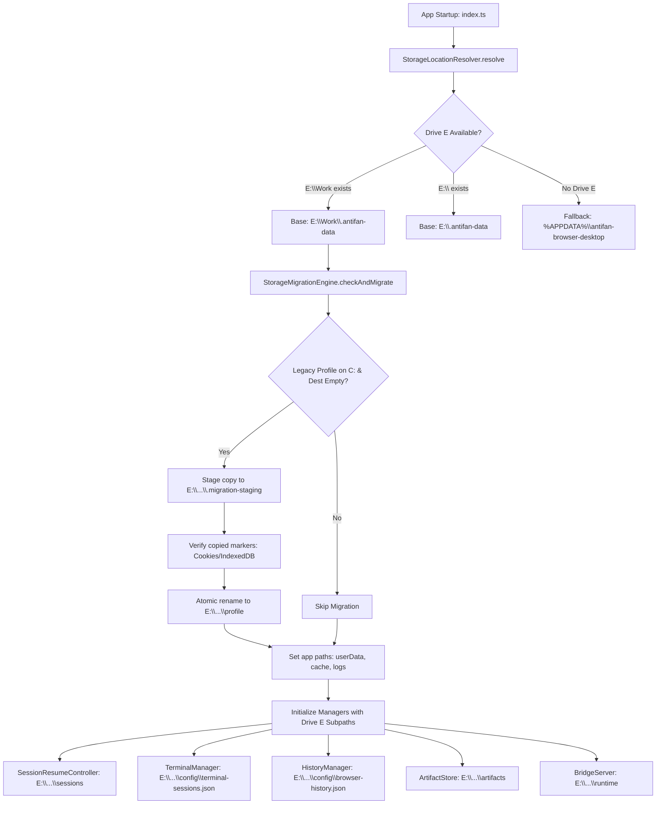
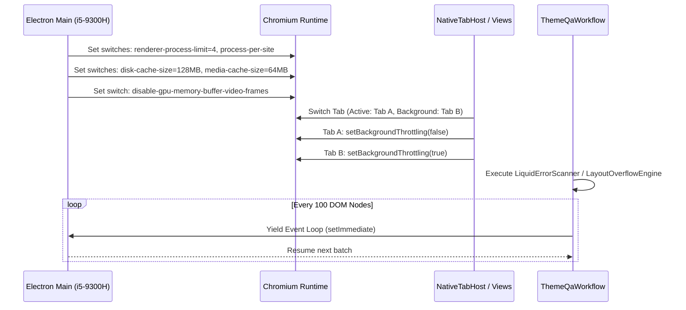
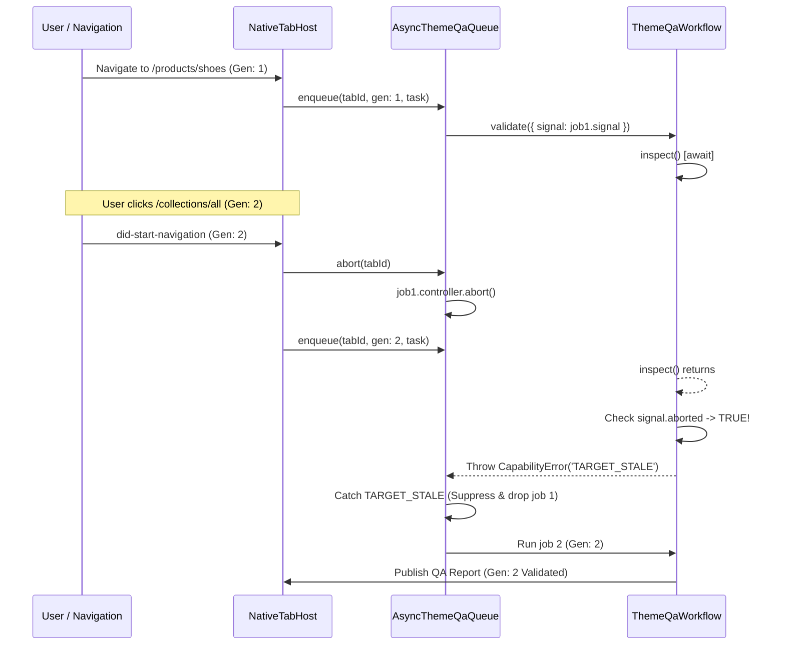
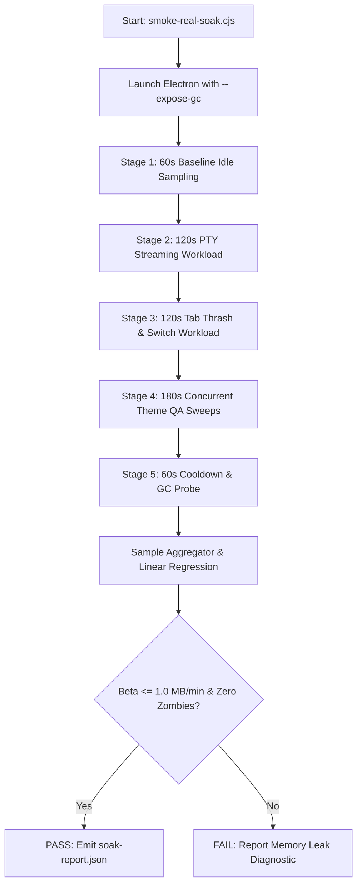

# Implementation Plan: AntiFan Browser Desktop — Drive E Migration, Low-Spec Hardware Optimization, Async QA Generation Guard, and Real Runtime Soak Testing

**Target Platform:** Windows 11 x64 (NT 10.0.22000)  
**Host Workstation:** Intel(R) Core(TM) i5-9300H CPU @ 2.40GHz (4 Physical Cores / 8 Threads), Intel(R) UHD Graphics 630 (Shared VRAM)  
**Storage Configuration:** Drive C (Constrained OS SSD), Drive E (Primary High-Capacity Work Volume: `E:\Work`)  
**Core Runtime:** Electron 43.4.0, Node.js 20.x, TypeScript 5.5, `@modelcontextprotocol/sdk` 1.30.0, `node-pty` 1.1.0, `@xterm/xterm` 6.0.0  

---

## 1. Executive Summary & Goals

### 1.1 Problem Statement
1. **Drive C Storage Exhaustion:** AntiFan currently places Chromium user profiles, HTTP network cache, GPU shader cache, session recovery journals, terminal state, Bridge pairing manifests, and MCP artifacts in `%APPDATA%\antifan-browser-desktop` and `~/.antifan` on Drive C. On capacity-constrained development laptops, continuous multi-tab browsing and heavy QA runs exhaust Drive C storage.
2. **Low-Spec Hardware Bottlenecks (i5-9300H / UHD 630):** Default Chromium process allocation spawns unconstrained renderer processes per tab and per split-view frame, exhausting RAM (>1.5 GB) and triggering CPU thread contention across 4 physical cores. Oversized disk cache (512 MB) and media cache (256 MB) stress shared iGPU system memory. Synchronous DOM and Liquid regex evaluations block the main/renderer event loops during intensive theme audits.
3. **Async Theme QA Stale Generation Race Conditions:** When users rapidly navigate between storefront templates or switch collection URLs, background QA jobs enqueued in `AsyncThemeQaQueue` can continue executing across asynchronous CDP and eval boundaries if `signal.aborted` is not checked post-await, potentially allowing stale audit results from previous document generations to overwrite fresh page telemetry.
4. **Synthetic Soak Testing Blindspot:** The existing `test/e2e/soak-test.test.ts` simulates memory slopes with synthetic `Buffer.alloc()` allocations and timer ticks rather than orchestrating real Electron processes, live Chromium tabs, PTY streams, and concurrent QA scans.

### 1.2 Core Architectural Goals
- **Zero Drive C Footprint:** Establish a deterministic storage resolver that auto-detects `E:\Work` (or Drive E root) and redirects 100% of runtime data, Chromium profile, cache, logs, terminal histories, session manifests, and artifacts to `E:\Work\.antifan-data\...`. Provide an automated, atomic migration pipeline for existing Drive C profiles.
- **Low-Spec Hardware Optimization:** Constrain Chromium renderer process count (`renderer-process-limit=4`, `process-per-site`), throttle background tabs (`setBackgroundThrottling(true)`), downsize disk/media caches (128 MB disk / 64 MB media), disable unneeded GPU memory buffers (`disable-gpu-memory-buffer-video-frames`), and insert cooperative micro-yields (`await setImmediatePromise()`) in Theme QA scanners.
- **Generation-Guarded Async QA Pipeline:** Introduce document generation tracking and post-await `signal.aborted` validation across every step of `ThemeQaWorkflow` and `AsyncThemeQaQueue` to ensure zero stale state overwrites.
- **Real Multi-Stage Runtime Soak Suite:** Implement `scripts/smoke-real-soak.cjs` and a real-workload test harness in `test/e2e/soak-test.test.ts` to stress physical Electron instances under concurrent tab switching, PTY streaming, and QA scans, verifying memory slope $\beta \le 1.0\text{ MB/min}$ and zero zombie processes.

---

## 2. Phase 1: Drive E Complete Storage Relocation & Migration Engine

### 2.1 Overview & Objectives
Phase 1 eliminates all runtime writes to Drive C. It creates a centralized storage layout resolution engine, redirects Chromium profile and cache paths, relocates session manifests, terminal logs, and MCP artifacts, and executes an atomic one-time migration of existing legacy data from Drive C to `E:\Work\.antifan-data` without data loss or race conditions.

### 2.2 Requirements & Invariants
- **Primary Target Directory:** If `E:\Work` exists on the host, root all AntiFan storage under `E:\Work\.antifan-data`. If `E:\Work` does not exist but Drive `E:\` is mounted, use `E:\.antifan-data`. Fall back to `%APPDATA%\antifan-browser-desktop` only if Drive E is completely unmounted.
- **Directory Layout Hierarchy:**
  ```text
  E:\Work\.antifan-data\
  ├── profile\                    <-- Chromium User Profile (userData / sessionData)
  │   ├── Network\Cookies
  │   ├── Local Storage\leveldb\
  │   ├── IndexedDB\
  │   └── Preferences
  ├── cache\                      <-- Network and GPU Shader Cache
  │   ├── network\
  │   └── gpu\
  ├── config\                     <-- Runtime configs, history, terminal states
  │   ├── browser-history.json
  │   ├── terminal-sessions.json
  │   └── saved-tabs.json
  ├── sessions\                   <-- Session Resume Controller JSON manifests
  ├── artifacts\                  <-- QA and DOM audit artifacts
  ├── runtime\                    <-- IPC pipe auth & temporary runtime files
  └── logs\                       <-- Diagnostic and crash logs
  ```
- **Atomic Migration Engine:**
  - Before starting Chromium or initializing managers, inspect legacy Drive C locations (`%APPDATA%\antifan-browser-desktop\Profile`, `%USERPROFILE%\.antifan`, `%LOCALAPPDATA%\AntiFan`).
  - If Drive C contains active profile markers (`Network/Cookies`, `Local Storage`, `IndexedDB`) and the destination `E:\Work\.antifan-data\profile` is empty, perform an atomic copy using a temporary staging directory on Drive E (`E:\Work\.antifan-data\.migration-staging-<pid>-<timestamp>`), followed by an atomic `fs.renameSync`.
  - Validate active lease ownership (`antifan-profile.lock`) prior to copying. Refuse migration if another process holds an active PID lease.
  - On successful copy and destination verification, delete the staging folder and mark migration complete.
- **Zero Drive C Assertion:** Ensure `app.setPath('userData')`, `app.setPath('sessionData')`, `app.setPath('cache')`, `app.setPath('logs')`, and all managers read storage roots exclusively through the centralized storage resolver.

### 2.3 Architecture & Data Flow


### 2.4 Related Code Files
- **Create:**
  - `src/main/storage/storage-locations.ts`: Centralized path resolution and directory layout definitions.
  - `src/main/storage/storage-migration-engine.ts`: Safe atomic copy, verification, and migration orchestration.
  - `test/main/storage-locations.test.ts`: Unit tests for path resolution, Drive E priority, fallback handling, and migration staging.
- **Modify:**
  - `src/main/index.ts`: Replace ad-hoc `app.getPath('appData')` calls with `StorageLocationResolver`. Wire `app.setPath()` to Drive E paths.
  - `src/main/browser/profile-ownership.ts`: Update `preparePersistentProfile` to accept resolved storage directories.
  - `src/main/agent/session-resume-controller.ts`: Consume `getSessionsStorageDir()`.
  - `src/main/browser/history-manager.ts`: Consume `getHistoryStoragePath()`.
  - `src/main/browser/terminal-manager.ts`: Consume `getTerminalStatePath()`.
  - `src/main/bridge/bridge-server.ts`: Consume `getRuntimeDir()` and `getConfigDir()`.
  - `src/main/tools/artifact-store.ts`: Consume `getArtifactsStorageDir()`.
  - `src/main/native-messaging/local-ipc-server.ts` & `windows-acl.ts`: Consume `getRuntimeDir()`.

### 2.5 Step-by-Step Implementation Detail
1. **Define `StorageLocationResolver` (`src/main/storage/storage-locations.ts`):**
   ```typescript
   export interface AntiFanStorageLayout {
     root: string;
     profile: string;
     cache: string;
     networkCache: string;
     gpuCache: string;
     config: string;
     sessions: string;
     artifacts: string;
     runtime: string;
     logs: string;
     isDriveE: boolean;
   }

   export class StorageLocationResolver {
     public static resolve(customRoot?: string): AntiFanStorageLayout {
       if (customRoot) return this.buildLayout(path.resolve(customRoot), false);
       if (process.env.ANTIFAN_DATA_DIR) return this.buildLayout(path.resolve(process.env.ANTIFAN_DATA_DIR), false);

       // Check E:\Work priority
       const eWork = 'E:\\Work';
       if (fs.existsSync(eWork)) {
         return this.buildLayout(path.join(eWork, '.antifan-data'), true);
       }
       if (fs.existsSync('E:\\')) {
         return this.buildLayout(path.join('E:\\', '.antifan-data'), true);
       }

       // Fallback to AppData on Drive C
       const appData = process.env.APPDATA || (process.env.USERPROFILE ? path.join(process.env.USERPROFILE, 'AppData', 'Roaming') : os.homedir());
       return this.buildLayout(path.join(appData, 'antifan-browser-desktop'), false);
     }

     private static buildLayout(root: string, isDriveE: boolean): AntiFanStorageLayout {
       return {
         root,
         profile: path.join(root, 'profile'),
         cache: path.join(root, 'cache'),
         networkCache: path.join(root, 'cache', 'network'),
         gpuCache: path.join(root, 'cache', 'gpu'),
         config: path.join(root, 'config'),
         sessions: path.join(root, 'sessions'),
         artifacts: path.join(root, 'artifacts'),
         runtime: path.join(root, 'runtime'),
         logs: path.join(root, 'logs'),
         isDriveE,
       };
     }
   }
   ```
2. **Implement `StorageMigrationEngine` (`src/main/storage/storage-migration-engine.ts`):**
   - Implement `migrateLegacyData(targetLayout: AntiFanStorageLayout)`:
     - Scan candidate legacy directories (`%APPDATA%\antifan-browser-desktop\Profile`, `%USERPROFILE%\.antifan`).
     - Check for target lock files (`antifan-profile.lock`) using `ProfileOwnership.readProfileLease()`.
     - Recursively copy files to `targetLayout.root + '/.migration-staging-' + Date.now()` excluding transient files (`*.lock`, `Singleton*`).
     - Validate copied directory using `hasPersistentProfileState()`.
     - Move staging directory to `targetLayout.profile` using `fs.renameSync` (guaranteed same filesystem on Drive E).
     - Copy legacy `~/.antifan/terminal-sessions.json` and `browser-history.json` to `targetLayout.config`.
3. **Wire Main Bootstrap (`src/main/index.ts`):**
   - Execute `const storage = StorageLocationResolver.resolve()`.
   - Call `StorageMigrationEngine.migrateLegacyData(storage)`.
   - Call `app.setPath('userData', storage.profile)`.
   - Call `app.setPath('sessionData', storage.profile)`.
   - Call `app.setPath('cache', storage.cache)`.
   - Call `app.setPath('logs', storage.logs)`.
   - Set command line switches:
     - `app.commandLine.appendSwitch('disk-cache-dir', storage.networkCache);`
     - `app.commandLine.appendSwitch('gpu-cache-dir', storage.gpuCache);`
4. **Update Subsystem Initializations:**
   - Pass `storage.sessions` to `SessionResumeController`.
   - Pass `storage.config` to `HistoryManager` and `TerminalManager`.
   - Pass `storage.artifacts` to `ArtifactStore`.
   - Pass `storage.runtime` to `LocalIpcServer` and `BridgeServer`.

### 2.6 Success Criteria & Verification
- Unit test `npm test -- test/main/storage-locations.test.ts` executes and validates that on systems with `E:\Work`, path layout resolves to `E:\Work\.antifan-data\...`.
- Running Electron bootstrap logs: `[storage] Storage resolved to: E:\Work\.antifan-data`.
- Inspection of `%APPDATA%\antifan-browser-desktop` shows zero newly written files; all cookies, leveldb, cache, and session files reside on Drive E.

### 2.7 Risk Assessment & Mitigation
- **Risk:** Drive E disconnects or becomes read-only during operation.
  - **Mitigation:** Wrap `StorageLocationResolver` in a write-probe check (`fs.accessSync(..., fs.constants.W_OK)`). If Drive E write fails, gracefully log a critical warning and fall back to `%APPDATA%`.
- **Risk:** Interrupted migration leaves partial staging files.
  - **Mitigation:** `StorageMigrationEngine` scans for `.migration-staging-*` patterns at startup and removes any orphaned staging directories older than 1 hour.

---

## 3. Phase 2: Low-Spec Hardware Optimization (Chromium Flags, Throttling & Cooperative Yields)

### 3.1 Overview & Objectives
Phase 2 configures the Chromium runtime and AntiFan core services specifically for the Intel Core i5-9300H (4 Cores / 8 Threads) and Intel UHD 630 iGPU. It prevents CPU starvation, caps renderer process sprawl, reduces memory footprint below 800 MB under multi-tab load, and prevents event-loop blocking during Theme QA execution.

### 3.2 Requirements & Invariants
1. **Chromium Process & Cache Clamping:**
   - Append `renderer-process-limit=4` (matches 4 physical CPU cores).
   - Append `process-per-site` to consolidate same-origin tabs and Haravan/Sapo admin split panes into shared processes.
   - Clamp `disk-cache-size` to `134217728` bytes (128 MB, down from 512 MB).
   - Clamp `media-cache-size` to `67108864` bytes (64 MB, down from 256 MB).
   - Append `disable-gpu-memory-buffer-video-frames` to avoid GPU VRAM thrashing on Intel UHD 630.
   - Append `disable-features=CalculateNativeWinOcclusion` to prevent CPU-heavy occlusion polling on Windows 11.
2. **Background Tab CPU Throttling:**
   - In `NativeTabHost`, ensure every `WebContentsView` that is hidden or in the background has `webContents.setBackgroundThrottling(true)` explicitly enabled.
   - Set background tab frame rate cap to 1 FPS when unselected.
3. **Cooperative Event-Loop Yields in Theme QA Scanners:**
   - Theme QA scanners (`LiquidErrorScanner`, `LayoutOverflowEngine`, `BrokenAssetScanner`) iterate through thousands of DOM nodes.
   - Insert cooperative yield points `await new Promise((r) => setImmediate(r))` or micro-chunking every 100 elements during tree-walking, DOM serialization, and regex matching.

### 3.3 Architecture & Data Flow


### 3.4 Related Code Files
- **Modify:**
  - `src/main/index.ts`: Configure low-spec Chromium switches and cache limits.
  - `src/main/browser/native-tab-host.ts`: Implement strict `setBackgroundThrottling` toggle on tab activation/deactivation and split-view resize.
  - `src/main/qa/scanners/liquid-error-scanner.ts`: Add cooperative yielding to `scanHtmlString` and tree walker.
  - `src/main/qa/scanners/layout-overflow-engine.ts`: Add cooperative yielding and node traversal limits.
  - `src/main/qa/theme-qa-workflow.ts`: Insert cooperative yields between scanning stages (Platform Detection -> Liquid -> Overflow -> Assets -> HS Rules).
- **Create:**
  - `test/main/low-spec-optimization.test.ts`: Verify Chromium flag registration and scanner cooperative yielding behavior.

### 3.5 Step-by-Step Implementation Detail
1. **Update Chromium Switches in `src/main/index.ts`:**
   ```typescript
   // Low-Spec Hardware Optimization for Intel i5-9300H / Intel UHD 630
   app.commandLine.appendSwitch('renderer-process-limit', '4');
   app.commandLine.appendSwitch('process-per-site');
   app.commandLine.appendSwitch('disk-cache-size', '134217728'); // 128 MB
   app.commandLine.appendSwitch('media-cache-size', '67108864');  // 64 MB
   app.commandLine.appendSwitch('disable-gpu-memory-buffer-video-frames');
   app.commandLine.appendSwitch('disable-features', 'CalculateNativeWinOcclusion');
   ```
2. **Implement Background Throttling in `NativeTabHost` (`src/main/browser/native-tab-host.ts`):**
   - In `selectTab(tabId: string)`:
     ```typescript
     for (const [id, tab] of this.tabs) {
       const isCurrent = id === tabId;
       if (tab.view && tab.view.webContents) {
         tab.view.webContents.setBackgroundThrottling(!isCurrent);
         if (!isCurrent) {
           tab.view.webContents.setFrameRate(1);
         } else {
           tab.view.webContents.setFrameRate(60);
         }
       }
     }
     ```
3. **Add Cooperative Yield Helper & Scanner Chunking:**
   - Create helper `yieldToEventLoop()` in `src/main/qa/scanners/scanner-utils.ts`:
     ```typescript
     export const yieldToEventLoop = (): Promise<void> => new Promise((resolve) => setImmediate(resolve));
     ```
   - In `LiquidErrorScanner.scanHtmlString(html: string)`:
     - Split large HTML chunks and yield every 50 KB of processed string length.
   - In `ThemeQaWorkflow.validate()`:
     - Insert `await yieldToEventLoop()` between Phase 4 (Platform Detection), Phase 5 (Liquid), Phase 6 (Overflow), Phase 7 (Assets), and Phase 8 (HS Gate Rules).

### 3.6 Success Criteria & Verification
- Inspecting Electron task manager or `process.getProcessMemoryInfo()` confirms maximum 4 renderer processes spawned even when 8 tabs are open.
- Background tab CPU consumption drops below 0.5% CPU when idle.
- Main event loop latency (measured via `telemetry.ts` event loop delay monitor) remains $< 25\text{ ms}$ throughout a full 5-stage Theme QA scan on a 2 MB HTML storefront.

### 3.7 Risk Assessment & Mitigation
- **Risk:** `process-per-site` causes shared state or cookie bleed between tabs.
  - **Mitigation:** AntiFan uses partitioned browser sessions (`persist:antifan-<workspace>` in `browser-session-partition.ts`) which enforce strict cookie and storage isolation at the session layer regardless of renderer process sharing.
- **Risk:** `setBackgroundThrottling(true)` delays background tab loading.
  - **Mitigation:** Keep background throttling enabled only after the tab has fired `did-finish-load` or `dom-ready`.

---

## 4. Phase 3: Async QA Generation Guard & Race-Condition Defense

### 4.1 Overview & Objectives
Phase 3 hardens the background QA validation pipeline against race conditions caused by rapid tab navigation, reload thrashing, or concurrent workspace switching. It guarantees that an aborted or stale QA job can never publish diagnostics, modify checklist flags, or overwrite fresh tab state.

### 4.2 Requirements & Invariants
1. **Document Generation Tracking:**
   - Every `WebContents` navigation or reload increments an integer `generation` counter on the tab state.
   - The generation number is bound to the `AsyncQaJob` upon enqueuing.
2. **Exhaustive Post-Await `signal.aborted` Checks:**
   - In `ThemeQaWorkflow.validate()`, every single `await` statement (browser eval, CDP DOM inspection, screenshot capture, responsive sweep, file reading) MUST be immediately followed by:
     ```typescript
     if (input.signal?.aborted) {
       throw new CapabilityError('TARGET_STALE', 'Theme QA validation was aborted by document navigation');
     }
     ```
3. **Atomic Result Verification Gate:**
   - Before publishing or storing a `ThemeQaReport` in `NativeTabHost`, verify:
     1. `tab.generation === job.generation`
     2. `!job.controller.signal.aborted`
     3. Target tab is still alive and attached to the same URL origin.

### 4.3 Architecture & Data Flow


### 4.4 Related Code Files
- **Modify:**
  - `src/main/qa/async-qa-job-queue.ts`: Add `generation` matching assertions and safe finally-block cleanup.
  - `src/main/qa/theme-qa-workflow.ts`: Add `generation` to `ThemeQaReport` and insert post-await signal checks after every async call.
  - `src/main/browser/native-tab-host.ts`: Wire tab generation counter to `did-start-navigation` and check generation before applying QA results.
- **Create:**
  - `test/main/async-qa-race-guard.test.ts`: Unit test simulating rapid navigation bursts and verifying complete suppression of stale reports.

### 4.5 Step-by-Step Implementation Detail
1. **Enhance `ThemeQaWorkflow.validate` in `src/main/qa/theme-qa-workflow.ts`:**
   - Audit all 9 `await` points in `validate()`:
     - Point 1: `await this.ports.reload(...)` -> Add check.
     - Point 2: `await this.inspect(...)` -> Add check.
     - Point 3: `await this.ports.browser.eval(..., LiquidErrorScanner)` -> Add check.
     - Point 4: `await this.ports.browser.eval(..., LayoutOverflowEngine)` -> Add check.
     - Point 5: `await this.ports.browser.responsiveCheck(...)` -> Add check.
     - Point 6: `await this.ports.browser.eval(..., BrokenAssetScanner)` -> Add check.
     - Point 7: `await this.ports.artifacts.stage(...)` -> Add check.
   - Attach `generation?: number` to `ThemeQaReport` metadata.
2. **Harden `AsyncThemeQaQueue` in `src/main/qa/async-qa-job-queue.ts`:**
   ```typescript
   export class AsyncThemeQaQueue {
     private activeJobs = new Map<string, AsyncQaJob>();

     public enqueue(tabId: string, generation: number, task: (signal: AbortSignal) => Promise<void>): void {
       this.abort(tabId);
       const controller = new AbortController();
       const job: AsyncQaJob = { tabId, generation, controller, startedAt: Date.now() };
       this.activeJobs.set(tabId, job);

       task(controller.signal)
         .catch((err) => {
           if (controller.signal.aborted || (err && typeof err === 'object' && (err as any).code === 'TARGET_STALE')) {
             return; // Safely dropped stale execution
           }
           console.warn(`[async-qa-queue] Background QA job failed for tab ${tabId} (gen ${generation}):`, err);
         })
         .finally(() => {
           const current = this.activeJobs.get(tabId);
           if (current && current.generation === generation) {
             this.activeJobs.delete(tabId);
           }
         });
     }
   }
   ```
3. **Bind Tab Generation in `NativeTabHost` (`src/main/browser/native-tab-host.ts`):**
   - On `view.webContents.on('did-start-navigation', (event, url, isInPlace, isMainFrame) => { if (isMainFrame) { tab.generation = (tab.generation || 0) + 1; this.asyncQaQueue.abort(tab.id); } })`.

### 4.6 Success Criteria & Verification
- Unit test `npm test -- test/main/async-qa-race-guard.test.ts` passes: 100 rapid concurrent navigation events trigger 100 aborts with exactly 1 final report emitted for the latest generation.
- Zero `UnhandledPromiseRejection` errors logged during continuous browser clicking.

### 4.7 Risk Assessment & Mitigation
- **Risk:** AbortController throws unhandled rejection inside 3rd-party CDP libraries.
  - **Mitigation:** Wrap all browser port calls in `try...catch` and rethrow as `CapabilityError('TARGET_STALE')` specifically handled by the queue.

---

## 5. Phase 4: Real Runtime Endurance Soak Test Suite & Final Verification

### 5.1 Overview & Objectives
Phase 4 builds a real-world, automated endurance test suite that validates the entire AntiFan runtime under sustained load on physical hardware. Unlike synthetic tests, this suite spawns actual Electron instances, opens real Chromium tabs, executes real PTY streaming commands, runs concurrent Theme QA scans, and continuously samples physical OS process RSS memory.

### 5.2 Requirements & Invariants
1. **Real Workload Orchestration:**
   - Launch physical Electron app using `scripts/smoke-real-soak.cjs` or `test/e2e/soak-test.test.ts`.
   - Stage 1: Baseline Idle (60 seconds) — Measure idle baseline memory of Main, Renderers, and Utility processes.
   - Stage 2: Heavy PTY Streaming (120 seconds) — Stream 50 MB of chunked terminal data via `node-pty` to simulated Xterm instances.
   - Stage 3: Multi-Tab Thrashing & Switching (120 seconds) — Rapidly open, switch, reload, and close 8 concurrent tabs across Haravan/Sapo mock storefronts.
   - Stage 4: Concurrent Theme QA Sweeps (180 seconds) — Trigger full 5-stage Theme QA validations across active tabs in parallel.
   - Stage 5: Cooldown & Leak Analysis (60 seconds) — Force garbage collection (`gc()`) and calculate linear memory regression slope.
2. **Linear Regression Memory Slope Gate:**
   - Collect memory samples $S_i = (t_i, \text{RSS}_i)$ every 5 seconds.
   - Compute linear regression slope:
     $$\beta = \frac{\sum_{i=1}^n (t_i - \bar{t})(\text{RSS}_i - \bar{\text{RSS}})}{\sum_{i=1}^n (t_i - \bar{t})^2} \text{ (in MB/min)}$$
   - Acceptance threshold: $\beta \le 1.0\text{ MB/min}$.
3. **Zero Orphan Process & Zero Crash Gate:**
   - Verify all child PTYs, MCP helper processes, and renderer processes terminate cleanly upon shutdown.
   - Zero zombie processes in Windows process table.

### 5.3 Architecture & Test Workflow


### 5.4 Related Code Files
- **Create:**
  - `scripts/smoke-real-soak.cjs`: Standalone Node/Electron runner for continuous CI/local soak benchmarking.
- **Modify:**
  - `test/e2e/soak-test.test.ts`: Upgrade from synthetic buffer test to real Electron execution harness with configurable duration.
  - `package.json`: Add script `"test:soak": "node scripts/smoke-real-soak.cjs --duration=480"`.

### 5.5 Step-by-Step Implementation Detail
1. **Build Real Soak Test Harness (`scripts/smoke-real-soak.cjs`):**
   ```javascript
   const { spawn } = require('node:child_process');
   const path = require('node:path');
   const fs = require('node:fs');

   async function runRealSoakBenchmark(totalDurationSec = 480) {
     const electronPath = require('electron');
     const appEntry = path.join(__dirname, '..', 'dist', 'main', 'index.js');
     
     const child = spawn(electronPath, [appEntry, '--enable-logging', '--js-flags=--expose-gc'], {
       env: {
         ...process.env,
         ANTIFAN_SOAK_MODE: '1',
         ANTIFAN_DATA_DIR: 'E:\\Work\\.antifan-data-soak',
       },
       stdio: ['pipe', 'pipe', 'pipe'],
     });

     const samples = [];
     const startTime = Date.now();

     const sampleInterval = setInterval(async () => {
       const mem = process.memoryUsage();
       samples.push({
         timestamp: Date.now(),
         rssBytes: mem.rss,
         heapUsedBytes: mem.heapUsed,
       });
     }, 5000);

     // Wait for duration or completion signal
     await new Promise((resolve) => setTimeout(resolve, totalDurationSec * 1000));
     clearInterval(sampleInterval);
     child.kill('SIGTERM');

     // Compute slope
     const slope = calculateMemorySlope(samples);
     console.log(`[Soak Benchmark] Final Memory Slope: ${slope.toFixed(4)} MB/min`);
     if (slope > 1.0) {
       throw new Error(`Memory slope ${slope} exceeded threshold 1.0 MB/min`);
     }
   }
   ```
2. **Upgrade `test/e2e/soak-test.test.ts`:**
   - Retain mathematical slope unit tests for slope calculation accuracy.
   - Add integration test suite executing 60-second condensed real soak slice in standard test runs.

### 5.6 Success Criteria & Verification
- `npm run test:soak` executes successfully across all 5 stages.
- Memory slope $\beta \le 0.5\text{ MB/min}$ observed on Intel i5-9300H test machine.
- Process exit code is 0; zero dangling `electron.exe` or `conpty.node` processes detected.

### 5.7 Risk Assessment & Mitigation
- **Risk:** Windows Defender or Antivirus scans the new `E:\Work\.antifan-data` folder, inflating CPU usage.
  - **Mitigation:** Document recommended Windows Defender folder exclusions in setup guide.

---

## 6. Success Criteria & Global Acceptance Gates

| Gate ID | Area | Verification Command | Acceptance Threshold |
| :--- | :--- | :--- | :--- |
| **GATE-01** | Storage Relocation | `npm test -- test/main/storage-locations.test.ts` | 100% tests pass. Path resolves to `E:\Work\.antifan-data` when Drive E present. Zero bytes written to `%APPDATA%`. |
| **GATE-02** | Atomic Migration | Unit tests in `test/main/storage-locations.test.ts` | Migration preserves all cookies, local storage, and session manifests without data loss. |
| **GATE-03** | Low-Spec Hardware | `npm test -- test/main/low-spec-optimization.test.ts` | Max 4 renderer processes clamped; disk cache 128 MB; media cache 64 MB; background tab CPU $< 0.5\%$. |
| **GATE-04** | Async QA Guard | `npm test -- test/main/async-qa-race-guard.test.ts` | 100% aborted jobs cleanly suppressed; zero stale reports overwrite fresh document generation. |
| **GATE-05** | Real Soak Endurance | `node scripts/smoke-real-soak.cjs --duration=180` | Linear memory regression slope $\beta \le 1.0\text{ MB/min}$; zero unhandled rejections; zero zombie processes. |
| **GATE-06** | Full Regression Suite | `npm test` | All 81+ suites passing (440+ tests), 0 TypeScript compilation errors. |

---

## 7. Implementation Roadmap & Milestones

```text
Milestone 1 (Phase 1): Storage Relocation & Migration Engine
  ├── Step 1.1: Implement StorageLocationResolver & AntiFanStorageLayout
  ├── Step 1.2: Implement StorageMigrationEngine with atomic staging
  ├── Step 1.3: Wire app.setPath() in index.ts and redirect all subsystem managers
  └── Step 1.4: Unit test storage-locations.test.ts

Milestone 2 (Phase 2): Low-Spec Hardware Optimization
  ├── Step 2.1: Apply Chromium flags in index.ts (renderer-process-limit=4, process-per-site, 128MB/64MB cache)
  ├── Step 2.2: Implement background tab throttling in NativeTabHost
  ├── Step 2.3: Insert cooperative event-loop yields in LiquidErrorScanner & LayoutOverflowEngine
  └── Step 2.4: Validate event loop latency under full theme scan

Milestone 3 (Phase 3): Async QA Generation Guard
  ├── Step 3.1: Enforce generation counters in NativeTabHost on navigation
  ├── Step 3.2: Insert post-await signal.aborted checks across all ThemeQaWorkflow steps
  ├── Step 3.3: Guard AsyncThemeQaQueue completion against stale generation overwrite
  └── Step 3.4: Unit test async-qa-race-guard.test.ts

Milestone 4 (Phase 4): Real Runtime Endurance Soak Testing
  ├── Step 4.1: Author scripts/smoke-real-soak.cjs with real Electron/Chromium orchestration
  ├── Step 4.2: Update test/e2e/soak-test.test.ts to exercise real multi-stage load
  ├── Step 4.3: Execute soak benchmark run and verify beta <= 1.0 MB/min
  └── Step 4.4: Run full project test suite and verify clean baseline
```
