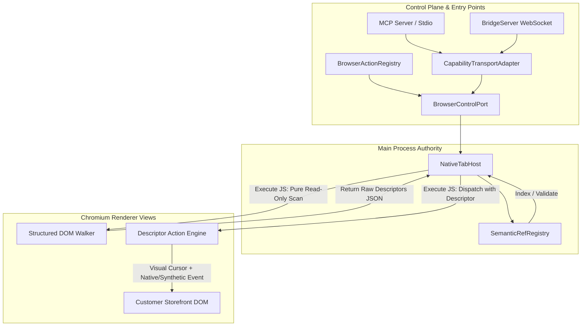

# Planner Ultra Candidate 1: Main-Owned Semantic Ref Authority & Zero-Mutation Action Pipeline

## 1. Executive Summary & Goals

### 1.1 Problem Statement
The existing AntiFan browser automation system relies on in-page DOM mutations and renderer-owned state:
1. `src/main/browser/agent-browser.ts` injects a script that creates `window.__antifanRefMap` and stamps `data-antifan-ref="@eN"` attributes onto live customer DOM elements.
2. In-page mutations can corrupt customer JavaScript frameworks (React/Vue/Liquid hydration), fail on detached elements, and leak state across single-page application (SPA) navigations.
3. The Main process acts merely as a passthrough for raw snapshot strings, lacking ownership of element descriptors, snapshot generations, frame traversal paths, or target pane validation.
4. Multiple entry points (`src/main/bridge/bridge-server.ts`, `src/main/browser/browser-action-registry.ts`, `src/main/tools/browser-control-port.ts`) bypass uniform target validation or drop critical parameters like `ref` and `paneId`.

### 1.2 Target Outcome
Establish the **Main Process** as the single source of truth for semantic element references (`@e1`, `@e2`, ...). The in-page script becomes a strictly read-only structured DOM walker. Main assigns ref tags, indexes element descriptors keyed by `(tabId, paneId, browserEpoch, documentGeneration, snapshotId)`, and enforces fail-closed validation before any action touches the page. Live customer DOM receives zero attribute modifications (`data-antifan-ref` is eliminated), and `window.__antifanRefMap` is removed.

### 1.3 Core Goals
1. **Main-Owned Semantic Ref Authority**: All ref indexing, text formatting, and lifecycle tracking reside in Main.
2. **Zero-Mutation DOM Perception**: Walker extracts descriptors without altering DOM attributes or properties.
3. **Fail-Closed Target Security**: Any ref action targeting a stale document generation, mismatched pane, detached node, or unknown ref immediately rejects with structured errors before renderer dispatch.
4. **Universal Guarded Dispatch**: MCP tools, capability aliases, WebSocket bridge, Action Registry, and Theme QA route through one unified, guarded validation pipeline.
5. **Full Feature Preservation**: 100% preservation of same-origin iframe traversal, open Shadow DOM scanning, storefront metadata (`data-section-id`, `data-product-id`, `data-block-id`), split desktop/mobile pane routing, and visual Bézier cursor animations.
6. **No CDP Accessibility Dependency**: Maintain independence from `Accessibility.enable()` to avoid continuous AX cache overhead and DevTools debugger collisions.

---

## 2. Constraints & Non-Goals

### 2.1 Technical Constraints
- **Runtime Environment**: Electron 43.4.0, Node.js CommonJS/TypeScript, `WebContentsView` architecture.
- **Hardware Profile**: Low-spec host budget (Intel Core i5-9300H, Intel UHD 630, 8-16 GB RAM). Memory overhead per tab must be strictly bounded (max 5 snapshots per pane, max 500 descriptors per snapshot).
- **Public Contract Invariance**: Public MCP tool names (`antifan_agent_snapshot`, `antifan_agent_click`, `antifan_agent_type`, etc.), capability aliases (`browser.agent-snapshot`, `anti.agent.cursor.click`), and JSON return envelopes (`{ snapshot, success }`, `{ clicked, success }`, `{ typed, success }`) must remain 100% backward-compatible.
- **Clean Cutover Invariant**: No dual-authority compatibility ref maps, no DOM attribute fallbacks, and no hidden selector guessing for stale refs.
- **Personal/Local Tool**: Desktop workstation workflow; no remote multi-tenant cloud relay or public extension store distribution.

### 2.2 Explicit Non-Goals
- Terminal PTY/replay architecture changes (already completed in separate plans).
- Remote SSH daemons or multi-host relay infrastructure.
- Monolithic `NativeTabHost` rewrite beyond the semantic ref and action dispatch seams.
- CDP auto-attachment or mandatory Chrome DevTools Protocol debugger sessions.

---

## 3. Architecture & System Design

### 3.1 Component Topology



### 3.2 Data Contracts & Types (`src/shared/control-plane-contracts.ts` & `src/main/browser/semantic-ref-types.ts`)

```typescript
export type SplitPaneId = 'desktop' | 'mobile';

export interface ElementFramePathSegment {
  frameIndex: number;
  frameId?: string;
  frameName?: string;
}

export interface ElementShadowPathSegment {
  hostSelector: string;
  hostIndex: number;
}

export interface ElementTraversalPath {
  framePath: ElementFramePathSegment[];
  shadowPath: ElementShadowPathSegment[];
  domPath: string; // Hierarchical CSS selector path within leaf document/shadowRoot
}

export interface ElementFingerprint {
  tagName: string;
  id?: string;
  className?: string;
  role?: string;
  type?: string;
  name?: string;
  textHash: string; // First 32 chars of normalized text
  childIndex: number;
}

export interface ViewportRect {
  left: number;
  top: number;
  right: number;
  bottom: number;
  width: number;
  height: number;
  centerX: number;
  centerY: number;
}

export interface StorefrontMetadata {
  sectionId?: string;
  productId?: string;
  blockId?: string;
  themeEditorSetting?: string;
}

export interface RawElementDescriptor {
  tagName: string;
  role: string;
  type?: string;
  label: string;
  id?: string;
  traversalPath: ElementTraversalPath;
  fingerprint: ElementFingerprint;
  globalRect: ViewportRect;
  storefront: StorefrontMetadata;
  isVisible: boolean;
  isEnabled: boolean;
}

export interface SemanticElementDescriptor extends RawElementDescriptor {
  ref: string; // e.g. "@e1", "@e2"
  tabId: string;
  paneId: SplitPaneId;
  browserEpoch: number;
  documentGeneration: number;
  snapshotId: string;
  createdAt: number;
}

export interface SemanticSnapshotRecord {
  snapshotId: string;
  tabId: string;
  paneId: SplitPaneId;
  browserEpoch: number;
  documentGeneration: number;
  url: string;
  createdAt: number;
  descriptors: Map<string, SemanticElementDescriptor>; // Keyed by "@eN"
  formattedText: string;
}

export type SemanticActionType = 'click' | 'type' | 'hover' | 'scroll' | 'highlight' | 'move';

export interface SemanticActionPayload {
  action: SemanticActionType;
  descriptor?: SemanticElementDescriptor;
  explicitSelector?: string;
  x?: number;
  y?: number;
  text?: string;
  clear?: boolean;
  deltaY?: number;
  label?: string;
}

export interface SemanticActionResult {
  success: boolean;
  action: SemanticActionType;
  targetRef?: string;
  resolvedCoordinates?: { x: number; y: number };
  executedSteps?: number;
  reason?: string;
}
```

### 3.3 Main-Owned Semantic Ref Registry (`src/main/browser/semantic-ref-registry.ts`)

The `SemanticRefRegistry` manages snapshot storage per `(tabId, paneId)`.
- **Keying**: `tabId -> paneId -> Array<SemanticSnapshotRecord>` (ordered newest to oldest).
- **Bounds**: Maximum 5 snapshot records per `(tabId, paneId)` pair; maximum 500 descriptors per snapshot.
- **Eviction Triggers**:
  1. `onNavigation(tabId, newDocGen)`: Drops all prior snapshot records for that tab (generation mismatch).
  2. `onEpochChange(newEpoch)`: Clears all tabs (browser host reload).
  3. `onTabClosed(tabId)`: Evicts the entire tab bucket.
  4. `onPaneDestroyed(tabId, paneId)`: Evicts the specific pane bucket.
- **Resolution**:
  ```typescript
  resolveRef(params: {
    tabId: string;
    paneId: SplitPaneId;
    browserEpoch: number;
    documentGeneration: number;
    ref: string;
  }): { ok: true; descriptor: SemanticElementDescriptor } | { ok: false; code: 'REF_STALE' | 'REF_NOT_FOUND' | 'TARGET_STALE' | 'PANE_MISMATCH'; message: string }
  ```

### 3.4 In-Page Read-Only Walker Contract (`src/main/browser/agent-browser.ts`)

The injected script provides `window.__antifanAgentScanDocument()`:
1. Traverses document body, same-origin nested `<iframe>` elements (up to depth 4), and open Shadow Roots.
2. Identifies interactive elements (`button`, `a[href]`, `input`, `textarea`, `select`, ARIA roles, tabindex).
3. Reads computed styles (`display !== 'none'`, `visibility !== 'hidden'`, `opacity !== '0'`) and bounding client rects.
4. Extracts metadata: Shopify/Haravan `data-section-id`, `data-product-id`, `data-block-id`.
5. Computes global viewport coordinates by accumulating iframe offsets.
6. Generates structural node fingerprint (`tagName`, `id`, `className`, `textHash`, `childIndex`, `traversalPath`).
7. **Zero DOM Mutation**: Never assigns `data-antifan-ref`, never writes `window.__antifanRefMap`.
8. Returns array of `RawElementDescriptor`.

### 3.5 Descriptor Execution Primitive (`src/main/browser/agent-browser.ts`)

The injected script provides `window.__antifanAgentExecuteDescriptorAction(payload)`:
1. If `payload.descriptor` is provided:
   - Resolves node via `traversalPath` (descending through iframe content documents and shadow roots).
   - Validates node fingerprint against live node (checks `tagName`, `id`, `textHash`). If node detached or replaced, aborts with `{ success: false, reason: 'NODE_DETACHED_OR_REPLACED' }`.
   - Scrolls element into view with `scrollIntoView({ behavior: 'smooth', block: 'center', inline: 'center' })`.
   - Re-evaluates global coordinates.
2. If `payload.explicitSelector` is provided:
   - Performs deep shadow search without ref translation.
3. If coordinates are provided:
   - Uses exact viewport (x, y).
4. Animates Bézier cursor with Fitts's law kinematics and action banner badge.
5. Executes event sequence (`focus`, `mousedown`, `mouseup`, `click`, or keyboard input).
6. Returns execution telemetry.

---

## 4. Cross-Plan Relationships & Superseding Strategy

### 4.1 Relationship to `plans/260830-1617-runtime-resilience-and-semantic-hardening/`
- **Status**: Completed historical plan (2026-08-30).
- **Scope Alignment**: That plan established initial semantic perceptions, async QA queues, and soak test suites. It deliberately implemented renderer-owned refs as a foundational step.
- **Contract**: Candidate 1 treats `260830-1617` as permanent, immutable foundation. Candidate 1 builds upon its `AsyncThemeQaQueue` and soak test harness while replacing the renderer-owned ref mechanism with Main authority.

### 4.2 Relationship to `plans/260822-refactor-native-tab-host-and-unify-capabilities/`
- **Status**: Phase 1 (helper extraction: `tab-diagnostics.ts`, `tab-zoom-controller.ts`, etc.) is already committed on disk. Phase 2 (capability unification & guarded dispatch) is partially incomplete.
- **Superseding Decision**: Candidate 1 supersedes Phase 2 of `260822` by implementing exact target-validated action routing across MCP, Bridge, and CapabilityCatalogue for all browser automation tools.

---

## 5. Five Sequential Implementation Phases

### Phase 1: Contract Characterization, Typed Descriptors, and Guarded Error Taxonomy

#### Exact Files & Symbols
- `src/shared/control-plane-contracts.ts`:
  - Export `RawElementDescriptor`, `SemanticElementDescriptor`, `SemanticSnapshotRecord`, `ElementTraversalPath`, `ElementFingerprint`, `ViewportRect`, `StorefrontMetadata`.
  - Add error codes to `CapabilityErrorCode`: `'REF_STALE'`, `'REF_NOT_FOUND'`, `'PANE_MISMATCH'`, `'NODE_DETACHED'`.
- `src/main/browser/semantic-ref-types.ts` (new file):
  - Internal registry interfaces and descriptor converters.
- `test/main/semantic-contracts.test.ts` (new test suite):
  - Unit tests characterizing descriptor serialization, fingerprinting, and error codes.

#### Implementation Steps
1. Define TypeScript interfaces for element traversal paths, fingerprints, viewport rects, and raw/semantic element descriptors.
2. Extend `CapabilityError` taxonomy with specific semantic ref failure codes.
3. Create snapshot text formatter utility `formatSemanticSnapshotText(descriptors: SemanticElementDescriptor[]): string` in `src/main/browser/semantic-ref-types.ts` to guarantee exact backward compatibility with existing snapshot text output (`@e1 [role:type] "label" (id: "x", section: "y")`).
4. Write contract tests validating that descriptor types round-trip cleanly across JSON IPC boundaries without loss of precision.

#### Tests Before / After
- **Before**: `npm run typecheck` passes; existing test suite passes.
- **After**: `node --test .compiled/test/main/semantic-contracts.test.js` passes, validating contract schemas, formatter output, and error taxonomy.

#### Negative Cases
- Descriptors with invalid coordinates (NaN, Infinity) are rejected during validation.
- Missing required fields (traversalPath, fingerprint) fail typecheck and schema assertions.

#### Rollback Signal
- Typecheck failures in shared contracts or breaking changes to existing `CapabilityError` instances.

#### Verification Commands
```bash
npm run build:ts
node --test .compiled/test/main/semantic-contracts.test.js
```

---

### Phase 2: Main-Owned Multi-Tenant Semantic Ref Registry & Lifecycle Invalidation

#### Exact Files & Symbols
- `src/main/browser/semantic-ref-registry.ts` (new file):
  - Class `SemanticRefRegistry`:
    - `registerSnapshot(record: Omit<SemanticSnapshotRecord, 'descriptors'>, rawList: RawElementDescriptor[]): SemanticSnapshotRecord`
    - `resolveRef(tabId: string, paneId: SplitPaneId, browserEpoch: number, documentGeneration: number, ref: string): SemanticRefResolutionResult`
    - `getLatestSnapshot(tabId: string, paneId: SplitPaneId): SemanticSnapshotRecord | undefined`
    - `invalidateDocument(tabId: string, documentGeneration?: number): void`
    - `invalidateTab(tabId: string): void`
    - `invalidatePane(tabId: string, paneId: SplitPaneId): void`
    - `clearAll(): void`
- `test/main/semantic-ref-registry.test.ts` (new test suite):
  - Comprehensive unit tests for registry indexing, generation pinning, LRU bounds, and eviction.

#### Implementation Steps
1. Implement `SemanticRefRegistry` with internal storage structure:
   ```typescript
   private snapshots: Map<string, Map<SplitPaneId, SemanticSnapshotRecord[]>> = new Map();
   ```
2. Implement LRU bounding: when adding a snapshot for `(tabId, paneId)`, enforce max 5 snapshot records; drop oldest.
3. Assign deterministic `@e1`, `@e2`, ... refs in Main during `registerSnapshot`.
4. Implement strict multi-dimensional ref resolution matching `tabId`, `paneId`, `browserEpoch`, and `documentGeneration`.
5. Implement eviction hooks for tab navigations, tab closures, pane changes, and host epoch increments.

#### Tests Before / After
- **Before**: No Main-side registry exists; snapshot refs are only stored in renderer `window.__antifanRefMap`.
- **After**: `node --test .compiled/test/main/semantic-ref-registry.test.js` passes with 100% coverage of generation invalidation, pane isolation, and memory bounds.

#### Negative Cases
- Requesting ref `@e1` with `documentGeneration = 6` when current document is `7` returns `{ ok: false, code: 'REF_STALE' }`.
- Requesting ref `@e1` on `mobile` pane when snapshot was captured on `desktop` returns `{ ok: false, code: 'PANE_MISMATCH' }`.
- Requesting nonexistent ref `@e999` returns `{ ok: false, code: 'REF_NOT_FOUND' }`.

#### Rollback Signal
- Memory leaks in `SemanticRefRegistry` during rapid navigation or failure to evict closed tabs.

#### Verification Commands
```bash
npm run build:ts
node --test .compiled/test/main/semantic-ref-registry.test.js
```

---

### Phase 3: Action Surface Normalization & Guarded Dispatch Cutover

#### Exact Files & Symbols
- `src/main/tools/browser-control-port.ts`:
  - Update `agentClick`, `agentType`, `agentHover`, `agentScroll`, `agentHighlight`, `agentMove`, `agentTrajectory`, `agentSnapshot`:
    - Ensure all accept `{ ref?: string; selector?: string; paneId?: 'desktop' | 'mobile'; ... }`.
    - Pin and resolve refs against `this.semanticRegistry` and validate against `this.assertCurrent(target)`.
- `src/main/tools/browser-capabilities.ts`:
  - Update capability registration schemas for `browser.agent-click`, `browser.agent-type`, `browser.agent-hover`, `browser.agent-scroll`, `browser.agent-move`, `browser.agent-snapshot`, and all `antifan_*` aliases to include `ref` and `paneId`.
- `src/main/browser/browser-action-registry.ts`:
  - Update schemas and action handlers for `agentSnapshot`, `agentClick`, `agentType`, `agentHover`, `agentScroll`, `agentHighlight` to pass validated parameters to `tabHost`.
- `src/main/bridge/bridge-server.ts`:
  - Update RPC methods `agentClick`, `agentType`, `agentScroll`, `agentHover`, `agentHighlight`, `agentClear`, `agentMove`, `agentTrajectory` to route through `CapabilityTransportAdapter.dispatch` or pass `ref` and `paneId` to guarded `tabHost` methods.
- `test/main/action-registry.test.ts` & `test/main/bridge-attachment-dispatch.test.ts` & `test/main/capability-catalogue.test.ts`:
  - Update and expand test suites to verify guarded dispatch and error propagation.

#### Implementation Steps
1. Inject `SemanticRefRegistry` into `BrowserControlPort` and `NativeTabHost`.
2. In `BrowserControlPort`, resolve any incoming `ref` (e.g. `@e1`) against `SemanticRefRegistry` using the active `BrowserTarget` (`tabId`, `paneId`, `browserEpoch`, `documentGeneration`).
3. If `ref` is present but invalid/stale, throw `CapabilityError('REF_STALE' | 'REF_NOT_FOUND')` immediately without invoking the renderer.
4. Normalize `paneId` across all action schemas in `BrowserActionRegistry` and `browser-capabilities.ts`.
5. Update `BridgeServer` to ensure WebSocket calls forward `ref` and `paneId` and handle `REF_STALE` errors gracefully.

#### Tests Before / After
- **Before**: `BridgeServer` and `BrowserActionRegistry` dropped `ref` or `paneId` in several action routes; stale refs reached renderer.
- **After**: All action entry points pass normalized `ref` and `paneId`; stale refs fail closed in Main.

#### Negative Cases
- Invoking `antifan_agent_click` with `@e1` after page reload rejects with `REF_STALE` without touching renderer.
- Invoking `agentType` via WebSocket bridge with mismatched `paneId` fails with `PANE_MISMATCH`.

#### Rollback Signal
- Test failures in `capability-catalogue.test.ts` or `bridge-attachment-dispatch.test.ts`.

#### Verification Commands
```bash
npm run build:ts
node --test .compiled/test/main/action-registry.test.js
node --test .compiled/test/main/capability-catalogue.test.js
node --test .compiled/test/main/bridge-attachment-dispatch.test.js
```

---

### Phase 4: Zero-Mutation Renderer Walker, Descriptor Execution Primitives & Legacy Teardown

#### Exact Files & Symbols
- `src/main/browser/agent-browser.ts`:
  - Replace `window.__antifanAgentSnapshot` with pure `window.__antifanAgentScanDocument()`.
  - Delete `window.__antifanRefMap`, `querySelectorDeep('@e...')`, and all `setAttribute('data-antifan-ref', ...)` / `removeAttribute('data-antifan-ref')` calls.
  - Implement `window.__antifanAgentExecuteDescriptorAction(payload)`: handles descriptor path re-traversal, fingerprint check, visual cursor glide, ripple animation, and event dispatch.
  - Retain `generateBezierPath`, `activateOverlay`, `ensureCursor`, `showBanner`, `createClickRipple` for visual feedback.
- `src/main/browser/native-tab-host.ts`:
  - Wire `agentSnapshot(tabId, paneId)`:
    1. Injects `AGENT_BROWSER_SCRIPT`.
    2. Calls `__antifanAgentScanDocument()`, receiving `RawElementDescriptor[]`.
    3. Calls `semanticRegistry.registerSnapshot(...)` to generate `@eN` refs and store records in Main.
    4. Returns formatted snapshot string.
  - Wire `agentClick`, `agentType`, `agentHover`, `agentScroll`, `agentHighlight`:
    1. Resolve `ref` in Main via `semanticRegistry`.
    2. Pass resolved `SemanticElementDescriptor` to `__antifanAgentExecuteDescriptorAction`.
  - Wire navigation event listeners:
    - `did-navigate`, `did-navigate-in-page`, `will-navigate`, `render-process-gone` -> trigger `semanticRegistry.invalidateDocument(tabId, newDocGen)`.
- `test/main/agent-browser-script.test.ts` & `test/main/native-tab-host-agent-lifecycle.test.ts`:
  - Update tests to verify zero DOM mutations, removal of `__antifanRefMap`, and descriptor-based execution.

#### Implementation Steps
1. Refactor `AGENT_BROWSER_SCRIPT` in `agent-browser.ts` to remove all DOM writes during scanning.
2. Implement descriptor node resolution logic in renderer:
   ```javascript
   function resolveNodeByDescriptor(desc) {
     let doc = document;
     for (const seg of desc.traversalPath.framePath) {
       const iframes = doc.querySelectorAll('iframe');
       const targetFrame = iframes[seg.frameIndex];
       if (!targetFrame) return null;
       doc = targetFrame.contentDocument || targetFrame.contentWindow?.document;
       if (!doc) return null;
     }
     let root = doc;
     for (const seg of desc.traversalPath.shadowPath) {
       const hosts = root.querySelectorAll(seg.hostSelector);
       const host = hosts[seg.hostIndex];
       if (!host || !host.shadowRoot) return null;
       root = host.shadowRoot;
     }
     const el = root.querySelector(desc.traversalPath.domPath);
     if (!el) return null;
     // Verify fingerprint
     if (el.tagName.toLowerCase() !== desc.fingerprint.tagName.toLowerCase()) return null;
     if (desc.fingerprint.id && el.id !== desc.fingerprint.id) return null;
     return el;
   }
   ```
3. Update `native-tab-host.ts` agent methods to coordinate with `semanticRegistry`.
4. Delete all deprecated references to `data-antifan-ref` across the codebase.

#### Tests Before / After
- **Before**: `agent-browser-script.test.ts` verified `window.__antifanRefMap` and `data-antifan-ref`.
- **After**: `agent-browser-script.test.ts` asserts `window.__antifanRefMap` is undefined, `data-antifan-ref` is never set, and `__antifanAgentScanDocument` returns pristine structured descriptors.

#### Negative Cases
- DOM element modified or removed between snapshot and click triggers `NODE_DETACHED_OR_REPLACED` in renderer and returns structured failure to Main.
- Cross-origin iframe is skipped gracefully without security exceptions.

#### Rollback Signal
- Failure of visual cursor animation, broken click dispatch, or iframe traversal regressions.

#### Verification Commands
```bash
npm run build:ts
node --test .compiled/test/main/agent-browser-script.test.js
node --test .compiled/test/main/native-tab-host-agent-lifecycle.test.js
```

---

### Phase 5: End-to-End Verification, Performance Soak, DevTools Compatibility & Documentation

#### Exact Files & Symbols
- `test/e2e/semantic-ref-authority.test.ts` (new vertical slice test):
  - Tests snapshot capture across nested same-origin iframes and open shadow roots.
  - Tests click and type on `@ref` targets with visual cursor validation.
  - Tests split-pane review (`desktop` vs `mobile`) isolation.
  - Tests navigation race: rapid page navigation invalidates pending refs.
  - Tests DevTools compatibility: snapshot and action execution with DevTools open/closed.
- `test/e2e/soak-test.test.ts`:
  - Run memory soak verification to confirm zero memory leaks and flat RAM slope across 100+ snapshot/action cycles.
- `docs/system-architecture.md` (or architectural docs):
  - Document Main-owned semantic ref authority, descriptor contracts, and fail-closed validation rules.

#### Implementation Steps
1. Build end-to-end integration test exercising the full stack: `CapabilityCatalogue` -> `BrowserControlPort` -> `NativeTabHost` -> `SemanticRefRegistry` -> Chromium `WebContentsView`.
2. Verify split-view review: snapshot on desktop pane generates `@e1`, snapshot on mobile pane generates separate `@e1`; verify cross-pane actions never collide.
3. Verify DevTools stability: confirm no debugger crashes or AX tree conflicts when DevTools is opened on a tab.
4. Execute soak test suite to prove descriptor bounds and absence of memory leaks.
5. Update project documentation to reflect the Main-owned architecture.

#### Tests Before / After
- **Before**: No automated test for multi-pane ref isolation and zero-mutation validation.
- **After**: Full E2E integration test and soak test pass with 100% green status.

#### Negative Cases
- DevTools inspector opened during action does not cause CDP disconnects or script injection timeouts.
- Rapid tab switching during trajectory execution cleanly aborts without dangling timers.

#### Rollback Signal
- Memory slope increase > 0.05 MB/cycle in soak test or E2E failure on split review.

#### Verification Commands
```bash
npm run build:ts
node --test .compiled/test/main/*.test.js
node --test .compiled/test/integration/*.test.js
node --test .compiled/test/e2e/semantic-ref-authority.test.js
npm run typecheck
```

---

## 6. Comprehensive Risk Matrix & Mitigations

| Risk # | Description | Severity | Probability | Mitigation Strategy |
|---|---|---|---|---|
| **R1** | **Dynamic SPA DOM Mutation**: Element is re-rendered or detached after snapshot before ref action is executed. | High | Medium | Dual-layer validation: Main checks `documentGeneration`; Renderer checks `ElementFingerprint` (`tagName`, `id`, `textHash`). If fingerprint mismatches, fails closed with `NODE_DETACHED_OR_REPLACED`. |
| **R2** | **Memory Leak in Main Process Registry**: Retaining too many descriptors across long-running sessions. | Medium | Low | Hard bounds: max 5 snapshots per pane, max 500 descriptors per snapshot. Automatic eviction on navigation, pane removal, and tab closure. |
| **R3** | **Split Review Pane Collision**: Desktop and mobile panes share `@eN` naming and collide during split view QA. | High | Low | Main registry keys strictly by `(tabId, paneId)`. Every action requires `paneId` (or defaults to `focusedPane`), preventing cross-pane target confusion. |
| **R4** | **Nested Iframe Coordinate Drift**: Cumulative iframe offsets misalign visual cursor. | Medium | Low | `getElementGlobalRect` iteratively accumulates `frameElement.getBoundingClientRect()` offsets through parent window hierarchy. |
| **R5** | **DevTools / Debugger Collision**: Opening DevTools breaks injected script. | Medium | Low | Pure JavaScript injection (`wc.executeJavaScript`) with no CDP `Accessibility.enable()` dependency avoids all CDP agent conflicts. |

---

## 7. Rollback Strategy & Triggers

### 7.1 Rollback Triggers
1. **Regressions in Storefront Navigation**: Storefronts fail to render or experience JavaScript errors during theme customization.
2. **Broken Visual Cursor / Trajectory**: Agent cursor fails to animate or clicks at incorrect coordinates on High-DPI screens.
3. **Unresolved Target Latency**: Snapshot capture takes > 250ms on standard ecommerce storefront pages on the i5-9300H baseline.

### 7.2 Rollback Procedure
- If an issue is detected during Phase 1-3, rollback is a simple Git revert of the specific phase commit without affecting runtime behavior.
- If an issue occurs in Phase 4 (Renderer Walker cutover), the previous `agent-browser.ts` injection script and `native-tab-host.ts` implementation can be restored via atomic commit revert.
- All public MCP and capability interfaces remain identical throughout, ensuring zero external caller disruption.

---

## 8. Verifiable Acceptance Criteria Matrix

| # | Acceptance Criterion | Verification Method | Pass Threshold |
|---|---|---|---|
| **AC-1** | **Main-Owned Ref Storage** | Unit test `semantic-ref-registry.test.ts` | Descriptors stored in Main keyed by `(tabId, paneId, epoch, gen)`; LRU cap of 5 snapshots enforced. |
| **AC-2** | **Zero DOM Mutations** | Unit test `agent-browser-script.test.ts` | Zero `data-antifan-ref` attributes in DOM; `window.__antifanRefMap` is undefined. |
| **AC-3** | **Fail-Closed Stale Ref Rejection** | Unit test `capability-catalogue.test.ts` | Action targeting previous document generation rejects immediately with `REF_STALE`. |
| **AC-4** | **Iframe & Shadow DOM Traversal** | Unit & E2E tests | Traverses nested same-origin iframes (with `frame:` metadata) and open shadow roots. |
| **AC-5** | **Storefront Metadata Capture** | Unit test on theme DOM | Captures `data-section-id`, `data-product-id`, `data-block-id` in snapshot text and descriptor. |
| **AC-6** | **Universal Guarded Routing** | Audit of Bridge, MCP, ActionRegistry | Zero unguarded `NativeTabHost.agent*` bypasses remain in bridge, registry, or control port. |
| **AC-7** | **DevTools Compatibility** | Manual / Automated probe | Snapshot and click operate identically with DevTools window open or closed. |
| **AC-8** | **Zero Memory Leak / Soak Pass** | Soak test `soak-test.test.ts` | RAM slope < 0.05 MB/cycle across 100 snapshot/action iterations; 0 zombie processes. |
| **AC-9** | **Full Suite & Typecheck Green** | `npm test` & `npm run typecheck` | 100% test pass rate across all unit, integration, and E2E suites; 0 TypeScript errors. |

---

Status: DONE
Summary: Produced Planner Ultra Candidate 1 plan establishing Main-owned semantic ref authority, zero-mutation DOM scanning, fail-closed target resolution, universal guarded dispatch, and 5 sequential phases with complete file/symbol specifications, risks, and acceptance criteria.
Concerns/Blockers: None. Plan is self-contained, fully grounded in repository evidence, and ready for comparison.
