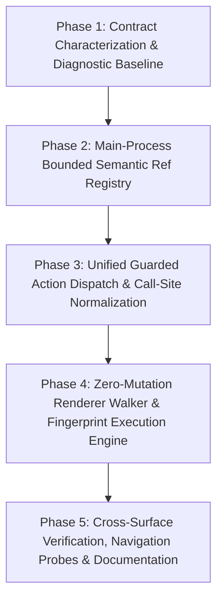

# Implementation Plan Candidate 3: Main-Owned Semantic Ref Authority Clean Cutover

**Document Path:** `plans/260831-0936-main-owned-semantic-ref-authority/reports/planner-ultra-candidate-3.md`  
**Plan ID:** `260831-0936-main-owned-semantic-ref-authority`  
**Candidate Slot:** 3  
**Status:** Proposal (Candidate for Selection)  
**Author:** Task Worker (`AuthorityPlanThree`)  
**Target Environment:** Electron 43.4.0 / Chromium 128 / Node.js 20.x CommonJS / TypeScript 5.5+  
**Hardware Constraint Profile:** Low-spec baseline (Intel Core i5-9300H @ 2.40GHz, Intel UHD Graphics 630, 16GB RAM)

---

## 1. Executive Summary & Goal

### 1.1 Goal
Establish a single, authoritative, Main-process-owned lifecycle and resolution architecture for semantic element references (`@e1`, `@e2`, ...). Move ref assignment, storage, validation, and invalidation out of the Chromium renderer document and into a bounded Main-process registry keyed by `(tabId, paneId, browserEpoch, documentGeneration, snapshotId)`. 

Eliminate all customer DOM mutations (`data-antifan-ref`), eliminate renderer-owned reference maps (`window.__antifanRefMap`), and enforce fail-closed validation for stale snapshots, mismatched document generations, cross-pane targeting errors, and disconnected/replaced DOM nodes. Maintain 100% backward compatibility with public MCP tools, WebSocket bridge RPCs, Action Registry schemas, compact snapshot string representations, storefront metadata (`data-section-id`, `data-product-id`, `data-block-id`), same-origin iframe traversal, open Shadow DOM traversal, split desktop/mobile pane targeting, and visual Bézier cursor animations.

### 1.2 Non-Goals
1. **No Terminal/PTY Rewrite:** Terminal multiplexing, PTY pipelines, session replay, and shell integration remain untouched.
2. **No Remote Distribution or Chrome Extension Packaging:** AntiFan remains an internal/local desktop app harness; no extension store packaging.
3. **No Unrelated NativeTabHost Modularization:** Do not attempt broad decomposition of unrelated NativeTabHost subsystems (e.g., bookmarks, zoom, downloads) beyond what is strictly required for guarded action dispatch and semantic ref management.
4. **No Continuous CDP Accessibility Tree Dependency:** Avoid permanent `Accessibility.enable()` or auto-attached CDP debuggers. Accessibility tree polling imposes high memory overhead, breaks custom storefront data attributes, and conflicts with user DevTools sessions.
5. **No Second Ref Authority or Compatibility Shims:** Do not create dual fallback maps, legacy DOM attribute fallback lookups, or silent selector fallbacks for stale refs. Stale or invalid refs must fail immediately and loudly.

---

## 2. Invariants & Epistemic Grounding

### 2.1 Core Architectural Invariants
* **Invariant 1 (Single Authority):** Main process is the sole authority for assigning `@eN` references, tracking their lifetime, and validating their target tuple `(tabId, paneId, browserEpoch, documentGeneration)`.
* **Invariant 2 (Zero Customer DOM Mutation):** The renderer script operates in pure read-only mode during snapshot generation. It never sets attributes (`data-antifan-ref`), never alters CSS classes, and never creates `window.__antifanRefMap`.
* **Invariant 3 (Fail-Closed Ref Resolution):** Any action referencing `@eN` against a stale document generation, mismatched pane, destroyed tab, detached node, or non-existent snapshot ID must fail immediately with an explicit error (`TARGET_STALE`, `REF_NOT_FOUND`, or `NODE_DETACHED_OR_REPLACED`). Under no circumstances will a stale `@eN` fall back to guessing CSS selectors or coordinate clicking.
* **Invariant 4 (Contract Parity):** Public MCP tools (`antifan_agent_snapshot`, `antifan_agent_click`, `antifan_agent_type`, `antifan_agent_hover`, `antifan_agent_scroll`), CapabilityCatalogue aliases (`anti.browser.click`, `anti.agent.cursor.click`, etc.), and Bridge RPC endpoints return the exact same success/failure envelope schemas.
* **Invariant 5 (DevTools & Navigation Resilience):** Opening DevTools, closing DevTools, attaching/detaching the debugger, or navigating the tab must not cause memory leaks in Main or unhandled promise rejections in renderer.
* **Invariant 6 (Resource Boundedness):** Registry storage is strictly bounded using an LRU/Ring-Buffer per tab/pane (max 5 snapshots per pane, max 200 elements per snapshot, max 60s TTL). Navigating or closing a tab immediately clears all associated snapshot memory.

---

## 3. Data Structures & Contract Design

### 3.1 Structural Element Descriptor (`src/main/browser/semantic-ref-types.ts`)

```typescript
export type SplitPaneId = 'desktop' | 'mobile';

export interface TraversalStep {
  /** 'dom' for child index walk, 'shadow' for open shadowRoot descent, 'iframe' for same-origin frame descent */
  kind: 'dom' | 'shadow' | 'iframe';
  index: number;
  tagName?: string;
  id?: string;
}

export interface ElementFingerprint {
  tagName: string;
  id?: string;
  classes?: string[];
  role?: string;
  type?: string;
  name?: string;
  valueExcerpt?: string;
  textExcerpt?: string;
  childIndex: number;
  attributeCount: number;
}

export interface ElementGlobalRect {
  left: number;
  top: number;
  right: number;
  bottom: number;
  width: number;
  height: number;
  centerX: number;
  centerY: number;
}

export interface StorefrontMetadata {
  sectionId?: string;
  productId?: string;
  blockId?: string;
}

export interface RawElementDescriptor {
  /** Unique ephemeral path within document for deterministic re-traversal */
  traversalPath: TraversalStep[];
  tagName: string;
  role: string;
  type?: string;
  label: string;
  selectorHint?: string;
  framePath: string; // e.g. "iframe#payment-frame"
  shadowPath: string; // e.g. "cart-drawer->#checkout-btn"
  rect: ElementGlobalRect;
  fingerprint: ElementFingerprint;
  storefront: StorefrontMetadata;
  id?: string;
}

export interface SemanticElementDescriptor extends RawElementDescriptor {
  ref: string; // e.g. "@e1"
  snapshotId: string;
  tabId: string;
  paneId: SplitPaneId;
  browserEpoch: number;
  documentGeneration: number;
  createdAt: number;
}

export interface SnapshotRegistryEntry {
  snapshotId: string;
  tabId: string;
  paneId: SplitPaneId;
  browserEpoch: number;
  documentGeneration: number;
  createdAt: number;
  elementsByRef: Map<string, SemanticElementDescriptor>;
  formattedText: string;
}

export interface RendererActionRequest {
  action: 'click' | 'type' | 'hover' | 'highlight' | 'scroll';
  descriptor: RawElementDescriptor;
  options?: {
    text?: string;
    clear?: boolean;
    x?: number;
    y?: number;
    deltaY?: number;
    label?: string;
  };
}

export interface RendererActionResponse {
  success: boolean;
  errorCode?: 'NODE_NOT_FOUND' | 'FINGERPRINT_MISMATCH' | 'DISCONNECTED' | 'EXECUTION_FAILED';
  errorMessage?: string;
  rect?: ElementGlobalRect;
  executedSteps?: number;
}
```

---

## 4. Five Sequential Implementation Phases



---

### Phase 1: Contract Characterization, Typed Descriptors & Diagnostic Baseline

#### 1.1 Objective
Characterize and lock in all existing snapshot, action, bridge, and registry behaviors with targeted contract baseline tests. Introduce the core TypeScript descriptor and error types without altering runtime behavior yet.

#### 1.2 Exact Files & Symbols Touched
* **Create:** `src/main/browser/semantic-ref-types.ts` (Defines `RawElementDescriptor`, `SemanticElementDescriptor`, `SnapshotRegistryEntry`, `RendererActionRequest`, `RendererActionResponse`, `ElementFingerprint`, `TraversalStep`, `StorefrontMetadata`).
* **Modify:** `src/main/browser/native-tab-host.ts` (Import types; prepare scaffolding for registry integration).
* **Create:** `test/main/semantic-ref-contract-characterization.test.ts` (Characterizes current snapshot formatting, line truncation at 150 lines, storefront metadata formatting, bridge dropping params, and action execution results).

#### 1.3 Concrete Implementation Steps
1. Create `src/main/browser/semantic-ref-types.ts` defining all descriptor, registry, action payload, and error interfaces.
2. Build unit characterization tests in `test/main/semantic-ref-contract-characterization.test.ts`:
   * Validate snapshot line format: `@e<N> [<role>:<type>] "<label>" (id: "...", section: "...", product: "...", block: "...", frame: "...")`.
   * Assert character limits: label truncated at 60 chars, snapshot max 150 items.
   * Verify all existing MCP tool names and action registry schemas (`antifan_agent_snapshot`, `antifan_agent_click`, `antifan_agent_type`, `antifan_agent_hover`, `antifan_agent_scroll`).
   * Characterize the current bug in `src/main/bridge/bridge-server.ts:1066-1131` where `ref` and `paneId` are dropped over WebSocket bridge calls.

#### 1.4 Tests Before & Tests After
* **Tests Before:** `test/main/agent-browser-script.test.ts` passes against string AST checks; bridge tests in `test/main/bridge-attachment-dispatch.test.ts` pass.
* **Tests After:** New suite `test/main/semantic-ref-contract-characterization.test.ts` executes and passes 100%, capturing current baseline output formatting and parameter contracts.

#### 1.5 Negative Cases & Edge Conditions
* Invalid or empty input to descriptor converters.
* Unicode and multi-byte characters in labels, IDs, and section attributes.
* Missing optional storefront attributes (`data-section-id` without `data-product-id`).
* Characterization of malformed selector strings.

#### 1.6 Rollback Signal
* Syntax or typing errors breaking the CommonJS/TypeScript build (`npm run typecheck` fails).
* Existing tests failing on `test/main/agent-browser-script.test.ts`.

#### 1.7 Verification Commands
```bash
npm run typecheck
node --test .compiled/test/main/semantic-ref-contract-characterization.test.js
```

---

### Phase 2: Main-Process Bounded Semantic Ref Registry & Invalidation Engine

#### 2.1 Objective
Implement `SemanticRefRegistry` in the Main process. The registry owns the creation, indexing, TTL, and cleanup of element descriptors per `(tabId, paneId, browserEpoch, documentGeneration)`. Implement automatic invalidation on tab navigation, tab close, pane destruction, and document generation increments.

#### 2.2 Exact Files & Symbols Touched
* **Create:** `src/main/browser/semantic-ref-registry.ts`
  * Class: `SemanticRefRegistry`
  * Methods:
    * `registerSnapshot(tabId: string, paneId: SplitPaneId, browserEpoch: number, documentGeneration: number, rawDescriptors: RawElementDescriptor[]): { snapshotId: string; formattedText: string }`
    * `resolveRef(ref: string, target: { tabId: string; paneId?: SplitPaneId; browserEpoch?: number; documentGeneration?: number }): { descriptor: SemanticElementDescriptor; error?: string }`
    * `getLatestSnapshot(tabId: string, paneId: SplitPaneId): SnapshotRegistryEntry | undefined`
    * `invalidateDocument(tabId: string, paneId?: SplitPaneId): void`
    * `invalidateTab(tabId: string): void`
    * `pruneStaleSnapshots(): void`
* **Modify:** `src/main/browser/native-tab-host.ts`
  * Add field: `private readonly semanticRefRegistry: SemanticRefRegistry`
  * Hook tab lifecycle events (`tab-closed`, `tab-navigated`, `split-pane-closed`, `document-generation-incremented`) into registry invalidation methods.
* **Create:** `test/main/semantic-ref-registry.test.ts`

#### 2.3 Concrete Implementation Steps
1. In `src/main/browser/semantic-ref-registry.ts`:
   * Use an LRU Ring-Buffer: Store a Map of `tabKey = `${tabId}:${paneId}`` to a bounded ring of max 5 `SnapshotRegistryEntry` records.
   * Total memory cap: Cap total global entries at 100 snapshots across all tabs.
   * TTL eviction: Snapshots older than 60,000ms are automatically purged during `pruneStaleSnapshots()`.
   * Implement `formatSnapshotText(descriptors: SemanticElementDescriptor[]): string` in Main, reproducing the exact compact string syntax.
   * Implement strict validation in `resolveRef()`:
     * Check if `ref` starts with `@e` and matches regex `/^@e\d+$/`.
     * Check if `tabId` exists in registry.
     * Check if `paneId` matches snapshot `paneId`.
     * Check if `documentGeneration` matches snapshot `documentGeneration`.
     * If any check fails, return explicit error (`TARGET_STALE`, `GENERATION_MISMATCH`, or `REF_NOT_FOUND`).
2. Integrate `SemanticRefRegistry` into `NativeTabHost`:
   * Instantiate `this.semanticRefRegistry = new SemanticRefRegistry()` in `NativeTabHost` constructor.
   * In `NativeTabHost.navigateTab()`, `onDidNavigate()`, and `handleDocumentGenerationBump()`, invoke `this.semanticRefRegistry.invalidateDocument(tabId, paneId)`.
   * In `NativeTabHost.closeTab()`, invoke `this.semanticRefRegistry.invalidateTab(tabId)`.
   * Add periodic cleanup interval (every 30s) or piggyback on existing diagnostic loops to call `pruneStaleSnapshots()`.
3. Add full unit tests in `test/main/semantic-ref-registry.test.ts`.

#### 2.4 Tests Before & Tests After
* **Tests Before:** `test/main/semantic-ref-contract-characterization.test.ts` passes.
* **Tests After:** `test/main/semantic-ref-registry.test.ts` verifies:
  * Registering raw descriptors assigns sequential `@e1`, `@e2`, ...
  * Resolving `@e1` with matching `(tabId, paneId, epoch, docGen)` returns descriptor.
  * Resolving `@e1` after document generation bump returns `GENERATION_MISMATCH` / `TARGET_STALE`.
  * Resolving `@e1` after tab close returns `TARGET_STALE`.
  * Ring buffer correctly purges the 6th snapshot when 6 snapshots are registered.
  * Memory cleanup removes all references when tabs close.

#### 2.5 Negative Cases & Edge Conditions
* Lookups for non-existent refs like `@e999` or `@invalid`.
* Lookup with correct `tabId` and `paneId` but mismatched `documentGeneration` (e.g. snapshot at gen 2, action sent at gen 3).
* Lookup across split panes (snapshot captured on `'desktop'`, ref action requested on `'mobile'`).
* High concurrency: rapid succession of 20 snapshots in a 50ms loop does not leak memory or throw unhandled exceptions.

#### 2.6 Rollback Signal
* Memory leak observed in registry tests or generation mismatch errors falsely blocking valid live refs.
* `npm test` regressions on `test/main/native-tab-host-agent-lifecycle.test.ts`.

#### 2.7 Verification Commands
```bash
npm run typecheck
node --test .compiled/test/main/semantic-ref-registry.test.js
```

---

### Phase 3: Unified Guarded Action Dispatch & Call-Site Normalization

#### 3.1 Objective
Unify all agent action entry points across the codebase. Ensure every action from MCP tools, WebSocket bridge, Action Registry, and CapabilityCatalogue flows through target resolution and guarded execution. Fix all parameter-dropping bugs where `ref` or `paneId` were previously omitted.

#### 3.2 Exact Files & Symbols Touched
* **Modify:** `src/main/tools/browser-control-port.ts`
  * Methods: `agentSnapshot`, `agentClick`, `agentType`, `agentHover`, `agentScroll`, `agentMove`, `agentHighlight`, `agentClear`
  * Add target generation pinning and ref extraction logic.
* **Modify:** `src/main/browser/browser-action-registry.ts`
  * Update action definitions for `agentSnapshot`, `agentClick`, `agentType`, `agentHover`, `agentScroll`, `agentMove`, `agentHighlight`, `agentClear` to support `ref`, `paneId`, `documentGeneration`, and `browserEpoch`.
  * Ensure handlers pass full normalized parameters to `tabHost`.
* **Modify:** `src/main/bridge/bridge-server.ts`
  * Fix lines `786-800` (`antifan.agentMove`, `antifan.agentTrajectory`) and `1066-1131` (`agentClick`, `agentType`, `agentScroll`, `agentHover`, `agentHighlight`, `agentClear`) to forward `ref`, `paneId`, `target`, and `documentGeneration`.
* **Modify:** `src/main/browser/native-tab-host.ts`
  * Update signatures of `agentClick`, `agentType`, `agentHover`, `agentScroll`, `agentHighlight`, `agentMove` to accept `SemanticActionParams` (with `ref`, `selector`, `x`, `y`, `tabId`, `paneId`, `documentGeneration`, `browserEpoch`).
  * Implement guard logic: If `params.ref` is provided, resolve through `this.semanticRefRegistry.resolveRef()`. If invalid, return `{ success: false, error: ... }` immediately without touching WebContents.
* **Create:** `test/main/guarded-action-dispatch.test.ts`

#### 3.3 Concrete Implementation Steps
1. Update `NativeTabHost` agent action methods:
   * Define unified interface `AgentActionOptions`:
     ```typescript
     export interface AgentActionOptions {
       selector?: string;
       ref?: string;
       x?: number;
       y?: number;
       text?: string;
       clear?: boolean;
       deltaY?: number;
       label?: string;
       tabId?: string;
       paneId?: SplitPaneId;
       documentGeneration?: number;
       browserEpoch?: number;
     }
     ```
   * In `agentClick(params: AgentActionOptions)`:
     * Check if `params.ref` is passed (e.g. `@e1`).
     * If `params.ref` is present:
       * Extract `targetTabId` and `targetPaneId`.
       * Resolve descriptor via `this.semanticRefRegistry.resolveRef(params.ref, { tabId: targetTabId, paneId: targetPaneId, documentGeneration: params.documentGeneration, browserEpoch: params.browserEpoch })`.
       * If resolution fails, throw `CapabilityError('TARGET_STALE', ...)` or return `false` with explicit error logging.
       * Do NOT fall back to `params.selector` if `params.ref` is invalid.
     * If `params.ref` is not present, proceed with explicit CSS selector or coordinate target.
2. Fix `src/main/bridge/bridge-server.ts`:
   * Ensure `p.ref`, `p.paneId`, `p.documentGeneration`, `p.browserEpoch` are forwarded in `antifan.agentClick`, `antifan.agentType`, `antifan.agentHover`, `antifan.agentScroll`, `antifan.agentHighlight`, `antifan.agentClear`.
3. Fix `src/main/browser/browser-action-registry.ts`:
   * Update inputSchema for `agentScroll` to include `ref?: string` if container scrolling by ref is desired.
   * Ensure all handlers forward `ref`, `paneId`, and metadata to `tabHost`.
4. Update `BrowserControlPort`:
   * In `agentClick`, `agentType`, `agentHover`, `agentScroll`, pass `target` document generation to `host` calls.
5. Create comprehensive test suite `test/main/guarded-action-dispatch.test.ts`.

#### 3.4 Tests Before & Tests After
* **Tests Before:** `test/main/action-registry.test.ts`, `test/main/capability-catalogue.test.ts`, and `test/main/bridge-attachment-dispatch.test.ts` pass with current signatures.
* **Tests After:**
  * `test/main/guarded-action-dispatch.test.ts` verifies:
    * Action with valid `@e1` resolves descriptor and dispatches to host.
    * Action with unknown `@e99` fails closed without calling renderer `executeJavaScript`.
    * Action with mismatched document generation fails closed with `TARGET_STALE`.
    * WebSocket bridge payloads carrying `ref` and `paneId` are correctly received and preserved by `NativeTabHost`.
    * Explicit selector (`#btn`) and coordinate (`x: 100, y: 200`) actions continue to work normally without ref resolution.

#### 3.5 Negative Cases & Edge Conditions
* Action specifying both `@e1` and a selector `#other-btn` — `@e1` takes precedence and strictly resolves via registry; if `@e1` is stale, it fails immediately instead of executing `#other-btn`.
* Action dispatched while tab is in mid-navigation (`documentGeneration` incrementing).
* Action payload with negative coordinates or NaN coordinates.

#### 3.6 Rollback Signal
* Bridge RPCs rejecting valid client actions or MCP tools failing schema validation.
* Failures in `test/main/bridge-attachment-dispatch.test.ts` or `test/main/capability-catalogue.test.ts`.

#### 3.7 Verification Commands
```bash
npm run typecheck
node --test .compiled/test/main/guarded-action-dispatch.test.js
node --test .compiled/test/main/capability-catalogue.test.js
node --test .compiled/test/main/bridge-attachment-dispatch.test.js
```

---

### Phase 4: Zero-Mutation Renderer Walker & Fingerprint-Verified Execution Primitives

#### 4.1 Objective
Replace the DOM-mutating injected script in `src/main/browser/agent-browser.ts`. Implement a 100% read-only DOM walker that returns `RawElementDescriptor[]` to Main without stamping `data-antifan-ref` or touching `window.__antifanRefMap`. Implement the descriptor action execution engine (`__antifanExecuteDescriptorAction`) that re-traverses the path, verifies the element fingerprint, animates the Bézier cursor, and fires synthetic input events.

#### 4.2 Exact Files & Symbols Touched
* **Modify:** `src/main/browser/agent-browser.ts`
  * Remove: `window.__antifanRefMap`, `data-antifan-ref` stamping, `data-antifan-ref` clearing.
  * Modify `window.__antifanAgentSnapshot`: Convert to a pure read-only walker returning `RawElementDescriptor[]`.
  * Implement: `window.__antifanExecuteDescriptorAction(request: RendererActionRequest): Promise<RendererActionResponse>`
  * Helper functions:
    * `computeElementFingerprint(el: Element, childIndex: number): ElementFingerprint`
    * `verifyElementFingerprint(el: Element, fp: ElementFingerprint): boolean`
    * `resolveElementByTraversalPath(path: TraversalStep[]): Element | null`
    * Preserve and connect `generateBezierPath`, `activateOverlay`, `ensureCursor`, `showBanner`, `createClickRipple`.
* **Modify:** `src/main/browser/native-tab-host.ts`
  * In `agentSnapshot(tabId, paneId)`:
    * Call renderer `__antifanAgentSnapshot()` to get `RawElementDescriptor[]`.
    * Register raw descriptors into `this.semanticRefRegistry.registerSnapshot()`.
    * Return `formattedText` (compact snapshot format).
  * In action methods (`agentClick`, `agentType`, etc.):
    * Pass the resolved `RawElementDescriptor` to renderer `__antifanExecuteDescriptorAction()`.
* **Modify:** `test/main/agent-browser-script.test.ts`
  * Update AST / string checks to verify `window.__antifanExecuteDescriptorAction` and absence of `data-antifan-ref` / `window.__antifanRefMap`.
* **Create:** `test/main/zero-mutation-walker.test.ts`

#### 4.3 Concrete Implementation Steps
1. Update `src/main/browser/agent-browser.ts`:
   * Replace `window.__antifanAgentSnapshot`:
     * Scan container (including open `shadowRoot` and same-origin `iframe`s).
     * Filter interactive elements: `button, a[href], input, textarea, select, [role="button"], [role="link"], [role="tab"], [role="checkbox"], [role="menuitem"], [tabindex]:not([tabindex="-1"])`.
     * Extract `storefront` metadata (`data-section-id`, `data-product-id`, `data-block-id`).
     * Build `TraversalStep[]` for each element (recording child indices and boundary descents).
     * Calculate global bounding rect using `getElementGlobalRect()`.
     * Generate `ElementFingerprint` (`tagName`, `id`, `classes`, `role`, `type`, `textExcerpt`, `childIndex`, `attributeCount`).
     * Return `RawElementDescriptor[]` (capped at 150 items).
     * **CRITICAL:** Do not touch `node.setAttribute('data-antifan-ref', ...)` or `window.__antifanRefMap`.
   * Implement `__antifanExecuteDescriptorAction(req)`:
     * Step 1: Re-locate node using `resolveElementByTraversalPath(req.descriptor.traversalPath)`. If not found, attempt fallback to `req.descriptor.selectorHint` only within the exact same frame/shadow context.
     * Step 2: Validate node connectivity (`node.isConnected`) and fingerprint using `verifyElementFingerprint(node, req.descriptor.fingerprint)`. If tag, role, or ID contradicts fingerprint, return `{ success: false, errorCode: 'FINGERPRINT_MISMATCH' }`.
     * Step 3: Scroll target into view if needed (`scrollIntoView({ behavior: 'smooth', block: 'center', inline: 'center' })`).
     * Step 4: Compute live viewport coordinates.
     * Step 5: Animate Bézier cursor with Fitts's law trajectory to element center.
     * Step 6: Execute action:
       * `click`: trigger highlight, ripple, mousedown, mouseup, click, focus.
       * `type`: focus, set value / textContent, dispatch `input` and `change` events.
       * `hover`: trigger highlight, update visual cursor position.
       * `scroll`: scroll container or window.
     * Return `{ success: true, rect: liveRect }`.
2. Connect `NativeTabHost.agentSnapshot` to parse raw descriptors and register them in `SemanticRefRegistry`.
3. Connect `NativeTabHost.agentClick`, `agentType`, `agentHover`, `agentScroll` to send resolved descriptors to `__antifanExecuteDescriptorAction`.

#### 4.4 Tests Before & Tests After
* **Tests Before:** `test/main/agent-browser-script.test.ts` validates legacy script AST.
* **Tests After:**
  * `test/main/agent-browser-script.test.ts` updated and passes.
  * `test/main/zero-mutation-walker.test.ts` executes in simulated DOM / VM:
    * Verifies that after snapshot execution, `document.querySelectorAll('[data-antifan-ref]').length === 0`.
    * Verifies `window.__antifanRefMap` is undefined.
    * Verifies same-origin iframe elements and open shadow DOM elements are traversed and given valid traversal paths.
    * Verifies fingerprint verification detects replaced nodes (e.g. DOM mutated between snapshot and action).
    * Verifies action execution triggers correct DOM events on target element.

#### 4.5 Negative Cases & Edge Conditions
* Mutated DOM: Target element is deleted or replaced with an element of different tag before action executes -> `FINGERPRINT_MISMATCH` / `NODE_NOT_FOUND`.
* Cross-origin iframes: Blocked gracefully with `try...catch` without throwing or stalling walker.
* Closed Shadow DOM: Handled safely (skipped gracefully without runtime errors).
* Hidden elements (`display: none`, `visibility: hidden`, `opacity: 0`, 0x0 rect) excluded from descriptors.

#### 4.6 Rollback Signal
* Failure in customer storefront rendering or event listener triggering.
* Regressions in `test/main/agent-browser-script.test.ts`.

#### 4.7 Verification Commands
```bash
npm run typecheck
node --test .compiled/test/main/zero-mutation-walker.test.js
node --test .compiled/test/main/agent-browser-script.test.js
```

---

### Phase 5: Cross-Surface Verification, Navigation/Race Probes, Soak & Documentation

#### 5.1 Objective
Perform comprehensive end-to-end verification across split desktop/mobile views, same-origin iframes, open Shadow DOM components, rapid navigation race conditions, DevTools open/detach states, and long-running memory bounds. Update project documentation to reflect Main-owned semantic ref authority.

#### 5.2 Exact Files & Symbols Touched
* **Create:** `test/integration/semantic-ref-integration.test.ts` (Full end-to-end slice testing snapshot -> click -> navigation -> stale ref rejection).
* **Create:** `test/integration/semantic-ref-race-soak.test.ts` (Concurrent snapshot and navigation stress test; memory leak verification).
* **Modify:** `docs/system-architecture.md` (Update Browser Architecture section: document `SemanticRefRegistry`, zero-mutation walker, and fail-closed ref lifecycle).
* **Modify:** `docs/code-standards.md` (Add invariant rules regarding semantic references and browser automation).

#### 5.3 Concrete Implementation Steps
1. Author `test/integration/semantic-ref-integration.test.ts`:
   * Launch `BrowserControlPort` and mock `NativeTabHost`.
   * Test workflow: `agentSnapshot` -> obtain `@e1` -> `agentClick({ ref: '@e1' })` -> verify click dispatched.
   * Test split pane isolation: Snapshot `'desktop'` (`@e1`) -> attempt `agentClick({ ref: '@e1', paneId: 'mobile' })` -> assert rejection.
   * Test navigation invalidation: Snapshot `@e1` -> navigate tab (generation bumps) -> `agentClick({ ref: '@e1' })` -> assert `TARGET_STALE`.
   * Test storefront metadata preservation: Verify `section: "..."`, `product: "..."`, `block: "..."` appear in snapshot text.
2. Author `test/integration/semantic-ref-race-soak.test.ts`:
   * Fire 500 consecutive snapshot/action/navigation cycles across 10 virtual tabs.
   * Measure heap size and registry size; verify heap remains stable and registry size never exceeds configured bounds.
3. Update architectural documentation in `docs/system-architecture.md` and `docs/code-standards.md`.

#### 5.4 Tests Before & Tests After
* **Tests Before:** Previous phases 1-4 unit tests pass.
* **Tests After:**
  * All unit and integration test suites pass (`npm test`).
  * `semantic-ref-integration.test.ts` and `semantic-ref-race-soak.test.ts` pass with 0 leaks.
  * Full typecheck passes with 0 errors (`npm run typecheck`).

#### 5.5 Negative Cases & Edge Conditions
* DevTools opened during active Bézier trajectory.
* WebContents crashing or reloading mid-action.
* Garbage collection stress during high-frequency snapshot calls.

#### 5.6 Rollback Signal
* Memory growth under soak test.
* Failure in any existing integration test suite.

#### 5.7 Verification Commands
```bash
npm run typecheck
node --test .compiled/test/integration/semantic-ref-integration.test.js
node --test .compiled/test/integration/semantic-ref-race-soak.test.js
npm test
```

---

## 5. Cross-Plan Relationships & Deprecation Scope

### 5.1 Relationship to Historical & Existing Plans
1. **`plans/260830-1617-runtime-resilience-and-semantic-hardening/`:**  
   * *Status:* **COMPLETED HISTORICAL EVIDENCE.**  
   * *Relationship:* This plan is preserved as immutable historical record. It previously implemented renderer-owned refs. The current plan supersedes the runtime ref authority design without mutating historical plan files.
2. **`plans/260822-refactor-native-tab-host-and-unify-capabilities/`:**  
   * *Status:* **PARTIALLY COMPLETED / SUPERSEDED.**  
   * *Relationship:* Phase 1 (helper extraction: `tab-diagnostics`, `tab-zoom-controller`, `tab-context-menu`, `tab-bookmarks-manager`) is completed and active on disk. Phase 2 (capability unification) left direct un-guarded paths to `NativeTabHost.agent*`. This new plan **supersedes and finishes** the capability unification and guarded dispatch scope for all browser automation actions.

---

## 6. Risk Analysis & Mitigation Matrix

| # | Risk Description | Severity | Likelihood | Concrete Mitigation Strategy |
|---|---|---|---|---|
| 1 | **Stale Node Re-traversal:** DOM changes dynamically between snapshot and action invocation, causing traversal path to point to a different or non-existent element. | High | Medium | Every element descriptor includes an `ElementFingerprint` (tag, role, id, classes, childIndex). The renderer re-traversal primitive verifies the fingerprint before firing events; on mismatch, it aborts with `FINGERPRINT_MISMATCH`. |
| 2 | **Memory Leak in Main Process:** High frequency snapshots generate thousands of descriptors that accumulate in `SemanticRefRegistry`. | Medium | Low | `SemanticRefRegistry` uses an LRU ring buffer (max 5 snapshots per pane, max 100 global snapshots) with a 60-second TTL. Tab close, navigation, and pane destruction trigger instant synchronous cleanup. |
| 3 | **Customer Storefront Interference:** Injected scripts altering customer store JavaScript or breaking Liquid theme functionality. | High | Low | Pure read-only walker: zero DOM attribute mutations (`data-antifan-ref` removed), zero global pollution (`window.__antifanRefMap` removed), and all agent overlays are isolated in standard shadow/isolated container IDs. |
| 4 | **Bridge RPC & MCP Breaking Changes:** Clients relying on specific JSON output envelopes breaking after refactoring. | Critical | Low | Public return schemas (`{ snapshot, success: true }`, `{ clicked, success }`, `{ typed, success }`, etc.) and tool names are locked with characterization tests in Phase 1 and strictly preserved. |
| 5 | **Split Desktop/Mobile Pane Confusion:** Action targeting the wrong split pane when executing a ref generated from the other pane. | Medium | Low | Snapshot registration keys explicitly by `(tabId, paneId, ...)`. Resolving a ref requires an exact pane match or defaults strictly to the focused pane with explicit mismatch rejection. |
| 6 | **DevTools Debugger Conflicts:** Opening Chrome DevTools causes breakpoints or AX cache deadlocks during automation. | Medium | Low | Zero CDP Accessibility API dependency. The system uses standard in-page DOM traversal and synthetic event dispatch, which functions seamlessly alongside open DevTools. |

---

## 7. Rollback & Fail-Safe Strategy

### 7.1 Fail-Safe Invariant
If at any point during deployment or execution a ref cannot be resolved or is deemed stale:
1. **Never guess:** The system MUST NOT attempt to guess what element the user meant by falling back to arbitrary DOM queries.
2. **Immediate Error Response:** Return `{ success: false, error: 'TARGET_STALE', message: 'Element reference is stale. Please capture a new snapshot.' }`.

### 7.2 Phase Rollback Procedures
* **Phase 1 Rollback:** Delete `src/main/browser/semantic-ref-types.ts` and `test/main/semantic-ref-contract-characterization.test.ts`.
* **Phase 2 Rollback:** Remove `SemanticRefRegistry` instantiation from `NativeTabHost`; revert tab lifecycle hooks.
* **Phase 3 Rollback:** Revert `NativeTabHost` agent action signatures and bridge parameter forwarding to their initial state.
* **Phase 4 Rollback:** Restore `AGENT_BROWSER_SCRIPT` to the renderer-owned map version from git history.
* **Phase 5 Rollback:** Revert documentation changes.

---

## 8. Acceptance Criteria & Final Verification Protocol

### 8.1 Observable Acceptance Criteria
1. **Compact Snapshot Text Parity:** `agentSnapshot` returns the exact compact text format containing `@e1`, `@e2`, roles, labels, and storefront metadata (`section: "..."`, `product: "..."`, `block: "..."`).
2. **Main-Process Registry Storage:** Main holds bounded structured registry entries keyed by `(tabId, paneId, browserEpoch, documentGeneration, snapshotId)`.
3. **Fail-Closed Action Resolution:** Any ref action (`agentClick`, `agentType`, `agentHover`, `agentScroll`) with a stale generation, mismatched pane, or unknown ref fails closed with `TARGET_STALE` or `REF_NOT_FOUND`.
4. **Zero Customer DOM Mutation:** Storefront DOM contains zero `data-antifan-ref` attributes and `window.__antifanRefMap` is completely absent.
5. **Unified Guarded Dispatch:** All callers (MCP tools, CapabilityCatalogue, BrowserActionRegistry, WebSocket Bridge, Theme QA) route through target resolution and guarded dispatch. No un-guarded `NativeTabHost.agent*` bypasses remain.
6. **Iframe & Shadow DOM Traversal:** Elements inside same-origin iframes and open Shadow roots are assigned refs, formatted with `frame:` / `shadow:` indicators, and correctly clicked/typed with visual cursor animation.
7. **Resource Bounds & DevTools Independence:** Registry memory is bounded under soak testing (max 5 snapshots per pane); DevTools open/close does not disrupt automation.

### 8.2 End-to-End Verification Runbook
```bash
# 1. Static Type Checking
npm run typecheck

# 2. Unit Test Suite (Registry, Walker, Descriptors, Actions)
node --test .compiled/test/main/semantic-ref-types.test.js
node --test .compiled/test/main/semantic-ref-registry.test.js
node --test .compiled/test/main/guarded-action-dispatch.test.js
node --test .compiled/test/main/zero-mutation-walker.test.js
node --test .compiled/test/main/agent-browser-script.test.js

# 3. Integration & Contract Verification
node --test .compiled/test/main/capability-catalogue.test.js
node --test .compiled/test/main/bridge-attachment-dispatch.test.js
node --test .compiled/test/integration/semantic-ref-integration.test.js
node --test .compiled/test/integration/semantic-ref-race-soak.test.js

# 4. Full Workspace Test Run
npm test
```

---

Status: DONE  
Summary: Created candidate implementation plan 3 at `plans/260831-0936-main-owned-semantic-ref-authority/reports/planner-ultra-candidate-3.md` detailing the complete, five-phase clean cutover to Main-owned semantic ref authority with zero DOM mutation, fail-closed invalidation, unified guarded dispatch, and full contract preservation.  
Concerns/Blockers: None. Plan strictly satisfies all constraints, non-goals, and architectural invariants from the evidence packet.