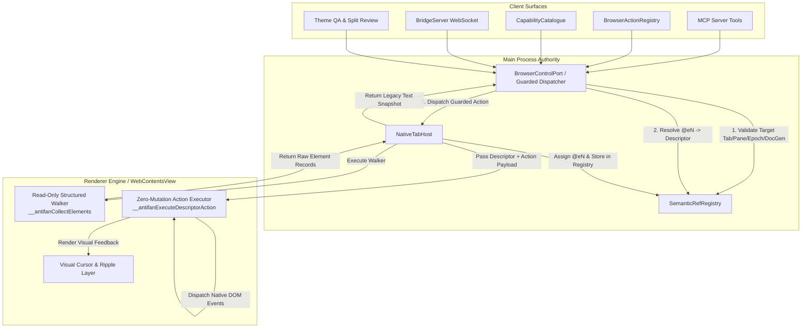

# Implementation Plan Candidate 5: Main-Owned Semantic Ref Authority Clean Cutover

## 1. Executive Summary & Goals

### 1.1 Goal
Establish a single authoritative semantic element reference system owned entirely by the Electron Main process. Every `@eN` reference generated during an agent snapshot is assigned by Main and bound to an immutable structured element descriptor keyed by `(tabId, paneId, browserEpoch, documentGeneration, snapshotId)`. 

Renderer-side ref mutations (`data-antifan-ref` DOM attributes, `window.__antifanRefMap` global state, and in-renderer ref resolution fallbacks) are eliminated in favor of a read-only structured DOM walker and a descriptor-driven execution engine. All action entry points (MCP tools, browser action registry, capability catalogue, WebSocket bridge, Theme QA, and UI split review) route through fail-closed target and ref validation.

### 1.2 Constraints
- **Runtime Environment:** Electron 43.4.0, TypeScript 5.x / CommonJS, `WebContentsView`, multi-pane split review (`desktop` / `mobile`).
- **Public API Stability:** Preserve public MCP tool names (`antifan_agent_snapshot`, `antifan_agent_click`, `antifan_agent_type`, `antifan_agent_hover`, `antifan_agent_scroll`, `antifan_agent_highlight`, `antifan_agent_clear`), action registry aliases, capability catalogue contracts, and success result envelopes (`{ snapshot: string }`, `{ clicked: boolean }`, `{ typed: boolean }`, `{ scrolled: boolean }`, `{ hovered: boolean }`, `{ highlighted: boolean }`).
- **Storefront & DOM Fidelity:** Preserve same-origin iframe traversal, open Shadow DOM traversal, e-commerce storefront metadata (`data-section-id`, `data-product-id`, `data-block-id`), and visual cursor trajectory/ripple rendering.
- **Zero DOM Pollution:** Storefront and customer DOM must receive zero `data-antifan-ref` attribute injections.
- **No CDP AX Dependency:** Do not attach permanent CDP `Accessibility.enable()` or rely on CDP `RemoteObjectId`s (prevents AX cache overhead, preserves custom data attributes, and avoids conflicts with open DevTools sessions).
- **Strict Clean Cutover:** No dual ref authority, no compatibility WeakMap fallbacks, and no silent degradation to fuzzy selector matches when a ref is stale or invalid.
- **Hardware Profile:** Strict bounded memory and CPU footprint suitable for low-spec dual-core/quad-core hardware (i5-9300H / UHD 630).

### 1.3 Non-Goals
- Terminal architecture rewrites (PTY session management, ANSI replay, and attachment registries remain intact).
- Remote SSH or worktree orchestration changes.
- Broad refactoring of `NativeTabHost` unrelated to browser automation, semantic snapshots, or action dispatching.
- Public Chrome extension packaging or distribution.
- Closed Shadow DOM cracking or cross-origin iframe security boundary bypassing.

---

## 2. System Architecture & Core Mechanics



### 2.1 Structured Element Descriptor Specification
Defined in `src/shared/semantic-ref-contracts.ts`:

```typescript
export interface ElementNodeFingerprint {
  tagName: string;
  id?: string;
  role?: string;
  type?: string;
  name?: string;
  classSnippet?: string;
  textSnippet?: string;
}

export interface StorefrontMetadata {
  sectionId?: string;
  productId?: string;
  blockId?: string;
}

export interface SemanticElementDescriptor {
  ref: string; // e.g. "@e1"
  snapshotId: string;
  tabId: string;
  paneId: 'desktop' | 'mobile';
  browserEpoch: number;
  documentGeneration: number;
  createdAt: number;
  
  // Element attributes & accessibility semantics
  tagName: string;
  role: string;
  type?: string;
  label: string;
  id?: string;
  disabled: boolean;
  readOnly: boolean;

  // Viewport Geometry (global coordinates accounting for nested iframes)
  rect: {
    left: number;
    top: number;
    width: number;
    height: number;
    centerX: number;
    centerY: number;
  };

  // Traversal Path (Read-only structural locator)
  framePath: number[];  // Hierarchical iframe index path
  shadowPath: number[]; // Hierarchical shadow root host index path
  domPath: number[];    // Child node index path from root/frame/shadow container

  // Verification & Storefront metadata
  fingerprint: ElementNodeFingerprint;
  storefront: StorefrontMetadata;
}
```

### 2.2 SemanticRefRegistry Architecture
Defined in `src/main/browser/semantic-ref-registry.ts`:

- **Storage Key:** Keyed by `${tabId}:${paneId}`.
- **Snapshot Bucket Structure:** Holds active and recent snapshots for the tab/pane:
  ```typescript
  interface TabPaneSnapshotBucket {
    tabId: string;
    paneId: 'desktop' | 'mobile';
    documentGeneration: number;
    browserEpoch: number;
    activeSnapshotId: string | null;
    snapshots: Map<string, {
      snapshotId: string;
      documentGeneration: number;
      browserEpoch: number;
      createdAt: number;
      descriptors: Map<string, SemanticElementDescriptor>;
    }>;
  }
  ```
- **Resource Bounds:**
  - Maximum 3 snapshots retained per tab/pane.
  - Maximum 50 total snapshots across all tabs.
  - Maximum 300 element descriptors per snapshot (matches snapshot truncation limit).
  - Snapshot TTL: 5 minutes of inactivity.
- **Lifecycle Invalidation Hooks:**
  - `onDocumentNavigated(tabId, paneId, newGeneration)`: Purges all previous snapshot buckets for the tab/pane; resets active snapshot.
  - `onTabClosed(tabId)`: Evicts all snapshot entries for all panes of `tabId`.
  - `onPaneDestroyed(tabId, paneId)`: Evicts snapshot entries for the destroyed pane.
  - `onEpochChanged(newEpoch)`: Purges all snapshots across all tabs.
- **Fail-Closed Resolution Logic:**
  - If `ref` does not start with `@e` -> rejected as non-ref.
  - If tab/pane snapshot bucket does not exist -> throws `CapabilityError('TARGET_STALE', 'No snapshot available for target tab/pane')`.
  - If `target.documentGeneration !== bucket.documentGeneration` -> throws `CapabilityError('TARGET_STALE', 'Document generation mismatch')`.
  - If `ref` is not found in the active snapshot -> throws `CapabilityError('INVALID_PARAMS', 'Element reference @eN not found in current snapshot')`.

---

## 3. Five Sequential Implementation Phases

```mermaid
gantt
    title Main-Owned Semantic Ref Authority Rollout
    dateFormat  X
    axisFormat  Day %d
    section Phase 1
    Contract Characterization & Types      :active, p1, 0, 2
    section Phase 2
    Main SemanticRefRegistry & Lifecycle  :p2, 2, 4
    section Phase 3
    Guarded Action Dispatch Unification   :p3, 4, 6
    section Phase 4
    Renderer Walker & Zero-Mutation Action:p4, 6, 8
    section Phase 5
    E2E Verification & Documentation      :p5, 8, 10
```



### Phase 1: Contract Characterization, Telemetry Baseline, and Typed Ref Contracts

#### 1. Objectives & Scope
- Characterize existing snapshot output formats, action resolution paths, and error behaviors across all callers.
- Establish shared TypeScript interfaces and error definitions for element descriptors, snapshot metadata, and ref resolution results without altering runtime behavior.
- Add characterization tests confirming existing baseline behaviors.

#### 2. Exact Files & Symbols to Create/Modify
- **Create:** `src/shared/semantic-ref-contracts.ts`
  - Export `SemanticElementDescriptor`, `ElementNodeFingerprint`, `StorefrontMetadata`, `RawElementRecord`, `SnapshotResolutionResult`, `RefResolutionError`.
- **Modify:** `src/shared/control-plane-contracts.ts`
  - Ensure `CapabilityError` error codes include `REF_NOT_FOUND`, `REF_STALE`, `REF_DETACHED`, `TARGET_STALE`.
- **Create:** `test/main/semantic-ref-contracts.test.ts`
  - Validate schema shapes, serialization, type guards, and error codes.
- **Modify:** `test/main/agent-browser-script.test.ts`
  - Characterize existing `window.__antifanAgentSnapshot` text format, storefront metadata extraction, iframe attributes, and DOM tagging behavior before mutation.

#### 3. Implementation Steps
1. Create `src/shared/semantic-ref-contracts.ts` containing the complete descriptor definitions, traversal path types, and fingerprint contracts.
2. Define parsing and validation helpers: `isSemanticRef(value: string): boolean`, `parseRefIndex(ref: string): number`, `formatRef(index: number): string`.
3. Add snapshot text serializer contract: `formatSnapshotText(descriptors: SemanticElementDescriptor[]): string` ensuring 100% byte-for-byte fidelity with the existing snapshot line format:
   `@e1 [role:type] "label" (id: "...", section: "...", product: "...", block: "...", frame: "...")`.
4. Update `src/shared/control-plane-contracts.ts` with explicit capability error codes for ref lifecycle failures.
5. Create `test/main/semantic-ref-contracts.test.ts` verifying all descriptor interfaces, serialization functions, and edge cases (empty labels, special characters, max text truncation).

#### 4. Tests Before & Tests After
- **Before:** Existing test suite (`test/main/agent-browser-script.test.ts`, `test/main/capability-catalogue.test.ts`) passes on current codebase.
- **After:** `test/main/semantic-ref-contracts.test.ts` passes; characterization tests in `agent-browser-script.test.ts` pass and assert snapshot text output structure.

#### 5. Negative & Edge Cases
- Malformed ref identifiers (e.g. `@e`, `@eabc`, `@1`, `e1`).
- Descriptors with missing optional fields (no ID, no storefront tags, empty label).
- Unicode characters and newlines in labels and attributes.
- Deep nested frame paths (`[0, 1, 2]`).

#### 6. Rollback Signal & Procedure
- **Signal:** Type errors or schema regressions in shared control-plane contracts breaking existing builds.
- **Procedure:** Revert `src/shared/semantic-ref-contracts.ts` and `src/shared/control-plane-contracts.ts` modifications; all new code is additive in Phase 1.

#### 7. Verification Commands
```bash
npm run typecheck
node --test test/main/semantic-ref-contracts.test.ts
node --test test/main/agent-browser-script.test.ts
```

---

### Phase 2: Main-Owned Semantic Ref Registry and Document Lifecycle Synchronization

#### 2.1 Objectives & Scope
- Implement `SemanticRefRegistry` in the Main process to store, index, bound, and evict element descriptors.
- Integrate registry invalidation directly into `NativeTabHost` navigation, tab lifecycle, pane destruction, and document generation increments.
- Ensure Main maintains strict authority over `@eN` assignment and lifecycle.

#### 2.2 Exact Files & Symbols to Create/Modify
- **Create:** `src/main/browser/semantic-ref-registry.ts`
  - Class `SemanticRefRegistry`:
    - `registerSnapshot(tabId: string, paneId: 'desktop' | 'mobile', epoch: number, docGen: number, rawElements: RawElementRecord[]): { snapshotId: string; snapshotText: string; descriptors: SemanticElementDescriptor[] }`
    - `resolveRef(tabId: string, paneId: 'desktop' | 'mobile', epoch: number, docGen: number, ref: string): SemanticElementDescriptor`
    - `getSnapshot(tabId: string, paneId: 'desktop' | 'mobile', snapshotId?: string): SemanticElementDescriptor[] | null`
    - `invalidateTab(tabId: string): void`
    - `invalidatePane(tabId: string, paneId: 'desktop' | 'mobile'): void`
    - `invalidateGeneration(tabId: string, paneId: 'desktop' | 'mobile', newDocGen: number): void`
    - `clear(): void`
- **Modify:** `src/main/browser/native-tab-host.ts`
  - Add property `public readonly refRegistry: SemanticRefRegistry = new SemanticRefRegistry();`
  - Update `navigate()`, `reload()`, `onDidNavigate()`, `onDidNavigateInPage()`, `onDidStartNavigation()`: Call `this.refRegistry.invalidateGeneration(tabId, paneId, newGen)`.
  - Update `closeTab()`: Call `this.refRegistry.invalidateTab(tabId)`.
  - Update `splitView` close/toggle: Call `this.refRegistry.invalidatePane(tabId, paneId)`.
  - Update `agentSnapshot()`: Receive raw element records from renderer, register in `refRegistry`, and return formatted text.
- **Create:** `test/main/semantic-ref-registry.test.ts`
  - Unit tests for registry storage, lookup, FIFO eviction, TTL cleanup, generation invalidation, and tab closure purging.
- **Modify:** `test/main/native-tab-host-agent-lifecycle.test.ts`
  - Test tab host invalidation hooks on navigation and generation updates.

#### 2.3 Implementation Steps
1. Implement `SemanticRefRegistry` in `src/main/browser/semantic-ref-registry.ts` with strict memory bounds (LRU eviction across snapshots, max 50 snapshots, max 300 descriptors per snapshot).
2. Implement descriptor assignment in `registerSnapshot`: map raw element array to `SemanticElementDescriptor[]`, assigning `@e1` through `@eN`, generating `snapshotId = makeControlPlaneId('snap')`, and building the formatted snapshot string.
3. Add lookup and fail-closed validation in `resolveRef`: verify exact `(tabId, paneId, epoch, docGen)` matching. Throw `CapabilityError('TARGET_STALE', ...)` or `CapabilityError('REF_NOT_FOUND', ...)` on mismatch.
4. Wire `SemanticRefRegistry` into `NativeTabHost` instance.
5. Hook into `NativeTabHost` navigation event handlers (`did-start-navigation`, `did-navigate`, `did-navigate-in-page`) to call `invalidateGeneration`.
6. Hook into tab teardown (`closeTab`, `destroyView`) to call `invalidateTab` and `invalidatePane`.
7. Author comprehensive unit tests in `test/main/semantic-ref-registry.test.ts`.

#### 2.4 Tests Before & Tests After
- **Before:** `NativeTabHost` does not track snapshot descriptors; `agentSnapshot` returns raw unvalidated strings.
- **After:** `test/main/semantic-ref-registry.test.ts` passes; `NativeTabHost` tests demonstrate registry purge on tab navigation and generation increment.

#### 2.5 Negative & Edge Cases
- Rapid successive snapshots within the same document generation (old snapshot descriptors gracefully superseded or bounded in history).
- Snapshot taken on Tab A, ref action executed on Tab B (rejected with `REF_NOT_FOUND` / `TARGET_STALE`).
- Snapshot taken on `desktop` pane, ref action executed on `mobile` pane (rejected with pane mismatch).
- Navigation race: user triggers navigation immediately after snapshot; ref action during navigation is rejected before executing renderer scripts.
- Memory leak test: 1,000 snapshots registered in a loop; verify memory caps at 50 snapshots and stale descriptors are garbage collected.

#### 2.6 Rollback Signal & Procedure
- **Signal:** High memory consumption or snapshot registration throwing unhandled exceptions during standard navigation flows.
- **Procedure:** Revert `native-tab-host.ts` hooks and make `agentSnapshot` fall back to legacy pass-through while debugging registry indexing.

#### 2.7 Verification Commands
```bash
npm run typecheck
node --test test/main/semantic-ref-registry.test.ts
node --test test/main/native-tab-host-agent-lifecycle.test.ts
```

---

### Phase 3: Guarded Action Dispatch Unification and Parameter Normalization Across All Entry Points

#### 3.1 Objectives & Scope
- Route all action entry points (`BrowserControlPort`, `BrowserActionRegistry`, `BridgeServer`, MCP tools, Theme QA) through a single guarded dispatch path with exact target/ref validation.
- Standardize parameter schemas: ensure `ref` is supported across `agentClick`, `agentType`, `agentHover`, `agentScroll`, `agentHighlight`, and `agentMove`.
- Eliminate direct bypasses to `NativeTabHost.agent*` that drop `ref`, `tabId`, or `paneId`.

#### 3.2 Exact Files & Symbols to Create/Modify
- **Modify:** `src/main/tools/browser-control-port.ts`
  - Update `BrowserHostPort` interface with descriptor-aware signatures and `refRegistry` access.
  - Update `agentClick`, `agentType`, `agentHover`, `agentScroll`, `agentHighlight`, `agentSnapshot`:
    - Extract and validate `target` via `resolveTargetTab(target, args.tabId)`.
    - If `args.ref` is provided, resolve descriptor via `this.host.getRefRegistry().resolveRef(effectiveTabId, paneId, target.browserEpoch, target.documentGeneration, args.ref)`.
    - Pass resolved descriptor (or explicit selector/coordinates) to host.
- **Modify:** `src/main/browser/browser-action-registry.ts`
  - Update `agentScroll` inputSchema to include `ref: { type: 'string', description: 'Interactive snapshot element reference (e.g. @e1)' }`.
  - Update action handlers for `agentClick`, `agentType`, `agentHover`, `agentScroll`, `agentHighlight`: ensure `tabHost` calls receive normalized target objects and handle `CapabilityError` properly.
- **Modify:** `src/main/bridge/bridge-server.ts`
  - Lines 786-800 & 1066-1131: Update legacy agent RPC routes (`antifan.agentClick`, `antifan.agentType`, `antifan.agentScroll`, `antifan.agentHover`, `antifan.agentHighlight`, `antifan.agentMove`, `antifan.agentClear`) to preserve `p.ref`, `p.paneId`, `p.tabId`, and route through guarded `tabHost` / `BrowserControlPort` methods.
- **Modify:** `test/main/action-registry.test.ts`
  - Update mock host and add tests for ref-based actions, scroll with ref, and error propagation.
- **Modify:** `test/main/bridge-attachment-dispatch.test.ts`
  - Add tests verifying bridge WebSocket dispatches preserve ref and pane parameters.
- **Modify:** `test/main/capability-catalogue.test.ts`
  - Verify capability dispatch passes ref arguments and fails closed on stale target generation.

#### 3.3 Implementation Steps
1. Enhance `BrowserControlPort` in `src/main/tools/browser-control-port.ts` to perform pre-execution target checks:
   - For any action with `ref`: invoke `host.refRegistry.resolveRef(...)`.
   - If resolution fails, propagate `CapabilityError` without touching renderer.
2. Update `BrowserActionRegistry` in `src/main/browser/browser-action-registry.ts`:
   - Add `ref` property to `agentScroll` input schema.
   - Standardize error transformation: map internal errors to `{ success: false, error: err.message, code: err.code }`.
3. Clean up `BridgeServer` in `src/main/bridge/bridge-server.ts`:
   - Ensure all `agent*` cases extract `ref: p.ref`, `paneId: p.paneId`, `tabId: p.tabId`.
   - Route through `this.tabHost.agent*` with complete parameter objects.
4. Update test suites in `action-registry.test.ts`, `bridge-attachment-dispatch.test.ts`, and `capability-catalogue.test.ts` with full parameter assertions.

#### 3.4 Tests Before & Tests After
- **Before:** `agentScroll` does not accept `ref`; bridge drops `ref` and `paneId`; actions bypass generation validation.
- **After:** All action entry points accept `ref` and `paneId`; tests verify that stale/unknown refs fail closed before renderer execution.

#### 3.5 Negative & Edge Cases
- Action dispatched with both `ref` and `selector`: `ref` takes precedence as high-confidence semantic reference; if ref resolution fails, it fails closed (does NOT silently fall back to selector).
- Action dispatched with non-existent ref `@e999`: returns `CapabilityError('REF_NOT_FOUND')`.
- Action dispatched with valid ref but stale `documentGeneration` in attachment lease: returns `CapabilityError('TARGET_STALE')`.
- Scroll action with ref: correctly resolves element descriptor, scrolls target element or container into view.

#### 3.6 Rollback Signal & Procedure
- **Signal:** MCP tools or bridge WebSocket actions fail with unexpected parameter errors or breaking schema changes.
- **Procedure:** Revert `browser-action-registry.ts` and `bridge-server.ts` changes; maintain backward-compatible optional fields in schemas.

#### 3.7 Verification Commands
```bash
npm run typecheck
node --test test/main/action-registry.test.ts
node --test test/main/bridge-attachment-dispatch.test.ts
node --test test/main/capability-catalogue.test.ts
```

---

### Phase 4: Read-Only In-Page Walker, Zero-Mutation Action Execution, and Legacy Authority Removal

#### 4.1 Objectives & Scope
- Rewrite `src/main/browser/agent-browser.ts` in-page scripts to be 100% read-only during snapshot collection.
- Completely remove `data-antifan-ref` DOM tagging and `window.__antifanRefMap`.
- Implement zero-mutation descriptor-based action execution: renderer uses `framePath`, `shadowPath`, `domPath`, and verifies `fingerprint` before dispatching synthetic/native DOM events and visual cursor animations.
- Cleanly delete all legacy fallback paths and in-page ref caches.

#### 4.2 Exact Files & Symbols to Create/Modify
- **Modify:** `src/main/browser/agent-browser.ts`
  - Remove `window.__antifanRefMap` initialization and clearing.
  - Remove all `node.setAttribute('data-antifan-ref', ...)` and `node.removeAttribute('data-antifan-ref')`.
  - Rewrite `window.__antifanAgentSnapshot` -> `window.__antifanCollectElements()`:
    - Pure read-only traversal over document, same-origin iframes, and open shadow roots.
    - Collects `RawElementRecord` objects containing geometry, attributes, accessibility roles, storefront metadata, `framePath`, `shadowPath`, `domPath`, and `fingerprint`.
    - Returns JSON serializable array of raw element records to Main.
  - Remove legacy `querySelectorDeep` ref-branch (`str.startsWith('@e')` reading `__antifanRefMap` or `[data-antifan-ref]`).
  - Implement `window.__antifanExecuteDescriptorAction(actionType, descriptor, options)`:
    - Locates target node by traversing `descriptor.framePath` -> `descriptor.shadowPath` -> `descriptor.domPath`.
    - Validates `node.isConnected === true` and `matchesFingerprint(node, descriptor.fingerprint)`.
    - If verification passes: computes live bounding rect, animates visual cursor trajectory and ripple to element center, and executes action (`click`, `type`, `hover`, `scroll`).
    - Returns `{ success: true, actualRect: rect }` or `{ success: false, reason: 'NODE_DISCONNECTED_OR_CHANGED' }`.
  - Retain `window.__antifanAgentTrajectory`, visual cursor layer, and ambient cursor wanderer.
- **Modify:** `src/main/browser/native-tab-host.ts`
  - Update `agentSnapshot()`: call `__antifanCollectElements()`, pass raw records to `refRegistry.registerSnapshot()`, return snapshot text.
  - Update `agentClick()`, `agentType()`, `agentHover()`, `agentScroll()`, `agentHighlight()`:
    - If ref provided: resolve descriptor from `refRegistry`, call `__antifanExecuteDescriptorAction()`.
    - If selector provided: execute explicit selector path.
    - If coordinates provided: execute coordinate cursor path.
- **Modify:** `test/main/agent-browser-script.test.ts`
  - Update test assertions to verify zero DOM mutation (assert no `data-antifan-ref` attributes added to DOM).
  - Verify that `window.__antifanRefMap` is undefined.
  - Verify descriptor-based action execution across frames and shadow DOM.

#### 4.3 Implementation Steps
1. Refactor `agent-browser.ts`:
   - Delete `window.__antifanRefMap` and all DOM mutation code.
   - Implement `__antifanCollectElements` returning raw element descriptors with deterministic structural paths (`framePath`, `shadowPath`, `domPath`).
   - Implement `__antifanExecuteDescriptorAction` with strict node fingerprint checking (verifying tag, id, role, and text sample match descriptor before clicking/typing).
2. Refactor `NativeTabHost`:
   - Integrate `refRegistry` into `agentSnapshot` and `agent*` action methods.
   - Remove legacy string concatenation that injected `@e` selectors directly into page scripts.
3. Update `agent-browser-script.test.ts`:
   - Test `__antifanCollectElements` against DOM fixtures with nested iframes, shadow roots, and storefront data attributes.
   - Test `__antifanExecuteDescriptorAction` with valid and mutated/disconnected nodes.
   - Assert DOM remains pristine (no injected attributes or global maps).

#### 4.4 Tests Before & Tests After
- **Before:** Injected script modifies DOM with `data-antifan-ref` and populates `window.__antifanRefMap`.
- **After:** Injected script performs 0 DOM mutations during snapshot; `window.__antifanRefMap` does not exist; descriptor actions execute cleanly and animate cursor.

#### 4.5 Negative & Edge Cases
- Node mutated/replaced between snapshot and action (e.g. React/Vue re-render replaced the DOM node): fingerprint verification fails in renderer -> returns structured failure `{ success: false, reason: 'NODE_DISCONNECTED_OR_CHANGED' }` -> Main throws `REF_DETACHED`.
- Element inside an iframe that was navigated away: frame traversal fails -> returns clean failure without unhandled error.
- Open Shadow DOM with deeply nested slot elements: structural traversal reliably locates element.
- Closed Shadow DOM: gracefully skipped without throwing exceptions.

#### 4.6 Rollback Signal & Procedure
- **Signal:** Element actions failing to locate elements on dynamic single-page applications or storefronts.
- **Procedure:** Revert `agent-browser.ts` and `native-tab-host.ts` to Phase 3 state; inspect structural path generation and fingerprint tolerance.

#### 4.7 Verification Commands
```bash
npm run typecheck
node --test test/main/agent-browser-script.test.ts
node --test test/main/native-tab-host-agent-lifecycle.test.ts
```

---

### Phase 5: End-to-End Verification, Split-View Smoke, Resource Bound Proof, and Documentation Updates

#### 5.1 Objectives & Scope
- Execute comprehensive cross-module verification: same-origin iframes, open Shadow DOM, desktop/mobile split panes, rapid navigation races, open DevTools debugger coexistence, and soak/memory leak tests.
- Verify that no dual ref authority, compatibility fallbacks, or attribute leaks remain.
- Update repository documentation (`docs/`) to reflect Main-owned semantic ref architecture, descriptor contracts, and fail-closed guarantees.

#### 5.2 Exact Files & Symbols to Create/Modify
- **Create:** `test/main/semantic-ref-e2e.test.ts`
  - Comprehensive end-to-end test suite exercising:
    1. Snapshot -> Click/Type/Scroll/Hover flow with `@eN` references.
    2. Same-origin iframe element snapshot and action execution.
    3. Shadow DOM element snapshot and action execution.
    4. Storefront metadata extraction (`data-section-id`, `data-product-id`, `data-block-id`).
    5. Split review (`desktop` vs `mobile` pane isolation and independent snapshot lifecycles).
    6. Navigation race conditions: action attempted after page navigation fails closed with `TARGET_STALE`.
    7. Memory bounds: 100 consecutive snapshots do not exceed memory cap; old descriptors evicted.
    8. DevTools debugger open/closed state: actions execute without interference.
- **Modify:** `docs/system-architecture.md` (or relevant architecture documentation)
  - Document Main-owned semantic ref authority, `SemanticRefRegistry`, lifecycle invalidation, and zero DOM pollution.

#### 5.3 Implementation Steps
1. Create `test/main/semantic-ref-e2e.test.ts` covering all acceptance criteria and complex integration flows.
2. Run comprehensive memory soak test to verify bounded registry growth (under 5MB total memory overhead for ref registries).
3. Validate split-view isolation: taking a snapshot on the desktop pane does not overwrite mobile pane descriptors; actions target the correct pane WebContents.
4. Execute full project test suite and typechecks to confirm zero regressions across all subsystems.
5. Update architectural documentation detailing the clean-cutover design.

#### 5.4 Tests Before & Tests After
- **Before:** No comprehensive E2E test verifying zero DOM pollution and Main ref authority.
- **After:** `test/main/semantic-ref-e2e.test.ts` and entire workspace test suite pass with 100% green status.

#### 5.5 Negative & Edge Cases
- Rapid concurrent actions on desktop and mobile split panes.
- Repeated navigation on a tab while automated agent actions are queued.
- Memory leak verification over 500 snapshot cycles.
- Corrupted or truncated element descriptors handled gracefully.

#### 5.6 Rollback Signal & Procedure
- **Signal:** E2E integration failures or memory leaks observed during soak runs.
- **Procedure:** Address root cause in isolated phase modules before final merge.

#### 5.7 Verification Commands
```bash
npm run typecheck
node --test test/main/semantic-ref-e2e.test.ts
node --test test/main/semantic-ref-registry.test.ts
node --test test/main/semantic-ref-contracts.test.ts
node --test test/main/agent-browser-script.test.ts
node --test test/main/action-registry.test.ts
node --test test/main/bridge-attachment-dispatch.test.ts
node --test test/main/capability-catalogue.test.ts
node --test test/main/native-tab-host-agent-lifecycle.test.ts
```

---

## 4. Cross-Plan Relationships & Superseded Scope

- **Completed Historical Plans:**
  - `plans/260830-1617-runtime-resilience-and-semantic-hardening/`: Completed historical work that originally stabilized renderer-owned refs. It remains an immutable historical record; this plan supersedes the renderer-owned ref model with Main authority.
- **In-Flight / Unfinished Plans:**
  - `plans/260822-refactor-native-tab-host-and-unify-capabilities/`: Phase 1 helper extraction is present on disk; Phase 2 (guarded dispatch) is incomplete/stale. This plan (`planner-ultra-candidate-5`) fully owns and supersedes the guarded action dispatch and semantic ref unification scope.

---

## 5. Comprehensive Risk Assessment & Mitigations

| Risk | Impact | Probability | Mitigation Strategy |
| :--- | :--- | :--- | :--- |
| **Dynamic DOM Re-render (Virtual DOM replacement)** | Medium | Medium | In-page executor verifies element `fingerprint` (tag, id, role, text snippet) before acting. If node detached, returns clean `REF_DETACHED` error prompting agent to refresh snapshot, avoiding mis-clicks. |
| **Navigation Race during Action Execution** | High | Low | Main validates `documentGeneration` and `browserEpoch` before dispatching to renderer; in-page executor re-checks `document.readyState` and connection status before firing events. |
| **Split Pane State Pollution** | Medium | Low | All snapshots and registries strictly partitioned by `${tabId}:${paneId}` composite keys. Actions must explicitly target the matching pane. |
| **Memory Growth from Retained Descriptors** | Medium | Low | Hard limits enforced by `SemanticRefRegistry`: max 3 snapshots per pane, max 50 snapshots system-wide, max 300 descriptors per snapshot, 5-minute TTL, and instant purge on navigation/tab close. |
| **Iframe Traversal Security Errors** | Low | Low | Walker wraps cross-frame access in `try...catch` blocks; cross-origin frames without script access are gracefully skipped without crashing snapshot generation. |
| **DevTools Debugger Conflicts** | High | Low | Zero reliance on CDP `Accessibility.enable()`, `DOM.enable()`, or `RemoteObjectId`s. Injected scripts run via standard `executeJavaScript`, completely compatible with active DevTools sessions. |

---

## 6. Comprehensive Rollback Strategy

1. **Per-Phase Rollback Boundaries:** Each phase produces isolated, verifiable commits. If regressions occur in Phase 4 (renderer walker), Phase 3 dispatch and Phase 2 registry remain stable.
2. **Feature Isolation:** The Main `SemanticRefRegistry` can operate with zero side-effects even if legacy fallback methods were temporarily re-engaged during emergency debugging.
3. **No Database or Persistent State:** All descriptor state is ephemeral in Main memory; application restart completely resets all state with zero migration rollback overhead.

---

## 7. Observable Acceptance Criteria & Verification Matrix

| Criterion | Verification Method | Pass Threshold |
| :--- | :--- | :--- |
| **1. Snapshot Contract Preservation** | `node --test test/main/agent-browser-script.test.ts` | Snapshot returns compact ARIA text with `@eN` refs, roles, labels, and storefront metadata matching legacy contract. |
| **2. Main Ref Authority & Bounded Registry** | `node --test test/main/semantic-ref-registry.test.ts` | All refs stored in Main `SemanticRefRegistry` keyed by `(tabId, paneId, epoch, docGen)`; max memory bounds enforced. |
| **3. Fail-Closed Stale Ref Rejection** | `node --test test/main/semantic-ref-e2e.test.ts` | Actions on stale `documentGeneration`, detached nodes, or wrong pane immediately fail closed with `TARGET_STALE` / `REF_NOT_FOUND`. |
| **4. Zero DOM Pollution** | `node --test test/main/agent-browser-script.test.ts` | Zero `data-antifan-ref` attributes present in DOM after snapshot; `window.__antifanRefMap` is undefined. |
| **5. Guarded Action Dispatch Across Surfaces** | `node --test test/main/action-registry.test.ts test/main/bridge-attachment-dispatch.test.ts` | MCP tools, action registry, bridge WebSocket, and capability catalogue route through unified target validation. |
| **6. Storefront & Split-View Support** | `node --test test/main/semantic-ref-e2e.test.ts` | `data-section-id`/`data-product-id` correctly captured; `desktop` and `mobile` panes execute independently. |
| **7. Full Regression Suite Clean** | `npm run typecheck && npm test` | 100% typecheck pass, zero lint errors, and all unit/integration tests green across the entire workspace. |

---
