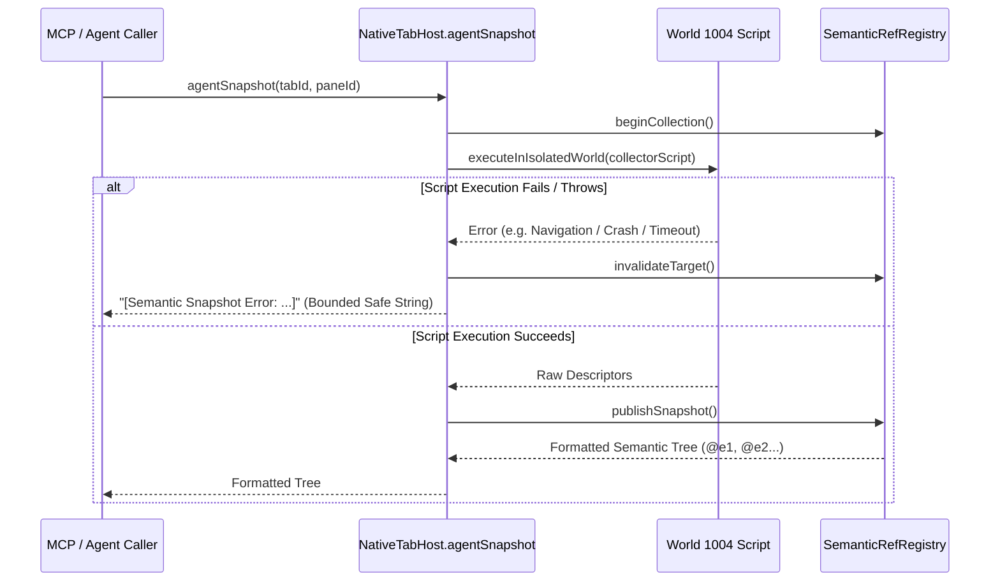

# Phase 2: Semantic Ref Fallback & Token Guard

## Overview
Guards the error catch block in `NativeTabHost.agentSnapshot` (`src/main/browser/native-tab-host.ts:4971-4974`). When isolated world script injection or snapshot publication throws an error, the system currently falls back to `getDom(undefined)`, dumping 50,000–200,000 tokens of raw `document.documentElement.outerHTML` into LLM context. This phase replaces the catastrophic fallback with a concise, structured error descriptor.

## Requirements
- Functional:
  - When `this.executeInIsolatedWorld(curWc, collectorScript)` or `publishSnapshot` fails:
    - Invalidate the target in `SemanticRefRegistry`.
    - Return a bounded, structured error string: `[Semantic Snapshot Error: ${errorMessage}]`.
    - Never invoke `this.getDom(undefined)` as a silent fallback.
- Non-functional:
  - Return payload length $\le 120$ characters ($\le 30$ tokens), protecting agent context budgets.

## Architecture


## Related Code Files
- Modify: `src/main/browser/native-tab-host.ts`
- Modify / Create Test: `test/integration/semantic-ref-integration.test.ts`

## Implementation Steps
1. Locate `NativeTabHost.agentSnapshot` in `src/main/browser/native-tab-host.ts` (lines 4971–4975).
2. Replace `return this.getDom(undefined, targetId, effectivePane);` with structured error reporting:
   ```ts
   catch (err: unknown) {
     this.semanticRefRegistry.invalidateTarget(targetId, effectivePane);
     const msg = err instanceof Error ? err.message : String(err || 'isolated collection failed');
     return `[Semantic Snapshot Error: ${msg}]`;
   }
   ```
3. Add a dedicated test case in `test/integration/semantic-ref-integration.test.ts` verifying that when `executeInIsolatedWorld` rejects, `agentSnapshot` returns the safe error string and does not invoke `getDom`.

## Success Criteria
- [ ] Script failures in `agentSnapshot` return bounded error strings under 120 characters.
- [ ] Zero occurrence of raw `outerHTML` dumps during semantic snapshot errors.
- [ ] All semantic ref integration tests pass.

## Risk Assessment
- Risk: Upstream caller might expect non-empty string or specific prefix.
- Mitigation: `[Semantic Snapshot Error: ...]` is recognized as an error message and follows standard MCP result formatting.
