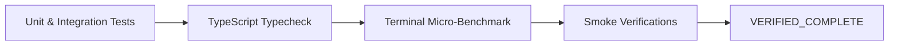

# Phase 5: Full Test Suite Verification & Benchmark Validation

## Overview
Comprehensive verification phase running all 521+ unit, integration, and e2e test suites, static TypeScript typechecking, terminal slicing benchmark comparisons, and smoke tests across split review and Theme QA.

## Requirements
- Functional:
  - Run full test suite: `npm test` ($\ge 521$ tests passing, 0 failing, 0 regressions).
  - Run full TypeScript compilation check: `npm run typecheck` (0 errors).
  - Execute dedicated terminal safe slice unit test suite.
  - Verify semantic ref integration pipeline with the guarded fallback.
- Non-functional:
  - Zero performance degradation on warm tab switching latency.
  - Zero memory leaks or orphaned timers.

## Architecture

## Related Code Files
- Run: `test/**/*.test.ts`
- Run: `scripts/smoke-split-review.cjs`, `scripts/smoke-theme-qa-gate.cjs`

## Implementation Steps
1. Execute `npm run typecheck` to verify zero compiler errors across main, shared, and renderer code.
2. Execute `npm test` across all 90 test suites and 521+ test cases.
3. Run micro-benchmark comparing terminal buffer slicing throughput.
4. Execute `npm run smoke:split` and `npm run smoke:theme-qa` smoke checks.
5. Record metrics and finalize verification evidence.

## Success Criteria
- [ ] `npm run typecheck` exits with code 0 and zero errors.
- [ ] `npm test` passes 100% of all tests ($\ge 521$ passing).
- [ ] Safe slice benchmark confirms $>30\times$ speedup on 512KB logs.
- [ ] No regression in any public API, IPC channel, or MCP capability.

## Risk Assessment
- Risk: Subtle type inference mismatches after controller extraction.
- Mitigation: Strict compiler verification with `tsc -p ./ --noEmit` before running test suites.
