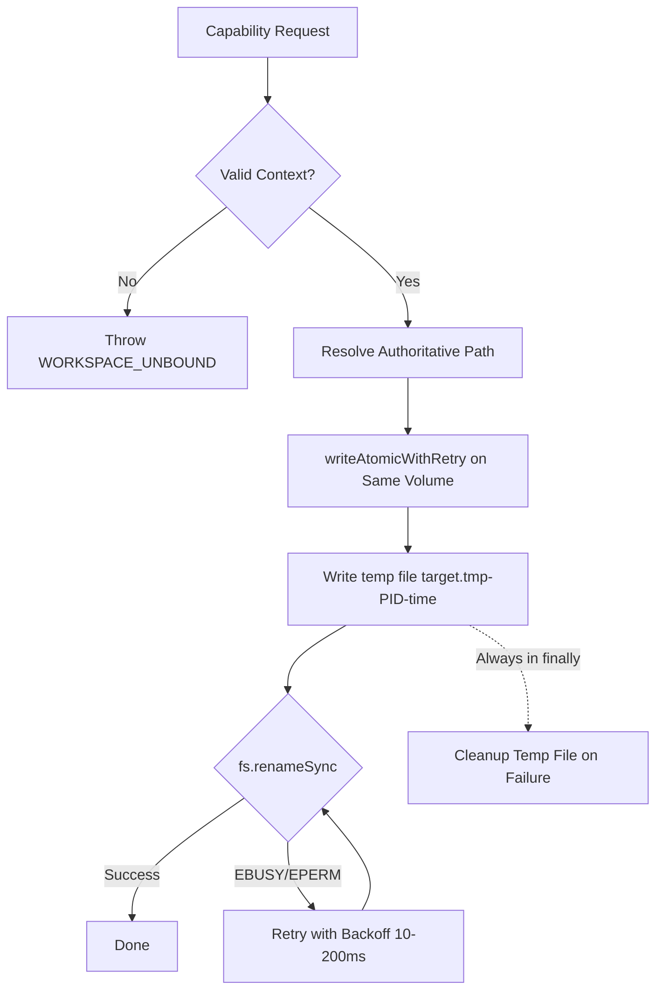

# Phase 01: Core Safety & Tenancy Isolation

## Overview
Hardens AntiFan against multi-workspace tenancy leaks, Windows NTFS file lock collisions (`EBUSY`/`EPERM`), watcher reload storms from temporary files, ambient directory fallbacks in `AnnotationManager`, prompt injection through untrusted DOM attributes, and raw stdin command corruption during active terminal runs.

---

## Requirements

### Functional
1. `file.read` and `file.write` capabilities must strictly require an authoritative `projectId`/`workspaceId` context, throwing `WORKSPACE_UNBOUND` instead of falling back to default root.
2. `AnnotationManager.getStorageDirectories` (`src/main/bridge/annotation-manager.ts`) must remove ambient fallbacks (`process.cwd()`, parent directories `..`, and hardcoded paths), binding strictly to authoritative workspace storage.
3. `WorkspaceFilePort.write` must handle Windows file locks gracefully using atomic writes with exponential backoff (`[10, 25, 50, 100, 200]ms`) and guaranteed `try/finally` cleanup on the same drive volume.
4. `PreviewWatcherPool` must ignore `.tmp-*` and `*.tmp-*` file patterns to prevent spurious reload storms during file write retries.
5. DOM element text, labels, and section IDs extracted from storefronts must be wrapped in XML CDATA taint envelopes with closing tag and `[SYSTEM]` role marker sanitization.
6. `tab-devtools-host.ts` (lines 228–250, 349–354) must eliminate the `setInterval(150ms)` inspect polling loop and use event-driven IPC dispatch to prevent uncoordinated stdin text injection.

### Non-Functional
- Zero performance degradation on fast local file writes (<2ms).
- Zero ambient state leakage across concurrent multi-project sessions.
- Windows Named Pipes kernel objects must be secured with Win32 Security Attributes restricting access strictly to the current User SID.

---

## Architecture & Code Changes



## Related Code Files
- Modify: `src/main/tools/file-capabilities.ts` (lines 14–22)
- Modify: `src/main/tools/workspace-file-port.ts` (lines 25–34)
- Modify: `src/main/server/preview-watcher-pool.ts` (add `.tmp-*` to ignored patterns)
- Modify: `src/main/bridge/annotation-manager.ts` (lines 114–130)
- Modify: `src/main/browser/semantic-ref-types.ts` (lines 89–120)
- Modify: `src/main/browser/tab-devtools-host.ts` (lines 228–250, 349–354)
- Modify: `src/main/native-messaging/windows-acl.ts`
- Test: `test/main/workspace-file-port.test.ts`
- Test: `test/main/security-policy.test.ts`

---

## Implementation Steps

### 1. Zero-Fallback Workspace Tenancy (`src/main/tools/file-capabilities.ts` & `annotation-manager.ts`)
- Replace lines 14–22 in `file-capabilities.ts`:
  ```typescript
  const resolveRoot = (context?: CapabilityRequestContext | AuthenticatedCapabilityContext): string => {
    if (!context?.projectId || !context?.workspaceId) {
      throw new CapabilityError(
        'WORKSPACE_UNBOUND',
        'Operation rejected: Request lacks authoritative projectId/workspaceId context tenancy binding.'
      );
    }
    const ws = catalogue.resolveAuthoritativeWorkspace(context.projectId, context.workspaceId);
    if (!ws?.rootPath) {
      throw new CapabilityError('WORKSPACE_NOT_FOUND', `Authoritative workspace ${context.workspaceId} has no resolved root path.`);
    }
    return ws.rootPath;
  };
  ```
- Remove ambient fallbacks (`process.cwd()`, parent paths `..`, hardcoded paths) in `AnnotationManager.getStorageDirectories` (`src/main/bridge/annotation-manager.ts:114-130`), requiring valid workspace binding.

### 2. Windows Atomic File Write with Retry & Watcher Ignore (`src/main/tools/workspace-file-port.ts` & `preview-watcher-pool.ts`)
- Add `*.tmp-*` and `.*.tmp-*` to `IGNORED_DIR_PATTERNS` / ignore patterns in `src/main/server/preview-watcher-pool.ts`.
- Implement `writeAtomicWithRetry` in `src/main/tools/workspace-file-port.ts`:
  - Create temp file `${target}.tmp-${process.pid}-${Date.now()}` on the **same volume/folder** (prevents `EXDEV`).
  - Retry on `EBUSY`/`EPERM`/`EACCES` with `[10, 25, 50, 100, 200]ms` backoff.
  - Guarantee temp file deletion in `finally` if rename fails.

### 3. Untrusted DOM XML Taint Enveloping (`src/main/browser/semantic-ref-types.ts`)
- Implement `sanitizeDomTextForPrompt(text: string): string`:
  ```typescript
  export function sanitizeDomTextForPrompt(text: string): string {
    const safeText = (text || '')
      .replace(/]]>/g, ']]]]><![CDATA[>')
      .replace(/<\/storefront_untrusted_dom>/gi, '')
      .replace(/\[(SYSTEM|DEVELOPER|INSTRUCTION)\]/gi, '');
    return `<storefront_untrusted_dom><![CDATA[${safeText}]]></storefront_untrusted_dom>`;
  }
  ```

### 4. DOM Polling Elimination & Stdin Protection (`src/main/browser/tab-devtools-host.ts`)
- Remove `setInterval(150ms)` inspect polling loop in `src/main/browser/tab-devtools-host.ts:349-354`.
- Switch to event-driven annotation capture triggered only on user interaction.

---

## Success Criteria
- [ ] `file.read` and `file.write` without context throw `WORKSPACE_UNBOUND` with 100% certainty.
- [ ] `AnnotationManager` never writes artifacts to `process.cwd()` or ambient parent directories.
- [ ] 1000 rapid file write operations under active file watcher complete with 0 `EBUSY`/`EPERM` unhandled exceptions and 0 spurious watcher reloads.
- [ ] Storefront DOM elements containing `[SYSTEM]` or `</storefront_untrusted_dom>` are safely neutralized inside XML CDATA blocks.
- [ ] Tab devtools host operates with 0 continuous polling timers.
