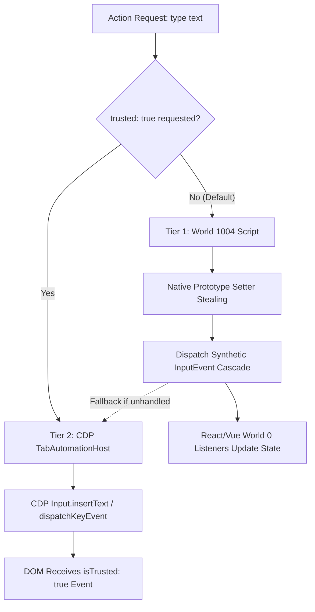

# Phase 02: Controlled Inputs & Dual-Tier Synthetic/CDP Interaction Engine

## Overview
Upgrades the DOM interaction engine in `semantic-ref-executor.ts` (World 1004) and `tab-automation-host.ts` to provide a resilient, dual-tier interaction model:
1. **Tier 1 (Fast Synthetic DOM Cascade - `isTrusted: false`):** Native prototype descriptor setter stealing in World 1004 and bubbling synthetic `InputEvent` cascade for React 16–19, Vue 3, and Web Components (sub-5ms).
2. **Tier 2 (True Hardware-Emulated CDP Path - `isTrusted: true`):** Explicit CDP `Input.insertText` / `Input.dispatchKeyEvent` execution via `TabAutomationHost` for security-gated forms and bot-detection fields requiring authentic browser-generated events.

---

## Requirements

### Functional
1. **Tier 1 (Synthetic Path in World 1004):**
   - Steal and invoke native property descriptor setters (`Object.getOwnPropertyDescriptor(HTMLInputElement.prototype, 'value').set`).
   - Dispatch the synthetic event sequence: `beforeinput` $\to$ native setter $\to$ `input` (with `bubbles: true, composed: true`) $\to$ `change`.
   - Acknowledge DOM specification: All `dispatchEvent` calls produce untrusted events (`event.isTrusted === false`), which suffices for 95% of standard React/Vue form data binding.
2. **Tier 2 (Explicit CDP Trusted Path):**
   - In `TabAutomationHost`, support `trusted: true` flag in `RendererActionRequest` or automatic escalation when elements require trusted events.
   - Attach DevTools session if not already attached and issue CDP `Input.dispatchKeyEvent` (keyDown, keyUp) and `Input.insertText`.
   - Guarantee `event.isTrusted === true` on the target storefront DOM node.
3. **Shadow DOM & ContentEditable Support:**
   - Synthetic events must set `composed: true` to traverse ShadowRoot boundaries.
   - ContentEditable nodes must support text insertion via DOM Range API / Selection fallbacks.

### Non-Functional
- Synthetic path latency < 5ms.
- CDP trusted path latency < 25ms with automatic detachment/reuse.
- Fail-closed error reporting: Return typed `REF_INTERACTION_FAILED` with detailed diagnostics if both tiers fail.

---

## Architecture & Code Changes



## Related Code Files
- Modify: `src/main/browser/semantic-ref-executor.ts` (lines 157–174)
- Modify: `src/main/browser/tab-automation-host.ts` (CDP trusted dispatch integration)
- Modify: `src/main/browser/semantic-ref-types.ts` (add `trusted?: boolean` to request contract)
- Test: `test/main/semantic-ref-contract-characterization.test.ts`
- Test: `test/integration/semantic-ref-integration.test.ts`
- Test: `test/e2e/semantic-ref-trusted-cdp.test.ts`

---

## Implementation Steps

### 1. Refactor `buildIsolatedExecutorScript` in `src/main/browser/semantic-ref-executor.ts` (Tier 1)
```javascript
// Native Prototype Descriptor Setter Stealing in World 1004
function setNativeValue(element, value) {
  let prototype = Object.getPrototypeOf(element);
  let descriptor = null;

  while (prototype) {
    descriptor = Object.getOwnPropertyDescriptor(prototype, 'value');
    if (descriptor && descriptor.set) break;
    prototype = Object.getPrototypeOf(prototype);
  }

  const setter = descriptor ? descriptor.set : null;
  if (setter) {
    setter.call(element, value);
  } else {
    element.value = value;
  }
}

// Synthetic Event Cascade (isTrusted === false)
function dispatchSyntheticInputCascade(element, text) {
  if (typeof element.focus === 'function') element.focus();

  element.dispatchEvent(new InputEvent('beforeinput', {
    bubbles: true,
    cancelable: true,
    composed: true,
    data: text,
    inputType: 'insertText',
    view: window
  }));

  setNativeValue(element, text);

  element.dispatchEvent(new InputEvent('input', {
    bubbles: true,
    cancelable: false,
    composed: true,
    data: text,
    inputType: 'insertText',
    view: window
  }));

  element.dispatchEvent(new Event('change', { bubbles: true, cancelable: false, composed: true }));
}
```

### 2. Implement CDP Trusted Path in `TabAutomationHost` (Tier 2)
- In `TabAutomationHost.executeAction`:
  ```typescript
  if (request.trusted || request.requireTrusted) {
    await this.focusElementByRef(request.ref);
    await this.devToolsHost.sendCommand('Input.insertText', { text: request.text });
    return { ok: true, executed: true, tier: 'cdp_trusted' };
  }
  ```

### 3. Add Live CDP Verification Test (`test/e2e/semantic-ref-trusted-cdp.test.ts`)
- Assert in a live Chromium WebContents that:
  - Synthetic path triggers listener with `event.isTrusted === false`.
  - CDP path triggers listener with `event.isTrusted === true`.
  - React 18 controlled component updates state correctly under both paths.

---

## Success Criteria
- [ ] Tier 1 Synthetic path updates React 18/19 controlled input state 100% reliably in sub-5ms.
- [ ] Tier 2 CDP path generates genuine `event.isTrusted === true` events verified in live Chromium test.
- [ ] Shadow DOM and ContentEditable inputs update without throwing unhandled exceptions.
- [ ] `trusted: true` flag in MCP action router dispatches through CDP seamlessly.
