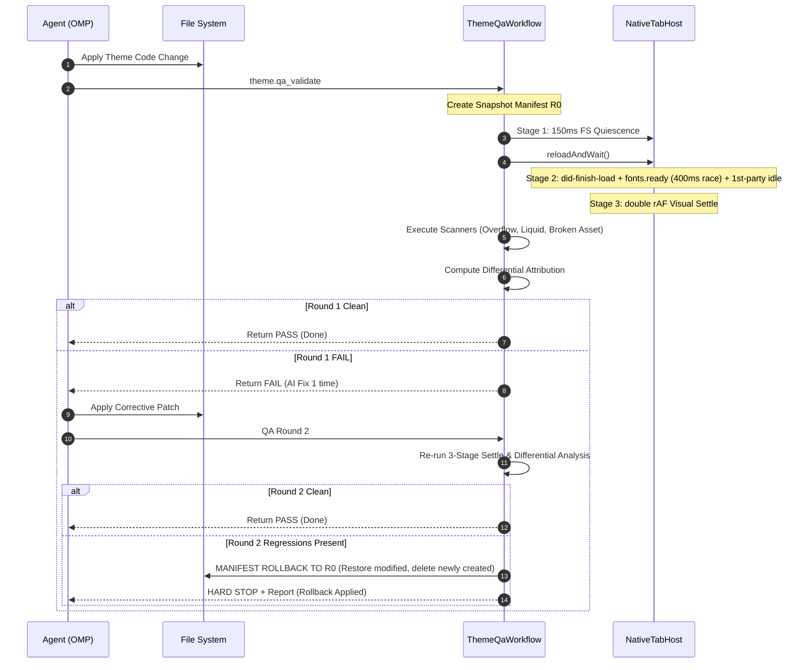

# Phase 03: Theme QA 3-Stage Settle Gates & Differential Rollback

## Overview
Hardens `ThemeQaWorkflow` in `src/main/qa/theme-qa-workflow.ts` by introducing a bounded 3-Stage Settle Gate to eliminate false-positive FOUC layout overflow errors without stalling on analytics streams or broken fonts, implementing differential issue attribution (pre-existing vs change-induced), and enforcing a safe, manifest-backed atomic workspace rollback if Round 2 produces unresolved regressions.

---

## Requirements

### Functional
1. **Stage 1 (FS & Build Watcher Quiescence):** 150ms debounce window after file writes before triggering browser reload.
2. **Stage 2 (Document & Bounded Network Quiescence):** Lắng nghe `did-finish-load` + xác nhận zero inflight requests cho first-party assets (HTML/CSS/JS/Fonts) với 500ms debounce và 2000ms hard ceiling + `Promise.race([document.fonts.ready, timeout(400ms)])`.
3. **Stage 3 (Visual Layout Quiescence):** Chờ double requestAnimationFrame ($2 \times \text{rAF}$) trước khi chạy `LayoutOverflowEngine` và `LiquidErrorScanner`.
4. **Differential Issue Attribution:** Phân loại issues thành `preExistingIssues`, `resolvedIssues`, và `introducedRegressions`.
5. **Manifest-Backed Atomic Rollback:** Tạo snapshot manifest (danh sách file + sha256) của workspace $R_0$ trước Round 1 (loại trừ `.git`, `node_modules`, `.antifan`). Nếu Round 2 có regressions:
   - Khôi phục nội dung các file bị sửa đổi.
   - Xóa bỏ triệt để các file mới tạo trong quá trình AI fix (orphan file prevention).
   - Kiểm tra `assertWorkspaceContained` nghiêm ngặt, không follow symlink ra ngoài workspace root.

### Non-Functional
- Scan overhead must remain under 1.5s on warm local dev storefronts.
- Zero race conditions between dev server HMR reload and QA scanner execution.

---

## Architecture & Workflow



## Related Code Files
- Modify: `src/main/qa/theme-qa-workflow.ts` (lines 110–270)
- Modify: `src/main/qa/diagnostics-filter.ts`
- Test: `test/main/theme-qa-parity.test.ts`
- Test: `test/main/theme-qa-fresh-target.test.ts`
- Test: `test/main/async-qa-generation-guard.test.ts`

---

## Implementation Steps

### 1. Implement Bounded 3-Stage Settle Gates in `ThemeQaWorkflow`
- In `reloadAndWait`, enforce adaptive settle barrier:
  1. Wait for `did-finish-load` event.
  2. Evaluate script in page with bounded timeouts:
     ```javascript
     const fontPromise = document.fonts 
       ? Promise.race([document.fonts.ready, new Promise(r => setTimeout(r, 400))]).catch(() => {}) 
       : Promise.resolve();
     const rafPromise = new Promise(resolve => requestAnimationFrame(() => requestAnimationFrame(resolve)));
     await Promise.all([fontPromise, rafPromise]);
     ```
  3. Filter network idle exclusively for first-party critical theme assets (ignore background beacons / live chat sockets) with a 2000ms hard ceiling.

### 2. Implement Differential Issue Attribution
- Compare pre-mutation diagnostics and post-mutation scanner results.
- Categorize violations by signature (file, line, selector, ruleId) into `preExistingIssues`, `resolvedIssues`, and `introducedRegressions`.

### 3. Implement Manifest-Backed Workspace Rollback
- Helper `createWorkspaceSnapshotManifest(workspaceRoot: string): SnapshotManifest`:
  - Scans workspace files (ignoring `.git`, `node_modules`, `.antifan`).
  - Stores relative path $\to$ sha256 + backup content in `.antifan/snapshots/r0-${runId}`.
- Helper `rollbackWorkspaceToManifest(workspaceRoot: string, manifest: SnapshotManifest)`:
  - Overwrites modified files with backup content.
  - Deletes files that exist currently but were absent in manifest (cleans orphan files).
  - Validates `assertWorkspaceContained` on every path.

---

## Success Criteria
- [ ] 0 false-positive layout overflow reports caused by unrendered webfonts or partial CSS stylesheets.
- [ ] Broken 404 webfonts or background tracking beacons do not block QA execution beyond the 1.5s budget.
- [ ] Intentional syntax/layout regression in Round 1 followed by failed Round 2 triggers automatic rollback to $R_0$ and cleanly deletes newly created orphan files.
- [ ] Differential report accurately flags which errors were fixed and which are baseline legacy issues.
