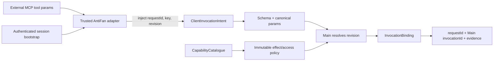

# Phase 01: Canonical Authority Contracts, Effect Policy & MCP Envelopes

## Overview
Complete and freeze the partially implemented public wire intent and internal Main authority boundary before changing dispatch. Replace remaining caller-owned invocation authority with mandatory opaque revision handles, catalogue-owned effect policy, Main-issued canonical invocation IDs, and consistent MCP/Bridge result envelopes.

## Requirements

### Functional
- Complete, validate, and migrate the existing partial `AuthorityRevisionHandle`, `ClientInvocationIntent`, `MainResolvedAuthority`, `CapabilityEffectPolicy`, `InvocationBinding`, `InvocationState`, and `AuthoritativeInvocationReceipt` contracts in `src/shared/control-plane-contracts.ts`; do not create parallel replacements.
- Add `invocation`, `event`, and `message` to canonical ID entities only where actual stores issue those IDs; migrate all callsites in the same cutover.
- Split the external standard MCP schema from the trusted adapter-to-Main intent. LLM-authored tool arguments keep capability params only; the authenticated AntiFan adapter injects attachment credentials, caller `requestId`, retry `idempotencyKey`, and the current opaque Main-issued `authorityRevision`.
- Remove `invocationId`, resolved `grant`, raw target authority, lease objects, `AbortSignal`, effect policy, and caller-selected authority revision from public MCP tool arguments. Direct Bridge/session clients may send only credentials and the opaque revision they were issued.
- Make `authorityRevision` mandatory at the adapter-to-Main execution boundary. Main dispatch must not silently resolve “latest active” when the handle is absent.
- Extend `CapabilityDefinition`/`CapabilityCatalogue` with immutable policy fields for effect type, risk, target requirement, scheduler lane, in-flight duplicate mode, terminal receipt visibility, current receipt-read permission/class, timeout, retention, disconnect/cancellation behavior, and policy version/digest. Orchestration capabilities cannot hold a child execution lane across nested dispatch; `workflow.execute` uses an orchestration/unbounded lane while each child independently acquires its catalogue lane.
- Replace the conflated `cancellationBehavior` enum with orthogonal immutable policy fields: `ownerCancellationBehavior: 'abort-immediate' | 'drain-and-persist'`, `subscriberDisconnectBehavior: 'abort-when-unobserved' | 'detach-and-continue'`, and positive `cancellationAckTimeoutMs <= timeoutMs`. `abort-when-unobserved` is valid only with `abort-immediate`; `drain-and-persist` requires `detach-and-continue`. Remove `ignore-disconnect` and migrate every capability registration in the same cutover.
- Freeze grant visibility as explicit scope membership, not ordinal comparison: `read` sees read; `write` sees read+write; `execute` sees read+execute; `eval` sees read+eval only when `allowEval` is enabled. Any future cross-scope inheritance is a public policy change with dedicated tests.
- Separate receipt disclosure from re-execution. A historical duplicate returns only the intersection of recorded visibility and current receipt-read permission; no policy path silently executes the same key again or exposes record existence to mismatched tenant/run lineage.
- Standardize MCP success/failure envelopes with caller `requestId`, Main `invocationId`, explicit `InvocationState`, typed error, and `McpEvidence`; preserve existing tool aliases and binary/content transport. `ok` is a convenience projection only and cannot collapse `failed`, `interrupted`, or `unknown`.
- Return the new authority revision from session/attachment issue and every target/grant/lease/host rebinding response so trusted adapters can make the next exact request.
- Freeze serializable contracts and policy classifications for `browser.observe`, `browser.wait`, `terminal.wait`, `artifact.read`, centralized interactive actionability, and internal ledger-owned `report.generate`. These are canonical capabilities, not transport-specific helpers or local unreceipted workflow effects.
- Define observation coherence as exact `(browserEpoch, tabId, paneId, documentGeneration, documentUrl)` identity plus per-component capture timestamps, monotonic snapshot sequence, duration, and drift metadata. Do not claim same-document DOM/screenshot atomicity.
- Define typed, bounded inputs/results for browser wait conditions, terminal wait conditions, and paged artifact reads; preserve text/image MIME framing in MCP responses.
- Extend the error taxonomy only with codes that callers can act on: binding collision/ambiguous recovery, wait deadline/abort, terminal session closure, artifact integrity compromise, semantic fallback ambiguity (`REF_AMBIGUOUS`), and specific actionability failures.

### Non-functional
- All adapter-to-Main wire structures are JSON-serializable and schema-validated; public MCP schemas expose no internal authority fields.
- Authority revisions and policy snapshots are immutable/read-only after issuance.
- Parameter and policy digests use deterministic canonical serialization, not insertion-order-dependent `JSON.stringify`.
- No compatibility alias accepts caller-issued canonical invocation IDs, resolved authority, or caller policy overrides.
- Wait deadlines and artifact chunk sizes are policy-bounded at schema and execution boundaries; cancellation and effect disposition are represented only by Main-owned internal execution control.
- Freeze initial bounds: `browser.observe` accepts at most the existing DOM 512 KiB, screenshot 8 MiB, and semantic snapshot 150-descriptor/128 KiB component limits; at most four observation components per call. Default deadline 5 s, maximum 30 s. The dedicated wait registry allows at most 4 waits per tab and 16 globally, default deadline 5 s, maximum 30 s. Semantic snapshot history keeps at most 2 published generations per target within the existing 10,000-process-descriptor and 5-minute age ceilings; byte/count eviction is oldest-first.
- Persist only a versioned one-way verifier for the 256-bit random attachment secret and compare in constant time; never persist the reusable plaintext secret. Verifier format changes require explicit version migration, not implicit reinterpretation.
- Capability aliases such as `qa.run`, if retained, delegate to the existing `theme.qa_validate`/`ThemeQaWorkflow`; no second QA engine or divergent result contract is permitted.
- For standard MCP, derive caller `requestId` and retry `idempotencyKey` from the SDK handler's stable `extra.requestId` for that JSON-RPC operation. Retransmission of the same operation reuses the key; a distinct JSON-RPC call—even with identical params—is a new operation and receives a new key. Never hash params alone or generate a second unrelated key inside the proxy.
- Workflow retry eligibility is derived only from immutable catalogue `effect` policy through an exhaustive `WorkflowStep.type -> canonical capability set` mapping. Only mappings whose every reachable effect is `read` or `idempotent-write` are retryable; unknown/missing policies and management-classified `report.generate` fail closed to one attempt. Define separate process-local `CapabilityDispatchRuntimeOptions` (signal plus optional progress sink) and `InternalChildCapabilityRequest` (canonical capability params, exact revision, step ID, attempt index, invocation sequence and linked signal). Neither contains attachment credentials or caller-selected identity; neither enters public schemas, parameter/policy digests, ledger bindings or persistence.
- Define process-local `CapabilityExecutionControl`: transport-owned cancellation ID/source, monotonic effect stage (`not-started`, `effect-started`, `effect-committed`), policy-scoped signal, and post-cleanup cancellation acknowledgement (`no-effect`, `effect-possible`, `effect-committed`). Only `abort-immediate` links authoritative post-dispatch cancellation into the signal; `drain-and-persist` keeps it unsignalled. The acknowledgement must match the active invocation/cancellation ID and guarantees no later effect; these fields never enter public schemas, digests, bindings, receipts, or persisted payload except sanitized settlement evidence.
- Add durable `InvocationDispatchStage: 'pre_dispatch' | 'dispatch_started'` to invocation records. `claimOrObserve` persists `pre_dispatch`; transport must durably advance to `dispatch_started` immediately before invoking executor code, and failed advancement forbids invocation. The ledger API distinguishes a failed initial claim append from a failed dispatch-marker append and exposes a typed durability-failure disposition; only a reconciled initial failure proven to have no valid frame may evict its in-memory binding. For dispatch-marker or ambiguous append failures, the live `.jsonl` partition file remains in place on disk and the in-memory partition is gated with a process-local poison, reserving `.quarantine-*` file renaming strictly for checksum-invalid corruption. Legacy `in_progress` records without a stage are interpreted as dispatched/ambiguous. Fine-grained `effect-started`/`effect-committed` remains process-local and cannot prove crash-time no-effect.

## Architecture


### Contract Checklist
- Public MCP tool args: capability-specific serializable params only; no attachment secret, authority revision, policy, signal, or canonical invocation ID authored by the model.
- `ClientInvocationIntent`: trusted-boundary `requestId`, `idempotencyKey`, `attachmentId`, `attachmentSecret`, `authorityRevision`, canonical capability, and params.
- `MainResolvedAuthority`: revision/attachment/run/attempt/project/workspace/runtime/host/PID/grant/lease/target snapshot; never accepted from untrusted JSON.
- `CapabilityEffectPolicy`: effect, risk, target requirement, lane, join mode, recorded replay visibility, current receipt-read permission/class, deadline, retention, disconnect/cancellation behavior, version/digest. An orchestration parent cannot reserve the lane later acquired by its children.
- `InvocationBinding`: attachment, idempotency key, authority revision, canonical capability, params digest, policy digest.
- `CapabilityTransportResponse`/`AuthoritativeInvocationReceipt`: Main `invocationId`, origin `requestId`, explicit monotonic `InvocationState`, binding, timestamps, sanitized result/error/evidence and optional replacement revision; `ok` never substitutes for state.
- `CapabilityDispatchRuntimeOptions`/authenticated runtime context/`InternalChildCapabilityRequest`: non-serializable Main-only state. `ControlPlaneRuntime` may supply signal/progress sink; transport binds exact lineage/revision and creates the child dispatcher. Child callers cannot select credentials or identity. Progress callbacks are best-effort, exception-isolated and non-authoritative.
- Settlement classifier contract: normal success -> `completed`; ordinary non-cancellation/non-ambiguous error -> `failed`; active matching cancellation plus acknowledged `no-effect` -> `interrupted`; possible/committed effect, missing/mismatched acknowledgement, grace expiry, or absolute drain deadline -> `unknown`. The classifier does not inspect error strings and writes exactly one monotonic ledger terminal state.
- Recovery classifier contract: durable `claiming`/explicit `pre_dispatch` -> `interrupted`; `dispatch_started`, any later/unknown stage, or legacy stage-less `in_progress` -> `unknown`. Recovery persists the terminal frame before serving replay and never derives `interrupted` from an absent process-local acknowledgement.
- Error taxonomy retains `TARGET_STALE`, `TARGET_MISMATCH`, `REPLAY_DENIED`, and adds only evidence-proven codes needed for binding collision, ambiguous recovery, or non-unique semantic fallback (`REF_AMBIGUOUS`).
- `BrowserObserveInput/Result`: at most four requested components; exact target/document identity; optional DOM (512 KiB), semantic snapshot (150 descriptors/128 KiB), screenshot (8 MiB), diagnostics and network components; 5 s default/30 s maximum deadline; per-component capture metadata and truthful drift.
- `BrowserWaitInput/Result`: selector/ref, document-loaded, URL, network-idle and bounded declarative DOM-state conditions; target-bound, deadline-limited and abortable. Raw JavaScript predicates are not part of the read capability; any expression evaluation remains a separate `eval`-risk capability requiring `allowEval`.
- `TerminalWaitInput/Result`: output match, exit or silence conditions with `(sessionGeneration, afterSeq)` cursor, deadline and byte-bounded output tail; stale-generation cursors fail closed.
- `ArtifactReadInput/Result`: exact artifact ID, offset/limit bounded to 1 MiB, UTF-8/base64 framing, total bytes and continuation state. Durable artifact metadata carries immutable project/workspace/run/attempt lineage and SHA-256; disclosure remains exact-lineage and receipt-read authorized.
- Interactive capability policy declares required actionability checks; execution returns stable typed failure metadata and emits no trusted or synthetic input on pre-action failure.
- `RendererActionResponse`/MCP evidence reports `executionTier: 'cdp_trusted' | 'isolated_synthetic'` for executed interactive input and bounded `fallbackReason` only when trusted execution failed before emitting input; an ambiguous post-dispatch failure has no fallback success response and performs bounded best-effort trusted-input cleanup without crossing tiers.
- Historical attachment authentication persists only a versioned one-way verifier, immutable lineage/revision records, security-revocation state and receipt-disclosure metadata; reusable plaintext secrets are never persisted.

## Related Code Files
### Modify
- `src/shared/control-plane-contracts.ts`
- `src/main/tools/capability-catalogue.ts`
- `src/main/tools/capability-transport.ts`
- `src/main/mcp/result-envelope.ts`
- `src/main/mcp/mcp-server.ts`
- `src/main/bridge/bridge-server.ts`
- `src/main/run/attachment-registry.ts`
- `src/main/run/run-service.ts`
- `src/main/control-plane/control-plane-runtime.ts`
- `src/main/chat/chat-store.ts`
- `src/main/session/event-store.ts`
- `scripts/antifan-omp-mcp.cjs`
- `scripts/antifan-agent.cjs`
- `src/main/tools/browser-capabilities.ts`
- `src/main/tools/file-capabilities.ts`
- `src/main/workflow/workflow-capabilities.ts`
- every bootstrap, smoke, benchmark, and test client that constructs an executable capability request
- `test/main/mcp-result-envelope.test.ts`
- `test/main/capability-catalogue.test.ts`
- `test/main/bridge-attachment-dispatch.test.ts`
- `test/main/omp-mcp-adapter.test.ts`

### Create
- `test/main/authority-contracts.test.ts`
- `test/main/adapter-injection.test.ts`
- `test/main/policy-completeness.test.ts`

### Delete
- None. `src/main/browser/browser-action-registry.ts` is a legacy, test-referenced registry disconnected from the canonical `ControlPlaneRuntime` capability path; deleting or migrating it is outside this phase unless callsite migration proves it executable.

## Deep-Mode File Inventory
| Action | Paths | Protected responsibility | Dependency |
|---|---|---|---|
| Modify | `src/shared/control-plane-contracts.ts`, `src/main/tools/capability-catalogue.ts` | Canonical IDs, immutable authority/policy, deterministic digests | None; contract source for all later phases |
| Modify | `src/main/tools/capability-transport.ts`, `src/main/mcp/result-envelope.ts`, `src/main/mcp/mcp-server.ts`, `src/main/bridge/bridge-server.ts` | Trusted intent injection, public schema isolation, response framing | Shared contracts complete first |
| Modify | `src/main/run/attachment-registry.ts`, `src/main/run/run-service.ts`, `src/main/control-plane/control-plane-runtime.ts` | Revision issuance/rotation and runtime wiring | Contract and policy types |
| Modify | `src/main/chat/chat-store.ts`, `src/main/session/event-store.ts` | Correct canonical message/event ID issuance | ID entity migration |
| Modify | `scripts/antifan-omp-mcp.cjs`, `scripts/antifan-agent.cjs`, all executable smoke/bootstrap/test clients | Retain and propagate `ANTIFAN_AUTHORITY_REVISION`, request ID, and retry identity | Session bootstrap response |
| Modify | `src/main/tools/browser-capabilities.ts`, `src/main/tools/file-capabilities.ts`, `src/main/workflow/workflow-capabilities.ts` | Complete catalogue policies and canonical schemas | Catalogue policy contract |
| Create | `test/main/authority-contracts.test.ts`, `test/main/adapter-injection.test.ts`, `test/main/policy-completeness.test.ts` | Contract, injection, and startup completeness gates | Production contracts compiled |

## Function and Interface Checklist
- [ ] `makeControlPlaneId` / ID validators issue and accept the final entity prefixes at every store callsite.
- [ ] Deterministic canonical serializer and policy/parameter digest helpers are key-order independent.
- [ ] `AttachmentRegistry.issueAttachment`, revision rotation, and bootstrap responses return immutable revision handles.
- [ ] `CapabilityCatalogue.register` rejects incomplete or contradictory effect/access policies.
- [ ] `CapabilityTransportAdapter` accepts only trusted external `ClientInvocationIntent`; public MCP schemas reject internal fields. `dispatchIntent(intent, runtimeOptions)` excludes runtime options from binding/digest/persistence. For `workflow.execute`, transport creates the authenticated child-dispatch closure; the internal child request cannot supply credentials or identity, and transport derives the key from the authenticated Main parent invocation plus step/attempt/sequence.
- [ ] MCP/Bridge result-envelope builders preserve text/image MIME framing while adding request/invocation/state/evidence/revision metadata.
- [ ] `scripts/antifan-omp-mcp.cjs` and `scripts/antifan-agent.cjs` retain and forward the current revision without exposing it as model-authored tool input.
- [ ] MCP `CallToolRequest` handlers pass SDK `extra.requestId` through the trusted adapter as caller correlation/retry identity; the proxy does not replace it with per-send random UUIDs.
- [ ] `CapabilityCatalogue.isVisible` implements the frozen scope matrix exactly; `eval` never implies write/execute and remains gated by `allowEval`.
- [ ] Catalogue policy access is the only workflow retry authority; a compile-time exhaustive step-type mapping names every reachable canonical capability and has no permissive default. `workflow.execute` occupies no child scheduler lane and `report.generate` is a ledger-owned management capability.
- [ ] `workflow.execute` public params contain only workflow/workspace inputs. Signal, progress sink, parent invocation, current revision and child dispatcher are authenticated process-local context; `ControlPlaneRuntime.executeWorkflow` enters through transport rather than `dispatchTrusted`. Progress callback failure/detach does not cancel or settle the OWNER.
- [ ] Catalogue validation rejects missing cancellation/disconnect/acknowledgement bounds, `abort-when-unobserved` with `drain-and-persist`, and the removed `ignore-disconnect` value.
- [ ] Authenticated runtime context carries `CapabilityExecutionControl`; public callers and workflow child params cannot supply cancellation identity, effect stage, acknowledgement, or settlement state.
- [ ] Invocation records persist the pre-dispatch/dispatch-started boundary; transport cannot invoke executor code before the `dispatch_started` append is durable. Initial append failure evicts only after proving no durable frame; dispatch-marker or ambiguous append failure keeps the partition file in place on disk, applies a process-local poison gate to new OWNER execution, and preserves historical replay.

## Dependency Map
```text
shared contracts + canonical digests
  -> catalogue policy completeness
  -> attachment/session revision issuance
  -> trusted adapter injection
  -> MCP/Bridge envelope migration
  -> executable scripts, smokes, benchmarks, tests
  -> Phase 02 ledger binding and durable dispatch
```

## Test Matrix
| Scenario | Expected result |
|---|---|
| Model supplies revision, invocation ID, grant, target, or policy in public tool args | Schema rejection before trusted intent construction. |
| Trusted adapter starts from authenticated bootstrap | Current revision and stable retry identity are injected; Main issues invocation ID. |
| Policy registration omits lane, duplicate, cancellation, deadline, retention, or receipt-read class | Startup/registration fails with a typed completeness error. |
| Equivalent objects use different key insertion order | Parameter and policy digests remain identical. |
| Navigation/grant/lease/host binding rotates | Old snapshot remains immutable; response carries a replacement revision. |
| Binary screenshot or artifact result uses unified envelope | MCP content parts, MIME, bytes and evidence remain intact. |
| Same MCP JSON-RPC request is retransmitted vs. user issues a new identical call | Retransmission reuses one key/receipt; a new request ID creates a distinct operation. |
| `read`, `write`, `execute`, and `eval` grants enumerate capabilities | Each sees only read plus its explicit non-read scope; eval is absent when `allowEval` is false. |
| New workflow step type or missing mapped capability policy | Completeness test fails; runtime treats the step as single-attempt and never infers from display name. |
| Workflow parent dispatches interactive/passive/wait children | Parent reserves no child lane; each child independently acquires and releases its catalogue lane without nested-lock deadlock. |
| Top-level workflow execution | Transport creates the workflow OWNER; `runtimeOptions` inject signal/progress out-of-band and transport binds revision/child dispatcher. Public params cannot supply runtime hooks, parent identity or credentials. |
| Action executes through isolated fallback or two fingerprint-equivalent nodes exist | Response reports `isolated_synthetic` for the former; the latter returns typed `REF_AMBIGUOUS` with no input. |
| Policy uses `abort-immediate` vs. `drain-and-persist` | The former signals and awaits bounded post-cleanup acknowledgement; the latter does not signal after dispatch and awaits natural terminal settlement within the absolute deadline. Both settle `unknown` when required proof is absent. |
| Abort-shaped executor error reaches transport | Error text/code is ignored for classification; only matching transport cancellation identity plus execution-control acknowledgement can produce `interrupted`, and the generic catch cannot persist `failed`. |
| Process crashes at claim, after durable `pre_dispatch`, or after durable `dispatch_started` | Claim/pre-dispatch recovers `interrupted`; dispatch-started recovers `unknown`; same-key replay never dispatches. |

### Deep-Mode Verification Gate
- Run focused contract/injection/completeness tests first, then typecheck and the existing MCP/Bridge catalogue suites. Phase 02 cannot start until every executable repo client has migrated.


## Implementation Steps
1. Add shared types, validators, ID entities, deterministic canonicalization, and typed receipt/binding states.
2. Split public MCP schemas from the internal `ClientInvocationIntent`; reject all internal fields at the public boundary.
3. Extend capability registration so every current definition declares a complete Main-owned effect/access policy; expose immutable policy lookup to the workflow retry classifier and fail registration for missing or contradictory fields. Freeze future observe, declarative wait, artifact-read, ledger-owned report generation and actionability policy shapes here. Classify `workflow.execute` as orchestration/unbounded and `report.generate` as management/single-attempt. Add process-local runtime options and authenticated child-dispatch contracts separately from public `ClientInvocationIntent`; exclude functions/signals from every digest and persistence path.
4. Change attachment/session bootstrap to return the initial revision handle; make trusted adapters retain and inject it. Update MCP handlers to accept the SDK handler `extra` argument and use `extra.requestId` as the stable caller request/retry identity for that JSON-RPC operation; distinct calls remain distinct even when params match. Persist the existing one-way secret verifier with an explicit format version and constant-time verification, separately from active leases; never persist plaintext or add password-style KDF cost to random-token request authentication.
5. Define revision rotation on target, navigation/reload, grant, lease, or host-binding changes and return the replacement handle explicitly.
6. Add immutable project/workspace/run/attempt lineage and integrity metadata to `ArtifactRef`; migrate every artifact staging caller in the same cutover.
7. Update `result-envelope.ts` and both transports to preserve `requestId` while returning Main `invocationId`, explicit invocation state, evidence, typed errors, coherence metadata, binary/image content, and replacement revision where applicable. `CapabilityTransportAdapter.dispatchIntent(intent, runtimeOptions)` links cancellation and optional progress without serializing them; it binds authenticated workflow revision/child dispatch and isolates progress-sink exceptions.
8. Add process-local execution control and a pure policy-aware settlement classifier to the shared internal contract. Split and migrate cancellation/disconnect policy fields, require acknowledgement/timeout consistency at catalogue registration, and expose neither mechanism to public MCP schemas.
9. Add durable `InvocationDispatchStage` and typed durability-failure disposition to ledger contracts and migration. Persist `pre_dispatch` with the OWNER claim and expose one ledger method that atomically/durably advances it to `dispatch_started` before transport invokes executor code. Require checksummed tail reconciliation under the partition lock after append failure: evict only a failed initial claim proven absent; otherwise keep the `.jsonl` file in place, apply an in-memory poison gate against new OWNER execution, and recover on restart. Reserve `.quarantine-*` file renaming for unparseable or checksum-corrupted files. Treat old stage-less in-flight records as ambiguous.
10. Migrate every producer/consumer—including `scripts/antifan-omp-mcp.cjs`, `scripts/antifan-agent.cjs`, workflow clients, smoke/benchmark scripts, and tests—in one compile-safe cutover. Explicitly propagate `ANTIFAN_AUTHORITY_REVISION` through launcher/bootstrap environments; keep no caller-owned invocation-authority compatibility path.
11. Add focused public-schema, adapter-injection, policy-registration, ID-separation, alias, revision-rotation, canonical serialization, bounded-schema, stage-aware recovery, no-read-to-eval-escalation and content-framing tests.
## Success Criteria
- [ ] Public MCP tool schemas expose no authority handle or internal policy field; the trusted adapter injects the exact Main-issued revision.
- [ ] Missing/forged `authorityRevision` at the adapter-to-Main boundary is rejected before dispatch.
- [ ] Caller-supplied `invocationId`, policy, grant, lease, target authority, or signal cannot influence Main execution context.
- [ ] Every capability has one catalogue-owned, versioned effect policy, explicit receipt-read permission/class, and visibility matching the frozen non-ordinal grant scope matrix.
- [ ] `requestId` is echoed unchanged while `invocationId` is generated only by Main.
- [ ] MCP and Bridge aliases return the same structured contract without raw-result escape paths.
- [ ] All executable scripts/bootstrap clients compile and focused contract tests pass.
- [ ] Observation, browser/terminal wait, artifact-read, and actionability contracts are serializable, bounded, catalogue-owned, and preserve MCP text/image framing.
- [ ] Any `qa.run` compatibility alias executes the same `ThemeQaWorkflow` and schema as `theme.qa_validate`; no secondary QA owner exists.
- [ ] Historical verifier/revision and artifact-lineage schemas are restart-safe without persisting reusable secrets in plaintext.
- [ ] Observation/wait/snapshot count, byte, history and deadline bounds exactly match the frozen values and fail with typed overload/size/deadline errors.
- [ ] Transport responses expose monotonic invocation state, workflow parents never hold child scheduler capacity, and internal child callers cannot override transport-derived identity.
- [ ] Workflow retry classification is exhaustive over `WorkflowStep.type`, resolves real canonical capability policies, and defaults missing/local/non-retry-safe work to one attempt.
- [ ] Interactive action envelopes preserve actual trusted/synthetic tier evidence and expose `REF_AMBIGUOUS` without leaking candidate DOM content.
- [ ] Cancellation policy is orthogonal and complete; every capability declares owner cancellation, subscriber disconnect, absolute deadline, and acknowledgement grace, with no legacy `ignore-disconnect` registration.
- [ ] Transport settlement typing prevents abort-to-`failed`: `interrupted` requires matching no-effect acknowledgement, ambiguity maps to `unknown`, and no runtime-only execution-control field is serialized.
- [ ] Crash recovery maps only explicit pre-dispatch state to `interrupted`; dispatched/legacy unknown-stage work becomes `unknown`, and neither state auto-reexecutes.

## Risk Assessment
| Risk | Signal | Pre-decided response |
|---|---|---|
| Existing clients omit revision/idempotency fields | Adapter-to-Main `INVALID_ARGUMENT` or bootstrap tests fail | Update trusted session bootstrap and every repo client in this phase; do not add Main-side latest-active fallback. |
| Internal authority leaks into public MCP schema | Tool catalogue exposes revision/secret/policy fields | Block release; keep authority injection inside the authenticated adapter. |
| Effect/access policies are incomplete or inconsistent | Registration succeeds without lane/replay/access/deadline | Make policy validation fail at startup and add catalogue completeness tests. |
| Envelope breaks binary/image MCP content | Image/content tests lose MIME/data parts | Keep MCP content framing; standardize only structured metadata and verify image tools separately. |
