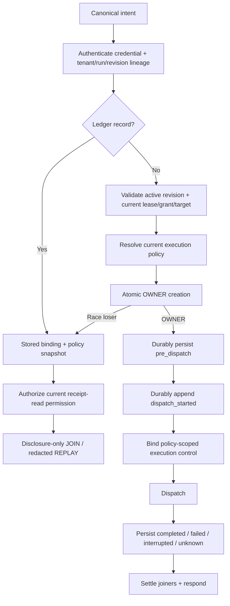

# Phase 02: Invocation Ledger, Dispatch Ordering, Cancellation & Recovery

## Overview
Implement the Main serialization boundary that guarantees one OWNER per deduplication binding, JOIN/REPLAY before current live-target checks, exact new-execution authorization, durable terminal receipts, cancellation propagation, and fail-closed crash recovery.

## Requirements

### Functional
- Create a dedicated Main-owned `InvocationLedger`; do not overload run/turn `ReceiptStore` or audit `EventStore`.
- Persist invocation binding, Main `invocationId`, originating `requestId`, immutable authority/policy snapshots and digests, state, sanitized result/error/evidence, referenced artifact IDs, and timestamps under configured `dataRoot`.
- Store attachment verifier/revision history at `${dataRoot}/attachments-v1.jsonl` and invocation partitions at `${dataRoot}/invocations/<attachmentId>.jsonl`. Records are versioned append-only frames with checksum/length validation; every issue/rotation awaits a serialized asynchronous append before exposing authority. Compaction writes a sibling temporary file, fsyncs file and parent where supported, then atomically renames. No synchronous `appendFileSync`/`mkdirSync` remains on Main dispatch. Checksum-corrupted files or unparseable tails discovered on startup/replay are quarantined by renaming to `.quarantine-*` and fail closed; in-flight append failures while running keep the `.jsonl` partition file in place on disk and apply a process-local poison gate.
- Split `AttachmentRegistry.validateAttachment()` into credential/lineage authentication, historical revision resolution, current receipt-read authorization, and live execution authority validation.
- Preserve immutable authority revisions when target/lease/grant/host binding changes. Mutation issues a new revision; it never edits an old revision in place.
- Remove volatile `invocationNonces`; atomic `claimOrObserve` owns deduplication.
- Existing record path: before lookup, authenticate the presented attachment credential against exact `(attachmentId, projectId, workspaceId, runId, attemptId, authorityRevision)` lineage without requiring a live execution lease. Do not reveal record existence on lineage mismatch. For a matching record, verify capability/params and recorded policy digest, intersect current receipt-read permission with recorded visibility, then JOIN or REPLAY without current execution target/generation/lease checks and without dispatch.
- Missing record path: require the revision to be active; validate current attempt/PID/backend/lease/workspace/runtime/grant/target and current execution policy; only then atomically create the OWNER record with its policy version/digest and durably persist `state: in_progress, dispatchStage: pre_dispatch`. Immediately before executor invocation, durably append `dispatchStage: dispatch_started`; executor invocation is forbidden until this append is acknowledged durable.
- Execution expiry/inactive attempt state denies new OWNER work but does not alone erase retained receipt-read eligibility. Explicit security revocation denies both. Current receipt-read permission/grant downgrade may redact or deny historical disclosure.
- Startup recovery persists a terminal frame before readiness: `claiming` or explicit `pre_dispatch` becomes `interrupted`; `dispatch_started`, any later/unknown stage, and legacy stage-less `in_progress` become `unknown`. Same-key requests replay that state and never auto-reexecute.
- Append failure is stage-specific and reconciled under the serialized partition lock. If the initial `pre_dispatch` claim append fails and checksummed tail replay proves no valid frame for the binding, evict the in-memory claim and reject OWNER/JOINers with one typed durability failure. If a valid frame exists or absence cannot be proven—or if the later `dispatch_started` append fails—keep the `.jsonl` partition file in place on disk (do not rename to `.quarantine-*`), retain a non-dispatchable in-memory poisoned binding, and gate the attachment partition against new OWNER claims while running. Reject all current/future execution waiters; verified historical terminal replay remains readable. On restart, rehydration replays the intact in-place partition file and recovers durable frames (`pre_dispatch -> interrupted`, `dispatch_started -> unknown`) before reopening new execution. File renaming to `.quarantine-*` is reserved exclusively for checksum-invalid or unparseable corruption.
- Master bridge token remains valid for control-plane/session management only. Browser, terminal, eval, workflow, and diagnostic execution requires attachment intent and the canonical transport path.
- Replace reusable master-token embedding in `/`, `/mobile`, and `/remote` HTML with a short-lived, single-purpose pairing/session credential issued through authenticated setup; `/api/remote-info`, `/api/qr`, and WebSocket execution retain their existing authentication gates.
- Main binds authoritative run/parent cancellation, the absolute deadline, and catalogue disconnect/cancellation policy into transport-owned execution control. Only `abort-immediate` exposes cancellation by signalling its internal `AbortSignal`; `drain-and-persist` leaves the dispatched executor unsignalled and waits for natural durable settlement. A JOINER disconnect never aborts or settles an OWNER.
- Treat `browser.wait` and `terminal.wait` as ordinary ledger-owned read capabilities: one OWNER per binding, in-process JOIN for duplicates, terminal receipt convergence, and no blind retry after timeout/abort. A JOINER disconnect detaches only that subscriber; the OWNER aborts on disconnect only when catalogue policy permits and no subscribers remain.
- Workflow execution is not an authority shortcut. `ControlPlaneRuntime.executeWorkflow` submits a canonical external intent plus process-local `{ signal, progressSink }` to `CapabilityTransportAdapter`, whose Main-issued `workflow.execute` invocation ID is the sole child parent; direct `dispatchTrusted` and session-attempt/caller parent substitutes are removed. Serializable params contain workflow/workspace inputs only. Transport creates authenticated runtime context with the exact revision and a Main-only child-dispatch closure. Every executable child—including `report.generate`—calls that closure with only canonical params, current revision, step/attempt/sequence and linked signal, receives its own Main invocation ID/state/receipt, and cannot supply attachment credentials or identity. Transport derives the child key without time/random fallback. Direct `CapabilityCatalogue.dispatch*` and local artifact staging from `WorkflowEngine` are forbidden.
- Freeze an exhaustive `WorkflowStep.type -> canonical capability set` classifier from the actual `dispatchStep` branches. Requested `retryCount` is honored only when every reachable catalogue policy effect is `read` or `idempotent-write`; `interactive-effect`, `destructive-mutation`, `management`, and unknown/missing policy are one attempt. Canonical ledger-owned `report.generate` is management-classified and single-attempt. Classification never reads human `step.name`.
- Carry parent/step cancellation only in process-local runtime options and the bound child dispatcher into `AuthenticatedCapabilityContext.signal`; never copy it, progress callbacks, credentials, parent identity or the dispatcher into workflow params, child intent params, digests or persistence. Progress callbacks are best-effort and exception-isolated; subscriber detach never aborts the OWNER. `workflow.execute` itself uses an orchestration/unbounded lane and retains no child scheduler capacity.
- Replace workflow `Promise.race` timeout with transport-owned policy-aware cancellation and settlement. Every `CapabilityTransportResponse` carries explicit terminal/ambiguous `InvocationState`. On timeout/parent abort before child dispatch, settle `interrupted`. After dispatch, `abort-immediate` signals the child OWNER and waits one bounded grace for matching acknowledgement or its monotonic persisted normal result; `drain-and-persist` does not signal and leaves the parent pending for the child's natural durable result until the absolute deadline. Proven no-effect cancellation settles `interrupted`; possible/committed effect, missing acknowledgement, grace expiry, or drain deadline expiry settles `unknown`. Late completion cannot overwrite terminal state. `unknown`/`interrupted` stops retries and later steps regardless of `continueOnError`; only an ordinary durable `failed` result may follow normal retry/continuation policy.
- Apply cancellation semantics to every ledger OWNER, not only workflow children. Transport owns a typed cancellation ID/source and monotonic effect-stage tracker; executor/scheduler acknowledgement is accepted only when it matches the active cancellation ID and is emitted after cleanup guarantees no future effect. Never infer cancellation from `error.message`, `AbortError`, `TARGET_STALE`, or another generic code.
- `abort-immediate`: before dispatch, settle `interrupted`; after dispatch, signal the OWNER and race only its normal terminal result against a bounded acknowledgement grace within the remaining absolute deadline. A normal success/ordinary non-ambiguous failure persisted first remains `completed`/`failed`; matching no-effect acknowledgement becomes `interrupted`; effect possible/committed, no acknowledgement, or grace expiry becomes monotonic `unknown`.
- `drain-and-persist`: before dispatch, settle `interrupted`; after dispatch, do not signal due to requester disconnect or parent/run cancellation. Detach the requester, keep the OWNER and JOINers bound to the same execution, and await natural `completed`/ordinary `failed` persistence within the policy's absolute `timeoutMs`; expiry becomes monotonic `unknown`. Workflow parent cancellation remains pending until that durable child receipt exists.
- Subscriber disconnect follows `subscriberDisconnectBehavior` independently. `detach-and-continue` removes only that waiter. `abort-when-unobserved` requests OWNER cancellation only when the final subscriber leaves and only for `abort-immediate`; JOINER disconnect never settles the OWNER. `interrupted`/`unknown` stop retries and later steps regardless of effect retry policy or `continueOnError`; same-key replay discloses state but never dispatches.
- Crash recovery never consumes process-local effect markers or synthesizes cancellation acknowledgement. The durable `dispatch_started` frame is the point of no safe recovery assumption: even a read/idempotent capability returns recovered `unknown` and requires inspection rather than automatic retry.
- Maintain one mutable authority-revision cursor for the workflow OWNER. Immediately after every child response—and before interpreting its state/data/error—apply any replacement revision to the cursor. Multi-child step failure, retry, and `continueOnError` must use the newest proven revision rather than the step-entry revision.
- Artifact references in receipts are disclosure metadata, not bearer authority. Historical replay and later `artifact.read` both re-evaluate exact lineage and current receipt-read permission without re-running the producer.
- Persist and rehydrate the minimal historical attachment verifier/hash, exact lineage/revision history, receipt-read classification and explicit security-revocation state needed to authenticate retained receipts after restart. Terminal attempt state becomes historical/inactive execution state, not implicit security revocation.
- Rehydrate concrete `RunRecord` and `ExecutionAttempt` maps from `EventStore` before attachment verifiers/revisions, invocation partitions, workflow dispatch, and artifact authorization. Recovery must preserve project/workspace/run/attempt/backend/state fields required by historical authorization; it cannot expose only summary `RecoveredRun` rows.
- Require authentication for `/api/lan-ips` as well as `/api/remote-info` and `/api/qr`; no discovery route returns LAN addresses, connection URLs or QR data with wildcard unauthenticated access.
- Make the mobile/remote pairing design end-to-end: authenticated setup issues a short-lived single-purpose credential, the HTML client exchanges it for attachment credentials plus the current revision, executable RPCs use canonical capability dispatch, and expiry/replay/revocation fail closed. Scope terminal stream broadcasts to authorized attachment/session subscribers.

### Non-functional
- `claimOrObserve` is atomic inside one Main-owned serialization boundary.
- OWNER, attachment-revision, and terminal records are durable before authority exposure, dispatch, and response respectively, using serialized asynchronous partitioned persistence with bounded hot indexes and measured compaction/retention.
- In-memory joiners, hot-data caches, indexes, poisoned bindings, and in-memory partition poison gates have explicit count/byte bounds. Terminal/abort/recovery/shutdown releases ordinary waiters; durability failure rejects waiters but retains the minimal in-memory poison sentinel needed to prevent disk/memory divergence until successful restart recovery.
- Sensitive results are sanitized before persistence; ledger files inherit existing data-root access controls.

## Architecture


## Related Code Files
### Create
- `src/main/session/invocation-ledger.ts`
- `test/main/invocation-ledger.test.ts`
- `src/main/tools/artifact-capabilities.ts`
- `test/main/historical-authority-replay.test.ts`

### Modify
- `src/main/run/attachment-registry.ts`
- `src/main/run/run-service.ts`
- `src/main/tools/capability-transport.ts`
- `src/main/tools/capability-catalogue.ts`
- `src/main/control-plane/control-plane-runtime.ts`
- `src/main/bridge/bridge-server.ts`
- `src/main/bridge/mobile-remote-html.ts`
- `src/main/mcp/mcp-server.ts`
- `src/main/workflow/workflow-capabilities.ts`
- `src/main/session/run-recovery.ts`
- `src/main/agent/codex-execution-backend.ts`
- `test/main/bridge-attachment-dispatch.test.ts`
- `test/main/mobile-remote.test.ts`
- `test/main/run-lifecycle.test.ts`
- `test/main/workflow-engine.test.ts`

### Delete
- None.

## Deep-Mode File Inventory
| Action | Paths | Protected responsibility | Dependency |
|---|---|---|---|
| Create | `src/main/session/invocation-ledger.ts` | Atomic OWNER/JOIN/REPLAY, durable invocation state, bounded hot index | Phase 01 binding/policy contracts |
| Modify | `src/main/run/attachment-registry.ts`, `src/main/run/run-service.ts` | Lineage authentication, historical disclosure, live authority, revision history | Phase 01 revision/verifier schema |
| Create | `src/main/tools/artifact-capabilities.ts` | Ledger-owned management-classified `report.generate`; Phase 04 extends the same module with read/stat | ArtifactStore + Phase 01 policy |
| Modify | `src/main/tools/capability-transport.ts`, `src/main/tools/capability-catalogue.ts` | Canonical eight-step dispatch ordering and policy-owned cancellation | Ledger and authority gates |
| Modify | `src/main/control-plane/control-plane-runtime.ts`, `src/main/session/run-recovery.ts` | Recovery order and external-surface readiness | Runs -> attachments -> ledger |
| Modify | `src/main/bridge/bridge-server.ts`, `src/main/bridge/mobile-remote-html.ts`, `src/main/mcp/mcp-server.ts` | Remove execution bypasses; pairing/discovery/stream isolation | Canonical transport ready |
| Modify | `src/main/workflow/workflow-schema.ts`, `src/main/workflow/workflow-capabilities.ts`, `src/main/workflow/workflow-engine.ts`, `src/main/tools/capability-transport.ts`, `src/main/tools/capability-catalogue.ts` | Transport-owned workflow OWNER, context-bound child dispatcher, exhaustive mapping, policy retry, deterministic sequence identity, runtime-only signal, revision cursor and durable abort settlement | Ledger OWNER context |
| Create/Modify | Ledger, historical replay, bridge, mobile, run, and workflow tests listed above | Race, restart, disclosure, bypass, pairing, cancellation | Production owners wired |

## Function and Interface Checklist
- [ ] `InvocationLedger.claimOrObserve` is atomic and returns exactly one OWNER or an existing JOIN/REPLAY record.
- [ ] Ledger terminal-state transitions are monotonic; recovery maps only `claiming`/explicit `pre_dispatch` to `interrupted` and maps `dispatch_started`/legacy unknown-stage `in_progress` to `unknown`.
- [ ] Initial claim-append failure evicts only after checksummed tail reconciliation proves no durable binding frame. Dispatch-marker failure or ambiguous initial failure keeps the partition file in place on disk, applies an in-memory poison gate against new OWNER claims, rejects every execution waiter, preserves historical replay, and reopens only after clean restart recovery.
- [ ] `AttachmentRegistry` separates exact lineage authentication, historical revision resolution, receipt-read authorization, and live execution authority.
- [ ] `CapabilityTransportAdapter.dispatchIntent` follows authenticate -> lookup -> disclose or authorize -> claim -> persist -> execute -> persist/respond.
- [ ] `CapabilityCatalogue` exposes immutable policy; an exhaustive workflow step mapping resolves every capability actually reachable from each `dispatchStep` branch and has no permissive default.
- [ ] `ControlPlaneRuntime.executeWorkflow` enters through `dispatchIntent(intent, runtimeOptions)`. `workflow-capabilities.ts` accepts only workflow/workspace params and consumes authenticated process-local invocation/revision/signal/progress/child-dispatch context; no credential, parent, signal, progress-callback or dispatcher parameter smuggling remains.
- [ ] `WorkflowEngine` depends on the bound internal child dispatcher, not transport credentials or direct catalogue dispatch. The Main workflow invocation is the parent; transport derives child keys, links receipts, and returns explicit state plus replacement revisions.
- [ ] One shared workflow revision cursor advances on every child response before success/error handling; a later failure or continuation cannot strand a completed transition.
- [ ] Timeout/abort produces a durable policy-aware terminal state: pre-dispatch -> `interrupted`; dispatched `abort-immediate` -> bounded acknowledgement settlement; dispatched `drain-and-persist` -> natural settlement by the absolute deadline. Late completion cannot overwrite it, and the workflow cannot return, retry, or advance before settlement.
- [ ] `CapabilityTransportAdapter` has one settlement classifier used by success, executor rejection, deadline, parent/run abort, disconnect, shutdown and recovery paths; its generic catch cannot call `settle(..., 'failed')` for an active cancellation or ambiguous effect.
- [ ] `abort-immediate` and `drain-and-persist` obey distinct await/settle contracts, and every JOINer resolves from the one persisted monotonic receipt.
- [ ] `CodexExecutionBackend` terminates only its owned process tree and reports acknowledgement ambiguity conservatively.
- [ ] `RunService.rehydrateRunsAndAttempts` consumes recovered event state before attachment/ledger rehydration and restores every authorization field.
- [ ] Bridge discovery/pairing/terminal subscription paths reveal no topology, reusable master token, or cross-session events.

## Dependency Map
```text
Phase 01 contracts/policy/revision
  -> recover and materialize RunService runs/attempts
  -> rehydrate `${dataRoot}/attachments-v1.jsonl` verifiers and immutable revisions
  -> replay `${dataRoot}/invocations/<attachmentId>.jsonl`; persist stage-aware `interrupted`/`unknown` recovery receipts
  -> construct transport/catalogue and inject internal child-intent dispatch into workflows
  -> expose MCP and Bridge
  -> Phases 03-04 consume ledger-owned OWNER contexts and receipt policy
```

### Deep-Mode Verification Gate
- Force concurrent duplicate races, crash/restart replay, completed-attempt disclosure, grant downgrade, security revocation, master-token bypass, pairing expiry, subscriber disconnect, and process cancellation before broad tests.


## Implementation Steps
1. Implement `${dataRoot}/invocations/<attachmentId>.jsonl` partition replay/rehydration with versioned checksummed frames, deterministic keying, atomic claim, durable `pre_dispatch -> dispatch_started` transition, in-process deferred JOIN, terminal persistence, bounded hot indexes/cache, measured compaction/retention, and explicit shutdown handling. Reconcile any append error against the checksummed tail under the serialized partition lock. Evict only an initial claim proven absent from disk; otherwise keep the partition file in place on disk, retain an in-memory poisoned binding, reject OWNER/JOINers, gate new OWNER claims for that partition while running, and permit reopening only after successful restart replay plus required recovery settlement. Reserve `.quarantine-*` file renaming strictly for checksum-invalid or unparseable corruption. Never dispatch after a failed `dispatch_started` append.
2. Refactor `AttachmentRegistry` into credential/lineage authentication, historical revision resolution, current receipt-read authorization, and live execution authority resolution. Persist a versioned secret verifier—not the secret—plus immutable historical lineage/revisions and explicit security-revocation state in `${dataRoot}/attachments-v1.jsonl`; use a serialized `fs.promises` append/flush queue and await durability before issue/rotation returns. Validate checksummed frames and rehydrate them before ledger replay. Attempt completion/expiry denies execution without overwriting the record as security-revoked.
3. Rebuild `CapabilityTransportAdapter.dispatch` around canonical ordering: authenticate exact attachment tenant/run/revision lineage before lookup; use recorded policy plus current receipt-read permission for disclosure-only existing records; resolve and validate current execution authority/policy before atomically creating a missing OWNER record.
4. Add `RunService.rehydrateRunsAndAttempts` and wire startup order: event replay materializes run/attempt authorization state, then attachment history, then invocation partitions, then transport/workflows/artifact disclosure, and only then MCP/Bridge readiness.
5. Remove Bridge and MCP pre-dispatch target mutation/fallback. Target changes are capabilities that produce a newly issued revision for subsequent calls.
6. Restrict master-token methods to management. Authenticate LAN/remote/QR discovery routes. Route executable aliases through attachment dispatch or reject them with `ATTACHMENT_REQUIRED`.
7. Implement the complete mobile/remote pairing handshake and client migration; remove embedded master credentials, enforce credential TTL/single use/revocation, and authorize terminal event subscriptions per attachment/session.
8. Register internal `report.generate` in `artifact-capabilities.ts` as a management/single-attempt catalogue capability and route the workflow branch through child transport; the handler owns ArtifactStore staging and returns artifact references through its durable receipt.
9. Route `ControlPlaneRuntime.executeWorkflow` through `CapabilityTransportAdapter.dispatchIntent(intent, { signal, progressSink })`. Remove signal, event callback, attachment credentials, authority revision and parent invocation from workflow params; exclude runtime options from digests/persistence and bind authenticated revision plus an internal child dispatcher in process-local context. Replace `WorkflowEngine` direct catalogue/credential plumbing with that closure. Build exhaustive step/capability policy mapping, apply retries, reset/increment sequence per attempt, advance one revision cursor before response interpretation, and replace unmanaged `Promise.race` with policy-aware durable cancellation settlement. Isolate progress-sink failure and detach from OWNER lifecycle.
10. Link owner cancellation/deadline/disconnect policy without letting a JOINER cancel the OWNER. Apply bounded acknowledgement only to dispatched `abort-immediate`; keep dispatched `drain-and-persist` unsignalled and await natural settlement until the absolute deadline. Settle every waiter from the persisted terminal/ambiguous receipt and reject late state overwrite.
11. Replace the current catch-all `ledger.settle(invocationId, 'failed', ...)` path with a pure policy-aware outcome classifier. Create execution control before dispatch, bind it into authenticated context/scheduler owners, durably mark `dispatch_started` before invocation, instrument process-local first-effect/commit boundaries, validate matching post-cleanup acknowledgements, and make every terminal path call the classifier exactly once. Do not classify from strings or generic error codes.
12. Add race, binding-collision, lost-response, lease-expiry, crash-at-claim/pre-dispatch/dispatch-started and process-local effect-started/effect-committed checkpoints, legacy stage-less recovery, completed-attempt replay, restart authentication, grant-downgrade, security-revocation, discovery-route auth, navigation, cancellation, pairing-token, terminal broadcast-isolation, storage-bound and bypass tests. Later process-local checkpoints must still recover from the last durable `dispatch_started` frame as `unknown`.

## Test Matrix
| Scenario | Expected result |
|---|---|
| Two identical concurrent calls | One OWNER/invocation ID; second JOINs; side effect count is 1. |
| Same key, different params/capability/revision | Typed binding collision; no dispatch. |
| Completed click response lost, navigation advances | Same authenticated lineage with receipt-read permission receives the cached terminal receipt; no `TARGET_STALE`; click count remains 1. |
| Execution lease expires after completion | Exact authenticated tenant/run/revision lineage may disclose the retained receipt if current receipt-read permission allows; no new OWNER allowed. |
| Correct secret with wrong project/workspace/run/attempt/revision | Uniform lineage denial; no receipt existence, state, or payload disclosed; no dispatch. |
| Current receipt-read permission reduces visibility | Historical result is redacted/status-only or denied; never re-executed. |
| Revision/attachment security-revoked | Receipt disclosure and new execution both denied without a receipt-existence signal. |
| Main crashes at claim/pre-dispatch vs. dispatch-started/effect-started/effect-committed | Claim/explicit pre-dispatch rehydrates as `interrupted`; every dispatched/later or legacy unknown-stage record rehydrates as `unknown`; same key returns the receipt and never executes. |
| Master-token direct action/terminal/eval | `ATTACHMENT_REQUIRED` or policy denial; management methods still work. |
| Mobile HTML fetched without pairing | No reusable master token in response; execution remains unavailable. |
| JOINER disconnects | OWNER continues according to owner/run/deadline policy; no leaked waiter. |
| Duplicate browser/terminal wait | One OWNER owns observers/listeners/timers; JOINers receive the same terminal receipt; cleanup occurs once. |
| Initial OWNER claim append fails while a duplicate is JOINing and tail reconciliation proves no frame exists | OWNER and every JOINer receive the same typed durability failure; the in-memory binding/deferred entry is evicted; executor count is zero; a later separately authorized call may claim normally. |
| `dispatch_started` append fails, or an initial append result is disk-ambiguous | Executor count is zero; OWNER/JOINers receive one typed durability failure; partition file remains in place on disk (not renamed); in-memory binding is poisoned; partition rejects new OWNER claims and same-key reclaim while running; verified historical terminal replay remains readable; restart replays the intact file and maps the last valid `pre_dispatch` to `interrupted` or `dispatch_started` to `unknown` before reopening. |
| Workflow navigate child completes | Child key is `child:<parent>:<step>:<attempt>:<seq>`, its own receipt links to the parent, replacement revision becomes the next child authority, and no direct catalogue dispatch occurs. |
| Workflow OWNER invokes click/wait/report child | Top level entered through `dispatchIntent` with process-local runtime options; public params carry no credentials/parent/signal/progress callback. Bound context uses its Main invocation ID, holds no child lane, and each child has a deterministic receipt/state. |
| Navigate succeeds, then the same step fails or continues on error | Shared revision cursor retains the replacement revision; retry/next step never presents stale authority. |
| `abort-immediate` child ignores cancellation beyond acknowledgement grace | Transport atomically persists `unknown`, releases workflow progression only to terminal stop, and rejects late settlement overwrite. |
| Read/idempotent step fails before completion | Configured retry uses the next attempt index and fresh deterministic child sequence; a display-name change cannot alter eligibility. |
| Click/type/scroll/hover/highlight or report generation requests retries | Interactive and management work executes once; retry count is ignored fail-closed. |
| Workflow child is cancelled before dispatch vs. after effect may begin | Pre-dispatch settles `interrupted`. After dispatch, `abort-immediate` receives the policy-scoped signal and settles from acknowledgement/effect evidence; `drain-and-persist` remains unsignalled until natural result or absolute deadline. Any `interrupted`/`unknown` stops retries and later steps even with `continueOnError`. |
| `abort-immediate` OWNER may have emitted/committed an effect, gives no matching acknowledgement, or misses grace | Transport atomically persists `unknown`; late success/failure cannot overwrite it and no automatic retry runs. |
| `drain-and-persist` OWNER loses requester or receives parent/run cancellation after dispatch | Requester detaches; handler is not signalled; workflow/transport awaits natural durable `completed`/ordinary `failed` within absolute `timeoutMs`, otherwise `unknown`. |
| Executor throws abort-shaped or `TARGET_STALE` error without matching cancellation identity | Generic error text/code does not imply interruption. Ordinary proven pre-effect failure may be `failed`; ambiguous disposition is `unknown`; no abort path is blindly persisted as `failed`. |
| Restart replays event state | Run/attempt maps exist before verifier/ledger authorization; completed attempts remain historical, not active. |
| Historical receipt exposes artifact ID | ID alone grants nothing; later read repeats exact-lineage/current-receipt-read authorization and returns uniform not-found on denial. |
| Main restarts before historical replay | Persisted verifier and immutable revision lineage authenticate the original secret after rehydration; no active lease is fabricated. |
| Completed attempt is replayed | Execution is inactive but not security-revoked; current receipt-read policy controls disclosure. |
| Unauthenticated LAN discovery request | Uniform authentication denial; no IP, URL, port or QR topology disclosure. |
| Paired mobile clients observe terminal streams | Each receives only authorized attachment/session events; master-token clients cannot execute or subscribe globally. |
| Ledger exceeds hot index/partition threshold | Compaction/eviction remains bounded without dropping retained records or blocking dispatch beyond measured budget. |

## Success Criteria
- [ ] Exactly one OWNER exists under a forced duplicate race.
- [ ] JOIN/REPLAY authenticates exact attachment tenant/run/attempt/revision lineage before lookup, authorizes disclosure through current receipt-read permission, and never dispatches.
- [ ] Missing records require active revision and complete current lease/grant/target/policy validation before atomic OWNER creation; stale handles cannot claim.
- [ ] Terminal receipts are durable before response and survive process restart.
- [ ] Interrupted/unknown records never silently reexecute.
- [ ] Durability-failure tests prove no disk/memory split: only a proven-absent initial frame permits eviction; every dispatch-marker/ambiguous failure prevents executor invocation and same-key or same-partition OWNER reclaim until successful recovery.
- [ ] Master-token capability bypasses and mobile HTML token disclosure are eliminated without mislabeling authenticated API routes.
- [ ] Ledger storage, hot indexes, joiners, and cancellation/recovery paths remain bounded with zero leaked processes or waiters.
- [ ] Browser/terminal wait OWNER/JOIN, subscriber disconnect, timeout, abort and shutdown paths release every observer/listener/timer exactly once.
- [ ] Historical attachment authentication survives restart, terminal attempt state is distinct from explicit security revocation, and plaintext reusable secrets are absent from persistence.
- [ ] LAN/remote/QR discovery is authenticated; mobile pairing produces usable attachment/revision state; terminal broadcasts are subscription-scoped.
- [ ] Child invocation identity is deterministic and collision-free across multiple capability calls in one attempt; no random/time fallback or caller-generated child key remains.
- [ ] Top-level workflows have durable Main OWNER receipts; runtime signal/progress stay out of wire/digests/persistence, and public workflow params cannot forge parent identity, credentials, revision, signal, progress sink or child dispatcher.
- [ ] `report.generate` has no local ArtifactStore path in `WorkflowEngine`; it is a management-classified child OWNER with a durable receipt.
- [ ] Attachment issue/rotation performs no synchronous filesystem I/O and exposes no authority before its serialized append is durable.
- [ ] Retry eligibility is catalogue-policy-derived and exhaustive; interactive, management, destructive and missing-policy work never scalar-retries.
- [ ] Workflow cancellation reaches the active child through runtime-only signal state and cannot return, retry, or continue before durable `completed`/`failed`/`interrupted`/`unknown` settlement.
- [ ] `failed` is emitted only for ordinary non-cancellation errors with non-ambiguous execution disposition; `interrupted` requires pre-dispatch cancellation or matching no-effect acknowledgement; every other cancelled/uncertain case is `unknown`.
- [ ] No transport or workflow retry follows `interrupted`/`unknown`; same-key requests replay the receipt and any separately authorized new operation requires explicit state inspection and a new identity.

## Risk Assessment
| Risk | Signal | Pre-decided response |
|---|---|---|
| Durable append acknowledges claim too early | Crash test executes the same effect twice | Persist the OWNER record before dispatch; if measured latency misses budget, change storage strategy rather than weakening durability. |
| Historical lookup crosses tenant/run lineage | Wrong project/workspace/run/attempt/revision learns record existence or data | Authenticate exact lineage before lookup and normalize mismatch/denial responses; block release. |
| Current receipt-read permission is ignored | Downgraded grant receives old full result | Intersect current permission with recorded visibility; deny or redact fail-closed without dispatch. |
| In-memory JOIN cannot survive restart | Restart sees an old in-flight record | Persist stage-aware terminal recovery before readiness: explicit pre-dispatch -> `interrupted`; dispatched/legacy unknown-stage -> `unknown`; never pretend to JOIN a missing owner. |
| Disconnect aborts side effect after commit | Receipt becomes unknown after mutation | Catalogue owns disconnect behavior; persist conservative ambiguity and require inspection, never retry same key. |
| Step mapping or identity sequence is incomplete | New branch lacks policy mapping, or two child calls share a binding | Compile/completeness test fails; runtime uses one attempt and transport rejects collisions—never synthesize a random suffix. |
| Timeout returns before child settlement | Late child effect appears after workflow advances | Block release; keep workflow pending through policy-aware settlement: bounded acknowledgement for `abort-immediate`, natural settlement/absolute deadline for `drain-and-persist`; then stop on `interrupted`/`unknown`. |
| Cancellation policy exists but catch-all error handling ignores it | Abort is persisted as clean `failed` and workflow retries | Centralize settlement classification, require cancellation identity/effect-stage acknowledgement, and test both policy branches plus late-settlement rejection. |
| Crash recovery ignores dispatch boundary | Possibly executed OWNER is rewritten to `interrupted` | Block release; require durable `dispatch_started` before invocation and conservatively recover it or any absent/unknown stage as `unknown`. |
| Append failure evicts a durable pre-dispatch claim | Same key or another key in the damaged partition reclaims/executes while disk retains in-flight state | Block release; reconcile tail under lock, evict only proven-absent initial claims, otherwise keep the partition file in place on disk, poison in memory, reject execution, and recover on restart. Reserve file renaming for checksum corruption. |
| Ledger growth harms Main | Heap/file size or event-loop delay exceeds gate | Partition, bound hot indexes, compact asynchronously, and coordinate retention with receipt-referenced artifacts. |
