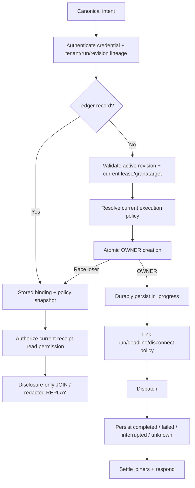

# Phase 02: Invocation Ledger, Dispatch Ordering, Cancellation & Recovery

## Overview
Implement the Main serialization boundary that guarantees one OWNER per deduplication binding, JOIN/REPLAY before current live-target checks, exact new-execution authorization, durable terminal receipts, cancellation propagation, and fail-closed crash recovery.

## Requirements

### Functional
- Create a dedicated Main-owned `InvocationLedger`; do not overload run/turn `ReceiptStore` or audit `EventStore`.
- Persist invocation binding, Main `invocationId`, originating `requestId`, immutable authority/policy snapshots and digests, state, sanitized result/error/evidence, referenced artifact IDs, and timestamps under configured `dataRoot`.
- Store attachment verifier/revision history at `${dataRoot}/attachments-v1.jsonl` and invocation partitions at `${dataRoot}/invocations/<attachmentId>.jsonl`. Records are versioned append-only frames with checksum/length validation; every issue/rotation awaits a serialized asynchronous append before exposing authority. Compaction writes a sibling temporary file, fsyncs file and parent where supported, then atomically renames. No synchronous `appendFileSync`/`mkdirSync` remains on Main dispatch. A corrupt/truncated tail is quarantined/fails closed and never fabricates authority or a terminal receipt.
- Split `AttachmentRegistry.validateAttachment()` into credential/lineage authentication, historical revision resolution, current receipt-read authorization, and live execution authority validation.
- Preserve immutable authority revisions when target/lease/grant/host binding changes. Mutation issues a new revision; it never edits an old revision in place.
- Remove volatile `invocationNonces`; atomic `claimOrObserve` owns deduplication.
- Existing record path: before lookup, authenticate the presented attachment credential against exact `(attachmentId, projectId, workspaceId, runId, attemptId, authorityRevision)` lineage without requiring a live execution lease. Do not reveal record existence on lineage mismatch. For a matching record, verify capability/params and recorded policy digest, intersect current receipt-read permission with recorded visibility, then JOIN or REPLAY without current execution target/generation/lease checks and without dispatch.
- Missing record path: require the revision to be active; validate current attempt/PID/backend/lease/workspace/runtime/grant/target and current execution policy; only then atomically create the OWNER record with its policy version/digest, durably persist `in_progress`, and dispatch. A stale handle cannot claim.
- Execution expiry/inactive attempt state denies new OWNER work but does not alone erase retained receipt-read eligibility. Explicit security revocation denies both. Current receipt-read permission/grant downgrade may redact or deny historical disclosure.
- Startup recovery converts durable `claiming`/`in_progress` records to `interrupted`; same-key requests return ambiguity and never auto-reexecute.
- If the durable pre-dispatch append fails after an in-memory claim is visible, atomically remove that claim and reject the OWNER plus every attached JOINer with one typed durability failure. No unresolved deferred or joinable ghost claim remains.
- Master bridge token remains valid for control-plane/session management only. Browser, terminal, eval, workflow, and diagnostic execution requires attachment intent and the canonical transport path.
- Replace reusable master-token embedding in `/`, `/mobile`, and `/remote` HTML with a short-lived, single-purpose pairing/session credential issued through authenticated setup; `/api/remote-info`, `/api/qr`, and WebSocket execution retain their existing authentication gates.
- Main links run cancellation, deadline, and catalogue disconnect policy into one internal `AbortSignal`. A JOINER disconnect never aborts an OWNER; an effectful OWNER is not aborted merely because its response subscriber disconnects.
- Treat `browser.wait` and `terminal.wait` as ordinary ledger-owned read capabilities: one OWNER per binding, in-process JOIN for duplicates, terminal receipt convergence, and no blind retry after timeout/abort. A JOINER disconnect detaches only that subscriber; the OWNER aborts on disconnect only when catalogue policy permits and no subscribers remain.
- Workflow execution is not an authority shortcut. The Main-issued invocation ID of the `workflow.execute` OWNER is the sole `parentInvocationId`; a session attempt ID or caller value cannot substitute. Every executable child—including `report.generate`—uses an internal `CapabilityTransportAdapter` entrypoint linked to `(parentInvocationId, stepId, attemptIndex, invocationSeq)`, receives its own Main invocation ID/state/receipt, and carries the current exact authority revision. The child request shape cannot contain an idempotency key; `invocationSeq` starts deterministically for each step attempt and increments for every child call, and transport derives the key with no time/random fallback. Direct `CapabilityCatalogue.dispatch*` and local artifact staging from `WorkflowEngine` are forbidden.
- Freeze an exhaustive `WorkflowStep.type -> canonical capability set` classifier from the actual `dispatchStep` branches. Requested `retryCount` is honored only when every reachable catalogue policy effect is `read` or `idempotent-write`; `interactive-effect`, `destructive-mutation`, `management`, and unknown/missing policy are one attempt. Canonical ledger-owned `report.generate` is management-classified and single-attempt. Classification never reads human `step.name`.
- Carry each step controller's `AbortSignal` as a non-serializable runtime option on child dispatch; `CapabilityTransportAdapter` places it on `AuthenticatedCapabilityContext.signal` and never copies it into `ClientInvocationIntent` or a ledger digest. `workflow.execute` itself uses an orchestration/unbounded lane and does not retain `ViewportGate`, passive-pool, or wait-registry capacity while dispatching children.
- Replace workflow `Promise.race` timeout with transport-owned linked cancellation and bounded acknowledgement. Every `CapabilityTransportResponse` carries explicit terminal/ambiguous `InvocationState`. On timeout/parent abort, signal the child OWNER and wait one bounded grace for its monotonic persisted receipt; proven pre-effect abort settles `interrupted`, possible/committed effect settles `unknown`, and failure to acknowledge before the grace atomically settles `unknown`. Late capability completion cannot overwrite that terminal state. `unknown`/`interrupted` stops retries and later steps regardless of `continueOnError`; only an ordinary durable `failed` result may follow normal retry/continuation policy.
- Maintain one mutable authority-revision cursor for the workflow OWNER. Immediately after every child response—and before interpreting its state/data/error—apply any replacement revision to the cursor. Multi-child step failure, retry, and `continueOnError` must use the newest proven revision rather than the step-entry revision.
- Artifact references in receipts are disclosure metadata, not bearer authority. Historical replay and later `artifact.read` both re-evaluate exact lineage and current receipt-read permission without re-running the producer.
- Persist and rehydrate the minimal historical attachment verifier/hash, exact lineage/revision history, receipt-read classification and explicit security-revocation state needed to authenticate retained receipts after restart. Terminal attempt state becomes historical/inactive execution state, not implicit security revocation.
- Rehydrate concrete `RunRecord` and `ExecutionAttempt` maps from `EventStore` before attachment verifiers/revisions, invocation partitions, workflow dispatch, and artifact authorization. Recovery must preserve project/workspace/run/attempt/backend/state fields required by historical authorization; it cannot expose only summary `RecoveredRun` rows.
- Require authentication for `/api/lan-ips` as well as `/api/remote-info` and `/api/qr`; no discovery route returns LAN addresses, connection URLs or QR data with wildcard unauthenticated access.
- Make the mobile/remote pairing design end-to-end: authenticated setup issues a short-lived single-purpose credential, the HTML client exchanges it for attachment credentials plus the current revision, executable RPCs use canonical capability dispatch, and expiry/replay/revocation fail closed. Scope terminal stream broadcasts to authorized attachment/session subscribers.

### Non-functional
- `claimOrObserve` is atomic inside one Main-owned serialization boundary.
- OWNER, attachment-revision, and terminal records are durable before authority exposure, dispatch, and response respectively, using serialized asynchronous partitioned persistence with bounded hot indexes and measured compaction/retention.
- In-memory joiners, hot-data caches, and indexes have explicit count/byte bounds and are released on every terminal, abort, recovery, and shutdown path.
- Sensitive results are sanitized before persistence; ledger files inherit existing data-root access controls.

## Architecture


## Related Code Files
### Create
- `src/main/session/invocation-ledger.ts`
- `test/main/invocation-ledger.test.ts`
- `src/main/tools/artifact-capabilities.ts`
- `test/main/historical-authority-replay.test.ts`

### Modify
- `src/main/run/attachment-registry.ts`
- `src/main/run/run-service.ts`
- `src/main/tools/capability-transport.ts`
- `src/main/tools/capability-catalogue.ts`
- `src/main/control-plane/control-plane-runtime.ts`
- `src/main/bridge/bridge-server.ts`
- `src/main/bridge/mobile-remote-html.ts`
- `src/main/mcp/mcp-server.ts`
- `src/main/workflow/workflow-engine.ts`
- `src/main/session/run-recovery.ts`
- `src/main/agent/codex-execution-backend.ts`
- `test/main/bridge-attachment-dispatch.test.ts`
- `test/main/mobile-remote.test.ts`
- `test/main/run-lifecycle.test.ts`
- `test/main/workflow-engine.test.ts`

### Delete
- None.

## Deep-Mode File Inventory
| Action | Paths | Protected responsibility | Dependency |
|---|---|---|---|
| Create | `src/main/session/invocation-ledger.ts` | Atomic OWNER/JOIN/REPLAY, durable invocation state, bounded hot index | Phase 01 binding/policy contracts |
| Modify | `src/main/run/attachment-registry.ts`, `src/main/run/run-service.ts` | Lineage authentication, historical disclosure, live authority, revision history | Phase 01 revision/verifier schema |
| Create | `src/main/tools/artifact-capabilities.ts` | Ledger-owned management-classified `report.generate`; Phase 04 extends the same module with read/stat | ArtifactStore + Phase 01 policy |
| Modify | `src/main/tools/capability-transport.ts`, `src/main/tools/capability-catalogue.ts` | Canonical eight-step dispatch ordering and policy-owned cancellation | Ledger and authority gates |
| Modify | `src/main/control-plane/control-plane-runtime.ts`, `src/main/session/run-recovery.ts` | Recovery order and external-surface readiness | Runs -> attachments -> ledger |
| Modify | `src/main/bridge/bridge-server.ts`, `src/main/bridge/mobile-remote-html.ts`, `src/main/mcp/mcp-server.ts` | Remove execution bypasses; pairing/discovery/stream isolation | Canonical transport ready |
| Modify | `src/main/workflow/workflow-schema.ts`, `src/main/workflow/workflow-engine.ts`, `src/main/tools/capability-transport.ts`, `src/main/tools/capability-catalogue.ts` | Exhaustive step/capability mapping, policy-derived retry, deterministic child sequence identity, runtime-only signal propagation, durable abort settlement | Ledger OWNER context |
| Create/Modify | Ledger, historical replay, bridge, mobile, run, and workflow tests listed above | Race, restart, disclosure, bypass, pairing, cancellation | Production owners wired |

## Function and Interface Checklist
- [ ] `InvocationLedger.claimOrObserve` is atomic and returns exactly one OWNER or an existing JOIN/REPLAY record.
- [ ] Ledger terminal-state transitions are monotonic; recovery converts durable `claiming`/`in_progress` to `interrupted`.
- [ ] A failed OWNER durability append evicts its claim and rejects every JOINer; no deferred, hot-index entry, or waiter survives.
- [ ] `AttachmentRegistry` separates exact lineage authentication, historical revision resolution, receipt-read authorization, and live execution authority.
- [ ] `CapabilityTransportAdapter.dispatchIntent` follows authenticate -> lookup -> disclose or authorize -> claim -> persist -> execute -> persist/respond.
- [ ] `CapabilityCatalogue` exposes immutable policy; an exhaustive workflow step mapping resolves every capability actually reachable from each `dispatchStep` branch and has no permissive default.
- [ ] `WorkflowEngine` depends on an internal child request interface that cannot accept an idempotency key, not direct catalogue dispatch; `context.invocationId` is the parent, transport derives child keys from parent/step/attempt/sequence, links receipts to the parent, and returns explicit state plus replacement revisions.
- [ ] One shared workflow revision cursor advances on every child response before success/error handling; a later failure or continuation cannot strand a completed transition.
- [ ] The step controller signal travels only in transport runtime options into `AuthenticatedCapabilityContext.signal`; serialized intent, parameter digest and ledger binding never contain an `AbortSignal`. The workflow OWNER reserves no child scheduler lane.
- [ ] Timeout/abort forces a durable `interrupted`/`unknown` state within bounded acknowledgement; late completion cannot overwrite it, and the workflow cannot return, retry, or advance before that settlement.
- [ ] `CodexExecutionBackend` terminates only its owned process tree and reports acknowledgement ambiguity conservatively.
- [ ] `RunService.rehydrateRunsAndAttempts` consumes recovered event state before attachment/ledger rehydration and restores every authorization field.
- [ ] Bridge discovery/pairing/terminal subscription paths reveal no topology, reusable master token, or cross-session events.

## Dependency Map
```text
Phase 01 contracts/policy/revision
  -> recover and materialize RunService runs/attempts
  -> rehydrate `${dataRoot}/attachments-v1.jsonl` verifiers and immutable revisions
  -> replay `${dataRoot}/invocations/<attachmentId>.jsonl`; mark orphaned owners interrupted
  -> construct transport/catalogue and inject internal child-intent dispatch into workflows
  -> expose MCP and Bridge
  -> Phases 03-04 consume ledger-owned OWNER contexts and receipt policy
```

### Deep-Mode Verification Gate
- Force concurrent duplicate races, crash/restart replay, completed-attempt disclosure, grant downgrade, security revocation, master-token bypass, pairing expiry, subscriber disconnect, and process cancellation before broad tests.


## Implementation Steps
1. Implement `${dataRoot}/invocations/<attachmentId>.jsonl` partition replay/rehydration with versioned checksummed frames, deterministic keying, atomic claim, in-process deferred JOIN, terminal persistence, bounded hot indexes/cache, measured compaction/retention, and explicit shutdown handling. A failed pre-dispatch append atomically rejects/evicts OWNER and all JOINers.
2. Refactor `AttachmentRegistry` into credential/lineage authentication, historical revision resolution, current receipt-read authorization, and live execution authority resolution. Persist a versioned secret verifier—not the secret—plus immutable historical lineage/revisions and explicit security-revocation state in `${dataRoot}/attachments-v1.jsonl`; use a serialized `fs.promises` append/flush queue and await durability before issue/rotation returns. Validate checksummed frames and rehydrate them before ledger replay. Attempt completion/expiry denies execution without overwriting the record as security-revoked.
3. Rebuild `CapabilityTransportAdapter.dispatch` around canonical ordering: authenticate exact attachment tenant/run/revision lineage before lookup; use recorded policy plus current receipt-read permission for disclosure-only existing records; resolve and validate current execution authority/policy before atomically creating a missing OWNER record.
4. Add `RunService.rehydrateRunsAndAttempts` and wire startup order: event replay materializes run/attempt authorization state, then attachment history, then invocation partitions, then transport/workflows/artifact disclosure, and only then MCP/Bridge readiness.
5. Remove Bridge and MCP pre-dispatch target mutation/fallback. Target changes are capabilities that produce a newly issued revision for subsequent calls.
6. Restrict master-token methods to management. Authenticate LAN/remote/QR discovery routes. Route executable aliases through attachment dispatch or reject them with `ATTACHMENT_REQUIRED`.
7. Implement the complete mobile/remote pairing handshake and client migration; remove embedded master credentials, enforce credential TTL/single use/revocation, and authorize terminal event subscriptions per attachment/session.
8. Register internal `report.generate` in `artifact-capabilities.ts` as a management/single-attempt catalogue capability and route the workflow branch through child transport; the handler owns ArtifactStore staging and returns artifact references through its durable receipt.
8. Replace `WorkflowEngine` direct catalogue dispatch with the transport's internal child-intent interface. Build a compile-time exhaustive step-type/canonical-capability mapping from actual branches, resolve every mapped `CapabilityEffectPolicy`, and allow configured retries only when all effects are `read`/`idempotent-write`; keep interactive, missing-policy and local report work single-attempt. Reset a per-attempt invocation sequence and increment it for every child call; let transport derive `child:<parent>:<step>:<attempt>:<seq>` with no caller key or clock/random fallback. Propagate each replacement revision. Pass the step signal as runtime-only dispatch state and replace unmanaged `Promise.race` with bounded acknowledgement plus durable `interrupted`/`unknown` settlement before any retry or later step.
9. Link owner cancellation/deadline/disconnect policy without letting a JOINER cancel the OWNER; settle every waiter from the persisted terminal/ambiguous receipt.
10. Add race, binding-collision, lost-response, lease-expiry, completed-attempt replay, restart authentication, grant-downgrade, security-revocation, discovery-route auth, navigation, cancellation, pairing-token, terminal broadcast-isolation, storage-bound and bypass tests.

## Test Matrix
| Scenario | Expected result |
|---|---|
| Two identical concurrent calls | One OWNER/invocation ID; second JOINs; side effect count is 1. |
| Same key, different params/capability/revision | Typed binding collision; no dispatch. |
| Completed click response lost, navigation advances | Same authenticated lineage with receipt-read permission receives the cached terminal receipt; no `TARGET_STALE`; click count remains 1. |
| Execution lease expires after completion | Exact authenticated tenant/run/revision lineage may disclose the retained receipt if current receipt-read permission allows; no new OWNER allowed. |
| Correct secret with wrong project/workspace/run/attempt/revision | Uniform lineage denial; no receipt existence, state, or payload disclosed; no dispatch. |
| Current receipt-read permission reduces visibility | Historical result is redacted/status-only or denied; never re-executed. |
| Revision/attachment security-revoked | Receipt disclosure and new execution both denied without a receipt-existence signal. |
| Main crashes during in-progress action | Rehydrate as `interrupted`; same key returns ambiguity; no automatic execution. |
| Master-token direct action/terminal/eval | `ATTACHMENT_REQUIRED` or policy denial; management methods still work. |
| Mobile HTML fetched without pairing | No reusable master token in response; execution remains unavailable. |
| JOINER disconnects | OWNER continues according to owner/run/deadline policy; no leaked waiter. |
| Duplicate browser/terminal wait | One OWNER owns observers/listeners/timers; JOINers receive the same terminal receipt; cleanup occurs once. |
| OWNER append fails while a duplicate is JOINing | OWNER and every JOINer receive the same durability failure; claim/index/deferred count returns to zero. |
| Workflow navigate child completes | Child key is `child:<parent>:<step>:<attempt>:<seq>`, its own receipt links to the parent, replacement revision becomes the next child authority, and no direct catalogue dispatch occurs. |
| Workflow OWNER invokes click/wait/report child | Parent uses its Main `context.invocationId`, holds no child lane, and each child has its own deterministic ledger receipt/state. |
| Navigate succeeds, then the same step fails or continues on error | Shared revision cursor retains the replacement revision; retry/next step never presents stale authority. |
| Child ignores abort beyond acknowledgement grace | Transport atomically persists `unknown`, releases workflow progression only to terminal stop, and rejects late settlement overwrite. |
| Read/idempotent step fails before completion | Configured retry uses the next attempt index and fresh deterministic child sequence; a display-name change cannot alter eligibility. |
| Click/type/scroll/hover/highlight or local report requests retries | Interactive and unclassified local work executes once; retry count is ignored fail-closed. |
| Workflow child times out before any effect vs. after effect may begin | Runtime signal reaches the child; persisted `interrupted` vs. `unknown` is awaited; both stop retries and later steps even with `continueOnError`. |
| Restart replays event state | Run/attempt maps exist before verifier/ledger authorization; completed attempts remain historical, not active. |
| Historical receipt exposes artifact ID | ID alone grants nothing; later read repeats exact-lineage/current-receipt-read authorization and returns uniform not-found on denial. |
| Main restarts before historical replay | Persisted verifier and immutable revision lineage authenticate the original secret after rehydration; no active lease is fabricated. |
| Completed attempt is replayed | Execution is inactive but not security-revoked; current receipt-read policy controls disclosure. |
| Unauthenticated LAN discovery request | Uniform authentication denial; no IP, URL, port or QR topology disclosure. |
| Paired mobile clients observe terminal streams | Each receives only authorized attachment/session events; master-token clients cannot execute or subscribe globally. |
| Ledger exceeds hot index/partition threshold | Compaction/eviction remains bounded without dropping retained records or blocking dispatch beyond measured budget. |

## Success Criteria
- [ ] Exactly one OWNER exists under a forced duplicate race.
- [ ] JOIN/REPLAY authenticates exact attachment tenant/run/attempt/revision lineage before lookup, authorizes disclosure through current receipt-read permission, and never dispatches.
- [ ] Missing records require active revision and complete current lease/grant/target/policy validation before atomic OWNER creation; stale handles cannot claim.
- [ ] Terminal receipts are durable before response and survive process restart.
- [ ] Interrupted/unknown records never silently reexecute.
- [ ] Master-token capability bypasses and mobile HTML token disclosure are eliminated without mislabeling authenticated API routes.
- [ ] Ledger storage, hot indexes, joiners, and cancellation/recovery paths remain bounded with zero leaked processes or waiters.
- [ ] Browser/terminal wait OWNER/JOIN, subscriber disconnect, timeout, abort and shutdown paths release every observer/listener/timer exactly once.
- [ ] Historical attachment authentication survives restart, terminal attempt state is distinct from explicit security revocation, and plaintext reusable secrets are absent from persistence.
- [ ] LAN/remote/QR discovery is authenticated; mobile pairing produces usable attachment/revision state; terminal broadcasts are subscription-scoped.
- [ ] Child invocation identity is deterministic and collision-free across multiple capability calls in one attempt; no random/time fallback or caller-generated child key remains.
- [ ] `report.generate` has no local ArtifactStore path in `WorkflowEngine`; it is a management-classified child OWNER with a durable receipt.
- [ ] Attachment issue/rotation performs no synchronous filesystem I/O and exposes no authority before its serialized append is durable.
- [ ] Retry eligibility is catalogue-policy-derived and exhaustive; interactive, management, destructive, missing-policy and local report work never scalar-retries.
- [ ] Workflow cancellation reaches the active child through runtime-only signal state and cannot return, retry, or continue before durable `completed`/`failed`/`interrupted`/`unknown` settlement.

## Risk Assessment
| Risk | Signal | Pre-decided response |
|---|---|---|
| Durable append acknowledges claim too early | Crash test executes the same effect twice | Persist the OWNER record before dispatch; if measured latency misses budget, change storage strategy rather than weakening durability. |
| Historical lookup crosses tenant/run lineage | Wrong project/workspace/run/attempt/revision learns record existence or data | Authenticate exact lineage before lookup and normalize mismatch/denial responses; block release. |
| Current receipt-read permission is ignored | Downgraded grant receives old full result | Intersect current permission with recorded visibility; deny or redact fail-closed without dispatch. |
| In-memory JOIN cannot survive restart | Restart sees old `in_progress` as live | Return persisted `interrupted`; never pretend to JOIN a missing owner. |
| Disconnect aborts side effect after commit | Receipt becomes unknown after mutation | Catalogue owns disconnect behavior; persist conservative ambiguity and require inspection, never retry same key. |
| Step mapping or identity sequence is incomplete | New branch lacks policy mapping, or two child calls share a binding | Compile/completeness test fails; runtime uses one attempt and transport rejects collisions—never synthesize a random suffix. |
| Timeout returns before child settlement | Late child effect appears after workflow advances | Block release; keep workflow pending until bounded acknowledgement persists `interrupted`/`unknown`, then stop. |
| Ledger growth harms Main | Heap/file size or event-loop delay exceeds gate | Partition, bound hot indexes, compact asynchronously, and coordinate retention with receipt-referenced artifacts. |
