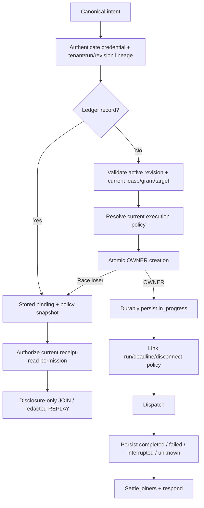

# Phase 02: Invocation Ledger, Dispatch Ordering, Cancellation & Recovery

## Overview
Implement the Main serialization boundary that guarantees one OWNER per deduplication binding, JOIN/REPLAY before current live-target checks, exact new-execution authorization, durable terminal receipts, cancellation propagation, and fail-closed crash recovery.

## Requirements

### Functional
- Create a dedicated Main-owned `InvocationLedger`; do not overload run/turn `ReceiptStore` or audit `EventStore`.
- Persist invocation binding, Main `invocationId`, originating `requestId`, immutable authority/policy snapshots and digests, state, sanitized result/error/evidence, referenced artifact IDs, and timestamps under configured `dataRoot`.
- Split `AttachmentRegistry.validateAttachment()` into credential/lineage authentication, historical revision resolution, current receipt-read authorization, and live execution authority validation.
- Preserve immutable authority revisions when target/lease/grant/host binding changes. Mutation issues a new revision; it never edits an old revision in place.
- Remove volatile `invocationNonces`; atomic `claimOrObserve` owns deduplication.
- Existing record path: before lookup, authenticate the presented attachment credential against exact `(attachmentId, projectId, workspaceId, runId, attemptId, authorityRevision)` lineage without requiring a live execution lease. Do not reveal record existence on lineage mismatch. For a matching record, verify capability/params and recorded policy digest, intersect current receipt-read permission with recorded visibility, then JOIN or REPLAY without current execution target/generation/lease checks and without dispatch.
- Missing record path: require the revision to be active; validate current attempt/PID/backend/lease/workspace/runtime/grant/target and current execution policy; only then atomically create the OWNER record with its policy version/digest, durably persist `in_progress`, and dispatch. A stale handle cannot claim.
- Execution expiry/inactive attempt state denies new OWNER work but does not alone erase retained receipt-read eligibility. Explicit security revocation denies both. Current receipt-read permission/grant downgrade may redact or deny historical disclosure.
- Startup recovery converts durable `claiming`/`in_progress` records to `interrupted`; same-key requests return ambiguity and never auto-reexecute.
- Master bridge token remains valid for control-plane/session management only. Browser, terminal, eval, workflow, and diagnostic execution requires attachment intent and the canonical transport path.
- Replace reusable master-token embedding in `/`, `/mobile`, and `/remote` HTML with a short-lived, single-purpose pairing/session credential issued through authenticated setup; `/api/remote-info`, `/api/qr`, and WebSocket execution retain their existing authentication gates.
- Main links run cancellation, deadline, and catalogue disconnect policy into one internal `AbortSignal`. A JOINER disconnect never aborts an OWNER; an effectful OWNER is not aborted merely because its response subscriber disconnects.
- Treat `browser.wait` and `terminal.wait` as ordinary ledger-owned read capabilities: one OWNER per binding, in-process JOIN for duplicates, terminal receipt convergence, and no blind retry after timeout/abort. A JOINER disconnect detaches only that subscriber; the OWNER aborts on disconnect only when catalogue policy permits and no subscribers remain.
- Artifact references in receipts are disclosure metadata, not bearer authority. Historical replay and later `artifact.read` both re-evaluate exact lineage and current receipt-read permission without re-running the producer.
- Persist and rehydrate the minimal historical attachment verifier/hash, exact lineage/revision history, receipt-read classification and explicit security-revocation state needed to authenticate retained receipts after restart. Terminal attempt state becomes historical/inactive execution state, not implicit security revocation.
- Require authentication for `/api/lan-ips` as well as `/api/remote-info` and `/api/qr`; no discovery route returns LAN addresses, connection URLs or QR data with wildcard unauthenticated access.
- Make the mobile/remote pairing design end-to-end: authenticated setup issues a short-lived single-purpose credential, the HTML client exchanges it for attachment credentials plus the current revision, executable RPCs use canonical capability dispatch, and expiry/replay/revocation fail closed. Scope terminal stream broadcasts to authorized attachment/session subscribers.

### Non-functional
- `claimOrObserve` is atomic inside one Main-owned serialization boundary.
- OWNER and terminal records are durable before dispatch/response respectively, using partitioned append-only asynchronous persistence with bounded hot indexes and measured compaction/retention.
- In-memory joiners, hot-data caches, and indexes have explicit count/byte bounds and are released on every terminal, abort, recovery, and shutdown path.
- Sensitive results are sanitized before persistence; ledger files inherit existing data-root access controls.

## Architecture

## Related Code Files
### Create
- `src/main/session/invocation-ledger.ts`
- `test/main/invocation-ledger.test.ts`
- `test/main/historical-authority-replay.test.ts`

### Modify
- `src/main/run/attachment-registry.ts`
- `src/main/run/run-service.ts`
- `src/main/tools/capability-transport.ts`
- `src/main/tools/capability-catalogue.ts`
- `src/main/control-plane/control-plane-runtime.ts`
- `src/main/bridge/bridge-server.ts`
- `src/main/bridge/mobile-remote-html.ts`
- `src/main/mcp/mcp-server.ts`
- `src/main/workflow/workflow-engine.ts`
- `src/main/session/run-recovery.ts`
- `src/main/agent/codex-execution-backend.ts`
- `test/main/bridge-attachment-dispatch.test.ts`
- `test/main/mobile-remote.test.ts`
- `test/main/run-lifecycle.test.ts`
- `test/main/workflow-engine.test.ts`

### Delete
- None.

## Implementation Steps
1. Implement partitioned ledger replay/rehydration, deterministic keying, atomic claim, in-process deferred JOIN, terminal persistence, bounded hot indexes/cache, measured compaction/retention, and explicit shutdown handling.
2. Refactor `AttachmentRegistry` into credential/lineage authentication, historical revision resolution, current receipt-read authorization, and live execution authority resolution. Persist a secret verifier—not the secret—plus immutable historical lineage/revisions and explicit security-revocation state; rehydrate it before ledger replay. Attempt completion/expiry denies execution without overwriting the record as security-revoked.
3. Rebuild `CapabilityTransportAdapter.dispatch` around canonical ordering: authenticate exact attachment tenant/run/revision lineage before lookup; use recorded policy plus current receipt-read permission for disclosure-only existing records; resolve and validate current execution authority/policy before atomically creating a missing OWNER record.
4. Wire one ledger and one historical attachment-verifier store through `ControlPlaneRuntime` startup recovery before MCP, Bridge, workflows and artifact disclosure become available.
5. Remove Bridge and MCP pre-dispatch target mutation/fallback. Target changes are capabilities that produce a newly issued revision for subsequent calls.
6. Restrict master-token methods to management. Authenticate LAN/remote/QR discovery routes. Route executable aliases through attachment dispatch or reject them with `ATTACHMENT_REQUIRED`.
7. Implement the complete mobile/remote pairing handshake and client migration; remove embedded master credentials, enforce credential TTL/single use/revocation, and authorize terminal event subscriptions per attachment/session.
8. Link owner cancellation/deadline/disconnect policy without letting a JOINER cancel the OWNER; settle every waiter from the persisted terminal/ambiguous receipt.
9. Rehydrate runs, historical attachment verifiers/revisions and ledger records in dependency order; convert orphaned claims, clear/settle volatile joiners, and prove interrupted records cannot be joined as live or auto-reexecuted.
10. Add race, binding-collision, lost-response, lease-expiry, completed-attempt replay, restart authentication, grant-downgrade, security-revocation, discovery-route auth, navigation, cancellation, pairing-token, terminal broadcast-isolation, storage-bound and bypass tests.

## Test Matrix
| Scenario | Expected result |
|---|---|
| Two identical concurrent calls | One OWNER/invocation ID; second JOINs; side effect count is 1. |
| Same key, different params/capability/revision | Typed binding collision; no dispatch. |
| Completed click response lost, navigation advances | Same authenticated lineage with receipt-read permission receives the cached terminal receipt; no `TARGET_STALE`; click count remains 1. |
| Execution lease expires after completion | Exact authenticated tenant/run/revision lineage may disclose the retained receipt if current receipt-read permission allows; no new OWNER allowed. |
| Correct secret with wrong project/workspace/run/attempt/revision | Uniform lineage denial; no receipt existence, state, or payload disclosed; no dispatch. |
| Current receipt-read permission reduces visibility | Historical result is redacted/status-only or denied; never re-executed. |
| Revision/attachment security-revoked | Receipt disclosure and new execution both denied without a receipt-existence signal. |
| Main crashes during in-progress action | Rehydrate as `interrupted`; same key returns ambiguity; no automatic execution. |
| Master-token direct action/terminal/eval | `ATTACHMENT_REQUIRED` or policy denial; management methods still work. |
| Mobile HTML fetched without pairing | No reusable master token in response; execution remains unavailable. |
| JOINER disconnects | OWNER continues according to owner/run/deadline policy; no leaked waiter. |
| Duplicate browser/terminal wait | One OWNER owns observers/listeners/timers; JOINers receive the same terminal receipt; cleanup occurs once. |
| Historical receipt exposes artifact ID | ID alone grants nothing; later read repeats exact-lineage/current-receipt-read authorization and returns uniform not-found on denial. |
| Main restarts before historical replay | Persisted verifier and immutable revision lineage authenticate the original secret after rehydration; no active lease is fabricated. |
| Completed attempt is replayed | Execution is inactive but not security-revoked; current receipt-read policy controls disclosure. |
| Unauthenticated LAN discovery request | Uniform authentication denial; no IP, URL, port or QR topology disclosure. |
| Paired mobile clients observe terminal streams | Each receives only authorized attachment/session events; master-token clients cannot execute or subscribe globally. |
| Ledger exceeds hot index/partition threshold | Compaction/eviction remains bounded without dropping retained records or blocking dispatch beyond measured budget. |

## Success Criteria
- [ ] Exactly one OWNER exists under a forced duplicate race.
- [ ] JOIN/REPLAY authenticates exact attachment tenant/run/attempt/revision lineage before lookup, authorizes disclosure through current receipt-read permission, and never dispatches.
- [ ] Missing records require active revision and complete current lease/grant/target/policy validation before atomic OWNER creation; stale handles cannot claim.
- [ ] Terminal receipts are durable before response and survive process restart.
- [ ] Interrupted/unknown records never silently reexecute.
- [ ] Master-token capability bypasses and mobile HTML token disclosure are eliminated without mislabeling authenticated API routes.
- [ ] Ledger storage, hot indexes, joiners, and cancellation/recovery paths remain bounded with zero leaked processes or waiters.
- [ ] Browser/terminal wait OWNER/JOIN, subscriber disconnect, timeout, abort and shutdown paths release every observer/listener/timer exactly once.
- [ ] Historical attachment authentication survives restart, terminal attempt state is distinct from explicit security revocation, and plaintext reusable secrets are absent from persistence.
- [ ] LAN/remote/QR discovery is authenticated; mobile pairing produces usable attachment/revision state; terminal broadcasts are subscription-scoped.

## Risk Assessment
| Risk | Signal | Pre-decided response |
|---|---|---|
| Durable append acknowledges claim too early | Crash test executes the same effect twice | Persist the OWNER record before dispatch; if measured latency misses budget, change storage strategy rather than weakening durability. |
| Historical lookup crosses tenant/run lineage | Wrong project/workspace/run/attempt/revision learns record existence or data | Authenticate exact lineage before lookup and normalize mismatch/denial responses; block release. |
| Current receipt-read permission is ignored | Downgraded grant receives old full result | Intersect current permission with recorded visibility; deny or redact fail-closed without dispatch. |
| In-memory JOIN cannot survive restart | Restart sees old `in_progress` as live | Return persisted `interrupted`; never pretend to JOIN a missing owner. |
| Disconnect aborts side effect after commit | Receipt becomes unknown after mutation | Catalogue owns disconnect behavior; persist conservative ambiguity and require inspection, never retry same key. |
| Ledger growth harms Main | Heap/file size or event-loop delay exceeds gate | Partition, bound hot indexes, compact asynchronously, and coordinate retention with receipt-referenced artifacts. |
