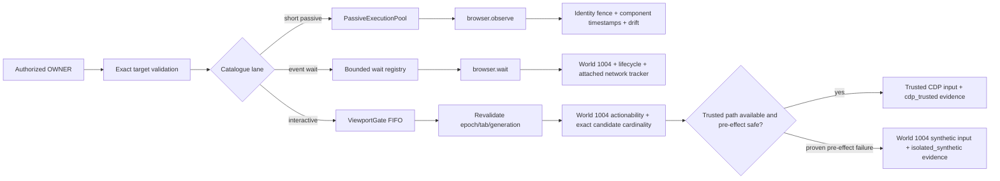

# Phase 03: Exact Browser Target, Coherent Observation, Deterministic Wait & Action Kernel

## Overview
Apply the authority/ledger contract to the actual browser kernel: no adapter-owned retargeting, exact generation checks for new OWNER calls, truthful identity-coherent multi-modal observation, bounded deterministic waits, post-queue revalidation, centralized actionability, bounded passive work, serialized interactive input, Main-owned semantic refs, ambiguity-safe World 1004 resolution, and observable trusted-CDP-first/isolated-synthetic execution.

## Requirements

### Functional
- Remove MCP/Bridge mutation of `authContext.browserTarget` and automatic active/automation-tab fallback for target-bound calls.
- Keep tab lifecycle capabilities (`open/list/switch/close/set-automation-target`) explicitly target-agnostic in catalogue policy; successful binding changes issue and return a new authority revision.
- Treat navigate, reload, document-generation advance, tab switch/close, and workflow steps that change browser binding as revision transitions. The browser operation result must include the stable completed `documentGeneration`; `AttachmentRegistry.updateAttachmentTab` requires it and never queries a live delegate fallback. Multi-step workflows must consume the replacement revision before the next target-bound child intent.
- Preserve `TARGET_MISMATCH` for an explicit tab inconsistent with authority and `TARGET_STALE` for missing/advanced browser epoch or document generation.
- For target-bound OWNER execution, validate exact browser target before claim and again after `ViewportGate` acquisition immediately before the first interactive side effect.
- Catalogue scheduler classification is authoritative. `workflow.execute` holds no child lane. Short passive capture/evaluation uses `PassiveExecutionPool`; long event-driven `browser.wait` installs through a bounded dedicated wait registry so its idle lifetime does not consume the 4-per-tab/16-global observation slots. Interactive cursor/input/drag/navigation/keyboard actions (`browser.click`, `browser.type`, `browser.keyboard-press`, `browser_press_key`, `antifan_keyboard_press`, `browser.send-keyboard-press`) use `ViewportGate` with `requiresBrowserTarget: true` and `lane: 'viewport-gate'`, eliminating unbounded targetless dispatch.
- Keep short passive work at 4 per tab/16 global. The wait registry also caps at 4 per tab/16 global with 5 s default/30 s maximum deadline; overload fails immediately without installing listeners. Interactive FIFO uses a monotonic preemption epoch plus timeout/acknowledgement/poison safety and an idempotent release token so every acquired owner advances the queue at most once on all post-acquisition failures.
- Main owns monotonic refs and keeps at most two immutable published generations per exact target, subject to the existing 10,000 process-descriptor and 5-minute ceilings; oldest generation evicts first. Epoch/document navigation invalidates all generations, but concurrent observation cannot delete a named prior generation before bounded eviction.
- Resolve semantic refs in World 1004 using the exact recorded traversal path first, confined to its recorded document/shadow/frame boundary chain; never fall back from a boundary-local ID lookup to global `document.getElementById`. Even an exact traversal candidate must equal every populated terminal fingerprint field (`tag`, `role`, `type`, `id`, `name`, `classHint`) before actionability. If terminal traversal no longer resolves, enumerate only within the same resolved boundary root across its open-shadow/same-origin-frame descendants, inspecting at most 500 elements or 50 ms, whichever occurs first. Zero exact matches returns `REF_NOT_FOUND`; one proceeds; more than one or exhausted uniqueness budget returns `REF_AMBIGUOUS` with bounded count/truncation metadata and no DOM content or input.
- Preserve current input-tier semantics inside the already authorized exact target: click/hover attempt trusted CDP first unless explicitly synthetic; type uses trusted CDP only when requested; isolated World 1004 synthetic execution remains the supported fallback. Fallback is automatic only when the trusted attempt proves zero input events were emitted. Track dispatch stage for every trusted event. If mouse-down may have been emitted and release fails, attempt one bounded best-effort `mouseReleased` cleanup, persist `unknown` with cleanup evidence, and set `fallbackNeeded: false`; never cross tiers. Every executed action reports `executionTier` and bounded fallback evidence.
- Add canonical `browser.observe` in `PassiveExecutionPool`: at most four requested components, 5 s default/30 s maximum deadline, DOM 512 KiB, screenshot 8 MiB, semantic snapshot 150 descriptors/128 KiB. Capture timestamps/sequence/drift and fail `TARGET_STALE` across document identity.
- Add canonical `browser.wait` for selector/ref state, document loaded, URL match, first-party network idle and bounded DOM stability. Raw JavaScript predicates remain separate eval-risk calls. Use World 1004 `MutationObserver`/rAF, WebContents lifecycle events and `FirstPartyNetworkTracker.awaitQuiescence(signal)` before bounded polling fallback; expose no public event bus.
- Centralize pre-action actionability in World 1004: attached frame/node, visible non-zero geometry, enabled/editable state, scroll alignment, two-frame geometry stability, pointer-event/hit-test reception, and a final generation check. On failure return typed evidence and emit zero trusted or synthetic input events.
- An ordinary pre-action actionability failure releases the viewport lock through one idempotent `finally` path. Post-acquisition poison/revalidation/actionability/callback errors cannot invoke the release token twice, change the human-preemption epoch, or drain more than the current owner. Every next queued owner must reacquire, revalidate exact target/generation, and rerun actionability before any CDP event.
- Keep observation payloads byte-bounded. Stage oversized DOM/screenshots through `ArtifactStore` rather than returning unbounded raw content.
- Attach `FirstPartyNetworkTracker` once for every live target during tab/pane lifecycle setup—not only reload—and detach it on target destruction or debugger detach. `awaitQuiescence(signal)` first proves live instrumentation, rejects detached/unavailable state as `TARGET_STALE`, and on abort returns `WAIT_ABORTED` only after idempotently clearing debounce/ceiling timers and removing target/signal listeners. It never infers idle from an absent tracker.
- Propagate the policy-scoped `AuthenticatedCapabilityContext.signal` through every browser capability handler and `BrowserControlPort` action/wait method into `ViewportGate`/wait-registry ownership. For `abort-immediate`, a cancelled queued action is removed before acquisition and cannot execute later as an orphan; dispatched `drain-and-persist` work is not signalled.
- Browser scheduler/action owners consume `CapabilityExecutionControl`. Queueing, target revalidation, semantic resolution and actionability remain `not-started`; immediately before the first trusted CDP event or isolated synthetic dispatch they mark process-local `effect-started`; after acknowledged event/input completion they mark `effect-committed`. Cancellation cleanup acknowledges `no-effect` only when no input dispatch began and every queued/listener resource is removed; partial mouse or uncertain synthetic dispatch acknowledges `effect-possible`/`effect-committed`, never `no-effect`.

### Non-functional
- Zero storefront DOM attributes/global variables after snapshot/action flows.
- Scheduler cancellation releases or poisons locks deterministically; no concurrent interactive owners for one viewport.
- Latency thresholds are verified by Phase 05 against the actual Electron surface, not asserted from unit timing alone.

## Architecture


## Related Code Files
### Modify
- `src/main/tools/browser-control-port.ts`
- `src/main/tools/browser-capabilities.ts`
- `src/main/browser/tab-automation-host.ts`
- `src/main/browser/semantic-ref-registry.ts`
- `src/main/browser/semantic-ref-executor.ts`
- `src/main/browser/native-tab-host.ts`
- `src/main/browser/first-party-network-tracker.ts`
- `src/main/browser/tab-diagnostics.ts`
- `src/main/browser/tab-devtools-host.ts`
- `src/main/workflow/workflow-engine.ts`
- `src/main/mcp/mcp-server.ts`
- `src/main/bridge/bridge-server.ts`
- `test/unit/tools/viewport-gate.test.ts`
- `test/unit/tools/passive-execution-pool.test.ts`
- `test/main/semantic-ref-registry.test.ts`
- `test/integration/semantic-ref-integration.test.ts`
- `test/e2e/semantic-ref-trusted-cdp.test.ts`
- `test/integration/concurrency-multi-project.test.ts`
- `test/main/cdp-native-input-actionability.test.ts`

### Create
- `test/main/browser-owner-target-revalidation.test.ts`
- `test/main/browser-observe-coherence.test.ts`
- `test/main/browser-wait-deterministic.test.ts`
### Delete
- None.

## Deep-Mode File Inventory
| Action | Paths | Protected responsibility | Dependency |
|---|---|---|---|
| Modify | `src/main/tools/browser-control-port.ts`, `src/main/tools/browser-capabilities.ts` | Exact target resolution, lane routing, passive pool, colocated bounded wait registry | Phases 01-02 policy/OWNER context |
| Modify | `src/main/browser/tab-automation-host.ts`, `src/main/browser/semantic-ref-executor.ts`, `src/main/browser/semantic-ref-types.ts` | Exact traversal then ambiguity-safe fingerprint candidate set, centralized actionability, two-tier dispatch, and execution-tier evidence | Exact target and ViewportGate |
| Modify | `src/main/browser/semantic-ref-registry.ts` | Two immutable published generations per target with bounded eviction | Observe contract |
| Modify | `src/main/browser/native-tab-host.ts`, `src/main/browser/first-party-network-tracker.ts` | Tracker attach/detach lifecycle and abort-aware quiescence | Live target lifecycle |
| Modify | `src/main/browser/tab-diagnostics.ts`, `src/main/browser/tab-devtools-host.ts` | Bounded observation components without duplicate owners | Observe assembly |
| Modify | `src/main/workflow/workflow-engine.ts`, `src/main/tools/capability-transport.ts`, MCP/Bridge adapters | Ledger-owned child intents, canonical wait delegation and replacement revision propagation | Phases 01-02 transport |
| Create/Modify | Browser target, observe, wait, semantic ref, scheduler, actionability, concurrency tests listed above | Cross-document fencing, capacity, preemption, fingerprint ambiguity, pre-effect-only tier fallback | Production browser kernel |

## Function and Interface Checklist
- [ ] `BrowserControlPort.resolveTargetTab` rejects explicit mismatch/stale generation and never creates/falls back to an active tab for target-bound work.
- [ ] `PassiveExecutionPool` remains 4/tab and 16/global for short passive work.
- [ ] The bounded wait registry is independent (4/tab, 16/global), Main-owned and colocated with the browser kernel; no transport-local wait service exists.
- [ ] `SemanticRefRegistry.beginCollection`, publication, resolution and eviction preserve two immutable generations without accidental deletion.
- [ ] `FirstPartyNetworkTracker.attach`, live-attachment proof, `awaitQuiescence(signal)`, debugger-detach handling and target teardown cover every live target and clean timers/listeners exactly once.
- [ ] `ViewportGate` preemption epoch invalidates active and queued handover work deterministically; its release token is idempotent across poison and callback failures.
- [ ] `TabAutomationHost` preserves trusted-CDP-first/isolated-synthetic behavior, reports the actual tier, permits fallback only after proven zero-event trusted failure, and performs bounded mouse-release cleanup plus durable ambiguity after partial trusted dispatch.
- [ ] `WorkflowEngine` replaces `browser.wait_for_selector` polling with a ledger-owned canonical `browser.wait` child intent; all executable children use the transport interface and consume replacement revisions.
- [ ] `AttachmentRegistry.updateAttachmentTab` requires operation-proven `documentGeneration`; no dynamic generation lookup fallback remains on transition.
- [ ] Actionability failure releases the gate once; the next queued owner performs fresh target/actionability validation and cannot inherit stale assumptions.
- [ ] Every browser capability and control-port action forwards the Main-owned policy-scoped signal to its exact scheduler owner; aborted queued `abort-immediate` work is removed and never dispatches, while dispatched `drain-and-persist` work remains unsignalled.
- [ ] Browser input/wait owners report execution-control effect boundaries and post-cleanup acknowledgement without allowing renderer/params to forge cancellation identity or stage.

## Dependency Map
```text
ledger OWNER + exact authority revision
  -> catalogue lane
     -> short passive -> browser.observe -> semantic history/artifacts
     -> event wait -> bounded wait registry -> World 1004/lifecycle/network tracker
     -> interactive -> ViewportGate -> post-queue target check -> actionability/candidate cardinality -> trusted CDP or proven-pre-effect isolated fallback
  -> durable receipt/unknown state through Phase 02
```

### Deep-Mode Verification Gate
- Run target-race, wait-capacity, tracker lifecycle, ref-retention, ambiguity, preemption-handover and input-tier tests before browser integration and live Electron E2E.


## Implementation Steps
1. Move target-agnostic/target-bound, scheduler-lane, actionability and deadline classification into catalogue policy; verify every browser capability is classified and raw-JS predicates cannot enter a read wait.
2. Remove adapter-level active-tab fallback and in-place target mutation. Make open/switch/close/set-target/navigate/reload responses return a stable completed target generation, require that generation in revision rotation, and remove `updateAttachmentTab` live-delegate fallback.
3. Harden exact resolution. Keep short passive work at 4/tab and 16/global; implement wait registry at 4/tab and 16/global, 5 s default/30 s max, immediate typed overload, independent cancellation ownership, and no workflow-parent lane reservation.
4. Implement bounded `browser.observe` with at most four components and the frozen per-component/deadline limits. Publish snapshots atomically into the two-generation target history and oldest-first global descriptor/age eviction.
5. Attach `FirstPartyNetworkTracker` during every tab/pane target lifecycle and remove state on debugger detach. Implement `browser.wait` using World 1004 observers, WebContents lifecycle and abort-aware `awaitQuiescence(signal)` with one cleanup path; unattached network state fails `TARGET_STALE`. Replace workflow-local selector polling with a transport child intent that owns its ledger receipt.
6. Add a monotonic preemption epoch and idempotent release token to `ViewportGate`; human preemption invalidates active and queued handover work before post-acquisition target revalidation, and every browser handler/port method forwards the authenticated abort signal.
7. Add target revalidation inside lock scope before any effect; never overwrite expected generation with live state.
8. Harden World 1004 resolution and actionability: boundary-confined exact traversal with terminal full-fingerprint validation, then same-boundary zero/one/many enumeration capped at 500 candidates or 50 ms; attached/visible/enabled/editable/stable/hit-test checks; final generation validation; and bounded evidence. Preserve trusted-CDP-first/isolated-synthetic behavior, but integrate execution control at the actual dispatch boundary, track every trusted event, attach `executionTier`, allow fallback only before any event emission, acknowledge no-effect only after cleanup, attempt bounded mouse-release cleanup after partial click dispatch, and persist ambiguity without crossing tiers. Replace first-match fingerprint loops and add `REF_AMBIGUOUS`; do not delete the validated synthetic fallback.
9. Propagate revisions and verify wait capacity, tracker attach/detach/abort, semantic snapshot concurrency/eviction, FIFO/preemption/poison recovery, actionability cleanup, and live Electron CDP behavior.

## Test Matrix
| Scenario | Expected result |
|---|---|
| Explicit wrong/live tab on target-bound call | `TARGET_MISMATCH`; no retarget and no side effect. |
| Authorized tab navigates while click waits | Post-lock `TARGET_STALE`; pre-effect failed receipt; no click. |
| Navigate/reload completes in workflow | Response returns a replacement revision; the next target-bound step consumes it. |
| Target-agnostic tab open/switch | Executes under explicit allowlist and returns a new revision for later target-bound work. |
| 8 passive requests on one tab | At most 4 execute concurrently; other tabs/global cap remain bounded. |
| Human preempts active agent action | Action aborts/acknowledges; lock settles or poisons fail-closed within its bounded reset policy. |
| Snapshot then ref click | World ID 1004 both times; current ref resolves; trusted CDP event observed. |
| Exact traversal escapes its frame/shadow boundary, terminal fingerprint changed, or two buttons share the full fingerprint | No global fallback; `REF_NOT_FOUND`/`REF_AMBIGUOUS` with bounded metadata; zero CDP/synthetic input and caller must observe again. |
| Candidate scan reaches 500 nodes or 50 ms before uniqueness is proven | `REF_AMBIGUOUS` with truncation metadata; event-loop work ends and no input is emitted. |
| CDP debugger attach fails before input | Existing auto-tier click/hover uses isolated World 1004 fallback and reports `isolated_synthetic` plus bounded reason. |
| Mouse press may dispatch but release fails | One bounded best-effort release cleanup; `fallbackNeeded: false`; durable `unknown`; no synthetic action. |
| CDP succeeds | Response reports `cdp_trusted`; no synthetic dispatch occurs. |
| Navigation after snapshot | Old ref fails `REF_STALE`; no selector/coordinate retarget outside declared contract. |
| Observation crosses reload/navigation | `TARGET_STALE`; no mixed-document bundle is returned. |
| Same-document mutation occurs between DOM and screenshot | Operation remains truthful: component timestamps/sequence and drift metadata expose the capture window; no atomicity claim. |
| Selector appears dynamically | World 1004 observer resolves promptly; listener, timer and passive-pool slot are released once. |
| First-party request remains in flight | Existing network tracker holds `network_idle`; quiescence debounce resolves without a second tracker. |
| Wait deadline/abort/navigation fires | Typed terminal receipt; all observers/listeners/timers detach; JOINers converge through the ledger. |
| Button is zero-sized, moving, disabled, readonly or occluded | Typed actionability failure with bounded diagnostics; zero trusted or synthetic input events. |
| Actionability fails while another owner is queued | Current lock releases once; queued owner reacquires and revalidates target/actionability; no inherited coordinates or input event. |
| Cancellation fires before input dispatch vs. after mouse/synthetic dispatch begins | Pre-dispatch cleanup may acknowledge `no-effect`; any begun or uncertain dispatch reports effect-possible/committed and transport settles `unknown`, with no cross-tier fallback. |
| Poison is detected immediately after gate acquisition | Release token advances FIFO once; at most one queued owner runs and must revalidate. |
| Parent aborts while browser action is queued | Queue entry is removed immediately; no late orphan action. |
| Binding transition omits completed document generation | Revision rotation is rejected; Main never samples a racing live generation as authority. |
| Four long waits plus an observation | Wait registry remains bounded independently; observation obtains a passive slot and completes. |
| Network wait on navigated/split/already-open tab | Tracker is attached or returns typed unavailable; it never reports idle from missing instrumentation. |
| Main aborts network wait | Debounce/ceiling timers and target listener detach immediately and once. |
| Human input occurs during FIFO handover | Preemption epoch invalidates the queued owner before any action. |
| Observe begins while action holds prior ref | Prior immutable snapshot remains resolvable within bounded retention; eviction yields explicit `REF_STALE`, not accidental deletion. |

## Success Criteria
- [ ] No target-bound MCP/Bridge path silently chooses or mutates a tab.
- [ ] New OWNER browser calls enforce exact pre-claim and post-queue generation checks.
- [ ] Every binding/navigation transition returns and propagates a new opaque revision.
- [ ] Passive/interactive lanes satisfy catalogue classification, concurrency, poison-recovery, and cleanup tests.
- [ ] Storefront instrumentation leaves no persistent attributes/globals, semantic refs remain Main-owned and ambiguity-safe, and interactive effects report the actual trusted/synthetic tier without post-effect cross-tier replay.
- [ ] Browser unit, integration, workflow, and Electron E2E scenarios pass.
- [ ] `browser.observe` enforces cross-document identity and returns bounded per-component timestamps/sequences plus explicit drift metadata instead of false same-document atomicity.
- [ ] `browser.wait` reuses canonical internal event/network primitives, is deadline/cancellation bounded, and leaks no observer/listener/timer.
- [ ] Every interactive effect passes centralized semantic-resolution, actionability and final-generation gates before either selected input tier dispatches.
- [ ] Long event waits cannot exhaust short-passive observation capacity; both schedulers enforce independent count/deadline bounds.
- [ ] Network tracking covers every live target and abort/close removes CDP listeners, state listeners and timers exactly once.
- [ ] Semantic fallback cannot escape recorded boundaries, validates exact-path terminal fingerprints, and terminates at the frozen 500-node/50-ms uniqueness budget.
- [ ] Viewport preemption cannot be lost at queue handover, and bounded semantic snapshot generations survive concurrent collection until deterministic eviction/navigation.
- [ ] Browser execution-control markers align with real CDP/synthetic dispatch boundaries; no-effect acknowledgement is impossible after any input may have been emitted.

## Risk Assessment
| Risk | Signal | Pre-decided response |
|---|---|---|
| Existing clients relied on active-tab guessing | Target-bound aliases fail without exact revision/target | Update bootstrap/session target selection; do not restore fallback. |
| Post-queue validation is omitted by one action | Navigation-race test dispatches CDP input | Centralize revalidation in the interactive execution wrapper and block release. |
| Target-agnostic policy is too broad | Read/action capability executes without target | Catalogue completeness test uses an explicit allowlist; default is target-required. |
| Same-document animation produces component skew | Capture timestamps/sequence show non-zero drift window | Report bounded drift truthfully; callers may wait for stability and observe again, never loop internally without a deadline. |
| Actionability rejects valid complex controls | Live fixture shows hit-test/geometry false negative | Correct the centralized World 1004 predicate and fixture; never bypass it in an individual action. |
| Fingerprint fallback matches more than one live node | Current first-match behavior could target the wrong control | Enumerate exact populated-field matches, return `REF_AMBIGUOUS`, emit no input, and require a new snapshot/ref. |
| Trusted CDP fails after partial dispatch | Synthetic fallback could duplicate or complete an uncertain action | Permit fallback only with proven zero input; otherwise persist `unknown` and stop. |
| Network-idle logic diverges from Theme QA | Different inflight counts for same target | Reuse `FirstPartyNetworkTracker`; delete duplicate tracking logic.
