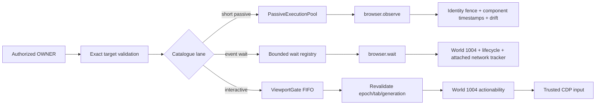

# Phase 03: Exact Browser Target, Coherent Observation, Deterministic Wait & Action Kernel

## Overview
Apply the authority/ledger contract to the actual browser kernel: no adapter-owned retargeting, exact generation checks for new OWNER calls, truthful identity-coherent multi-modal observation, bounded deterministic waits, post-queue revalidation, centralized actionability, bounded passive work, serialized interactive input, Main-owned semantic refs, World 1004 isolation, and trusted CDP actions.

## Requirements

### Functional
- Remove MCP/Bridge mutation of `authContext.browserTarget` and automatic active/automation-tab fallback for target-bound calls.
- Keep tab lifecycle capabilities (`open/list/switch/close/set-automation-target`) explicitly target-agnostic in catalogue policy; successful binding changes issue and return a new authority revision.
- Treat navigate, reload, document-generation advance, tab switch/close, and workflow steps that change browser binding as revision transitions. Multi-step workflows must consume the replacement revision before the next target-bound step.
- Preserve `TARGET_MISMATCH` for an explicit tab inconsistent with authority and `TARGET_STALE` for missing/advanced browser epoch or document generation.
- For target-bound OWNER execution, validate exact browser target before claim and again after `ViewportGate` acquisition immediately before the first interactive side effect.
- Catalogue scheduler classification is authoritative. Short passive capture/evaluation uses `PassiveExecutionPool`; long event-driven `browser.wait` installs through a bounded dedicated wait registry so its idle lifetime does not consume the 4-per-tab/16-global observation slots. Interactive cursor/input/drag/navigation uses `ViewportGate` where viewport ownership is required.
- Keep short passive work at 4 per tab/16 global. The wait registry also caps at 4 per tab/16 global with 5 s default/30 s maximum deadline; overload fails immediately without installing listeners. Interactive FIFO uses a monotonic preemption epoch plus timeout/acknowledgement/poison safety.
- Main owns monotonic refs and keeps at most two immutable published generations per exact target, subject to the existing 10,000 process-descriptor and 5-minute ceilings; oldest generation evicts first. Epoch/document navigation invalidates all generations, but concurrent observation cannot delete a named prior generation before bounded eviction.
- Resolve semantic refs to current bounds in World 1004 and dispatch genuine CDP mouse/keyboard events only; no `webContents.executeJavaScript` or storefront-world synthetic events may perform an interactive effect.
- Preserve input-tier fallback semantics only inside an already authorized target: semantic ref first when provided, then explicit coordinates/selectors according to capability contract. Never fall back to a different tab or generation.
- Add canonical `browser.observe` in `PassiveExecutionPool`: at most four requested components, 5 s default/30 s maximum deadline, DOM 512 KiB, screenshot 8 MiB, semantic snapshot 150 descriptors/128 KiB. Capture timestamps/sequence/drift and fail `TARGET_STALE` across document identity.
- Add canonical `browser.wait` for selector/ref state, document loaded, URL match, first-party network idle and bounded DOM stability. Raw JavaScript predicates remain separate eval-risk calls. Use World 1004 `MutationObserver`/rAF, WebContents lifecycle events and `FirstPartyNetworkTracker.awaitQuiescence()` before bounded polling fallback; expose no public event bus.
- Centralize pre-action actionability in World 1004: attached frame/node, visible non-zero geometry, enabled/editable state, scroll alignment, two-frame geometry stability, pointer-event/hit-test reception, and a final generation check. On failure return typed evidence and emit zero trusted CDP events.
- Keep observation payloads byte-bounded. Stage oversized DOM/screenshots through `ArtifactStore` rather than returning unbounded raw content.
- Attach `FirstPartyNetworkTracker` once for every live target during tab/pane lifecycle setup—not only reload—and detach it on target destruction. Add `AbortSignal` to quiescence waits with idempotent timer/listener cleanup; unattached tracker state is an error, never synthetic idle.

### Non-functional
- Zero storefront DOM attributes/global variables after snapshot/action flows.
- Scheduler cancellation releases or poisons locks deterministically; no concurrent interactive owners for one viewport.
- Latency thresholds are verified by Phase 05 against the actual Electron surface, not asserted from unit timing alone.

## Architecture

## Related Code Files
### Modify
- `src/main/tools/browser-control-port.ts`
- `src/main/tools/browser-capabilities.ts`
- `src/main/browser/tab-automation-host.ts`
- `src/main/browser/semantic-ref-registry.ts`
- `src/main/browser/semantic-ref-executor.ts`
- `src/main/browser/native-tab-host.ts`
- `src/main/browser/first-party-network-tracker.ts`
- `src/main/browser/tab-diagnostics.ts`
- `src/main/browser/tab-devtools-host.ts`
- `src/main/workflow/workflow-engine.ts`
- `src/main/mcp/mcp-server.ts`
- `src/main/bridge/bridge-server.ts`
- `test/unit/tools/viewport-gate.test.ts`
- `test/unit/tools/passive-execution-pool.test.ts`
- `test/main/semantic-ref-registry.test.ts`
- `test/integration/semantic-ref-integration.test.ts`
- `test/e2e/semantic-ref-trusted-cdp.test.ts`
- `test/integration/concurrency-multi-project.test.ts`
- `test/main/cdp-native-input-actionability.test.ts`

### Create
- `test/main/browser-owner-target-revalidation.test.ts`
- `test/main/browser-observe-coherence.test.ts`
- `test/main/browser-wait-deterministic.test.ts`
### Delete
- None.

## Implementation Steps
1. Move target-agnostic/target-bound, scheduler-lane, actionability and deadline classification into catalogue policy; verify every browser capability is classified and raw-JS predicates cannot enter a read wait.
2. Remove adapter-level active-tab fallback and in-place target mutation. Make open/switch/close/set-target/navigate/reload responses rotate and return authority revisions explicitly.
3. Harden exact resolution. Keep short passive work at 4/tab and 16/global; implement wait registry at 4/tab and 16/global, 5 s default/30 s max, immediate typed overload, and independent cancellation ownership.
4. Implement bounded `browser.observe` with at most four components and the frozen per-component/deadline limits. Publish snapshots atomically into the two-generation target history and oldest-first global descriptor/age eviction.
5. Attach `FirstPartyNetworkTracker` during every tab/pane target lifecycle. Implement `browser.wait` using World 1004 observers, WebContents lifecycle and abort-aware `awaitQuiescence()`; unattached network state fails closed. Replace workflow-local selector polling.
6. Add a monotonic preemption epoch to `ViewportGate`; human preemption invalidates active and queued handover work before post-acquisition target revalidation.
7. Add target revalidation inside lock scope before any effect; never overwrite expected generation with live state.
8. Harden World 1004 actionability for attached/visible/enabled/editable/stable/hit-test checks, then repeat generation validation before genuine CDP dispatch. Never synthesize storefront events. Update `test/main/cdp-native-input-actionability.test.ts` test 8 so debugger attach failure fails closed with zero synthetic/storefront input rather than expecting synthetic fallback.
9. Propagate revisions and verify wait capacity, tracker attach/detach/abort, semantic snapshot concurrency/eviction, FIFO/preemption/poison recovery, actionability cleanup, and live Electron CDP behavior.

## Test Matrix
| Scenario | Expected result |
|---|---|
| Explicit wrong/live tab on target-bound call | `TARGET_MISMATCH`; no retarget and no side effect. |
| Authorized tab navigates while click waits | Post-lock `TARGET_STALE`; pre-effect failed receipt; no click. |
| Navigate/reload completes in workflow | Response returns a replacement revision; the next target-bound step consumes it. |
| Target-agnostic tab open/switch | Executes under explicit allowlist and returns a new revision for later target-bound work. |
| 8 passive requests on one tab | At most 4 execute concurrently; other tabs/global cap remain bounded. |
| Human preempts active agent action | Action aborts/acknowledges; lock settles or poisons fail-closed within its bounded reset policy. |
| Snapshot then ref click | World ID 1004 both times; current ref resolves; trusted CDP event observed. |
| Navigation after snapshot | Old ref fails `REF_STALE`; no selector/coordinate retarget outside declared contract. |
| Observation crosses reload/navigation | `TARGET_STALE`; no mixed-document bundle is returned. |
| Same-document mutation occurs between DOM and screenshot | Operation remains truthful: component timestamps/sequence and drift metadata expose the capture window; no atomicity claim. |
| Selector appears dynamically | World 1004 observer resolves promptly; listener, timer and passive-pool slot are released once. |
| First-party request remains in flight | Existing network tracker holds `network_idle`; quiescence debounce resolves without a second tracker. |
| Wait deadline/abort/navigation fires | Typed terminal receipt; all observers/listeners/timers detach; JOINers converge through the ledger. |
| Button is zero-sized, moving, disabled, readonly or occluded | Typed actionability failure with bounded diagnostics; zero CDP input events. |
| Four long waits plus an observation | Wait registry remains bounded independently; observation obtains a passive slot and completes. |
| Network wait on navigated/split/already-open tab | Tracker is attached or returns typed unavailable; it never reports idle from missing instrumentation. |
| Main aborts network wait | Debounce/ceiling timers and target listener detach immediately and once. |
| Human input occurs during FIFO handover | Preemption epoch invalidates the queued owner before any action. |
| Observe begins while action holds prior ref | Prior immutable snapshot remains resolvable within bounded retention; eviction yields explicit `REF_STALE`, not accidental deletion. |

## Success Criteria
- [ ] No target-bound MCP/Bridge path silently chooses or mutates a tab.
- [ ] New OWNER browser calls enforce exact pre-claim and post-queue generation checks.
- [ ] Every binding/navigation transition returns and propagates a new opaque revision.
- [ ] Passive/interactive lanes satisfy catalogue classification, concurrency, poison-recovery, and cleanup tests.
- [ ] Storefront DOM remains mutation-free, semantic refs remain Main-owned, and interactive effects use trusted CDP only.
- [ ] Browser unit, integration, workflow, and Electron E2E scenarios pass.
- [ ] `browser.observe` enforces cross-document identity and returns bounded per-component timestamps/sequences plus explicit drift metadata instead of false same-document atomicity.
- [ ] `browser.wait` reuses canonical internal event/network primitives, is deadline/cancellation bounded, and leaks no observer/listener/timer.
- [ ] Every interactive effect passes the centralized actionability and final-generation gates before trusted CDP dispatch.
- [ ] Long event waits cannot exhaust short-passive observation capacity; both schedulers enforce independent count/deadline bounds.
- [ ] Network tracking covers every live target and abort/close removes CDP listeners, state listeners and timers exactly once.
- [ ] Viewport preemption cannot be lost at queue handover, and bounded semantic snapshot generations survive concurrent collection until deterministic eviction/navigation.

## Risk Assessment
| Risk | Signal | Pre-decided response |
|---|---|---|
| Existing clients relied on active-tab guessing | Target-bound aliases fail without exact revision/target | Update bootstrap/session target selection; do not restore fallback. |
| Post-queue validation is omitted by one action | Navigation-race test dispatches CDP input | Centralize revalidation in the interactive execution wrapper and block release. |
| Target-agnostic policy is too broad | Read/action capability executes without target | Catalogue completeness test uses an explicit allowlist; default is target-required. |
| Same-document animation produces component skew | Capture timestamps/sequence show non-zero drift window | Report bounded drift truthfully; callers may wait for stability and observe again, never loop internally without a deadline. |
| Actionability rejects valid complex controls | Live fixture shows hit-test/geometry false negative | Correct the centralized World 1004 predicate and fixture; never bypass it in an individual action. |
| Network-idle logic diverges from Theme QA | Different inflight counts for same target | Reuse `FirstPartyNetworkTracker`; delete duplicate tracking logic.
