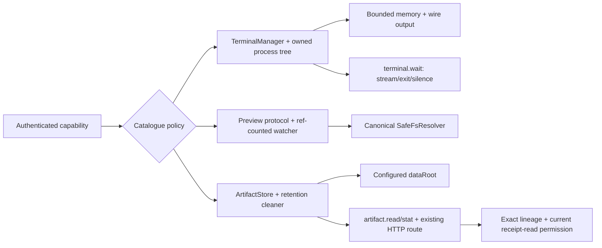

# Phase 04: Bounded Terminal, Preview & Content-Addressed Artifact Services

## Overview
Harden infrastructure capabilities under the same Main authority and effect policy: bounded terminal transport and process ownership, reference-counted preview watchers, canonical path containment, and content-addressed artifact quotas/retention without blocking the Main event loop.

## Requirements

### Functional
- Route terminal input/session mutations through attachment-authenticated catalogue dispatch; master-token transport alone cannot execute them. Register every shipped terminal operation with complete effect/access policy.
- Preserve per-session terminal history and wire budgets using `safeSliceTailJsonBounded`; determine current effective constants from source and tests, then centralize them rather than duplicating magic values.
- On session close/cancel/timeout, keep the owned session registered until its process tree settles, terminate only that tree (`taskkill /PID <pid> /T /F` on Windows; owned process group on POSIX), then remove session/listeners/buffers. Never use a broad process pattern.
- Source search finds no `TerminalSessionPort` callsites outside its definition. Delete the dead file directly and prove zero references; do not invent a migration layer.
- Fix `PreviewWatcherPool` ownership: one watcher per canonical capsule/root, one subscription token per retain call even when callback identity repeats, disposal only at `refCount === 0`, and cancellation of pending debounce timers on final release or runtime clear.
- Enforce workspace containment using canonical/real paths and per-segment symlink checks in `SafeFsResolver`; file serving and watching share the same resolver.
- Preserve content-addressed artifact integrity, quotas, sanitization, atomic writes, bounded reads and retention. Persist/rehydrate a crash-consistent metadata index with immutable project/workspace/run/attempt lineage, MIME, size, hash and path. Within each run namespace, delete a blob only when no retained metadata/receipt reference in that run requires it.
- Do not hard-code `E:\Work\.antifan-data` in reusable services; consume the configured `dataRoot` already established by runtime/storage setup.
- Implement catalogue-owned `terminal.wait` for output match, process exit and silence using `(sessionGeneration, afterSeq)`. `TerminalManager` stores structured exit/close state before emitting events, checks already-terminal state before listener registration, and rejects cursors from a prior PTY incarnation. Every terminal path detaches exactly once.
- Register authenticated `artifact.read`/`artifact.stat` capabilities and harden `/api/artifacts/:id` to use one authorization service that resolves durable metadata, authorizes exact lineage/current receipt-read permission before disk bytes, and returns a uniform no-oracle response.
- Bound artifact reads to 1 MiB chunks with continuation metadata; preserve MIME framing and verify SHA-256 on cache and disk reads. Index/file updates are crash-consistent; missing/corrupt index entries fail closed.
- Remove `buildFallbackThemeQaResult` and make canonical `ThemeQaWorkflow` registration mandatory for `theme.qa_validate`; aliases delegate to it, and explicit `tabId` must equal the authorized target.

### Non-functional
- No synchronous large-file or directory sweep on latency-sensitive Main dispatch paths.
- Zero orphaned PTY/backend processes and zero leaked watcher/timer/listener handles after teardown.
- Quota and retention values have one owner and focused boundary tests.
- Path errors fail closed without revealing content outside the authorized workspace.

## Architecture

## Related Code Files
### Modify
- `src/main/browser/terminal-manager.ts`
- `src/main/server/preview-watcher-pool.ts`
- `src/main/server/preview-protocol-handler.ts`
- `src/main/server/safe-fs-resolver.ts`
- `src/main/tools/artifact-store.ts`
- `src/main/tools/artifact-retention-cleaner.ts`
- `src/main/qa/theme-qa-workflow.ts` only if alias plumbing requires no-op-free delegation changes
- `src/main/control-plane/control-plane-runtime.ts`
- `src/main/bridge/bridge-server.ts`
- `test/main/safe-slice-tail.test.ts`
- `test/main/terminal-process-tree-and-links.test.ts`
- `test/main/terminal-write-pipeline.test.ts`
- `test/main/preview-protocol-and-watcher.test.ts`
- `test/main/artifact-retention-cleaner.test.ts`
- `test/main/security-policy.test.ts`

### Delete
- `src/main/tools/terminal-session-port.ts` after a final zero-callsites proof

### Create
- `src/main/tools/terminal-capabilities.ts`
- `src/main/tools/artifact-capabilities.ts`
- `test/main/terminal-capabilities.test.ts`
- `test/main/artifact-capabilities.test.ts`

## Implementation Steps
1. Create terminal capabilities with complete policy and route executable bridge aliases through authenticated transport.
2. Add `sessionGeneration`, structured exit code/time and closed state/events to `TerminalManager`. Implement terminal wait with terminal fast path before listener registration, generation-scoped sequence cursor, bounded matcher/silence/deadline and one cleanup path.
3. Reconfirm and delete dead `TerminalSessionPort`. Centralize wire limits; keep session ownership in draining state until its owned process tree settles.
4. Fix preview subscription tokens/refcounts, repeated-callback retains, debounce cancellation, canonical keys, shutdown disposal and shared safe resolution.
5. Create artifact capabilities around a durable, crash-consistent metadata index. Add project/workspace lineage to staging inputs, rehydrate before serving, and coordinate retained receipt references with cleanup.
6. Route catalogue/HTTP through one service: durable metadata lookup and exact-lineage/current-receipt-read authorization precede byte access and yield uniform denial. Retention consults run-local metadata/receipt references before deleting `root/<runId>/<sha>.artifact`; no cross-run blob-sharing abstraction is introduced.
7. Implement 1 MiB chunks, UTF-8/base64 framing and SHA-256 verification for cache and disk. Verify index/file partial-write recovery and sanitization.
8. Delete fallback QA execution, require canonical `ThemeQaWorkflow`, enforce explicit tab equality, and stop all artifact/watcher timers on drain/shutdown.

## Test Matrix
| Scenario | Expected result |
|---|---|
| Oversized ANSI/multibyte terminal output | Encoded JSON stays within budget and remains parseable. |
| Terminal with child process closes | Owned tree exits; session/listeners/buffers removed; unrelated process untouched. |
| Two tabs retain one capsule preview | One underlying watcher; both receive debounced events; dispose after final release. |
| Symlink/junction escapes workspace | `OUTSIDE_WORKSPACE`; no file bytes or watcher created. |
| Artifact exceeds item/run quota | Typed error; no partial file/index entry. |
| Startup/periodic retention exceeds age/size | Deterministic purge order; active retained artifacts preserved; timer disposed on shutdown. |
| Terminal output appears after sequence cursor | `terminal.wait` resolves once with bounded tail/sequence; duplicate caller JOINs the same OWNER receipt. |
| Terminal exits or closes before match | Deterministic exit/session-closed result; every listener/timer is removed. |
| Terminal wait deadline or Main abort fires | Typed timeout/abort receipt; no leaked waiter or timer. |
| Valid artifact read exceeds 1 MiB | Bounded chunk plus offset/total/hasMore; MIME-correct UTF-8 or base64 framing. |
| Wrong lineage, downgraded permission, missing artifact | Uniform not-found/denial shape; no existence, owner or retention oracle. |
| Artifact bytes are modified on disk | SHA-256 mismatch fails `INTEGRITY_COMPROMISED`; no corrupt bytes disclosed. |
| `qa.run` compatibility alias is called | Delegates to `theme.qa_validate` and the same `ThemeQaWorkflow`/output contract. |
| Wait observes already-exited PTY | Fast path returns stored exit code/time for the current generation; no listener or timeout is installed. |
| Wait cursor belongs to restarted session ID | Generation mismatch returns typed stale-session error; output from different PTY incarnations is never conflated. |
| Same callback retained twice | Independent subscription tokens/refcounts preserve watcher until both releases; clear cancels debounce timer. |
| Main restarts with retained artifact receipt | Durable index rehydrates lineage/path/hash; authorized paged read succeeds without directory guessing. |
| Same run stages identical content twice | Distinct metadata refs may share the run-local blob; cleanup preserves bytes until the last retained metadata/receipt reference expires. |
| Explicit QA tab differs from authority | `TARGET_MISMATCH`; fallback scanner does not exist and no scan executes. |

## Success Criteria
- [ ] Terminal mutations have no bridge-token-only execution path and every operation has catalogue policy.
- [ ] Terminal output stays byte-bounded and every owned process tree is reaped before session state detaches.
- [ ] `TerminalSessionPort` is removed with zero references.
- [ ] Preview watcher count returns to zero after last release/shutdown.
- [ ] Preview serving/watching cannot escape workspace through traversal, symlink, junction, or case tricks.
- [ ] Artifact quotas, integrity, current-access redaction, receipt reachability, retention, and lifecycle tests pass without hot-path blocking.
- [ ] `terminal.wait` supports match/exit/silence with sequence cursors, bounded deadlines/tails, ledger JOIN semantics and zero listener/timer leaks.
- [ ] Catalogue and HTTP artifact retrieval enforce identical exact-lineage/current-receipt-read policy, uniform no-oracle denial, 1 MiB pagination, MIME framing and hash-on-read integrity.
- [ ] `ThemeQaWorkflow` remains the sole QA engine; aliases do not fork behavior or schema.
- [ ] Terminal exit/close fast paths and session-generation cursors prevent missed events and cross-incarnation sequence ambiguity.
- [ ] Artifact metadata/index and receipt protections survive restart and partial-write recovery; authorization occurs before disk byte access.
- [ ] Run-local content-addressed cleanup is reference-aware; one metadata ref's expiry cannot break another retained reference to the same run blob.
- [ ] Preview subscriptions handle repeated callback identities and cancel pending debounce work at release/clear.
- [ ] Fallback QA execution is deleted; canonical workflow registration and exact target equality are mandatory.

## Risk Assessment
| Risk | Signal | Pre-decided response |
|---|---|---|
| Process cleanup kills unrelated user work | Test observes non-owned PID termination | Bind and validate process ownership; block release and never use broad kill patterns. |
| Watcher keys alias different roots | Cross-workspace event leakage | Key by canonical project/workspace/root identity and add isolation tests. |
| Retention deletes a receipt-referenced artifact too early | Historical replay returns missing artifact | Align artifact reachability/retention with recorded receipt policy; replan retention contract before freeze. |
| Pattern matching creates ReDoS or unbounded buffering | Event-loop delay or matcher reads full transcript | Restrict accepted patterns/input windows, match only bounded incremental data/tail, and fail invalid patterns before listener registration. |
| HTTP artifact route bypasses catalogue authorization | Route returns bytes denied by `artifact.read` | Share one authorization/read service and parity-test both surfaces; block release on divergence. |
