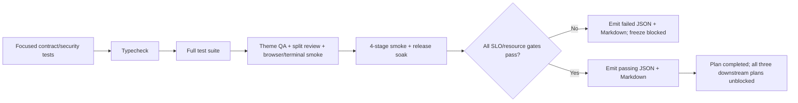

# Phase 05: Production Freeze Verification, SLOs & Evidence

## Overview
Certify the authority-first runtime with one repeatable command plus focused security, duplicate-race, recovery, live Electron, performance, and endurance evidence. The freeze is declared only from observed metrics and zero unresolved failures.

## Requirements

### Functional
- Add `verify:freeze` to `package.json` using correct Electron runner semantics. The certification runner performs exactly one compile, then invokes compiled tests and underlying smoke/benchmark scripts directly; no child alias may trigger another compile.
- Add a certification runner that executes every required stage, records start/end/exit/timeout/cleanup state in `try/finally`, and emits JSON plus Markdown even when a stage fails.
- Run focused tests for public-schema/adapter injection, authority contracts, catalogue effect/access policy completeness, invocation ledger races/bounds, historical replay and authorization downgrade, Bridge/MCP/mobile-token bypass rejection, browser revision chaining/target revalidation, cancellation, terminal cleanup, preview containment, and artifact retention.
- Add focused tests for MCP SDK `extra.requestId` retry identity versus distinct identical calls, the explicit non-ordinal grant scope matrix, proven-absent initial claim failure versus ambiguous/dispatch-marker durability failure with concurrent JOINers, awaited asynchronous attachment/revision persistence, concrete attachment/invocation recovery paths and corrupt tails, materialized run/attempt recovery order, transport-owned top-level workflow OWNER creation, public workflow-param/runtime-option isolation, progress-sink failure/detach, deterministic child `(Main parent invocation, step, attempt, sequence)` identity, exhaustive step/capability policy mapping, no nested workflow lane, per-child revision cursor updates, read/idempotent-only retry, policy-scoped cancellation propagation, explicit response states, bounded `abort-immediate` forced-unknown settlement, and `drain-and-persist` deadline ambiguity.
- Add transport settlement tests for the current catch-all defect and the frozen policy matrix: pre-dispatch abort, `abort-immediate` no-effect acknowledgement, effect-possible/committed acknowledgement, missing/mismatched acknowledgement, grace expiry, normal result winning before forced settlement, `drain-and-persist` natural success/failure, absolute drain timeout, last-subscriber disconnect, JOINER disconnect, shutdown/recovery, and late overwrite rejection. Assert that abort-shaped text/codes alone never select a ledger state.
- Add crash-at-checkpoint recovery tests. Seed durable claim/explicit `pre_dispatch`, `dispatch_started`, and legacy stage-less `in_progress` frames; inject process loss again after process-local `effect-started` and `effect-committed` while the last durable dispatch frame remains `dispatch_started`. Assert `interrupted` only for claim/pre-dispatch; every dispatched/later/legacy case becomes `unknown`, is persisted before readiness, replays without dispatch, and never enters workflow retry/continuation.
- Add focused tests for identity-coherent `browser.observe`, event-driven bounded `browser.wait`, ledger-owned `terminal.wait`, centralized actionability, authenticated artifact route/capability parity, and `theme.qa_validate` single-engine ownership.
- Observation tests distinguish cross-document identity from same-document drift: epoch/generation/URL changes fail closed; same-document timing differences are exposed by component timestamps/sequence/drift metadata rather than rejected as impossible atomicity violations.
- Wait tests cover separate wait/passive capacity, fast path, dynamic mutation/lifecycle/network resolution, tracker live-attachment/detach and abort-aware `awaitQuiescence(signal)`, OWNER/JOIN convergence, timeout/navigation/session-close cleanup, and zero residual observers/listeners/timers.
- Actionability/input tests cover detached nodes/frames, boundary escape, exact-path terminal fingerprint drift, zero geometry, animation instability, occlusion/pointer-events, disabled/readonly controls, navigation during auto-wait, duplicate or budget-truncated fingerprint candidates, trusted pre-effect failure, partial mouse dispatch cleanup, possible post-dispatch failure, signal cancellation while queued, double-release poison path, and human preemption during queue handover. Pre-action/ambiguity failures emit zero input; executed actions report exactly one `cdp_trusted` or `isolated_synthetic` tier.
- Artifact tests cover exact lineage, durable index restart/partial-write recovery, retained attachment verifier restart, receipt-read downgrade, no oracle before disk read, pagination, MIME framing, cache/disk corruption, and retention reachability across capability and HTTP.
- Add transition-generation and viewport-failure tests: binding rotation rejects missing operation-proven generation; actionability failure releases once and forces queued target/actionability revalidation without changing the human-preemption epoch.
- Add terminal shutdown `allSettled` ownership, preview debounce cancellation, management-receipted workflow report generation, and sanitized-hash-first unique run-local artifact quota tests, including duplicate-content staging near quota.
- Run `npm run typecheck` and the complete existing test suite after all callers migrate.
- Run live Theme QA, split-review, and real-soak scripts through their existing package/runner entry points.
- Extend `scripts/smoke-real-soak.cjs` and/or `scripts/benchmark-real-soak-8h.cjs` only where current evidence does not measure required process, memory, latency, queue, watcher, joiner, and cleanup contracts.
- Emit machine-readable JSON and a concise Markdown certification report under this plan's `reports/` directory. Reports include exact commands, commit, environment, thresholds, raw sample/artifact links, computed metrics, exit codes, failure stage, and cleanup result.
- Parameterize every smoke/soak evidence destination through an explicit runner argument or `ANTIFAN_REPORT_DIR`; no certification stage writes only to another historical plan directory.
- Transition phase/plan status only after all mandatory gates pass; update all three downstream blocked plans through the live plan CLI rather than hand-editing completion flags.

### Required authority scenarios
- Public MCP schemas omit internal authority; trusted session adapters inject the current revision and preserve retry identity.
- Concurrent identical side-effect calls execute once and share one `invocationId`.
- Same key with changed params/capability/revision is rejected before dispatch.
- Lost completed response replays after navigation and execution-lease expiry only for the exact authenticated attachment tenant/run/attempt/revision lineage with current receipt-read permission; no re-execution occurs.
- Wrong project/workspace/run/attempt/revision receives no receipt-existence signal, even with another valid attachment credential.
- Current receipt-read downgrade redacts/denies historical disclosure; explicit security revocation denies receipt access. A stale revision with no existing record cannot create an OWNER.
- Master-token direct browser/terminal/eval/workflow calls and unpaired mobile HTML execution are denied while management calls remain functional.
- Interactive target generation change during queue wait fails before side effect.
- Navigate/reload/workflow target changes rotate and propagate authority revisions.
- `browser.observe` never mixes documents and never claims same-document DOM/PNG atomicity; all requested components carry capture metadata and bounded payload/artifact references.
- Catalogue policy tests verify every capability against the freeze schema. Assert valid effect, risk, target requirement, scheduler lane, visibility, timeout, and cancellation behavior. Ensure `browser.keyboard-press` and its aliases (`browser_press_key`, `antifan_keyboard_press`, `browser.send-keyboard-press`) require `requiresBrowserTarget: true` and `lane: 'viewport-gate'`. Reject `ignore-disconnect` or unregistered aliases.
- Lane tests verify `viewport-gate` serializes interactive actions (including `browser_press_key`) per tab while passive pool allows concurrency up to 4. Assert priority preemption interrupts passive observation when interactive action arrives.
- Duplicate browser/terminal waits share one OWNER and terminal receipt; cancellation, timeout and teardown release every resource exactly once.
- `qa.run` compatibility, when present, invokes the same `ThemeQaWorkflow` and result schema as `theme.qa_validate`.
- Historical attachment authentication and artifact lookup remain functional after restart without persisted plaintext secrets; terminal attempt completion is distinct from security revocation.
- LAN/remote/QR routes require authentication; mobile pairing enables canonical execution; terminal broadcasts remain attachment/session scoped.
- Event waits do not starve passive observation, network tracking never treats unattached as idle, semantic observations do not prematurely invalidate live refs, and human preemption survives lock handover.
- Workflow policy tests prove `ControlPlaneRuntime.executeWorkflow` enters through `dispatchIntent(intent, runtimeOptions)`; public workflow params cannot provide credentials/revision/parent/signal/progress/dispatcher; runtime hooks are absent from digests/persistence; progress failure/detach does not cancel the OWNER; every step type maps to its actual capability set; only all-`read`/`idempotent-write` mappings retry; management `report.generate` is ledger-owned/single-attempt; the Main workflow invocation is the parent; no child lane is reserved; and child sequence keys increase deterministically.
- Cancellation tests prove execution control is absent from serialized intent/digests and present on `AuthenticatedCapabilityContext`. `abort-immediate` propagates its policy-scoped signal through browser queue ownership and applies bounded acknowledgement; dispatched `drain-and-persist` keeps the signal unsignalled and waits for natural durable settlement by the absolute deadline. The workflow cannot return/retry/continue before the resulting explicit monotonic durable child state; late settlement is ignored and `unknown`/`interrupted` overrides `continueOnError`.
- Cancellation policy tests prove OWNER cancellation and subscriber disconnect are orthogonal. `abort-immediate` signals then awaits matching post-cleanup acknowledgement; `drain-and-persist` does not signal after dispatch and awaits natural durable settlement within the absolute deadline. `failed` is impossible while cancellation is active or effect disposition is ambiguous; `interrupted`/`unknown` block retry and continuation.
- Crash recovery tests prove `dispatch_started` is durable before executor invocation; failure to persist it prevents dispatch. Restart never trusts process-local effect state: explicit pre-dispatch becomes `interrupted`, while dispatched/later/legacy unknown-stage becomes `unknown`.
- Durability fault-injection tests distinguish initial claim append failure from `dispatch_started` append failure and simulate ambiguous write completion. Assert eviction only after a reconciled tail proves the initial frame absent; all other cases keep the `.jsonl` partition file in place on disk, retain an in-memory non-dispatchable poison, reject every waiter, gate new OWNER claims for the attachment partition, permit verified historical terminal replay, invoke no executor, and reopen only after successful restart recovery replays the intact file and persists the stage-derived terminal receipt. Assert that `.quarantine-*` file renaming occurs only for checksum-invalid or unparseable corruption.
- Semantic/input tests prove boundary-confined exact traversal, terminal full populated-field matching even on an exact path, 500-node/50-ms candidate budget, `REF_AMBIGUOUS` when uniqueness is unproven, trusted-CDP-first behavior, pre-effect-only isolated fallback, best-effort mouse release after partial dispatch, and no cross-tier replay after a possibly emitted event.

### Performance/resource gates
- Preserve the accepted release thresholds unless live baseline evidence forces an explicit plan decision:
  - active working-set OLS slope `<= 0.35 MB/min`;
  - renderer slope `<= 0.15 MB/min`;
  - peak total Electron process memory `<= 1.6 GB` on the target workstation profile;
  - tab switch `p50 <= 12 ms`, `p95 <= 18 ms`, max `<= 35 ms` after warmup;
  - viewport lock acquisition `p50 <= 5 ms`, `p95 <= 10 ms`;
  - semantic snapshot of the defined 5,000-node fixture `p95 <= 35 ms`; stale-ref candidate resolution inspects at most 500 nodes or 50 ms and emits no input when uniqueness remains unproven;
  - `browser.observe` fixed fixture `p95 <= 250 ms`, deadline 5 s default/30 s max, at most four components, DOM `<= 512 KiB`, screenshot `<= 8 MiB`, semantic descriptors `<= 150` and serialized semantic payload `<= 128 KiB`;
  - wait/actionability test fixtures leave `0` observers/listeners/timers and emit `0` trusted/synthetic input events on pre-action or semantic-ambiguity failure;
  - artifact read chunk size `<= 1,048,576` bytes and integrity/authorization parity failures: `0`;
  - long wait capacity exhaustion and passive observation starvation failures: `0`;
  - lost ViewportGate handover preemptions: `0`;
  - retained verifier/artifact-index restart and partial-write recovery failures: `0`;
  - wait registry active counts `<= 4/tab` and `<= 16/global`; semantic history `<= 2` generations/target and existing 10,000 process-descriptor/5-minute ceilings;
  - orphaned owned Electron/backend/PTY processes after teardown: `0`.
- A threshold failure blocks the freeze. Record measured evidence and optimize/replan; do not raise limits inside the verification phase.

## Architecture


## Related Code Files
### Modify
- `package.json`
- `scripts/smoke-real-soak.cjs`
- `scripts/benchmark-real-soak-8h.cjs` only if required metrics are absent
- `scripts/smoke-theme-qa-gate.cjs`
- `scripts/smoke-split-review.cjs`
- `plans/260901-1011-antifan-core-runtime-freeze/plan.md` via plan status tooling after verification

### Verification inputs (read-only)
These existing or prior-phase-owned tests are consumed unchanged by this phase; any required contract amendment returns to the owning implementation phase:
- `test/main/cdp-native-input-actionability.test.ts`
- `test/main/browser-observe-coherence.test.ts`
- `test/main/browser-wait-deterministic.test.ts`
- `test/main/terminal-capabilities.test.ts`
- `test/main/artifact-capabilities.test.ts`

### Create
- `plans/260901-1011-antifan-core-runtime-freeze/reports/core-runtime-freeze-report.json`
- `plans/260901-1011-antifan-core-runtime-freeze/reports/core-runtime-freeze-report.md`
- `scripts/verify-core-runtime-freeze.cjs`
- `test/main/theme-qa-workflow.test.ts`

### Delete
- None.

## Deep-Mode File Inventory
| Action | Paths | Protected responsibility | Dependency |
|---|---|---|---|
| Create | `scripts/verify-core-runtime-freeze.cjs` | Compile-once stage runner, timeout/cleanup control, always-emitted certification evidence | Phases 01-04 green |
| Modify | `package.json` | Stable `verify:freeze` entrypoint without redundant compile cycles | Runner complete |
| Modify | `scripts/smoke-real-soak.cjs`, `scripts/benchmark-real-soak-8h.cjs`, `scripts/smoke-theme-qa-gate.cjs`, `scripts/smoke-split-review.cjs` | Parameterized `ANTIFAN_REPORT_DIR`, raw samples, cleanup evidence | Existing live runners |
| Create | `test/main/theme-qa-workflow.test.ts` | Canonical QA owner coverage after fallback removal | Phase 04 |
| Consume | Prior-phase focused tests listed above | Authority, ledger, browser, terminal, artifact gates | Phases 01-04 |
| Generate | `reports/core-runtime-freeze-report.json`, `reports/core-runtime-freeze-report.md` | Machine-readable and concise human evidence on pass or failure | Every runner stage |

## Function and Interface Checklist
- [ ] Certification runner compiles once, runs focused/full/live/performance/soak stages directly, and records command/start/end/exit/timeout/cleanup.
- [ ] `ANTIFAN_REPORT_DIR` reaches every child smoke/benchmark; missing or misplaced child evidence fails certification.
- [ ] Report emission lives in `finally` and succeeds for induced stage failure as well as pass.
- [ ] Memory-slope calculation uses real timestamped samples, normalized minutes/MB, and guards insufficient/zero-variance input.
- [ ] Electron/process-tree teardown snapshots owned PIDs before/after and reports zero orphans without killing unrelated processes.
- [ ] Phase status and downstream unblock use live `ak plan` status operations only after all measured gates pass.

## Dependency Map
```text
Phase 01 contract/injection tests
  + Phase 02 race/replay/recovery tests
  + Phase 03 observe/wait/actionability tests
  + Phase 04 terminal/preview/artifact/QA tests
  -> one compile
  -> focused tests -> typecheck -> full suite
  -> live Theme QA/split/browser/terminal smokes
  -> performance + bounded soak -> teardown audit
  -> JSON/Markdown evidence -> freeze or fail closed
```

## Test Matrix
| Scenario | Expected result |
|---|---|
| One focused stage is deliberately failed | Runner exits nonzero but still writes complete failed JSON/Markdown evidence and cleanup state. |
| Child script omits or writes outside selected report directory | Certification fails; missing evidence is never inferred as pass. |
| Full suite and smokes run after compile | `.compiled` is not repeatedly cleaned/rebuilt between stages. |
| Soak leaves one owned process/watcher/waiter | Freeze blocked; exact owner/resource appears in report. |
| Adapter receives the same SDK request ID twice vs. a new ID with identical params | Same transport operation converges on one receipt; distinct call executes as a distinct operation. |
| Workflow child identity/retry/cancellation is exercised across multiple calls and attempts | Keys increase deterministically by sequence; only mapped read/idempotent effects retry; signal reaches authenticated context; `unknown`/`interrupted` prevents retries and later children. |
| Workflow child rotates authority then later fails | Shared revision cursor advances before error handling; retry/continuation uses the replacement and no stale-authority cascade occurs. |
| `abort-immediate` child ignores cancellation grace or completes after forced settlement | Receipt becomes monotonic `unknown`; workflow stops and late completion cannot overwrite it. |
| Transport executor rejects after OWNER cancellation | Matching no-effect acknowledgement -> `interrupted`; possible/committed effect, mismatched/missing acknowledgement or grace expiry -> `unknown`; never catch-all `failed`. |
| `drain-and-persist` execution is cancelled by parent or loses its requester after dispatch | OWNER continues without signal and persists natural `completed`/ordinary `failed`; absolute deadline without settlement -> `unknown`; workflow waits for the receipt. |
| Final JOINER disconnects | `detach-and-continue` leaves OWNER running; `abort-when-unobserved` invokes only the `abort-immediate` contract. No waiter leak or duplicate settlement. |
| Process crashes before durable dispatch boundary vs. immediately/late after it | Explicit pre-dispatch -> `interrupted`; dispatch-started/effect-started/effect-committed/legacy stage-less -> `unknown`; every same-key call replays without execution. |
| Initial claim append fails with proven absent tail vs. `dispatch_started`/ambiguous append failure | Proven-absent initial claim is evicted after all waiters fail; every other case invokes no executor, keeps the `.jsonl` in place on disk, retains in-memory poison, rejects same-key and same-partition OWNER reclaim, allows verified historical replay, and restarts into `interrupted`/`unknown` from the last valid frame. |
| Caller puts attachment secret, revision, parent ID, signal, progress callback or child identity into workflow params | Public/internal schema rejects it; process-local authenticated transport context is the only source and no child executes. |
| Workflow progress subscriber throws or detaches | OWNER and child receipts continue by policy; no callback enters persisted evidence or changes terminal state. |
| Workflow parent dispatches a viewport child | Parent holds no viewport/passive/wait lane; child acquires once with no deadlock. |
| Binding response lacks completed generation or queued action follows failed actionability | Rotation rejects missing generation; queued owner revalidates and emits no inherited input. |
| Traversal is stale with duplicate fingerprint matches | `REF_AMBIGUOUS`; no input; new observation required. |
| Trusted debugger fails before vs. possibly after input dispatch | Pre-effect case falls back once and reports `isolated_synthetic`; uncertain case never crosses tiers and persists ambiguity. |
| Duplicate artifact content and multi-PTY shutdown hit boundary paths | Unique blob quota is correct; every kill settles and any failed owner blocks freeze. |
| All stages and thresholds pass | Reports contain raw samples, commit/environment, commands and zero secrets; plan may complete. |

### Deep-Mode Verification Gate
- Run the runner against both induced failure and clean pass paths. The separate 8-hour release soak remains explicit and mandatory for the final seal, not normal CI.


## Implementation Steps
1. Encode the five-tier matrix—focused security/contracts, integration, live Electron, performance, soak—with stable Windows paths.
2. Implement the certification runner with try/finally stage evidence and explicit report-directory propagation to every child script; any child writing elsewhere or missing evidence fails the gate.
3. Add `verify:freeze` without redundant compilation.
4. Run authority/replay/restart-verifier, SDK retry-identity/grant-scope, durability-failure/JOIN cleanup, asynchronous attachment durability, materialized run recovery, transport-owned workflow parent/public-param/runtime-option isolation, progress failure/detach, deterministic Main-parent child sequencing, exhaustive effect-policy retry classification, non-nested workflow scheduling, per-child revision cursor updates, explicit transport states, policy-aware cancellation settlement, discovery/mobile/broadcast isolation, observe/wait/actionability/boundary-confined semantic ambiguity/two-tier-input/partial-dispatch cleanup/preemption, transition-generation, terminal generation/exit/all-settled teardown, preview debounce teardown, sanitized-hash-first unique-blob quota/artifact index/authorization, ledger-owned report generation, QA single-owner, security and recovery tests. Include induced failures.
5. Run the cancellation policy matrix against the real transport catch path: orthogonal disconnect policy, typed cancellation identity, monotonic effect markers, matching post-cleanup acknowledgement, `abort-immediate` grace, `drain-and-persist` absolute deadline, ordinary failure classification, JOIN convergence, no retry/continuation, and late-settlement rejection.
6. Run crash-at-checkpoint recovery and append-fault tests: proven-absent initial claim failure, ambiguous initial failure, `dispatch_started` append failure, explicit pre-dispatch, durable dispatch-started, process loss after process-local effect-started/effect-committed with dispatch-started still the last durable frame, legacy stage-less in-progress, in-memory poison gating vs `.quarantine-*` corruption renaming, recovery-before-readiness, replay-only behavior, and zero automatic retries/executor calls.
7. Run typecheck/full suite.
8. Run actual Electron Theme QA, split-review, CDP/preemption, terminal process-tree and artifact restart/read smokes.
9. Measure tab switch, viewport lock, semantic snapshot, multi-modal observation, wait/passive capacity, artifact stage/read and cleanup with warmup/raw samples.
10. Run 4-stage and 8-hour soak with parameterized evidence output, per-process memory/latency and watcher/joiner/observer/wait-registry counts.
11. Emit reports on pass/failure; complete and unblock only when every gate is measured green.

## Verification Command Shape
The stable entrypoint is:
```text
npm run verify:freeze
```
`verify:freeze` invokes `scripts/verify-core-runtime-freeze.cjs`. The runner compiles once, then calls focused/full tests and underlying smoke scripts directly with one explicit report directory; it never chains npm smoke aliases that each recompile. The separate release-soak command remains explicit because its duration exceeds normal CI/smoke execution.

## Success Criteria
- [ ] All focused adapter, authority, race, exact-lineage/no-oracle replay, receipt-read downgrade, stale-handle claim denial, revocation, recovery, bypass, revision-chain, and target-revalidation scenarios pass.
- [ ] `npm run verify:freeze` exits 0 from a clean build state and emits evidence; an induced stage failure exits nonzero and still emits a failure report.
- [ ] Full suite passes with no skipped/softened tests introduced for the freeze.
- [ ] Live Electron Theme QA, split-review, browser/terminal, and soak gates exit 0.
- [ ] Every memory/latency/resource threshold is supported by raw captured samples and passes.
- [ ] Teardown/recovery audit finds zero owned orphan processes, leaked watchers, timers, joiners, poisoned locks, or unrecovered ledger poison state.
- [ ] Cross-document observation races fail closed while same-document capture skew is truthfully represented by timestamps/sequence/drift metadata.
- [ ] Browser/terminal wait fast/event/timeout/abort/JOIN paths and actionability failures leave zero resources/effects behind.
- [ ] Artifact capability/HTTP parity, no-oracle denial, pagination, MIME framing, integrity and retained-receipt reachability pass.
- [ ] `theme.qa_validate` remains the one canonical QA execution owner across aliases and smoke gates.
- [ ] Restart tests prove retained attachment authentication and artifact disclosure/index recovery; discovery/pairing/broadcast tests prove no topology or cross-session leakage.
- [ ] Separate wait/passive capacity, tracker lifecycle, semantic snapshot retention and handover preemption tests pass with zero starvation, false idle, accidental ref invalidation or dropped preemption.
- [ ] Frozen observe/wait/snapshot budgets pass boundary and overload tests; no Phase 05 threshold is invented after implementation.
- [ ] Every workflow step type and reachable child capability is covered by policy-completeness tests; no interactive/unclassified step retries and no child identity uses random/time fallback.
- [ ] Transport-owned workflow parent, runtime-option isolation, progress failure/detach, child scheduling, shared revision cursor, explicit child state, cancellation grace and late-settlement monotonicity tests pass without authority forgery, callback-driven cancellation, deadlock or stale-authority continuation.
- [ ] Boundary-confined semantic scans, exact-path fingerprint validation, candidate-budget cutoff, partial trusted-input cleanup, queued signal abort and idempotent gate release tests pass with zero wrong-target/orphan input.
- [ ] Workflow timeout/abort waits for durable settlement and stops on `unknown`/`interrupted` regardless of `continueOnError`.
- [ ] The existing unconditional abort/error-to-`failed` path is absent. Focused tests prove exact `completed`/`failed`/`interrupted`/`unknown` mapping for both OWNER cancellation policies and both subscriber disconnect policies.
- [ ] `interrupted`/`unknown` never enter workflow retry or `continueOnError`; replay is disclosure-only and a new operation cannot be synthesized automatically.
- [ ] Crash recovery tests prove exact stage mapping and dispatch-marker durability: only explicit pre-dispatch becomes `interrupted`; dispatched/later/legacy stage-less becomes `unknown`; no recovered ambiguous state can retry or execute.
- [ ] Durability fault tests prove eviction only for a proven-absent initial claim; failed dispatch-marker/ambiguous writes keep the partition file in place on disk and poison in-memory claims until successful restart recovery, with zero executor calls and zero reclaim.
- [ ] Browser, terminal, artifact, report, and process-effect owners mark their true irreversible boundary and cannot acknowledge no-effect after it is crossed.
- [ ] Semantic fallback cardinality and input-tier tests prove zero wrong-target input, truthful `executionTier`, pre-effect-only fallback, and no cross-tier replay after uncertain dispatch.
- [ ] Every smoke/soak child writes evidence under the certification report directory selected by the runner.
- [ ] JSON and Markdown reports contain reproducible evidence and no secrets/private payloads.
- [ ] Plan completion and all three downstream unblocks occur only after evidence is recorded.

## Risk Assessment
| Risk | Signal | Pre-decided response |
|---|---|---|
| Unit tests pass but actual Electron path is broken | Live smoke fails or never exercises renderer/Main IPC | Block freeze; fix the real entry point and rerun. |
| CI noise masks latency regression | High variance or throttling invalidates samples | Run on the target workstation profile with warmup and record environment; keep threshold unchanged. |
| Soak teardown leaves processes | Owned PID remains after grace period | Block freeze; fix ownership/teardown and rerun from a clean process table. |
| Report claims unmeasured SLO | Missing raw samples or command evidence | Mark as failed/unmeasured; never infer pass. |
| Coherence test demands impossible raster/DOM atomicity | Continuously mutating fixture can never pass | Test document identity fences and measured component drift; use bounded stability waits when required, never renderer-wide mutation locks. |
| New wait or artifact surface passes unit tests but bypasses canonical ownership | Different network counts, QA output or route authorization | Block freeze; reuse the existing tracker/workflow/authorization service and parity-test the public surfaces. |
