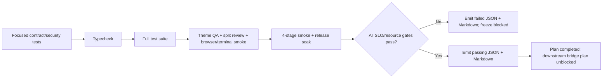

# Phase 05: Production Freeze Verification, SLOs & Evidence

## Overview
Certify the authority-first runtime with one repeatable command plus focused security, duplicate-race, recovery, live Electron, performance, and endurance evidence. The freeze is declared only from observed metrics and zero unresolved failures.

## Requirements

### Functional
- Add `verify:freeze` to `package.json` using existing scripts and correct Electron runner semantics. Avoid redundant compile stages where `npm test` already compiles.
- Add a certification runner that executes every required stage, records start/end/exit/timeout/cleanup state in `try/finally`, and emits JSON plus Markdown even when a stage fails.
- Run focused tests for public-schema/adapter injection, authority contracts, catalogue effect/access policy completeness, invocation ledger races/bounds, historical replay and authorization downgrade, Bridge/MCP/mobile-token bypass rejection, browser revision chaining/target revalidation, cancellation, terminal cleanup, preview containment, and artifact retention.
- Add focused tests for identity-coherent `browser.observe`, event-driven bounded `browser.wait`, ledger-owned `terminal.wait`, centralized actionability, authenticated artifact route/capability parity, and `theme.qa_validate` single-engine ownership.
- Observation tests distinguish cross-document identity from same-document drift: epoch/generation/URL changes fail closed; same-document timing differences are exposed by component timestamps/sequence/drift metadata rather than rejected as impossible atomicity violations.
- Wait tests cover separate wait/passive capacity, fast path, dynamic mutation/lifecycle/network resolution, tracker attach/detach and abort-aware `awaitQuiescence()`, OWNER/JOIN convergence, timeout/navigation/session-close cleanup, and zero residual observers/listeners/timers.
- Actionability tests cover detached nodes/frames, zero geometry, animation instability, occlusion/pointer-events, disabled/readonly controls, navigation during auto-wait, and human preemption during queue handover; every failure/preemption emits zero CDP input.
- Artifact tests cover exact lineage, durable index restart/partial-write recovery, retained attachment verifier restart, receipt-read downgrade, no oracle before disk read, pagination, MIME framing, cache/disk corruption, and retention reachability across capability and HTTP.
- Run `npm run typecheck` and the complete existing test suite after all callers migrate.
- Run live Theme QA, split-review, and real-soak scripts through their existing package/runner entry points.
- Extend `scripts/smoke-real-soak.cjs` and/or `scripts/benchmark-real-soak-8h.cjs` only where current evidence does not measure required process, memory, latency, queue, watcher, joiner, and cleanup contracts.
- Emit machine-readable JSON and a concise Markdown certification report under this plan's `reports/` directory. Reports include exact commands, commit, environment, thresholds, raw sample/artifact links, computed metrics, exit codes, failure stage, and cleanup result.
- Parameterize every smoke/soak evidence destination through an explicit runner argument or `ANTIFAN_REPORT_DIR`; no certification stage writes only to another historical plan directory.
- Transition phase/plan status only after all mandatory gates pass; update the one downstream blocked plan through the live plan CLI rather than hand-editing completion flags.

### Required authority scenarios
- Public MCP schemas omit internal authority; trusted session adapters inject the current revision and preserve retry identity.
- Concurrent identical side-effect calls execute once and share one `invocationId`.
- Same key with changed params/capability/revision is rejected before dispatch.
- Lost completed response replays after navigation and execution-lease expiry only for the exact authenticated attachment tenant/run/attempt/revision lineage with current receipt-read permission; no re-execution occurs.
- Wrong project/workspace/run/attempt/revision receives no receipt-existence signal, even with another valid attachment credential.
- Current receipt-read downgrade redacts/denies historical disclosure; explicit security revocation denies receipt access. A stale revision with no existing record cannot create an OWNER.
- Master-token direct browser/terminal/eval/workflow calls and unpaired mobile HTML execution are denied while management calls remain functional.
- Interactive target generation change during queue wait fails before side effect.
- Navigate/reload/workflow target changes rotate and propagate authority revisions.
- `browser.observe` never mixes documents and never claims same-document DOM/PNG atomicity; all requested components carry capture metadata and bounded payload/artifact references.
- Duplicate browser/terminal waits share one OWNER and terminal receipt; cancellation, timeout and teardown release every resource exactly once.
- `qa.run` compatibility, when present, invokes the same `ThemeQaWorkflow` and result schema as `theme.qa_validate`.
- Historical attachment authentication and artifact lookup remain functional after restart without persisted plaintext secrets; terminal attempt completion is distinct from security revocation.
- LAN/remote/QR routes require authentication; mobile pairing enables canonical execution; terminal broadcasts remain attachment/session scoped.
- Event waits do not starve passive observation, network tracking never treats unattached as idle, semantic observations do not prematurely invalidate live refs, and human preemption survives lock handover.

### Performance/resource gates
- Preserve the accepted release thresholds unless live baseline evidence forces an explicit plan decision:
  - active working-set OLS slope `<= 0.35 MB/min`;
  - renderer slope `<= 0.15 MB/min`;
  - peak total Electron process memory `<= 1.6 GB` on the target workstation profile;
  - tab switch `p50 <= 12 ms`, `p95 <= 18 ms`, max `<= 35 ms` after warmup;
  - viewport lock acquisition `p50 <= 5 ms`, `p95 <= 10 ms`;
  - semantic snapshot of the defined 5,000-node fixture `p95 <= 35 ms`;
  - `browser.observe` fixed fixture `p95 <= 250 ms`, deadline 5 s default/30 s max, at most four components, DOM `<= 512 KiB`, screenshot `<= 8 MiB`, semantic descriptors `<= 150` and serialized semantic payload `<= 128 KiB`;
  - wait/actionability test fixtures leave `0` observers/listeners/timers and emit `0` CDP events on pre-action failure;
  - artifact read chunk size `<= 1,048,576` bytes and integrity/authorization parity failures: `0`;
  - long wait capacity exhaustion and passive observation starvation failures: `0`;
  - lost ViewportGate handover preemptions: `0`;
  - retained verifier/artifact-index restart and partial-write recovery failures: `0`;
  - wait registry active counts `<= 4/tab` and `<= 16/global`; semantic history `<= 2` generations/target and existing 10,000 process-descriptor/5-minute ceilings;
  - orphaned owned Electron/backend/PTY processes after teardown: `0`.
- A threshold failure blocks the freeze. Record measured evidence and optimize/replan; do not raise limits inside the verification phase.

## Architecture


## Related Code Files
### Modify
- `package.json`
- `scripts/smoke-real-soak.cjs`
- `scripts/benchmark-real-soak-8h.cjs` only if required metrics are absent
- `scripts/smoke-theme-qa-gate.cjs`
- `scripts/smoke-split-review.cjs`
- `plans/260901-1011-antifan-core-runtime-freeze/plan.md` via plan status tooling after verification

### Verification inputs (read-only)
These existing or prior-phase-owned tests are consumed unchanged by this phase; any required contract amendment returns to the owning implementation phase:
- `test/main/cdp-native-input-actionability.test.ts`
- `test/main/browser-observe-coherence.test.ts`
- `test/main/browser-wait-deterministic.test.ts`
- `test/main/terminal-capabilities.test.ts`
- `test/main/artifact-capabilities.test.ts`

### Create
- `plans/260901-1011-antifan-core-runtime-freeze/reports/core-runtime-freeze-report.json`
- `plans/260901-1011-antifan-core-runtime-freeze/reports/core-runtime-freeze-report.md`
- `scripts/verify-core-runtime-freeze.cjs`
- `test/main/theme-qa-workflow.test.ts`

### Delete
- None.

## Implementation Steps
1. Encode the five-tier matrix—focused security/contracts, integration, live Electron, performance, soak—with stable Windows paths.
2. Implement the certification runner with try/finally stage evidence and explicit report-directory propagation to every child script; any child writing elsewhere or missing evidence fails the gate.
3. Add `verify:freeze` without redundant compilation.
4. Run authority/replay/restart-verifier, discovery/mobile/broadcast isolation, observe/wait/actionability/preemption, terminal generation/exit, artifact index/authorization, QA single-owner, security and recovery tests. Include induced failures.
5. Run typecheck/full suite.
6. Run actual Electron Theme QA, split review, CDP/preemption, terminal process-tree and artifact restart/read smokes.
7. Measure tab switch, viewport lock, semantic snapshot, multi-modal observation, wait/passive capacity, artifact stage/read and cleanup with warmup/raw samples.
8. Run 4-stage and 8-hour soak with parameterized evidence output, per-process memory/latency and watcher/joiner/observer/wait-registry counts.
9. Emit reports on pass/failure; complete and unblock only when every gate is measured green.

## Verification Command Shape
The implementation may compose existing scripts behind the certification runner, adjusted only to match final package ownership:
```text
npm run verify && npm run smoke:theme-qa && npm run smoke:split && npm run smoke:soak
```
`verify:freeze` is the stable bounded certification alias and always writes evidence. The separate release-soak command remains explicit because its duration exceeds normal CI/smoke execution.

## Success Criteria
- [ ] All focused adapter, authority, race, exact-lineage/no-oracle replay, receipt-read downgrade, stale-handle claim denial, revocation, recovery, bypass, revision-chain, and target-revalidation scenarios pass.
- [ ] `npm run verify:freeze` exits 0 from a clean build state and emits evidence; an induced stage failure exits nonzero and still emits a failure report.
- [ ] Full suite passes with no skipped/softened tests introduced for the freeze.
- [ ] Live Electron Theme QA, split-review, browser/terminal, and soak gates exit 0.
- [ ] Every memory/latency/resource threshold is supported by raw captured samples and passes.
- [ ] Teardown audit finds zero owned orphan processes, leaked watchers, timers, joiners, or poisoned locks.
- [ ] Cross-document observation races fail closed while same-document capture skew is truthfully represented by timestamps/sequence/drift metadata.
- [ ] Browser/terminal wait fast/event/timeout/abort/JOIN paths and actionability failures leave zero resources/effects behind.
- [ ] Artifact capability/HTTP parity, no-oracle denial, pagination, MIME framing, integrity and retained-receipt reachability pass.
- [ ] `theme.qa_validate` remains the one canonical QA execution owner across aliases and smoke gates.
- [ ] Restart tests prove retained attachment authentication and artifact disclosure/index recovery; discovery/pairing/broadcast tests prove no topology or cross-session leakage.
- [ ] Separate wait/passive capacity, tracker lifecycle, semantic snapshot retention and handover preemption tests pass with zero starvation, false idle, accidental ref invalidation or dropped preemption.
- [ ] Frozen observe/wait/snapshot budgets pass boundary and overload tests; no Phase 05 threshold is invented after implementation.
- [ ] Every smoke/soak child writes evidence under the certification report directory selected by the runner.
- [ ] JSON and Markdown reports contain reproducible evidence and no secrets/private payloads.
- [ ] Plan completion and the single downstream unblock occur only after evidence is recorded.

## Risk Assessment
| Risk | Signal | Pre-decided response |
|---|---|---|
| Unit tests pass but actual Electron path is broken | Live smoke fails or never exercises renderer/Main IPC | Block freeze; fix the real entry point and rerun. |
| CI noise masks latency regression | High variance or throttling invalidates samples | Run on the target workstation profile with warmup and record environment; keep threshold unchanged. |
| Soak teardown leaves processes | Owned PID remains after grace period | Block freeze; fix ownership/teardown and rerun from a clean process table. |
| Report claims unmeasured SLO | Missing raw samples or command evidence | Mark as failed/unmeasured; never infer pass. |
| Coherence test demands impossible raster/DOM atomicity | Continuously mutating fixture can never pass | Test document identity fences and measured component drift; use bounded stability waits when required, never renderer-wide mutation locks. |
| New wait or artifact surface passes unit tests but bypasses canonical ownership | Different network counts, QA output or route authorization | Block freeze; reuse the existing tracker/workflow/authorization service and parity-test the public surfaces. |
