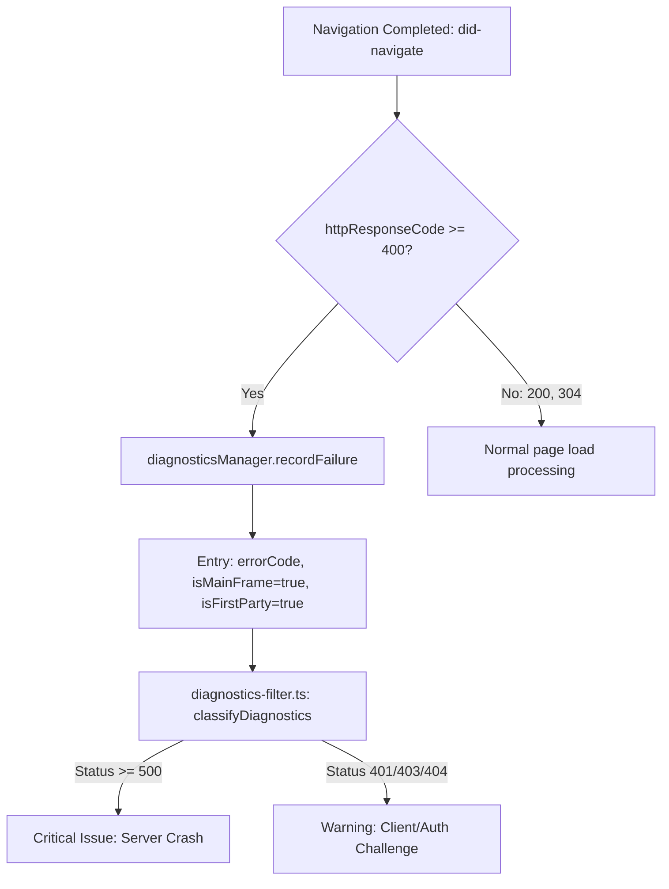

# Phase 1: Main-Frame HTTP Response Status Telemetry

## Overview
Capture navigation HTTP response status codes for the main frame in `NativeTabHost` and record status codes $\ge 400$ into `TabDiagnosticsManager` with explicit severity categorization (HTTP 5xx as critical server errors, HTTP 401/403 password challenges as non-fatal warnings).

## Requirements
- Functional:
  - Capture HTTP status code and status text directly from Electron's `webContents.on('did-navigate', (event, url, httpResponseCode, httpStatusText) => { ... })` and `did-navigate-in-page` with zero IPC overhead.
  - If `httpResponseCode >= 400`:
    - Record a `NetworkFailureDiagnosticEntry` with `errorCode: httpResponseCode`, `errorDescription: 'HTTP ' + httpResponseCode + ' ' + (httpStatusText || 'Error')`, `validatedURL: url`, `isMainFrame: true`, `origin: origin.origin`, `isFirstParty: true`.
  - In `diagnostics-filter.ts`:
    - Categorize main-frame server errors (HTTP $\ge 500$, e.g. 500, 502, 503, 504, 520–526) as **`criticalIssues`**.
    - Categorize main-frame client challenges (HTTP 401, 403, 404 on non-critical dev routes) as **`warnings`** to avoid breaking password-protected dev stores prior to login.
  - Retain existing `did-fail-load` handling for Chromium NetError codes (negative codes `< 0`, excluding `ERR_ABORTED -3`).
- Non-functional:
  - Zero performance degradation on normal HTTP 200/304 navigations.
  - Ring-buffer bounded storage in `TabDiagnosticsManager` (max 200 entries per tab).

## Architecture


## Related Code Files
- Modify: `src/main/browser/native-tab-host.ts` (hook `did-navigate` parameters)
- Modify: `src/main/browser/tab-diagnostics.ts` (ensure `status` and `isMainFrame` fields in `NetworkFailureDiagnosticEntry`)
- Modify: `src/main/qa/diagnostics-filter.ts` (classify main-frame 5xx as critical, 4xx as warning)

## Implementation Steps
1. In `src/main/browser/tab-diagnostics.ts`: Verify `NetworkFailureDiagnosticEntry` has `status?: number`, `isMainFrame?: boolean`, `origin?: string`, and `isFirstParty?: boolean`.
2. In `src/main/browser/native-tab-host.ts`:
   - Locate `wc.on('did-navigate', (event, navUrl, httpResponseCode, httpStatusText) => { ... })` (around lines 2289-2315).
   - Unpack `httpResponseCode` and `httpStatusText`.
   - If `typeof httpResponseCode === 'number' && httpResponseCode >= 400`:
     ```ts
     const origin = computeOrigin(navUrl, wc.getURL());
     this.diagnosticsManager.recordFailure(id, {
       errorCode: httpResponseCode,
       errorDescription: `HTTP ${httpResponseCode} ${httpStatusText || 'Error'}`,
       validatedURL: navUrl,
       isMainFrame: true,
       timestamp: Date.now(),
       origin: origin.origin,
       isFirstParty: origin.isFirstParty,
     });
     ```
3. In `src/main/qa/diagnostics-filter.ts`:
   - In `classifyDiagnostics`:
     - If `entry.isMainFrame === true`:
       - If `status >= 500`: push to `criticalIssues`.
       - If `status >= 400 && status < 500`: push to `warnings`.

## Success Criteria
- [ ] Navigating to a page returning HTTP 500 records a `NetworkFailureDiagnosticEntry` with `isMainFrame: true` and `errorCode: 500`, categorized as a `criticalIssue`.
- [ ] Navigating to a dev store returning HTTP 401/403 records a `warning` without crashing the whole test suite prematurely.
- [ ] Navigating to a normal page (HTTP 200) records no failure entries.
- [ ] Sub-resource 404s/500s from third-party scripts remain classified as warnings, while first-party/main-frame 5xx failures are critical.

## Risk Assessment
- *Risk:* `did-navigate` fires on hash navigations or redirect sequences.
- *Mitigation:* `did-navigate` handles top-level document commits; `isInPlace` hash changes fire `did-navigate-in-page` which does not log failure entries unless status code is an error.
