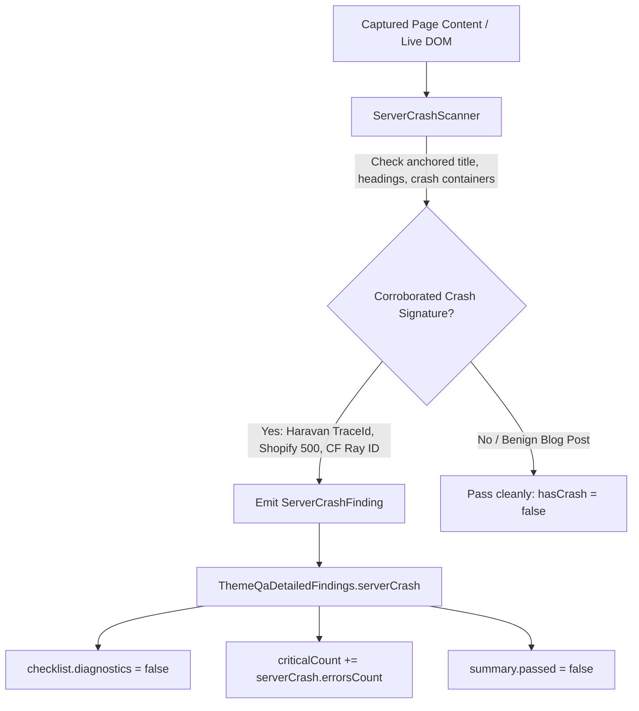

# Phase 2: Server Crash Scanner & QA Engine Integration

## Overview
Implement an authoritative `ServerCrashScanner` with anchored signature detection (Haravan 500, Shopify 500, Sapo 500, Cloudflare 520–526) that resists false positives from blog articles and toast messages. Integrate findings as a first-class citizen in `ThemeQaDetailedFindings` across both `ThemeQaWorkflow.validate()` and `buildFallbackThemeQaResult()` to guarantee 100% checklist and verdict parity.

## Requirements
- Functional:
  - Create `src/main/qa/scanners/server-crash-scanner.ts`.
  - **Anchored & Corroborated Signature Catalog (Anti-False-Positive Hardening):**
    1. **Haravan 500 Crash:**
       - Requires `document.title` or `h1/h2/.error-title` matching `Có gì đó không ổn !` OR `Server Error 500` AND structural presence of `TraceId:` or `div.server-error` or `div.error-500`.
       - Excludes text inside `.rte`, `article`, `textarea`, `.toast`, `.notification`.
    2. **Shopify 500 / Liquid Crash:**
       - Requires `500 Internal Server Error` or `Shopify Server Error` or `Liquid error (line ` in title/heading or body container.
    3. **Sapo / Bizweb 500:**
       - Requires `500 - Lỗi máy chủ` or `Hệ thống đang bận` with corroborating error container.
    4. **Cloudflare & Gateway:**
       - Requires `#cf-wrapper`, `.cf-error-details`, or `Ray ID:` + `Error 520/521/522/524`.
    5. **Raw Runtime Dumps:**
       - `UnhandledPromiseRejection`, `Fatal error:`, `Traceback (most recent call last):`.
  - **QA Engine Parity & Arithmetic Hardening:**
    - Add `serverCrash?: ServerCrashScanResult` to `ThemeQaDetailedFindings`.
    - In `ThemeQaWorkflow.validate()`:
      - `checklist.diagnostics = !liquid.hasErrors && !assets.hasBrokenAssets && !serverCrash.hasCrash && diagResult.criticalIssues.length === 0;`
      - `criticalCount = hsRules.errorsCount + liquid.errors.length + diagResult.criticalIssues.length + overflow.culprits.length + assets.brokenAssets.length + serverCrash.errorsCount;`
      - (Do not double-insert server crash into `diagnosticIssues` to prevent duplicate counting).
    - In `buildFallbackThemeQaResult()` (`src/main/tools/browser-capabilities.ts`):
      - Return the complete 8-key checklist: `layout`, `responsive`, `overflow`, `interactions`, `diagnostics`, `liquidClean`, `assetsValid`, `hsCompliant`.
      - Calculate `summary.passed` and `summary.criticalCount` with exact mathematical parity.
- Non-functional:
  - Pure zero-side-effect DOM inspection (no mutations, no global pollution).
  - Fast execution (< 5ms per scan).

## Architecture

## Related Code Files
- Create: `src/main/qa/scanners/server-crash-scanner.ts`
- Modify: `src/main/qa/theme-qa-workflow.ts` (integrate `serverCrash` in findings & checklist)
- Modify: `src/main/tools/browser-capabilities.ts` (`buildFallbackThemeQaResult` 8-key checklist parity)
- Modify: `src/main/qa/scanners/index.ts` (export scanner)

## Implementation Steps
1. Create `src/main/qa/scanners/server-crash-scanner.ts`:
   - Define `ServerCrashFinding`: `{ type: string; provider: 'haravan' | 'shopify' | 'sapo' | 'cloudflare' | 'runtime'; title?: string; traceId?: string; message: string; snippet?: string }`.
   - Define `ServerCrashScanResult`: `{ hasCrash: boolean; errorsCount: number; findings: ServerCrashFinding[] }`.
   - Implement `getBrowserScanScript()` returning an IIFE TreeWalker scanning document title, headings, and specialized crash containers while skipping RTE content.
   - Implement `scanHtmlString(html: string)` with equivalent anchored regex markers.
2. In `src/main/qa/theme-qa-workflow.ts`:
   - Import `ServerCrashScanner`.
   - Execute scanner via `eval` with static HTML fallback.
   - Attach `serverCrash` to `findings`.
   - Update checklist and critical count computation cleanly.
3. In `src/main/tools/browser-capabilities.ts`:
   - Implement identical `ServerCrashScanner` integration in `buildFallbackThemeQaResult`.
   - Update `checklist` object to include all 8 canonical keys.

## Success Criteria
- [ ] Scanning Haravan 500 HTML ("Có gì đó không ổn !", "Server Error 500", "TraceId: ...") returns `hasCrash: true` with `provider: 'haravan'`.
- [ ] Blog posts or product descriptions containing the words "Có lỗi xảy ra" or "500" in body text return `hasCrash: false` (zero false positives).
- [ ] Both `ThemeQaWorkflow.validate()` and `buildFallbackThemeQaResult()` return identical `summary.passed: false`, `summary.criticalCount: 1`, and identical 8-key checklist objects on 500 error pages.

## Risk Assessment
- *Risk:* Anti-tampering or custom theme 500 pages with non-standard markup.
- *Mitigation:* Backed by Phase 1's main-frame HTTP status tracking: even if HTML markup is completely custom, HTTP status $\ge 500$ is caught by Layer 1 telemetry.
