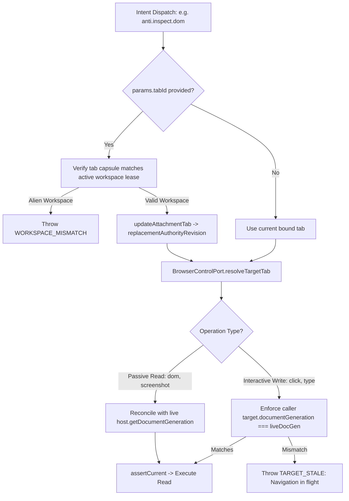

# Phase 3: Reconciled Tenancy Target Rebinding

## Overview
Implement safe, tenancy-bounded generation reconciliation and dynamic workspace tab adoption. Passive read capabilities (`anti.inspect.dom`, `anti.screenshot.viewport`) auto-reconcile live `documentGeneration` on settled tabs within the authorized workspace lease, while mutating interactive actions retain strict caller-generation verification to prevent blind mid-flight input.

## Requirements
- Functional:
  - **Tenancy-Bound Dynamic Tab Adoption in `CapabilityTransportAdapter`:**
    - When `params.tabId` is provided (e.g. `anti.inspect.dom { tabId: 'tab-2' }`), verify that `tabId` exists and belongs to the authorized workspace lease (`tab.workspaceId === authority.workspaceId && tab.projectId === authority.projectId`).
    - Resolve workspace membership via `NativeTabHost` capsule mapping (`this.tabHost.getTabCapsuleId(tabId)` or `WorkspaceCapsuleManager.resolveWorkspaceFromTab(tabId)`).
    - If the tab belongs to a different project or workspace, fail-closed immediately with `CapabilityError('WORKSPACE_MISMATCH', 'Target tab belongs to a different workspace')`.
    - If valid, update the attachment record via `updateAttachmentTab()` and emit `replacementAuthorityRevision`.
  - **Differentiated Concurrency Fences in `BrowserControlPort.resolveTargetTab`:**
    - **Passive Reads (`dom`, `screenshot`, `diagnostics`, `listTabs`):** If the target matches the active workspace lease credentials (`projectId`, `workspaceId`, `hostEpoch`, `runtimeId`) and the tab exists and is settled, sample live `documentGeneration` from host to eliminate false `TARGET_STALE` errors after external page reloads.
    - **Interactive Writes (`agentClick`, `agentType`, `keyboardPress`, `agentMove`, `agentTrajectory`, QA repair mutations):** If the caller explicitly supplied `target.documentGeneration`, verify that `target.documentGeneration === liveDocGen`. If a mid-flight navigation occurred, fail-closed with `TARGET_STALE` / `REF_DOCUMENT_MUTATED` to prevent executing click/type inputs against an unexpected document.
- Non-functional:
  - Cryptographic lease integrity: Zero tolerance for cross-tenant workspace escapes.
  - Sub-millisecond target resolution overhead.

## Architecture

## Related Code Files
- Modify: `src/main/tools/browser-control-port.ts` (`resolveTargetTab` passive vs interactive distinction)
- Modify: `src/main/tools/capability-transport.ts` (`dispatchIntent` tenancy verification on `params.tabId`)
- Modify: `src/main/run/attachment-registry.ts` (`updateAttachmentTab` tenancy assertion)
- Modify: `src/main/browser/native-tab-host.ts` (expose `getTabWorkspaceId(tabId)` helper)

## Implementation Steps
1. In `src/main/browser/native-tab-host.ts`:
   - Add helper `getTabWorkspaceId(tabId: string): string | undefined` using the tab's associated capsule / workspace mapping.
2. In `src/main/tools/capability-transport.ts`:
   - In `dispatchIntent(intent)`:
     - Check if `p.tabId` is provided on any capability call.
     - If `p.tabId` differs from `authority.browserTarget?.tabId`:
       - Query `this.tabHost.getTabWorkspaceId(p.tabId)`.
       - If tab workspace does not match `authority.workspaceId`, throw `CapabilityError('WORKSPACE_MISMATCH', 'Target tab belongs to a different workspace')`.
       - Call `const newRev = this.attachmentRegistry.updateAttachmentTab(authority.attachmentId, p.tabId, liveDocGen)`.
       - If `newRev`, set `replacementAuthorityRevision = newRev`.
3. In `src/main/tools/browser-control-port.ts`:
   - In `resolveTargetTab(target, explicitTabId, isPassiveRead = false)`:
     - If `isPassiveRead && target`:
       - `currentTarget.documentGeneration = liveDocGen;`
     - Else (interactive writes):
       - Keep `target.documentGeneration` as supplied by caller to enforce mutation concurrency fences.
     - Execute `this.assertCurrent(currentTarget)`.

## Success Criteria
- [ ] Calling `anti.inspect.dom` on an externally reloaded tab succeeds with fresh DOM without throwing `TARGET_STALE`.
- [ ] Calling `anti.agent.cursor.click` with a stale generation while the tab is actively navigating throws `TARGET_STALE` (preventing blind clicks).
- [ ] Calling `anti.inspect.dom { tabId: 'tab-2' }` within the same workspace rebinds the tab and succeeds.
- [ ] Calling `anti.inspect.dom { tabId: 'alien-tab' }` belonging to another workspace is blocked with `WORKSPACE_MISMATCH`.

## Risk Assessment
- *Risk:* Calling `resolveTargetTab` without knowing whether the operation is passive vs mutating.
- *Mitigation:* Explicit boolean flag or capability metadata lookup (`requiresBrowserTarget` + `effect !== 'interactive-effect'`).
