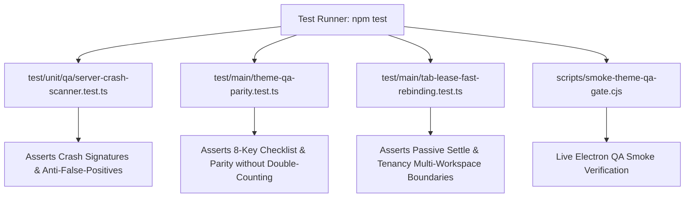

# Phase 4: Regression Testing & Parity Verification

## Overview
Author comprehensive unit, integration, and parity test suites covering main-frame HTTP status tracking, `ServerCrashScanner` signature detection with anti-false-positive validation, QA engine fail-closed behavior, and tenancy-bounded MCP target rebinding lifecycle.

## Requirements
- Functional:
  - **Unit tests for `ServerCrashScanner` (`test/unit/qa/server-crash-scanner.test.ts`):**
    - Haravan 500 HTML fixture with "Có gì đó không ổn !", "Server Error 500", and `TraceId: ...`.
    - Shopify 500 / Liquid crash fixtures.
    - Sapo / Bizweb 500 error fixtures.
    - Cloudflare 520–524 error fixtures.
    - **Anti-False-Positive Test:** Clean store HTML with benign customer reviews / blog posts mentioning "Có lỗi xảy ra" or "500" in `.rte` body text — must return `hasCrash: false`.
  - **Parity tests for `ThemeQaWorkflow` vs `buildFallbackThemeQaResult` (`test/main/theme-qa-parity.test.ts`):**
    - Assert exact 8-key checklist match (`layout`, `responsive`, `overflow`, `interactions`, `diagnostics`, `liquidClean`, `assetsValid`, `hsCompliant`).
    - Assert exact `criticalCount` match without double-counting on 500 error pages.
    - Assert `summary.passed: false` across both execution paths.
  - **Lifecycle, Tenancy & Rebinding tests (`test/main/tab-lease-fast-rebinding.test.ts`):**
    - Assert that external document reload reconciles live generation for `anti.inspect.dom` without manual `tabs.activate`.
    - Assert that interactive actions (`agentClick`) with stale generations are rejected during active navigation.
    - Assert that dynamic tab adoption within the same workspace succeeds and rotates revision.
    - Assert that dynamic tab adoption targeting a tab in an alien workspace is rejected with `WORKSPACE_MISMATCH`.
- Non-functional:
  - Fast, deterministic execution inside `npm test` without hanging processes.
  - Zero mock divergence from live Electron runtime contracts.

## Architecture

## Related Code Files
- Create: `test/unit/qa/server-crash-scanner.test.ts`
- Modify: `test/main/theme-qa-parity.test.ts`
- Modify: `test/main/tab-lease-fast-rebinding.test.ts`
- Modify: `scripts/smoke-theme-qa-gate.cjs`

## Implementation Steps
1. Create `test/unit/qa/server-crash-scanner.test.ts`:
   - Add test fixtures with real-world HTML from Haravan, Shopify, Sapo, and Cloudflare.
   - Assert `hasCrash === true` and correct provider/message extraction.
   - Assert clean store HTML with benign keywords in body returns `hasCrash === false`.
2. Update `test/main/theme-qa-parity.test.ts`:
   - Simulate a 500 server error response and 500 DOM page.
   - Run both `ThemeQaWorkflow.validate()` and `buildFallbackThemeQaResult()`.
   - Assert exact parity: both return `summary.passed === false`, all 8 checklist keys match, and `criticalCount` matches without double-counting.
3. Update `test/main/tab-lease-fast-rebinding.test.ts`:
   - Test passive read generation reconciliation (gen 1 -> 2) without explicit `tabs.activate`.
   - Test interactive mutation generation fence (rejects stale gen during navigation).
   - Test dynamic tab adoption within same workspace and rejection across alien workspaces.
4. Run full test verification: `npm test` and `node scripts/run-electron.cjs scripts/smoke-theme-qa-gate.cjs`.

## Success Criteria
- [ ] `test/unit/qa/server-crash-scanner.test.ts` passes 100% including anti-false-positive tests.
- [ ] `test/main/theme-qa-parity.test.ts` verifies 500 crash parity and 8-key checklist integrity.
- [ ] `test/main/tab-lease-fast-rebinding.test.ts` verifies target currency, mutation fencing, and tenancy boundaries.
- [ ] Full workspace test suite (`npm test`) passes with 0 failures.

## Risk Assessment
- *Risk:* Mock tab host in unit tests diverges from real Electron `WebContents`.
- *Mitigation:* Backed by live Electron smoke test `scripts/smoke-theme-qa-gate.cjs` and `smoke-mcp-industrial-e2e.cjs`.
