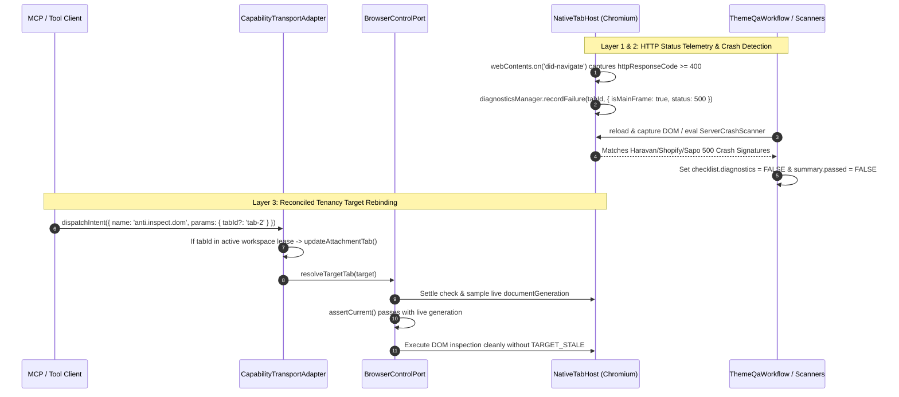

# AntiFan Browser Target Rebinding & Server 500 Crash Detection

## Freeze Dependency and Redesign Gate

- Do not implement this plan until `260901-1011-antifan-core-runtime-freeze` passes its certification and release-soak gates.
- Preserve the valid downstream outcome: main-frame HTTP status telemetry and one authoritative server-crash scanner integrated into `ThemeQaWorkflow`.
- Phase 3's live `documentGeneration` overwrite and implicit same-workspace tab adoption conflict with the freeze's exact revision contract. Rewrite them as explicit target-selection/revision transitions; target-bound reads may not silently retarget or sample “latest” authority.
- Phase 2/4 references to `buildFallbackThemeQaResult` conflict with the freeze's single-QA-owner cutover. Rewrite verification against `ThemeQaWorkflow` plus public alias parity after the fallback is deleted.
- This gate preserves the plan directory and product intent while preventing its draft mechanisms from bypassing the canonical authority path.

## Overview

This implementation plan delivers comprehensive structural resolutions for two critical AntiFan Desktop browser runtime defects:
1. **Target Stale & Tab Rebinding Lifecycle (Issue 1):** Resolves false `TARGET_STALE` errors during MCP browser read/interaction operations by reconciling live `documentGeneration` state for active workspace lease targets and enabling dynamic workspace tab adoption when `params.tabId` is provided.
2. **Server 500 & Crash Detection in Theme QA (Issue 2):** Implements a robust 3-layer defense (Main-Frame HTTP Response Status Telemetry + `ServerCrashScanner` + QA Engine Gating) ensuring that fatal 500/502/503 server errors on Haravan, Shopify, Sapo, and Cloudflare fail QA gates immediately instead of returning false "Passed" verdicts.

## Goals

| # | Goal | Priority |
|---|------|----------|
| 1 | Capture Main-Frame HTTP Response Status codes in `NativeTabHost` and classify status >= 400 as critical failures | P1 |
| 2 | Implement `ServerCrashScanner` for Haravan, Shopify, Sapo, and Cloudflare 500 error pages and integrate into QA engine | P1 |
| 3 | Reconcile live `documentGeneration` in `BrowserControlPort` and support dynamic workspace tab adoption in `CapabilityTransportAdapter` | P1 |
| 4 | Deliver full test coverage and parity verification across `ThemeQaWorkflow` and `buildFallbackThemeQaResult` | P1 |

## Phases

| # | Phase | Status | Priority | Effort |
|---|-------|--------|----------|--------|
| 1 | [Phase 1: Main-Frame HTTP Response Status Telemetry](./phase-01-main-frame-http-response-status-telemetry.md) | Pending | P1 | 3h |
| 2 | [Phase 2: Server Crash Scanner & QA Engine Integration](./phase-02-server-crash-scanner-and-qa-engine-integration.md) | Pending | P1 | 5h |
| 3 | [Phase 3: Reconciled Tenancy Target Rebinding](./phase-03-reconciled-tenancy-target-rebinding.md) | Pending | P1 | 4h |
| 4 | [Phase 4: Regression Testing & Parity Verification](./phase-04-regression-testing-and-parity-verification.md) | Pending | P1 | 4h |

## Success Criteria

- [ ] Main-frame HTTP 4xx/5xx responses (e.g. 500 Internal Server Error) are recorded in `TabDiagnosticsManager` with `isMainFrame: true`.
- [ ] `diagnostics-filter.ts` categorizes main-frame HTTP >= 400 responses as `criticalIssues`.
- [ ] `ServerCrashScanner` detects Haravan ("Có gì đó không ổn !", "Server Error 500", "TraceId:"), Shopify, Sapo, and Cloudflare crash signatures.
- [ ] `ThemeQaWorkflow.validate()` and `buildFallbackThemeQaResult()` return `summary.passed: false` and `criticalCount >= 1` when navigating to a 500 error page.
- [ ] MCP read capabilities (`anti.inspect.dom`, `anti.screenshot.viewport`, cursor actions) on reloaded tabs succeed without manual `tabs.activate`.
- [ ] Tool calls with explicit `tabId` belonging to the active workspace lease dynamically rebind the attachment tab and return `replacementAuthorityRevision`.
- [ ] All unit, integration, and parity tests pass with zero regressions.

<!-- slug: browser-target-rebinding-and-server-500-detection -->
