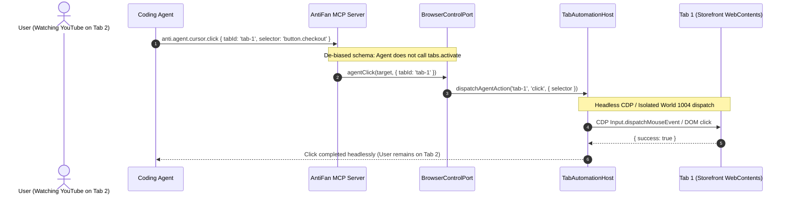

# Phase 1: MCP Tool De-Biasing & Headless Action Routing

## Overview
Eliminate prompt cues that cause LLM agents to proactively steal visual window focus. Sanitize MCP tool schemas and parameter descriptions, and ensure `TabAutomationHost` and `BrowserControlPort` route agent actions directly to the target `WebContents` headlessly without invoking `switchTab()`.

## Requirements
- Functional:
  - **Tool Schema De-Biasing (`src/main/mcp/mcp-server.ts`):**
    - Remove all misleading strings such as `(auto-switches to target tab)` and `If specified, automatically activates and focuses this tab` from tool definitions (`anti.browser.navigate`, `anti.browser.reload`, `anti.inspect.dom`, `anti.screenshot.viewport`, `anti.agent.cursor.*`, etc.).
    - Update `tabId` description across all tools: `"Optional target tab ID. Executes directly against the specified tab in the background without stealing visual focus or changing active tab."`
    - Update `anti.browser.tabs.activate` description: `"Visually switch the active tab for the user on screen. DO NOT call this tool for automated background operations; pass tabId directly to capability tools."`
  - **Headless Action Execution Routing (`src/main/browser/tab-automation-host.ts`):**
    - Verify that `dispatchAgentAction`, `agentClick`, `agentType`, `agentHover`, `agentTrajectory` operate purely via CDP `Input.*` and Isolated World `1004` directly against `targetWebContents` without calling `NativeTabHost.switchTab()`.
  - **Scoped User Preemption (RT-01 Hardening):**
    - Scope `NativeTabHost.before-input-event` listener and `ViewportGate.preemptActiveAgent(eventTabId, reason)` strictly to the tab where physical user interaction occurred.
    - User typing in foreground Tab 2 (YouTube/Facebook) MUST NOT preempt background agent actions running on Tab 1. Only physical keystrokes on the automation target tab trigger agent preemption.
  - **Session-Pinned Target Resolution (`src/main/tools/browser-control-port.ts`):**
    - Ensure `resolveTargetTab()` prioritizes `explicitTabId`, then `target.tabId`, then `host.getAutomationTabId()`. If an automation target is established, do not fall back to `userActiveTabId` to prevent background agent operations from mutating the user's personal active browsing tab.
  - Backward compatibility for existing tool signatures.
  - Zero latency regression on capability dispatching.

## Architecture

## Related Code Files
- Modify: `src/main/mcp/mcp-server.ts`
- Modify: `src/main/browser/tab-automation-host.ts`
- Modify: `src/main/tools/browser-control-port.ts`
- Modify: `src/main/tools/browser-capabilities.ts`

## Implementation Steps
1. In `src/main/mcp/mcp-server.ts`:
   - Audit and sanitize tool descriptions in `definitions` array and `buildMcpToolList()`.
   - Update parameter documentation for `tabId` and `paneId`.
2. In `src/main/tools/browser-control-port.ts`:
   - Refine `resolveTargetTab()` to guarantee headless isolation when resolving target tabs.
3. In `src/main/browser/tab-automation-host.ts`:
   - Ensure visual agent indicators (glow/status) are scoped to the target tab's coordinate system without forcing UI window switching.

## Success Criteria
- [x] No tool in `tools/list` contains `(auto-switches to target tab)`.
- [x] Agent issues clicks, typing, and DOM inspections with `tabId: 'tab-1'` while user is on `tab-2` without changing the active visual tab.
- [x] Unit tests for MCP server tool descriptions and headless routing pass.

## Risk Assessment
- *Risk:* LLM agents that previously relied on ambient active tab might fail if no `tabId` is provided and no default target is set.
- *Mitigation:* `AttachmentRegistry` automatically pins `tabId` at session launch and propagates it via `browserTarget.tabId`.
