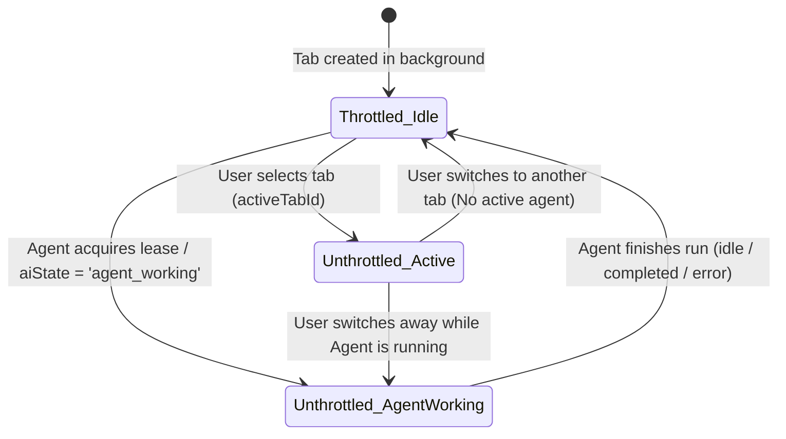

# Phase 2: State-Aware Background Throttling & Adaptive Reload

## Overview
Eliminate false timeouts (`TARGET_STALE: Reload failed or timed out before a load-complete document was available`) during background tab operations by introducing state-aware Chromium background throttling exemption and adaptive reload completion waiters (8,000ms).

## Requirements
- Functional:
  - **Dynamic In-Flight Throttling Exemption (RT-02 Hardening):**
    - In `applyTabThrottling()`, derive throttling exemption purely from active in-flight states:
      ```typescript
      const isUserActive = id === this.activeTabId;
      const isAgentWorking = tab.state.aiState === 'agent_working' || Boolean(this.activeLeases?.has(id));
      
      // Never leak static unthrottling: tab must throttle immediately when agent run settles
      const shouldThrottle = !isUserActive && !isAgentWorking;
      tab.view?.webContents.setBackgroundThrottling(shouldThrottle);
      if (tab.mobileView) tab.mobileView.webContents.setBackgroundThrottling(shouldThrottle);
      ```
    - Trigger `applyTabThrottling()` upon tab creation, user switch, agent state transition (`agent_working` $\leftrightarrow$ `idle`), lease acquisition/release, and run completion/error/abort handlers.
  - **Adaptive Reload Waiter & Dual-Pane Settle (RT-03 Hardening):**
    - In `reloadAndWait(tabId, timeoutMs)`:
      - Automatically scale timeout: `3000ms` for foreground tabs, `8000ms` for background tabs.
      - In Split Review mode (Desktop + Mobile), await `did-finish-load` / `Page.loadEventFired` across BOTH `view` and `mobileView` before declaring reload successful.
      - Listen to `did-finish-load` and CDP `Page.loadEventFired` to settle immediately when loading finishes.
      - Ensure `FirstPartyNetworkTracker.awaitQuiescence()` respects background network timing without hanging indefinitely.
  - Zero background CPU/RAM runaway: tabs return to throttled state as soon as agent workflows settle.
  - Bounded wait windows: max ceiling timeout prevents hung dev servers from blocking workers.

## Architecture


## Related Code Files
- Modify: `src/main/browser/native-tab-host.ts`
- Modify: `src/main/browser/first-party-network-tracker.ts`
- Modify: `src/main/tools/browser-control-port.ts`

## Implementation Steps
1. In `src/main/browser/native-tab-host.ts`:
   - Enhance `applyTabThrottling()` with the 3-point check (`isUserActive`, `isAutomationTarget`, `isAgentWorking`).
   - Wire hook calls in `setAutomationTabId()`, `broadcastAgentState()`, and viewport lease hooks.
   - Update `reloadAndWait()` and `createLoadCompletionWaiter()` with adaptive background timeout scaling (8,000ms).
2. In `src/main/browser/first-party-network-tracker.ts`:
   - Ensure `awaitQuiescence()` handles background tab timing with safe ceiling timeout (2,000ms).

## Success Criteria
- [x] Tab in background running a theme reload completes successfully without throwing `TARGET_STALE` when page load takes 4–6s.
- [x] Inactive background tabs remain throttled to conserve battery and CPU.
- [x] Unit tests for dynamic throttling transitions and reload timeouts pass.

## Risk Assessment
- *Risk:* Heavy storefronts with never-ending background WebSockets or analytics beacons might delay quiescence.
- *Mitigation:* `FirstPartyNetworkTracker` ignores third-party analytics and enforces hard ceiling timeout.
