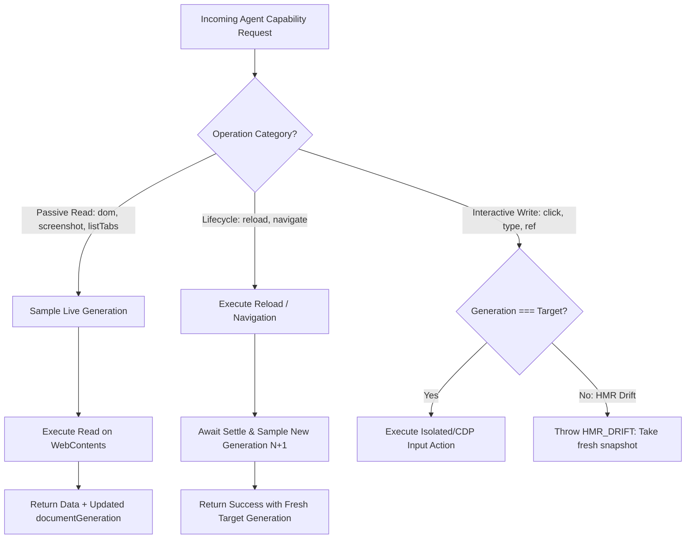

# Phase 3: Differential Generation Fencing & Resilient Settle

## Overview
Differentiate `documentGeneration` validation rules across operation categories (auto-sync for passive reads and reloads during dev-server HMR vs strict preflight fencing for interactive writes) and eliminate `requestAnimationFrame` freezes during background Theme QA visual settles.

## Requirements
- Functional:
  - **Differential Generation Fencing (`src/main/tools/browser-control-port.ts`):**
    - **Category A: Passive Reads (`dom`, `screenshot`, `listTabs`, `eval`, `diagnostics`, `theme.debug_bundle`)**
      - When an agent calls a read tool with an older `documentGeneration` (e.g. after background HMR), sample live generation from `host.getDocumentGeneration(tabId)` without throwing `TARGET_STALE`.
      - Return the live generation in the response envelope so the session's attachment authority revision synchronizes cleanly.
    - **Category B: Lifecycle Operations (`reload`, `navigate`)**
      - Allow reloads and navigations on valid target tabs; post-settle, sample the newly incremented generation $N+1$ and return `{ reloaded: true, target: freshTarget }`.
    - **Category C: Interactive Writes (`click`, `type`, `@ref` mutations, `agentTrajectory`)**
      - Maintain strict preflight check: if `target.documentGeneration !== liveDocGen`, fail closed with `CapabilityError('HMR_DRIFT', 'Document reloaded by dev-server HMR; take a fresh snapshot to interact')` to protect against executing click/type inputs against mutated DOM structures.
  - **Resilient Visual Settle Gate (`src/main/qa/theme-qa-workflow.ts`):**
    - In `ThemeQaWorkflow.validate()` and in-page layout scripts, replace bare `requestAnimationFrame` with a timeout-raced visual settle helper:
      ```typescript
      const resilientVisualSettle = () => Promise.race([
        new Promise(r => requestAnimationFrame(r)),
        new Promise(r => setTimeout(r, 100))
      ]);
      ```
- Non-functional:
  - Zero false-positive `TARGET_STALE` on read/audit loops.
  - Deterministic mutation safety on interactive writes.

## Architecture


## Related Code Files
- Modify: `src/main/tools/browser-control-port.ts`
- Modify: `src/main/qa/theme-qa-workflow.ts`
- Modify: `src/main/qa/scanners/layout-overflow-engine.ts`

## Implementation Steps
1. In `src/main/tools/browser-control-port.ts`:
   - Refactor `resolveTargetTab()` to accept an optional `mode: 'read' | 'write' | 'lifecycle'`.
   - In `'read'` and `'lifecycle'` modes, auto-synchronize live generation without rejecting on mismatch.
   - In `'write'` mode, enforce strict generation match and return structured `HMR_DRIFT` on discrepancy.
2. In `src/main/qa/theme-qa-workflow.ts`:
   - Upgrade visual settle and font readiness checks to use the timeout-raced `resilientVisualSettle` helper.

## Success Criteria
- [x] Dev-server HMR rebuild in the background while agent is thinking does not cause subsequent `dom` or `screenshot` to throw `TARGET_STALE`.
- [x] Interactive click with stale snapshot is rejected with actionable `HMR_DRIFT` error.
- [x] Theme QA validation runs to completion in a background tab without hanging on frozen rAF.

## Risk Assessment
- *Risk:* Agent executing a click on an element that moved during HMR.
- *Mitigation:* Interactive writes retain strict generation checks and Semantic Ref (`@e1`, `@e2`) descriptor nonce verification.
