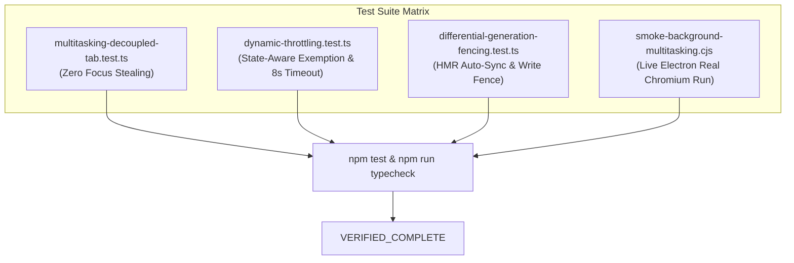

# Phase 4: Regression Testing, Multitasking & E2E Verification

## Overview
Deliver comprehensive unit, integration, and live Electron smoke test coverage proving that users can multitask freely without focus stealing or `TARGET_STALE` timeouts, while verifying zero regressions across existing test suites.

## Requirements
- Functional:
  - **Multitasking Decoupling Tests (`test/main/multitasking-decoupled-tab.test.ts`):**
    - Simulate User on Tab 2 (YouTube), Agent targeting Tab 1 (Storefront).
    - Assert that agent operations (`dom`, `screenshot`, `reload`, `click`, `qa_validate`) complete 100% successfully on Tab 1 without mutating `activeTabId` (User stays on Tab 2).
  - **Dynamic Throttling & Adaptive Timeout Tests (`test/main/dynamic-throttling.test.ts`):**
    - Assert that `applyTabThrottling()` sets `setBackgroundThrottling(false)` when `aiState === 'agent_working'` or lease is active, and reverts to `true` when idle.
    - Assert that `reloadAndWait()` allows background reloads taking 4–6s without throwing `TARGET_STALE`.
  - **Differential Generation Fencing Tests (`test/main/differential-generation-fencing.test.ts`):**
    - Assert that a background HMR generation advance ($N \to N+1$) does not break subsequent passive `dom` or `screenshot` reads.
    - Assert that an interactive `click` with a stale generation fails closed with `HMR_DRIFT`.
  - **Live Electron Smoke Test (`scripts/smoke-background-multitasking.cjs`):**
    - Launch real Electron Chromium instance, open Tab 1 and Tab 2, switch user to Tab 2, dispatch continuous background theme modifications and reloads on Tab 1, and verify zero focus-stealing.
- Non-functional:
  - Complete test suite passes with 0 failures (`npm test`).
  - TypeScript typecheck passes with 0 errors (`npm run typecheck`).

## Architecture

## Related Code Files
- Create: `test/main/multitasking-decoupled-tab.test.ts`
- Create: `scripts/smoke-background-multitasking.cjs`
- Modify: `test/main/capability-catalogue.test.ts`
- Modify: `test/main/native-tab-host-agent-lifecycle.test.ts`

## Implementation Steps
1. Create `test/main/multitasking-decoupled-tab.test.ts` to assert independent dual-plane execution.
2. Update existing capability and lifecycle tests to verify the de-biased tool contracts.
3. Implement `scripts/smoke-background-multitasking.cjs` and add `npm run smoke:multitasking` script to `package.json`.
4. Run full `npm test` and `npm run typecheck` across all 125+ test suites.

## Success Criteria
- [x] Multitasking unit tests pass, proving zero UI focus stealing.
- [x] Dynamic throttling and adaptive timeout tests pass with zero false `TARGET_STALE` errors.
- [x] Live Electron smoke test passes in under 30 seconds.
- [x] Entire test suite (`npm test`) passes with 100% green status.

## Risk Assessment
- *Risk:* Flakiness in live Electron multi-tab background timing tests on CI/CD.
- *Mitigation:* Explicit lifecycle completion promises with bounded timeouts instead of arbitrary `setTimeout` sleeps.
