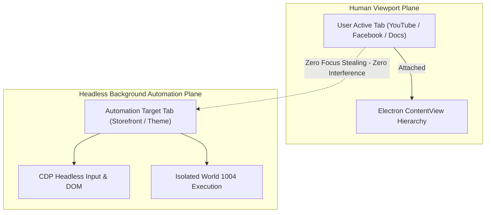

# Decoupled Dual-Plane Background Automation & TARGET_STALE Elimination

## Overview

This implementation plan delivers a complete structural resolution for user workflow friction in AntiFan Browser Desktop. It eliminates window focus stealing (unwanted `activate` calls) and `TARGET_STALE` errors during background multitasking (e.g. user watching YouTube / Facebook / reading docs on Tab 2 while AI operates on Tab 1 in the background).

## Goals

| # | Goal | Priority |
|---|------|----------|
| 1 | De-bias MCP tool descriptions and enforce headless action routing without visual window focus stealing | P1 |
| 2 | Implement state-aware background throttling and adaptive reload waiters (8s) to eliminate false timeouts | P1 |
| 3 | Implement differential documentGeneration fencing (auto-sync for reads/reloads, strict preflight for writes) | P1 |
| 4 | Deliver comprehensive unit, multitasking, and live Electron smoke test coverage with zero regressions | P1 |

## Phases

| # | Phase | File | Status |
|---|-------|------|--------|
| 1 | MCP Tool De-Biasing & Headless Action Routing | [phase-01-mcp-tool-debiasing-and-headless-action-routing.md](./phase-01-mcp-tool-debiasing-and-headless-action-routing.md) | Complete |
| 2 | State-Aware Background Throttling & Adaptive Reload | [phase-02-state-aware-background-throttling-and-adaptive-reload.md](./phase-02-state-aware-background-throttling-and-adaptive-reload.md) | Complete |
| 3 | Differential Generation Fencing & Resilient Settle | [phase-03-differential-generation-fencing-and-resilient-settle.md](./phase-03-differential-generation-fencing-and-resilient-settle.md) | Complete |
| 4 | Regression Testing, Multitasking & E2E Verification | [phase-04-regression-testing-multitasking-and-e2e-verification.md](./phase-04-regression-testing-multitasking-and-e2e-verification.md) | Complete |

## Success Criteria

- [x] User can multitask freely on Tab 2 (YouTube/Facebook) while AI executes continuous background workflows on Tab 1 without focus stealing.
- [x] AI does not invoke `activate` tab automatically; tab switching is strictly a user-facing visual convenience.
- [x] Background reloads on heavy storefronts complete reliably within adaptive 8s window without throwing `TARGET_STALE`.
- [x] Dev-server HMR updates in the background do not break subsequent passive DOM reads, screenshots, or reloads.
- [x] 100% test pass rate across all unit, integration, and live Electron smoke suites.

<!-- slug: decoupled-dual-plane-background-automation -->
