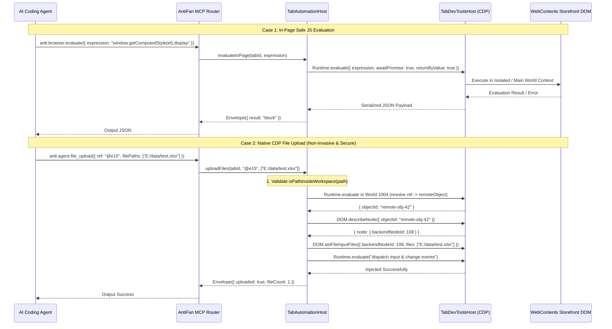

# Phase 3: Deep Evaluation & CDP File Upload Synthesizer

## Overview
Implement safe in-page JavaScript evaluation (`anti.browser.evaluate`) and native CDP file injection (`anti.agent.file_upload` / `anti.agent.drop`). This unblocks complex storefront assertions (computed CSS styles, window global checks) and enables high-throughput headless file uploads (e.g. 1 million serial record Excel files in Vyan Guarantee tests) without encountering OS file picker dialogs, while enforcing strict workspace containment security and non-invasive node resolution.

## Requirements
- **Functional:**
  - `anti.browser.evaluate` (or `anti.inspect.eval`): Execute arbitrary synchronous and asynchronous JavaScript in page context, returning serialized JSON payloads with structured error handling (stack traces, circular reference pruning).
  - Open evaluate permissions for local MCP sessions (remove unneeded high-risk gating for read queries), while ensuring execution does not leak Node runtime primitives.
  - **Workspace File Containment Check:** Before issuing any file upload or drop, validate all file paths against the current project/workspace root using `isPathInsideWorkspace(filePath, workspaceRoot)` to completely prevent arbitrary local file exfiltration.
  - **Non-Invasive Node Resolution:** Do NOT inject synthetic DOM attributes (`data-antifan-ref`). In Isolated World 1004, resolve element reference to a remote JS object (`objectId`), call CDP `DOM.describeNode({ objectId })` to retrieve `backendNodeId`, and execute `DOM.setFileInputFiles({ files: validatedPaths, backendNodeId })`. This pierces open Shadow DOM and iframes natively.
  - Dispatch synthetic `input` and `change` events on target input to trigger React/Vue/Liquid form change listeners.
  - `anti.agent.drop`: Synthesize HTML5 `File`, `FileList`, and `DataTransfer` objects to trigger custom drag-and-drop dropzones (Dropzone.js, React-Dropzone).
- **Non-functional:**
  - Evaluate execution latency < 20ms for DOM queries.
  - File upload injection completes in < 50ms for multi-megabyte files.
  - Zero OS modal dialog popups.

## Architecture

## Related Code Files
- Modify: `src/main/browser/tab-automation-host.ts` (Implement workspace path validation, file upload, and drag-and-drop synthesizer)
- Modify: `src/main/browser/tab-devtools-host.ts` (Implement Runtime.evaluate with circular-safe serializer and describeNode helper)
- Modify: `src/main/tools/browser-capabilities.ts` (Register capabilities for evaluate, file_upload, drop)

## Implementation Steps
1. In `tab-automation-host.ts`, add security utility `validateWorkspaceFilePath(filePath, workspaceRoot)` throwing `PERMISSION_DENIED` if path escapes workspace root.
2. In `tab-devtools-host.ts`, implement `evaluateJs(expression, options)` using CDP `Runtime.evaluate` with `awaitPromise: true`, `returnByValue: true`, and error serialization.
3. In `tab-automation-host.ts`, implement `uploadFileInput(tabId, refOrSelector, filePaths)`:
   - Resolve target element in World 1004 to obtain `objectId`.
   - Call `DOM.describeNode({ objectId })` to retrieve `backendNodeId`.
   - Issue CDP `DOM.setFileInputFiles({ backendNodeId, files })`.
   - Dispatch `input` and `change` events.
4. In `tab-automation-host.ts`, implement `dropFiles(tabId, refOrSelector, filePaths)` synthesizing `DragEvent` sequence (`dragenter`, `dragover`, `drop`).
5. In `browser-capabilities.ts`, register `anti.browser.evaluate`, `anti.inspect.eval`, `anti.agent.file_upload`, and `anti.agent.drop` in the capability catalogue.

## Success Criteria
- [ ] Uploading paths outside the workspace throws descriptive `PERMISSION_DENIED` error.
- [ ] `anti.browser.evaluate` executes `1 + 1` and returns `2`.
- [ ] `anti.browser.evaluate` reads `document.title` and computed CSS values successfully.
- [ ] `anti.agent.file_upload` attaches `.xlsx` file to `<input type="file">` via `backendNodeId` without DOM attribute pollution or OS file pickers.
- [ ] React/Liquid form `onChange` triggers and displays uploaded filename.

## Risk Assessment
- **Risk:** Target `<input type="file">` is inside an open ShadowRoot boundary.
- **Mitigation:** Resolving via Isolated World 1004 and CDP `objectId` -> `backendNodeId` seamlessly bridges Shadow DOM boundaries without requiring global CSS selector matches.
