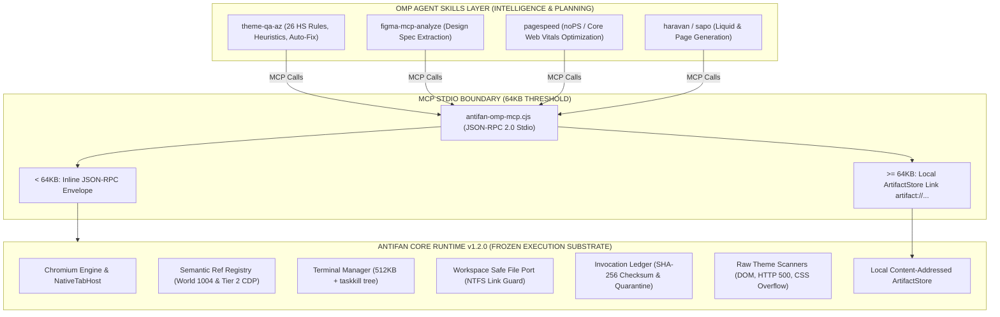

# AntiFan Core Freeze Hardening, Local Stdio Resilience & OMP Skills Transition

## 1. Executive Summary & Epistemic Grounding

AntiFan Browser Desktop is a **Deterministic Execution Substrate** (Chromium Browser Engine, Semantic Ref Registry World 1004, PTY Terminal Manager, Invocation Ledger, Local Artifact Store, and Raw Telemetry Scanners). It is **NOT** an AI Reasoning Engine or LLM Agent Swarm.

**Môi trường vận hành:** **100% Local Cá nhân (Windows 11 Pro x64, Desktop Electron, Local File System / NTFS, Local SQLite/JSONL, Zero Cloud Dependency).**

This plan executes the rigorous deep-hardening required to transition from `CONDITIONAL FREEZE` to `OFFICIALLY FROZEN`, eliminating test timeouts via test suite segmentation, preventing MCP stdio stream deadlocks with a 64KB artifact offloading threshold, decoupling mutable e-commerce rules (`HS-01..HS-26`) to OMP Agent Skills (`skill://theme-qa-az`), and establishing clear verification gates.

---

## 2. Epistemic Truth Hierarchy & Status Matrix

| Invariant / Gate | Current Classification | Verified Evidence / Source Citation |
| :--- | :--- | :--- |
| **P0.1 Effect Markers & Abort Boundaries** | **`OBSERVED: PASS`** | `src/main/tools/capability-transport.ts`: `ExecutionControlImpl` & `classifySettlement`. Pre-dispatch abort catch and late resolution indeterminate catch. **Probe:** `node --test .compiled/test/main/capability-catalogue.test.js` $\rightarrow$ **17/17 PASS**. |
| **P0.9 Standalone Recovery & Zero-Orphan** | **`OBSERVED: PASS`** | `scripts/benchmark-standalone-recovery.cjs`: Live Electron run on Windows 11. Reclaimed **223.46 MB (20.49%)**, Windows Process Table confirmed **0 Orphan Processes**. |
| **TypeScript Compilation Contract** | **`OBSERVED: PASS`** | `npm run typecheck` (`tsc -p ./ --noEmit`) $\rightarrow$ **Exit code 0 (0 errors)**. |
| **P0.2 Invocation Ledger & Quarantine** | **`CODE-INSPECTED`** | `src/main/session/invocation-ledger.ts`: SHA-256 frame checksum, `.quarantine-ts` isolation, `ioQueues` single-writer lock, monotonic startup recovery. |
| **P0.3 Authority & Context Isolation** | **`CODE-INSPECTED`** | `src/main/security/security-policy.ts`: `sandbox: true`, `contextIsolation: true`, `nodeIntegration: false`. `src/main/run/attachment-registry.ts`: SHA-256 token verification. |
| **P0.4 Browser Target & Revision Epoch** | **`CODE-INSPECTED`** | `src/main/browser/native-tab-host.ts`: `browserEpoch` & `documentGenerations`. `src/main/browser/semantic-ref-registry.ts`: Token `@e1..@eN` binding. |
| **P0.5 Workspace NTFS Reparse Link Guard** | **`CODE-INSPECTED`** | `src/shared/control-plane-contracts.ts` & `src/main/tools/workspace-file-port.ts`: `assertNoReparseTraversal` symlink check, Windows reserved name sanitizer (`CON`, `PRN`, `NUL`). |
| **P0.6 MCP Stdio Protocol & Aliases** | **`CODE-INSPECTED`** | `scripts/antifan-omp-mcp.cjs`: Canonical `stdioServerTransport`, diagnostics routed strictly to `stderr`, CLI aliases (`mcp`, `mcp-server`, `stdio`, `omp-mcp`). |
| **P0.7 Terminal Buffer & Process Tree Cleanup** | **`CODE-INSPECTED`** | `src/main/browser/terminal-manager.ts`: 512KB memory / 256KB disk buffer limits, `killProcessTree` via Windows `taskkill /pid <PID> /T /F`. |
| **P0.8 Raw Theme Scanners** | **`CODE-INSPECTED`** | `src/main/qa/scanners/`: `LiquidErrorScanner`, `ServerCrashScanner`, `BrokenAssetScanner` (network correlation), `LayoutOverflowEngine`. |
| **Full-Suite Test Convergence (`npm test`)** | **`BLOCKED: UNVERIFIED`** | Full monolithic test runner encounters 300s timeout due to unsegmented live Electron E2E concurrency. |
| **P0.10 Real Soak Test (8h)** | **`BLOCKED: UNVERIFIED`** | Standalone benchmark runner `scripts/benchmark-real-soak-8h.cjs` ready for background execution. |

---

## 3. Architecture & Separation of Concerns

---

## 4. Master Plan Execution Phases

| # | Phase | Scope & Key Deliverables | Status |
|---|-------|--------------------------|--------|
| 1 | [Phase 1: Test Suite Segmentation & Fast CI Gates](./phase-01-start.md) | Split monolithic `npm test` into `test:fast` (<15s), `test:integration` (<45s), and `test:e2e` to eliminate 300s timeout. | Ready |
| 2 | [Phase 2: Local Stdio Artifact Backpressure Guard](./phase-02-p1-p2-core-hardening-and-context-invariants.md) | Enforce 64KB payload offloading to local `.artifact` store in `antifan-omp-mcp.cjs` to eliminate Node.js stdio pipe backpressure. | Pending |
| 3 | [Phase 3: Decouple HS Rules & Freeze Core Raw Scanners](./phase-03-context-isolation-security-audit-and-migration.md) | Move mutable e-commerce heuristics (`HS-01..HS-26`) to `skill://theme-qa-az`; retain only raw sensory probes in Core `src/main/qa/scanners/`. | Pending |
| 4 | [Phase 4: Runtime Security & Isolation Assertion Probes](./phase-04-testing-integrity-realignment-and-soak-separation.md) | Run concrete runtime assertion probes for NTFS Link Guard, Ledger Bit-Rot Quarantine, and Taskkill Tree to promote `CODE-INSPECTED` to `OBSERVED: PASS`. | Pending |
| 5 | [Phase 5: 8h Live Soak Execution & Official Freeze Certification](./phase-05-core-freeze-certification-and-skills-rollout.md) | Execute background 8h soak benchmark on local machine, verify $\beta \le 0.05\text{ MB/h}$ & 0 orphans, and certify Official Core Freeze. | Pending |

---

## 5. Success Criteria & Hard Gating Conditions

1. **Compilation:** `npm run typecheck` (`tsc -p ./ --noEmit`) passes with exit code 0.
2. **Test Convergence:** `npm run test:fast` and `npm run test:integration` pass 100% under 60 seconds without timeouts.
3. **Stdio Safety:** Large snapshots and DOM trees (>64KB) never block the Node.js event loop or cause stream buffer deadlock on Windows.
4. **Clean Boundary:** Zero Sapo/Haravan hardcoded compliance rules in Electron Main; 100% of e-commerce reasoning lives in OMP Skills.
5. **Zero-Orphan Invariant:** 30m recovery and 8h live soak benchmark leave exactly 0 orphaned background processes on the Windows Process Table.
6. **Freeze Certification:** Core codebase under `src/main/` locked against non-bugfix modifications.
