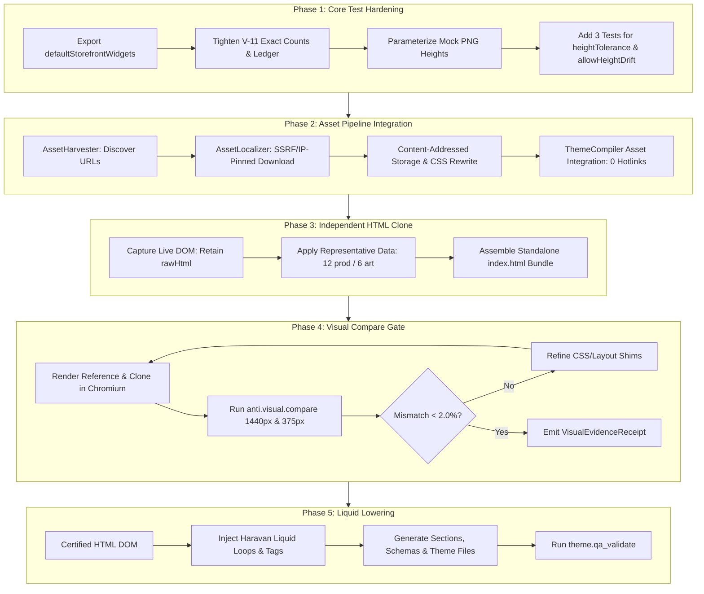

# Independent HTML Clone & Visual Fidelity Pipeline

## Overview
This plan executes the definitive architectural pivot for AntiFan: transitioning from a lossy `Reference -> Archetype -> Liquid` pipeline to an evidence-backed `Reference -> Asset Localization -> Independent HTML Clone -> Visual Compare (<2%) -> Liquid Lowering` pipeline.

Core runtime acts as the immutable, authoritative "Judge" (with re-locked mask ledgers and verified height drift parameters), while the new pipeline ensures 100% zero-hotlink asset independence and authentic live DOM fidelity before any Liquid code is emitted.

## Goals

| # | Goal | Priority |
|---|------|----------|
| 1 | Re-lock Core Test Contract: exact mask counts, no iframe[id] leak, dedicated tests for heightTolerance & allowHeightDrift | P1 |
| 2 | Wire AssetLocalizer directly into ThemeCompiler: 100% local assets, zero external origin hotlinks | P1 |
| 3 | Build Independent HTML Clone Generator: preserve raw live DOM nesting/styles, representative data sampling (12 products / 6 articles) | P1 |
| 4 | Prove Visual Fidelity: run `anti.visual.compare` between Reference and HTML Clone to reach < 2.0% diff on Chromium | P1 |
| 5 | Liquid Lowering & Haravan Theme Export: mechanically lower certified HTML to Haravan Liquid sections/schemas | P1 |

## Phases

| # | Phase | Status | Effort | Dependencies |
|---|-------|--------|--------|--------------|
| 1 | [Phase 1: Core Test Contract Hardening & Height Drift Assertion](./phase-01-core-test-hardening.md) | Pending | 2h | None |
| 2 | [Phase 2: Asset Pipeline Integration: Harvester to Localizer to Compiler](./phase-02-asset-pipeline-integration.md) | Pending | 4h | Phase 1 |
| 3 | [Phase 3: Raw DOM Preservation & Independent HTML Clone Generator](./phase-03-raw-dom-preservation-and-html-clone.md) | Pending | 4h | Phase 2 |
| 4 | [Phase 4: Visual Compare Proof & Fidelity Verification Gate](./phase-04-visual-compare-fidelity-gate.md) | Pending | 3h | Phase 3 |
| 5 | [Phase 5: Liquid Lowering & Haravan Theme Export](./phase-05-liquid-lowering-and-haravan-export.md) | Pending | 3h | Phase 4 |

## Architecture & Data Flow

## Success Criteria

- [ ] All 53+ tests pass in `test/main/visual-compare-mask-ledger.test.ts` with exact assertions and dedicated tests for height controls.
- [ ] Compiled theme output contains 0 external origin asset hotlinks.
- [ ] Independent HTML Clone renders completely offline and achieves < 2.0% visual mismatch on desktop and mobile.
- [ ] Haravan theme compiles cleanly and passes all `theme.qa_validate` platform checks.

<!-- slug: independent-html-clone-and-fidelity-pipeline -->
