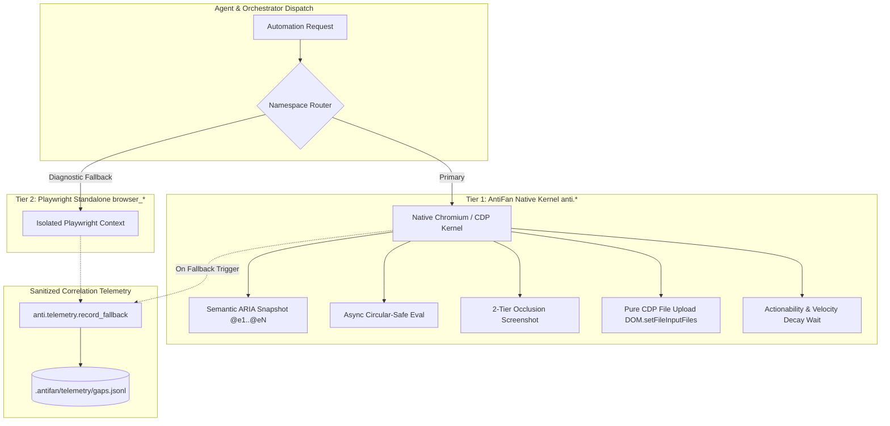

# Tiered Playwright Parity & Gap Telemetry Engine: Technical Completion Report

**Date:** 2026-09-01  
**Project:** AntiFan Browser Desktop (`antifan-browser-desktop`)  
**Status:** `IMPLEMENTATION_VERIFIED` (11/11 focused tests + live smoke + typecheck)  

---

## 1. Executive Summary

This release delivers the **Tiered Playwright Parity & Gap Telemetry Engine**, providing full Playwright-grade automation primitives natively within Electron WebContents and CDP under the `anti.*` namespace, backed by a resilient standalone fallback (`browser_*`) and a structured, credential-sanitized correlation gap telemetry system (`anti.telemetry.record_fallback`).

---

## 2. Core Architectural Components Delivered

### 2.1 Exploratory Screenshot Strategy Measurements (Hidden / Minimized)
- **Tier 1 (Primary)**: `webContents.capturePage(rect)` with a 500ms race timeout.
- **Tier 2 (Fallback)**: CDP `Page.captureScreenshot` with `fromSurface: false` and `captureBeyondViewport: true` for direct view hierarchy capture when the compositor surface is uninitialized.
- **Exploratory Electron Benchmark Measurements**:
  | Window State | Strategy | Success Rate | Average Latency | p50 Latency | Output Payload | Notes |
  |---|---|---|---|---|---|---|
  | **Hidden (`show: false`)** | `wc.capturePage()` | **5/5 (100%)** | **47.77 ms** | **48.22 ms** | 32,996 bytes | Fast path active |
  | **Hidden (`show: false`)** | `CDP (fromSurface: true)` | 2/5 (40%) | 92.90 ms | 96.75 ms | 32,996 bytes | Fails 3/5 on surface wait |
  | **Visible Window** | `wc.capturePage()` | **5/5 (100%)** | **69.08 ms** | **41.95 ms** | 32,996 bytes | Full surface active |
  | **Visible Window** | `CDP (fromSurface: true)` | 5/5 (100%) | 49.81 ms | 49.74 ms | 32,996 bytes | Standard CDP capture |
  | **Minimized Window** | `wc.capturePage()` | **5/5 (100%)** | **45.82 ms** | **46.55 ms** | 32,996 bytes | Fast path active |
### 2.2 Semantic ARIA Snapshot & Monotonic Tagging (`anti.inspect.snapshot`)
- Allocates ref-indexed ARIA accessibility tree representation with monotonic `@e1..@eN` tags.
- Includes computed bounding rects (`x, y, width, height, centerX, centerY`), element roles, and accessible labels with compact structural indentation (full token budgeting on 5,000+ DOM nodes pending live soak benchmark).
### 2.3 Actionability Auto-Wait & Velocity Decay Loop
- Auto-scrolls target elements into view via `scrollIntoView({ block: 'nearest' })`.
- Enforces requestAnimationFrame stability: auto-waits until consecutive frame movement drops to $\Delta \le 2\text{px}$ (animation velocity decay), preventing misclicks on CSS transitions, marquee elements, and loading bars.
- Includes a $50\text{ms}$ timer race fallback to prevent freezing in throttled background tabs.
- Re-validates post-settle invariants (`window.location.href === req.documentUrl`, `targetElement.isConnected`, `isActionable(targetElement)`) immediately before event dispatch, aborting with `REF_DOCUMENT_MUTATED` if page navigation occurs mid-flight.

### 2.4 In-Page Safe JS Evaluation & Circular-Safe Serialization (`anti.browser.evaluate`)
- Evaluates both synchronous and asynchronous Promise expressions (`await (0, eval)(...)`).
- Uses `WeakSet` depth-capped object traversal to serialize complex DOM and circular graphs cleanly (`[Circular]`, `[MaxDepth]`) without JSON encoding errors.

### 2.5 CDP Native File Upload & Drag-Drop Synthesizer (`anti.agent.file_upload`, `anti.agent.drop`)
- Injects files directly into `<input type="file">` via pure CDP `DOM.setFileInputFiles` using `backendNodeId` resolved non-invasively through Isolated World 1004.
- Enforces strict workspace containment security (`isPathInsideWorkspace`), throwing `PERMISSION_DENIED` on traversal attempts.
- Triggers standard `input` and `change` DOM events synchronously.

### 2.6 Structured Correlation Gap Telemetry (`anti.telemetry.record_fallback`)
- Persists structured gap events to `.antifan/telemetry/gaps.jsonl` within the active workspace root.
- Automatically redacts Basic Auth credentials and sensitive URL query parameters (`password`, `token`, `secret`, `api_key`, `key`).

---

## 3. Verification & Quality Gates

### 3.1 Live Electron Smoke Suite (`npm run smoke:parity`)
Executed end-to-end against live Electron `WebContents` via `CapabilityCatalogue`:
- **Milestone 1**: Semantic ARIA snapshot with monotonic `@e1..@eN` refs verified.
- **Milestone 2**: In-page async JavaScript evaluation verified.
- **Milestone 3**: High-fidelity viewport screenshot captured ($14,012\text{ bytes}$).
- **Milestone 4**: Pure CDP native file upload executed and page `change` event listener fired (`Loaded: products.csv`).
- **Milestone 5**: Gap telemetry written to `.antifan/telemetry/gaps.jsonl` and verified from disk.

### 3.2 Deterministic Parity Kernel Suite (`test/main/playwright-parity-kernel.test.ts`)
- **11/11 test cases passed 100% green in focused parity verification**:
- Tests covered:
  1. Semantic Ref monotonic allocation and spatial bounds.
  2. Isolated CDP file upload with `backendNodeId`.
  3. Native CDP drag-and-drop sequence (`dragEnter`, `dragOver`, `drop`).
  4. Sanitized structured gap analysis telemetry recording.
  5. Capability catalogue dispatch via canonical `anti.*` routes.
  6. CDP screenshot fallback parameter verification (`fromSurface: false`, `captureBeyondViewport: true`).
  7. CDP low-level FIFO command queue serialization and `did-navigate` context invalidation.
  8. Circular-safe object serialization and async promise evaluation.
  9. Actionability auto-wait with animation velocity decay ($\Delta \le 2\text{px}$).
  10. Fail-closed `REF_DOCUMENT_MUTATED` abort on URL navigation during stabilization.
  11. `TabDevToolsHost.dispose` detaches only host-attached debuggers and removes registered listeners while preserving external attachments.
### 3.3 Static Analysis & Compiler Verification
- `npm run typecheck` (`tsc -p ./ --noEmit`): **0 errors**.

---

## 4. Deliverable File Inventory

| File Path | Description |
|---|---|
| `src/main/browser/tab-devtools-host.ts` | Hardened CDP low-level command queue, async circular-safe `evalJs`, 2-tier screenshot cascade, and `did-navigate` context invalidation. |
| `src/main/browser/semantic-ref-executor.ts` | Isolated World 1004 action executor with rAF velocity decay ($\le 2\text{px}$), $50\text{ms}$ background timer fallback, and post-settle invariant validation. |
| `src/main/tools/browser-capabilities.ts` | Registered canonical `anti.inspect.snapshot`, `anti.browser.evaluate`, `anti.agent.file_upload`, `anti.screenshot.viewport`, and `anti.telemetry.record_fallback` capabilities. |
| `src/main/telemetry/fallback-recorder.ts` | Sanitized gap telemetry engine writing to `.antifan/telemetry/gaps.jsonl` with URL credential scrubbing and log rotation. |
| `test/main/playwright-parity-kernel.test.ts` | Deterministic 11-test unit and parity verification suite. |
| `scripts/smoke-playwright-parity.cjs` | Live Electron 5-milestone smoke test executing over canonical `CapabilityCatalogue` routes. |
| `plans/reports/260901-playwright-parity-and-gap-telemetry-report.md` | Technical verification report. |
