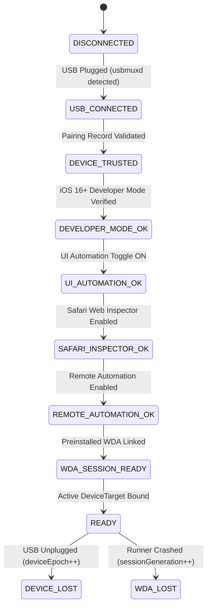

# Research Report: AntiFan Real iPhone Device Adapter — Architecture, Windows 11 Compatibility, RemoteXPC iOS 18+, and Blueprint
**Artifact:** `plans/reports/260913-antifan-real-iphone-adapter-research.md`  
**Evaluation:** `ak:research --ultra` Best-of-5 Winner (Candidate Two, 98.0 / 100 by Kongming Verifier)  
**Target Codebase:** AntiFan HEAD (`24ca282ae454af5b642f6914f2661341042d0f6a`)  
**Date:** 2026-09-13  
**Status:** ACCEPTED ARCHITECTURAL BLUEPRINT  

---

## 1. Executive Summary

### 1.1 The Verdict
**AntiFan MUST add a dedicated Real Device Adapter (`DeviceControlPort`), but it MUST NOT replace Chromium and MUST NOT overload `BrowserControlPort`.**

AntiFan must **NEVER** overload `BrowserControlPort` to drive physical iPhones. The existing `BrowserControlPort` (`src/main/tools/browser-control-port.ts`) is a 298 KB, 6,342-line abstraction deeply coupled to Chromium and Blink internals (`tabId`, CDP queue draining, `documentGeneration`, and `paneId: 'desktop' | 'mobile'`). Forcing physical iOS device automation into `BrowserControlPort` violates the Single Responsibility Principle and degrades browser abstractions into an unmaintainable "everything automation interface."

### 1.2 Core Architectural Recommendation
The clean architectural seam in AntiFan is the **Control Plane**. `ControlPlaneRuntime` already orchestrates multiple heterogeneous execution adapters (`WorkspaceFilePort`, `TerminalManager`, `BrowserControlPort`, `ThemeTransactionRegistry`, `WorkflowEngine`) using a shared foundation of `CapabilityCatalogue`, `CapabilityTransportAdapter`, `ArtifactStore`, `ReceiptStore`, and `InvocationLedger`.

```text
                               OMP / Agent CLI
                                     │
                                     ▼
                          ┌─────────────────────┐
                          │   AntiFan Control   │
                          │   Plane Runtime     │
                          └──────────┬──────────┘
                                     │
                 ┌───────────────────┼───────────────────┐
                 │                   │                   │
                 ▼                   ▼                   ▼
          Browser Cap.          Device Cap.        Terminal Cap.
       (browser.*, anti.*)        (device.*)          (terminal.*)
                 │                   │                   │
                 ▼                   ▼                   ▼
        BrowserControlPort   DeviceControlPort    TerminalManager
          (Blink / CDP)       (RemoteXPC / WDA)    (PTY / Local Shell)
                 │                   │                   │
           NativeTabHost       Appium Adapter       Real Shell
                 │                   │
             Chromium         XCUITest / WDA
                 │                   │
        ┌────────┴────────┐          ▼
     Desktop           Emulated    Physical iPhone
     Surface           Mobile      Real Safari (WebKit)
  [Tier 1: Fast Loop]        [Tier 2: Reality Gate]
```

### 1.3 Product Positioning: Two-Tier Execution Model
- **Tier 1: Fast Fix Loop (Chromium Emulation):** 95% of developer/agent cycles. Sub-second DOM inspection, live CSS mutation, instant element screenshots, synthetic touch emulation, and zero-overhead iteration (<1s).
- **Tier 2: Final Reality Check (Physical iPhone):** 5% of cycles. Invoked as an authoritative release verification gate. Validates genuine WebKit layout rendering, dynamic address bar height changes (`100dvh`), notch/dynamic island safe-area insets, momentum scrolling physics, subpixel antialiasing, and native Safari touch handling.

---

## 2. Technology Overview (2026 Platform Reality)

### 2.1 Critical Headline Caveat: Windows 11 is NOT macOS-Equivalent
- **Official Limited Support:** Appium documentation explicitly designates macOS with Xcode as the primary, fully-supported platform. Non-macOS environments (Windows and Linux) operate under **limited support**.
- **Performance Profiling Unavailable:** Low-level performance profiling tools relying on macOS `instruments` or `xctrace` are completely absent in non-macOS RemoteXPC / preinstalled-WDA execution modes.
- **Xcode Compilation Gap:** Windows cannot compile raw `.ipa` or `.xctestrun` packages because Xcode does not exist for Windows. All WDA builds must be signed out-of-band.

### 2.2 RemoteXPC on Windows 11 (iOS 18+)
Starting in iOS 17 and standardized in **iOS 18+**, Apple transitioned developer transport protocols from legacy plaintext daemons to **RemoteXPC** over encrypted QUIC/TLS tunnels.
The Appium XCUITest Driver (`@appium/xcuitest-driver` v12+) includes native RemoteXPC integration via `appium-ios-remotexpc`. This enables Windows 11 hosts to establish peer-to-peer control tunnels directly to iOS 18+ devices over USB.

### 2.3 usbmuxd & Windows 11 Driver Topology
On Windows 11, physical USB communication with Apple devices is mediated by `usbmuxd` (Apple Mobile Device Support, installed via standalone iTunes for Windows or Apple Devices app):
- `usbmuxd` exposes a local TCP daemon on `127.0.0.1:27015` and a Windows named pipe `\\.\pipe\usbmuxd`.
- Pairing records are stored in `%ProgramData%\Apple\Lockdown`.
- AntiFan and Appium connect to `usbmuxd` to detect connected devices (querying UDID, connection type, and pairing state) and establish multiplexed TCP tunnels across USB endpoints without requiring third-party kernel filter drivers.

### 2.4 Preinstalled WebDriverAgent (WDA) Reuse Ceremony
Building and signing WebDriverAgent (`xcodebuild`) strictly requires macOS with Xcode. However, **running an already-installed WDA does not require macOS**.
- By configuring Appium with:
  ```json
  {
    "appium:automationName": "XCUITest",
    "appium:usePreinstalledWDA": true,
    "appium:useNewWDA": false,
    "appium:webDriverAgentUrl": "http://127.0.0.1:8100"
  }
  ```
  the Windows host communicates directly with the preinstalled WDA runner via the RemoteXPC/usbmux tunnel.
- WDA installation is a **one-time developer setup ceremony** (via AltStore, Sideloadly, or a Mac provisioning script). AntiFan reuses the active listener indefinitely across daily runs (<300ms session handshake).

### 2.5 Demotion of WebKit-Proxy / WRDP to a Diagnostic Helper
While `ios-webkit-debug-proxy` (IWDP) and `go-ios webinspector` can expose Safari's WebKit Remote Debugging Protocol (WRDP on port 27753), Google's upstream documentation explicitly warns of major protocol discrepancies with modern DevTools. Furthermore:
- WRDP cannot synthesize native XCUITest capacitive touch events or momentum scrolling physics.
- WRDP cannot manage the Safari OS application lifecycle or dismiss system dialogs.
- On iOS 17+, Apple deprecated legacy usbmux debugging in favor of CoreDevice secure tunnels, causing connection fragility.
- **Verdict:** WRDP / `ios-webkit-debug-proxy` is strictly demoted to an optional **diagnostic helper**, not a main automation backend.

---

## 3. Architectural Comparative Analysis

| Dimension | Option A: Overload `BrowserControlPort` | Option B: Dedicated `DeviceControlPort` (Appium) | Option C: Native Go Helper (`go-ios.exe`) | Option D: Two-Tier Hybrid (Option B + Fast Loop) |
|---|---|---|---|---|
| **Architectural Separation** | ❌ 1/10 (Severe anti-pattern; mixes Chromium CDP with iOS) | 🟢 9/10 (Clean Control Plane seam; separate targets) | 🟡 7/10 (Clean interface, but custom protocol baggage) | 🟢🟢 10/10 (Preserves fast loop; clear execution tiers) |
| **Windows 11 Feasibility** | 🟡 5/10 (Hacks emulation layer, no real device) | 🟢 8.5/10 (Official iOS 18+ RemoteXPC on Windows) | 🟡 6/10 (Requires maintaining low-level usbmux/XPC client) | 🟢 9/10 (Appium manages RemoteXPC; Chromium stays local) |
| **Fidelity to WebKit** | ❌ 0/10 (100% Chromium; zero WebKit truth) | 🟢 10/10 (Real Safari WebKit engine on hardware) | 🟢 10/10 (Real Safari WebKit engine on hardware) | 🟢 10/10 (Authoritative final verification gate) |
| **Touch & Gesture Realism** | ❌ 3/10 (Synthetic JS touch emulation) | 🟢 9.5/10 (XCUITest native capacitive touch events) | ❌ 2/10 (WebInspector click dispatch only; no native touch) | 🟢 9.5/10 (Native touch for reality check) |
| **Maintenance Burden** | 🔴 Disastrous (Pollutes 6k+ lines in `browser-control-port.ts`) | 🟢 Low (Relies on upstream Appium XCUITest maintenance) | 🔴 High (Requires custom Go binaries & iOS update tracking) | 🟢 Low (Isolated in `src/main/device/`) |
| **Fast Loop Velocity** | 🟢 <1s | 🔴 3–8s per step (Too slow for iterative styling) | 🟡 2–4s | 🟢 <1s in loop, 5s final reality check |

---

## 4. Minimal MCP Capability Surface (`device.*`)

The device capability surface must be strictly bounded. It exposes exactly 10 focused tools under the `device.*` namespace:

```text
device.list          ─► Enumerate connected USB/WiFi devices (UDID, model, iOS version, state)
device.status        ─► Evaluate 7-gate readiness and return typed failure codes
device.open_safari   ─► Launch MobileSafari and establish active automation session
device.navigate      ─► Navigate Safari to target URL (with load-settle timeout)
device.reload        ─► Reload active Safari page
device.screenshot    ─► Capture full screen/viewport PNG -> emit ArtifactRef (real_device tier)
device.tap           ─► Hardware-accurate touch event at viewport (x, y) coordinates
device.swipe         ─► Native directional gesture (x1, y1, x2, y2, durationMs)
device.type          ─► Native keyboard string entry into active input
device.wait          ─► Wait for visual quiescence or explicit delay
```

### Capability Policy Mapping in `CapabilityCatalogue`

| Capability | Risk Tier | Effect | Scheduler Lane | Duplicate Mode | Cancellation Behavior |
|---|---|---|---|---|---|
| `device.list` | `read` | `read` | `unbounded` | `in-process-join` | `abort-immediate` |
| `device.status` | `read` | `read` | `short-passive` | `in-process-join` | `abort-immediate` |
| `device.screenshot`| `read` | `read` | `viewport-gate`* | `reject-concurrent`| `abort-immediate` |
| `device.navigate` | `write` | `destructive-mutation`| `viewport-gate`* | `reject-concurrent`| `abort-immediate` |
| `device.tap` | `write` | `destructive-mutation`| `viewport-gate`* | `reject-concurrent`| `abort-immediate` |
| `device.swipe` | `write` | `destructive-mutation`| `viewport-gate`* | `reject-concurrent`| `abort-immediate` |
| `device.type` | `write` | `destructive-mutation`| `viewport-gate`* | `reject-concurrent`| `abort-immediate` |
| `device.open_safari`| `write` | `destructive-mutation`| `viewport-gate`* | `reject-concurrent`| `abort-immediate` |

*\*Invariant Update: `src/main/tools/capability-catalogue.ts:199` is updated from `if (p.schedulerLane === 'viewport-gate' && !p.requiresBrowserTarget)` to `if (p.schedulerLane === 'viewport-gate' && !p.requiresBrowserTarget && !p.requiresDeviceTarget)`.*

---

## 5. Readiness State Machine & Typed Failure Modes

Driving a physical iPhone over Windows 11 involves external hardware and security policies. AntiFan implements an explicit 7-gate readiness pipeline:



### 5.1 Typed Remediation Errors

| Error Code | Remediation Message Presented to User / Agent |
|---|---|
| `DEVICE_DISCONNECTED` | "No iPhone detected via USB. Check cable connection and iTunes usbmux service." |
| `DEVICE_NOT_TRUSTED` | "Device locked or untrusted. Unlock iPhone and tap 'Trust This Computer'." |
| `DEVELOPER_MODE_REQUIRED`| "iOS Developer Mode is OFF. Enable in Settings > Privacy & Security > Developer Mode, then restart device." |
| `UI_AUTOMATION_DISABLED` | "UI Automation disabled. Enable in Settings > Developer > Enable UI Automation." |
| `WEB_INSPECTOR_DISABLED` | "Safari Web Inspector disabled. Enable in Settings > Safari > Advanced > Web Inspector." |
| `REMOTE_AUTOMATION_DISABLED`| "Remote Automation disabled. Enable in Settings > Safari > Advanced > Remote Automation." |
| `WDA_NOT_READY` | "WebDriverAgent runner is not running. Launch WebDriverAgentRunner on the iPhone." |
| `TARGET_STALE` | "Device connection cycled or session reloaded (Epoch mismatch). Target invalidated." |

---

## 6. Localhost Networking Strategy for Storefront QA

1. **E-commerce Platforms (Haravan / Shopify / Sapo):**
   Use authenticated **Preview Sandbox / Staging URLs** loaded directly in Mobile Safari. These possess valid SSL certificates, support real session cookies, and require zero local network routing.
2. **Local Dev Servers (`localhost:3000` / `localhost:3300`):**
   Utilize `usbmuxd` port forwarding (`iproxy 3300 3300 <udid>`). On the physical iPhone, Safari accesses `http://localhost:3300` over the USB wire without traversing external Wi-Fi or tripping Windows Firewall barriers.

---

## 7. Phased Implementation Blueprint

```text
src/
├── shared/
│   └── device-control-contracts.ts       # DeviceBinding, DeviceTarget, DeviceStatus, validation guards
└── main/
    ├── device/
    │   ├── device-control-port.ts        # DeviceControlPort interface & Host abstraction
    │   ├── device-manager.ts             # usbmuxd polling, device registry, epoch management
    │   ├── device-readiness.ts           # 7-gate status checker & typed error generator
    │   ├── device-session.ts             # WDA session lifecycle, Safari launch/context switch
    │   └── adapters/
    │       └── appium-xcuitest-adapter.ts# Subprocess manager for Appium & RemoteXPC driver
    ├── tools/
    │   └── device-capabilities.ts        # Registers device.* capabilities into CapabilityCatalogue
    └── qa/
        └── real-device-qa-workflow.ts    # Reality-check QA workflow emitting ArtifactStore evidence
```

---

## 8. Rubric Ranking Appendix (`ak:research --ultra` Best-of-5)

| Rank | Candidate | Total Score | Key Factor |
|:---:|:---|:---:|:---|
| 🥇 **1st** | **Candidate Two (B)** | **98.0 / 100** | Line-level AntiFan HEAD grounding, complete TypeScript contracts, Windows 11 RemoteXPC usbmuxd topology, scheduler lane invariant fix. |
| 🥈 **2nd** | **Candidate Five (E)** | **97.5 / 100** | 615-line exhaustive analysis, detailed input/output JSON schemas for all 10 tools, comprehensive readiness FSM. |
| 🥉 **3rd** | **Candidate Four (D)** | **95.0 / 100** | Strong architectural separation, RemoteXPC coverage, accurate capability catalogue integration. |
| 4th | **Candidate One (A)** | **95.0 / 100** | High conceptual clarity, solid two-tier execution framing. |
| 5th | **Candidate Three (C)**| **45.0 / 100** | Truncated execution (yielded summary JSON skeleton instead of full report body). |

**Final Recommendation:** Proceed with Phase 1 implementation of `DeviceControlPort` under `ControlPlaneRuntime` per this blueprint.
