# Phân tích chung: 2 artifact remediation AntiFan + kiểm chứng độc lập

- Thời điểm: 2026-09-18 00:36 (+07:00). Repo `E:\Work\apps\AntiFan`, HEAD `36994303cfb2dd1e34664c13c0d4c958c97a4225`.
- Phạm vi phiên này: **read-only**. Không sửa file nào trong `src/`, `packages/`, `scripts/`, `test/`; không `npm run`; không restart app; **không ghi vào verification register**; không `git stash`/`reset`.
- Quy ước mức bằng chứng: **[T1]** đo live trong phiên này · **[T2]** đọc source/đĩa · **[INFERENCE]** suy luận chưa chứng minh. Số liệu trích từ hai artifact được ghi rõ là *kế thừa*.
- Lệnh evidence (rút gọn): `git rev-parse HEAD`, `git status --short`, `git diff --stat`, `wc -l`/`cmp`/`stat` trên `E:\Work\.antifan-data\issues\*`, `tasklist`/`wmic`, `read` source, `grep`, và 3 probe MCP live.

---

## 0. Đọc một mục

Hai artifact **không mâu thuẫn về cơ chế**; chúng ở **hai tầng khác nhau**: A1 là chẩn đoán (độ rộng, có phản biện độc lập), A2 là hợp đồng thi hành (8 bước đã chấm, mỗi bước 1 probe). Vấn đề của A2 **không phải lý luận mà là phạm vi** — nhưng con số phải chính xác: sau khi kiểm lại từng dòng (§4), A2 **bỏ 3 mục đã được chứng minh** (G1 advertise, G3 quota-adoption, và G1 kèm **tự mâu thuẫn với R6 + quyết định đã ghi của anh**), **kế thừa 1 defect dạng số-ít** trong chính bước 8 (G2), và **cả hai artifact cùng bỏ 2 mục** (G6 registry, G8 ngân sách lock). Bản đầu của tài liệu này ghi "4 mục" — trong đó 1 mục tôi gắn nhãn sai và 1 mục của A1 đã lỗi thời; xem §4 để biết cái nào bị rút.

Năm phát hiện **mới** của phiên này:

1. **[T1/T2] Toàn bộ probe live hiện bất khả thi**: 3/3 call MCP bị từ chối `RUNTIME_MISMATCH: Capability request Runtime does not match the active control plane`. Cả hai artifact đều giả định surface MCP sống; **cả hai probe nghiệm thu bước 1 và bước 2 đều là call live** ⇒ thiếu một *bước 0*. **Cơ chế đã truy được (§3.3)**: `attachment-registry.ts` replay lúc boot **không** validate `runtimeId`/`state`/hạn (`:112-168`), `renewAttachment` **không** validate `runtimeId` (`:937-1003`), nên cổng duy nhất còn lại là `capability-catalogue.ts:380`. Hệ quả đo được: **2.841 record** (đếm lại 09-18 00:59) với **2.818 `active`** (chỉ 23 `revoked`) — trong đó **2.444** mang `runtimeId` ≠ binding hiện tại và **218** vừa còn hạn vừa sai id; và **`hostEpoch` = 1 trên toàn bộ 2.818 record** ⇒ trục staleness thứ hai là **mã chết** (§9.1 Đ3). Đây là **defect mới mà cả A1 lẫn A2 đều không có** (§4 G6).
2. **[T1] App CHƯA hề restart**: process chính `pid 18004`, `uptimeMs 42.533.694` (~11h49m) ⇒ khởi động **≈ 12:46:12 ngày 2026-09-17**, trong khi register được ghi lần cuối **13:22:53** cùng ngày ⇒ **đĩa đổi sau khi process nạp 36m41s**. Mốc này **ủng hộ** giả thuyết staleness lúc khởi tạo của A1 §4.4 nhưng **không tự nó chứng minh** RAM lệch (nếu chính `pid 18004` viết lúc 13:22 thì RAM của nó là mới nhất) — bằng chứng độc lập vẫn là `totalCount:0`. Và nó nghĩa là **R8 (restart) vẫn chưa được dùng** — khẩu súng vẫn còn đạn trong tiến trình đang sống.
3. **[T2] Sửa lại một chi tiết cơ chế của A1 §4.2**: bộ đếm adoption **có** prune, nhưng prune **lười** (chỉ chạy khi đã chạm cap) và tiêu chí prune là `this.tabs.has(id)`. Hệ quả: tab **sống nhưng vô hình** (offscreen/ephemeral — bị `getTabList` ẩn theo thiết kế) **ghim cap vĩnh viễn** mà không lần prune nào loại được. Đây là cách sửa đúng hơn "giải phóng slot khi tab đóng".
4. **[T1/T2] Artifact "brainstorm usage counter" của phiên trước đã bị workstream B vượt qua** (phase-03 per-name aggregate + `#mcpDispatchProvenance` + gate `accounting:mcp-dispatch`) ⇒ ghi nhận **superseded**, không để tồn tại như hai spec song song.
5. **[T1] Môi trường đã trôi khỏi A2**: 66 status entry (A2 ghi 65), ledger `control-plane-v2/invocations` = **1.053 entry / 1.046 file `.jsonl`** (A2 ghi 1.046), `tabCount` 17 → 3. Mọi anchor/số liệu trong hai artifact phải được re-derive, không được tin nguyên.

---

**Điều đã sửa so với bản đầu của chính tài liệu này** (sau phản biện §9): (a) "A2 bỏ M1/M3" — **sai**, bước 8 có *claimable*; thay bằng bẫy `listSessions` số-ít thật (§4 G2); (b) "master-token bị bỏ sót" — **sai**, A2 hoãn tường minh; (c) "`[object Object]` cần fix 5 dòng" — **lỗi thời**, đã ở HEAD; (d) "207 lần luân chuyển runtimeId" — **sai cách đọc**, là **207** id khác nhau trên các **record** `active` (`record.lease.runtimeId`), **không** phải "trên các revision" — `MainResolvedAuthority` **không có** `runtimeId` cấp cao nhất (chỉ `browserTarget.runtimeId` lồng nhau + `runtimePid` + `runtimeLeaseToken`), nên revision không mang id cấp cao nhất.

---

## 1. Hai artifact ở hai tầng khác nhau

| | **A1** = `plans/reports/260918-0040-antifan-weakness-audit-and-remediation.md` | **A2** = `plans/handoffs/antifan-weakness-remediation-20260918-0026.md` |
|---|---|---|
| Loại | Báo cáo chẩn đoán (396 dòng) | Hợp đồng tiếp nối cho agent kế nhiệm (385 dòng) |
| Trả lời câu hỏi | "Cái gì sai, sai bao nhiêu lần, vì sao" | "Làm gì, theo thứ tự nào, probe nào chứng minh" |
| Đơn vị công việc | 7 item người dùng + 4 defect mới + 14 nhóm lỗi theo tần suất + 4 đợt sửa (0–3) | 8 bước bắt buộc, thứ tự đã chấm, mỗi bước **1 probe nhị phân** |
| Cơ chế quyết định | best-of-5 candidate + 1 verifier adjudicate | kế thừa phán quyết đó, biên dịch thành hành động |
| Ràng buộc vận hành | non-goals (§4.6), "không phải defect" (§5), câu hỏi mở (§7) | quyền hạn, cấm đoán Level-0, bảng phê duyệt 5 mục, dirty-tree warning |
| Điểm mạnh riêng | Nêu **đủ** phạm vi; tự sửa số liệu khi candidate phản biện (41 → 84 namespace chết; 6 instance) | Nêu **thứ tự đúng**; cảnh báo `record_claim`=cò súng; yêu cầu fixture temp cho guard |
| Điểm yếu riêng | Không có probe nhị phân cho từng mục; 4 đợt không map 1-1 sang 8 bước | **Bỏ sót mục** (xem §4); **không có bước kiểm tra reachability** |

Kết luận tầng: A2 là bản "nén" trung thực của A1 — nhưng phép nén **mất mục**, và cả hai cùng giả định một surface MCP đang sống.

---

## 2. Đối chiếu: đồng thuận, khác biệt, trôi số liệu

### 2.1 Đồng thuận cơ chế (A1 ≡ A2)

| Chủ đề | Cơ chế | Nguồn |
|---|---|---|
| P0 register | `listVerifications` chỉ đọc `this.verifications`; `rewriteVerificationsFile` ghi nguyên khối, không guard rỗng | A1 §4.4, A2 §4.1 — **tôi đọc lại source xác nhận** (§3.1) |
| `tabs.list` nói dối | nhánh mặc định truyền `undefined` target nên không bao giờ tới site đánh dấu duy nhất | A1 §0/§6, A2 §4.2 — **xác nhận** (§3.2) |
| Lớn nhất & bị bỏ sót | TARGET_MISMATCH 91 + TARGET_STALE 21 = 112 > 41 (xdev) | cả hai, cùng số |
| Media freeze không chặn được WAAPI | freeze chỉ chạm `el.pause()`, `pauseAnimations()`, 1 rule CSS; **không có** `getAnimations` | A1 §4.4, A2 §4.4 — giống nhau |
| `StabilityPolicyEvaluator` = policy chết | 0 consumer production; bật gate thành hard-gate sẽ **làm vỡ** capture đang chạy | A1 §4.3, A2 §4.3 |
| Split terminal là pane độc lập | người dùng xác nhận kèm ảnh | A1 §7, A2 §4.5 |
| Thứ tự | D (register) → tabs.list → drain code → xdev → capture cluster → terminal/hook | camera cùng thứ tự |
| Kỷ luật | không nới test; không thêm tên tool MCP khi chưa chạy `accounting:mcp-dispatch`; không `force` | camera cùng |

### 2.2 Khác biệt thật (không phải mâu thuẫn)

| # | A1 | A2 | Đọc đúng |
|---|---|---|---|
| 1 | 4 đợt sửa (0–3), 19 mục | 8 bước có probe | A2 **thu hẹp**: chỉ những gì có probe nhị phân mới thành bước. Phần bị thu hẹp **không biến mất** mà thành vô chủ (§4) |
| 2 | §4.5 master-token bypass: "P0 lặp lại ở 4 báo cáo độc lập" | **không có bước nào** | Đây là mục giá trị cao bị bỏ khỏi hợp đồng |
| 3 | §4.3 `[object Object]` ở `capability-transport.ts:1086`, fix ~5 dòng, mẫu đúng đã có trong repo | **không có bước nào** | Bỏ khỏi hợp đồng dù A1 gọi là "rẻ nhất, chắc chắn" |
| 4 | đợt 4: Core Health D1–D11 (cần approval vì ghi store) | `core.candidates` bị chặn bởi "no new MCP tool name without accounting gate" | Không mâu thuẫn: đợt 4 **buộc** phải chờ §4 (xdev/reachability) — nhưng A2 không nói rõ điều đó |
| 5 | "Số 41 không chỉ là `evaluate`" → fix `expressionFile` một mình không đủ | chọn `xdev:false` với precheck + revert | A2 **hẹp hơn nhưng đúng hơn** nếu precheck pass; R3 vẫn nguyên |

### 2.3 Trôi số liệu **[T1]**

| Số | A2 ghi (00:26) | Hôm nay (00:35) | Ý nghĩa |
|---|---|---|---|
| `git status --short` entries | 65 | **66** | có session khác đang ghi |
| `control-plane-v2/invocations` | 1.046 file | **1.053** | +7 file trong 9 phút |
| `main.log` tabCount | (không ghi) | **17 → 3** | người dùng đang đóng tab song song |
| `attachments-v1.jsonl` | (không ghi) | 11,6 MB, mtime **00:35** | attachment vẫn đang được cấp |
| App uptime | (không ghi) | 11h49m, pid 18004 | **chưa restart** |

⇒ Mọi anchor dòng (**kể cả anchor trong A1/A2**) phải re-read trước khi sửa. Hai artifact đều đã tự cảnh báo điều này (A1 §6 caveat 2, A2 §8 pre-flight) — số liệu trên là bằng chứng định lượng cho cảnh báo đó.

**Trôi anchor cụ thể đã gặp [T2]:** A1/A2 trích `src/main/control-plane-runtime.ts:215` — file thật nằm ở `src/main/control-plane/control-plane-runtime.ts` (thiếu segment thư mục). **Số dòng 215 thì đúng** (tôi đã đọc và xác nhận `registerTerminalCapabilities` ở đúng dòng đó). ⇒ Chỉ là lỗi đường dẫn, nhưng trong một chương trình lấy anchor làm hợp đồng thì nó là loại lỗi phải sửa tại chỗ khi bước 8a được thi hành.

---

## 3. Kiểm chứng độc lập của phiên này

### 3.1 Xác nhận (claim → phương pháp → kết quả)

| Claim (A1/A2) | Phương pháp | Kết quả |
|---|---|---|
| `listVerifications` chỉ đọc RAM | `read issue-register.ts:836-861` | ✅ `let result = [...this.verifications]` rồi filter/sort/limit; **không** chạm đĩa **[T2]** |
| `rewriteVerificationsFile` ghi nguyên khối, không guard | `read issue-register.ts:945-958` | ✅ `this.verifications.map(...)`, temp + `renameSync`, lỗi → `DURABILITY_FAILED`; **không** nhánh nào kiểm `length === 0` **[T2]** |
| Register trên đĩa nguyên vẹn | `wc -l`, `stat`, `cmp` | ✅ 1.000 dòng, 1.831.100 B, mtime `2026-09-17 13:22:53.7156255`; backup **byte-identical** **[T1]** |
| `tabs.list` mặc định không đánh dấu | `read browser-capabilities.ts:1943-1953` + `read browser-control-port.ts:1520-1531` | ✅ `params?.all === false ? context.browserTarget : undefined`; site đánh dấu duy nhất ở `:1528` **[T2]** |
| Surface MCP thiếu `browser.wait` và `terminal.*` | `grep` trên bảng alias proxy | ✅ chỉ có `device.wait` (`:45`) và action `wait` trong `anti.agent.sequence` (`:68`); **không** có `browser.wait`, **không** có `terminal.*` **[T2]** |
| Gate completeness chỉ ép `core.*` | `read check-mcp-budget-dominance.mjs:239-288` | ✅ `resolved.startsWith('core.')` + vòng lặp catalogue `if (!entry.name.startsWith('core.')) continue;` **[T2]** |
| Master-token RPC đi vòng catalogue | `read bridge-server.ts:1889-1918` | ✅ guard `Forbidden` chỉ kích hoạt `if (boundAttachmentId && ...)`; cổng `UNAUTHENTICATED` chỉ chặn khi `typeof p.runtimeLease === 'object'` ⇒ socket master-token rơi xuống `case 'navigate'` **[T2]** |
| Quota tab: 2 cổng, thông điệp sai ngữ nghĩa | `read browser-control-port.ts:2989-3013` | ✅ cổng 1 `getManagedTabIds(...).size >= 10` → "**Terminal** tab limit reached (maximum 10 tabs per session)"; cổng 2 `adoptChildTab === false` → **đóng tab vừa tạo** + "session tab quota reached" **[T2]** |
| "Ba tool list, hai ngữ nghĩa" (A1 §6) | `read browser-capabilities.ts:265-270` | ✅ `browser.list-tabs` dùng `params?.all ? undefined : context.browserTarget` — mặc định **session-scoped**, **ngược** với `anti.browser.tabs.list` (`:1953`, mặc định whole-window); `grep` cho `antifan_list_tabs` (`:1101-1106`) cùng dạng ⇒ xác nhận bất đối xứng **[T2]** |
| Hai cổng đếm **hai tập khác nhau** (A1 §4.2) | `read native-tab-host.ts:6093-6124` | ✅ `getManagedTabIdsForBoundTab` trả **`new Set(pool)` không prune**; đường adopt prune (chỉ khi chạm cap) trước khi quyết ⇒ cổng 1 có thể từ chối bằng id chết mà cổng 2 đã loại **[T2]** |
| Workstream B là thật và đã có UI | `git status`, `read phase-03-per-name-aggregate.md:1-70`, `read test/renderer/mcp-stats-hub.test.ts` | ✅ `toolbar.ts` +11, `toolbar.html` +6, `toolbar.css` +16, test +76, `#mcpDispatchProvenance` là markup tĩnh có test ghim literal **[T1/T2]** |
| G1: `browser.wait` **đã đăng ký**, chỉ thiếu advertise (A1 đợt 1 #7) | `grep name: 'browser.wait'`, `read browser-capabilities.ts:434-438` | ✅ đăng ký đầy đủ (`risk: 'read'`, `requiresBrowserTarget: true`) và **đang được dùng nội bộ** ở `workflow-engine.ts:617` ⇒ primitive đã được chứng minh, không phải suy đoán; thiếu **duy nhất** dòng trong bảng alias proxy **[T2]** |
| G1/R6: `terminal.*` đăng ký **vô điều kiện** | `read src/main/control-plane/control-plane-runtime.ts:215` | ✅ `registerTerminalCapabilities(this.capabilities, this.terminal)` — không có cờ điều kiện ⇒ gate completeness chỉ-`core.*` để nó đi qua `npm run compile` im lặng **[T2]** |
| Census process: **hai họ bridge**, không phải một | `wmic process` + lọc command line; `grep "IssueRegister"` trên `src`+`scripts` | ✅ 4× `antifan-agent.cjs mcp` (PID 35104, 3288, 26428, 15076) **+ 4× `antifan-omp-mcp.cjs`** (PID 8768, 36164, 23980, 1648) ⇒ A1/A2 chỉ đếm họ thứ nhất (6 instance lúc capture); surface mà **phiên này** dùng là `antifan-omp-mcp.cjs` — họ khác, đường pairing riêng. **Sửa lại suy đoán cũ của tôi** ("mỗi process có thể giữ lease ở tuổi khác nhau"): 8 process bridge **không** giữ register — `IssueRegister` là singleton trong process app (`issue-register.ts:307-312 getInstance()`; chỉ `src/main/**` construct: `core-health.ts:283`, `crash-report-intake.ts:70`, `browser-capabilities.ts:3914`), `grep` trên `scripts/` = **0 hit**, và `core-health.ts:546` ghi thẳng hook *"chạy trong process OMP agent và không với tới được IssueRegister"* ⇒ tập writer đã-armed = **process app**, không phải fleet bridge **[T1/T2]** |
| Tiền đề bước 4: `~/.omp/agent/settings.json` | `read C:\Users\Admin\.omp\agent` (chỉ kiểm tồn tại) | ✅ **không có** `settings.json` sống; chỉ có `settings.json.bak` (68 B, 1 tháng) cùng họ `config.yml`, **`mcp.json` (711 B, 1 ngày)** và `mcp.json.bak-20260915-171236` ⇒ bước 4 sẽ **tạo file mới**, và precheck routing phải nhìn **`mcp.json`** (nơi khai báo MCP server) chứ không chỉ `settings.json` **[T2]** |
| **Sửa lại A1 §4.3**: `[object Object]` **đã được fix ở HEAD** | `git status --short` (rỗng) + `git show HEAD:src/main/tools/capability-transport.ts \| sed -n '1080,1092p'` | ❌ A1 §4.3 định vị defect tại `capability-transport.ts:1086`; **HEAD đã có** `message: typed?.message \|\| (err instanceof Error ? err.message : String(err))` — đúng chính là fix A1 đề xuất, và file **không** nằm trong 66 entry dirty ⇒ mục "fix ~5 dòng" này **đã xong**, không phải việc còn phải làm. Phần **còn lại** hẹp hơn: throw **không phải Error** (plain object từ JS trang) vẫn `String()` → `[object Object]`; `safeErrorText` (`browser-capabilities.ts:210-216`) có sẵn nhưng không được route ở đây ⇒ giữ như một dòng nhỏ, không phải hạng mục riêng **[T1/T2]** |

**Chi tiết cơ chế của defect hạng 1 — đọc thêm ở vòng kiểm thử hai (quan trọng cho cả fix lẫn probe):** `browser-control-port.ts:1515-1531` `listTabs()` chỉ **đánh dấu** ở nhánh session-scoped — `if (!boundTabId) return this.host.getTabList() || [];` trả **strip thô**, chỉ nhánh dưới mới `.map(tab => ({ ...tab, isBoundTab: tab.id === boundTabId, isPrimaryTab: tab.id === boundTabId }))`. Vì capability `anti.browser.tabs.list` truyền `params?.all === false ? context.browserTarget : undefined` (`browser-capabilities.ts:1953`), nhánh **mặc định** rơi vào early return ⇒ mọi record **THIẾU HẲN** hai field đó (vắng field, **không phải** `isBoundTab: false`) — đúng như mô tả tool ("the tab bound to this session is marked with isBoundTab: true") **nói dối ở chính chế độ mặc định mà nó quảng cáo**. **Hệ quả cho fix:** không thể chỉ bỏ điều kiện `all === false`, vì trong hàm này `boundTabId` mang **hai nghĩa** cùng lúc (scope lọc tab session-owned **và** căn cứ đánh dấu) ⇒ phải **tách scope khỏi marking** (luôn truyền bound tab để đánh dấu, dùng cờ riêng cho scope) và giữ nguyên hành vi `all:false`. **Hệ quả cho probe:** phải assert **có field** trên *mọi* record + đúng **một** `true`, ở **cả** call `{all:true}` **và** call không tham số (schema default `all = true`).

### 3.2 Sửa lại / làm chính xác hơn một chi tiết của A1 §4.2

A1 viết: *"bộ đếm không bao giờ trả lại"*. Đọc source hôm nay cho bức tranh chính xác hơn — và nó **đổi hướng fix**:

- `adoptChildTabForSession` (`native-tab-host.ts:5922-5948`): cap **10**/pool; **có** prune stale id **nhưng chỉ khi** `pool.size >= 10`; tiêu chí prune là `!this.tabs.has(id)`.
- `adoptChildTab` (đường affinity, `:6032-6039`): cùng cấu trúc — prune lười, cùng tiêu chí `this.tabs.has`.
- `getTabList` **ẩn** tab `offscreen`/`ephemeral` theo thiết kế, nhưng `this.tabs.has(id)` **vẫn true** cho chúng.

⇒ Cơ chế đúng không phải "không có đường giải phóng" mà là: **prune lười + tiêu chí prune là sự tồn tại trong `this.tabs`, không phải khả năng hiển thị/định địa chỉ**. Tab vô hình nhưng còn sống **ghim cap vĩnh viễn**, prune chạy bao nhiêu lần cũng không gỡ, và đúng vì thế mà "đóng hết tab" (những gì anh *thấy*) không giúp gì — khớp hoàn toàn với forensics log của A1 (bộ đếm đứng yên 4m23,8s trong khi cửa sổ 9 → 2 tab).

**Hệ quả cho hướng fix (thay A1 §4.2 (a)):** ngoài "giải phóng khi đóng/rebind", phải sửa **tiêu chí đếm** — quota chỉ nên tính tab **addressable/visible-by-session**, hoặc prune phải gỡ cả id không còn addressable; và payload lỗi phải trả `used/limit` + danh sách id (A1 §4.2 (b)) vì hiện **không surface nào** liệt kê session đang giữ tab nào.

### 3.3 Phát hiện mới #1 — surface MCP bất khả dụng: `RUNTIME_MISMATCH`

Ba call độc lập, cả ba bị từ chối cùng một câu:

```
anti.verification.list            → RUNTIME_MISMATCH: Capability request Runtime does not match the active control plane
anti.browser.tabs.list {}         → RUNTIME_MISMATCH: ...
anti.browser.tabs.list {all:false}→ RUNTIME_MISMATCH: ...
```

Chuỗi này chỉ tồn tại ở `capability-catalogue.ts:380-382` và `:462-464`: `if (context.lease.runtimeId !== this.options.runtimeId) throw new CapabilityError('RUNTIME_MISMATCH', ...)`.

**[T1]** Trạng thái host cùng lúc: 15 process `electron`, 9 process `node` chạy `antifan-agent.cjs`, app chính `pid 18004` sống 11h49m, `$ANTIFAN_DATA_ROOT\runtime\logs\main.log` (đường dẫn thật `E:\Work\.antifan-data\runtime\logs\main.log`, **không** nằm trong repo) ghi heartbeat tới `2026-09-18T00:35:06+07:00`, `control-plane-v2/attachments-v1.jsonl` mtime 00:35, `config/window-state.json` mtime 00:33 ⇒ **app sống và đang phục vụ**, không phải "bridge chết".

**[T2]** `runtime/process-registry.json` = **2 B (`{}`)**. `bridge-server.ts:970-971` có đường lease fallback mint `runtimeId: makeControlPlaneId('runtime')` — **dữ liệu bác bỏ đường đó**: hiện **0** giá trị tiền tố `runtime-` trong registry. Cơ chế thật đã truy được bằng **đọc source + đếm lại đĩa** (bản trước của mục này suy đoán; đây là bản đã kiểm):

| Mắt xích | Bằng chứng |
|---|---|
| Registry replay **không validate `runtimeId`** | `attachment-registry.ts:112-168` — `initialize()` chỉ kiểm `formatVersion`, checksum sha256, và `rev.attachmentId/projectId/workspaceId/runId/attemptId` khớp record; **không** lọc `state`, **không** quét hạn, **không** so `runtimeId` |
| Renew **không validate `runtimeId`** | `:937-1003` — `renewAttachment` kiểm secret, hạn, `state`, `hostEpoch`, attempt state, backendId, PID; **không** có `runtimeId` ⇒ attachment gắn lease cũ vẫn gia hạn được |
| Cổng `runtimeId` **duy nhất** nằm ở catalogue | `capability-catalogue.ts:380-382`, `:462-464` — nơi **duy nhất** so `context.lease.runtimeId !== this.options.runtimeId` |
| Vì thế tập `active` tích tụ | **2.841 record** (đếm lại 09-18 00:59): **2.818 `active`**, chỉ **23 `revoked`** (`state` gần như write-once) |
| Và phần lớn không khớp binding hiện tại | **207** giá trị `record.lease.runtimeId` khác nhau trong tập `active`; record mới nhất (`issuedAt` **09-18 00:54:11**) mang `binding-ba0b1ab0-092f-4c…` ⇒ **374** record `active` mang đúng id hiện tại, **2.444** mang id khác (id phổ biến nhất `binding-eda94a6d-…` giữ **680**) |
| Và phần lớn trong số đó vẫn CÒN HẠN | **576** record `active` có `expiresAt` > mốc mint mới nhất (cửa sổ **2026-09-18 01:05:53 → 2027-11-29 04:37:27**), trong đó **218** mang `runtimeId` khác ⇒ **218 attachment hợp lệ trừ đúng phép so định danh** — đây mới là tập sinh `RUNTIME_MISMATCH`; `grant`: `eval` 1.423 / `write` 1.305 |
| **Trục staleness thứ hai đã CHẾT** | `hostEpoch` = **1 trên toàn bộ 2.818 record `active`** (histogram `{1: 2818}`). Chuỗi nguồn: `issueRuntimeLease(projectId, workspaceId, ttlMs = 30_000, hostEpoch = 1)` (`control-plane-contracts.ts:944,952`) → `options.hostEpoch ?? 1` (`control-plane-runtime.ts:166,192`) → **site dựng duy nhất `index.ts:319-333` KHÔNG truyền `hostEpoch`** ⇒ nhánh `assertRuntimeLease` (`:969`, `TARGET_STALE "Runtime lease host epoch is stale"`) **không thể cháy**. Cùng lý do: `RunService` mặc định `getHostEpoch = () => 1` (`run-service.ts:78`), `NativeTabHost.browserEpoch = 1` (`native-tab-host.ts:462`) với `setBrowserEpoch` (`:7530`) **không có caller nào** ⇒ hai nhánh revoke `ATTACHMENT_STALE` theo epoch (`attachment-registry.ts:743-747`, `:968-973`), guard `:2165-2171` ("Stale browser epoch") và `assertExactBrowserTarget:979` **đều bất khả**. ⇒ Thiết kế hai trục (`hostEpoch` + `runtimeId`) **co còn một trục**, và trục sống sót thì registry **không** validate (dòng trên) |

⇒ `[INFERENCE]` Nguyên nhân khả năng nhất của 3 lần từ chối: client giữ **revision/lease có `runtimeId` ≠ id hiện tại**, không có đường tự làm mới phía client. **Điểm đã sửa so với bản trước:** 207 là **số `record.lease.runtimeId` khác nhau trên các record `active`**, **không** phải "207 lần luân chuyển" và **cũng không phải** "trên các revision"; và cả hai artifact đều **không** nêu cơ chế registry này. Cái **chưa** truy được: sự kiện nào mint/bump `binding-<uuid>` (xem §6).

Hệ quả vận hành — và đây là phần hai artifact cùng thiếu:

1. **Cả hai probe nghiệm thu nóng đều bất khả thi**: A2 bước 1 probe = `anti.verification.list` không lọc trả `>0` **bằng đúng** số record trên đĩa; A2 bước 2 probe = một call `tabs.list` không tham số. Không có reachability thì không bước nào **nghiệm thu được**, và tệ hơn: một guard đúng có thể **trông như đã làm vỡ mọi thứ**.
2. Chẩn đoán **không có surface**: `main.log` chỉ có heartbeat, không có dòng nào về capability/lỗi; `RUNTIME_MISMATCH` không xuất hiện trong **bất kỳ** log nào của app: `main.log` **0**, `main.log.1` **0**, `native-host.log` **0**, `native-host.log.1` **0** (grep sạch, **không** nhánh `heartbeat`). Phạm vi log đã kiểm: `main.log` phủ `2026-09-17T13:08:53Z → 18:20:51Z`, `main.log.1` phủ `2026-09-16T11:44:39Z → 2026-09-17T13:08:48Z` — tức **có rotation** và hai file **liền mạch**, nên `main.log` một mình **không** phải toàn bộ lịch sử (đừng trích nó như bảo chứng liên tục). Nghĩa là lỗi lớp-định-danh này (đúng lớp mà A1 gọi là nguyên nhân gốc) **không để lại dấu vết phía app** — chỉ thấy được ở phía client.
3. `RUNTIME_MISMATCH` nên được ghi vào sổ như **lỗi định danh thứ 5** (A1 đã có: target tab, quyền ghi bằng chứng, transport, cookie SSO). Cả A1 lẫn A2 đều không có nó.
4. **Đây là lớp lỗi thường nhật, không phải ca hiếm**: **2.444/2.818** attachment `active` mang `runtimeId` khác binding hiện tại; **576** trong số đó vẫn **còn hạn** (tới **2027-11-29**) và **218** vừa còn hạn vừa sai id. Cách đọc cho đúng: `RUNTIME_MISMATCH` bắn **theo định danh đơn thuần** (`capability-catalogue.ts:380`, `:462`) và **không** xét hạn ⇒ **cả 2.444** record sai id đều sinh lỗi khi được dùng; **218** là tập *"hợp lệ trừ đúng phép so định danh"* (id mà khớp thì đã dùng được ngay), **không phải** tập sinh lỗi. Tập 218 được đo bằng `expiresAt > issuedAt` mới nhất (00:54:11), **không** phải theo đồng hồ hiện tại ⇒ giữ một handle cũ là **mặc định**, không phải biên. Phía client **không có đường tự làm mới** (không tool, không gợi ý re-pair trong thông điệp lỗi). Nói cách khác: mỗi lần binding đổi là mỗi lần một session agent đang chạy **mất toàn bộ control plane cho tới khi người dùng can thiệp** — đúng cùng họ với `TARGET_MISMATCH`/`TARGET_STALE` (112 ca) và với `LEASE_EXPIRED` (9 ca, đã có trong histogram của A1) — nhưng `RUNTIME_MISMATCH` không xuất hiện tên trong histogram đó vì nó bị chôn trong lỗi của tool `write` (2.373 call / 343 lỗi = 14,5%). Đề xuất bổ sung nhỏ, rẻ: thông điệp `RUNTIME_MISMATCH` phải trả `joinableBy: 'repair'`/hướng dẫn re-pair, và app phải **log** nó (hiện log chỉ có heartbeat).

### 3.4 Phát hiện mới #2 — boot trước lần ghi đĩa cuối 36 phút

`pid 18004` uptime 42.533.694 ms tại `00:35:06` ⇒ boot **≈ 2026-09-17 12:46:12**. Register mtime **13:22:53**. Vậy: **đĩa đã đổi sau khi process nạp** — đó là tất cả những gì mốc thời gian chứng minh được. `[INFERENCE]` *"RAM lệch so với đĩa"* chỉ suy ra được **nếu** process viết lúc 13:22 **không phải** chính `pid 18004` (nếu chính nó viết thì RAM của nó là bản mới nhất — bản đầu của mục này ghi quá mạnh, đã sửa theo phản biện §9). Bằng chứng **độc lập** cho kết luận vẫn đứng: `totalCount:0` của A1 §4.4 — quan sát trực tiếp sự **lệch**, không phải suy ra từ mốc thời gian. Giá trị của mốc boot nằm ở chỗ khác: nó biến giả thuyết staleness thành giả thuyết **kiểm được bằng một file mtime** — nếu list sau restart trả đúng số record trên đĩa thì cơ chế là "nạp một lần lúc boot"; nếu vẫn 0 thì cơ chế nằm ở đường đọc chứ không ở đường nạp.

**[T1]** Và: **app chưa restart** (uptime 11h49m). Nghĩa là:
- R8 của A2 ("restart, nhưng chỉ sau bước 1") **vẫn chưa tiêu**;
- sau khi guard landed, restart là phép thử quyết định **miễn phí** cho chẩn đoán này (nếu list sau restart trả 1.000 ⇒ xác nhận staleness);
- **cảnh báo bổ sung**: restart **luân chuyển `runtimeId`** ⇒ mọi bridge đã attach sẽ `RUNTIME_MISMATCH` cho tới khi re-pair. Phải đưa việc re-pair vào chính bước restart, nếu không bước kế tiếp sẽ "hỏng vì restart" và bị đọc sai.

### 3.5 Phát hiện mới #3 — brainstorm usage-counter của phiên trước đã bị vượt qua

`plans/reports/brainstorm-260917-2302-mcp-usage-counter-core-health.md` (artifact của phiên trước) được A2 liệt kê là *"untracked from the author session (safe to keep, do not delete)"* — nhưng nó **là của tôi**, và câu hỏi gốc của nó ("đo số lần dùng từng MCP, hiện ở Core Health") **đã được workstream B trả lời**:

| Yêu cầu brainstorm cũ | Đã có trong workstream B |
|---|---|
| Đếm số lần gọi mỗi MCP | `phase-03-per-name-aggregate.md`: 1 dòng / mỗi **dispatch name** với `calls`/`frames`/`superseded`/`states`/`errors`/`latency` |
| Hiện trong UI | tab **MCP Dispatch** trong Workflow & MCP Hub (`toolbar.ts/.html/.css` + `test/renderer/mcp-stats-hub.test.ts`) |
| Nói thật về giới hạn của số liệu | `#mcpDispatchProvenance` — markup tĩnh, test **ghim literal**: "đây là chỉ báo thay thế (proxy) cho mức độ hiệu quả, không phải phép đo hiệu quả" |
| Gate | `npm run accounting:mcp-dispatch` (`package.json:65`) |

⇒ **Superseded**. Không viết thêm spec cho counter nữa; nếu cần, chỉ bổ sung **một** thứ mà B cố tình không làm: B **không join** `gaps.jsonl` (fallback phía agent) — đó là quyết định có chủ đích và đã được disclosure, không phải thiếu sót.

---

## 4. Khoảng trống đã kiểm chứng lại (sau phản biện độc lập + đọc source)

A2 tự nhận phạm vi là *"the 8 steps in section 8, and only those"*. Sau khi **kiểm chứng lại từng dòng** (phản biện của kongming + đọc source/đĩa trong phiên này), danh sách đã đổi so với bản đầu của tài liệu này: **1 mục bị tôi gắn nhãn sai** (master-token: A2 hoãn *có ghi lý do*, không phải bỏ sót), **1 mục của A1 lỗi thời** (`[object Object]` đã fix ở HEAD), và **2 mục mới** (G2, G6). Bảng dưới có 8 dòng: **4 khoảng trống thật** — bị A2 bỏ (G1, G3) hoặc **cả hai artifact cùng bỏ** (G6, G8) — cộng 2 dòng mới/đã sửa (G2, G4) và 2 dòng hạ cấp (G5, G7).

| # | Trạng thái | Mục | Bằng chứng đọc trong phiên này | Chèn vào |
|---|---|---|---|---|
| **G1** | ✅ **giữ, và mạnh hơn** | **Advertise `browser.wait` + quyết định `terminal.*`** | A1: đợt 1 #7 + **§7 mục B ghi anh đã duyệt "có"**, kèm gate `accounting:mcp-dispatch`. **Nghịch lý nội tại của A2 (mới):** A2 §8 bước 8 ghi *"make the split claimable"* nhưng vẫn *"assume unadvertised"*, trong khi chính A2 gọi advertise là điều kiện tiên quyết cứng — và A2 §8 cũng **không** có bước nào sửa bảng alias proxy. **Đo được [T1]:** 9.789 frame ledger (quét 61,6 MB/246 MB): `terminal.*` = **0**, `browser.wait` = **24** (đường nội bộ `workflow-engine.ts:617`), `anti.browser.wait` = **0** ⇒ primitive chỉ với tới được từ trong app, đúng như thiếu-sót mô tả | Bước mới **8a**, ngay sau bước 8 |
| **G2** | 🆕 **thay thế** | **`listSessions` chỉ surface split ĐẦU TIÊN** | `terminal-manager.ts:1878-1886`: `splitByParent` dựng bằng `if (s.splitOf && !splitByParent.has(s.splitOf))` ⇒ giữ **1** split/cha; DTO chỉ có `splitSessionId`/`splitBuffer` (số ít) ⇒ split thứ 2..n **biến mất khỏi model UI**. **A2 bước 8 phủ đúng phép chiếu này** (nên kết luận cũ của tôi "A2 bỏ M1/M3" là **SAI** — bước 8 có *"make the split claimable"* + field `SessionSummary`) ⇒ nhưng nó **kế thừa** defect dạng số-ít thay vì sửa | Bước mới **8b** |
| **G3** | ✅ giữ | **Quota adoption** (xem §3.2) | A1 §4.2: forensic 2.670 dòng log — 3 lần từ chối, tab id mới mỗi lần, counter đứng yên 4m23,8s. Đây là **triệu chứng anh báo trực tiếp** ("Quota khi Create Tab") và **không thuộc** bước 1-8 nào | Bước mới **2b** |
| **G4** | ⚠️ **gắn nhãn lại** | **Master-token bypass (P0)** — *không* phải "bị bỏ sót" | A2 §8 **"Deferred — requires explicit human approval, not orderable yet"** liệt kê thẳng bypass là **còn mở và ngoài phạm vi đơn này** ⇒ đây là **hoãn có lý do**, tôi đã gọi sai là omission. Hai khiếm khuyết thật còn lại: (a) một P0 bị hoãn **không owner, không queue, không mốc**; (b) **anchor trong chính mục deferred sai đường dẫn** — `src/main/browser/bridge-server.ts:1896-1909` không tồn tại (đúng: `src/main/bridge/bridge-server.ts`) ⇒ **lỗi đường dẫn thứ 3 cùng loại** | Bước mới **9** (hoặc một dòng trong backlog có owner) |
| **G5** | ⚠️ **gắn nhãn lại** | `[object Object]` relay | **A1 §4.3 lỗi thời**: fix đã ở HEAD (xem §3.1 dòng cuối) ⇒ **xoá khỏi danh sách việc**; chỉ còn residual hẹp (throw không phải `Error`) như một dòng nhỏ | — |
| **G6** | 🆕 **mới, cả A1 lẫn A2 đều thiếu** | **Vệ sinh attachment registry** (nguồn sinh `RUNTIME_MISMATCH`) | `initialize()` (`attachment-registry.ts:112-168`) replay **không** validate `runtimeId`/`state`/hạn; `renewAttachment` (`:937-1003`) **không** validate `runtimeId`; cổng `runtimeId` duy nhất ở catalogue; hệ quả đo được: **2.818 `active` / 23 `revoked`**, **2.444** mang `runtimeId` ≠ binding hiện tại, **218** vừa còn hạn vừa sai id; và **`hostEpoch` = 1 trên toàn bộ 2.818 record** ⇒ mọi nhánh staleness theo epoch là **mã chết** (`issueRuntimeLease` default 1 + `RunService.getHostEpoch` default 1 + site dựng duy nhất không truyền) | Bước mới **1b** |
| **G7** | ✅ giữ (nhỏ) | `theme-smoke` backend: 1 frame ledger | Ledger census: `theme-smoke` = **1/2.818** attachment `active`, grant `eval`/`write` | gộp, không cần bước riêng |
| **G8** | ⚠️ **một nửa đã kiểm** | **Ngân sách lock của `anti.agent.sequence`** (defect A1 xếp #2, theo kongming) | ✅ **đã kiểm**: `browser-control-port.ts:3396` (`executeActionSequence`) gọi `viewportGate.withLock(…, { tabId, signal })` **thiếu `timeoutMs`** ⇒ rơi vào default `options.timeoutMs ?? 10_000` (`:584`), và `executionTimer` abort **cả action** ở ngân sách đó (`:670-672`, `LEASE_EXPIRED`) — trong khi site **duy nhất** truyền tường minh là `:3953` (`trace.interaction`; options đóng ở `:4614` = `{ tabId, timeoutMs: 15_000, signal }`). Con số *"hai site 15_000"* trong bản trước là **đọc nhầm**: `:4611` chính là dòng đóng options của **cùng** call `:3953`, **không** phải call thứ hai — `grep -n 'withLock('` trả **đúng 13** site. ❌ Hai phần của kongming **không đứng**: `:3953` **có** truyền 15s (đã đọc `:3953-3978`), và *"`assertDeadlineChain` bị vi phạm"* bất khả — hàm đó chạy **một lần lúc boot** trên hằng `DEADLINES` và **chỉ** phủ chuỗi `theme.qa_validate` (`shared/deadline-chain.ts:120`). `[INFERENCE]` kịch bản `[wait 10000, click]` chết tất định **chưa** truy vết | Bước mới **3c**, chỉ mở nếu probe xác nhận |

**Vì sao đây không phải "completeness bias":** G1 và G3 có **phê duyệt/triệu chứng của người dùng** (A1 §7 mục B; triệu chứng trực tiếp) và G1 được A2 **tự mâu thuẫn với chính R6**; G6 là mục **không artifact nào có**, được chứng minh bằng **đọc source + đếm đĩa**, không phải suy luận. Ngược lại, tôi **rút** hai mục: G2-cũ (A2 bỏ M1/M3 — sai) và G5 (A1 lỗi thời). Số mục *thực sự bị bỏ*: **G1, G3, G6** đã kiểm đủ, cộng **G8** mới kiểm được nửa call-site — bốn, không phải bốn-mục-như-bản-đầu (bản đầu đúng số lượng nhưng sai thành phần).

---

## 5. Thứ tự đã hiệu chỉnh

Giữ nguyên phán quyết của verifier (không thể đảo ngược × tiền đề) và **chèn** phần còn thiếu:

```mermaid
flowchart TD
  S0["BƯỚC 0 · Reachability precheck (MỚI)<br/>một call anti.* thành công; nếu RUNTIME_MISMATCH → re-pair<br/>KHÔNG chặn bước 1"] --> S1
  S1["BƯỚC 1 · Register: đọc từ đĩa + guard fail-closed<br/>probe: list = đúng số record trên đĩa + byte-length không đổi<br/>guard chứng minh trên FIXTURE TEMP"] --> S1b
  S1b["BƯỚC 1b · (MỚI) Vệ sinh attachment registry<br/>initialize/renew validate runtimeId · prune `active` theo lease mới · LOG RUNTIME_MISMATCH<br/>probe: sau restart + re-pair, call anti.* đầu tiên thành công KHÔNG cần can thiệp tay"] --> S2
  S2["BƯỚC 2 · tabs.list: TÁCH scope khỏi marking (port :1515-1531 trả strip thô ở nhánh mặc định ⇒ field VẮNG)<br/>probe: call {all:true} VÀ call không tham số → MỌI record có isBoundTab, đúng 1 true; {all:false} không đổi"] --> S2b
  S2b["BƯỚC 2b · (MỚI) Quota adoption: tiêu chí đếm + used/limit + id list<br/>probe: chạm cap → lỗi liệt kê đủ id đang giữ"] --> S3
  S3["BƯỚC 3 · Drain code typed TARGET_BUSY_DRAINING<br/>probe: assert CODE không assert message"] --> S3b
  S3b["BƯỚC 3b · (MỚI) Relay lỗi thật thay [object Object]<br/>probe: ép lỗi → payload có message đọc được"] --> S4
  S4["BƯỚC 4 · tools.xdev:false + precheck routing + revert ngay"] --> S567
  S567["BƯỚC 5-7 · capture cluster (census class → pause WAAPI → full-page freeze → gate)"] --> S8
  S8["BƯỚC 8 · terminal projection + hrv barrier<br/>probe: 1 row/event, 0 trùng"] --> S8a
  S8a["BƯỚC 8a · (MỚI) Advertise browser.wait + chốt terminal.*<br/>probe: accounting:mcp-dispatch pass"] --> S8b
  S8b["BƯỚC 8b · (SỬA) Split: bỏ DẠNG SỐ-ÍT (`splitByParent` giữ 1/cha) + nguồn cwd/command/pid<br/>probe: n-way split hiện đủ N pane; cursor QA trỏ đúng pane chạy dev server"] --> S9
  S9["BƯỚC 9 · Master-token: gỡ trạng thái HOÃN (owner + mốc + anchor đúng `src/main/bridge/bridge-server.ts`)<br/>probe: grep 0 đường vòng + bridge test"] --> D4
  D4["ĐỢT 4 · Core Health D1-D11 (cần approval ghi store)<br/>bị chặn bởi gate accounting:mcp-dispatch"]
```



Hai quy tắc thứ tự mới:

1. **Bước 0 không được chặn bước 1.** Guard register **chứng minh được offline** trên fixture temp (A2 đã yêu cầu đúng như vậy) ⇒ landing của nó không phụ thuộc surface MCP. Reachability chỉ là điều kiện của **probe**, không phải của **fix**. Nếu gộp sai thứ tự này, khẩu súng ở lại lên đạn thêm một vòng.
2. **Restart (R8) phải đi kèm re-pair.** Sau restart, `runtimeId` đổi ⇒ mọi bridge cũ nhận `RUNTIME_MISMATCH`. Bước restart phải ghi rõ: chạy lại pairing exchange ngay, rồi mới đọc `anti.verification.list` — nếu không, kết quả "1.000 record" (điều ta muốn) sẽ bị hiểu nhầm thành "guard vừa làm vỡ surface".

---

## 6. Chưa chứng minh được

1. **Cơ chế `RUNTIME_MISMATCH` còn đúng một mắt xích chưa truy.** Đã **bác bỏ bằng dữ liệu** đường lease fallback (`makeControlPlaneId('runtime')`): **0** giá trị tiền tố `runtime-` trong registry 2.841 record (đếm lại 00:59). Đã **chứng minh** phần còn lại của chuỗi (§3.3): `initialize()` replay không validate `runtimeId`/`state`/hạn, `renewAttachment` không validate `runtimeId`, cổng `runtimeId` **duy nhất** nằm ở catalogue, hệ quả 2.444/2.818 `active` mang `runtimeId` ≠ binding hiện tại (trong đó **218** vừa còn hạn vừa sai id — tập sinh lỗi, xem §3.3). Điều **chưa** biết: sự kiện nào mint `binding-<uuid>` mới, và client có đường tự làm mới nào không. Ghi chú số liệu: **207** là số `record.lease.runtimeId` khác nhau **trên các record `active`**, không phải "207 lần luân chuyển". Phép thử rẻ nhất: gọi `core.health` sau re-pair — thành công ⇒ handle cũ là biến; vẫn mismatch ⇒ đọc tiếp đường cấp binding trong `bridge-server.ts`.
1b. **`state` chỉ đổi khi có request chạm tới ⇒ không có sweeper.** `state` chuyển `'expired'` chỉ ở `:579`, `:699`, `:957` (khi một call chạm record) và `'revoked'` chỉ ở `:745`, `:753`, `:971`, `:986` (lệch `hostEpoch`/attempt) — **nhưng hai nhánh `:745`/`:971` là mã CHẾT** vì `hostEpoch` không bao giờ đổi (§3.3), nên revocation thực tế chỉ đến từ attempt state hoặc revoke tường minh. `grep sweep|setInterval|revokeExpired` = **0 hit**; prune duy nhất là map `revisions` in-RAM (cap 100, `:166-170`, `:504-508`). Nghĩa là registry **không có** vòng quét hạn ⇒ **576** record `active` có hạn tới 2027 là hệ quả tất yếu, không phải bất thường. **Chưa** kiểm: có process/script nào ngoài registry rewrite file này không.
2. **Trạng thái RAM của register trong `pid 18004`** chưa đọc trực tiếp được (MCP bị chặn). Suy luận chỉ dựa trên mốc boot 12:46 < ghi 13:22, **không** phải quan sát `totalCount`.
3. **Chia 91 TARGET_MISMATCH** giữa gate catalogue và gate attachment (kế thừa từ A1 §7 mục 5).
4. **WAAPI vs CSS keyframes trên trang cụ thể** vẫn chưa đo (A1 §7 mục 4) — chỉ mới chứng minh *thông điệp remedy có thể nói dối*.
5. **`terminal.*` có được advertise trong profile sống hay không** — tôi chỉ chứng minh nó **không có trong bảng alias của proxy** (`antifan-omp-mcp.cjs`) và **0/9.789 frame ledger** mang tên `terminal.*`; vẫn **chưa loại trừ** một bảng alias khác, hoặc một server MCP do user tự thêm trong `C:\Users\Admin\.omp\agent\mcp.json`.
6. **Namespace chết (84) và cookie SSO** giữ nguyên trạng thái "chờ phê duyệt" như A1/A2.

---

## 7. Ranh giới phiên này (để phiên sau không hiểu sai)

- **Đã làm**: đọc source/đĩa, 3 probe MCP (đều bị từ chối), đếm process, đọc log; **census đĩa** trên `attachments-v1.jsonl` (2.841 record) và ledger `invocations` (61,6/246 MB, 9.789 frame); đọc thêm source (`attachment-registry`, `terminal-manager`, `capability-transport` + `git show HEAD:`, `deadline-chain`); **1 checkpoint `kongming`** (12m22s) rồi **kiểm lại từng điểm tư vấn** và sửa tài liệu này; viết tài liệu này.
- **Chưa làm (có chủ đích)**: không sửa code; không `npm run`; **không** restart app; **không** ghi verification register; **không** chạy discriminator `record_claim`+`list` (A1 §4.4 gọi nó là cò súng); **không** spawn bridge mới để chạy probe fresh-pairing (§6.1 — đó là "bước 0" của A2, cần anh quyết vì nó mint attachment mới trên control plane sống); không stash/reset dù tree bẩn 66 entry; không xoá/đổi tên file nào của hai artifact gốc.
- **Không xoá** `plans/reports/brainstorm-260917-2302-mcp-usage-counter-core-health.md` — chỉ ghi nhận superseded (§3.5).

## 8. Nguồn

- **A1** `plans/reports/260918-0040-antifan-weakness-audit-and-remediation.md` (396 dòng) · **A2** `plans/handoffs/antifan-weakness-remediation-20260918-0026.md` (385 dòng).
- **[T1] phiên này**: `git rev-parse/status/diff --stat`; `wc -l`/`cmp`/`stat` trên `E:\Work\.antifan-data\issues\*`; `tasklist`, `wmic process`; `$ANTIFAN_DATA_ROOT\runtime\logs\main.log` (head/tail; **không** nằm trong repo — đường dẫn thật `E:\Work\.antifan-data\runtime\logs\main.log`); `ls -la` trên `.antifan-data\runtime`, `control-plane-v2`, `config`; 3 call MCP (`anti.verification.list`, `anti.browser.tabs.list` ×2) → cả 3 `RUNTIME_MISMATCH`.
  - **Census registry (mới, sau phản biện)**: parse `control-plane-v2/attachments-v1.jsonl` (đếm lại 09-18 00:59: **2.841 record**, khoá `record`/`revisions`/`checksum`) → `2.818 active` / `23 revoked`; **207** `record.lease.runtimeId` khác nhau trong tập `active`; record mới nhất `issuedAt` **09-18 00:54:11** mang `binding-ba0b1ab0-092f-4c…`; **374** `active` mang id hiện tại vs **2.444** mang id khác; **576** `active` còn hạn (`expiresAt` **2026-09-18 01:05:53 → 2027-11-29 04:37:27**) trong đó **218** sai id; `hostEpoch` = **{1: 2818}**; `grant` `eval` 1.423 / `write` 1.305; `backendId` `mcp` 1.390 / `cli` 1.334 / `theme-smoke` 4.
  - **Census ledger (mới)**: quét 1.046 file `control-plane-v2/invocations/*.jsonl` (61,6 MB / 246 MB, 9.789 frame): tiền tố `anti` 5.790 · `browser` 3.695 · `theme` 210 · `device` 46 · `file` 22 · `artifact` 14; **`core.*` = 0**, **`terminal.*` = 0**, `browser.wait` = **24**, `anti.browser.wait` = **0**; state `completed` 8.456 · `failed` 886 · `in_progress` 341 · `interrupted` 80 · `unknown` 26.
- **[T2] source đã đọc phiên này**: `src/main/session/issue-register.ts:836-861, 945-958`; `src/main/tools/browser-capabilities.ts:1943-1953`; `src/main/tools/browser-control-port.ts:1520-1531, 2989-3013`; `src/main/browser/native-tab-host.ts:5915-5975, 5990-6063`; `src/main/bridge/bridge-server.ts:930-1013, 1889-1918`; `src/main/tools/capability-catalogue.ts:380-382, 462-464` (grep); `scripts/antifan-omp-mcp.cjs` (bảng alias); `scripts/check-mcp-budget-dominance.mjs:239-288`; `test/renderer/mcp-stats-hub.test.ts`; `plans/260917-0341-mcp-dispatch-accounting/phase-03-per-name-aggregate.md:1-70`; `package.json`.
  - **Đọc thêm sau phản biện**: `src/main/run/attachment-registry.ts:112-168` (`initialize`), `:930-1003` (`renewAttachment`), `:166-170`, `:504-508`, `:578-582`, `:698-701`, `:744-756` (grep `state = '`); `src/main/browser/terminal-manager.ts:1869-1908` (`listSessions` / `splitByParent`); `src/main/tools/capability-transport.ts:1074-1098` + `git show HEAD:…` cùng khoảng (chứng minh fix đã committed); `grep "IssueRegister"` trên `src` + `scripts` (xác định tập writer); `read` mục *"Deferred"* của A2 §8.
- **Tư vấn độc lập**: `kongming` (12m22s) trên gói bằng chứng §3 — đã phản biện, và **từng điểm được kiểm lại** ở §9.

## 9. Tư vấn độc lập (kongming) — bổ sung

**Phán quyết của kongming** (12m22s, model mạnh nhất, chạy trên gói bằng chứng §3): *"Conditional GO on the joint analysis — publish after correcting the RUNTIME_MISMATCH mechanism and completing the omissions list; the core thesis (A2 is faithful in reasoning but narrow in scope) survives."*

Tôi **kiểm lại từng điểm** thay vì chép lại: cột *Xử lý* ghi rõ điểm nào được nhận, điểm nào bị **bác bằng bằng chứng**, điểm nào phải **sửa lại**.

| Kongming nói | Xử lý của phiên này |
|---|---|
| **V1**: A2 bước 8 *"silently narrows A1"* — bỏ advertise `terminal.*` (chính R6 của A2 gọi là *hard prerequisite*) **và** bỏ bẫy *first-split-only*; *"defects are in scope AND in one reasoning contradiction"* | ✅ **Nhận cả hai.** Đã kiểm: A2 §8 bước 8 ghi *"assume unadvertised"* trong khi R6 gọi advertise là tiên quyết ⇒ **tự mâu thuẫn**; và `terminal-manager.ts:1878-1886` giữ **1** split/cha (`splitByParent`) ⇒ A2 bước 8 **kế thừa** dạng số-ít. Đây là G1 (mạnh hơn) và G2 mới của §4 |
| **V2(a)**: R6 + **A1 §7 ghi anh ĐÃ DUYỆT** expose `terminal.*`/`browser.wait` ⇒ *"A2 contradicts a recorded user decision"* | ✅ **Nhận.** Đã đọc A1 §7 mục B trong phiên trước ⇒ đúng là quyết định đã ghi. Đây là lý do G1 không thể bị coi là "completeness bias" |
| **V2(b)**: *"OVER-CLAIMED on M3"* — A2 bước 8 **có** *"make the split claimable"* | ✅ **Nhận — tôi đã sai ở bản đầu.** Đã đọc A2 §8 bước 8: có cả *claimable* lẫn field `SessionSummary` ⇒ mục "A2 bỏ M1/M3" của tôi bị **rút** (§4 G2 thay bằng bẫy first-split thật) |
| **V2(c)**: quota-adoption vắng trong A2; **và** chương trình của A1 cũng chỉ phủ một phần (đợt-0 item 4 = message+payload; *release-on-close* chỉ nằm trong prose §4.2) ⇒ *"A1→A2 propagation gap"* | ✅ **Nhận.** Làm rõ thêm: cơ chế prune lười mà tôi đọc ở §3.2 khiến "release-on-close" **không đủ** — phải sửa **tiêu chí đếm** (tab addressable), nếu không thì fix nào cũng bị tab vô hình ghim cap |
| **V2(d)**: master-token **được hoãn tường minh** (A2 dòng ~331), không phải bỏ sót; `[object Object]` anchor **lỗi thời** (`:1086` đã có fix) | ✅ **Nhận cả hai** — đây là hai nhát cắt đúng nhất vào bản đầu của tôi. Đã tự kiểm bằng `git show HEAD:` (§3.1, §4 G4/G5) |
| **V3**: cơ chế thật = *"initialize() replays … with no runtimeId validation + renewAttachment preserves stale lease.runtimeId while sliding expiry"*; *"218/230 active on foreign runtimeIds"* | ✅ **Cơ chế: nhận, và tôi đã kiểm độc lập** (`:112-168`, `:937-1003` — đúng như mô tả). ⚠️ **Số liệu: hội tụ sau khi tách tập** — tử số **218** của kongming tái lập **chính xác** khi tập được định nghĩa là *`active` ∧ còn hạn ∧ `runtimeId` ≠ binding hiện tại* (đo 00:59: **218/576**); mẫu số **230** **không** tái lập (tập còn hạn hôm nay là **576**). Trên tập **toàn bộ** `active` con số là **2.444/2.818**. ⇒ Hai phép đếm **không mâu thuẫn**, chỉ khác tập; **218** mới là tập sinh lỗi. Đây là **defect mới cả A1 lẫn A2 đều thiếu** ⇒ §4 G6 |
| **V3(ii)**: *"app restart WORSENS it"* — runtimeId mới orphan toàn bộ attachment sống cùng lúc | ✅ **Nhận** — và dữ liệu của tôi củng cố: **2.444** record `active` (trong đó **218** còn hạn) sẽ bị orphan, không phải 230 |
| **V4**: phase-03 **không thấy** `core.*` (0 frame); phase-05 đã delivered phủ `core.*` qua proxy-attempt | ✅ **Nhận** — tôi **đo được** điều đó độc lập: quét ledger **0** frame `core.*` (và `phase-05-core-proxy-emitter.md` **tồn tại** trong `plans/260917-0341-mcp-dispatch-accounting/`) ⇒ phase-03 một mình **không đủ**, phải đối chiếu phase-05 |
| **V5(1)**: *"the armed writer set is the app PLUS the live MCP server processes … each holding an unguarded IssueRegister"* | ❌ **BÁC bằng bằng chứng.** `IssueRegister` là **singleton trong process app**; `grep "IssueRegister"` trên `scripts/` = **0 hit**; chỉ `src/main/**` construct (`core-health.ts:283`, `crash-report-intake.ts:70`, `browser-capabilities.ts:3914`); và `core-health.ts:546` ghi thẳng hook *"chạy trong process OMP agent, không với tới được IssueRegister"* ⇒ 8 process bridge là **client**, không giữ register. Không cần "fleet recycle" cho **register** (vẫn cần cho **attachment**, xem V3) |
| **highest_value_correction**: A2 bỏ defect xếp hạng #2 của A1 — `viewportGate.withLock` ở `browser-control-port.ts:3396` **và** `:3953` *"passes NO timeoutMs"*, nên `[wait 10000, click]` chết tất định và `assertDeadlineChain` bị vi phạm | ⚠️ **Nhận một nửa, sửa một nửa.** ✅ **`:3396`** (đường `anti.agent.sequence` → `executeActionSequence`) quả thật truyền `{ tabId, signal }` **thiếu `timeoutMs`** ⇒ rơi vào default `options.timeoutMs ?? 10_000` (`:584`) và `executionTimer` abort **cả action** ở ngân sách đó (`:670-672`, `LEASE_EXPIRED`), trong khi các site anh em truyền tường minh (`:3953` = 15_000, `:4611` = 15_000) — bất đối xứng **có thật, đã kiểm bằng grep**. ❌ **`:3953` truyền `timeoutMs: 15_000`** — kongming nói sai chỗ này (đã đọc `:3953-3978`). ❌ *"assertDeadlineChain bị vi phạm"* **không đứng**: `assertDeadlineChain` chạy **một lần lúc boot** trên hằng `DEADLINES` và **chỉ** phủ chuỗi `theme.qa_validate` (`cdpCaptureMs → qaWorkflowMs → toolPolicyMs → proxyCeilingMs`, `shared/deadline-chain.ts:120`); ngân sách lock 10s **không** là một layer của chuỗi đó, nên một call-site thiếu `timeoutMs` **không thể** "vi phạm" nó. `[INFERENCE]` kịch bản "`[wait 10000, click]` chết tất định" **chưa** được tôi truy vết (chưa xác minh wait trong sequence có chạy trong cùng cửa sổ lock không) — phép thử: 1 call `anti.agent.sequence` với `[{wait:10000},{click}]` sau khi re-pair |
| **underweighted_risk**: R8 (restart) là hành vi phá vỡ lớn nhất, đang được lên lịch **không mitigation**: (a) mất tab/PTY người dùng; (b) boot **dirty tree** ⇒ thay đổi capture chưa commit của workstream A thành hành vi sống **trước** bước 5/6, làm mất baseline cho chính các probe; (c) mint runtimeId mới ⇒ orphan toàn bộ attachment | ✅ **Nhận cả ba**, và (c) được dữ liệu của tôi định lượng (§3.3). Đây là lý do §5 đặt **BƯỚC 1b** + quy tắc *"restart phải đi kèm re-pair"* |
| **single_next_check**: 1 probe fresh-pairing — spawn `antifan-agent.cjs mcp` mới (không pin env, không reuse token) rồi gọi `anti.browser.tabs.list`; **thành công** ⇒ sticky-stale theo attachment (remedy = expire/re-pair, **không cần restart** cho probe); **thất bại** ⇒ bước 0 thành gate cứng | ✅ **Nhận** — trùng đúng phép thử rẻ nhất ở §6.1. Bổ sung: dùng `antifan-omp-mcp.cjs` (họ bridge mà **phiên này** đã dùng) làm biến thể thứ hai, vì hai họ có đường pairing khác nhau |
| **misread #1**: mục evidence "provably stale regardless of which process wrote" **over-claim** — timing chỉ chứng minh *đĩa* đổi sau boot, không chứng minh RAM cũ; bằng chứng thật là `totalCount:0` | ✅ **Nhận** — sửa lại §3.4 (lập luận cũ của tôi đúng kết luận nhưng sai suy luận) |

**Tổng hợp:** 9 điểm nhận, **2 điểm bác/sửa** (V5(1) bác hẳn; highest_value_correction sửa một nửa), 1 điểm số liệu được thay bằng số đo của phiên này. Không có điểm nào của kongming được đưa vào tài liệu mà không kiểm.

---

## 9.1. Vòng kiểm thử hai (sau khi đối chiếu lại mẫu số và đọc thêm source)

Mọi mục dưới đây **tự kiểm trong phiên này**, không có mục nào nhập từ tư vấn mà chưa đo:

| # | Điểm được kiểm lại | Kết luận sau khi đo |
|---|---|---|
| Đ1 | **Mẫu số của kongming** (V3: *"218/230 active on foreign runtimeIds"*) | Tử số **218 tái lập chính xác** với định nghĩa *`active` ∧ còn hạn ∧ `runtimeId` ≠ binding hiện tại* (**218/576** lúc 00:59). Mẫu số **230 không** tái lập. Bản thân con số **2.444/2.818** của tôi (toàn tập `active`) cũng đúng — **hai phép đếm khác tập, không khác nhau về sự thật**. Đã sửa §3.3, §4 G6, §6.1 và §9 để ghi rõ tập của từng con số |
| Đ2 | **Chỉ số "207 id"** | Là **`record.lease.runtimeId`** khác nhau trên các **record** `active`. Bản `MainResolvedAuthority` (`control-plane-contracts.ts:333-352`) **không** có `runtimeId` cấp cao nhất: chỉ `browserTarget.runtimeId` lồng nhau + `runtimePid` + `runtimeLeaseToken`; đo trên đĩa: `revision.runtimeId` vắng **100%**. Cách viết cũ "trên các revision" đã bị thay (§0(d), §3.3, §6.1) |
| Đ3 | **`hostEpoch` — trục staleness thứ hai** | **Chết.** Hằng số **1** trên toàn bộ 2.818 record `active`. Nguồn: default `hostEpoch = 1` (`control-plane-contracts.ts:944`), `options.hostEpoch ?? 1` (`control-plane-runtime.ts:166,192`), **site dựng duy nhất không truyền** (`index.ts:319-333`); `RunService` default `() => 1` (`run-service.ts:78`); `NativeTabHost.browserEpoch = 1` + `setBrowserEpoch` **không caller** (`native-tab-host.ts:462,7530`). ⇒ `assertRuntimeLease:969`, hai nhánh revoke `ATTACHMENT_STALE` (`attachment-registry.ts:743-747`, `:968-973`), guard `:2165` và `assertExactBrowserTarget:979` **đều bất khả**. Đã thêm dòng này vào §3.3 và §4 G6 |
| Đ4 | **Cơ chế `tabs.list` tới cấp port** | `browser-control-port.ts:1515-1531`: early return `if (!boundTabId) return this.host.getTabList() \|\| []` **không** đánh dấu; chỉ nhánh session-scoped mới `map(...)` gắn `isBoundTab`/`isPrimaryTab`. ⇒ Nhánh mặc định trả record **THIẾU FIELD**, và fix **không thể** chỉ là bỏ điều kiện `all === false` (vì `boundTabId` đang mang **hai nghĩa**: scope và marking) — phải **tách scope khỏi marking**. Probe ở §5 S2 đã được viết lại cho đúng (assert *có field* + đúng một `true`, ở **cả** `{all:true}` **và** call không tham số) |
| Đ5 | **Nguồn của 21 `TARGET_STALE` — và vì sao nó không cùng gốc với 91 ca kia** | **Không** phải lease epoch (đã chết, Đ3). `grep TARGET_STALE` trong `src/` = **28 file / ~30 site**; nhóm *sống* là *target chết*, *document generation nhạy*, *capture rỗng*, *viewport-gate abort* (ví dụ `browser-control-port.ts:2629`, `capability-catalogue.ts:640`, `tab-automation-host.ts:1575-1582`, `theme-qa-workflow.ts:578`). Việc chia **21** ca này cho từng site **vẫn là câu hỏi mở** (§6 mục 3 giữ nguyên). Đối chiếu chéo để không lẫn mã: **91** ca trong histogram của A1 là `TARGET_MISMATCH` (định danh **tab**), **không** phải `RUNTIME_MISMATCH` (định danh **runtime** — lớp của §3.3); hai đường lỗi khác nhau, không cùng gốc |
| Đ6 | **Đường dẫn log** | `main.log` nằm ở `E:\Work\.antifan-data\runtime\logs\main.log` = `$ANTIFAN_DATA_ROOT\runtime\logs`, **không** trong repo (§3.3, §8 đã sửa) |
| Đ7 | **Ngân sách lock `anti.agent.sequence`** (G8) | Xác nhận bằng census cơ học trên `browser-control-port.ts`: **13** call site `withLock(`; **12** không truyền `timeoutMs` (dòng 3241, 3285, 3295, 3308, 3323, 3344, 3353, 3363, 3396, 3405, 3414, 3436) và **1** site còn lại — `:3953` — truyền tường minh `15_000` (bộ đếm tự động bỏ qua call này; đã đọc tay `:3953-3985` và dòng đóng `:4614` để xác nhận). Bổ sung đã kiểm: policy `anti.agent.sequence` đăng ký ở `browser-capabilities.ts:2191` **không truyền `timeoutMs`** ⇒ `makeBrowserPolicy` default **30_000** (`browser-capabilities.ts:177`). ⇒ Bất đối xứng là **hệ thống**, không phải một chỗ sót — nhưng **chỉ `anti.agent.sequence`** (`:3396`) mới ghép default 10 s với policy 30 s và bước capture trần 60 s |

| Đ9 | **Phạm vi & tính liên tục của log** | `main.log` = `2026-09-17T13:08:53Z → 18:20:51Z`; **tồn tại bản rotation** `main.log.1` = `2026-09-16T11:44:39Z → 2026-09-17T13:08:48Z` (và `native-host.log.1` tương tự). Hai file liền mạch, **không có khoảng trống 4,5 giờ** mà một phép đọc bị cắt ngắn gợi ra; nhưng kết luận đúng vẫn là: **không được trích `main.log` như bảo chứng liên tục** nếu chưa tính bản rotation |
| Đ10 | **Ba điểm tư vấn vòng ba không đứng** | (a) *"log dừng 13:25:30Z, registry mtime 17:58Z, hụt 4,5 giờ"* — **sai**: log chạy tới `18:20:51Z`, và `13:25:30Z` là dòng cuối của một phép đọc bị cắt; (b) *"có site `withLock` thứ hai truyền 15_000 ở `:4611`"* — **sai**: `:4611` là dòng đóng options của call `:3953`; tổng số site là **13**, chỉ **1** truyền `timeoutMs`; (c) *"bản quét ghi `explicit timeoutMs: 0`"* — **không có trong tài liệu này** (đó là nhãn của một lần quét nội bộ, không phải câu trong báo cáo) |


**Kết luận vòng hai:** không có mục nào bị **rút**; bốn mục được **sửa số liệu/đường dẫn** (Đ1, Đ2, **Đ6**-đường-dẫn log, và các con số trong §3.3/§4/§6/§8/§9), bốn mục **mới** được thêm (Đ3 epoch chết, Đ4 cơ chế port + probe mới, Đ7 census lock, Đ8 phân loại nguồn). Phán quyết của verifier và thứ tự §5 **không đổi**.
