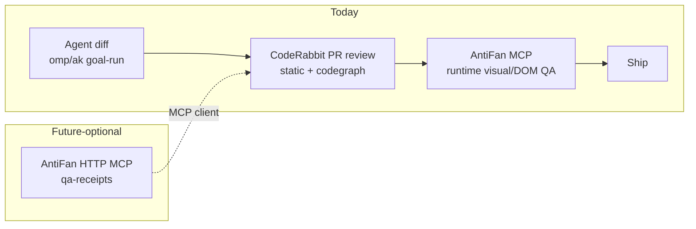

# Research Report: CodeRabbit — Giá trị cho AntiFan & vị trí Theme Engineer

## Executive Summary

CodeRabbit là **AI code reviewer chạy trên PR** (GitHub/GitLab/Azure/Bitbucket), giờ mở rộng thành "Agentic Change Management": Review → Triage → Change Stack (explain diff lớn) → Security (deep scan + dependency vuln) → Plan/Slack agent. Điểm cộng lớn nhất cho bạn: sản phẩm đang được positioning chính xác cho **vấn đề của bạn** — review/prioritize/verify khối diff khổng lồ do coding agent sinh ra.

Đánh giá theo 3 mặt trận của bạn:

| Mặt trận | Fit | Lý do |
|---|---|---|
| **A. AntiFan repo** (TS/Electron/MCP, private GitHub `Devs2-Stores/AntiFan`, solo + agent-heavy) | **CAO** — dùng ngay free tier | TS là sweet spot; PR flood từ goal-run/fix-wave của bạn chính là use case gốc của CodeRabbit; learnings tích lũy convention giống AGENTS.md của bạn |
| **B. Storefront theme work** (Haravan/Sapo/Shopify Liquid) | **THẤP–TRUNG BÌNH** | Theme Check đang bị skip trong sandbox; Liquid review = raw LLM → hallucination đã được ghi nhận; QA thật của bạn là runtime visual/DOM (AntiFan) — CodeRabbit không thấy được |
| **C. Chiến lược sản phẩm AntiFan** | **Tham khảo + 1 hướng MCP tương lai** | CodeRabbit là prior art xuất sắc cho review/verifier lane; MCP-client architecture mở đường cho AntiFan MCP làm context provider |

**Khuyến nghị:** bật free tier GitHub App trên repo AntiFan ngay (0 đô, không risk), config path_filters chặt (repo đang 203 file dirty + hàng chục `.tmp-*`/`clone/`/`scratch/`), xem xét Essentials $24–30/mo khi cần CLI + learnings đầy đủ. Đừng dựa vào nó cho Liquid correctness.

## Research Methodology

- **Nguồn:** landing page coderabbit.ai (đọc full), docs.coderabbit.ai (index, MCP connections, Shopify CLI tool, IDE/CLI review), 5 web searches (pricing, self-hosted/privacy, MCP/agentic, config best practices, limitations/Liquid).
- **Ngày tài liệu:** hiện hành (CodeRabbit đã đổi tên tier: Pro→Essentials, Pro+→Team; docs vẫn live 2026).
- **Search terms:** `CodeRabbit pricing free tier Pro plan 2026`, `CodeRabbit self-hosted GitHub Actions data privacy zero data retention`, `CodeRabbit MCP server agent verification agentic change management`, `coderabbit yaml path filters learnings commands`, `CodeRabbit limitations false positives Shopify Liquid`.
- **Ground repo:** `git remote` = `git@github-devs2:Devs2-Stores/AntiFan.git`, branch `main`, 203 dirty files tại thời điểm research.

## Key Findings

### 1. CodeRabbit là gì (2026)

Nền tảng "Agentic Change Management" gồm 4 trụ:
- **Review** — AI review mọi PR: line-by-line suggestions (committable), agent loops (bot reply→coding agent fix→bot verify lại — có demo codex loop trên landing page), **Learnings** (bot nhớ convention khi bạn correct nó trong thread), Pre-Merge Checks table, Post-Merge Actions (update changelog, mở follow-up PR).
- **Triage** — xếp hạng PR theo risk/value, Kanban queue, auto-assign reviewer. Giành cho team nhiều PR; solo dev ít giá trị hơn.
- **Change Stack** — giải thích diff 1000+ dòng theo cohort/layer, semantic diff, blast radius. Rất hợp với diff từ agent của bạn.
- **Security** — deep scan định kỳ + dependency vuln + secret leak, "verifies findings to reduce false positives".

Bối cảnh: 17K customers, 6M repos, NVIDIA/Indeed/Adyen/Swiggy/Clerk... — mức adoption cao nhất trong nhóm AI reviewer. Case study Clerk: 40% faster merge, 70% acceptance potential-bug findings.

### 2. Pricing & deployment

| Tier | Giá | Ghi chú |
|---|---|---|
| Free | $0 | Unlimited public + **private** repos, PR summarization, core review, VS Code ext + CLI (rate limit thấp). Không cần credit card |
| Essentials (cũ là Pro) | $24/dev/mo (annual) · $30 monthly | Full PR+CLI review, one-click fixes, learnings, MCP connections, SAST/linter |
| Team (cũ là Pro+) | $48–60/dev/mo | Thêm Triage, reverse-tunnel MCP... |
| Self-hosted | Enterprise, ~500+ seats | Container image trong hạ tầng bạn, BYOM, air-gapped |

Bạn là solo dev → 1 seat. Self-hosted không liên quan.

**Privacy:** SOC 2 Type II, GDPR, Zero Data Retention (code xử lý in-memory, không train model). Nhưng code client theme (Levents, comnieusiba, hoplongtech...) vẫn **rời máy bạn** → kiểm tra NDA/contract khách trước khi bật trên theme repo của khách.

### 3. Các surface dùng được

- **GitHub App** (SaaS): review PR tự động — AntiFan đã có GitHub remote, cài được ngay.
- **CLI**: `coderabbit review` pre-commit trên diff chưa push, chạy được như **Claude Code plugin/skill**, output plain-text hoặc agent-optimized, dùng được trong CI. → Cắm được vào loop ak/vibe của bạn như review gate độc lập trước khi ship.
- **IDE extension** (VS Code/Cursor/Windsurf): review uncommitted changes, **tự đọc CLAUDE.md/.cursorrules** — bạn có cả hai file này, convention contract của bạn được nạp sẵn.
- **MCP client**: CodeRabbit connect đến MCP server ngoài để lấy context khi review/chat. Gated Essentials trở lên. Custom server qua HTTPS (direct) hoặc **reverse tunnel** cho server private (route do CodeRabbit provision, không self-service; không hỗ trợ WebSocket; stdio local không kết nối trực tiếp).

### 4. Liquid / Shopify — điểm yếu đo được

Từ docs chính thức `docs.coderabbit.ai/tools/shopify-cli`:
- CodeRabbit **đang skip Shopify Theme Check vì CLI không có trong sandbox tools image** (pin Shopify CLI 4.7.0, theme 3.58.2). Tức là `.liquid` hiện được review bằng raw LLM, không có static analysis backing.
- Khi có runner: yêu cầu cấu trúc theme Shopify **ở root repo** (`assets/ config/ layout/ locales/ sections/ snippets/ templates/`) + `.theme-check.yml`; skip nếu CI đã chạy theme check.
- Cấm水流 đã ghi nhận (Medium/Reddit/gist): LLM flag sai `/` scope, misunderstood filter chains, suggest refactor JS-style (object literal, arithmetic grouping) làm crash renderer; cross-ref `.json` template ↔ section schema hay sai "missing setting".
- **Haravan/Sapo:** không có linter tương ứng; Liquid Haravan có object/filter riêng → LLM càng dễ bịa. Theme Check (Shopify) cũng không biết object Haravan.

### 5. Limitations chung (community)

- **Cascading review loop**: fix xong đợt này, push commit → review lại sinh complain mới (kể cả chê chính autofix của nó). Reddit r/coderabbit có thread nguyên về việc này.
- **Severity misclassification**: style nit bị gán "Major/Critical".
- Monorepo/cross-file context vẫn miss (hidden settings, external schema).
- Mitigation đã biết: profile `chill`, path_filters, learnings, chạy linter thật trong CI trước.

## Fit Phân Tích Theo Vị Trí Của Bạn

### A. AntiFan repo — nơi CodeRabbit ghi điểm mạnh nhất

Facts từ repo của bạn:
- Private GitHub repo, TS/Electron/Node (`src/main`, `src/renderer`, test 4 lane: main/renderer/unit/e2e).
- Workflow agent-heavy: goal-runs, fix-wave (`.tmp-pw-fix-*` nguyên chuỗi), ultra-verifier candidates, `pending.diff` 152.8KB — đúng "PR flood from agents" mà CodeRabbit bán.
- Solo: không có human second reviewer; contract của bạn đòi binary yield + proof. CodeRabbit cho bạn một reviewer ngoài session model (độc lập về model + codegraph) — **bắt được loại bug khác** với ak:code-review chạy trên cùng model family đang ngồi session.
- **Learnings ↔ AGENTS.md convention**: IDE ext tự đọc CLAUDE.md; learnings cộng dồn từ thread corrections — quy ước IPC/routing authority của AntiFan dần thành rule review persistent, không phải lặp lại trong prompt mỗi session.

Rủi ro cụ thể repo bạn: noise. 203 dirty files, `.tmp-*`/`tmp/`/`scratch/`/`clone/`/`customizes/`/`.canary/` — **bắt buộc path_filters**, không thì review chìm trong probe log.

### B. Theme/storefront work — dùng có điều kiện

- Static review Liquid = LLM-only hiện tại → coi như "junior reviewer Liquid": bắt được bug logic if/else, loop, schema JSON, asset duplicate, SEO cơ bản; KHÔNG tin cho correctness Liquid (scope/filter/object Haravan).
- Runtime truth vẫn là lane của AntiFan (visual compare, DOM inspect, theme_qa_validate, golden slice). CodeRabbit không thay thế — nó nằm **trước** pipeline: bắt lỗi tĩnh ở PR stage, AntiFan bắt lỗi render ở storefront stage.
- Nếu dùng: encode expertise của bạn vào `path_instructions` cho `**/*.liquid` (Haravan objects, dotLiquid khác biệt, cấm JS-syntax suggestions) — giảm hallucination đáng kể.

### C. Chiến lược: 2 giá trị không phải "mua tool"

1. **Prior art cho AntiFan's verifier lane**: UX của CodeRabbit — "Learnings Added" receipt, pre-merge checks table, post-merge actions, agent-loop verify ("Fixed in 9f2c4a1 → Verified") — là pattern tham khảo trực tiếp cho theme QA report/receipt surface của AntiFan (bạn đang có `.antifan/qa-receipts`, verification list MCP tools). Phân tích chi tiết: `reports/antifan-mcp-capability-map.md` đã có sẵn lane này.
2. **Hướng MCP tương lai (mEDIUM term)**: AntiFan expose một HTTP MCP endpoint (streamable HTTP/SSE) cung cấp QA receipts/evidence cho PR đang review → CodeRabbit (Essentials+) connect và enrich review comment bằng live storefront evidence ("Additional context used"). Đây là differentiation thật: reviewer nào cũng đọc code, chỉ AntiFan-based reviewer đọc được **rendered storefront**. Chướng ngại: HTTPS public endpoint hoặc reverse-tunnel provisioning (CodeRabbit cấp route, không self-service) — không làm được hôm nay với stdio MCP local.



## Comparative: CodeRabbit vs stack review hiện tại

| Tiêu chí | ak:code-review / subagent (hiện tại) | CodeRabbit |
|---|---|---|
| Chi phí | 0 (trong session) | 0 free tier; $24–30/mo full |
| Model independence | Cùng model family session → blind spot chung | Model ensemble + codegraph riêng → bắt lớp bug khác |
| Persistent convention | Tải lại từ AGENTS.md mỗi session | Learnings cộng dồn theo repo/org |
| Tích hợp PR GitHub | Qua agent (manual) | Webhook tự động mọi PR |
| Diff 1000+ dòng | Token budget chat | Change Stack sinh ra cho việc này |
| Liquid correctness | Tùy skill loaded | Yếu (đo được, mục 4) |
| Runtime render QA | Không (CodeRabbit cũng không) | Không — AntiFan độc quyền mảng này |

→ Không thay nhau. CodeRabbit = lớp tĩnh, độc lập, luôn-on; agent stack = lớp tác chiến, repo-context sâu.

## Implementation Recommendations

### Quick Start (free, ~5 phút, khuyến nghị làm ngay)

1. Cài GitHub App CodeRabbit vào org `Devs2-Stores`, chọn repo `AntiFan`.
2. Commit `.coderabbit.yaml` (mẫu dưới) vào root, branch `main`.
3. Mở 1 PR thử → quan sát 1 review đầy đủ → tune.

### `.coderabbit.yaml` mẫu cho AntiFan repo

```yaml
language: en-US
reviews:
  profile: chill          # giảm noise ban đầu; nâng assertive khi đã trust
  path_filters:
    - "!/.tmp*/**"        # mọi worktree/probe tạm
    - "!/tmp/**"
    - "!/scratch/**"
    - "!/clone/**"
    - "!/clones/**"
    - "!/customizes/**"
    - "!/.canary/**"
    - "!/reports/baseline-*.png"
    - "!/plans/**/*.json" # telemetry/evidence dumps
  path_instructions:
    - path: src/main/**
      instructions: |
        - Electron main process: flag IPC handlers without input validation,
          unbounded listener registration, process teardown leaks.
        - Never suggest killing processes not owned by this app (repo contract).
    - path: src/preload/**
      instructions: |
        - contextBridge surface: flag any Node/PowerShell capability exposed
          to renderer without explicit allowlist.
    - path: test/**
      instructions: |
        - Flag tests that pin incidental behavior or weaken assertions.
        - e2e must assert observable output, not non-throw.
```

### Cho theme repo (Shopify; Haravan/Sapo tương tự + lưu ý mục 4)

```yaml
reviews:
  path_instructions:
    - path: "**/*.liquid"
      instructions: |
        - Platform: Haravan (Shopify-like Liquid, NOT Shopify). Objects:
          shop, product, collections, cart, settings — do NOT flag Haravan-only
          objects/filters as undefined.
        - Liquid has no object literals/parenthesized arithmetic; never suggest
          JS/TS syntax inside Liquid tags.
        - / are template-global; do not flag re-use
          across include/snippet boundaries as redeclaration.
  tools:
    shopifyThemeCheck:
      enabled: true   # hiện bị skip; bật để sẵn khi CLI vào sandbox image
```

Giữ `shopify theme check` (hoặc Haravan equivalent) chạy trong CI riêng — CodeRabbit skip Theme Check khi đã có ở CI, và deterministic linter vẫn đáng tin hơn LLM cho Liquid.

### CLI trong agent loop (khi lên Essentials)

- Cài như Claude Code skill/plugin; gọi `coderabbit review` trên diff pending trước ship-gate — thêm 1 verifier independent vào binary yield của bạn.
- Windows support cho CLI: **chưa verify** — test trước khi đưa vào contract.

### Common Pitfalls

1. Không path-filter → review chìm trong `.tmp-*` (repo bạn đang 203 dirty files).
2. Tin Liquid suggestions tại word value — xác minh bằng render/AntiFan lane.
3. Bật trên repo khách (Levents/hoplongtech) khi NDA cấm send code ra SaaS third-party.
4. Feed back đúng luật vào learnings ngay từ review đầu — sau 10 PR nó tự theo convention.
5. Cascading loop: dùng `@coderabbitai resolve` + profile chill thay vì fix từng nit.

## Resources & References

- Site: https://www.coderabbit.ai/ · Pricing: https://www.coderabbit.ai/pricing
- Docs: https://docs.coderabbit.ai/ (llms.txt có full index)
- Config: docs.coderabbit.ai/guides/configuration-overview · path-instructions · reference/configuration
- Shopify/Liquid: docs.coderabbit.ai/tools/shopify-cli
- MCP connections: docs.coderabbit.ai/connections/mcp-servers · knowledge-base/mcp-context
- CLI/IDE: docs.coderabbit.ai/overview/ide-cli-review · /cli
- Security posture: coderabbit.ai/blog/our-security-posture-how-we-safeguard-your-repositories
- Blog nền tảng: coderabbit.ai/blog/introducing-agentic-change-management
- Community pain: reddit.com/r/coderabbit (cascading review thread)
- Cases: Swiggy, Clerk 40% faster merge, TaskRabbit −25% merge time

## Unresolved Questions

1. **CLI trên Windows**: chưa verify cài đặt/chạy ổn trên win32 — cần smoke test trước khi đưa vào ship-gate.
2. **Rate limit cụ thể của free tier** cho repo private lớn như AntiFan (diff hàng trăm KB) — docs chỉ nói "lower rate limits", không có con số; trải nghiệm thực tế mới biết.
3. **Reverse tunnel MCP provisioning** cho private MCP server: điều kiện cấp route (Team/Advanced?) — chưa có docs công khai chi tiết; cần hỏi sales nếu làm hướng C.
4. Theme Check CLI có quay lại sandbox image không (docs ghi "currently skips") — theo dõi changelog CodeRabbit.
