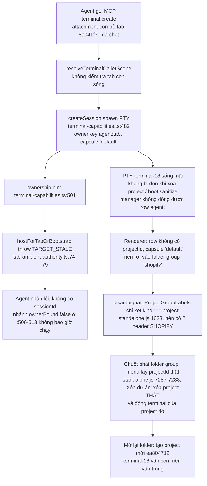

# AntiFan: điểm yếu rút ra từ chat OMP 08–10/10/2026

- Phạm vi: 56 session OMP (mọi project) có hoạt động từ 2026-10-08 đến 2026-10-10. File lớn nhất 75–121 MB (Levents, shopify, AntiFan VQA, Lux Wine, Phukienmaymoc).
- Cách làm: dựng digest (USER / ASSISTANT / TOOLERR) cho từng session → 12 analyzer chạy song song (135 issue, 70 issue critical/high thuộc AntiFan) → 1 debugger điều tra riêng vụ tạo nhầm project → controller đối chiếu từng claim chính với code ở HEAD `da2de8c2` và `git log` → kongming review (GO_WITH_CHANGES).
- Working tree có 12 file chưa commit của một task khác (`agentHeld`, +209/−12). Report này không sửa file nào trong số đó.
- Evidence thô: `%TEMP%/omp-digest-261010/` (`_issues.json`, `_projmis.md`, digest từng session).

## 1. Tóm tắt

AntiFan hỏng nặng nhất ở ba lớp. Cả ba cùng một gốc: hệ thống fail-closed nhưng không tự phục hồi.

1. **Bề mặt MCP/authority.** Mỗi khi tab chết, app restart hoặc authority xoay vòng, agent mất quyền và không tự lấy lại được. Agent phải đi đường vòng (stdio wrapper, eval `tool.write`, Playwright).
2. **Pipeline capture/evidence.** Chụp ảnh và evaluate thất bại vì môi trường (cửa sổ bị che, render surface chậm, slider tự chạy). Theme QA vì thế không ra được verdict.
3. **Định danh project/terminal.** Terminal tạo qua MCP có thể thành mồ côi, bị xếp vào group trùng tên với project. Menu của group "ma" xóa nhầm project thật. Capsule cũ không bao giờ được dọn.

## 2. Số liệu lỗi

Đếm trên toolResult `isError` thật, mã lỗi có trong output:

| Mã | Số lần |
|---|---|
| CAPABILITY_ERROR | 43 |
| TARGET_MISMATCH | 37 |
| REVISION_STALE | 34 |
| TARGET_STALE | 18 |
| NO_RENDER_SURFACE | 16 |
| CAPTURE_FRAME_STARVATION | 15 |
| CAPTURE_NOT_READY | 9 |
| TARGET_BUSY_DRAINING | 7 |
| EXECUTION_TIMEOUT_PENDING_CLEANUP | 7 |
| VIEWPORT_NOT_APPLIED | 6 |
| WS_AUTH_REFUSED | 5 |
| EXECUTION_UNCERTAIN | 5 |
| IMAGE_IDENTITY_UNSTABLE | 5 |

Đếm lỏng hơn (mọi chỗ nhắc tới mã trong text session, kể cả agent trích lại): CAPABILITY_NOT_FOUND 673, TIMEOUT 554, TARGET_MISMATCH 508, TARGET_STALE 449, QA_PENDING 131, MCP_BRIDGE_OFFLINE 38, TERMINAL_SCOPE_UNRESOLVED 19, CAPTURE_SCALE_MISMATCH 17.

## 3. Các cụm điểm yếu và trạng thái so với HEAD

### 3.1 MCP bridge / authority: fail-closed nhưng không tự phục hồi (mở)

- REVISION_STALE xuất hiện 28 lần trong một session (01a1204b, Phukienmaymoc, 10-09). Một subagent gọi `set_automation_target` làm xoay authority, sau đó mọi tool AntiFan của session cha đều chết. Chỗ throw: `src/main/run/attachment-registry.ts:795-796`. Proxy có xếp `REVISION_STALE` vào nhóm retry (`scripts/antifan-omp-mcp.cjs:1395`), nhưng session vẫn kẹt.
- TARGET_MISMATCH chặn agent dùng split pane hoặc tab reference cạnh storefront (T1: 23 lần; T6 cũng gặp).
- Bridge rớt (ECONNREFUSED 127.0.0.1:20130, HEALTH_PID_DEAD) dẫn tới EXECUTION_UNCERTAIN. Autoheal thất bại (T1: 19 lần, T4, T2).
- "MCP server not connected" và tool không được mount (CAPABILITY_NOT_FOUND / QA_UNAVAILABLE) khi mở project (T3: 6 lần).
- Hệ quả đo được: session Levents 01a121db điều khiển AntiFan qua eval Python `await tool.write("xd://mcp__antifan_…")` với 2014 call, thay vì gọi tool native.
- Đã sửa trước đó: voucher cho boot project (TERMINAL_SCOPE_UNRESOLVED). Phần còn lại vẫn mở.

### 3.2 Pipeline capture/evidence không ổn định (mở)

- CAPTURE_FRAME_STARVATION khi cửa sổ bị che hoặc compositor dừng frame (T6: 9 lần, T4: 5, A2: 3). App chỉ tắt `backgroundThrottling` theo từng tab khi agent đang làm việc (`native-tab-host.ts:9427-9429`). App không bật switch `disable-backgrounding-occluded-windows` như harness benchmark (grep `src/main`: 0 kết quả), nên cả cửa sổ bị che vẫn dừng frame.
- NO_RENDER_SURFACE: probe render surface có ngưỡng cứng 3000 ms (`src/main/verification/visual-capture.ts:750`). Storefront nặng vượt ngưỡng này (T1: 8, T3: 8).
- TARGET_BUSY_DRAINING làm treo mọi lệnh evaluate theo sau (T1: 6). `anti.browser.evaluate` timeout 15 s trên tab đang hiện (T4: 7).
- CAPTURE_NOT_READY và IMAGE_IDENTITY_UNSTABLE trên hero slider tự chạy (T5, T2, T3). VIEWPORT_NOT_APPLIED kèm tab trôi về `about:blank` (T5).

### 3.3 Theme QA: verdict và gate (một phần đã sửa)

- **Đã sửa:** deadlock "sửa local nhưng storefront chỉ đổi sau push". Session 01a1195e đếm được 76/205 khối BLOCKED vì lý do này trong 7 ngày trước 10-08. Status `QA_PENDING_SYNC` được thêm ở `3f814581` (10-08 10:22), xem `src/omp-hooks/theme-qa-gate.ts:138-141,1110`.
- **Đã sửa:** 50 false critical (T5) và việc bỏ sót chữ đè chữ / chữ bị cắt. Engine sửa ở `da2de8c2`. Gap U1–U5 vẫn mở, ghi ở `docs/operations.md:154`.
- **Mở:** `theme.qa_validate` throw `CAPTURE_SCALE_MISMATCH` thay vì trả report trên mọi trang mobile bị tràn ngang. Chỗ throw: `src/main/browser/tab-devtools-host.ts:2737-2741`; lời gọi screenshot trong workflow không có guard: `src/main/qa/theme-qa-workflow.ts:386`.
- **Mở:** ảnh ẩn có `src=""` bị tính là ảnh hỏng, dẫn tới RESOURCE_FAILURE và cả lượt chạy không có report (theo memory E2E 10-10).
- **Mở:** hook gate nối footer/reminder thẳng vào kết quả tool (`theme-qa-gate.ts:1203,1216,1221,1235`). T1 ghi nhận việc này làm vỡ JSON mà agent đang parse.

### 3.4 Định danh project/terminal: vụ "create lộn Project" (mở, chi tiết ở §4)

### 3.5 Terminal daemon / main process (phần lớn đã sửa)

| Vấn đề | Trạng thái | Bằng chứng |
|---|---|---|
| FocusManager crash khi reparent view | Đã sửa | `d2dfc6a3` |
| EPIPE trong conout relay của node-pty làm chết daemon | Đã sửa | `6a5d9798`, `pty-conout-relay.ts` |
| `trimTail` O(N) làm daemon ăn 97% CPU | Đã sửa | `terminal-manager.ts:388-397` (splice) |
| Tab agent offscreen bị rò | Đã sửa | `63e88260` |
| Tạo terminal cho nhiều project cùng lúc làm treo daemon | Đã giảm nhẹ | `8f5150b3` |
| Daemon chết thì GUI kẹt ECONNREFUSED: proxy reconnect mãi mà không spawn lại | **Mở** | `daemon-client.ts:308-337` chỉ `client.connect()`; `ensureDaemon()` chỉ được gọi lúc boot (`index.ts:4056`) |
| RunStateService quét file đồng bộ trên main thread | **Mở** (đã giảm nhẹ) | `run-state-service.ts:256,309,549,609,668` (`readdirSync`/`rmSync`); có backoff khi gặp EPERM |
| PTY kế thừa toàn bộ `process.env` | **Mở** | `terminal-manager.ts:1725-1726`. `CI`/`CLAUDECODE` làm Shopify CLI tê liệt (T2); `ANTIFAN_TERMINAL_HOST_TOKEN` làm probe daemon dùng nhầm token |

### 3.6 Phụ thuộc vào restart (mở, mang tính hệ thống)

- Fix nào cũng cần restart app: CHANGELOG ghi "Cần khởi động lại app để tab dùng code mới".
- Restart lại làm gãy binding: TARGET_STALE / TARGET_MISMATCH / PROJECT_MISMATCH (A4).
- Người dùng phải dặn agent: "App đang chạy nhiều Project nên từ giờ test trên Instance mới, ko restart App nữa nhé" (01a12153, 10-09 17:38).

### 3.7 Guard quá cứng hoặc báo nhầm (một phần đã sửa)

- Guard `settings_data` đòi token trong prompt. REFUSED_SETTINGS_DATA_DIRECT_WRITE vẫn chặn dù người dùng đã cho phép rõ (T5, A2).
- TTSR `destructive-commands` match nhầm khi agent chỉ đọc hoặc trích văn bản (A2).
- `f49058d9` đã nới một phần: gate fetch `settings_data`, race của wait, expose `settings_check`.

### 3.8 Hạ tầng dev/test (phần lớn đã sửa)

- Test ghi rác vào issue-register production (A2: 130 dòng). Đã cô lập: `scripts/lane-env.cjs:21` đặt `ANTIFAN_DATA_ROOT` riêng cho mỗi lane; `498da344`.
- `test:main` chạy 1008 s. Lane đỏ trên worktree mới do thiếu prereq bị gitignore, do CRLF, và do test phụ thuộc đường dẫn. `%TEMP%` rò ~1,15 GB từ `probe-visual-qa-live-sites.cjs`. Các vấn đề này vẫn mở, xem memory.

### 3.9 Anti-bot / đăng nhập (đã sửa, bản Unreleased)

- Shopee: thêm UA Client Hints. Google sign-in bị `/v3/signin/rejected`: đổi sang UA Safari cho `accounts.google.com` (CHANGELOG:55-73).
- Cả hai cần restart app mới có hiệu lực.

## 4. Vụ "create lộn Project" (chi tiết)

### 4.1 Triệu chứng

- Sidebar Terminal Manager có hai header `SHOPIFY`: một project group có chấm màu, một folder group không có chấm.
- Người dùng xóa project rồi mở lại, nhưng vẫn còn hai header.
- Có các project trùng tên: 3 × `S2 Spa`, 2 × `Lux Wine`, hiện thành `S2 SPA · S2 SPA`.
- Xuất hiện capsule lạ `Telegram Desktop` (trong Downloads) và `Giavucompany`.

### 4.2 Chuỗi nguyên nhân (đã đối chiếu code)

Timeline 10-10 (event store / main.log):
- 14:23:44 `project-removed` bf04da39. Lệnh này đóng terminal-14 và split-8, terminal-18 vẫn sống.
- 14:23:56 `project-open.without-target`.
- 14:24:10 `project-open.folder-reused`: tạo project mới ea804712, dùng lại capsule-8fc63997.

### 4.3 Các lỗi liên quan

- **Capsule ambient của daemon dùng chung cho mọi process.** `setCapsule` được forward sang daemon (`daemon-client.ts:558` → `daemon-entry.ts:442`). Nó được gọi từ pick-folder và capsule:switch của bất kỳ cửa sổ nào (`native-tab-host.ts:4571,4621`).
  - `terminal.create` không truyền `capsuleId` (`terminal-capabilities.ts:482`), nên terminal agent mới nhận capsule do cửa sổ khác switch gần nhất, và nằm trong project của cửa sổ đó.
  - Đường bridge `terminalNewSession` (`bridge-server.ts:3365-3370`) lại lấy capsule từ tab đang bind. Vậy là hai implementation lệch nhau. Lần này chưa quan sát thấy trường hợp lệch xảy ra.
- **Copy thay vì move thư mục** sinh project song song (S2 Spa ×3, Lux Wine ×2).
  - Thư mục cũ thành section STALE mãi mãi, không có relocate (`project-reconcile.ts:48-61`).
  - Khi move, PTY đang sống giữ khóa thư mục, gây WinError 32 (T4).
- **Store capsule không bao giờ được compact.** 242 capsule, 67 đường dẫn bị trùng, 175 row trùng.
  - Không có row trùng nào được tạo sau `cad0894f`, nhưng row cũ vẫn còn.
  - Xóa project giữ lại capsule (`workspace-capsule.ts:468-484`).
- **Một click là mint project từ folder chooser**, không hỏi lại (`index.ts:3520-3572`). Đây là cách `Telegram Desktop` (Downloads) và `Giavucompany` ra đời. [INFERENCE] Người dùng tự mở thư mục rồi xóa; log lúc 10:20Z đã bị rotate nên không chứng minh được thao tác cụ thể.
- **Bất thường chưa giải thích:** terminal-8 (`E:\Work\apps\AntiFan`) chuyển từ owner `web` sang project boot "Tổng hợp" trước 14:33Z mà không có event lifecycle nào. [INFERENCE] `resolveProjectAssignment` (`index.ts:719-725`) không loại project boot ra.

### 4.4 Đã sửa / chưa sửa

- Đã sửa: `1193bf95` phân biệt project↔project trùng tên; `cad0894f` chặn tạo capsule trùng mới.
- Working tree (chưa commit, của task khác): `agentHeld` cho manager thao tác row agent mà không tab nào giữ. Chỉ giảm nhẹ chuyện không đóng được row, không sửa gốc.
- Chưa sửa: các mục còn lại ở §4.2–4.3.

## 5. Điểm yếu hệ thống (gốc xuyên cụm)

1. **Fail-closed mà không tự phục hồi.**
   - Mọi lớp authority (attachment revision, tab affinity, project scope, bridge pairing) đều refuse đúng thiết kế.
   - Nhưng không lớp nào tự re-mint, rebind hay respawn: REVISION_STALE, TARGET_STALE sau restart, daemon chết.
   - Chi phí cuối cùng dồn lên agent và người dùng, dưới dạng workaround và restart.
2. **Main và daemon lệch trạng thái.**
   - Daemon giữ trạng thái toàn cục (`currentCapsuleId`) trong khi main có nhiều cửa sổ / project.
   - Thao tác tạo không nguyên tử: spawn trước, bind sau.
3. **Không có hot-reload.** Fix nào cũng cần restart, mà restart lại làm gãy binding, nên người dùng chạy nhiều project không dám restart.
4. **Môi trường được coi là lỗi của trang.** Cửa sổ bị che, máy bận, slider tự chạy đều biến thành lỗi capture, rồi thành QA không có verdict.
5. **Kênh dữ liệu tool bị nhiễm.** Hook nối text vào tool result; PTY kế thừa env của app.

## 6. Ưu tiên đề xuất

Đã áp dụng góp ý của kongming, trừ mục 2 (bác bỏ, lý do ở dưới).

**P0**
1. **`terminal.create` nguyên tử.**
   - Kiểm tra tab còn sống trước khi spawn (`hostForTabOrDegrade`, refuse TARGET_STALE).
   - Port `bind` trả `false` thay vì throw.
   - Đóng PTY khi bind thất bại.
   - Lấy capsule từ tab đang bind như `bridge-server.ts:3365-3370`; cấm fallback về `currentCapsuleId` dùng chung.
   - Test cho trường hợp bind throw và bind trả `false`.
2. **Menu folder-group không được xóa project thật một cách ngầm.** Nêu rõ tên project và đường dẫn, hoặc bỏ mục "Xóa dự án" khỏi folder group. Lý do P0: thao tác này phá hủy (đóng terminal của project thật). Bằng chứng: `standalone.js:7287-7288`, event bf04da39.
3. **`theme.qa_validate` luôn trả report.** CAPTURE_SCALE_MISMATCH / RESOURCE_FAILURE phải thành finding `INCONCLUSIVE` (hoặc overflow finding), không throw.
4. **Authority tự phục hồi.** REVISION_STALE tự refresh revision; bridge reconnect / autoheal; mục tiêu là subagent xoay authority không làm chết session cha.
5. **Daemon respawn.** Khi proxy reconnect thất bại N lần, gọi lại `ensureDaemon()`.

**P1**
- Scrub env cho PTY: xóa `CI`, `CLAUDECODE`, `ANTIFAN_TERMINAL_HOST_TOKEN`. Quick win, đúng một chỗ (`terminal-manager.ts:1725`).
- Đưa folder group vào `disambiguateProjectGroupLabels`, hoặc gộp row agent/web cùng thư mục vào project group.
- Quét dọn row `agent:<tab>` không còn tab sống; commit thay đổi `agentHeld`.
- Capture: bật cờ chống throttle khi bị che trong app thật; ngưỡng probe render surface thích ứng với tải.
- Hook gate không nối text vào tool result có dạng JSON / structured.

**P2**
- GC capsule (175 row trùng); relocate hoặc ẩn section STALE; hỏi xác nhận trước khi mint project từ folder chooser.
- RunStateService chuyển sang async.
- Đường hot-reload để không phải restart.

**Bác bỏ góp ý 2 của kongming** (đưa deadlock QA gate lên P0): deadlock push-wait đã được sửa bằng `QA_PENDING_SYNC` ở `3f814581` (10-08 10:22). Con số 76 là thống kê 7 ngày trước 10-08 trong session 01a1195e. Phần gate còn mở (nhiễm tool result) được xếp P1.

## 7. Contract bàn giao cho fix P0 (`/ak:fix --advice`)

- **Outcome:**
  - `terminal.create` gọi trên tab chết thì refuse mà không để lại PTY.
  - Terminal agent luôn nằm trong project của tab đang bind.
  - Menu folder-group không xóa project khác một cách ngầm.
  - `qa_validate` luôn trả report.
- **Constraints:**
  - Không restart app đang chạy; test trên instance riêng.
  - Không đụng 12 file chưa commit của task `agentHeld`, hoặc phải phối hợp với task đó (`native-tab-host.ts`, `terminal-manager.ts`, `standalone.js` đều đang bị sửa).
- **Non-goals:** GC capsule, relocate STALE, hot-reload.
- **Acceptance:**
  - Test unit: bind throw / trả `false` thì `listSessions` không còn session mới.
  - Test renderer: folder group trùng nhãn với project group được phân biệt.
  - Fixture mobile overflow: `qa_validate` trả report kèm finding, không throw.

**Trade-offs** cho fix `terminal.create`:
- (A) Kiểm tra trước, rồi rollback trong capability. Nhỏ, cục bộ. Giả định quan trọng nhất: `closeSession` qua daemon đủ đồng bộ. Hỏng đầu tiên khi tab chết đúng giữa lúc kiểm tra và lúc bind; lúc đó rollback là lưới an toàn.
- (B) Đặt chỗ ownership trong daemon trước khi spawn (tạo nguyên tử). Sạch hơn nhưng phải đổi protocol main↔daemon. Hỏng đầu tiên khi phiên bản daemon và app lệch nhau.
- **Khuyến nghị (A).** Chi phí thấp, dễ bỏ nếu cần, đủ cho triệu chứng đã thấy.

## 8. Câu hỏi còn mở

- Vì sao terminal-8 chuyển sang project boot? Cần log event có đủ `assign-project`.
- Đóng terminal-18 (vẫn `running`) bằng cách nào khi manager ở HEAD chặn row `agent:`? Cần người dùng quyết định, hoặc chờ commit `agentHeld`.
