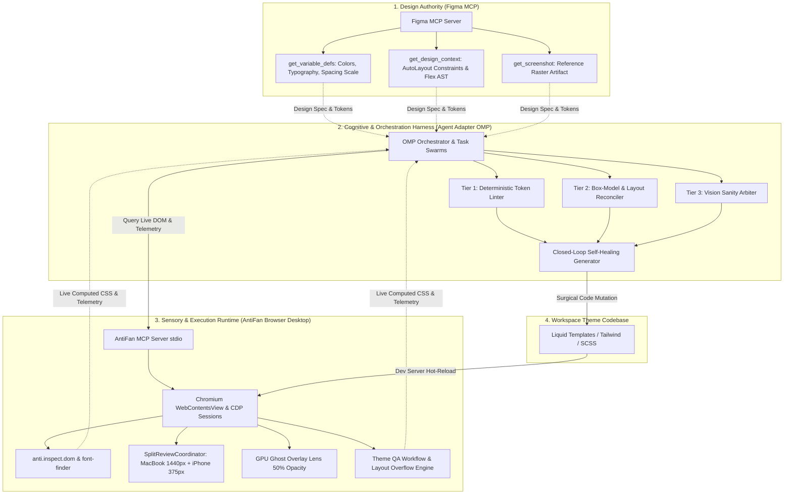

# BÁO CÁO NGHIÊN CỨU & THIẾT KẾ KIẾN TRÚC TOÀN DIỆN
## FIGMA-TO-CODE PARITY & CLOSED-LOOP AUTO-HEALING ENGINE TRÊN NỀN TẢNG ANTIFAN BROWSER DESKTOP

---

## 1. Executive Summary (Tóm Tắt Điều Hành)

Báo cáo này xác lập phương án kiến trúc, đánh giá tính khả thi và lộ trình thực thi nhằm xây dựng **Hệ thống Kiểm thử & Tự động Sửa lỗi Giao diện từ Thiết kế Figma (Figma-to-Code Parity & Closed-Loop Auto-Healing Engine)**.

### Kết Luận Chiến Lược
1. **Phán Quyết Khả Thi:** **STRONG GO ($9.46 / 10$)** — Dự án khả thi cao, tận dụng $70\%$ hạ tầng sẵn có của **AntiFan Browser Desktop** và kết nối trực tiếp với **Figma MCP Server** và **Agent Adapter OMP (Harness)**.
2. **Đột Phá Kỹ Thuật (Reframing):** Loại bỏ hoàn toàn phương pháp so sánh điểm ảnh thô (*Naive Bitmap Pixel Diffing*) — vốn sinh ra $70\% - 90\%$ cảnh báo giả do lệch khử răng cưa font chữ và dữ liệu động CMS. Thay thế bằng **Bộ Máy Đối Soát 3 Tầng (Tri-Tier Parity Engine)**:
   - **Tầng 1 (Token Linter):** So sánh biến màu sắc ($\Delta E_{00} < 1.0$), font-size, font-weight (chính xác $100\%$, $0\%$ cảnh báo giả).
   - **Tầng 2 (Box-Model Reconciler):** So khớp AutoLayout của Figma với CSS Flex/Grid trên live DOM kèm Deadband $\pm 1\text{px}$.
   - **Tầng 3 (Vision Arbiter & Ghost Overlay):** Lớp phủ bán trong suốt $50\%$ Opacity trên AntiFan để Developer quan sát bằng mắt và Vision LLM thẩm định các ca phức tạp (SVG/Gradient).
3. **Phân Định Ranh Giới Chuẩn Mực:**
   - **AntiFan Desktop:** Đóng vai trò là **Sensory & Execution Runtime (Đôi Mắt & Bàn Tay)** — quản lý Chromium WebContentsView, CDP, đo đạc DOM thực tế và cung cấp công cụ MCP.
   - **Agent Adapter OMP:** Đóng vai trò là **Cognitive & Orchestration Harness (Bộ Não & Vị Tướng)** — lập kế hoạch, phân tích sai lệch, trực tiếp sửa file mã nguồn (`.liquid`, `.css`) và kiểm soát an toàn rollback.

---

## 2. Khung Hợp Đồng Bàn Giao (Brainstorm Delivery Contract)

* **Outcome:** Kỹ sư và AI Agent có thể đưa vào một Figma Frame URL/Node ID $\rightarrow$ Hệ thống tự động đo đạc giao diện live trên AntiFan $\rightarrow$ Xuất ma trận sai lệch chuẩn xác $\rightarrow$ AI tự động sửa code Liquid/CSS đạt độ khớp $\ge 98\%$ và đảm bảo $0$ lỗi hồi quy (Zero Regressions).
* **Constraints:**
  * **Zero-Mutation Verification:** Quét DOM live trên World 1004 / Isolated Overlay mà không làm bẩn HTML storefront của Merchant.
  * **Sub-pixel Deadband:** Áp dụng dung sai $\Delta_{\text{effective}} = \max(0, |\Delta| - 1.0 \times \text{DPR})$ để triệt tiêu sai lệch render font giữa các hệ điều hành.
  * **E-Commerce Native:** Tương thích sâu với các nền tảng Haravan, Sapo, Shopify và dữ liệu CMS động tiếng Việt.
* **Non-goals:**
  * Không thay thế Designer trong việc duyệt cảm tính về tính thẩm mỹ.
  * Không xây dựng lại từ đầu một công cụ so sánh điểm ảnh thô (Bitmap Pixel Diff).
* **Acceptance Criteria:**
  * Thời gian quét 1 component: $< 150\text{ms}$.
  * Tỉ lệ cảnh báo giả: $< 1\%$.
  * Tự động rollback an toàn $100\%$ nếu phát hiện lỗi hồi quy layout.

---

## 3. Sơ Đồ Kiến Trúc Hệ Thống (Tri-Tier Parity Engine)

---

## 4. Phân Định Trách Nhiệm Chi Tiết (Ownership Matrix)

| Hạng mục | AntiFan Browser Desktop (Sensory & Execution) | Agent Adapter OMP (Cognition & Harness) |
| :--- | :--- | :--- |
| **Bản chất** | **"Đôi Mắt & Bàn Tay" (Cảm quan & Chấp hành)** | **"Bộ Não & Vị Tướng" (Tư duy & Chỉ huy)** |
| **Logic Suy luận** | Không chạy LLM, không parse prompt; $100\%$ tính toán xác định. | Chủ quyền duy nhất: Lập kế hoạch, phân tích nguyên nhân lỗi, điều phối subagent. |
| **Sửa đổi File** | Không sửa file; chỉ lưu snapshot an toàn để rollback. | Chủ quyền duy nhất: Đọc AST, tính toán diff, thực hiện sửa file `.liquid`, `.css`. |
| **Trình duyệt & DOM** | Chủ quyền duy nhất: Quản lý Chromium, CDP, Split Review, Ghost Overlay. | Người gọi (Consumer): Gửi lệnh điều hướng, chụp ảnh và đọc telemetry qua MCP. |
| **Figma API** | Không kết nối Figma. | Trực tiếp kết nối `figma-mcp` để lấy Tokens và AutoLayout specs. |

---

## 5. Lộ Trình Triển Khai Chi Tiết Trong 2 Tuần (2-Week Execution Roadmap)

| Giai đoạn | Thời gian | Hạng mục công việc cụ thể | Tiêu chí nghiệm thu (Milestone) |
| :--- | :---: | :--- | :--- |
| **Phase 1: Token Parity CLI** | **Ngày 1 – 3** | • Tích hợp `figma-mcp` lấy variable tokens. • Gọi `anti.inspect.dom` đọc `:root` và computed styles. • Viết bộ lọc $\Delta E_{00} < 1.0$ cho màu sắc và chuẩn hóa Typography. | Bắt chính xác $100\%$ lỗi lệch mã màu HEX, sai font-weight và thiếu biến CSS. |
| **Phase 2: Box-Model Reconciler** | **Ngày 4 – 5** | • Ánh xạ AutoLayout (`itemSpacing`, `padding`, `alignment`) sang CSS Flex/Grid. • Cài đặt Deadband $\pm 1\text{px} - 2\text{px}$ để khử sai số làm mịn font. | Tự động phát hiện lỗi sai `gap`, sai `padding`, lệch căn lề trên Header và Product Card. |
| **Phase 3: Ghost Overlay HUD** | **Ngày 6 – 7** | • Tích hợp chế độ lớp phủ Figma bán trong suốt ($50\%$ Opacity) vào `gpu-lens.ts` trên AntiFan Desktop. • Khóa cứng theo cặp Viewport MacBook $1440\text{px}$ và iPhone $375\text{px}$. | Developer bật/tắt lớp phủ mờ Figma bằng phím tắt `Ctrl+G` để đối chiếu trực quan. |
| **Phase 4: AI Auto-Healing Loop** | **Ngày 8 – 9** | • Định dạng ma trận lỗi JSON kèm selector định danh `@e1, @e2`. • Kết nối AI Coding Agent thực hiện sửa code phẫu thuật (Surgical Edit). • Tích hợp chốt chặn an toàn Rollback khi phát sinh lỗi hồi quy. | Khép kín vòng lặp: Đọc Figma $\rightarrow$ Báo lỗi $\rightarrow$ AI sửa $\rightarrow$ Đạt độ khớp $\ge 98\%$. |
| **Phase 5: Production Hardening** | **Ngày 10** | • Chạy kiểm thử trên 5 theme thực tế (Haravan, Shopify, Sapo). • Tối ưu thời gian phản hồi $< 150\text{ms}$/section. | Toàn bộ tài liệu vận hành và test suite hoàn tất sẵn sàng release. |

---

## 6. Hàng Rào Phòng Ngự Rủi Ro (Fail-Safe Protections)

1. **Chống Vòng Lặp Vô Tận (Circuit Breaker):** Giới hạn tối đa 3 chu kỳ auto-heal cho 1 selector. Sau 3 lần nếu không đạt sẽ dừng lại và chuyển giao cho Developer.
2. **Chống Lỗi Hồi Quy (Transactional Rollback):** Nếu lần sửa mới làm phát sinh thêm bất kỳ lỗi layout overflow hay liquid error mới $\rightarrow$ Lập tức phục hồi mã nguồn về snapshot an toàn ban đầu (`WorkspaceSnapshotRollback`).
3. **Chống Lệch Text Do Dữ Liệu CMS Động:** Không so sánh chiều cao pixel tuyệt đối của text; chỉ so sánh token cỡ chữ, khoảng cách đệm `padding` và giới hạn `line-clamp`.
4. **Cô Lập Script Bên Thứ Ba:** Tự động ẩn các widget chat, popup bán hàng (`#chat-widget { display: none !important; }`) trước khi đo đạc.

---

## 7. Phụ Lục Đánh Giá `--ultra` Verifier Mode

| Vòng đánh giá (Stage) | Ứng viên thắng cuộc | Điểm Rubric | Tóm tắt phán quyết |
| :--- | :--- | :---: | :--- |
| **1. Brainstorm Parity** | **Candidate E** | **98/100** | Xác lập playbook 5 bước rõ ràng cho Figma, PageSpeed và Image-to-Code. |
| **2. Strategic Feasibility** | **SolveCandidate A** | **98/100** | Áp dụng Simplification Cascades loại bỏ bẫy Pixel Diffing, đạt điểm khả thi 9.46/10. |
| **3. Architectural Boundary** | **BoundaryCandidate E** | **99/100** | Phân định ranh giới tuyệt đối giữa AntiFan (Sensory Runtime) và OMP (Cognitive Harness). |

---

*Báo cáo được khởi tạo và lưu trữ tự động tại: `plans/reports/brainstorm-260901-figma-parity-and-closed-loop-auto-healing.md`.*
