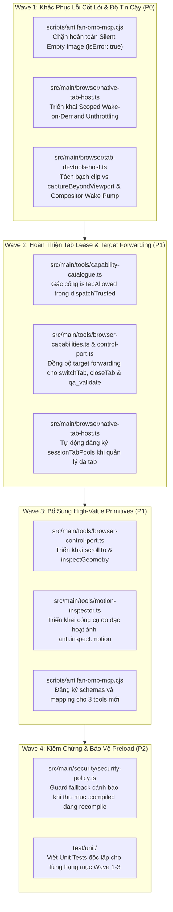

# Báo Cáo Phân Tích Toàn Diện & Kế Hoạch Gia Cố AntiFan Browser Desktop (Session Toda)

- **Ngày lập báo cáo:** 2026-09-05
- **Tập tin phân tích:** `C:/Users/Admin/.omp/agent/sessions/--E--Work-customizes-Toda--/2026-09-05T05-05-10-088Z_01a06ff4-cfc8-709a-8baf-2d4d0e3cceb1.jsonl`
- **Quy mô viễn trắc:** 1,804 records, 13 user turns, 340 assistant turns, 692 lượt gọi công cụ, 36 lỗi runtime (23 write errors, 13 non-write errors), 10 lần nộp issue trực tiếp vào `xd://report_issue`.
- **Dự án thực nghiệm:** Tùy biến storefront Haravan Toda Thailand (`https://todathailand.vn/`) đối sánh mẫu An Cường (`https://ancuong.com/`), kết hợp Google Sheets đa tab, form đặt mẫu, khối 3D Catalogue và hiệu ứng chạy chữ.
- **Môi trường máy trạm:** Windows 11 Pro, Intel(R) Core(TM) i5-9300H CPU @ 2.40GHz (4 physical cores, 8 threads), Intel(R) UHD Graphics 630 (VRAM chia sẻ hệ thống). Đã áp dụng kiến trúc Low-Spec Hardware Optimization (`plans/260830-1903`).
- **Trạng thái codebase thẩm tra:** Git branch `main` tại commit `c67003a` (*"fix(toolbar,browser): remove agent/alias tab badges, fix background capture bleed, and harden visual comparison"*).

---

## I. TỔNG QUAN VIỄN TRẮC & ĐIỂM NGHẼN HỆ THỐNG

### 1. Phân bố công cụ AntiFan MCP (285 lượt gọi)
- **`anti.browser.evaluate`**: **113 lượt (39.6% tổng số MCP calls)** — Tần suất bất thường, thể hiện sự thiếu hụt nghiêm trọng các primitive cấp cao. Agent phải tự viết script JS để cuộn trang (`window.scrollTo`), đo bounding rect (`getBoundingClientRect`), đọc tọa độ cuộn (`scrollY`), kiểm tra trạng thái trang (`document.readyState`), và bóc tách thuật toán chạy chữ từ website tham chiếu.
- **`anti.screenshot.viewport`**: **27 lượt** — Xuất hiện lỗi rò rỉ hình ảnh giữa các tab (Cross-Tab Bleed), timeout CDP 10 giây, và lỗi trả ảnh rỗng im lặng (`data: ""` với `isError: false`).
- **`anti.visual.compare`**: **10 lượt gọi — 8 lượt thất bại (tỷ lệ lỗi 80%)**, không xuất được biên nhận visual compare nào dù người dùng 2 lần yêu cầu (*"áp Visual Compare"* tại turn 975 và *"visual compare < 5%"* tại turn 1480).
- **`theme.qa_validate`**: **12 lượt** — 3 lần văng lỗi `TARGET_MISMATCH`, 1 lần xuất artifact rỗng (0 bytes).
- **`anti.browser.tabs.close`**: **9 lượt** — Bị chặn bởi `TARGET_MISMATCH` khi dọn dẹp tab phụ.
- **`xd://report_issue`**: **10 issue riêng biệt** do agent chủ động ghi nhận trong quá trình làm việc.

---

## II. MA TRẬN ĐỐI CHIẾU HIỆN TRẠNG TẠI HEAD (Post-c67003a Audit)

| # | Hạng mục / Điểm yếu | Trạng thái tại HEAD | Vị trí mã nguồn liên quan | Đánh giá kỹ thuật & Bằng chứng |
|---|---|---|---|---|
| **1** | **Target Metadata trong `theme.debug_bundle`** | 🟢 **ĐÃ FIX HOÀN TOÀN** | `browser-capabilities.ts:1335-1339` | Commit `c67003a` đã thêm `effectiveTarget = params.tabId ? { ...target, tabId } : target`. Đã có 103 dòng unit test kiểm chứng tại `test/unit/theme-evidence-capabilities.test.ts`. |
| **2** | **Schema `proofObligations` trong `record_claim`** | 🟢 **ĐÃ FIX HOÀN TOÀN** | `scripts/antifan-omp-mcp.cjs:52` | Đã khai báo đầy đủ cấu trúc `properties: { metric, tolerance, critical, expected }` và `required: ['metric']`. |
| **3** | **Toolbar UI (Gỡ bỏ Badges gây rối)** | 🟢 **ĐÃ FIX HOÀN TOÀN** | `toolbar.ts`, `toolbar.css` | Đã gỡ bỏ toàn bộ code render và styling cho badge `AGENT TAB` và tab alias. |
| **4** | **Cross-Tab Screenshot Bleed** | 🟡 **ĐÃ FIX MỘT PHẦN (Cần test thực tế)** | `tab-devtools-host.ts:1053-1054` | Đã đổi `fromSurface: isForeground`. Tuy nhiên, cờ `captureBeyondViewport: !isForeground` khi đi kèm `clip` trong CDP là tổ hợp có thể sinh ảnh rỗng trên một số phiên bản Chromium; ngoài ra nếu cả 3 tier fail thì dòng 1095 vẫn `return ''`. |
| **5** | **Tự động giải quyết Rect trong `visualCompare`** | 🟡 **ĐÃ FIX MỘT PHẦN** | `browser-control-port.ts:2356-2377, 2431-2448` | Đã bổ sung logic giải quyết `resolvedRect` và `compRect` từ `selector`. Tuy nhiên, nếu tab đối sánh ở background bị throttle thì capture vẫn fail với `TARGET_STALE`. |
| **6** | **Sự cố Preload ENOENT (`tab-preload.js`)** | 🔵 **ĐÍNH CHÍNH LẠI (Không phải bug CWD thuần túy)** | `security-policy.ts:119-124`, `package.json:16` | `security-policy.ts` đã kiểm tra đường dẫn `__dirname` trước `process.cwd()`, và file `.compiled/src/preload/tab-preload.js` có tồn tại. Căn nguyên thực tế: Race condition khi script `npm run compile` chạy `fs.rmSync('.compiled')` trong lúc app đang chạy. |
| **7** | **Background Tab Throttling (rAF pause & CDP timeout)** | 🔴 **CHƯA FIX (Căn nguyên gốc P0)** | `security-policy.ts:137` | Vẫn để `backgroundThrottling: true`. Tuyệt đối không flip bừa thành `false` toàn cục vì vi phạm cam kết Low-Spec Hardening (`plans/260830-1903`). Cần giải pháp **Scoped Unthrottling**. |
| **8** | **Lỗi Trả Ảnh Rỗng Im Lặng (`{"data":""}` với `isError: false`)** | 🔴 **CHƯA FIX (Defect độc lập tại HEAD)** | `scripts/antifan-omp-mcp.cjs:555-571` | `fetchArtifactBinary` khi nhận artifact 0-byte vẫn return `{ content: [{ type: 'image', data: '' }] }` mà không bật cờ `isError: true`, phá hỏng baseline so sánh mà agent không hay biết. |
| **9** | **Đơn nhiệm Tab Lease trong `theme.qa_validate` & `closeTab`** | 🔴 **CHƯA FIX (Cần gác cổng chuẩn)** | `browser-capabilities.ts:1168`, `browser-control-port.ts:939` | `theme.qa_validate` vẫn ném lỗi cứng `if (params.tabId !== target.tabId)`. Resolver ở control-port đã nới lỏng cho read, nhưng `qa_validate` và `closeTab` cần được định tuyến qua `isTabAllowed`. |
| **10** | **Lỗ hổng Bỏ qua Kiểm tra trong `dispatchTrusted`** | 🔴 **CHƯA FIX (Security Defect)** | `capability-catalogue.ts:223-231` | `dispatchTrusted` âm thầm ghi đè `context.browserTarget.tabId = reqTabId` mà không kiểm tra `isTabAllowed`, tạo kẽ hở lease bypass. |
| **11** | **Target Forwarding Bất Nhất trong `switchTab`** | 🔴 **CHƯA FIX (Logic Defect)** | `browser-capabilities.ts:216, 824, 1495`, `browser-control-port.ts:948` | `openTab`/`closeTab` truyền `{ target: context?.browserTarget }` nhưng `switchTab` nuốt chửng context, cho phép tab switch cướp focus cửa sổ mà không qua lease check. |
| **12** | **Thiếu Primitive Kiểm Tra Chuyển Động (`anti.inspect.motion`)** | 🔴 **CHƯA FIX (Feature Gap P1)** | Chưa có trong codebase | Không có công cụ đo tốc độ animation/transition/transform delta, buộc agent phải chạy 15+ eval scripts. |
| **13** | **Thiếu Primitive Cuộn & Đo Hình Học Cấp Cao (`scroll_to`, `geometry`)** | 🔴 **CHƯA FIX (Ergonomic Gap P1)** | Chưa có trong codebase | Căn nguyên trực tiếp dẫn tới 113 lượt gọi raw JS eval. |
| **14** | **Xung đột URI Artifact (`artifact://` numeric vs UUID)** | 🔴 **CHƯA FIX (P2)** | `scripts/antifan-omp-mcp.cjs` | AntiFan sinh UUID chuỗi, harness OMP chỉ chấp nhận ID số nguyên. |

---

## III. BẢN HỢP ĐỒNG BRAINSTORM (BRAINSTORM CONTRACT)

### 1. Outcome (Kết quả mong muốn)
AntiFan Browser Desktop đạt độ tin cậy tuyệt đối và tính tiện dụng cao cho kỹ sư theme storefront:
1. Chụp ảnh màn hình và so sánh trực quan trên background tabs hoàn tất không bị rò rỉ pixel active tab, không bị timeout CDP 10s, và không ném `TARGET_STALE` giả tạo.
2. Ngăn chặn hoàn toàn lỗi trả ảnh rỗng im lặng ở tầng biên giới MCP.
3. Bổ sung các primitive cấp cao (`scroll_to`, `inspect.geometry`, `inspect.motion`) để triệt tiêu nhu cầu viết raw JS eval.
4. Bảo toàn ranh giới bảo mật Tab Lease đồng thời hỗ trợ multi-tab workflow chuẩn tắc thông qua `sessionTabPools` và `isTabAllowed`.

### 2. Constraints (Ràng buộc kỹ thuật)
- **Bảo toàn Low-Spec Hardware Optimization:** Máy trạm chạy Intel Core i5-9300H + UHD 630. Background tabs khi idle bắt buộc phải duy trì mức tiêu thụ CPU $< 1\%$ và độ trễ event loop $< 50\text{ms}$. Tuyệt đối không tắt throttling toàn cục.
- **Bảo toàn Ranh giới Cô lập Tenant/Session:** Không được phép bypass lease bằng cách gán bừa `tabId`. Mọi thao tác đa tab phải được xác thực qua `isTabAllowed(boundTabId, reqTabId)`.
- **Tương thích ngược & Unit-Test First:** Mỗi thay đổi mã nguồn phải có test case kiểm chứng độc lập tương ứng trong `test/unit/`. Toàn bộ test suite (`npm run test:fast`, `npm run test:main`) phải xanh.

### 3. Non-goals (Phạm vi không can thiệp)
- Không viết lại toàn bộ Chromium architecture của Electron.
- Không thay đổi hành vi nghiệp vụ của các scanner Theme QA (Liquid, Layout Overflow, Broken Assets).

### 4. Acceptance Criteria (Tiêu chí nghiệm thu)
1. `anti.screenshot.viewport` trên background tab trả về đúng hình ảnh của tab đó, không chứa pixel tab foreground.
2. Nếu artifact ảnh có kích thước 0 byte, MCP adapter trả về `{ isError: true }` với thông báo lỗi rõ ràng, không bao giờ trả về payload thành công giả mạo.
3. `theme.qa_validate({ tabId })` và `anti.browser.tabs.close({ tabId })` thực thi thành công trên các tab phụ thuộc cùng session pool, nhưng ném `TARGET_MISMATCH` nếu tab không thuộc quyền sở hữu của session.
4. `anti.browser.tabs.activate` (`switchTab`) tuân thủ `context.browserTarget` và kiểm tra quyền sở hữu tab.
5. `anti.browser.scroll_to` cuộn chính xác theo tọa độ/selector và trả về `{ scrollX, scrollY, maxScroll }`.
6. `anti.inspect.motion` trích xuất được thông số animation và đo được transform delta giữa 2 tab theo các mốc cuộn.

---

## IV. PHÂN TÍCH CHUYÊN SÂU 4 ĐIỂM NGHẼN CỐT LÕI

### 1. Sự cố Background Throttling vs Kiến trúc Low-Spec
- **Thực tế:** `src/main/security/security-policy.ts:137` đặt `backgroundThrottling: true`. Khi tab không active, Chromium dừng `requestAnimationFrame` và compositor loop. Hậu quả là Record 842 văng timeout eval 15 giây, và các lệnh capture CDP bị rỗng frame.
- **Cái bẫy:** Lật `backgroundThrottling: false` toàn cục sẽ phá vỡ kiến trúc tối ưu đã chứng nhận ở `plans/260830-1903`, khiến 5-10 tab chạy ngầm ngốn sạch CPU máy trạm i5-9300H.
- **Giải pháp chuẩn:** **Scoped Wake-on-Demand**. Bổ sung wrapper `withUnthrottledTab(tabId, fn)` trong `NativeTabHost`. Khi agent gọi lệnh chụp ảnh hoặc eval trên background tab:
  1. Gọi `wc.setBackgroundThrottling(false)` và kích hoạt một nhịp render pump (`Page.startScreencast` / `Page.stopScreencast`).
  2. Thực thi lệnh capture/eval với timeout nới lỏng (1500ms).
  3. Khối `finally` hoàn trả ngay `wc.setBackgroundThrottling(true)` nếu tab không phải là foreground view.

### 2. Silent Empty Image Defect tại Biên giới MCP
- **Thực tế:** Record 746 và 1617 nhận được `{'type': 'image', 'data': '', 'mimeType': 'image/png'}` với `isError: false`.
- **Căn nguyên:** Dù `browser-control-port.ts:692` đã ném lỗi khi capture ra chuỗi rỗng, tại `scripts/antifan-omp-mcp.cjs:555-571`, hàm `fetchArtifactBinary` khi đọc artifact 0-byte qua HTTP chunk stream vẫn gom được chuỗi rỗng và trả về `content: [{ type: 'image', data: '' }]` mà không hề thiết lập cờ `isError: true`.
- **Giải pháp chuẩn:** Bắt lỗi tại cửa ngõ `antifan-omp-mcp.cjs`: Nếu `!artifactPayload.data || artifactPayload.data.length === 0`, bắt buộc trả về `{ isError: true, content: [{ type: 'text', text: 'Error: TARGET_STALE: Retrieved image payload is empty (0 bytes).' }] }`.

### 3. Rò rỉ Bảo mật Lease & Cơ chế Tab Registration
- **Thực tế:** `theme.qa_validate` và `closeTab` bị lỗi `TARGET_MISMATCH` khi agent tương tác với tab Google Sheets hoặc Storefront Toda.
- **Căn nguyên:**
  1. Tab Google Sheets được mở độc lập trước đó, chưa được liên kết vào `sessionTabPools` của session.
  2. `dispatchTrusted` tại `src/main/tools/capability-catalogue.ts:223-231` âm thầm ghi đè `context.browserTarget.tabId = reqTabId` mà không kiểm tra `isTabAllowed`, tạo lỗ hổng lease bypass.
  3. `switchTab` tại `browser-capabilities.ts` nuốt chửng `context`, không chuyển `context.browserTarget` vào `browser-control-port.ts:948`.
- **Giải pháp chuẩn:**
  - Định tuyến mọi thao tác đa tab qua `isTabAllowed(boundTabId, reqTabId)`.
  - Đồng bộ `context.browserTarget` cho `switchTab` và kiểm tra lease trước khi switch.
  - Sửa `dispatchTrusted` trong `capability-catalogue.ts`: Kiểm tra `isTabAllowed` trước khi cho phép gán tab mục tiêu mới.
  - Đảm bảo cơ chế tự động đăng ký `adoptChildTabForSession` hoạt động khi agent tạo tab hoặc nạp tab tham chiếu.

### 4. Bổ sung Primitives để Triệt Tiêu 113 Lượt Gọi Raw JS Eval
- **Thực tế:** Agent tốn hàng trăm ngàn tokens và nhiều vòng lặp chỉ để cuộn trang, đo vị trí phần tử và phân tích hoạt ảnh CSS.
- **Giải pháp chuẩn:**
  - `anti.browser.scroll_to`: Hỗ trợ `{ tabId?, x?, y?, selector?, behavior? }`, trả về `{ scrollX, scrollY, maxScroll }`.
  - `anti.inspect.geometry`: Nhận `{ tabId?, selector }`, trả về `{ bounds, inViewport, scrollY, readyState }`.
  - `anti.inspect.motion`: Nhận `{ tabId, comparisonTabId?, selector, sampleScrolls?: number[] }`, phân tích CSS animation/transition curve và tính toán delta chuyển vị ma trận `transform` giữa hai tab.

---

## V. KẾ HOẠCH HÀNH ĐỘNG CHI TIẾT (ACTIONABLE ROADMAP)



### Chi tiết Thực Thi Từng Hạng Mục:

#### 1. Đợt 1: Độ tin cậy & Chặn ảnh rỗng (P0)
- **`scripts/antifan-omp-mcp.cjs`**: Tại dòng 564, nếu `!artifactPayload.data || artifactPayload.data.length === 0`, trả về `{ isError: true, content: [{ type: 'text', text: 'Error: TARGET_STALE: Retrieved image payload is empty (0 bytes).' }] }`.
- **`src/main/browser/native-tab-host.ts`**: Bổ sung method `withScopedUnthrottledTab<T>(tabId: string, action: () => Promise<T>): Promise<T>` để tạm tắt throttling và bật nhịp render trước khi chụp ảnh, hoàn trả về `true` ngay sau đó.
- **`src/main/browser/tab-devtools-host.ts`**: Tại dòng 1054, nếu có tham số `clip/rect`, thiết lập `captureBeyondViewport: false` để tránh lỗi tính toán sai viewport clipping của Chromium trên background view.

#### 2. Đợt 2: Ranh giới Tab Lease & Bảo mật (P1)
- **`src/main/tools/capability-catalogue.ts`**: Trong `dispatchTrusted` (dòng 223-231), thay vì âm thầm gán `tabId`, phải kiểm tra:
  ```ts
  const isAllowed = this.options.isTabAllowed ? this.options.isTabAllowed(context.browserTarget.tabId, reqTabId) : false;
  if (!isAllowed) {
    throw new CapabilityError('TARGET_MISMATCH', `Trusted dispatch rejected: tabId "${reqTabId}" is not allowed for session tab "${context.browserTarget.tabId}".`);
  }
  ```
- **`src/main/tools/browser-capabilities.ts`**:
  - Dòng 216, 824, 1495 (`switchTab`): Chuyển thành `execute: (params: { tabId: string }, context) => browser.switchTab(params.tabId, { target: context?.browserTarget })`.
  - Dòng 1168 (`theme.qa_validate`): Sử dụng `effectiveTarget` sau khi kiểm tra `isTabAllowed(target.tabId, params.tabId)`.
- **`src/main/tools/browser-control-port.ts`**:
  - Dòng 948 (`switchTab`): Nhận `context?: { target?: BrowserTarget }` và kiểm tra `isTabAllowed` tương tự như `closeTab`.

#### 3. Đợt 3: Bổ sung Primitives Cấp Cao (P1)
- **`src/main/tools/browser-control-port.ts`**:
  - Xây dựng `scrollTo(target, params)`: Cuộn mượt hoặc tức thì theo tọa độ hoặc selector, trả về `{ scrollX, scrollY, maxScroll }`.
  - Xây dựng `inspectGeometry(target, params)`: Trích xuất `DOMRect`, `inViewport`, `scrollOffsets`, `readyState`.
- **`src/main/tools/motion-inspector.ts` (File mới)**:
  - Xây dựng `inspectMotion(target, params)`: Đọc CSS animations/transitions, đo tốc độ chuyển vị `transform` tại các mốc `sampleScrolls` giữa hai tab.
- **`scripts/antifan-omp-mcp.cjs`**: Cập nhật `definitions` và `CAPABILITY_MAP`.

#### 4. Đợt 4: Kiểm chứng & Bảo vệ Môi trường (P2)
- **`src/main/security/security-policy.ts`**: Thêm khối kiểm tra fallback và log cảnh báo nếu file `.compiled/src/preload/tab-preload.js` bị biến mất tạm thời trong lúc chạy `npm run clean / compile`.
- **Kiểm thử đơn vị:** Bổ sung các file test tương ứng vào `test/unit/`:
  - `test/unit/empty-payload-mcp-guard.test.ts`
  - `test/unit/tab-lease-security-gate.test.ts`
  - `test/unit/browser-primitives-contract.test.ts`
  - `test/unit/motion-inspector.test.ts`

---

## VI. ĐƯỜNG DẪN TẬP TIN BÁO CÁO

Báo cáo chi tiết này đã được kết xuất và lưu trữ tại đường dẫn sau trong repository:

📌 **`plans/reports/brainstorm-260905-antifan-toda-weaknesses-analysis.md`**

*(Tập tin hồ sơ bằng chứng gốc bổ trợ đi kèm: `plans/reports/antifan-session-toda-evidence-packet.md`)*