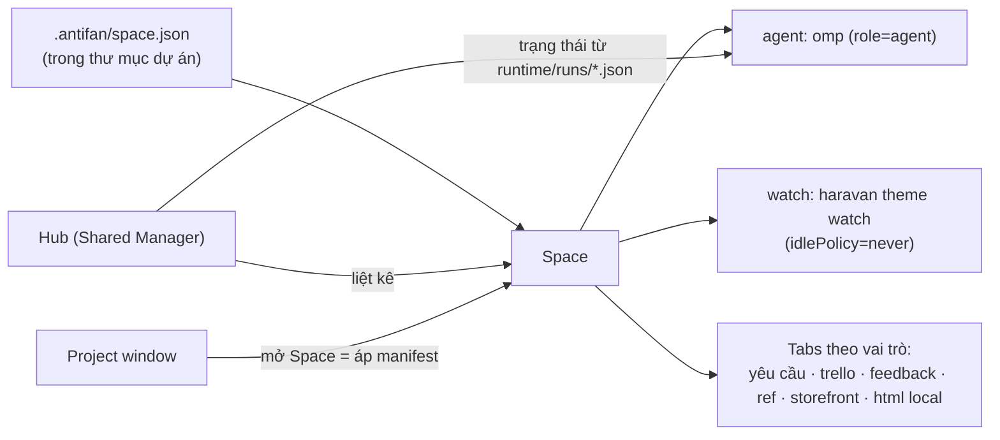

# Research Report: Terminal Hub cho solo dev chạy nhiều omp agent + bộ tab theo dự án

## Mục lục
1. Executive Summary · 2. Methodology · 3. Key Findings · 4. So sánh · 5. Khuyến nghị cho AntiFan · 6. Pitfalls · 7. Next steps · 8. Unresolved

## 1. Executive Summary
Các công cụ lớn năm 2026 đều hội tụ về **một mẫu kiến trúc**:
- **Một cửa sổ trung tâm liệt kê mọi agent/session của mọi dự án.** Ví dụ: Agents Window của Cursor 3 và VS Code, danh sách workspace của Conductor, Orca.
- **Cửa sổ làm việc theo từng workspace vẫn giữ nguyên** bên cạnh cửa sổ trung tâm.
- **Đơn vị quản lý là workspace**: thư mục/repo (+ nhánh/worktree) + agent + terminal. Không quản lý terminal rời.
- **Tín hiệu chính là trạng thái agent** (đang chạy / chờ người / xong), không phải danh sách terminal.
- **Bố cục mở bằng khai báo** (declarative launch config): Warp tab configs/launch configs, tmuxinator YAML. Tab trình duyệt gom theo **Space/Workspace** (Arc Spaces, Zen Workspaces, Chrome saved tab groups).

AntiFan đã có gần đủ nguyên liệu:
- Shared Manager = cửa sổ trung tâm.
- Project windows = cửa sổ theo dự án.
- Run files `runtime/runs/<sid>.json` với trạng thái `running | waiting_user`.
- Saved tabs theo owner, tab hibernation.

Thứ còn thiếu là **một "Space" khai báo cho mỗi dự án**, gồm thư mục + danh sách terminal/agent + bộ tab (yêu cầu, Trello, feedback, ref, storefront, HTML local). Hub cần hiện Space và trạng thái agent, không hiện "Terminal 7".

Hai loại va chạm khác nhau, cần hai cơ chế khác nhau, **dùng chung được**:
- **Va chạm file local** (hai agent sửa cùng checkout): git worktree / thư mục riêng giải quyết. Đây là trụ cột của Conductor, Orca, Claude Squad (README chính thức của Claude Squad: "Each task gets its own isolated git workspace", "How It Works" liệt kê tmux **và** git worktrees). Cách này vẫn dùng được cho theme nếu thư mục theme là git repo.
- **Va chạm theme remote** (hai tiến trình cùng upload lên một store/theme): worktree **không** giải quyết, vì mọi worktree cùng đẩy lên một theme. Ảnh trước có cảnh "Remote theme đã thay đổi so với local… ghi đè remote". Cần **tuần tự hoá upload**: tại một thời điểm, mỗi cặp store+theme chỉ có một tiến trình đồng bộ (watcher/push).

Tóm lại: quy tắc một người ghi chỉ áp cho **upload tới cùng store+theme**. Nó không cấm nhiều agent sửa song song trong các checkout tách biệt.

## 2. Research Methodology
- 5 truy vấn web (giới hạn skill), tổng hợp ~54 nguồn: docs chính thức (code.visualstudio.com, cursor.com, docs.warp.dev, docs.zen-browser.app, arc.net, conductor.build, github.com/stablyai/orca) + blog/review 2025–2026.
- Từ khoá: parallel coding agents manager/worktree, Orca, Cursor/VS Code agents window, Arc/Zen/Chrome workspaces, Warp launch config/tmuxinator/sesh.
- Đối chiếu với code AntiFan đã đọc trong phiên (xem mục 5).
- Hạn chế: phần lớn nguồn bên thứ ba là blog tổng hợp. Chi tiết tính năng lấy từ docs chính thức khi có. Chưa tự chạy thử Conductor/Orca.

## 3. Key Findings

### 3.1 Cửa sổ agent trung tâm là chuẩn chung
- **VS Code Agents window** và **Cursor 3 Agents Window**: một bề mặt riêng, mở cạnh editor. Gom mọi session thành một danh sách, hiện task, repo đích, context usage, local hay cloud. [code.visualstudio.com/docs/agents/run/agents-window](https://code.visualstudio.com/docs/agents/run/agents-window), [digitalapplied Cursor 3 guide](https://www.digitalapplied.com/blog/cursor-3-agents-window-complete-guide)
- Editor theo workspace **không bị bỏ**. Agents window là lớp điều phối phía trên. Đây đúng là mô hình lai AntiFan đang có (project windows + Shared Manager).
- Có chuyển giao session giữa local và background ("Continue In"): [code.visualstudio.com/learn/foundations/agent-sessions-and-where-agents-run](https://code.visualstudio.com/learn/foundations/agent-sessions-and-where-agents-run).

### 3.2 Công cụ chạy agent song song: workspace là đơn vị
| Tool | Hình thức | Đơn vị | Điểm đáng học |
|---|---|---|---|
| Conductor | App macOS | workspace = worktree + branch + agent | Checks/review gate trước merge ([docs](https://www.conductor.build/docs)) |
| Orca (Stably, MIT, macOS/Windows/Linux) | Electron ADE | mỗi agent một worktree | Scrollback sống qua restart, **browser Chromium nhúng + Design Mode** (click phần tử → HTML/CSS/ảnh cắt vào prompt), GitHub/Linear, app mobile báo xong việc, notifications + unread state; hỗ trợ mọi CLI agent kể cả oh-my-pi ([README](https://github.com/stablyai/orca)) |
| Vibe Kanban / Crystal | Web app local | card Kanban → worktree | Theo dõi bằng board thay vì nhìn terminal |
| Claude Squad | TUI + tmux + git worktree | mỗi task: một session tmux + một worktree/branch riêng | Pause/resume session (`c` checkout commit rồi pause, `r` resume), profile theo agent ([README](https://github.com/smtg-ai/claude-squad)) |

Nhận xét:
- Orca gần với AntiFan nhất: terminal + browser nhúng + element picker → prompt. AntiFan đã có tương đương (element-picker "Gửi tới", scrollback daemon, mobile remote).
- Điểm Orca làm tốt hơn: **mỗi agent gắn cứng với workspace của nó ngay từ lúc tạo**. Thanh bên hiện workspace, không hiện số terminal.

### 3.3 Bố cục khai báo cho mỗi dự án
- **Warp Tab Configs / Launch Configurations**: file TOML/YAML khai báo tab, pane, thư mục, lệnh khởi động; mở từ menu "+" hoặc URI. [docs.warp.dev/terminal/windows/tab-configs](https://docs.warp.dev/terminal/windows/tab-configs/), [launch-configurations](https://docs.warp.dev/terminal/sessions/launch-configurations/)
- **tmuxinator**: `root:` + `windows:`/`panes:` với lệnh khởi động; `tmuxinator start <project>`.
- **sesh**: fuzzy-switch giữa session đang chạy và thư mục hay dùng; tự bootstrap layout nếu session chưa có.
- Bài học: **"mở dự án" = áp một manifest**, không phải spawn tay từng terminal. Terminal tạo tay chính là nguồn của tình trạng "tứ tung".

### 3.4 Bộ tab web theo dự án
- **Arc Spaces**: mỗi Space là một sidebar riêng, có thể gắn Profile (cookie/đăng nhập riêng). Air Traffic Control tự đưa URL theo domain vào đúng Space. [arc.net Spaces](https://resources.arc.net/hc/en-us/articles/19228064149143-Spaces-Distinct-Browsing-Areas)
- **Zen Workspaces**: chia sidebar tab; cookie dùng chung trừ khi gắn Container. [docs.zen-browser.app/user-manual/workspaces](https://docs.zen-browser.app/user-manual/workspaces)
- **Chrome Saved Tab Groups**: lưu nhóm tab có tên, đóng để giải phóng RAM rồi mở lại nguyên nhóm. [xda](https://www.xda-developers.com/google-chrome-save-tab-groups/)
- Bài học cho theme dev:
  - Bộ tab của mỗi dự án có **vai trò cố định**: yêu cầu, Trello, feedback, ref, storefront, HTML local. Vai trò nên là dữ liệu có tên trong manifest, không phải URL rời.
  - Tương đương ATC: storefront domain `*.myharavan.com`/`*.mysapo.net` tự vào đúng Space. AntiFan đã có "Tự động (theo site URL)" trong picker, cùng ý tưởng.
  - Cần cô lập cookie khi nhiều store cùng nền tảng. AntiFan có `partition` theo tab (đã thấy trong changelog popup kế thừa partition).

## 4. So sánh hướng cho AntiFan
| Hướng | Mô tả | Phụ thuộc vào giả định nào | Hỏng đầu tiên khi | Kết luận |
|---|---|---|---|---|
| **A. Hub + Space khai báo** | Mỗi dự án có một manifest (thư mục, terminal/agent, bộ tab theo vai trò). Hub hiện Space + trạng thái agent. Project windows giữ nguyên để làm việc | Dự án có bộ tab/terminal lặp lại ổn định | Dự án ad-hoc không muốn manifest → cần "Space tạm" tạo từ thư mục | ✅ **Khuyến nghị**; đúng mẫu VS Code/Cursor + Warp + Arc |
| B. Một cửa sổ, switch Space kiểu Arc | Bỏ multi-window, một cửa sổ đổi Space | Làm một màn hình là đủ | Người dùng 3 màn hình (spec project-windows) muốn xem song song | ❌ Plan 260928 đã loại |
| C. Chỉ dọn + đặt tên terminal | Nhãn `<thư mục> · n`, gom theo thư mục | Lộn xộn do hiển thị | Terminal vẫn sinh tay, tab web vẫn rời | ⚠️ Cần làm nhưng không đủ; là bước 1 của A |
| D. Chuyển sang Orca/Conductor | Dùng tool ngoài | Tool ngoài hiểu theme remote sync / QA gate | Mất bridge MCP, theme QA gate, edit-mode guard (Conductor chỉ macOS; Orca chạy Windows nhưng không có các gate này) | ❌ Chỉ học ý tưởng |

## 5. Khuyến nghị cho AntiFan (hướng A)

### Mô hình


### Manifest mẫu (đề xuất, chưa tồn tại trong repo)
```json
{
  "schema": 1,
  "name": "Bagamuioto",
  "platform": "haravan",
  "terminals": [
    { "role": "agent", "name": "omp", "command": "omp", "idlePolicy": "idle" },
    { "role": "sync", "name": "watch", "command": "haravan theme watch", "idlePolicy": "never", "singleWriter": true }
  ],
  "tabs": [
    { "role": "request", "url": "https://docs.google.com/..." },
    { "role": "trello", "url": "https://trello.com/b/..." },
    { "role": "feedback", "url": "https://..." },
    { "role": "reference", "url": "https://..." },
    { "role": "storefront", "url": "https://bagamuioto.myharavan.com" },
    { "role": "local", "path": "specs/index.html" }
  ]
}
```
Lý do để file trong `.antifan/` của thư mục dự án: thư mục này đã tồn tại (ảnh hộp thoại), đi theo dự án và là nơi edit-guard/QA đã dùng. Khớp chuẩn `.vscode/`, `.tmuxinator.yml`.

### Nguyên liệu đã có trong repo
| Cần | Đã có | Vị trí |
|---|---|---|
| Cửa sổ trung tâm | Shared Manager `managerAll` | `native-tab-host.ts:6104` |
| Trạng thái agent | Run files `running/waiting_user` | `run-state-service.ts`, spec manager-run-cards |
| Tạo session với capsule chỉ định mà không đổi cửa sổ | `startTerminal/createSession(cwd, capsuleId, ownerKey)` lưu/khôi phục tạm | `terminal-manager.ts:1735-1745, 2176-2186` |
| Khử trùng thư mục | `realpathSync` + `findCapsuleByRoot` | `native-tab-host.ts:3860-3880` |
| Tab theo owner + hibernation | saved tabs, `tab-hibernation.ts` | — |
| Tự đưa URL vào đúng terminal | "Tự động (theo site URL)" | `element-picker.ts:838` |

### Thứ tự
1. **Hub hiện trạng thái agent theo Space**: gom theo đường dẫn thư mục thật, nhãn `<thư mục> · <vai trò>`, badge `đang chạy / chờ bạn / xong` từ run files. Đây là thứ Cursor/VS Code/Orca coi là trọng tâm.
2. **"+ Terminal trong thư mục…"** trong Hub: route mới, không đi qua `pick-folder` (route đó đổi capsule của cả process).
3. **Manifest `space.json` + "Mở Space"**: áp terminal + tab. Terminal `role=sync` mặc định `idlePolicy: never`.
4. **Tuần tự hoá upload theo store+theme**: Hub cảnh báo khi hai terminal đồng bộ (watcher/push) cùng nhắm một store+theme. Không cấm agent sửa song song trong checkout riêng; worktree vẫn dùng được cho phần local.
5. **Space tạm**: mở thư mục chưa có manifest → Space không có tab; nút "Lưu thành Space" chụp tab + terminal hiện tại (giống Chrome Save group / Warp "save launch config").

## 6. Common Pitfalls
- **Nhầm hai loại va chạm**: worktree chỉ tách file local; mọi worktree vẫn upload vào cùng một theme remote. Cần cả hai cơ chế: tách checkout (nếu muốn sửa song song) và một tiến trình upload cho mỗi store+theme.
- **Gom theo mã capsule**: đã có tiền lệ một thư mục sinh 9 capsule (`native-tab-host.ts:3874-3877`). Phải gom theo đường dẫn thật.
- **Tự ngủ terminal watcher**: sleep là `killProcessTree` (`terminal-manager.ts:2039,2044`), watcher chết thì QA báo `WATCHER_SLEEPING`.
- **Hub thành cửa sổ làm việc spawn không chủ**: 7/13 session hiện tại là `unassigned`. Mọi spawn từ Hub phải có thư mục tường minh.
- **Cookie dùng chung giữa các store**: Zen workspaces cũng gặp. Tab storefront của từng dự án nên dùng partition riêng khi cần đăng nhập admin khác nhau.

## 7. Next steps
1. Kiểm lại nguyên nhân hộp thoại (xem Unresolved #1) trước khi sửa.
2. Chốt: manifest trong thư mục dự án hay lưu tập trung trong data root.
3. Lập plan (`ak:plan`) cho bước 1–5, xếp cùng plan `260928-1654-smooth-multi-project-terminal` vì cùng file.

## 8. Unresolved questions
1. **Hộp thoại không mở `E:\Work` – đã xác nhận ở mã nguồn**: Electron `shell/browser/ui/file_dialog_win.cc` `SetDefaultFolder` đưa nguyên `file_path.value()` vào `SHCreateItemFromParsingName`, lỗi thì bỏ qua `SetFolder` không báo ([source](https://github.com/electron/electron/blob/main/shell/browser/ui/file_dialog_win.cc)). Probe Win32: `'E:/Work'` = `E_INVALIDARG`, `'E:\Work'` = `S_OK`. Còn thiếu: smoke thật trên bản Electron đang cài (nhánh `main` có thể khác bản đóng gói).
2. Manifest nên nằm trong `.antifan/` của dự án (đi theo thư mục, có thể lộ URL Trello nội bộ nếu commit) hay tập trung trong data root?
3. Upload trùng store+theme: chặn cứng hay chỉ cảnh báo?
4. Trạng thái "chờ bạn" có đủ tin cậy từ run files cho mọi agent (omp adapter khác nhau) không? Cần xác minh adapter nào ghi `waiting_user`.
