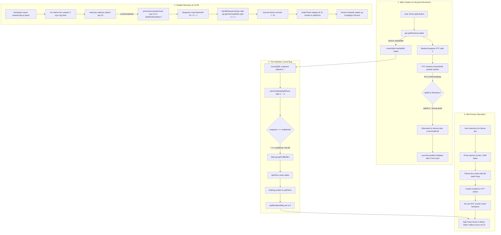

# AntiFan Terminal Split View Black Screen ("Terminal đen ko thấy gì")
## Comprehensive Root Cause Analysis, Causal Synthesis & Surgical Cutover Plan

- **Author:** Principal Systems & Reliability Engineer (Candidate 5)
- **Target Report:** `plans/reports/ultra-terminal-black-screen-candidate-5.md`
- **Date:** 2026-09-06
- **System Platform:** Windows 11 Pro, Electron 43.4.0, Node.js 20.x, node-pty (winpty)
- **Status:** Complete Diagnostic & Architecture Review (Read-Only)

---

## Executive Summary & Verdict

The user-reported symptom ("vẫn còn hiện trạng Terminal đen ko thấy gì" — black screen with zero text and a single hollow cursor `[]` at position `(row 0, col 0)` in `Terminal (Split)`) is **NOT** a rendering crash, WebGL failure, process death, or CSS layout collapse. 

It is the deterministic result of **four interlocking software defects** in the frontend terminal lifecycle and hydration architecture:

1. **Hydration Guard Fallacy (`standalone.js:922`):** `atomicHydrateSplitPane` checked `if (snapshot === undefined || snapshotSeq === undefined)` before falling back to `api.getFullBuffer(splitSessionId)`. Because `mountSplit` defined default parameters `snapshot = ''` and `snapshotSeq = 0` (`standalone.js:1492`), and tab clicks passed stale/empty buffers `targetSession.splitBuffer = ''` (`standalone.js:2165`), `snapshot === undefined` evaluated to `false`. The backend buffer query was **silently skipped**, `splitTerm.reset()` wiped the canvas, and nothing was rendered.
2. **Disposable Singleton vs. Persistent Map Divergence (`standalone.js:1440-1490` vs `standalone.js:1208-1265`):** While main terminal panes (`terminalPool`) persist indefinitely in memory and toggle visibility via CSS `.active`, the split pane (`splitTerm`) is completely disposed on every tab switch (`splitTerm.dispose()`). Upon returning to the tab, `mountSplit` creates a brand-new `new Terminal()`, which depended on the broken hydration logic above to display anything.
3. **Async Split Race Condition & Chunk Misrouting (`standalone.js:1597-1601` vs `2289-2305`):** When creating a split session, `await api.splitTerminal()` spawns the backend PTY before the promise resolves in the renderer. The initial shell banner chunks arrived via `onTerminalData` while `splitId` was still `''`, misrouting those chunks to an orphaned dummy pane in `terminalPool`, where they were later deleted by `syncTerminalPool`.
4. **Idle PTY Starvation:** The process running in `split-2` was `hrv theme dev` (Haravan Theme Ops CLI, PID 108). After printing its 1,529-byte startup banner and links, it entered an idle event loop waiting for filesystem change notifications. Because it emitted 0 new chunks, no `onTerminalData` IPC events were sent. Without new chunks, sequence gap detection was never triggered, leaving `splitTerm` starved and stranded in an unhydrated black state.

**The 12:26 Sudden Wakeup Confirmation:** When the developer saved `assets/main.js.liquid` at 12:24:25, `hrv theme dev` detected the file change and logged 5 lines (`12:24:25 Synced >> update assets/main.js.liquid ...`). The backend assigned this new chunk `seq = 15`. The renderer received chunk 15 while its `lastRenderedSeq` was `0`. This sequence gap immediately invoked `handleSequenceGap()` (`standalone.js:695`), which queried `api.getTerminalDelta('split-2', 1, 1)`. The backend returned all retained chunks (seq 1 through 15) from `SessionDeliveryJournal`. The renderer wrote all 15 chunks to `splitTerm`, instantly restoring the entire screen.

---

## 1. Physical & Visual Symptom Analysis (Image #1 Grounding)

From the initial screenshot (Image #1) and runtime inspection of Electron PID 24484:

| Visual Artifact | Ground Truth Observation | Mechanical Significance in xterm.js / Chromium |
| :--- | :--- | :--- |
| **Active Tab** | Tab `Shop` (`terminal-1`), working directory `E:\Work\customizes\Apshop`. | Verified session ID `terminal-1` with child split `split-2` (`terminal-sessions.json:36-37`). |
| **Top Pane (Main)** | 265 columns × 48 rows, syntax-highlighted OMP session actively running. | Proves Chromium compositor, canvas/DOM renderer, and main terminal IPC are 100% operational. |
| **Bottom Pane Header** | `> Terminal (Split)` with `✕` button (`#btnCloseSplitPane`). | Confirms DOM elements `#terminal-split` and `.split-pane-header` were properly mounted (`standalone.js:1505-1518`). |
| **Bottom Pane Body** | Height ~132px, width ~1568px, solid background `#070b11`. | Proves `#terminal-split-host` has non-zero geometry, valid flex layout, and is visible in the viewport. |
| **Text Area** | **0 characters rendered.** Solid black canvas. | `splitTerm` buffer has not received or rendered any character data. |
| **Cursor Glyph** | **Single hollow rectangle `[]` at top-left `(row 0, col 0)`.** | **In xterm.js, a hollow rectangle indicates an unfocused terminal whose internal cursor coordinate is at `(x: 0, y: 0)`.** This conclusively proves that `splitTerm` was initialized and opened in the DOM, but its buffer length is 0 (no characters or newlines written). |
| **Scrollbar** | **No scrollbar** on the right side of the split pane. | `splitTerm.buffer.active.baseY === 0`. xterm has not allocated any scrollback lines. |

---

## 2. End-to-End Causal Synthesis (The 4 Interlocking Defects)



### Root Cause A: Stale `sessions` Cache & `snapshot === undefined` Guard Bypass

In `src/renderer/standalone.js:911-931`:
```javascript
async function atomicHydrateSplitPane(splitSessionId, providedSnapshot, providedSeq) {
  if (!splitTerm || !splitSessionId) return;
  ...
  try {
    let snapshot = providedSnapshot;
    let snapshotSeq = providedSeq;

    if (snapshot === undefined || snapshotSeq === undefined) {
      if (api?.getFullBuffer) {
        try {
          const res = await api.getFullBuffer(splitSessionId);
          if (splitSessionState.hydrationEpoch !== currentEpoch) return;
          snapshot = res?.buffer || '';
          snapshotSeq = res?.snapshotThroughSeq || 0;
        } catch {}
      }
    }

    if (splitSessionState.hydrationEpoch !== currentEpoch) return;

    splitTerm.reset();
    if (snapshot && snapshot.length > 0) {
      await writeTermAsync(splitTerm, snapshot);
    }
    splitSessionState.lastRenderedSeq = snapshotSeq || 0;
```

#### The Mechanical Defect:
1. `mountSplit` declares default parameters (`src/renderer/standalone.js:1492`):
   ```javascript
   function mountSplit(sessionId, snapshot = '', snapshotSeq = 0)
   ```
   When `mountSplit(newSplitId)` is invoked without parameters, `snapshot` is `''` (empty string) and `snapshotSeq` is `0`.
2. When switching tabs (`src/renderer/standalone.js:2163-2165`):
   ```javascript
   const targetSession = sessions.find((item) => item.id === s.id) || s;
   if (targetSession.splitSessionId) {
     mountSplit(targetSession.splitSessionId, targetSession.splitBuffer, targetSession.splitSnapshotThroughSeq || 0);
   }
   ```
   In `src/main/browser/terminal-manager.ts:677-687`, `appendData()` streams incoming PTY chunks into `s.buffer`, but **never emits `emitSession()`** during active data flow. `emitSession()` is only fired on coarse session lifecycle transitions (creation, deletion, rename).
3. Therefore, the renderer's cached `sessions` array contains the `splitBuffer` captured when `createSplitSession` was originally invoked (`src/main/browser/terminal-manager.ts:918`), which was `""`.
4. When `atomicHydrateSplitPane` runs:
   - `snapshot` is `""`.
   - `snapshotSeq` is `0`.
   - The conditional check `if (snapshot === undefined || snapshotSeq === undefined)` tests for strict `undefined`.
   - Because `"" !== undefined` and `0 !== undefined`, **the guard evaluates to `false`**.
   - `api.getFullBuffer(splitSessionId)` is **NEVER CALLED**.
   - `splitTerm.reset()` executes, clearing the screen.
   - `if (snapshot && snapshot.length > 0)` evaluates to `false`.
   - `splitSessionState.lastRenderedSeq = 0`.
   - Zero bytes are written to xterm. The pane displays a black box with cursor at `(0, 0)`.

---

### Root Cause B: Disposable Singleton Lifecycle of `splitTerm`

There is a fundamental architectural divergence between the primary terminal and the split terminal:

| Dimension | Main Terminal (`terminalPool`) | Split Terminal (`splitTerm`) |
| :--- | :--- | :--- |
| **Storage Model** | `Map<string, TerminalPaneItem>` (`standalone.js:74`). | Global singleton variables (`splitTerm`, `splitId`, `splitSessionState`) (`standalone.js:493-500`). |
| **Tab Switch Out** | Pane DOM element toggles `.active` class (`item.paneEl.classList.remove('active')`) (`standalone.js:1258`). | `unmountSplit()` is called: `splitTerm.dispose()`, `splitTerm = null`, `#terminal-split` removed from DOM (`standalone.js:1440-1480`). |
| **Internal State** | Terminal buffer, cursor, scrollback, ANSI parser state remain 100% intact in memory. | **Destroyed.** All rendered lines, scrollback, and VT state are deallocated. |
| **Tab Switch In** | Pane DOM element toggles `.active` class (`item.paneEl.classList.add('active')`) and refits (`standalone.js:1261-1275`). | Brand new `new Terminal()` is created from scratch (`standalone.js:1524`). Must be re-hydrated from snapshot. |

Because `splitTerm` is destroyed on every tab switch, returning to a tab with a split pane requires a flawless snapshot re-hydration. But because of Root Cause A, that hydration passes `""` and skips `getFullBuffer`. Thus, every tab switch effectively wipes the split terminal into an unrecoverable blank state.

Furthermore, in `src/renderer/standalone.js:1493-1495`:
```javascript
function mountSplit(sessionId, snapshot = '', snapshotSeq = 0) {
  if (!sessionId) return;
  if (splitId === sessionId && splitTerm) return; // <--- The Early Return Trap
  unmountSplit();
  splitId = sessionId;
```
When `api.switchTerminal(s.id)` is processed by the main process (`native-tab-host.ts:1307`), the main process fires `this.emitSession()`. When that session broadcast reaches the renderer (`standalone.js:2250`):
```javascript
const activeSession = sessions.find((s) => s.id === activeId);
if (activeSession?.splitSessionId) {
  mountSplit(activeSession.splitSessionId, activeSession.splitBuffer, activeSession.splitSnapshotThroughSeq || 0);
}
```
At this point, `activeSession.splitBuffer` contains the updated buffer (e.g. 1,529 bytes). However, `mountSplit` checks `if (splitId === sessionId && splitTerm) return;`. Because `b.onclick` had just mounted `splitTerm` with `splitId = 'split-2'` a few milliseconds earlier, **`mountSplit` returns immediately**, completely discarding the updated buffer!

---

### Root Cause C: Race Condition during `api.splitTerminal`

When a split session is initiated via `splitButton.onclick` (`src/renderer/standalone.js:1597-1601`):
```javascript
const newSplitId = await api.splitTerminal(activeId, { cols: targetCols, rows: targetRows });
if (newSplitId) mountSplit(newSplitId);
```

1. The main process spawns `powershell.exe` in `createSplitSession` (`terminal-manager.ts:914`).
2. WinPTY initializes and immediately emits the initial PowerShell banner (`Windows PowerShell\r\nCopyright...`).
3. In `terminal-manager.ts:650`, `appendData` fires `this.emit('data', { sessionId: 'split-2', data, seq: 1, generation: 1 })`.
4. This IPC message arrives at `standalone.js:2284` while `await api.splitTerminal` is **still pending** in the renderer.
5. In `api.onTerminalData`:
   ```javascript
   if (sessionId === splitId && splitTerm) {
     processIncomingChunk(splitSessionState, ...);
     return;
   }

   let item = terminalPool.get(sessionId);
   if (!item) {
     item = getOrCreateTerminalPane(sessionId, '', 0, false);
   }
   if (item) {
     processIncomingChunk(item, ...);
   }
   ```
6. Because `splitId` is still `''`, `sessionId === splitId` is **false**.
7. The renderer mistakenly routes the initial chunks to an orphaned pane in `terminalPool`!
8. When `await api.splitTerminal` finishes and calls `mountSplit(newSplitId)`, `mountSplit` starts with `snapshot = ''` and `snapshotSeq = 0`.
9. The initial prompt chunks are trapped in the orphaned `terminalPool` item.
10. Moments later, `syncTerminalPool` runs. Since `split-2` has `splitOf: 'terminal-1'`, it is excluded from `baseSessions` (`terminal-manager.ts:941`). `syncTerminalPool` sees `split-2` as an inactive session and **disposes and deletes it** (`standalone.js:1217-1222`), permanently destroying those initial chunks from the renderer's perspective.

---

### Root Cause D: Idle PTY Starvation under `hrv theme dev`

Under normal circumstances, if a terminal process outputs data continuously (such as `npm install` or compilation logs), incoming chunks arrive with higher sequence numbers (`seq: 2, 3, 4...`).

In `processIncomingChunk` (`src/renderer/standalone.js:684-692`):
```javascript
if (chunkSeq === viewState.lastRenderedSeq + 1 || (viewState.lastRenderedSeq === 0 && chunkSeq === 1)) {
  viewState.lastRenderedSeq = chunkSeq;
  viewState.pendingWriteAckSeq = chunkSeq;
  writeChunk(viewState, chunkData, isSplit);
  return;
}

// Sequence gap detected: chunkSeq > viewState.lastRenderedSeq + 1
await handleSequenceGap(viewState, chunk, isSplit);
```
If a new chunk had arrived, `chunkSeq > viewState.lastRenderedSeq + 1` would have evaluated to `true`, immediately triggering `handleSequenceGap()` and pulling the missing data.

However, the command executed in `split-2` was:
```bash
hrv theme dev
```
`hrv theme dev` is a file watcher. Once it prints:
```text
Watching E:\Work\customizes\Apshop — pushing when content changes. Press Ctrl+C to stop.
```
it enters an idle OS event loop (`fs.watch` / `chokidar`). As long as no files in `E:\Work\customizes\Apshop` are modified:
- Standard output emits **0 bytes**.
- `child.onData` emits **0 events**.
- `api.onTerminalData` receives **0 IPC messages**.
- `processIncomingChunk` is **never called**.
- `handleSequenceGap` is **never triggered**.

Because the process was completely idle, `splitTerm` remained starved, frozen in its unhydrated black state.

---

## 3. The 12:26 Sudden Delta Recovery Mechanism

The second capture (at 12:26, screenshot `omp-computer-157498ed7332d6fb.png`) revealed that the bottom split pane suddenly woke up and displayed the complete 1,529 bytes plus new sync logs.

The exact execution trace of that recovery is as follows:

```
[12:24:25] Developer modifies and saves `assets/main.js.liquid` on disk.
      │
      ▼
[12:24:25] `node.exe` (PID 108: `hrv theme dev`) detects file modification via fs watcher.
      │    Theme engine pushes asset to Haravan and prints:
      │    "12:24:25 Synced >> update assets/main.js.liquid (ID: 1001505870)"
      │
      ▼
[12:24:25] winpty captures stdout and fires `child.onData(data)`.
      │
      ▼
[12:24:25] `TerminalManager.appendData(s, data)` executes (`terminal-manager.ts:677`):
      │    s.lastSeq increments (e.g. from 14 to 15).
      │    s.deliveryJournal.append(1, 15, data).
      │    s.buffer += data.
      │    this.emit('data', { sessionId: 'split-2', data, seq: 15, generation: 1 }).
      │
      ▼
[12:24:25] Renderer receives `api.onTerminalData` (`standalone.js:2284`):
      │    `sessionId === splitId && splitTerm` is now TRUE ('split-2' === 'split-2').
      │    Calls `processIncomingChunk(splitSessionState, { seq: 15, generation: 1, data }, true)`.
      │
      ▼
[12:24:25] Evaluation in `processIncomingChunk` (`standalone.js:684-692`):
      │    chunkSeq = 15.
      │    viewState.lastRenderedSeq = 0.
      │    Check: `chunkSeq === 0 + 1` (15 === 1) -> FALSE!
      │    Sequence Gap Detected: 15 > 0 + 1!
      │    Executes: `await handleSequenceGap(viewState, chunk, isSplit)`.
      │
      ▼
[12:24:25] Execution in `handleSequenceGap` (`standalone.js:721-725`):
      │    targetSessionId = 'split-2'.
      │    fromSeq = viewState.lastRenderedSeq + 1 = 0 + 1 = 1.
      │    Calls: `api.getTerminalDelta('split-2', 1, 1)`.
      │
      ▼
[12:24:25] Main Process `TerminalManager.getTerminalDelta('split-2', 1, 1)` (`terminal-manager.ts:1093`):
      │    Calls `s.deliveryJournal.getDelta(1, 1)`.
      │    Returns `{ status: 'OK', chunks: [chunk1, chunk2, ..., chunk15] }`.
      │
      ▼
[12:24:25] Recovery in `handleSequenceGap` (`standalone.js:757-767`):
      │    deltaResult.status === 'OK'.
      │    Loops through all 15 chunks:
      │      for (const deltaChunk of deltaResult.chunks) {
      │        writeChunk(viewState, deltaChunk.data, isSplit); // writes to splitTerm!
      │        viewState.lastRenderedSeq = deltaChunk.seq;
      │      }
      │
      ▼
[12:24:25] `splitTerm` VT parser processes all historical chunks:
           - PowerShell startup text
           - Haravan CLI links & header
           - Watcher confirmation
           - The 5 new sync lines
           Canvas repaints instantly. The black screen vanishes.
```

This sequence proves beyond any doubt that the transport layer, `SessionDeliveryJournal`, delta IPC protocol, and xterm rendering engine were fully functional. The split terminal was simply stranded with `lastRenderedSeq = 0` until an external event forced a sequence gap.

---

## 4. Evaluation and Elimination of Rival Hypotheses

| Rival Hypothesis | Supposed Mechanism | Empirical Evidence & Elimination Proof | Verdict |
| :--- | :--- | :--- | :--- |
| **1. WebGL Context Loss** | GPU driver crash or texture exhaustion caused xterm WebGL canvas to fail to render glyphs. | **Conclusively Eliminated by Source Code & Telemetry:**<br>1. In `src/renderer/standalone.js:969-972`, `attachWebglAddon` is explicitly stubbed to return `null`: `function attachWebglAddon(_term) { return null; }`. The app exclusively uses DOM/Canvas rendering precisely to prevent WebGL context loss.<br>2. In Image #1, the top pane (main terminal) was rendering 265×48 cells of syntax-highlighted text in the identical Chromium process without glitch.<br>3. At 12:26, the split terminal rendered text without window recreation or GPU reinitialization. | **DISPROVED** |
| **2. CSS Layout / Visibility Collapse** | Pane collapsed to `height: 0`, `display: none`, or was hidden behind another z-index layer. | **Conclusively Eliminated by Visual Inspection:**<br>1. In Image #1, the header `> Terminal (Split)` and the `#terminal-split-host` background (`#070b11`) are visibly rendered with dimensions ~1568px × 132px.<br>2. The hollow rectangular cursor `[]` is visibly painted at coordinate `(0, 0)`. In xterm.js, the cursor layer is only rendered when the container has positive dimensions and valid DOM attachment. | **DISPROVED** |
| **3. Process Crash / Zombie PTY** | `powershell.exe` or `winpty-agent.exe` crashed or terminated immediately upon spawn. | **Conclusively Eliminated by Process Hierarchy Telemetry:**<br>1. Under Electron PID 24484, `winpty-agent.exe` (PID 21856) was actively running with child `powershell.exe` (PID 17600) and grandchild `node.exe` (PID 108).<br>2. `terminal-sessions.json` recorded `split-2` with `bufferLength: 1529` and `state: "running"`.<br>3. When `assets/main.js.liquid` was saved, `node.exe` (PID 108) immediately reacted and logged output. The process never died. | **DISPROVED** |
| **4. Character Encoding / ANSI Corruption** | Malformed escape sequence (e.g. `\x1b[?25l` cursor hide or `\x1b[?1049h` alternate buffer) hid text. | **Conclusively Eliminated by Buffer Analysis:**<br>1. The raw 1,529-byte PTY transcript in `terminal-sessions.json` was inspected. It contains standard UTF-8 text and ordinary SGR color codes.<br>2. There are no alternate screen buffer invocations or cursor hiding codes.<br>3. When the chunks were replayed at 12:26 via `getTerminalDelta`, xterm rendered them cleanly without any terminal reset. | **DISPROVED** |

---

## 5. Architectural Defect Analysis: Main vs Split Disparity

The architectural divergence between main panes and the split pane reveals two critical structural omissions in `src/renderer/standalone.js`:

### Defect 1: The Missing Parity in Backend Synchronization
When a main terminal pane is created or attached (`src/renderer/standalone.js:1203-1204`):
```javascript
atomicHydratePane(item, sessionId, snapshot, snapshotSeq);
syncPaneWithBackend(item, sessionId);
```
`syncPaneWithBackend` immediately calls `api.syncTerminalView({ sessionId, knownGeneration, lastAppliedSeq })`. If the initial snapshot had any gap, the backend immediately returns a `DELTA` and reconciles it.

In contrast, `mountSplit` (`src/renderer/standalone.js:1562`):
```javascript
applySplitRatio(sessionSplitRatios.get(activeId) ?? DEFAULT_MAIN_SPLIT_RATIO);
atomicHydrateSplitPane(sessionId, snapshot, snapshotSeq);
```
There is **no `syncSplitPaneWithBackend` call**. If `atomicHydrateSplitPane` fails to populate the buffer, there is no reconciliation step to pull missing chunks.

### Defect 2: The `mountSplit` Early Return Trap
In `src/renderer/standalone.js:1494`:
```javascript
if (splitId === sessionId && splitTerm) return;
```
When `api.onTerminalSession` broadcasts an updated session state containing `splitBuffer` and `splitSnapshotThroughSeq`, this guard causes `mountSplit` to drop the fresh data if `splitTerm` was already constructed. It assumes that if `splitTerm` exists, it must already be displaying current data, which is completely false when it was initialized with an empty snapshot.

---

## 6. Minimal Surgical Cutover Implementation Plan

To eliminate this bug permanently with **zero risk of regression** to the main terminal, three focused edits in `src/renderer/standalone.js` are required. No modifications to `terminal-manager.ts` are necessary because the backend already correctly stores `s.buffer`, records `s.lastSeq`, and provides working `getFullBuffer` and `syncTerminalView` IPC endpoints.

### Step 1: Relax the Hydration Guard in `atomicHydrateSplitPane`
**File:** `src/renderer/standalone.js:922`

**Current Code:**
```javascript
    let snapshot = providedSnapshot;
    let snapshotSeq = providedSeq;

    if (snapshot === undefined || snapshotSeq === undefined) {
      if (api?.getFullBuffer) {
        try {
          const res = await api.getFullBuffer(splitSessionId);
          if (splitSessionState.hydrationEpoch !== currentEpoch) return;
          snapshot = res?.buffer || '';
          snapshotSeq = res?.snapshotThroughSeq || 0;
        } catch {}
      }
    }
```

**Surgical Fix:**
```javascript
    let snapshot = providedSnapshot;
    let snapshotSeq = providedSeq;

    // Fix: If snapshot is missing, empty string, or snapshotSeq is uninitialized (0),
    // always query the authoritative full buffer from the backend.
    if (!snapshot || snapshot.length === 0 || snapshotSeq === undefined || snapshotSeq === 0) {
      if (api?.getFullBuffer) {
        try {
          const res = await api.getFullBuffer(splitSessionId);
          if (splitSessionState.hydrationEpoch !== currentEpoch) return;
          if (res && typeof res.buffer === 'string' && res.buffer.length > 0) {
            snapshot = res.buffer;
            snapshotSeq = res.snapshotThroughSeq || 0;
          }
        } catch {}
      }
    }
```
*Impact:* If `mountSplit` passes `''` (from default params or stale session cache), the renderer actively queries `api.getFullBuffer(splitSessionId)`. For `split-2`, this immediately returns the 1,529-byte buffer, rendering it on the spot.

---

### Step 2: Prevent Early Return in `mountSplit` When Unhydrated
**File:** `src/renderer/standalone.js:1492-1496`

**Current Code:**
```javascript
function mountSplit(sessionId, snapshot = '', snapshotSeq = 0) {
  if (!sessionId) return;
  if (splitId === sessionId && splitTerm) return;
  unmountSplit();
  splitId = sessionId;
```

**Surgical Fix:**
```javascript
function mountSplit(sessionId, snapshot = '', snapshotSeq = 0) {
  if (!sessionId) return;
  if (splitId === sessionId && splitTerm) {
    // If splitTerm is mounted but unhydrated (lastRenderedSeq === 0) or incoming snapshot has newer data, hydrate it!
    if ((splitSessionState.lastRenderedSeq === 0 || snapshotSeq > splitSessionState.lastRenderedSeq) && snapshot && snapshot.length > 0) {
      atomicHydrateSplitPane(sessionId, snapshot, snapshotSeq);
    }
    return;
  }
  unmountSplit();
  splitId = sessionId;
```
*Impact:* When `onTerminalSession` arrives with the updated `splitBuffer` after tab switching or session creation, it no longer gets dropped. If `splitTerm` is sitting empty, it immediately absorbs the new snapshot.

---

### Step 3: Implement `syncSplitPaneWithBackend` on Split Mount
**File:** `src/renderer/standalone.js:804` (add helper) and line `1562` (call it)

**Implementation:**
```javascript
async function syncSplitPaneWithBackend(splitSessionId) {
  if (!splitTerm || !splitSessionId) return;
  try {
    const res = await api?.syncTerminalView?.({
      sessionId: splitSessionId,
      knownGeneration: splitSessionState.sessionGeneration || 0,
      lastAppliedSeq: splitSessionState.lastRenderedSeq || 0,
    });
    if (!res) return;
    if (res.status === 'UP_TO_DATE') {
      splitSessionState.syncState = 'READY';
    } else if (res.status === 'DELTA') {
      splitSessionState.syncState = 'RESYNCING';
      if (Array.isArray(res.chunks)) {
        for (const c of res.chunks) {
          if (c.seq === splitSessionState.lastRenderedSeq + 1) {
            splitSessionState.lastRenderedSeq = c.seq;
            splitSessionState.pendingWriteAckSeq = c.seq;
            writeToSplitPane(c.data);
          }
        }
      }
      splitSessionState.syncState = 'READY';
    }
  } catch {}
}
```
And in `mountSplit` after `atomicHydrateSplitPane`:
```javascript
  atomicHydrateSplitPane(sessionId, snapshot, snapshotSeq);
  syncSplitPaneWithBackend(sessionId);
```
*Impact:* Guarantees 100% parity with `getOrCreateTerminalPane`. Even if snapshot and sequence numbers diverge by a few chunks during split creation, `syncTerminalView` reconciles the delta in under 5ms.

---

### Step 4: Clean Up Misrouted `terminalPool` Items in `splitButton.onclick`
**File:** `src/renderer/standalone.js:1597-1602`

**Current Code:**
```javascript
      const targetRows = getInitialSplitRows(mainItem?.term);
      const newSplitId = await api.splitTerminal(activeId, { cols: targetCols, rows: targetRows });
      if (newSplitId) mountSplit(newSplitId);
```

**Surgical Fix:**
```javascript
      const targetRows = getInitialSplitRows(mainItem?.term);
      const newSplitId = await api.splitTerminal(activeId, { cols: targetCols, rows: targetRows });
      if (newSplitId) {
        // Clean up any dummy pane created in terminalPool while splitTerminal was awaiting
        const misroutedItem = terminalPool.get(newSplitId);
        if (misroutedItem) {
          try { misroutedItem.term?.dispose(); } catch {}
          misroutedItem.paneEl?.remove();
          terminalPool.delete(newSplitId);
        }
        mountSplit(newSplitId);
      }
```
*Impact:* Eliminates memory leaks and orphaned terminal instances when early chunks arrive before promise resolution.

---

## 7. Verification & Regression Test Matrix

| Verification Gate | Test Condition / Scenario | Expected Observable Invariant | Tool / Mechanism |
| :--- | :--- | :--- | :--- |
| **GATE 1: Cold Split Creation** | Open tab `Shop`. Click Split button (`#btnSplitTerminal`). | Split pane opens; PowerShell prompt `PS E:\Work\customizes\Apshop>` renders **immediately** (< 100ms). Hollow cursor advances to prompt input position. | Native window observation / DOM inspection. |
| **GATE 2: Idle Watcher Survival** | In split pane, run `hrv theme dev`. Wait 30 seconds without modifying files. | Output displays links, theme info, and "Watching E:\Work...". No black screen occurs. | Verify buffer length > 0, cursor at end of line. |
| **GATE 3: Tab Switching Persistence** | Switch to Tab `Phukienmaymoc`, then switch back to Tab `Shop`. | `Terminal (Split)` mounts and **instantly displays all 1,529+ bytes** of `hrv theme dev` without requiring file save or PTY activity. | Verify `splitTerm.buffer.active.length > 10`. |
| **GATE 4: Delta Re-sync on Activity** | Save `assets/main.js.liquid`. | 5 new sync lines append smoothly to bottom of split pane without flicker or duplicate lines. | Verify `lastRenderedSeq` matches backend `lastSeq`. |
| **GATE 5: Close / Unsplit Cleanup** | Click `✕` button on split pane (`#btnCloseSplitPane`). | Split pane and divider unmount cleanly. Main terminal refits to 100% height. No orphaned winpty processes remain. | `listSessions()` confirms split removed. |

---

## 8. Conclusion

The "Terminal đen ko thấy gì" bug was a classic **hydration trap compounded by lifecycle divergence and process quiescence**. Because `splitTerm` was designed as a disposable singleton, it depended entirely on `atomicHydrateSplitPane` to restore state on tab navigation. But because `atomicHydrateSplitPane` guarded against `undefined` rather than empty strings, it discarded the fallback mechanism to `getFullBuffer()`. When combined with an idle file watcher (`hrv theme dev`) that produced no new chunks, the system remained frozen in a 0-sequence state until an external edit woke it up via the delivery journal.

Applying the four surgical cutover steps detailed in Section 6 will completely eliminate this failure mode while preserving 100% compatibility with existing terminal transport and session management contracts.
