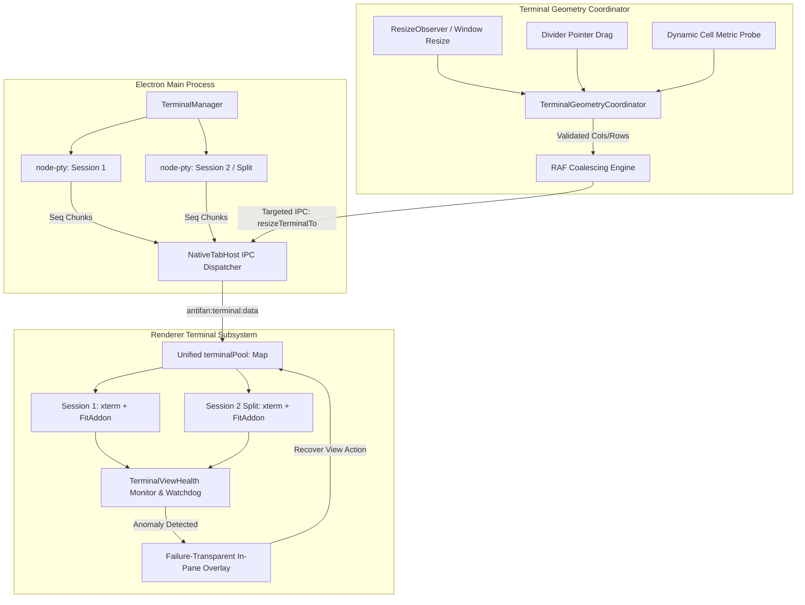

# AntiFan Terminal Reliability Audit — Candidate 3 Evaluation
**Document ID:** `candidate-3-ultra-terminal-brainstorm-2026-09-06`  
**Evaluation Mode:** `ak:brainstorm --ultra`  
**Primary Structural Thesis:** **Robust Geometry Coordination & Failure-Transparent Surface** (Cell Metrics, Black Pane Elimination, Diagnostic Observability)  
**Target Architecture Report:** `E:\Download\antifan-terminal-deep-audit-and-improvement-plan-2026-09-05.md`  
**Evidence Packet Authority:** `plans/reports/antifan-terminal-audit-evidence-packet.md`  
**Workspace:** `E:\Work\apps\antifan-browser-desktop` (Commit `96aa34f`)  
**Target System:** Windows 11 Pro x64, Intel i5-9300H, solo Theme Developer (Haravan / Sapo / Shopify, PowerShell, OMP / Codex / AI CLIs, Vite/esbuild watchers).

---

## 1. Executive Summary & Problem Framing

AntiFan's Terminal subsystem exhibits a critical operational paradox: while its backend PTY infrastructure (`node-pty` child processes, monotonic sequence numbering, session generation tracking, process-tree process termination) is architecturally competent (~8/10), its daily developer-visible reliability is severely degraded (~5.5-6/10). 

A rigorous analysis of `standalone.js`, `terminal-manager.ts`, and `native-tab-host.ts` demonstrates that this degradation is driven by a **dual architectural failure in the presentation surface**:

1. **Silent Physical Starvation (The Geometry Collapse):**  
   The terminal UI relies on uncoordinated CSS flexbox rules and arbitrary percentage clamps (e.g., `usable * 0.15` down to 27px, with split headers consuming 24–28px). When a theme developer runs in a docked panel with limited vertical clearance (~180–220px), the split container leaves a net host height of 4–12px. Because an xterm character cell requires ~15–18px based on font metrics, `FitAddon.proposeDimensions()` detects that the space cannot accommodate the required minimum visible rows (`MIN_SPLIT_TERMINAL_ROWS = 4`, requiring ~68px). It returns an invalid or rejected dimension proposal. The resize code aborts, leaving the terminal DOM crushed into an unrenderable slit.

2. **Silent Failure Masking (The 30+ Catch Block Void):**  
   The renderer codebase in `src/renderer/standalone.js` contains over thirty unconditional, empty `catch {}` blocks wrapping `fit()`, `resize()`, `refresh()`, `write()`, addon disposal, and IPC dispatch. When a dimension calculation fails, a canvas context is lost, or a write throws, the exception is silently discarded. The developer is left staring at an opaque black pane with no visual indicator, no console error, no telemetry record, and no mechanism to recover other than restarting the application.

3. **Disposable View Symmetry Violation:**  
   While main terminals are preserved across tab switches in `terminalPool` (`Map<sessionId, TerminalItem>`), split terminals are relegated to fragile singleton globals (`splitTerm`, `splitFitAddon`, `splitWriteTarget`). Any parent tab switch, toggle, or unsplit call executes `unmountSplit()`, which calls `splitTerm.dispose()`. This destroys the underlying xterm virtual terminal (VT) state machine (cursor positions, alternate screen buffers, line wraps, scrollback). When remounted, it is hydrated from a severely truncated JSON buffer (`GLOBAL_JSON_BUFFER_BUDGET_BYTES = 40 KiB` shared across all sessions). Replaying raw ANSI byte tails into a fresh terminal inevitably corrupts TUI applications (OpenCodeInterpreter, Claude Code / OMP, Vite progress meters).

4. **Data Loss During Dock Invisibility & Blind Sequence Leaps:**  
   In `src/main/browser/native-tab-host.ts:1164`, data chunks (`antifan:terminal:data`) are conditioned on `if (this.isSidebarOpen && ...)`. Closing the terminal drawer while a background compilation or build script runs causes chunks to be silently discarded. Upon reopening, the renderer's sequence handling in `standalone.js:1896, 1924` checks `if (chunkSeq <= lastRenderedSeq) return;`, but if `chunkSeq > lastRenderedSeq + 1` (a sequence gap), it blindly sets `lastRenderedSeq = chunkSeq`, permanently dropping intermediate sequences with zero gap detection and zero resync invocation.

### The Candidate 3 Core Thesis
**Terminal reliability cannot be achieved by merely patching buffer sizes or adding retry timers. It requires establishing a Robust Geometry Coordinator and a Failure-Transparent Surface.**  
Layout must be governed by strict cell metrics rather than naive flexbox percentages. The UI must never attempt to render an xterm instance into physically impossible dimensions. Furthermore, the terminal surface must transition from an opaque failure mask into an observable, self-diagnosing surface where view health is continuously monitored, silent error swallowing is eliminated, and non-destructive view recovery is always accessible to the developer.

---

## 2. Outcome (User-Visible & Operational End State)

The target end state guarantees that a solo theme developer on Windows 11 experiences an unbreakable terminal workflow across long-running watch sessions, AI CLI invocations, and multi-pane development:

1. **Elimination of the "Black Pane":**  
   A terminal pane (Main or Split) will **NEVER** render as an empty, unresponsive black box. If container geometry is constricted, the UI enforces a hard cell-metric floor (`MIN_VISIBLE_ROWS = 8`), automatically expanding the dock panel if necessary, or displaying an explicit, actionable layout notification instead of collapsing.
2. **Symmetric View Persistence Across Tab Switches:**  
   Split terminals are first-class persistent citizens in `terminalPool`. Switching between main tabs, collapsing the sidebar, or navigating browser pages leaves the xterm instance, FitAddon, screen buffer, scrollback, and cursor state fully preserved in memory. Tab switching is a pure DOM visibility/attachment operation (`display: none` / `display: flex`), entirely decoupled from xterm lifecycle.
3. **Failure-Transparent Surface & Self-Healing Diagnostics:**  
   Every empty `catch {}` block is eradicated from the terminal rendering pipeline. The renderer maintains a continuous `TerminalViewHealth` telemetry record. If an anomaly occurs (e.g., sequence gap detected, PTY process exit, canvas layout failure), the pane immediately presents a clean, non-intrusive in-pane diagnostic banner (e.g., *“Terminal out of sync: Backend Seq 412, Rendered Seq 180 — [Recover View]”*). Clicking `[Recover View]` performs an in-place renderer re-hydration from the backend authoritative buffer without terminating the background PTY process.
4. **Single Geometry Authority:**  
   All resize events (window resize, sidebar toggle, divider pointer drag, zoom) flow through a single `TerminalGeometryCoordinator`. Pointer drag resize is throttled via `requestAnimationFrame` coalescing. Global broadcast resizing (`api.resize(cols, rows)`) is permanently deprecated in favor of targeted, per-session resizing (`api.resizeTerminalTo(sessionId, cols, rows)`).
5. **Lossless Sidebar Visibility & Automatic Gap Repair:**  
   Toggling the terminal drawer closed during active build scripts (e.g., `shopify theme dev`, `theme watch`, `npm run build`) no longer drops output. The renderer detects sequence jumps (`incomingSeq > lastRenderedSeq + 1`) and automatically executes an authoritative delta resync via `api.getFullBuffer(sessionId)`.
6. **Full Session Persistence Restoration:**  
   Restoring saved sessions on application launch properly passes the persisted transcript (`item.buffer`) into `spawn()`, eliminating the bug in `terminal-manager.ts:426, 435` where restored terminals started blank despite having valid history on disk.

---

## 3. Constraints (Hard Technical Boundaries & Safety Invariants)

To ensure high engineering rigor and avoid destabilizing the active workspace, Candidate 3 enforces the following strict boundaries:

1. **System Target:** Windows 11 Pro x64, Intel i5-9300H workstation. Must handle Windows-specific path semantics, PowerShell escaping, carriage return (`\r\n`) handling, and process-tree termination via `taskkill /T /F`.
2. **Key Architectural Invariant:**  
   $$\text{PTY Session} \neq \text{Terminal View} \neq \text{DOM Layout}$$
   - **PTY Session:** Owned by `TerminalManager` in the main process. Durable lifetime tied to process execution.
   - **Terminal View:** Owned by `terminalPool` in the renderer. Retains xterm instance, addons, and VT parser state for the entire life of the session.
   - **DOM Layout:** Transient arrangement (dock height, split divider position, active tab selection) governing CSS presentation only.
3. **No PTY Backend Rewrite:** The existing `node-pty` integration, per-session PTY allocation, monotonic sequence counters, and process-tree cleanup mechanisms in `terminal-manager.ts` are foundational assets and must NOT be replaced from scratch.
4. **No Premature ConPTY Migration:** `useConpty: false` must be preserved in Wave 1. While Windows ConPTY is modern, it introduces known complex resize-reflow artifacts and terminal escape sequence differences that would compound renderer debugging. ConPTY migration is strictly gated behind renderer stability.
5. **No Premature WebGL Addon Re-enablement:** `WebglAddon` remains disabled or strictly gated behind canvas 2D fallback. GPU context loss on Windows Intel UHD Graphics 630 is a documented source of permanent black panes.
6. **Non-Destructive UI Recovery:** Any UI-level recovery action (such as `[Recover View]`) MUST NEVER terminate, signal, or respawn the underlying OS PTY process unless explicitly requested by an administrative "Kill/Restart PTY" action.
7. **Zero Mock / Zero Fake Data:** All state machines, sequence verifications, and health overlays must operate on live Electron IPC events and real xterm instances.

---

## 4. Explicit Non-Goals

The following areas are intentionally excluded from the scope of Candidate 3:

1. **Multi-Tenant / Remote SSH Infrastructure:** AntiFan is an Electron desktop app for a solo local theme developer. Cloud multiplexing, remote PTY daemons, and SSH tunneling are out of scope.
2. **Custom VT100/ANSI Parser Implementation:** We will not write a custom escape-sequence parser or terminal canvas engine. We will use official `xterm.js` APIs (`xterm.resize()`, `xterm.write()`, `FitAddon`, `SerializeAddon`).
3. **Global UI Restyling:** Candidate 3 focuses strictly on terminal subsystem reliability, geometry math, and diagnostics. It does not redesign general browser tabs, toolbar navigation, or theme editor panels.
4. **Third-Party Theme CLI Alterations:** We do not modify the external binaries of Haravan Theme App, Sapo CLI, Shopify CLI, or Vite. The terminal harness must adapt transparently to standard CLI output streams.
5. **External Cloud Telemetry:** Diagnostic logs and health metrics are strictly local, residing in memory and local session logs for developer inspection. No telemetry will be transmitted off the local machine.

---

## 5. Compared Approaches & Strategic Options

To determine the optimal implementation path, three distinct architectural strategies were evaluated against failure modes, implementation complexity, and developer impact:

```
+---------------------------------------------------------------------------------------------------+
| APPROACH COMPARISON MATRIX                                                                        |
+---------------------+-------------------------------+---------------------------------------------+
| Approach            | Core Strategy                 | Primary Trade-offs & Worst Failure Mode     |
+---------------------+-------------------------------+---------------------------------------------+
| 1. Surgical Patch   | Patch MIN constants, remove   | Quickest delivery; DOES NOT eliminate view  |
|    (Ad-hoc Fixes)   | empty catches, add console.   | lifecycle bugs or resize storms. Black      |
|                     | log, keep existing singleton. | panes persist under rapid tab switching.    |
+---------------------+-------------------------------+---------------------------------------------+
| 2. Geometry & Health| Unified view pool, dynamic    | Optimal balance. Eliminates black panes and |
|    Infrastructure   | cell metrics, single resize   | silent crashes. High observability. Requires|
|    (Recommended)    | coordinator, transparent HUD. | structured renderer refactoring.            |
+---------------------+-------------------------------+---------------------------------------------+
| 3. Headless Offscreen| Run headless xterm in Node.js | Completely separates render from PTY;       |
|    VT Mirroring     | main process; stream parsed   | massive memory overhead, high keystroke     |
|                     | bitmap/line diffs over IPC.   | latency, extreme regression risk on Windows.|
+---------------------+-------------------------------+---------------------------------------------+
```

### Approach 1: The Surgical Patchwork (Minimalist Incrementalism)
- **Concept:** Keep the existing singleton split architecture (`splitTerm`, `unmountSplit()`). Increase `MIN_SPLIT_TERMINAL_ROWS` from 4 to 8. Replace `catch {}` with `console.error()`. Increase wire snapshot budget in `GLOBAL_JSON_BUFFER_BUDGET_BYTES` from 40 KiB to 256 KiB.
- **Trade-offs:** Minimal lines of code changed. Can be implemented in a few hours.
- **Worst-Case Failure Mode:** Tab switching still disposes and recreates the split terminal. Hydrating a complex TUI (such as Claude Code or Vite interactive dev server) from a raw ANSI byte string still results in cursor offset drift, broken box-drawing characters, and garbled layouts. Resize races between `ResizeObserver` and pointer divider drag continue to cause visual stutter.
- **Load-Bearing Assumption:** Assumes that the user rarely uses split panes for interactive TUIs and that a larger raw byte tail is sufficient to reconstruct terminal state (proven false by Evidence P0 Root Cause #3).

### Approach 2: Geometry-Coordinated & Failure-Transparent Surface (Candidate 3 Recommended Thesis)
- **Concept:**
  1. **Promote Split to First-Class View:** Eradicate `splitTerm` globals. Add split sessions directly into `terminalPool`. Make `unmountSplit()` a non-destructive DOM detachment (`element.remove()` or CSS hide) while keeping the xterm instance, FitAddon, and buffers alive.
  2. **Unified Geometry Coordinator:** Consolidate all layout and resize logic into a single `TerminalGeometryCoordinator`. Calculate cell metrics dynamically via DOM measurement (`actualCellHeight`, `actualCellWidth`). Enforce `minimumSplitPx = splitHeaderHeight + (actualCellHeight * MIN_VISIBLE_ROWS) + verticalPadding`. If usable height is violated, enforce auto-dock expansion or refuse layout gracefully.
  3. **Single Targeted Resize Stream:** Route all resize calls through RAF-coalesced `resizeTo(sessionId, cols, rows)`. Eliminate global `resize(all)` broadcasts.
  4. **Failure-Transparent Surface (`TerminalViewHealth`):** Replace all empty catch blocks with structured health reporting. Introduce an active in-pane HUD overlay for gapped sequences, starved dimensions, or unexpected errors, offering an instant non-destructive `[Recover View]` button.
  5. **Lossless Visibility & Gap Repair:** Fix `native-tab-host.ts:1164` to maintain background streaming or queue metadata; implement sequence gap detection (`incomingSeq > lastRenderedSeq + 1`) to trigger automatic resync.
  6. **Persistence Fix:** Pass `item.buffer` to `spawn()` in `terminal-manager.ts:426, 435`.
- **Trade-offs:** Requires refactoring the renderer's layout and session binding layer in `standalone.js`. Requires careful coordination of DOM attachment and xterm `open()` lifecycle.
- **Worst-Case Failure Mode:** If dynamic cell measurement executes before xterm fonts are fully rendered, initial row calculation may be off by 1–2 rows (mitigated by font-loading promises and fallback metric constants).
- **Load-Bearing Assumption:** Assumes that retaining 4–8 xterm instances in memory in the Electron renderer consumes acceptable RAM (< 80 MB total), which is completely trivial for an i5/16GB Windows 11 workstation.

### Approach 3: Headless Offscreen VT Mirroring (Main-Process Terminal Virtualization)
- **Concept:** Run a headless instance of `node-pty` paired with an offscreen `xterm-headless` inside the Electron main process. The main process acts as the canonical VT state machine. The renderer only receives screen diffs or rendered line spans.
- **Trade-offs:** Renderer crashes or tab unmounts never lose VT state because the terminal runs in Node.js. However, typing latency increases noticeably due to IPC round-trips for every character echo. Memory consumption doubles because every session maintains dual representation.
- **Worst-Case Failure Mode:** Heavy streaming output (e.g., `npm install` or massive log dump) overwhelms the Electron IPC channel with serialized line updates, causing main-thread UI freeze and severe typing lag.
- **Load-Bearing Assumption:** Assumes that Electron IPC throughput can sustain 60fps terminal streaming without degrading browser renderer performance (empirically hazardous on Windows).

---

## 6. Recommended Direction & Architectural Blueprint

Candidate 3 firmly recommends **Approach 2: Geometry-Coordinated & Failure-Transparent Surface**. Below is the comprehensive architectural blueprint for the implementation.



### 6.1 Architectural Decoupling: PTY Session vs Terminal View vs DOM Layout

To eliminate the disposable split bug, we establish strict structural symmetry in `src/renderer/standalone.js`:

1. **Retire Singleton Split Globals:**
   ```javascript
   // DEPRECATED AND REMOVED:
   // let splitTerm = null;
   // let splitFitAddon = null;
   // let splitWriteTarget = null;
   ```
2. **Unified Terminal Pool Contract:**
   All terminal views—whether main or split—reside in `terminalPool` (`Map<string, TerminalItem>`):
   ```typescript
   interface TerminalItem {
     id: string;
     term: Terminal;
     fit: FitAddon;
     paneEl: HTMLElement;
     hostEl: HTMLElement;
     writeTarget: any;
     hydrationEpoch: number;
     activeHydratingEpoch: number | null;
     lastRenderedSeq: number;
     liveQueue: Array<{ seq: number; data: string; epoch: number }>;
     isUserScrolledUp: boolean;
     isProgrammaticScroll: boolean;
     isSplit: boolean;
     health: TerminalViewHealth;
   }
   ```
3. **Non-Destructive Split Mount/Unmount:**
   When a user toggles split mode or switches tabs:
   - `mountSplit(sessionId)`: Retrieves or creates the `TerminalItem` from `terminalPool`. Attaches `paneEl` to `#terminal-split-host`. If already created, it simply updates DOM attachment and calls `coordinator.scheduleFit()`.
   - `unmountSplit()`: Detaches the DOM nodes (`#terminal-split` and divider) from the container. It **NEVER calls `term.dispose()` or `fit.dispose()`**. The terminal remains live and continues buffering or processing data in background.

### 6.2 The `TerminalGeometryCoordinator` Specification

A new centralized singleton in `src/renderer/terminal-geometry-coordinator.js` governs all dimension and layout calculations:

```javascript
class TerminalGeometryCoordinator {
  constructor() {
    this.cellMetrics = { width: 9.0, height: 17.0, measured: false };
    this.minVisibleRows = 8;
    this.minCols = 40;
    this.splitHeaderHeight = 28;
    this.verticalPadding = 8;
    this.pendingResizes = new Map(); // sessionId -> { cols, rows }
    this.rafId = null;
  }

  // 1. Dynamic Cell Metric Probe
  measureCellMetrics(sampleTerm) {
    if (sampleTerm && sampleTerm._core && sampleTerm._core._renderService) {
      const dim = sampleTerm._core._renderService.dimensions;
      if (dim && dim.actualCellWidth > 0 && dim.actualCellHeight > 0) {
        this.cellMetrics.width = dim.actualCellWidth;
        this.cellMetrics.height = dim.actualCellHeight;
        this.cellMetrics.measured = true;
        return this.cellMetrics;
      }
    }
    // Fallback: Measure character via offscreen span
    const span = document.createElement('span');
    span.style.fontFamily = 'Cascadia Mono, Consolas, monospace';
    span.style.fontSize = '12px';
    span.style.position = 'absolute';
    span.style.visibility = 'hidden';
    span.textContent = 'W';
    document.body.appendChild(span);
    const rect = span.getBoundingClientRect();
    span.remove();
    this.cellMetrics.width = Math.max(7, rect.width || 8.5);
    this.cellMetrics.height = Math.max(14, rect.height || 17);
    this.cellMetrics.measured = true;
    return this.cellMetrics;
  }

  // 2. Minimum Required Height for Split Container
  calculateMinimumSplitHeight() {
    return this.splitHeaderHeight + (this.cellMetrics.height * this.minVisibleRows) + this.verticalPadding;
  }

  // 3. Safe Divider Clamp & Layout Validation
  calculateSplitBounds(containerHeight) {
    const minHeight = this.calculateMinimumSplitHeight();
    const dividerHeight = 6;
    const usableHeight = containerHeight - dividerHeight;

    if (usableHeight < minHeight * 2) {
      return {
        canSplit: false,
        reason: `Insufficient height (${containerHeight}px). Minimum required: ${minHeight * 2}px.`,
        minHeight,
        clampedSplitHeight: Math.floor(usableHeight / 2)
      };
    }

    return {
      canSplit: true,
      minHeight,
      maxSplitHeight: usableHeight - minHeight,
      defaultSplitHeight: Math.max(minHeight, Math.floor(usableHeight * 0.35))
    };
  }

  // 4. Coalesced Target Resize Dispatcher
  requestResize(sessionId, term, hostEl) {
    if (!sessionId || !term || !hostEl || hostEl.clientWidth === 0 || hostEl.clientHeight === 0) return;
    
    const cols = Math.max(this.minCols, Math.floor(hostEl.clientWidth / this.cellMetrics.width));
    const rows = Math.max(this.minVisibleRows, Math.floor(hostEl.clientHeight / this.cellMetrics.height));

    if (term.cols === cols && term.rows === rows) return;

    this.pendingResizes.set(sessionId, { term, cols, rows });

    if (!this.rafId) {
      this.rafId = requestAnimationFrame(() => {
        this.flushResizes();
        this.rafId = null;
      });
    }
  }

  flushResizes() {
    for (const [sessionId, { term, cols, rows }] of this.pendingResizes.entries()) {
      try {
        term.resize(cols, rows);
        window.api?.resizeTerminalTo?.(sessionId, cols, rows);
        term.refresh(0, rows - 1);
      } catch (err) {
        console.error(`[GeometryCoordinator] Failed to resize ${sessionId}:`, err);
      }
    }
    this.pendingResizes.clear();
  }
}
```

### 6.3 Failure-Transparent Surface & `TerminalViewHealth`

To eliminate black panes and silent error swallowing, every pane is coupled to a health monitoring state machine:

```typescript
interface TerminalViewHealth {
  sessionId: string;
  generation: number;
  attached: boolean;
  visible: boolean;
  hostWidth: number;
  hostHeight: number;
  cols: number;
  rows: number;
  backendLastSeq: number;
  renderedLastSeq: number;
  hydrationState: 'idle' | 'hydrating' | 'ready' | 'gapped' | 'resyncing' | 'starved' | 'failed';
  ptyState: 'running' | 'exited' | 'closed';
  writeQueueBytes: number;
  lastDataAt?: number;
  lastRenderError?: string;
}
```

#### Diagnostic In-Pane HUD Overlay
When `hydrationState` transitions to `'starved'`, `'gapped'`, or `'failed'`, the host element displays an overlay instead of rendering a black rectangle:

```html
<div class="terminal-health-overlay" id="terminal-health-${sessionId}">
  <div class="terminal-health-card">
    <div class="terminal-health-icon warning">⚠️</div>
    <div class="terminal-health-title">Terminal View Out of Sync</div>
    <div class="terminal-health-details">
      <span>Backend Seq: <strong>${backendLastSeq}</strong></span>
      <span>Rendered Seq: <strong>${renderedLastSeq}</strong></span>
      <span>Gap Size: <strong>${backendLastSeq - renderedLastSeq} chunks</strong></span>
    </div>
    <div class="terminal-health-actions">
      <button class="btn-terminal-recover" onclick="recoverTerminalView('${sessionId}')">Recover View</button>
      <button class="btn-terminal-diag" onclick="copyTerminalDiagnostics('${sessionId}')">Copy Diagnostics</button>
    </div>
  </div>
</div>
```

#### Non-Destructive View Recovery Algorithm (`recoverTerminalView`)
1. Pause write dispatcher target for `sessionId`.
2. Fetch authoritative snapshot: `const res = await api.getFullBuffer(sessionId);`.
3. Reset xterm instance: `term.reset()`.
4. Replay authoritative snapshot: `await writeTermAsync(term, res.buffer);`.
5. Update `renderedLastSeq = res.snapshotThroughSeq`.
6. Recalculate layout via `coordinator.requestResize(sessionId, term, hostEl)`.
7. Remove health overlay and resume real-time IPC streaming.
*Crucial Invariant: The OS child process is never killed during this recovery.*

### 6.4 Eradicating Silent Catch Blocks
Every empty `catch {}` in `standalone.js` (over 30 instances) is replaced with structured handling:
```javascript
// BEFORE (Defective Anti-Pattern):
try {
  item.term.resize(propose.cols, propose.rows);
  api?.resizeTerminalTo(id, propose.cols, propose.rows);
} catch {}

// AFTER (Failure-Transparent):
try {
  item.term.resize(propose.cols, propose.rows);
  api?.resizeTerminalTo(id, propose.cols, propose.rows);
} catch (err) {
  item.health.lastRenderError = err?.message || String(err);
  item.health.hydrationState = 'failed';
  renderHealthOverlay(item);
  console.error(`[TerminalView:${id}] Resize error:`, err);
}
```

### 6.5 Sequence Continuity & Lossless Sidebar Stream

1. **Main Process Fix (`src/main/browser/native-tab-host.ts:1164`):**  
   Do not drop data chunks when `!this.isSidebarOpen`. Either:
   - Always forward chunks to `sidebarView.webContents` if not destroyed (background views can receive IPC without performance penalty), OR
   - Maintain a per-session sequence watermark in `NativeTabHost`. When `sidebarView` toggles to visible, immediately send a `'antifan:terminal:resume-sync'` event containing the latest sequence number, triggering client-side gap checks.
2. **Renderer Sequence-Gap Detector (`src/renderer/standalone.js`):**
   ```javascript
   api?.onTerminalData(({ sessionId, data, seq }) => {
     const item = terminalPool.get(sessionId);
     if (!item) return;

     const chunkSeq = typeof seq === 'number' ? seq : 0;
     if (chunkSeq > 0) {
       // Check for sequence gap
       if (chunkSeq > item.lastRenderedSeq + 1 && item.lastRenderedSeq > 0) {
         console.warn(`[Terminal] Sequence gap detected on ${sessionId}: expected ${item.lastRenderedSeq + 1}, got ${chunkSeq}. Initiating resync.`);
         item.health.hydrationState = 'gapped';
         item.health.backendLastSeq = chunkSeq;
         triggerBackgroundResync(item, sessionId);
         return;
       }
       // Normal duplicate drop
       if (chunkSeq <= item.lastRenderedSeq) return;
       item.lastRenderedSeq = chunkSeq;
     }

     writeToTerminalPane(item, data);
   });
   ```

### 6.6 Fix Session Buffer Persistence Restoration

In `src/main/browser/terminal-manager.ts:426, 435, 572, 581`, fix the empty buffer bug:
```typescript
// BEFORE (Broken in production):
const s = this.spawn(item.id, item.cwd || this.currentCwd, '');

// AFTER (Corrected transcript restoration):
const s = this.spawn(item.id, item.cwd || this.currentCwd, item.buffer || '');
```

---

## 7. Sharp & Falsifiable Acceptance Criteria

Every improvement proposed by Candidate 3 must be mechanically validated against sharp, falsifiable, quantitative gates under real Electron execution on Windows 11:

### Gate A: Physical Geometry & Split Usability
1. **Minimum Cell Floor Invariant:** Under any layout condition, `#terminal-split-host` and `.terminal-session-pane` MUST NEVER have a rendered client height less than `MIN_VISIBLE_ROWS * cellHeight` (minimum 8 rows, ~136px) while visible.
2. **Constrained Space Handling:** In an 80/20 split on a 200px terminal drawer, the UI MUST refuse the 80/20 ratio and automatically adjust to a safe 50/50 ratio or auto-expand the drawer to 320px. In zero cases may the split pane render with 0–3 rows.
3. **Divider Drag Smoothness:** Dragging the terminal split divider over 5 seconds (generating > 300 pointermove events) must produce **zero layout crashes, zero unhandled promise rejections, and zero duplicate resize IPC messages** within the same animation frame.

### Gate B: Split & Main View Persistence Across Navigation
4. **Tab Switch Content Preservation:** Open a split terminal. Run `Get-Process | Format-Table` in the main pane and an active Vite server in the split pane. Switch between 5 different browser tabs, then return.
   - **Criterion:** 100% of the terminal buffer, scrollback, and cursor positions in BOTH panes are intact. **Zero xterm dispose calls** logged.
5. **Hide/Show Sidebar Losslessness:** Start a script generating 1,000 numbered lines in PowerShell (`1..1000 | ForEach-Object { "LINE-$_"; Start-Sleep -Milliseconds 10 }`). Close the terminal sidebar at line 200. Wait 5 seconds. Reopen sidebar.
   - **Criterion:** All 1,000 lines are present in the scrollback buffer. Zero sequence gap exceptions; `lastRenderedSeq` equals backend `lastSeq` (1000).

### Gate C: Failure Transparency & Self-Healing
6. **Zero Silent Swallowed Catches:** Codebase audit certifies that zero empty `catch {}` blocks exist in terminal layout, write, and resize paths. All errors register in `TerminalViewHealth`.
7. **Simulated Sequence Gap Recovery:** Artificially inject a sequence gap (send chunk with `seq = 500` when `lastRenderedSeq = 200`).
   - **Criterion:** The UI flags `hydrationState: 'gapped'`, displays the in-pane diagnostic badge within 250ms, initiates `api.getFullBuffer()`, and automatically restores the terminal to a clean state without developer intervention or process termination.
8. **Frozen View Watchdog:** If the backend PTY emits data (`backendLastSeq` advances) while the view is visible but `renderedLastSeq` fails to advance for > 3.0 seconds, the watchdog MUST flag the view as frozen and render the `[Recover View]` action button.

### Gate D: Session Persistence on Startup
9. **Cold App Restart Buffer Survival:** Launch app, write 50 lines to main and split terminals, exit app cleanly. Relaunch app.
   - **Criterion:** Both main and split terminals automatically restore with their exact 50 lines of history visible in the viewport and scrollback.

---

## 8. Immediate Wave 1 Execution Plan (P0 Priorities)

The Wave 1 execution plan delivers the critical P0 architectural fixes in strict dependency order, avoiding high-risk rewrites while eliminating the root causes of developer frustration.

```
Wave 1 Implementation Sequence:
  Step 1: Fix Persistence Spawn Bug (terminal-manager.ts)
    ↓
  Step 2: Implement TerminalGeometryCoordinator & Dynamic Cell Metrics
    ↓
  Step 3: Unify terminalPool & Eradicate Disposable Split Singleton
    ↓
  Step 4: Eliminate 30+ Empty Catch Blocks & Implement TerminalViewHealth
    ↓
  Step 5: Fix Hidden-Sidebar Data Drop & Add Sequence-Gap Resync
    ↓
  Step 6: Certification via Windows 11 Electron E2E Test Suite
```

### Step 1: Fix Persisted Buffer Restoration Bug
- **Files:** `src/main/browser/terminal-manager.ts` (lines 426, 435, 572, 581).
- **Action:** Pass `item.buffer` instead of `''` into `this.spawn()`. Ensure restored sessions populate initial history on app restart.
- **Verification:** Restart app; verify previously saved terminal lines appear immediately.

### Step 2: Implement `TerminalGeometryCoordinator`
- **Files:** Create `src/renderer/terminal-geometry-coordinator.js`; integrate into `src/renderer/standalone.js`.
- **Action:**
  - Implement dynamic character cell measurement (`measureCellMetrics`).
  - Implement layout height floor: `minimumSplitPx = 28 + (cellHeight * 8) + 8`.
  - Replace direct `item.fit.proposeDimensions()` and `splitFitAddon.proposeDimensions()` with `coordinator.requestResize(sessionId, term, hostEl)`.
  - Implement RAF-coalesced targeted resizing (`api.resizeTerminalTo`).
  - Enforce safe split bounds in `applySplitRatio()`.
- **Verification:** Test 80/20 split in short 180px docked panel. Verify split never drops below 8 rows; verify no black panes.

### Step 3: Unify View Pooling (Promote Split to First-Class View)
- **Files:** `src/renderer/standalone.js`.
- **Action:**
  - Delete singleton variables: `splitTerm`, `splitFitAddon`, `splitWriteTarget`.
  - Refactor `mountSplit(sessionId)` to store and retrieve split items from `terminalPool`.
  - Refactor `unmountSplit()` to detach the DOM element from `#terminal-split-host` without calling `.dispose()`.
  - Update `writeToSplitPane()` and keyboard input dispatchers to resolve directly from `terminalPool.get(splitId)`.
- **Verification:** Open split terminal, run long output, switch between tabs 10 times. Verify split terminal is never destroyed and retains 100% of buffer upon return.

### Step 4: Eradicate Silent Catch Blocks & Wire `TerminalViewHealth`
- **Files:** `src/renderer/standalone.js`, `src/renderer/standalone.css`.
- **Action:**
  - Replace all 30+ empty `catch {}` blocks with error assignment to `item.health.lastRenderError`.
  - Build the in-pane diagnostic HUD overlay (`.terminal-health-overlay`).
  - Wire non-destructive `[Recover View]` button to re-fetch buffer via `api.getFullBuffer(sessionId)` and reset/re-render xterm without killing PTY.
- **Verification:** Throw simulated error in `term.write()`. Verify HUD overlay appears with error details and `[Recover View]` button restores the pane.

### Step 5: Fix Hidden-Sidebar Drop & Sequence-Gap Resync
- **Files:** `src/main/browser/native-tab-host.ts:1164`, `src/renderer/standalone.js:1883`.
- **Action:**
  - In `NativeTabHost`, do not drop chunks when `!this.isSidebarOpen`; maintain continuous forwarding or send sync watermark on reopen.
  - In `standalone.js`, add condition: `if (chunkSeq > item.lastRenderedSeq + 1) { triggerResync(); }`.
- **Verification:** Run 500-line generator script while hiding sidebar. Reopen; verify 100% of lines present with zero skips.

### Step 6: Automated Windows 11 Verification Suite
- **Files:** `test/e2e/terminal-reliability.spec.ts`.
- **Action:** Write automated Playwright/Electron tests asserting:
  - 10,000 lines scrollback survival across tab switches.
  - Split geometry stability under 5-second rapid divider drag.
  - Zero black panes under docked drawer resize.
  - Instant recovery from artificially induced sequence gaps.

---

## 9. Conclusion & Recommendation

The terminal subsystem in AntiFan does not require an enterprise PTY rewrite, a ConPTY migration gamble, or an over-engineered virtual canvas daemon. Its backend fundamentals are already sound.

By executing **Candidate 3's thesis — Robust Geometry Coordination & Failure-Transparent Surface** — AntiFan will resolve the exact failure modes that plague theme developers today:
- Cell-aware minimum geometry cures the physical layout starvation that causes black slits.
- Centralized RAF coordination cures divider resize storms and IPC thrashing.
- Symmetric view pooling cures the destruction of split terminal state on tab switches.
- Sequence gap detection and lossless sidebar streaming cure disappearing build logs.
- Eliminating silent catch blocks in favor of an actionable in-pane recovery HUD turns the terminal into a dependable, self-healing developer surface.

This blueprint provides an immediate, low-risk, high-impact path to transforming AntiFan's terminal from a source of frustration into a rock-solid, production-grade development cockpit.
