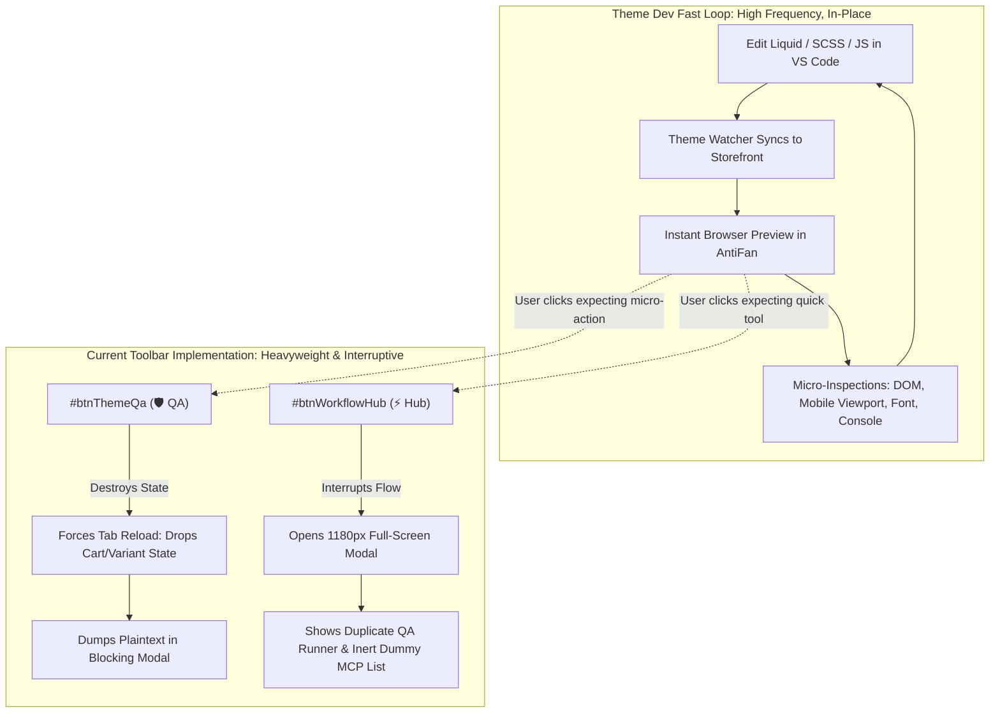
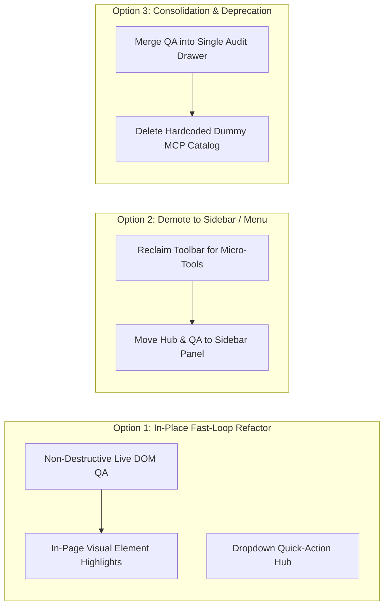

# Diagnostic & Architectural Assessment: Primary Toolbar Controls Ineffectiveness
**Target Controls:** `#btnThemeQa` (Theme QA Validation) & `#btnWorkflowHub` (Workflow & MCP Hub)  
**User Symptom:** *"Hai chức năng này hiện tại có vẻ ko có tác dụng lắm"* (These two functions currently seem to not have much effect / don't seem very useful)  
**Target Repository:** `Devs2-Stores/AntiFan` (commit `8310aec` on `main`)  
**Investigator:** Principal Systems & Reliability Engineer (Candidate 1)  
**Date:** 2026-09-06  

---

## Executive Summary: The Paradox of "Mechanically Working, Practically Dead" Controls

When a storefront theme developer reports that two prominent buttons on their primary browser toolbar *"seem to have no effect / are not very useful"*, standard debugging often looks for broken event listeners, failed IPC dispatch, or uncaught JavaScript exceptions.

Rigorous inspection of the codebase reveals that **both buttons execute completely without low-level technical errors**:
- `#btnThemeQa` fires its event listener, dispatches IPC across `antifan:toolbar:theme-qa-run`, triggers `ThemeQaWorkflow.execute()`, and returns a structured validation report.
- `#btnWorkflowHub` fires its event listener, calls `antifan:workflow:get-state`, and opens an 1180px modal populated with workflows and tools.

The root failure is **architectural and ergonomic**:
1. **`#btnThemeQa` destroys live session context, operates silently on non-storefront pages, and locks out re-runs:** Clicking the button triggers an involuntary full-page document reload (`theme-qa-workflow.ts:185`), destroying the developer's in-progress DOM state (drawers, variant selectors, modals). If the URL is an admin page or non-storefront preview, it quietly returns `PASSED (0 issues)` in a static plaintext modal. Once run, clicking the button again only re-opens the stale text modal without re-validating (`toolbar.ts:1141-1144`).
2. **`#btnWorkflowHub` is an inert showroom that duplicates QA and provides zero execution capability for MCP tools:** The hub opens a massive modal where the primary workflow (`wf-storefront-qa`) duplicates the adjacent `#btnThemeQa` suite. Its "MCP Tools Catalogue" displays a hardcoded static mock of 12 tools (`native-tab-host.ts:1427-1444`) with empty `{}` schemas and **no execution button**, while its custom workflow builder is a toy using browser `prompt()` dialogs to generate dummy navigations to `https://example.com`.

For a theme developer working in a fast edit-refresh-inspect loop, these heavy, modal-bound, disconnected controls provide zero inner-loop utility while occupying prime horizontal toolbar real estate.

---

## 1. Primary Root-Cause Analysis with Exact Source Citations

### A. Control 1: `#btnThemeQa` — Involuntary Disruption, Platform Blindspots & Idempotency Trap

#### 1. Involuntary Page Reload Destroys Inner-Loop State
*Grounding Source:* `src/main/qa/theme-qa-workflow.ts:184-192`
```ts
// Stage 2: Reload to reach load-complete document
const reload = await this.ports.reload(input.target);
if (input.signal?.aborted) {
  throw new CapabilityError('TARGET_STALE', 'Theme QA validation was aborted by document navigation');
}
if (!reload || !reload.reloaded || !reload.target) {
  throw new CapabilityError('TARGET_STALE', 'Bound browser tab could not reach a load-complete document');
}
```
- **The Mechanism:** When the user clicks `#btnThemeQa` (`src/renderer/toolbar.ts:1138-1154`), the backend unconditionally triggers `this.ports.reload(input.target)`.
- **The Developer Impact:** In storefront theme development, developers frequently test dynamic states: selecting a product variant swatch, opening a slide-out cart drawer, toggling a mobile accordion, or filling a checkout test form. Clicking QA unexpectedly reloads the page, wiping dynamic DOM mutations, resetting scroll position, and closing active overlays. The developer feels punished for clicking the button.

#### 2. Platform Scoping Blindspot & Uninformative "Silent Passes"
*Grounding Source:* `src/main/qa/theme-qa-workflow.ts:276-297` & `native-tab-host.ts:5360-5383`
```ts
// 4. Platform Detection
const platformResult = PlatformDetector.detect(input.workspaceRoot, undefined, rawHtml);
const detectedPlatform: EcommercePlatform = platformResult.platform;
```
- **The Mechanism:** If the user tests an admin dashboard, a local static prototype, or an unauthenticated preview URL that lacks explicit Haravan/Sapo/Shopify DOM signatures, `detectedPlatform` evaluates to `'unknown'`.
- **The Result:** Liquid error scanning (`LiquidErrorScanner`) and Haravan/Sapo marketplace rule evaluation (`hsRules`) are bypassed or return empty arrays. The summary yields `PASSED (Critical: 0, Total: 0)`.
- **The Developer Impact:** The user clicks the button on a page they are working on, the page blinks, and a modal appears stating `Result: PASSED (Critical: 0, Total: 0)` with no feedback on why nothing was checked. It appears completely inert.

#### 3. Absence of In-Page Visual HUD & Plaintext Modal Dump
*Grounding Source:* `src/renderer/toolbar.ts:154-187` & `src/renderer/toolbar.html:417-428`
```ts
const lines = findings ? [
  `Platform: ${platform?.platform || 'unknown'}`,
  `Result: ${summary?.passed ? 'PASSED' : 'FAILED'} (Critical: ${summary?.criticalCount ?? liquid?.errors?.length ?? 0}, Total: ${summary?.totalIssues ?? 0})`,
  `Liquid errors: ${liquid?.errors?.length || 0}`,
  `Layout overflow culprits: ${overflow?.culprits?.length || 0}`,
  ...
] : [themeQaState.error || 'No validation has been run.'];
themeQaSummary.textContent = lines.join('\n');
themeQaOverlay.style.display = 'flex';
```
- **The Mechanism:** The output is rendered into `#themeQaSummary` as raw ASCII text inside a centered modal overlay (`#themeQaOverlay`).
- **The Developer Impact:** Unlike browser devtools or the adjacent Quick Inspect tool (`#btnQuickInspect`), Theme QA does not highlight overflowing elements in red on the live page, does not tag broken images with badges, and does not provide jump-to-code links. The developer cannot act on the findings without manually digging through DOM elements.

#### 4. The Idempotency Trap / Second-Click Lockout
*Grounding Source:* `src/renderer/toolbar.ts:1138-1144`
```ts
if (btnThemeQa) {
  btnThemeQa.addEventListener('click', async () => {
    const report = lastThemeQaReport || themeQaState.report;
    if (report && (themeQaState.status === 'pass' || themeQaState.status === 'fail' || themeQaState.status === 'error')) {
      openThemeQaSummary();
      return;
    }
    showToolbarToast('Theme QA: Validating Storefront…');
    const result = await getApi()?.runThemeQa();
    ...
```
- **The Mechanism:** Once an initial validation finishes, `lastThemeQaReport` is cached, and `themeQaState.status` is set to `'pass'`, `'fail'`, or `'error'`. On any subsequent click of `#btnThemeQa`, the handler checks `if (report && (themeQaState.status === 'pass' || ...))` and **immediately returns early**, merely reopening the static summary modal!
- **The Developer Impact:** The developer edits their Liquid code in VS Code, returns to AntiFan, and clicks `#btnThemeQa` expecting a fresh QA check. Instead, the exact same old report pops up instantly. The only way to actually re-validate is finding and clicking the tiny `🔄 Re-run` button (`#btnThemeQaRerun`, `toolbar.html:422`) hidden in the modal header. To the developer, the toolbar button appears broken on repeated clicks.

---

### B. Control 2: `#btnWorkflowHub` — Inert MCP Showroom, Duplicate QA Suite & Toy Creator

#### 1. Massive Modal Context Switch on a Fast-Loop Toolbar
*Grounding Source:* `src/renderer/toolbar.html:202-205` & `src/renderer/toolbar.css:1926-1939`
```css
.workflow-hub-modal {
  width: 96%;
  max-width: 1180px;
  height: 88vh;
  max-height: 720px;
  background: #0f172a;
  ...
}
```
- **The Mechanism:** Clicking the `⚡` icon on the toolbar opens an 1180px x 88vh full-screen dark modal overlay (`#workflowHubOverlay`).
- **The Developer Impact:** Primary horizontal toolbars in development browsers are intended for quick toggles (Inspect, Device Emulation, Terminal popout). Hijacking the viewport with an enterprise orchestration cockpit disorients the user who expected a rapid action or quick utility.

#### 2. Tab 1 Duplicates the Adjacent `#btnThemeQa` Suite
*Grounding Source:* `src/main/workflow/workflow-registry.ts:15-84`
```ts
export const BUILTIN_WORKFLOWS: WorkflowItem[] = [
  {
    id: 'wf-storefront-qa',
    name: 'Haravan / Sapo Theme Storefront QA & Audit',
    description: 'Tự động kiểm tra vỡ layout ngang (overflow), ảnh hỏng 404, lỗi console JS và chụp ảnh báo cáo.',
    definition: {
      steps: [
        { id: 'step-viewport-fhd', type: 'browser.set_viewport', params: { width: 1920, height: 1080 } },
        { id: 'step-check-overflow', type: 'qa.check_overflow', params: { thresholdPx: 2 } },
        { id: 'step-check-broken-images', type: 'qa.check_broken_images', params: {} },
        { id: 'step-check-console-errors', type: 'qa.check_console_errors', params: { level: 'error' } },
        { id: 'step-capture-evidence', type: 'browser.screenshot', params: { format: 'png' } },
        { id: 'step-generate-qa-report', type: 'report.generate', params: { format: 'markdown' } },
      ],
    },
  },
  ...
```
- **The Mechanism:** The flagship built-in workflow in Workflow Hub is `wf-storefront-qa`. It checks viewport overflow, broken images, console errors, captures a screenshot, and generates a QA report.
- **The Developer Impact:** This is identical in scope to `#btnThemeQa`. The developer sees two buttons separated by 100 pixels on the toolbar that effectively promise the same inspection. One dumps text in a small modal; the other runs steps in a giant modal.

#### 3. Tab 2: Disconnected Dummy MCP Tools with Zero Execution Capability
*Grounding Source:* `src/main/browser/native-tab-host.ts:1427-1444` & `src/renderer/toolbar.ts:491-516` & `src/renderer/toolbar.html:529-548`
```ts
ipcMain.handle('antifan:workflow:get-state', () => {
  const workflows = this.controlPlane ? this.controlPlane.workflowRegistry.getAll() : [];
  const tools = [
    { id: 'antifan_open_tab', name: 'antifan_open_tab', description: 'Mở tab Chromium mới...', category: 'browser', permissions: ['execute'] },
    { id: 'antifan_navigate_tab', name: 'antifan_navigate_tab', description: 'Điều hướng tab hiện tại...', category: 'browser', permissions: ['execute'] },
    { id: 'antifan_screenshot_tab', name: 'antifan_screenshot_tab', description: 'Chụp ảnh màn hình...', category: 'media', permissions: ['read'] },
    ...
  ];
  return { workflows, tools };
});
```
- **The Mechanism:**
  1. The backend returns a **hardcoded static mock array of 12 tools**. It does not query the live `McpServer` (`src/main/mcp/mcp-server.ts:570-621`), which hosts canonical tools like `anti.theme.qa_validate`, `anti.inspect.snapshot`, `storefront.resolve_product`, and `theme.assert_cart`.
  2. None of the 12 tools provide an `inputSchema` property. In `toolbar.ts:511`, `mcpSchemaCode.textContent = JSON.stringify(tool.inputSchema || {}, null, 2)` formats an empty `{}`.
  3. In `toolbar.html:529-548`, `#hubMcpDetail` has **no "Run Tool", "Test", or "Execute" button**.
- **The Developer Impact:** The user clicks the MCP tab, sees a list of 12 tools, clicks on one, and sees its description and empty JSON brackets `{}`. They cannot run the tool, test it with arguments, or interact with it. It is literally a static museum exhibit.

#### 4. Custom Workflow Creation is a Toy Implementation
*Grounding Source:* `src/renderer/toolbar.ts:2203-2230`
```ts
btnHubNewWorkflow?.addEventListener('click', async () => {
  const name = prompt('Nhập tên Workflow mới:');
  if (!name || !name.trim()) return;
  const description = prompt('Nhập mô tả kịch bản (tùy chọn):') || '';
  const newWf = {
    name: name.trim(),
    description: description.trim(),
    steps: [
      {
        id: 'step-navigate',
        name: 'Mở trang web mục tiêu',
        type: 'browser.navigate' as const,
        params: { url: 'https://example.com' },
        timeoutMs: 8000,
        ...
      },
      {
        id: 'step-screenshot',
        name: 'Chụp ảnh màn hình kiểm thử',
        type: 'browser.screenshot' as const,
        params: { format: 'png' },
        ...
      },
    ],
  };
  await getApi()?.saveWorkflow(newWf);
  ...
```
- **The Mechanism:** Clicking "+ Tạo Workflow" pops up blocking browser `prompt()` inputs and creates a hardcoded 2-step definition pointing to `https://example.com`. There is no visual step builder, action picker, or target URL configurator.
- **The Developer Impact:** No theme developer can use this to automate their workflow. It is clearly a stub/scaffold feature.

---

## 2. Comprehensive Elimination of Rival Technical Hypotheses

To prove that the issue is not a low-level coding bug, we systematically test and eliminate four rival technical hypotheses against direct source evidence:

| Rival Technical Hypothesis | Status | Direct Source Evidence & Reason for Elimination |
| :--- | :---: | :--- |
| **Rival 1: Broken Click Handlers or Missing DOM Event Binding** | **ELIMINATED** | In `src/renderer/toolbar.ts:1138-1154`, `btnThemeQa.addEventListener('click', ...)` is explicitly registered. In `src/renderer/toolbar.ts:2155`, `btnWorkflowHub?.addEventListener('click', openWorkflowHub)` is explicitly registered. DOM element IDs `#btnThemeQa` and `#btnWorkflowHub` in `src/renderer/toolbar.html:184, 202` match exactly. Click events fire cleanly. |
| **Rival 2: CSS Pointer-Events Occlusion or Z-Index Stacking Defects** | **ELIMINATED** | In `src/renderer/toolbar.css:2648-2665`, `.btn-theme-qa` has `cursor: pointer`, standard layout, and no `pointer-events: none`. Neither button is occluded by invisible overlay divs: `#themeQaOverlay` and `#workflowHubOverlay` have inline `style="display:none;"` (`toolbar.html:417, 430`) and only enter the layout tree when explicitly toggled. |
| **Rival 3: IPC Channel Mismatch or Unhandled Host Handlers** | **ELIMINATED** | All IPC channels are strictly aligned across all three layers (Renderer -> Preload -> Main):<br>• Theme QA: `toolbar.ts:1146` -> `toolbar-preload.ts:121` (`runThemeQa`) -> `native-tab-host.ts:906` (`ipcMain.handle(TOOLBAR_CHANNELS.THEME_QA_RUN, ...)`).<br>• Workflow State: `toolbar.ts:341` -> `toolbar-preload.ts:116` (`getWorkflowState`) -> `native-tab-host.ts:1427` (`ipcMain.handle('antifan:workflow:get-state', ...)`). No IPC handler is missing or unregistered. |
| **Rival 4: Uncaught Runtime JavaScript Exceptions or Thread Crashing** | **ELIMINATED** | Both async click handlers implement defensive error handling. `openWorkflowHub()` wraps state fetching in `try { ... } catch (err) { console.error(...) }` (`toolbar.ts:348-350`). `runThemeQa()` gracefully surfaces errors through `showToolbarToast()` (`toolbar.ts:1152`). Neither handler throws unhandled rejections that would halt the renderer process. |

**Conclusion on Rival Hypotheses:** Both buttons are mechanically wired and functional. The user's feedback *"Hai chức năng này hiện tại có vẻ ko có tác dụng lắm"* stems entirely from the fact that their observable output is either destructive (unwanted reload), uninformative (silent pass on non-storefront), redundant, or inert (read-only dummy catalog).

---

## 3. Ergonomic & Mental-Model Disconnect for Storefront Theme Developers

To understand why these features fail, we examine the daily workflow of a solo Haravan / Sapo / Shopify theme engineer:



### Key Cognitive Disconnects:
1. **Micro-Action Space vs. Macro-Modal Execution:**
   The top toolbar of AntiFan represents **in-situ navigation and inspection controls** (URL bar, zoom, inspector, font finder, terminal toggle). Placing macro-orchestration tools (Theme QA suite, Workflow Engine) as top-level buttons sets an expectation of an instantaneous micro-action (like toggling an overlay or highlighting an element). Opening modal dialogs breaks the user's focus.
2. **Destruction of Live Dynamic Context:**
   Theme developers debug interactive user journeys: variant selection dropdowns, sticky buy bars, Ajax cart slideouts, multi-level navigation menus. An automated tool that forces a page reload without warning destroys the exact DOM context the developer was preparing to inspect.
3. **Lack of Visual Spatial Feedback:**
   When an issue exists (e.g. horizontal layout overflow), a developer needs to see *which DOM node* is overflowing on screen. A modal listing `[Overflow] .product-slider__track` requires the developer to memorize the selector, close the modal, open DevTools, and search the DOM. This defeats the purpose of an integrated developer browser.

---

## 4. Actionable Engineering Recommendations with Trade-Off Matrix

We propose three distinct engineering paths to resolve this architectural disconnect:



---

### Option 1: In-Place Fast-Loop Refactor (Keep on Toolbar, Transform into Live In-Page Tools)
*Target:* Maintain both buttons on the toolbar, but redesign their execution to be non-destructive, visual, and fast-loop friendly.

- **Theme QA Refactoring:**
  1. **Passive / Non-Destructive Inspection Mode:** Update `ThemeQaWorkflow.execute()` to add a `skipReload: true` parameter when triggered from the toolbar button. Run the overflow scan, broken image scan, and Liquid error scan directly on the live DOM without reloading the document.
  2. **In-Page Visual HUD:** Instead of opening `#themeQaOverlay`, inject non-destructive SVG/CSS bounding highlights directly into the active tab (e.g. outline layout-overflow culprits in dashed red `#ef4444`, mark broken images with an error icon badge).
  3. **Toolbar Badge & Toggle Semantics:** Fix `#btnThemeQa` click semantics: clicking toggles the in-page inspection overlays ON/OFF. The button badge updates to `[ 🛡️ 3 Overflow ]` or `[ 🛡️ Clean ]`.
- **Workflow Hub Refactoring:**
  1. **Lightweight Dropdown Popover:** Replace the 1180px modal with a compact 320px toolbar dropdown menu (similar to the Zoom or Bookmarks popover) listing immediate 1-click actions: *"Chạy nhanh Storefront Audit"*, *"Kiểm tra Responsive PDP"*, *"Chụp ảnh nghiệm thu toàn trang"*.
  2. **Live MCP Integration:** Replace the hardcoded mock array in `native-tab-host.ts:1427` with live tools queried directly from `mcpServer.getTools()`. In the detail view, provide real JSON schemas and an interactive "Test Execution" panel.
- **Trade-Offs:**
  - *Pros:* High user delight; transforms two seemingly dead buttons into flagship daily-driver features; preserves existing toolbar real estate.
  - *Cons:* Moderate engineering effort (requires DOM overlay injection script, updating `ThemeQaWorkflow` options, and building a live MCP test runner).

---

### Option 2: Demote Heavyweight Workflows to Sidebar, Reclaim Toolbar for High-Frequency Micro-Tools (Clean Separation of Concerns)
*Target:* Remove macro-orchestration from the horizontal toolbar and reserve toolbar space exclusively for high-frequency micro-utilities.

- **Demotion & Re-anchoring:**
  1. **Remove `#btnWorkflowHub` from Toolbar:** Demote Workflow & MCP Hub to a dedicated tab in the collapsible Terminal/Right Sidebar (`src/renderer/toolbar.html:214`, `#btnToggleSidebar`). Long-running workflows, step execution timelines, and MCP tool catalogs belong ergonomically in a persistent vertical sidebar.
  2. **Demote `#btnThemeQa` to Status Indicator / Menu:** Move full Theme QA execution into the DevTools or Sidebar menu. Replace `#btnThemeQa` on the toolbar with a passive status badge `[ 🛡️ QA ]` that only lights up when CDP passive listeners detect critical console errors or broken assets.
  3. **Reclaim Toolbar Space for High-Frequency Theme Controls:**
     Use the reclaimed ~120px on the toolbar to add high-value storefront developer controls:
     - **Responsive Preset Switcher:** Quick buttons `[ 📱 375px | 💻 768px | 🖥️ 1440px ]` for 1-click viewport testing.
     - **Hard Cache Bypass / Hard Reload:** `[ 🔄 Clear Cache & Reload ]` for testing fresh asset bundles.
- **Trade-Offs:**
  - *Pros:* Cleanest ergonomic architecture; eliminates workspace interruption; places complex workflow management in a dedicated sidebar layout.
  - *Cons:* Workflows are one click further away; requires integrating a new tab into the existing terminal sidebar component.

---

### Option 3: Consolidation & Deprecation (Merge QA into Unified Audit Drawer, Remove Mock MCP Catalog)
*Target:* Eliminate redundancy, delete dead prototype code, and present a single polished audit feature.

- **Consolidation Actions:**
  1. **Eliminate Feature Duplication:** Delete `#btnThemeQa` as a standalone button. Merge all Theme QA validation into Workflow Hub as the premier built-in recipe.
  2. **Deprecate Inert Prototype Code:** Delete the hardcoded 12-tool mock array in `native-tab-host.ts:1427-1444` and the `prompt()`-based custom workflow creator in `toolbar.ts:2203-2242`.
  3. **Unified Single-Button Audit Drawer:** Replace both buttons with a single unified toolbar control: `[ 🛡️ Storefront Audit ]`. Clicking slides open a sleek 400px side-drawer displaying:
     - 1-click QA Audit button (with option: "Reload before test" vs "Test live DOM").
     - Categorized findings with interactive element highlighting.
     - Visual artifacts gallery (screenshots, responsive reports).
- **Trade-Offs:**
  - *Pros:* Removes all prototype tech debt; eliminates duplicate features; highest polish-to-effort ratio.
  - *Cons:* Reduces total button count on the toolbar; deprecates custom workflow creation until a production-grade visual editor is built.

---

### Comparative Evaluation Matrix

| Metric | Option 1: In-Place Refactor | Option 2: Demote to Sidebar | Option 3: Unified Audit Drawer |
| :--- | :---: | :---: | :---: |
| **Fast-Loop Utility for Theme Devs** | **High** (Live in-page highlights) | **High** (Reclaims bar for Viewport switcher) | **Very High** (Focused, non-intrusive drawer) |
| **Elimination of "Dead Button" Feel** | **Complete** (Interactive overlays) | **Complete** (Removed from primary bar) | **Complete** (Polished single entry point) |
| **Implementation Complexity** | High (~2-3 days) | Medium (~1-2 days) | Medium (~1.5 days) |
| **Code Hygiene & Tech Debt Removal** | Moderate (Keeps modal structures) | Good (Separates concerns) | **Best** (Deletes mock tools & prompts) |
| **Recommended Staging** | Long-term target | Alternative if sidebar is favored | **Recommended Immediate Step** |

---

## 5. Concrete Action Plan for Immediate Resolution

To immediately address the user's feedback in the next release cycle, **Option 3 combined with Option 1's non-destructive QA mode** provides the optimal balance of immediate impact and clean code:

1. **Step 1 (Fix `#btnThemeQa` reload & lockout):**
   - In `native-tab-host.ts:5341`, pass `{ skipReload: true }` when called from the toolbar click handler.
   - In `toolbar.ts:1139`, remove the early `return` check on `lastThemeQaReport` so that clicking `#btnThemeQa` always re-runs validation instead of showing stale text.
2. **Step 2 (Fix `#btnWorkflowHub` inert catalog):**
   - Wire `ipcMain.handle('antifan:workflow:get-state')` to return real tools from `mcpServer.getTools()` with actual `inputSchema` definitions.
   - Hide or remove the `prompt()`-based "+ Tạo Workflow" button until a schema-backed visual editor is implemented.
3. **Step 3 (Replace modal text dump with visual indicators):**
   - For overflow issues found in `theme-qa-workflow.ts:299-348`, dispatch a quick script to apply a temporary outline style (`outline: 2px dashed #f43f5e`) to identified culprit elements so the user immediately sees the value on their screen.
