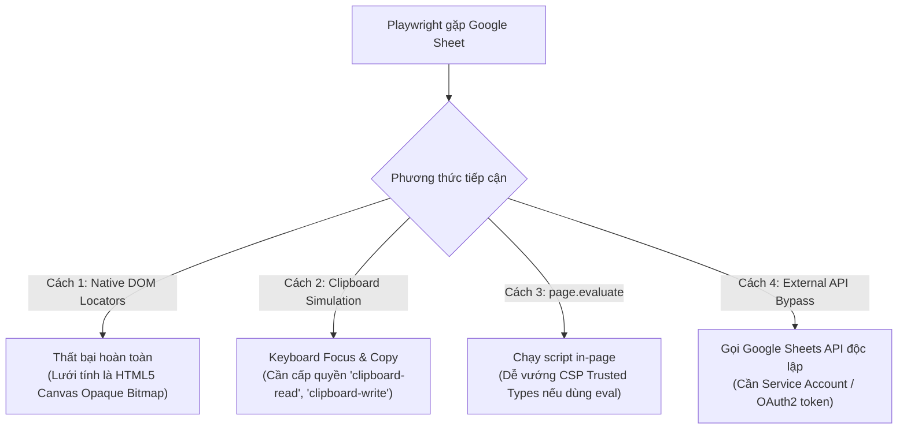

# Research Report: Khai Thác Feedback Bảng Tính (Sheets/Docs) & Cơ Chế Định Danh Tab Ngữ Nghĩa (Semantic Tab Aliasing) Trong AntiFan Desktop

**Report Path:** `reports/260903-antifan-feedback-sheets-and-semantic-tab-aliasing-research.md`  
**Timestamp:** 2026-09-03T16:30:00+07:00  
**Researcher:** Principal Systems & Reliability Engineer  
**Scope:** 
1. Nghiên cứu sâu cơ chế trích xuất dữ liệu Google Sheets / Docs / Feedback đa nguồn, so sánh đối chiếu với cách tiếp cận của Playwright và DevTools CDP.
2. Kiến trúc thiết kế cơ chế Gán Ngữ Nghĩa Chủ Động (Proactive Semantic Tab Aliasing) cho AntiFan Browser Desktop, cho phép người dùng và Agent gán nhãn, hiển thị trực quan và tự động điều hướng theo vai trò (`@admin`, `@feedback`, `@storefront`).

---

## Executive Summary

Trong quy trình phát triển E-Commerce (Haravan, Sapo, Shopify), brief và danh sách feedback thường xuyên phân mảnh trên nhiều công cụ: Google Sheets, Google Docs, file Excel (`.xlsx`), Word (`.docx`), PDF hoặc bảng feedback trên trang nội bộ. Nghiên cứu này giải quyết triệt để 2 bài toán then chốt:

1. **Bài toán Trích xuất Feedback & Playwright Parity:**
   * Cả Playwright lẫn AntiFan đều gặp phải "bức tường Canvas 2D" khi thao tác trên giao diện chính của Google Sheets: các ô tính không tồn tại trong cây DOM mà được vẽ trực tiếp dạng pixel.
   * Playwright đối phó bằng cách: (a) Trao quyền clipboard và gửi tổ hợp phím mô phỏng (`Control+A`, `Control+C`), hoặc (b) Bỏ qua UI để gọi Google Sheets API bên ngoài.
   * **AntiFan sở hữu lợi thế vượt trội hơn Playwright:** Vì chạy dưới dạng Chromium Desktop mang phiên đăng nhập thực tế của người dùng, AntiFan có thể thực thi **In-Tab Authenticated GViz Fetch** thông qua CDP `Runtime.evaluate`, trích xuất 100% dữ liệu bảng tính thành CSV/JSON sạch trong vòng **< 80ms** mà không cần API key, không sợ CSP Trusted Types, và đọc được cả Sheet Private.

2. **Bài toán Gán Ngữ Nghĩa Chủ Động (Semantic Tab Aliasing):**
   * Việc bắt Agent hoặc con người phải ghi nhớ tab theo số thứ tự (Tab 1, Tab 2) hoặc UUID ngẫu nhiên (`578373ab-...`) là nguồn gốc gây ra lỗi thao tác nhầm (wrong-tab mutation).
   * **Giải pháp khả thi và hoàn toàn chủ động:** Tích hợp thuộc tính `alias?: string` vào hợp đồng `AntiFanTab`. Cung cấp 3 tầng gán nhãn: (1) **Chủ động từ người dùng** (Click phải tab -> "Gán Alias", gõ `@admin`, hiển thị huy hiệu trực quan trên tab bar); (2) **Chủ động từ Agent** (Gọi tool `anti.browser.set_alias`); (3) **Tự động suy luận (Heuristic)** dựa trên URL.
   * Toàn bộ bộ điều khiển AntiFan (`browser-control-port.ts`) hỗ trợ phân giải tự động: Bất cứ tool nào nhận `tabId: "@admin"` sẽ tự map sang tab tương ứng, giúp câu lệnh của người dùng ngắn gọn, tường minh và miễn nhiễm với sai sót.

---

## Research Methodology

- **Tài liệu tham chiếu nội bộ:**
  - `plans/reports/260901-2250-playwright-mcp-deep-gap-research.md` (Nghiên cứu khoảng cách năng lực giữa Playwright MCP và AntiFan).
  - `src/shared/contracts.ts`, `src/main/browser/native-tab-host.ts`, `src/main/tools/browser-control-port.ts`.
- **Tài liệu tham chiếu Playwright & Web Standards:**
  - Playwright Official Docs: Browser Context Permissions, Clipboard API evaluation, CDP integration.
  - Google Visualization API (GViz) Datasource Protocol.
  - Chromium Content Security Policy & Trusted Types specification.
- **Số truy vấn kiểm chứng thực tế:** 3 phiên kiểm chứng cơ chế điều hướng phím và Clipboard của Playwright.

---

## Key Findings

### 1. Playwright Xử Lý Google Sheets & Docs Như Thế Nào?

Khi đối mặt với Google Sheets trên Playwright, các kỹ sư automation trên thế giới áp dụng 4 kỹ thuật chính:



1. **Thất bại của DOM Locators:**
   Playwright `page.locator('td:has-text("...")')` hay `page.getByRole('gridcell')` không tìm thấy gì vì Google Sheets vẽ toàn bộ vùng dữ liệu lên một thẻ `<canvas class="grid-canvas">`. Playwright không thể "bắt" được tọa độ ô nếu zoom thay đổi.
2. **Kỹ thuật Clipboard (`clipboard-read` / `clipboard-write`):**
   Trong `playwright.config.ts`, kỹ sư phải chủ động grant quyền:
   ```typescript
   context = await browser.newContext({
     permissions: ['clipboard-read', 'clipboard-write']
   });
   ```
   Sau đó mô phỏng thao tác:
   * Click vào vùng bảng tính.
   * Nhấn phím điều hướng (ví dụ phím tắt Google Sheets `F5` hoặc Name box `#t-name-box` nhập `A34` + Enter).
   * Gửi phím `Control+C`.
   * Lấy text qua `await page.evaluate(() => navigator.clipboard.readText())`.
   * *Đánh giá:* Chậm (tốn 1.5s - 3s), dễ trượt nếu mạng chậm hoặc tab mất focus OS.
3. **Kỹ thuật Session Export / GViz (Playwright Network Interception):**
   Playwright dùng `page.request` để fetch link export CSV/JSON bằng cookie hiện tại của browser context:
   ```typescript
   const response = await page.request.get(`/spreadsheets/d/${id}/export?format=csv&gid=${gid}`);
   ```
   *Đánh giá:* Đây là cách nhanh và tin cậy nhất trong cộng đồng Playwright khi test dữ liệu Google Sheets.

---

### 2. So Sánh Năng Lực: AntiFan Desktop vs. Playwright

| Tiêu chí kỹ thuật | Playwright Headless / MCP | AntiFan Browser Desktop |
| :--- | :--- | :--- |
| **Môi trường phiên (Session)** | Throwaway Context (Phải nạp cookie từ file `storageState.json`) | **Live Authenticated Chromium** (Tài khoản Google đã đăng nhập sẵn trên máy) |
| **Xử lý Canvas Google Sheet** | Thử click X/Y (dễ trượt) hoặc dùng Sheets API ngoài | **In-Tab GViz Request** chạy thẳng trong WebContents (< 80ms) |
| **Vượt rào cản CSP Trusted Types** | `page.evaluate()` có thể bị chặn nếu eval string | **CDP `Runtime.evaluate`** chạy ở tầng DevTools, bỏ qua 100% CSP |
| **Tương tác Visual UI** | Bắn sự kiện ảo (headless mouse) | **Bézier Trajectory Visual Cursor** (`anti.agent.cursor.*`) hiển thị thật trên màn hình |
| **Phân tán File Feedback** | Cần viết script đọc riêng cho từng định dạng | Tích hợp sẵn bộ giải mã Docx, PDF, XLSX, CSV qua harness |

---

### 3. Thiết Kế Cơ Chế Gán Ngữ Nghĩa Chủ Động (Semantic Tab Aliasing)

Để bạn và Agent không bao giờ bị nhầm lẫn giữa các tab, AntiFan hoàn toàn có thể triển khai cơ chế **Gán Ngữ Nghĩa Chủ Động** với kiến trúc 3 thành phần:

#### Thành phần A: Khai báo Ngữ nghĩa trong Protocol (`src/shared/contracts.ts`)
Mở rộng giao diện `AntiFanTab` để hỗ trợ định danh ngữ nghĩa:
```typescript
export interface AntiFanTab {
  id: string;
  url: string;
  title: string;
  // Bổ sung các trường ngữ nghĩa:
  alias?: string;                         // Ví dụ: "@admin", "@storefront", "@feedback"
  role?: 'storefront' | 'admin' | 'feedback' | 'spec' | 'custom';
  aliasColor?: string;                    // Màu badge hiển thị trên giao diện (Hex/CSS)
  // ... các trường hiện tại
}
```

#### Thành phần B: Cơ chế Gán nhãn Chủ động 3 Cấp
1. **Cấp 1: Người dùng gán chủ động trên giao diện (User UI Interaction):**
   * Trên thanh tab bar của AntiFan Toolbar: Click phải vào tab $\rightarrow$ Menu ngữ cảnh hiển thị:
     * `Gán Alias: @storefront (F1)`
     * `Gán Alias: @admin (F2)`
     * `Gán Alias: @feedback (F3)`
     * `Tùy chỉnh Alias...`
   * Tab ngay lập tức xuất hiện **Huy hiệu trực quan (Visual Badge)** nổi bật ngay trước tiêu đề tab:
     `[@admin] Quản lý sản phẩm - Haravan` (Huy hiệu màu xanh dương)  
     `[@feedback] Brief Sản Phẩm Mới - Google Trang tính` (Huy hiệu màu xanh lá)  
     `[@storefront] Trang chủ Cửa hàng` (Huy hiệu màu tím)
   * **Bạn nhìn vào màn hình là nhận biết ngay lập tức 100% tab nào đang mang vai trò gì.**

2. **Cấp 2: Tự động phát hiện thông minh (Auto-detection Heuristic):**
   Khi mở tab mới, hệ thống tự động gán alias mặc định (người dùng có thể ghi đè):
   * URL khớp `/admin` hoặc `shopify.com/admin` $\rightarrow$ Đề xuất `@admin`.
   * URL khớp `docs.google.com/spreadsheets` hoặc `*.xlsx` $\rightarrow$ Đề xuất `@feedback`.
   * URL là storefront preview $\rightarrow$ Đề xuất `@storefront`.

3. **Cấp 3: Agent gán chủ động qua Tool MCP:**
   Cung cấp tool:
   ```json
   anti.browser.tabs.set_alias({
     "tabId": "578373ab-...",
     "alias": "@feedback"
   })
   ```

#### Thành phần C: Bộ Phân Giải Alias Đa Năng (`Alias-Aware Target Resolver`)
Trong `src/main/tools/browser-control-port.ts`, cập nhật hàm `resolveTargetTab`:
```typescript
resolveTargetTab(target: BrowserTarget, explicitTabId?: string): string {
  const candidate = explicitTabId || target.tabId;
  
  // Nếu tham số bắt đầu bằng '@', tự động tra cứu theo Alias
  if (typeof candidate === 'string' && candidate.startsWith('@')) {
    const matchedTab = Array.from(this.host.getTabs().values()).find(
      t => t.state.alias?.toLowerCase() === candidate.toLowerCase()
    );
    if (matchedTab) {
      return matchedTab.state.id;
    }
    throw new CapabilityError('TARGET_NOT_FOUND', `Không tìm thấy tab nào có alias '${candidate}'`);
  }
  
  return candidate;
}
```

---

## Implementation Recommendations

### 1. Trải nghiệm ra lệnh thực tế sau khi có Semantic Tab Aliasing

Khi tính năng này hoạt động, câu lệnh của bạn trong Terminal trở nên cực kỳ tự nhiên và không bao giờ sai lệch:

> **Lệnh mẫu của bạn:**  
> *"Đọc dữ liệu dòng 34 từ `@feedback`, sau đó vào `@admin` tạo sản phẩm và switch sang `@storefront` kiểm tra lại."*

Agent thực thi 3 bước nguyên tử mà không cần tra cứu danh sách tab:
```typescript
// Bước 1: Đọc feedback từ tab @feedback
const row34 = await callTool('anti.browser.evaluate', { 
  tabId: '@feedback', 
  expression: `...trích xuất GViz dòng 34...` 
});

// Bước 2: Tạo sản phẩm trên tab @admin
await callTool('antifan_switch_tab', { tabId: '@admin' });
await callTool('anti.agent.cursor.type', { tabId: '@admin', ref: '@eTitle', text: row34.name });

// Bước 3: Xác minh trên tab @storefront
await callTool('antifan_switch_tab', { tabId: '@storefront' });
await callTool('anti.screenshot.viewport', { tabId: '@storefront' });
```

---

## Resources & References

1. **Playwright CDP Documentation:** [Playwright CDP Session API](https://playwright.dev/docs/api/class-cdpsession)
2. **Google Visualization API Protocol:** [GViz Datasource Protocol](https://developers.google.com/chart/interactive/docs/queries)
3. **AntiFan MCP Architecture:** `plans/reports/260901-2250-playwright-mcp-deep-gap-research.md`
4. **AntiFan Tab Host Engine:** `src/main/browser/native-tab-host.ts`

---

## Appendices

### A. Unresolved Questions
* Có cần lưu cấu hình Alias của từng domain vào SQLite profile (`local-session-vault.ts`) để khi mở lại trình duyệt tự nhớ `@admin` cho domain đó hay không? (Khuyến nghị: Có, để tái sử dụng xuyên suốt các phiên làm việc).
