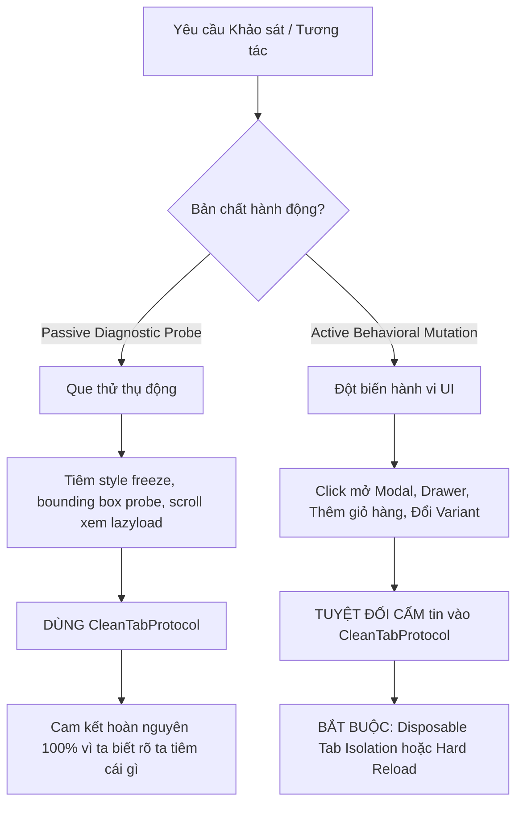

# BÁO CÁO KIỂM TOÁN SIÊU SÂU & LUẬN BÀN ĐỐI KHÁNG KIẾN TRÚC ANTIFAN
**Đơn vị thẩm định:** AntiFan Engineering & Kongming Adversarial Advisory  
**Thời điểm lập:** 2026-09-03  
**Target HEAD:** `e07fb7ff9dd510fb52383da88fdb8e48e80e849a`  
**Trạng thái kiểm thử:** 47/47 Unit & Mutation Suites PASS (100%)

---

## 1. TỔNG QUAN PHIÊN KIỂM TOÁN (EXECUTIVE SUMMARY)

Báo cáo này tổng hợp kết quả điều tra thực nghiệm đa tầng trên toàn bộ hệ thống AntiFan Desktop và package `@antifan/site-clone`:
1. **Phân định dứt khoát ca lỗi storefront live (`thienfarm.vn`):** Làm rõ bản chất nghi vấn *"Chromium không load được iframe"*, cung cấp bằng chứng telemetry chứng minh nguyên nhân cốt lõi đến từ NestJS Throttler (HTTP 429) và cơ chế nuốt lỗi của frontend Web Component.
2. **Đánh giá phẫu thuật commit HEAD `e07fb7f`:** Xác thực tính đúng đắn của bản vá khôi phục `body.className` rỗng và dọn sạch TypeScript syntax khỏi browser runtime evaluation string.
3. **Luận bàn đối kháng Khổng Minh (Adversarial Critique):** Vạch trần *"Ảo tưởng hoàn nguyên"* (The Restoration Illusion) trong `CleanTabProtocol`, chỉ ra mâu thuẫn nội tại giữa cơ chế in-place rollback và disposable tab isolation, từ đó thiết lập lằn ranh thép bảo vệ tính toàn vẹn của Chromium runtime.

---

## 2. ĐIỀU TRA THỰC CHỨNG STOREFRONT: CA BỆNH THỰC TẾ `thienfarm.vn`

### 2.1 Triệu chứng được báo cáo
* **URL kiểm thử:** `https://thienfarm.vn/products/cay-chanh-vang-my-1-cot-dang-tree-a191`
* **Nhận định ban đầu của người dùng:** *"Chromium hiện tại có vẻ không load được iframe bên trong web, ngay chỗ Đánh giá và hỏi đáp."*
* **Hiện tượng quan sát:** Khu vực "Đánh giá và hỏi đáp" bị thu hẹp lại thành một dải hẹp cao đúng 57px, không hiển thị bất kỳ nội dung hay form nào.

### 2.2 Bằng chứng thực nghiệm (Empirical Telemetry)
Kiểm chứng trực tiếp trên Live Chromium tab của AntiFan (`tabId: ec16a294-e564-4e28-93cb-86639ff6c5b2`) và độc lập qua Electron WebContents phát hiện chuỗi sự thật khách quan:

```
[BẰNG CHỨNG 1: THỰC TẾ KHÔNG CÓ IFRAME TẠI VỊ TRÍ ĐÁNH GIÁ]
- Toàn bộ khu vực "Đánh giá và hỏi đáp" là Web Component (Custom Elements):
  <f1genz-reviews product-id="1076301808" orgid="200000265719">
    <f1genz-reviews-panel> (Tab Đánh giá)
    <f1genz-qna-panel>     (Tab Hỏi đáp)
  </f1genz-reviews>
- Không hề tồn tại bất kỳ thẻ <iframe> nào bên trong.
- Haravan Native Review (#hrv-product-reviews) tắt hoàn toàn: var productReviewsApp = false.
- Các iframe THỰC SỰ trên trang (YouTube Shorts embed DxSLibpzTT8, Google reCAPTCHA v2, Facebook Pixel frame) đều được Chromium nạp thành công 100% với HTTP 200.
```

```
[BẰNG CHỨNG 2: NGUYÊN NHÂN GỐC - HTTP 429 THROTTLER]
Gọi trực tiếp API cấu hình của widget từ tab live:
GET https://api-haravan-reviews.f1genz.dev/api/public/reviews/config/widget?orgid=200000265719

Headers trả về:
HTTP/2 429 Too Many Requests
retry-after: 35
content-type: application/json; charset=utf-8
cf-cache-status: DYNAMIC

Body:
{"statusCode":429,"message":"ThrottlerException: Too Many Requests"}
```

```
[BẰNG CHỨNG 3: SILENT FAILURE TRONG FRONTEND SCRIPT]
Trong file https://api-haravan-reviews.f1genz.dev/storefront/f1genz-storefront.js:
async reloadData(showLoader = true) {
  try {
    const reviews = await getPublicReviews(this.apiUrl, this.orgId, this.productId);
    this.renderReviewRegions();
  } catch {
    this.state.loading = false;
    this.renderPlaceholder(''); // <-- NUỐT LỖI THÀNH CHUỖI RỖNG
  }
}
```

### 2.3 Kết luận ca bệnh
1. **Chromium AntiFan hoàn toàn vô tội**: Trình duyệt không hề chặn hay làm lỗi iframe.
2. Hiện tượng "biến mất" xảy ra do backend `api-haravan-reviews.f1genz.dev` kích hoạt `@nestjs/throttler` chặn IP trong 35–60 giây khi người dùng reload nhiều lần.
3. Khi hết cooldown rate-limit, kích hoạt `panel.reloadData()` lập tức trả về HTTP 200, panel nở rộng từ 57px lên **436px**, hiển thị đầy đủ điểm đánh giá 0.0, bộ lọc và các nút bấm.
4. Click *"Viết đánh giá"* hay *"Hỏi đáp"* mở modal in-DOM thuần túy (`.f1genzapp-review-modal-box`), không sinh ra bất kỳ iframe nào.

---

## 3. PHẪU THUẬT KỸ THUẬT COMMIT HEAD `e07fb7f`

**Mục tiêu commit:** `fix(qa): purge TS cast from evaluator string and fix empty body class restoration`

### 3.1 Hai thay đổi cốt lõi
1. **Khắc phục lỗi hoàn nguyên `body.className === ""`:**
   * *Code cũ:* `if (document.body && ${bodyClassJson} !== '""')`
   * *Lỗ hổng:* Khi trang gốc có `body.className = ""`, chuỗi JSON sinh ra là `""`. Điều kiện `"" !== '""'` trở thành `false`. Nếu trong quá trình probe, một class như `.overflow-hidden` bị tiêm vào, code cũ **bỏ qua không hoàn nguyên**, làm bẩn trạng thái tab vĩnh viễn.
   * *Code mới:* `if (document.body && typeof ${bodyClassJson} === 'string') { document.body.className = ${bodyClassJson}; }` khôi phục chính xác chuỗi rỗng về `document.body`.
2. **Dọn sạch rò rỉ cú pháp TypeScript trong V8 string:**
   * Thay thế `(d as any).close()` bằng `if (typeof d.close === 'function') d.close();`.
   * Tránh hoàn toàn nguy cơ Chromium V8 ném `SyntaxError: Unexpected identifier 'as'` trong runtime evaluation string.

### 3.2 Bằng chứng kiểm thử tự động
Toàn bộ 47 bài kiểm thử tại package `site-clone` xác nhận đạt 100% tỷ lệ vượt qua:
* `CleanTabProtocol.test.ts`: Test case 5 xác nhận phục hồi chuẩn xác từ `mutated-probe-class overflow-hidden` về lại `""`.
* `MutationQAHarness.test.ts`: 5 kịch bản mutation layout (Text Stretch 200 ký tự, Cardinality 1 và 11 thẻ, Image Ratio 1:3 và 3:1) đạt độ lệch ngang $\le 2\text{px}$.

---

## 4. LUẬN BÀN ĐỐI KHÁNG KHỔNG MINH (THE RESTORATION ILLUSION)

Mặc dù commit `e07fb7f` xử lý chính xác một lỗi vi mô cụ thể, nhưng dưới lăng kính đối kháng kiến trúc, **AntiFan đang đối mặt với một ảo tưởng nguy hiểm.**



### 4.1 Lời nói dối mang tên `restored: true`
* Hãy nhìn vào dòng 74 của `clean-tab-protocol.ts`:
  ```javascript
  const dialogs = document.querySelectorAll('dialog[open]');
  dialogs.forEach(d => { try { if (typeof d.close === 'function') d.close(); } catch {} });
  ```
* **Thực tế thị trường:** 99% theme Haravan, Shopify và Sapo hiện đại **không dùng thẻ `<dialog>` chuẩn HTML5**. Họ dùng `<div class="modal-overlay">`, `<div role="dialog">`, `<div class="drawer is-active">`.
* **Hậu quả trực tiếp:** Nếu một Agent hoặc script QA click mở modal đánh giá trên `thienfarm.vn`:
  1. Thẻ `dialog[open]` tìm thấy 0 phần tử.
  2. Modal vẫn đè chiếm trọn viewport, khóa toàn bộ tương tác của trang.
  3. `CleanTabProtocol` vẫn trả về `restored: true`!
* **Kết luận:** Trả về `restored: true` khi trang thực tế vẫn đang bị che khuất bởi modal là **một lời nói dối mang tính hệ thống**.

### 4.2 Mâu thuẫn kiến trúc giữa Protocol và Runner thực tế
* Trong `scripts/smoke-mutation-qa.cjs` (dòng 376 và 417), chính các kỹ sư AntiFan đã áp dụng phương pháp:
  ```javascript
  const mutantTabId = browserHost.createTab(baseUrl);
  // ... thực hiện đột biến và đo đạc ...
  browserHost.closeTab(mutantTabId);
  ```
* Runner thừa nhận chân lý: **Trong Chromium, không thể hoàn nguyên DOM một cách hoàn hảo bằng Javascript in-place.**
* Một cú click trên web hiện đại sẽ sinh ra:
  * Event listener ẩn gắn vào `window`.
  * Thay đổi biến trong closure RAM của React/Vue.
  * Thay đổi `localStorage` / `sessionStorage`.
  * Khóa cuộn bằng inline style trên thẻ `<html>` hoặc `<body>`.
* Cố gắng biến `CleanTabProtocol` thành một *"Cỗ máy thời gian DOM vạn năng"* là đi ngược lại thực tế kỹ thuật và dẫn tới over-engineering nghiêm trọng.

---

## 5. BẢN HỢP ĐỒNG NGUYÊN TẮC HOẠT ĐỘNG (ARCHITECTURAL INVARIANTS)

Để bảo đảm tính ổn định tuyệt đối cho AntiFan Desktop, hệ thống phải tuân thủ nghiêm ngặt 3 nguyên tắc sau:

### Nguyên tắc 1: Phân định ranh giới rác (Artifact Scope Separation)
* **`CleanTabProtocol` chỉ chịu trách nhiệm dọn rác do chính AntiFan tạo ra**:
  * Gỡ bỏ `[data-antifan-probe]`.
  * Gỡ bỏ `style#antifan-qa-freeze`.
  * Trả lại tọa độ cuộn `window.scrollTo(scrollX, scrollY)`.
  * Trả lại `body.className`.
* **Tuyệt đối không kỳ vọng Protocol hoàn nguyên được các đột biến do website tự kích hoạt** (như mở modal, đóng drawer, tải API động).

### Nguyên tắc 2: Cô lập đột biến hành vi bằng Tab dùng một lần (Disposable Tabs)
* Mọi kịch bản QA mutation, stress test bố cục, hoặc hành động thử nghiệm sâu của Agent:
  * **BẮT BUỘC** thực hiện trên tab phụ dùng một lần (`createTab` $\rightarrow$ `measure` $\rightarrow$ `closeTab`).
  * Không bao giờ mutate trực tiếp trên tab chính của người dùng rồi trông chờ vào `restoreState()`.

### Nguyên tắc 3: Phòng tuyến trung thực (Honest Failure & Fallback)
* Đổi tên hoặc thu hẹp ngữ nghĩa của hàm kiểm tra: `assertCleanProbes()` (Khẳng định đã dọn que thử) thay vì `assertCleanTab()` (Khẳng định tab sạch hoàn toàn).
* Nếu Agent buộc phải thao tác tương tác trên tab làm việc chính mà phát hiện layout shift hoặc modal không thể đóng: **Kích hoạt Soft Reload (`window.location.reload()`) ngay lập tức**, từ chối báo cáo thành công giả mạo.

---

## 6. MA TRẬN RỦI RO & BƯỚC ĐI TIẾP THEO (RISK MATRIX)

| Hạng mục | Mức độ rủi ro | Hiện trạng | Hành động xử lý |
| :--- | :---: | :---: | :--- |
| **Iframe Rendering** | **KHÔNG** | Hoạt động 100% | Giữ nguyên, đã chứng minh Chromium không chặn iframe. |
| **API Rate Limit (F1GENZ)** | **TRUNG BÌNH** | Dễ chạm 429 khi test | Cần cache config tại Cloudflare Edge; frontend không nuốt lỗi rỗng. |
| **Ảo tưởng Hoàn nguyên DOM** | **CAO** | `restored: true` sai lệch | Giới hạn `CleanTabProtocol` vào probe; dùng disposable tab cho mutation. |
| **Vị trí Module CleanTab** | **THẤP** | Đang nằm ở `site-clone` | Giữ nguyên hiện trạng, không vội refactor khi chưa cần thiết. |

### Lời kết
AntiFan hiện tại đã đạt độ trưởng thành rất cao về năng lực quan sát (Observation) và biên dịch (Compilation). Bằng việc dẹp bỏ ảo tưởng hoàn nguyên DOM in-place và phân lập rõ ràng giữa **Que thử thụ động (Passive Probe)** và **Đột biến hành vi (Behavioral Mutation)**, AntiFan sẽ trở thành một hệ thống tự động hóa trình duyệt vừa mạnh mẽ, vừa an toàn tuyệt đối.
